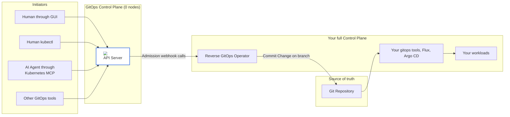

# GitOps Reverser

GitOps Reverser is a Kubernetes operator that turns live API activity into clean, versioned YAML in Git. It receives events from the Kubernetes API server by admission webhook calls, sanitizes them, and commits to your repository with rich metadata. By doing so it's providing an immediate, human‑readable audit trail while keeping Git as the source of truth.

## Why

Today teams have to choose between workflows:
- Pure GitOps: safe and auditable, but slow for simple changes and unfriendly to non‑experts.
- API‑first: fast and interactive, but drifts from Git and loses auditability.

Reverse GitOps gives you both: the interactivity of the Kubernetes API with Git’s safety and traceability. Users, CLIs, and automations talk to a lightweight control plane; the operator immediately reflects desired state to Git.



## How it works

- Capture: Validating/Admission webhook receives Kubernetes API requests.
- Sanitize: Remove status and server‑managed fields; format as clean YAML.
- Queue: Buffer events to handle spikes reliably.
- Commit: Annotate with user, operation, namespace, timestamp; commit to Git.
- Push: Let your existing GitOps tooling reconcile as usual.

## Status

🚨 Early stage software. CRDs and behavior may change; not recommended for production yet. Feedback and contributions are welcome.

## Quick start (minimal)

Prerequisites:
- A Kubernetes cluster with kubectl configured
- A Git repository (write access)
- cert‑manager for webhook TLS

Install:
```bash
kubectl apply -f https://github.com/cert-manager/cert-manager/releases/download/v1.16.2/cert-manager.yaml
kubectl apply -f https://github.com/ConfigButler/gitops-reverser/releases/latest/download/install.yaml
```

Configure Git access:
- Follow the GitHub setup guide to create an SSH key and Kubernetes Secret.
- Guide: docs/GITHUB_SETUP_GUIDE.md

Apply minimal samples:
```bash
# Create a GitRepoConfig and a WatchRule
kubectl apply -f config/samples/configbutler.ai_v1alpha1_gitrepoconfig.yaml
kubectl apply -f config/samples/configbutler.ai_v1alpha1_watchrule.yaml
```

See more examples in config/samples/.

## Usage guidance

Avoid infinite loops: Do not point traditional GitOps (Argo CD/Flux) and GitOps Reverser at the same resources in fully automated mode. Recommended patterns:
- Audit‑only (capture changes, no enforcement)
- Human‑in‑the‑loop (hotfix in cluster, capture to Git, review/merge)
- Drift detection (use commits as alert inputs)
- Hybrid (traditional GitOps for infra; Reverser for app/config changes)

## Monitoring

Exposes basic OpenTelemetry metrics. See config/prometheus/ for example manifests.

## Learn more

- Design overviews and deeper docs are under docs/.
- Sample CRs: config/samples/
- Development: CONTRIBUTING.md and TESTING.md

## Other options to consider

| **Tool** | **How it Works** | **Key Differences** | 
|---|---|---|
| [RichardoC/kube-audit-rest](https://github.com/RichardoC/kube-audit-rest) | An admission webhook that receives audit events and exposes them over a REST API. | **Action vs. Transport:** `kube-audit-rest` is a transport layer. GitOps Reverser is an *action* layer that consumes the event and commits it to Git. | 
| [robusta-dev/robusta](https://github.com/robusta-dev/robusta) | A broad observability and automation platform. | **Focused Tool vs. Broad Platform:** Robusta is a large platform. GitOps Reverser is a small, single-purpose utility focused on simplicity and low overhead. | 
| [bpineau/katafygio](https://github.com/bpineau/katafygio) | Periodically scans the cluster and dumps all resources to a Git repository. | **Event-Driven vs. Snapshot:** Katafygio is a backup tool. GitOps Reverser is event-driven, providing a real-time audit trail. | 

## Contributing

Contributions, issues, and discussions are welcome.

## License

Apache 2.0
