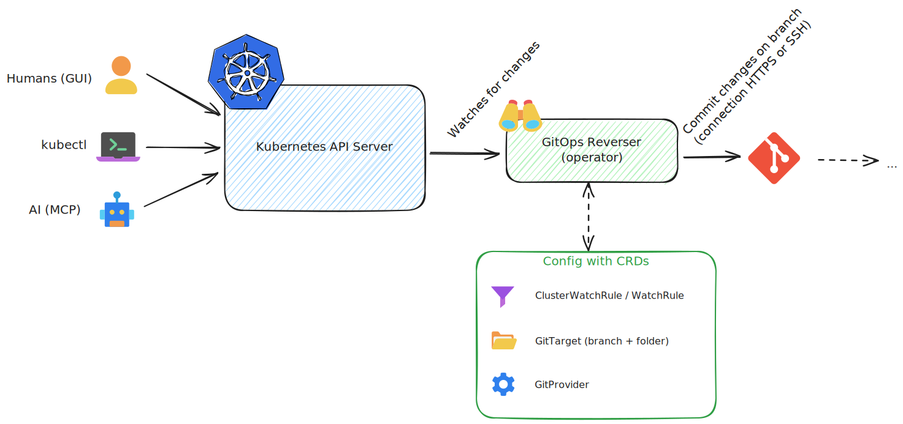
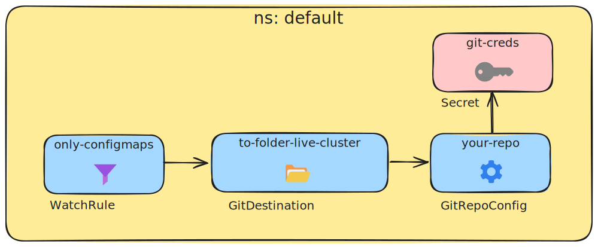

[](https://github.com/ConfigButler/gitops-reverser/actions/workflows/ci.yml)
[](https://github.com/ConfigButler/gitops-reverser/releases)
[](https://www.apache.org/licenses/LICENSE-2.0)
[](go.mod)
[](#)
[](https://goreportcard.com/report/github.com/ConfigButler/gitops-reverser)
[](https://github.com/ConfigButler/gitops-reverser/pkgs/container/gitops-reverser)
[](https://github.com/ConfigButler/gitops-reverser/issues)

# GitOps Reverser

GitOps Reverser is a Kubernetes operator that turns live API activity into clean, versioned YAML in Git. It receives events from the Kubernetes API server, sanitizes them, and commits them to your repository with rich metadata. This results in a folder with YAML files that can be deployed to any cluster. The commit history is your perfect audit trail.

## Why

Today teams have to choose between workflows:
- Pure GitOps: safe and auditable, but unfriendly to non‑git users.
- API‑first: fast and interactive, but databases often don't offer the auditability that git provides.

Reverse GitOps gives you both: the interactivity of the Kubernetes API with Git's safety and traceability. Users, CLIs, and automations talk to a lightweight control plane; the operator immediately reflects desired state to Git.

### Converting API actions into Git commits



## How it works

- Capture: Admission webhook receives Kubernetes API requests.
- Sanitize: Remove status and server‑managed fields; format as clean YAML.
- Queue: Buffer events to handle spikes reliably.
- Commit: Annotate with user, operation, namespace, timestamp; commit to Git.
- Push: It's now in your git repo

## Status

🚨 This is early stage software. CRDs and behavior may change; not recommended for production yet. Feedback and contributions are very welcome!

On short term I'm planning to implement a listener for the [Kubernetes audit webhook](https://kubernetes.io/docs/tasks/debug/debug-cluster/audit/#webhook-backend). That will replace the watcher / webhook combination. It turns out that it's not possible to combine the watch events with their validatingwebhook in all edge cases.

## Quick start

Prerequisites:
- A Kubernetes cluster with kubectl configured
- A Git repository with write access
- cert‑manager for webhook TLS

**1. Install GitOps Reverser:**
```bash
kubectl apply -f https://github.com/cert-manager/cert-manager/releases/download/v1.19.1/cert-manager.yaml
kubectl apply -f https://github.com/ConfigButler/gitops-reverser/releases/latest/download/install.yaml
```

**2. Set up Git credentials:**

Create an SSH key and add it to your Git provider (GitHub, GitLab, Gitea):
```bash
ssh-keygen -t ed25519 -C "gitops-reverser@cluster" -f /tmp/gitops-reverser-key -N ""
# Add /tmp/gitops-reverser-key.pub to your Git provider as a deploy key
```

Create a Kubernetes Secret with the private key:
```bash
kubectl create secret generic git-creds \
  --from-file=ssh-privatekey=/tmp/gitops-reverser-key \
  --from-literal=known_hosts="$(ssh-keyscan github.com)"
```

See [`docs/GITHUB_SETUP_GUIDE.md`](docs/GITHUB_SETUP_GUIDE.md) for detailed setup instructions.

**3. Configure what to reconcile:**

Reconciliation sources and targets are configured by three types of custom resources (shown in blue). Create these to start watch configmaps:



```bash
# Edit to match your repository
cat <<EOF | kubectl apply -f -
apiVersion: configbutler.ai/v1alpha1
kind: GitRepoConfig
metadata:
  name: your-repo
spec:
  repoUrl: "git@github.com:yourorg/yourrepo.git"
  allowedBranches: ["test-gitops-reverser"]
  secretRef:
    name: git-creds
  push:
    interval: "1m"
    maxCommits: 10
---
apiVersion: configbutler.ai/v1alpha1
kind: GitDestination
metadata:
  name: to-folder-live-cluster
spec:
  repoRef:
    name: your-repo
  branch: test-gitops-reverser
  baseFolder: live-cluster
---
apiVersion: configbutler.ai/v1alpha1
kind: WatchRule
metadata:
  name: only-configmaps
spec:
  destinationRef:
    name: to-folder-live-cluster
  rules:
    - operations: [CREATE, UPDATE, DELETE]
      apiGroups: [""]
      apiVersions: ["v1"]
      resources: [configmaps]
EOF
```

**4. Test it:**
```bash
# Create a test ConfigMap
kubectl create configmap test-config --from-literal=key=value -n default

# Check your Git repository - you should see a new commit with the ConfigMap YAML
```

For cluster-wide resources (nodes, CRDs, etc.) or watching multiple namespaces, use [`ClusterWatchRule`](config/samples/). More examples in [`config/samples/`](config/samples/).

## Usage guidance

Avoid infinite loops: Do not point GitOps (Argo CD/Flux) and GitOps Reverser at the same resources in fully automated mode. Recommended patterns:
- Audit (capture changes, no enforcement)
- Human‑in‑the‑loop (hotfix in cluster, capture to Git, review/merge)
- Drift detection (use commits as alert inputs)
- Hybrid (traditional GitOps for infra; Reverser for app/config changes)

## Monitoring

Exposes basic OpenTelemetry metrics. See config/prometheus/ for example manifests.

## Learn more

- Design overviews and deeper docs are under docs/.
- Sample CRs: config/samples/
- Development: CONTRIBUTING.md and TESTING.md

## Other options to consider

| **Tool** | **How it Works** | **Key Differences** | 
|---|---|---|
| [RichardoC/kube-audit-rest](https://github.com/RichardoC/kube-audit-rest) | An admission webhook that receives audit events and exposes them over a REST API. | **Action vs. Transport:** `kube-audit-rest` is a transport layer. GitOps Reverser is an *action* layer that consumes the event and commits it to Git. | 
| [robusta-dev/robusta](https://github.com/robusta-dev/robusta) | A broad observability and automation platform. | **Focused Tool vs. Broad Platform:** Robusta is a large platform. GitOps Reverser is a small, single-purpose utility focused on simplicity and low overhead. | 
| [bpineau/katafygio](https://github.com/bpineau/katafygio) | Periodically scans the cluster and dumps all resources to a Git repository. | **Event-Driven vs. Snapshot:** Katafygio is a backup tool. GitOps Reverser is event-driven, providing a real-time audit trail. | 

## Contributing

Contributions, issues, and discussions are welcome.

## License

Apache 2.0
