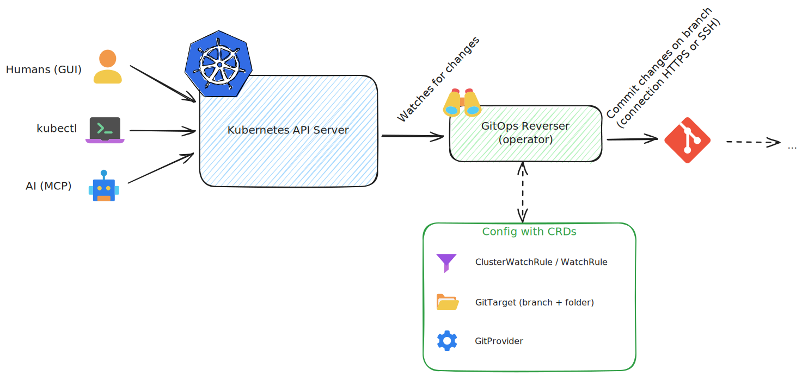
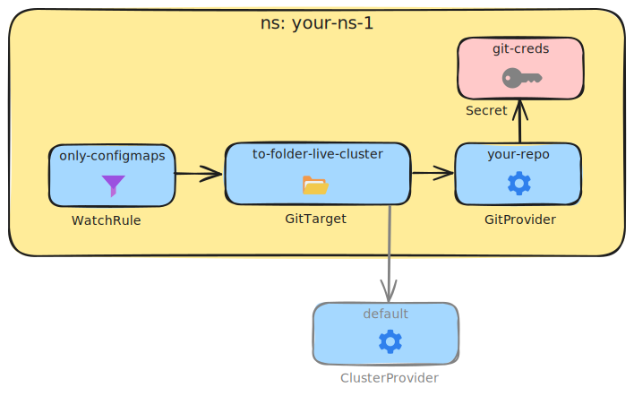

[](https://github.com/ConfigButler/gitops-reverser/actions/workflows/ci.yml)
[](https://github.com/ConfigButler/gitops-reverser/releases)
[](https://www.apache.org/licenses/LICENSE-2.0)
[](go.mod)
[](#)
[](https://goreportcard.com/report/github.com/ConfigButler/gitops-reverser)
[](https://github.com/ConfigButler/gitops-reverser/pkgs/container/gitops-reverser)
[](https://github.com/ConfigButler/gitops-reverser/issues)

# GitOps Reverser

GitOps Reverser is a Kubernetes operator that turns live Kubernetes API activity into clean, versioned YAML in Git.
It gives API-first teams a Git audit trail and a deployable repo without forcing every change through Git first.

The broader pattern behind this project is described at [reversegitops.dev](https://reversegitops.dev).

<div align="center"></div>

Want proof? See this [example commit](https://github.com/ConfigButler/example-audit/commit/800a51e5a8edcccbc85c94d5fef7ef7cc8381b7b) in [ConfigButler/example-audit](https://github.com/ConfigButler/example-audit).

## Why

Today teams often choose between workflows:

- **Pure GitOps**: safe and auditable, but less friendly for users and tools that work through the Kubernetes API.
- **API-first**: fast and interactive, but it usually does not come with strong review, rollout safety, or change history.

GitOps Reverser bridges that gap: write to the Kubernetes API, and let the operator write the result to Git.



## How it works

Kubernetes has a built-in audit feature that streams every API server event to a webhook. GitOps Reverser receives these events, strips runtime noise from the object, and pushes a clean YAML commit within seconds, including the username of whoever made the change.

1. Receive the API event via the Kubernetes audit webhook.
2. Sanitize the object into stable YAML (intent only, no runtime fields).
3. Queue and batch writes safely via Valkey/Redis.
4. Commit and push to Git with useful metadata.

> **Note:** This works best on clusters you control: `k3s`, `k3d`, Talos, Kamaji. Managed platforms often do not expose enough access to configure the audit webhook.

## Status

🚨 Early stage software. CRDs and behavior may change. Not recommended for production yet.

- Single pod only (`replicas=1`); HA is not yet supported.
- Tests run against Kubernetes 1.35. Other versions may work but are not tested.
- Runtime behavior is deterministic; no AI or heuristics at runtime.

## Recommended usage

| Mode | Good fit | Notes |
|---|---|---|
| Audit only | Capture live changes into Git | Safest starting point |
| Human in the loop | Hotfix in cluster, review later | Good migration path |
| Split ownership | API-first app resources, Git-first infra | Avoids shared write ownership |
| Controlled bi-directional | Shared paths that truly need both sides | Requires explicit coordination |

For shared resources, write through the Kubernetes API, let GitOps Reverser publish to Git, then let GitOps controllers acknowledge those commits in a controlled way. Do **not** let GitOps Reverser and Flux or Argo CD continuously reconcile the same resources. That creates loops and extra commits.

See [`docs/bi-directional.md`](docs/bi-directional.md) for the coordination guide.

## Quick start

**Prerequisites**

- Kubernetes cluster with `kubectl` configured
- cert-manager for TLS certificate management
- Admin access to your kube-apiserver configuration (you need to configure the [audit webhook backend](https://kubernetes.io/docs/tasks/debug/debug-cluster/audit/#webhook-backend))
  - Managed platforms (e.g. EKS, GKE, AKS) don't allow this.
  - See [`docs/design/audit-webhook-api-server-connectivity.md`](docs/design/audit-webhook-api-server-connectivity.md) for more information.


**1. Install cert-manager**

```bash
kubectl apply -f https://github.com/cert-manager/cert-manager/releases/download/v1.19.1/cert-manager.yaml
kubectl wait --for=condition=ready pod -l app.kubernetes.io/instance=cert-manager -n cert-manager --timeout=300s
```

**2. Install Valkey with auth**

```bash
kubectl create namespace gitops-reverser
kubectl create secret generic valkey-auth \
  --namespace gitops-reverser \
  --from-literal=password="$(openssl rand -base64 32)"

helm repo add valkey https://valkey.io/valkey-helm/ && helm repo update
helm install valkey valkey/valkey --version 0.9.3 --namespace gitops-reverser \
  --set auth.enabled=true \
  --set auth.usersExistingSecret=valkey-auth \
  --set auth.aclUsers.default.passwordKey=password \
  --set "auth.aclUsers.default.permissions=~* &* +@all"
```

**3. Install GitOps Reverser**

```bash
helm install gitops-reverser \
  oci://ghcr.io/configbutler/charts/gitops-reverser \
  --namespace gitops-reverser \
  --create-namespace
```

**4. Configure kube-apiserver audit delivery**

After the install is up, read the Helm post-install notes. 

If you missed the post-install output, you can print it again with:

```bash
helm get notes gitops-reverser -n gitops-reverser
```

Follow the post-install instructions carefully: you will be able to configure your Kubernetes API server to forward audit events.

**5. Create Git credentials**

```bash
ssh-keygen -t ed25519 -C "gitops-reverser@cluster" -f /tmp/gitops-reverser-key -N ""
# Add /tmp/gitops-reverser-key.pub to your Git provider as a deploy key

kubectl create secret generic git-creds \
  --from-file=ssh-privatekey=/tmp/gitops-reverser-key \
  --from-literal=known_hosts="$(ssh-keyscan github.com)" \
  --dry-run=client -o yaml | kubectl apply -f -
```

See [`docs/GITHUB_SETUP_GUIDE.md`](docs/GITHUB_SETUP_GUIDE.md) for a full setup guide.

**6. Enable the starter Git configuration**



Use the chart's `quickstart` values so Helm creates a starter configuration `GitProvider`, `GitTarget`, and `WatchRule`

```bash
helm upgrade gitops-reverser \
  oci://ghcr.io/configbutler/charts/gitops-reverser \
  --namespace gitops-reverser \
  --reuse-values \
  --set quickstart.enabled=true \
  --set quickstart.gitProvider.url=git@github.com:<org>/<repo>.git
```

Then check that the starter resources become ready:

```bash
kubectl get gitprovider,gittarget,watchrule -n default
```

See [`docs/configuration.md`](docs/configuration.md) for the quickstart values, names, and follow-up configuration
options.

**7. Test it**

```bash
kubectl create configmap test-config --from-literal=key=value -n default
```

You should see a new commit in your Git repository within seconds.

> **Troubleshooting:** If no commit appears, check `kubectl logs -n gitops-reverser deploy/gitops-reverser`.

## Secrets and encryption

`Secret` resources go through the same pipeline, but sensitive values are encrypted before commit. Secret manifests are written as `*.sops.yaml`.

See [`docs/SOPS_AGE_GUIDE.md`](docs/SOPS_AGE_GUIDE.md) for working with Secrets, SOPS, age keys, bootstrap, and rotation.

## Known limitations

- Single controller pod only; HA not yet supported.
- Shared-resource bi-directional sync requires explicit coordination.
- Avoid multiple `GitProvider` configurations pointing at the same repository.

## Other tools to consider

| Tool | What it does | How GitOps Reverser differs |
|---|---|---|
| [robusta-dev/robusta](https://github.com/robusta-dev/robusta) | Broad observability and automation platform | GitOps Reverser is narrower and focused on Git write-back |
| [RichardoC/kube-audit-rest](https://github.com/RichardoC/kube-audit-rest) | Captures (partial!) cluster activity without access to Kubernetes API configuration | This tool might be usable for managed cluster. But only if it's possible to enable audit webhook forwarding |
| [bpineau/katafygio](https://github.com/bpineau/katafygio) | Periodically snapshots cluster resources into Git | GitOps Reverser is event-driven and commit-oriented |

## Development

This project includes a DevContainer for consistent development environments.

[](https://codespaces.new/ConfigButler/gitops-reverser)

- Linux/macOS: works with Docker Desktop or Docker Engine.
- Windows: see [`docs/ci/WINDOWS_DEVCONTAINER_SETUP.md`](docs/ci/WINDOWS_DEVCONTAINER_SETUP.md).

```bash
make test
make test-e2e
make lint
```

## Contributing

Contributions, issues, and discussions are welcome.

## Get in touch

- Read the [Reverse GitOps manifesto](https://reversegitops.dev/) ⭐ for the broader pattern behind this work.
- Connect on [LinkedIn](https://www.linkedin.com/in/simonkoudijs/); feedback and ideas always welcome.

## License

Apache 2.0
