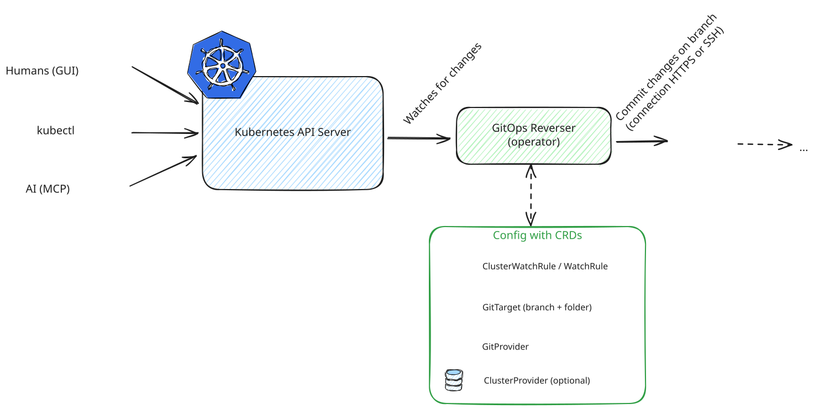
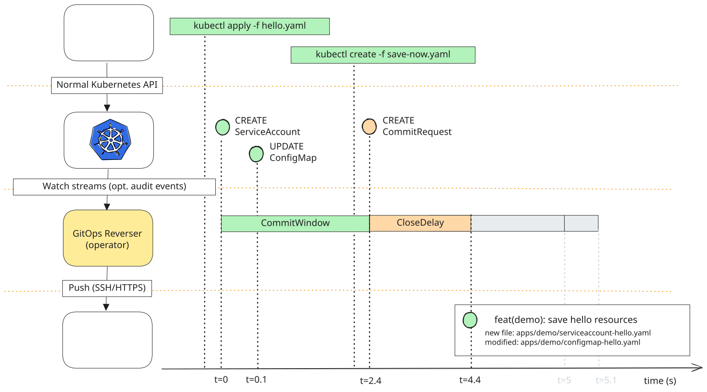

<!-- Badges lead this file on purpose; the H1 follows them. -->
<!-- markdownlint-disable-next-line MD041 -->
[](https://github.com/ConfigButler/gitops-reverser/actions/workflows/ci.yml)
[](https://scorecard.dev/viewer/?uri=github.com/ConfigButler/gitops-reverser)
[](https://www.bestpractices.dev/projects/13468)
[](https://github.com/ConfigButler/gitops-reverser/releases)
[](https://codecov.io/gh/ConfigButler/gitops-reverser)
[](https://www.apache.org/licenses/LICENSE-2.0)

[](https://github.com/ConfigButler/gitops-reverser/pkgs/container/gitops-reverser)
[](https://artifacthub.io/packages/search?repo=gitops-reverser)
[](https://github.com/ConfigButler/gitops-reverser/issues)

# GitOps Reverser

GitOps Reverser watches selected Kubernetes resources and commits a clean YAML representation to Git.
It strips `status`, `managedFields`, and runtime metadata. For supported layouts, it updates existing
manifests in place, preserving comments and document structure.

Use it to capture live changes, bring an existing cluster into Git, or experiment with API-first
workflows alongside Flux or Argo CD.

It is early-stage software: one controller pod, `v1alpha3` APIs that can still change, and a fit for
labs and pilots rather than production. [Before you adopt it](#before-you-adopt-it) has the detail.

<div align="center">
  
</div>

Inspect an [example commit](https://github.com/ConfigButler/example-audit/commit/800a51e5a8edcccbc85c94d5fef7ef7cc8381b7b).
Named Kubernetes actors in Git history require optional
[audit attribution](docs/attribution-setup-guide.md); the default uses a configured Git identity.

## How it works

Changes reach the Kubernetes API however your users make them: `kubectl`, a GUI, a CI job, or an
agent over MCP. The operator watches the resources you claim, sanitizes each change, and writes it
to the branch and folder you configured.



1. **Watch** the Kubernetes API for the types each `GitTarget` claims. Watch is the single source of
   object state.
2. **Sanitize** the change and compare it against what Git already holds.
3. **Write** stable YAML to the target folder and push, grouping a burst of changes into one commit.

Custom resources configure all of it: a `GitProvider` holds the repository and credentials, a
`GitTarget` the branch and folder, a `WatchRule` or `ClusterWatchRule` the resources to claim, and a
`ClusterProvider` the source cluster to mirror from (the chart renders a `default` one).
[Configuration](docs/configuration.md) covers each of them.

## Features

- **Signed commits.** SSH signing through `GitProvider.spec.commit.signing`, including what it takes
  to earn a verified badge on your Git host. See [commit signing](docs/commit-signing.md).
- **Commit messages you control.** Separate templates for live windows, reconciles, and save
  requests. A bad template holds the target at `Validated=False` instead of surfacing at commit
  time. See [message templates](docs/commit-messages.md).
- **Encrypted Secrets.** SOPS + age encryption before commit, which Secret-shaped custom resources
  can opt into. See [SOPS and age](docs/sops-age-guide.md).
- **Metrics.** A Prometheus surface with copy-pasteable PromQL for the questions operators ask, and
  a named list of what is deliberately not instrumented. See
  [interpreting metrics](docs/interpreting-metrics.md).
- **Built for API-first clusters.** Publication is driven by API writes, not by polling, and a
  foreign push to the branch is an expected case the worker replays onto. See
  [API-first publication](docs/api-first-publication.md).
- **Bi-directional use, proven by tests.** A dedicated e2e corner runs Flux and Argo CD against the
  operator in CI and asserts the round trip settles without a commit loop. Shared-path concurrency
  is still experimental. See [bi-directional usage](docs/bi-directional.md).

## What it can write

Choose the resources to watch and the repository, branch, and folder to write into.

| Your source in Git | What you can do |
|---|---|
| Plain Kubernetes manifests | Capture resources and update their existing YAML documents |
| Supported Kustomize layouts | Update source manifests or image/replica declarations; add and remove resources |
| A Flux `HelmRelease` or Argo CD `Application` | Capture the declaration, including chart versions and inline values |
| Helm templates or standalone `values.yaml` | No writeback from rendered workloads |

Kustomize support includes local bases and overlays, with the base kept read-only when targeting an
overlay. Generators, components, remote bases, and several other transforms are unsupported. See the
[supported subset](docs/configuration.md#kustomize-support-in-the-target-path).

Select the resources that express your intent. For example, watch a `HelmRelease` to capture chart
settings. The operator cannot automatically distinguish authored resources from controller-generated
ones. See [choosing what to capture](docs/installing-apps-as-krm.md#the-design-decision-capture-intent-not-the-rendered-output).

## Quick start

Follow the [installation walkthrough](docs/quickstart.md) to capture ConfigMaps from a demo namespace
into a disposable repository. You need a Kubernetes cluster, `kubectl`, Helm 3, and Git write access.
The walkthrough includes cert-manager setup; Redis and audit delivery are optional.

The demo captures a live change:

```bash
kubectl create configmap test-config --from-literal=key=value -n gitops-reverser-quickstart-demo
```

Inspect the commit under `live-cluster/` in your repository. Then edit the ConfigMap and inspect the
next diff. The walkthrough includes status checks, troubleshooting, and cleanup.

## Batch changes into a commit

Changes for the same target and author share a commit window: each change restarts the timer, and
the commit is made after that much silence. Omitted, the window is `5s`; `0s` opts into a commit per
event. A `CommitRequest` can close an open window early and supply the commit message itself.



The picture shows the [commit-window example](docs/demo/commit-window.md) running. It carries the
manifests: a `GitTarget` with a `window`, a `WatchRule` selecting the two types, and the save request
that closes the window early. It runs on top of the quickstart above.

## Try it with your existing repo

Start with a [scratch branch](docs/configuration.md#seeing-what-a-target-will-do-before-it-does-it)
containing your existing manifests, with no reconciler deploying that branch. Select a small resource
scope and one destination folder. Inspect the initial commits before making a live edit, then check
which source files changed.

The operator pushes directly to the configured branch. If you later write to a branch that Flux or
Argo CD deploys, read the [bidirectional guide](docs/bi-directional.md) first. Live edits can be
reverted by the reconciler, and replaying a captured object can overwrite concurrent Git edits to
that same object. There is no field-level merge. Shared-resource workflows remain experimental.

## Before you adopt it

GitOps Reverser is early-stage software for labs and pilots. It runs as one controller pod, and its
`v1alpha3` APIs can change. Keep one `GitProvider` per repository to avoid uncoordinated writers.

- **Access:** the chart defaults to cluster-wide read access, including Secrets. Review
  [RBAC](docs/rbac.md) to restrict watched types and understand the remaining credential permissions.
- **History:** batching can collapse intermediate edits. Unpublished work is held in memory and can
  be lost on restart; recovery captures current state. Git history is not a complete event log.
- **Deletes:** the default mirrors observed delete events but retains documents absent from a
  reconnect snapshot. Choose a [deletion policy](docs/configuration.md#deletion-policy-specprunemode)
  that fits your repository.
- **Versions:** tested against Kubernetes `1.37` at the API level (envtest) and `1.36` end-to-end
  (k3s, which has no stable `1.37` release yet). Other versions may work but are not in the matrix.
  Running the image needs no Go, but anything importing this repo as a module
  (`pkg/manifestanalyzer`, for example) is bound by the `go` directive in [`go.mod`](go.mod), which
  is the source of truth. That floor can move in any release, including a patch release; when it
  does, the release notes say so.

High availability is the headline gap: `replicaCount > 1` is rejected today. The backlog is in
[docs/TODO.md](docs/TODO.md), and longer-range directions in [docs/future/](docs/future/).

## Rather have it managed?

ConfigButler can run a small, secure, public-facing Kubernetes API for you: we operate GitOps
Reverser and authorize your end users, with forward-deployed engineers to get you started. You keep a
clean, self-owned Git repo where your users express their intent.

## Documentation and feedback

- [Configuration](docs/configuration.md): resource selection, Git destinations, and commit behavior
- [Helm chart](charts/gitops-reverser/README.md): installation options and upgrades
- [Documentation index](docs/README.md): setup guides and operational details
- [Reverse GitOps](https://reversegitops.dev/): the manifesto for the broader pattern

Trying it with a real repo? [Open an issue](https://github.com/ConfigButler/gitops-reverser/issues)
with the layout you tried, the diff you expected, and what happened. Install attempts, first-commit
experience, audit delivery, Git output shape, and CRD ergonomics are the most useful reports at this
stage. Contributions are welcome; see [CONTRIBUTING.md](CONTRIBUTING.md).

Or connect on [LinkedIn](https://www.linkedin.com/in/simonkoudijs/): feedback, questions, and ideas
are all welcome.

Licensed under Apache 2.0.
