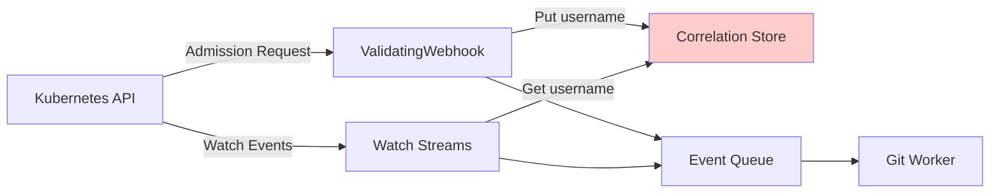

# Architectural Pivot: Audit Webhook + NATS Queue Architecture

**Status:** PROPOSAL  
**Date:** 2025-10-22  
**Author:** Architecture Team  
**Supersedes:** Current ValidatingWebhook + Watch implementation

> **⚠️ CRITICAL INSIGHT:** Reconciliation logic is still required in both architectures for:
> - Initial seed on startup (sync Git to current cluster state)
> - WatchRule/ClusterWatchRule changes (re-evaluate scope, detect orphans)
> - The choice is about **ingestion mechanism**, not reconciliation necessity

---

## Executive Summary

### Current Situation

We're ~90% complete with ValidatingWebhook + Watch stream implementation but facing conceptual complexity:
- **Two ingestion paths** (webhook + watch) require correlation via in-memory store
- **Complex reconciliation** for dynamic watch manager
- **No built-in HA** for event queuing or Git failures
- **Single pod constraint** for MVP due to in-memory state

### Proposed Architecture

**Replace** ValidatingWebhook + Watch with **Audit Webhook** and add **NATS** message queue:

```
Kubernetes → Audit Webhook → NATS Queue → Worker Pods → Git
              ↓
         Reconciliation Controller (still needed!)
              ↓
         List Resources → NATS Queue
```

**Key Benefits:**
1. ✅ Audit webhook provides complete event stream WITH usernames (no correlation needed)
2. ✅ NATS provides durable queue (survives pod restarts)
3. ✅ Natural HA and load distribution across pods
4. ✅ Protection from Git repos that are down or slow
5. ✅ Simplified ingestion (one path instead of two)

**Key Challenges:**
1. ⚠️ Major rewrite despite being ~90% done with current approach
2. ⚠️ New dependency (NATS) adds operational complexity
3. ⚠️ **Reconciliation still required** (audit doesn't help with startup/rule changes)
4. ⚠️ Need to handle audit event volume (can be very high)

---

## Critical Clarification: Reconciliation is Orthogonal

### What Reconciliation Does (Required in BOTH Architectures)

**Scenario 1: Controller Startup**
```
1. Pod starts up
2. Read all active WatchRule/ClusterWatchRule CRDs
3. Compute which resources to watch
4. List() all matching resources from cluster
5. For each resource:
   - Sanitize
   - Check if in Git already
   - If not, enqueue for commit
6. Detect orphans (files in Git but not in cluster)
7. Enqueue delete events for orphans
```

**Scenario 2: WatchRule Added/Updated**
```
1. WatchRule CRD created/modified
2. Compute new resource scope
3. If scope expanded:
   - List() newly-in-scope resources
   - Enqueue for commit
4. If scope narrowed:
   - Identify resources now out-of-scope
   - Detect orphans in Git
   - Enqueue delete events
```

**Scenario 3: WatchRule Deleted**
```
1. WatchRule CRD deleted
2. Identify all resources previously matched
3. Check if ANY other rule still matches
4. If no other rules match:
   - Files become orphans
   - Enqueue delete events
```

### How Architectures Differ

| Aspect | Current (Webhook+Watch) | Proposed (Audit+NATS) |
|--------|------------------------|----------------------|
| **Ongoing Changes** | Watch streams (informers) | Audit webhook → NATS |
| **Initial Seed** | List() then Watch | List() then Audit |
| **Reconciliation** | Integrated with Watch Manager | Separate reconciliation controller |
| **Rule Changes** | Watch Manager reconciliation | Reconciliation controller triggers |
| **Orphan Detection** | After seed completes | After seed completes |

### The Key Difference

**Current Architecture:**
- Reconciliation is **tightly coupled** to Watch Manager
- Watch streams provide both initial state AND ongoing changes
- Informers handle both concerns simultaneously

**Proposed Architecture:**
- Reconciliation is **separate** from ingestion
- Audit provides ongoing changes
- Reconciliation controller does List() operations
- Cleaner separation of concerns

### Code Impact on Reconciliation

**What Gets Removed from Current:**
- ❌ Dynamic informer lifecycle (Watch streams)
- ❌ Correlation store (webhook → watch enrichment)
- ❌ Watch event handlers

**What Stays (in both architectures):**
- ✅ List() operations for seed
- ✅ GVR computation from rules
- ✅ Discovery API filtering
- ✅ Rule matching logic
- ✅ Orphan detection algorithm
- ✅ Sanitization
- ✅ Git operations

**What Gets Added in Proposed:**
- ➕ Audit webhook receiver
- ➕ NATS publisher/consumer
- ➕ Separate reconciliation controller

### Architectural Insight

The **reconciliation problem** is orthogonal to the **ingestion mechanism**:

```
┌─────────────────────────────────────────┐
│  RECONCILIATION (Both architectures)    │
│  - Initial seed (List resources)        │
│  - Rule change handling                 │
│  - Orphan detection                     │
│  - Scope computation                    │
└─────────────────────────────────────────┘
            ↓
┌─────────────────────────────────────────┐
│  INGESTION MECHANISM (Choice point)     │
│                                         │
│  Option A: Watch Streams                │
│  - Tightly coupled to reconciliation    │
│  - Correlation with webhook             │
│                                         │
│  Option B: Audit Webhook + NATS        │
│  - Decoupled from reconciliation        │
│  - Native usernames                     │
└─────────────────────────────────────────┘
```

**Implication:** Switching to Audit + NATS doesn't eliminate reconciliation complexity - it just separates concerns better.

---

## Detailed Analysis

### 1. Current Architecture Problems

#### Problem 1: Dual Ingestion Complexity

**Current Flow:**


**Issues:**
- Correlation store is in-memory (lost on pod restart)
- Race conditions between webhook and watch paths
- TTL/LRU tuning is complex and fragile
- Different resourceVersions prevent ordering guarantees
- Miss rate when watch lags behind webhook (>60s TTL)

#### Problem 2: Dynamic Watch Manager Complexity

**What's Complex:**
- Controller→WatchManager integration incomplete
- Informer lifecycle management
- Deduplication cache clearing logic
- Periodic reconciliation for CRD detection
- Race conditions with rule changes

**What's Actually Essential:**
- ✅ List() operations for seed (still needed)
- ✅ GVR computation (still needed)
- ✅ Orphan detection (still needed)
- ❌ Watch stream management (can be replaced by Audit)
- ❌ Correlation store (can be eliminated with Audit)

**Lines of Code:**
- `internal/watch/manager.go`: ~750 lines
  - Reconciliation logic: ~300 lines (keep)
  - Watch/informer logic: ~450 lines (remove)
- `internal/correlation/store.go`: ~312 lines (remove entirely)
- `internal/webhook/event_handler.go`: ~196 lines (replace with audit receiver)

#### Problem 3: No Built-in HA

**Current Limitations:**
- In-memory event queue (lost on restart)
- Single pod processes all events (leader election only)
- No protection from Git downtime (events dropped)
- No retry mechanism for failed commits
- Correlation store capacity limits (10k entries)

---

### 2. Proposed Architecture: Audit Webhook + NATS

#### Architecture Diagram

```mermaid
graph TB
    subgraph "Kubernetes Cluster"
        K8S[Kubernetes API Server]
        AW[Audit Webhook Receiver]
        RC[Reconciliation Controller]
        RS[RuleStore CRD Controllers]
    end
    
    subgraph "NATS Cluster 3 nodes"
        NATS[NATS JetStream]
        S1[Stream: k8s-events]
    end
    
    subgraph "Worker Pods N replicas"
        W1[Worker Pod 1<br/>Consumes events<br/>Writes to Git]
        W2[Worker Pod 2]
        WN[Worker Pod N]
    end
    
    subgraph "Git Repositories"
        G1[Repo A]
        G2[Repo B]
    end
    
    K8S -->|Audit Events<br/>with usernames| AW
    AW -->|Filter & Publish| NATS
    
    RC -->|Startup/Rule Change<br/>List() resources| K8S
    RC -->|Publish seed events| NATS
    RS -->|Rule changes trigger| RC
    
    NATS --> S1
    
    S1 --> W1
    S1 --> W2
    S1 --> WN
    
    W1 -->|Batched commits| G1
    W1 --> G2
    W2 -->|Batched commits| G1
    W2 --> G2
    WN -->|Batched commits| G1
    WN --> G2
    
    style AW fill:#90EE90
    style RC fill:#FFB6C1
    style NATS fill:#FFD700
    style S1 fill:#87CEEB
```

#### Component Breakdown

##### A. Audit Webhook Receiver

**Purpose:** Receives Kubernetes audit events and publishes to NATS

**Key Features:**
- Single ingestion point for **ongoing changes**
- Audit events include `user.username` natively
- Filter by audit level (RequestResponse for full object)
- Match against WatchRule/ClusterWatchRule
- Sanitize and publish to NATS stream

**Does NOT Handle:**
- ❌ Initial seed (Reconciliation Controller does this)
- ❌ Rule change reconciliation (Reconciliation Controller does this)
- ❌ Orphan detection (Reconciliation Controller does this)

**Code Estimate:** ~200-300 lines (simpler than current dual-path)

##### B. Reconciliation Controller (NEW Component - Still Required!)

**Purpose:** Handle startup seed and rule change reconciliation

**Key Features:**
- Triggered on:
  - Controller startup
  - WatchRule/ClusterWatchRule create/update/delete
  - Periodic checks (CRD discovery)
- Operations:
  - List() resources matching current rules
  - Compute orphans (Git - Cluster)
  - Publish seed events to NATS (same queue as audit events)
- Stateless (no watch streams, just List() calls)

**Code Estimate:** ~400-500 lines

**Critical Insight:** This is essentially the seed/reconciliation logic from current Watch Manager, just decoupled from informers.

##### C. NATS JetStream

**Purpose:** Durable message queue with acknowledgment

**Key Features:**
- **Persistence:** Survives pod restarts
- **At-least-once delivery:** Guarantees no event loss
- **Consumer groups:** Multiple workers share load
- **Stream limits:** Configurable retention (time/size)
- **Backpressure:** Queue depth limits prevent memory issues

**Streams:**
- **k8s-events:** All events (audit + seed), retention: 5 min

**Why JetStream vs Core NATS:**
- JetStream provides persistence (core NATS is fire-and-forget)
- Stream replay for debugging
- Consumer acknowledgment prevents data loss

##### D. Worker Pods

**Purpose:** Consume events from NATS, batch, and commit to Git

**Key Features:**
- Stateless (no in-memory state needed)
- Scale horizontally (add more pods = more throughput)
- Consumer group membership (NATS handles distribution)
- Independent Git workers per repo
- Retry with exponential backoff

**Handles Both:**
- ✅ Audit events (ongoing changes)
- ✅ Seed events (reconciliation-triggered)

**Scaling:**
```yaml
replicas: 3  # Or use HPA based on NATS queue depth
```

---

### 3. Comparison Matrix (Updated with Reconciliation)

| Aspect | Current (Webhook+Watch) | Proposed (Audit+NATS) |
|--------|------------------------|----------------------|
| **Ongoing Changes** | Watch streams (informers) | Audit webhook → NATS |
| **Initial Seed** | List() via Watch Manager | List() via Reconciliation Controller |
| **Rule Changes** | Watch Manager reconciliation | Reconciliation Controller |
| **Orphan Detection** | After seed (Watch Manager) | After seed (Reconciliation Controller) |
| **Username Capture** | Webhook → correlation store | Native in audit events |
| **State Management** | In-memory correlation store | Stateless (NATS queue) |
| **HA Support** | Single pod (leader election) | Multi-pod (NATS consumers) |
| **Event Loss Risk** | High (in-memory queue) | Low (durable NATS queue) |
| **Git Downtime** | Events dropped | Events queued in NATS |
| **Pod Restart** | Lose in-flight events | No loss (NATS persists) |
| **Reconciliation Code** | ~300 lines (in Watch Manager) | ~400 lines (separate controller) |
| **Ingestion Code** | ~450 lines (Watch Manager) + ~196 (webhook) + ~312 (correlation) | ~200 lines (audit receiver) |
| **Total Complexity** | High (dual-path + reconciliation coupled) | Medium (single-path + reconciliation separate) |
| **Dependencies** | None (pure K8s) | NATS cluster (3 nodes) |

**Key Insight:** Reconciliation complexity is similar in both architectures (~300-400 lines). The difference is in ingestion mechanism and coupling.

---

### 4. Reconciliation Logic Comparison

#### Current Architecture: Reconciliation in Watch Manager

```go
// internal/watch/manager.go

func (m *Manager) Start(ctx context.Context) error {
    // Initial seed + reconciliation
    if err := m.ReconcileForRuleChange(ctx); err != nil {
        // handles both seed and informer start
    }
    
    // Periodic reconciliation
    ticker := time.NewTicker(30 * time.Second)
    for {
        select {
        case <-ticker.C:
            m.ReconcileForRuleChange(ctx) // Re-seed + update informers
        }
    }
}

func (m *Manager) ReconcileForRuleChange(ctx context.Context) error {
    // 1. Compute GVRs from rules
    gvrs := m.ComputeRequestedGVRs()
    
    // 2. Start/stop informers (watch streams)
    m.startInformersForGVRs(ctx, added)
    m.stopInformer(removed)
    
    // 3. Trigger seed
    go m.seedSelectedResources(ctx)
}

func (m *Manager) seedSelectedResources(ctx context.Context) {
    // List() all resources
    // Match against rules
    // Enqueue events
    // Emit SEED_SYNC for orphan detection
}
```

**Coupling:** Reconciliation tightly coupled to informer management

#### Proposed Architecture: Separate Reconciliation Controller

```go
// internal/reconciliation/controller.go (NEW)

type Controller struct {
    Client       client.Client
    RuleStore    *rulestore.RuleStore
    NATSPublisher *nats.Publisher
}

func (c *Controller) Start(ctx context.Context) error {
    // Initial seed
    if err := c.ReconcileAll(ctx); err != nil {
        // ...
    }
    
    // Periodic reconciliation (CRD discovery)
    ticker := time.NewTicker(30 * time.Second)
    for {
        select {
        case <-ticker.C:
            c.ReconcileAll(ctx)
        }
    }
}

func (c *Controller) ReconcileAll(ctx context.Context) error {
    // 1. Compute GVRs from rules
    gvrs := c.computeRequestedGVRs()
    
    // 2. List() all resources (no informers!)
    for _, gvr := range gvrs {
        resources := c.listResources(gvr)
        for _, resource := range resources {
            // Sanitize and publish to NATS
            c.NATSPublisher.Publish(resource)
        }
    }
    
    // 3. Orphan detection
    c.publishOrphanDetectionEvent()
}

// Called by WatchRule/ClusterWatchRule controllers
func (c *Controller) ReconcileForRuleChange(ctx context.Context) error {
    return c.ReconcileAll(ctx)
}
```

**Decoupling:** Reconciliation separate from ingestion (no informer management)

#### Code Comparison

**Reconciliation Logic (Similar in Both):**
- Compute GVRs: ~50 lines
- List resources: ~100 lines
- Match rules: ~50 lines
- Orphan detection: ~100 lines
- **Total: ~300-400 lines** (unavoidable in both architectures)

**Ingestion Logic (Different):**
- Current: Watch streams + correlation: ~650 lines
- Proposed: Audit receiver: ~200 lines
- **Difference: ~450 lines simpler**

**Overall:**
- Current: 300 (reconciliation) + 650 (ingestion) = 950 lines
- Proposed: 400 (reconciliation) + 200 (ingestion) = 600 lines
- **Net: 350 lines simpler** (but still need reconciliation!)

---

### 5. Updated Pros and Cons

### Pros (Why This Makes Sense)

#### 1. Architectural Simplicity (Ingestion Only)
- ✅ **Single ingestion path** (no webhook→watch correlation)
- ✅ **No in-memory correlation state**
- ✅ **Native username capture** (no correlation store needed)
- ✅ **Cleaner separation** (reconciliation separate from ingestion)

**But:** Reconciliation complexity remains (~400 lines vs ~300 lines)

#### 2. High Availability
- ✅ **Durable queue** (survive pod restarts)
- ✅ **Multi-pod workers** (horizontal scaling)
- ✅ **Git downtime protection** (events queued, not dropped)
- ✅ **Retry logic built-in** (NATS redelivery)

#### 3. Operational Benefits
- ✅ **Simpler debugging** (stream replay in NATS)
- ✅ **Better observability** (NATS metrics)
- ✅ **Easier testing** (mock NATS, not dual paths)
- ✅ **Load distribution** (consumer groups)

#### 4. Performance
- ✅ **No correlation overhead** (no hash lookups)
- ✅ **Better throughput** (parallel workers)
- ✅ **Backpressure handling** (NATS queue limits)

### Cons (Challenges and Risks)

#### 1. Sunk Cost
- ❌ **90% complete with current approach** (major rewrite)
- ❌ **Working correlation store** (91.6% test coverage)
- ❌ **Near-complete dynamic watch manager**
- ❌ **Time investment lost** (~2-3 weeks of work)

#### 2. New Dependency
- ❌ **NATS cluster required** (3 nodes for HA)
- ❌ **Operational complexity** (monitoring, upgrades, backups)
- ❌ **Additional failure mode** (NATS downtime = system down)
- ❌ **Learning curve** (team needs NATS expertise)

#### 3. Reconciliation Still Required (Critical Realization)
- ❌ **Doesn't eliminate seed logic** (~300-400 lines in both)
- ❌ **Still need List() operations** (for startup and rule changes)
- ❌ **Still need orphan detection** (same algorithm)
- ❌ **Still need GVR computation** (same logic)

**What This Means:** The audit approach simplifies **ingestion** by ~450 lines but doesn't reduce **reconciliation** complexity. Total savings: ~350 lines net, not ~1,000 lines.

#### 4. Audit Webhook Challenges
- ❌ **High event volume** (all API operations, not just watched)
- ❌ **Filtering complexity** (avoid audit bombing)
- ❌ **Configuration coupling** (audit policy + WatchRules)
- ❌ **Potential API server impact** (audit can slow requests)

#### 5. Migration Effort
- ❌ **Major code rewrite** (~650 lines removed, ~600 added)
- ❌ **Test suite rewrite** (different architecture = different tests)
- ❌ **Deployment complexity** (NATS setup + configuration)
- ❌ **Documentation rewrite** (architecture docs, user guides)

---

### 6. Updated Recommendation

### Primary Recommendation: **Consider Hybrid Approach More Carefully**

**New Insight:** Since reconciliation logic is required in BOTH architectures, the complexity savings are smaller than initially thought:

- **Ingestion simplification:** ~450 lines
- **Reconciliation unchanged:** ~400 lines (still needed)
- **Net benefit:** ~450 lines + HA features
- **Cost:** NATS dependency + 3-4 week rewrite

### Decision Matrix Updated

| Factor | Weight | Current (Finish) | Proposed (Rewrite) |
|--------|--------|------------------|-------------------|
| Time to MVP | High | 1 week | 3-4 weeks |
| Long-term maintainability | High | Medium | Better |
| HA capabilities | High | Poor (single pod) | Excellent (multi-pod) |
| Code complexity | Medium | Higher (~950 lines) | Lower (~600 lines) |
| Operational burden | High | Low (no deps) | Medium (NATS) |
| Team expertise | Medium | Have it | Need to build |
| **Reconciliation required** | **N/A** | **Yes (~300 lines)** | **Yes (~400 lines)** |

### Updated Recommendations

#### Option A: Finish Current Architecture (More Viable Now)
**Reasoning:**
- Reconciliation complexity is similar in both (~300-400 lines)
- Real savings is only ~450 lines (ingestion), not ~1,000
- Single-pod limitation can be acceptable for alpha
- Can ship in 1 week vs 3-4 weeks

**When to Choose:**
- Need MVP shipped ASAP
- Single-pod operation acceptable for alpha
- Will evaluate HA needs based on real usage
- Team bandwidth limited

#### Option B: Rewrite with Audit + NATS (Still Valid for HA)
**Reasoning:**
- HA/scalability are non-negotiable requirements
- Willing to accept NATS operational complexity
- 3-4 week delay acceptable
- Building for 3+ year horizon

**When to Choose:**
- HA is critical (not just nice-to-have)
- Can support NATS infrastructure
- Long-term architecture priority
- Team has capacity for rewrite

#### Option C: Ship MVP, Plan v2 Migration (Recommended)
**Reasoning:**
- Get feedback from real usage before major rewrite
- Reconciliation logic will be reusable in v2
- Learn which HA features are actually needed
- Reduces risk of wrong architectural choice

**Implementation:**
1. **v1.0 (1 week):** Finish current, document single-pod limitation
2. **v1.x (2-3 months):** Gather usage data, evaluate HA needs
3. **v2.0 (planned):** Migrate to Audit + NATS if HA proves critical

---

## Summary (Updated with Reconciliation Insight)

### The Core Realization

**Reconciliation logic is required in BOTH architectures:**
- Initial seed (List resources)
- Rule change handling (re-evaluate scope)
- Orphan detection (Git cleanup)
- ~300-400 lines of code in either case

**What changes between architectures:**
- Ingestion mechanism (Watch vs Audit): ~450 line difference
- HA capabilities (in-memory vs NATS): significant operational difference
- Operational complexity (none vs NATS): significant difference

### Updated Decision Criteria

**Choose Current Architecture (Finish) if:**
- Time to MVP is critical (1 week vs 4 weeks)
- Single-pod operation acceptable for alpha
- Want to avoid NATS operational burden
- Reconciliation complexity is acceptable (~300 lines)

**Choose Audit + NATS (Rewrite) if:**
- HA is non-negotiable requirement
- Multi-pod scaling is essential
- Willing to operate NATS cluster
- 3-4 week delay acceptable
- Reconciliation complexity acceptable (~400 lines)

### The Question Remains

**But reconciliation is still ~400 lines of complexity in both cases.** The choice is really about:
1. Ingestion mechanism (Watch vs Audit)
2. HA capabilities (single-pod vs multi-pod)
3. Operational dependencies (none vs NATS)

The reconciliation insight **doesn't eliminate the choice**, but it **reduces the net benefit** of rewriting from ~1,000 lines to ~450 lines.

---

## Next Steps

If approved, decide based on:
1. **HA Requirements:** Critical now or can wait?
2. **Timeline Pressure:** Ship ASAP or invest in better architecture?
3. **Operational Capacity:** Can support NATS or keep simple?
4. **Reconciliation Acceptance:** ~400 lines of complexity either way

**Decision Required:** Choose architecture direction by [DATE]

---

## Appendices

### A. Code Size Comparison (Updated)

| Component | Current Lines | Proposed Lines | Delta | Note |
|-----------|--------------|----------------|-------|------|
| Reconciliation logic | 300 | 400 | +100 | Required in both! |
| Watch/informer mgmt | 450 | 0 | -450 | Eliminated |
| Webhook handler | 196 | 0 | -196 | Eliminated |
| Correlation store | 312 | 0 | -312 | Eliminated |
| Audit receiver | 0 | 200 | +200 | New |
| NATS client | 0 | 400 | +400 | New |
| Tests | ~500 | ~700 | +200 | More comprehensive |
| **Total** | **~1,758** | **~1,700** | **-58** | Smaller difference than expected |

**Key Insight:** Net difference is only ~58 lines because reconciliation is required in both!

### B. Reconciliation Logic Breakdown

**What's Common (Required in Both):**
- GVR computation from rules: ~50 lines
- Discovery API filtering: ~50 lines
- Resource List() operations: ~100 lines
- Rule matching logic: ~50 lines
- Orphan detection: ~100 lines
- Git path generation: ~50 lines
- **Total: ~400 lines**

**What's Different (Ingestion):**
- Current: Watch streams + correlation: ~650 lines
- Proposed: Audit receiver: ~200 lines
- **Savings: ~450 lines**

---

**Document End**