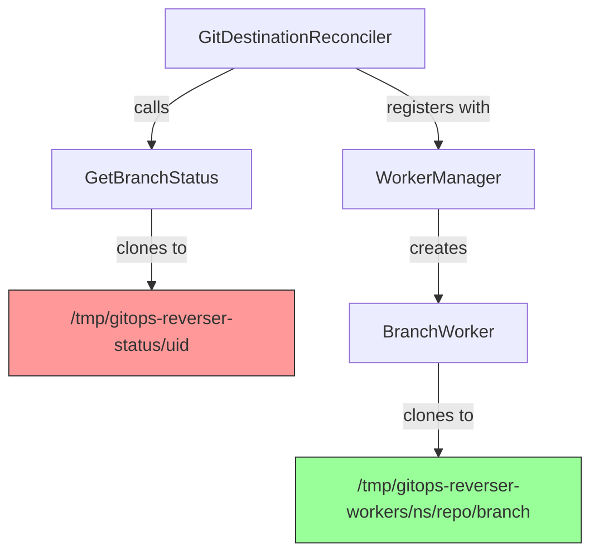
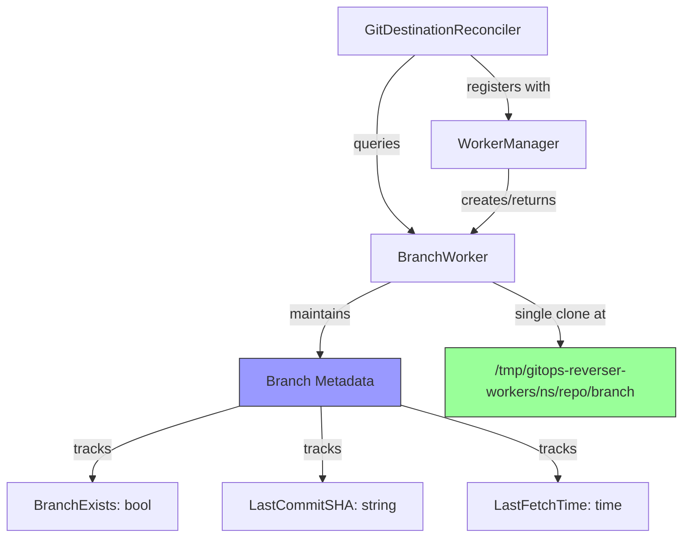

# Branch Tracking Refactor Plan

## Overview

This document outlines the plan to eliminate ALL separate repository clones by implementing exactly one clone per (GitDestination, Branch) combination through BranchWorker instances. Each BranchWorker manages one repository clone to prevent merge conflicts from GitOpsReverser operations while ensuring efficient resource usage and proper empty repository handling.

## Current Problems

### Problem 1: Multiple Repository Clones
Currently, Git operations are performed in multiple places, creating redundant clones:
- **Status Checking**: `GitDestinationReconciler.updateRepositoryStatus()` calls `git.GetBranchStatus()`
- **Resource Listing**: `BranchWorker.ListResourcesInBaseFolder()` performs separate clones
- **Event Processing**: `BranchWorker.commitAndPush()` uses worker-specific clones
- **Impact**: Wastes disk space, network bandwidth, and time with redundant Git operations

### Problem 2: Empty Repository Handling
Empty repositories (no commits) cause errors in GitDestination status updates:
- **Symptom**: GitDestination goes to error state when repository is empty
- **Root Cause**: Status checking expects at least one commit to exist
- **Impact**: Cannot bootstrap new repositories through GitOps Reverser

## Current Architecture



**Key Issue**: Multiple separate clones for the same GitDestination!

## Proposed Architecture



**Benefits**: Single clone per (repo, branch) combination with cached metadata!

## Implementation Plan

### Phase 1: Add Branch Metadata to BranchWorker

**File**: `internal/git/branch_worker.go`

Add new fields to `BranchWorker`:
```go
type BranchWorker struct {
    // ... existing fields ...
    
    // Branch metadata (protected by metaMu)
    metaMu          sync.RWMutex
    branchExists    bool
    lastCommitSHA   string
    lastFetchTime   time.Time
}
```

Add new methods:
```go
// GetBranchMetadata returns current branch status without cloning
func (w *BranchWorker) GetBranchMetadata() (exists bool, sha string, lastFetch time.Time)

// ensureRepositoryInitialized ensures the worker's repository is cloned and ready
func (w *BranchWorker) ensureRepositoryInitialized(ctx context.Context) error
```

### Phase 2: Centralize All Git Operations Through BranchWorker

**File**: `internal/git/branch_worker.go`

**Key Principle**: ALL Git operations must go through BranchWorker to avoid multiple clones (the only exception is the GitRepoConfig implementation: it may handle connection related activities).

Add internal method to update metadata after Git operations:
```go
// updateBranchMetadata updates cached metadata after git operations (internal use only)
func (w *BranchWorker) updateBranchMetadata(repo *Repo) error {
    w.metaMu.Lock()
    defer w.metaMu.Unlock()
    
    // Try to get HEAD
    head, err := repo.Head()
    if err != nil {
        // Repository might be empty (no commits yet)
        if errors.Is(err, plumbing.ErrReferenceNotFound) {
            w.branchExists = false
            w.lastCommitSHA = ""
            w.lastFetchTime = time.Now()
            return nil
        }
        return fmt.Errorf("failed to get HEAD: %w", err)
    }
    
    // Check if branch exists on remote
    remoteBranchRef := plumbing.NewRemoteReferenceName("origin", w.Branch)
    ref, err := repo.Reference(remoteBranchRef, true)
    
    if err == nil {
        // Branch exists on remote
        w.branchExists = true
        w.lastCommitSHA = ref.Hash().String()
    } else if errors.Is(err, plumbing.ErrReferenceNotFound) {
        // Branch doesn't exist yet, use HEAD
        w.branchExists = false
        w.lastCommitSHA = head.Hash().String()
    } else {
        return fmt.Errorf("failed to check branch reference: %w", err)
    }
    
    w.lastFetchTime = time.Now()
    return nil
}
```

Update `Start()` to initialize repository and metadata:
```go
func (w *BranchWorker) Start(parentCtx context.Context) error {
    // ... existing logic ...
    
    // Initialize repository and metadata in background
    go func() {
        if err := w.ensureRepositoryInitialized(w.ctx); err != nil {
            w.Log.Error(err, "Failed to initialize repository")
        }
    }()
    
    return nil
}
```

### Phase 3: Refactor ListResourcesInBaseFolder to Use Single Clone

**CRITICAL**: `ListResourcesInBaseFolder()` currently performs separate clones. This must be refactored to use the worker's managed repository.

**Current Problem**:
- `ListResourcesInBaseFolder()` (lines 142-166) clones to separate path
- This creates the same inefficiency the refactor aims to eliminate

**Solution**:
```go
func (w *BranchWorker) ListResourcesInBaseFolder(baseFolder string) ([]itypes.ResourceIdentifier, error) {
    // Ensure repository is initialized using worker's managed clone
    if err := w.ensureRepositoryInitialized(w.ctx); err != nil {
        return nil, fmt.Errorf("failed to initialize repository: %w", err)
    }
    
    // Use the worker's managed repository path
    repoPath := filepath.Join("/tmp", "gitops-reverser-workers",
        w.GitRepoConfigNamespace, w.GitRepoConfigRef, w.Branch)
    
    // Open existing repository instead of cloning
    repo, err := git.PlainOpen(repoPath)
    if err != nil {
        return nil, fmt.Errorf("failed to open managed repository: %w", err)
    }
    
    // Update metadata after repository operations
    if err := w.updateBranchMetadata(repo); err != nil {
        w.Log.V(1).Error(err, "Failed to update branch metadata after list")
    }
    
    // Continue with existing resource listing logic...
}
```

### Phase 4: Update GitDestinationReconciler

**File**: `internal/controller/gitdestination_controller.go`

Replace `updateRepositoryStatus()` implementation:

**Before**:
```go
func (r *GitDestinationReconciler) updateRepositoryStatus(...) error {
    // Get authentication
    auth, err := git.GetAuthFromSecret(ctx, r.Client, grc)
    // ...
    
    // Build work directory for status checking (using UID for uniqueness)
    workDir := filepath.Join("/tmp", "gitops-reverser-status", string(dest.UID))
    
    // Get branch status
    status, err := git.GetBranchStatus(grc.Spec.RepoURL, dest.Spec.Branch, auth, workDir)
    // ...
}
```

**After**:
```go
func (r *GitDestinationReconciler) updateRepositoryStatus(...) error {
    log.Info("Updating repository status from BranchWorker")
    
    // Get the branch worker for this destination
    repoNS := dest.Spec.RepoRef.Namespace
    if repoNS == "" {
        repoNS = dest.Namespace
    }
    
    worker, exists := r.WorkerManager.GetWorkerForDestination(
        dest.Spec.RepoRef.Name, repoNS, dest.Spec.Branch,
    )
    
    if !exists {
        // Worker not yet created - this is normal during initial reconciliation
        log.V(1).Info("Worker not yet available, will update status on next reconcile")
        return nil
    }
    
    // Get cached metadata from worker
    branchExists, lastCommitSHA, lastFetch := worker.GetBranchMetadata()
    
    // Update status fields
    dest.Status.BranchExists = branchExists
    dest.Status.LastCommitSHA = lastCommitSHA
    dest.Status.LastSyncTime = &metav1.Time{Time: lastFetch}
    
    log.Info("Repository status updated from worker cache",
        "branchExists", branchExists,
        "lastCommitSHA", lastCommitSHA,
        "lastFetch", lastFetch)
    
    return nil
}
```

### Phase 5: Empty Repository Handling Verification

**File**: `internal/git/git.go`

The `Clone()` function already has empty repository handling (lines 112-203), but we need to ensure it works correctly:

1. **Verify** `initializeEmptyRepository()` creates a valid repo without initial commit
2. **Add** proper handling in `Checkout()` for empty repos (no HEAD yet)
3. **Update** `TryPushCommits()` to handle first commit to empty repo

**File**: `internal/git/branch_worker.go`

The `updateBranchMetadata()` method (added in Phase 2) already handles empty repos properly with the `containsCommits` flag.

### Phase 6: Add Comprehensive Tests

**File**: `internal/git/branch_worker_test.go`

Add test cases:
```go
func TestBranchWorker_EmptyRepository(t *testing.T)
func TestBranchWorker_GetBranchMetadata(t *testing.T)
func TestBranchWorker_MetadataUpdateAfterPush(t *testing.T)
func TestBranchWorker_SingleCloneArchitecture(t *testing.T)
```

**File**: `internal/controller/gitdestination_controller_test.go`

Add test cases:
```go
func TestGitDestinationReconciler_EmptyRepository(t *testing.T)
func TestGitDestinationReconciler_StatusFromWorkerCache(t *testing.T)
```

### Phase 7: Remove Obsolete Code

**Files to Remove**:
- `internal/git/status.go` - Eliminated by centralizing through BranchWorker
- `internal/git/status_test.go` - Tests no longer needed

**Files to Update**:
- `internal/controller/gitdestination_controller.go` - Remove `git.GetBranchStatus` import (line 38)
- Any other files that import the removed functions

### Phase 8: Update Documentation

**Files to Update**:
- `README.md` - Update architecture description to reflect single-clone design
- `DEVELOPMENT_RULES.md` - Update if it references status checking
- `docs/BRANCH_TRACKING_ANALYSIS.md` - Add note about this refactor

## Testing Strategy

### Unit Tests

1. **Single Clone Architecture Tests**:
   - Verify ListResourcesInBaseFolder uses managed repository
   - Verify commitAndPush uses managed repository
   - Verify no separate clones are created anywhere

2. **Empty Repository Tests**:
   - Clone empty repository
   - Checkout non-existent branch in empty repo
   - Create first commit in empty repo
   - Push first commit to empty repo

3. **Metadata Caching Tests**:
   - Verify metadata updates after clone
   - Verify metadata updates after push
   - Verify metadata updates after resource listing
   - Verify metadata is thread-safe
   - Verify stale metadata handling

4. **Integration Tests**:
   - GitDestination with empty repository
   - GitDestination status updates from worker cache
   - Multiple GitDestinations sharing same worker

### Manual Testing

1. Create empty Git repository
2. Create GitRepoConfig pointing to empty repo
3. Create GitDestination with non-existent branch
4. Verify GitDestination becomes Ready
5. Create WatchRule to trigger events
6. Verify first commit creates branch successfully
7. Verify GitDestination status shows correct branch info

## Migration Path

This refactor is **backward compatible**:
- No API changes to CRDs
- No changes to user-facing behavior
- Only internal implementation changes

**Rollout**:
1. Deploy new version
2. Existing GitDestinations will automatically use new code path
3. No manual intervention required

## Success Criteria

* [ ] `internal/git/status.go` removed completely
- [ ] `ListResourcesInBaseFolder()` uses worker's managed repository
- [ ] No separate clones anywhere in the codebase  
- [ ] All Git operations flow through BranchWorker instances
- [ ] Empty repositories handled without errors
- [ ] All existing tests pass
- [ ] New tests for single-clone architecture pass
- [ ] `make lint` passes
- [ ] `make test` passes with >90% coverage
- [ ] `make test-e2e` passes

## Risks and Mitigations

### Risk 1: Race Conditions in Metadata Access
**Mitigation**: Use `sync.RWMutex` for all metadata access

### Risk 2: Stale Metadata
**Mitigation**: Update metadata after every git operation (fetch, push, list)

### Risk 3: Worker Not Available During Status Check
**Mitigation**: Handle gracefully by marking status as "initializing"

### Risk 4: Empty Repo Edge Cases
**Mitigation**: Comprehensive test coverage for all empty repo scenarios

### Risk 5: Regression in Git Operations
**Mitigation**: Ensure `ListResourcesInBaseFolder()` maintains exact same functionality while using managed repository

### Risk 6: Performance Impact of Metadata Updates
**Mitigation**: Metadata updates are lightweight and only happen after actual Git operations

## Timeline Estimate

- **Phase 1**: Add metadata tracking to BranchWorker - 1 hour
- **Phase 2**: Centralize Git operations through BranchWorker - 3 hours  
- **Phase 3**: Refactor ListResourcesInBaseFolder for single clone - 2 hours
- **Phase 4**: Update GitDestinationReconciler - 1 hour
- **Phase 5**: Verify empty repo handling - 1 hour
- **Phase 6**: Add comprehensive tests - 3 hours
- **Phase 7**: Remove obsolete code - 1 hour
- **Phase 8**: Update documentation - 30 minutes

**Total**: ~12.5 hours of development work

## References

- Current implementation: [`internal/git/status.go`](../internal/git/status.go) - **TO BE REMOVED**
- BranchWorker: [`internal/git/branch_worker.go`](../internal/git/branch_worker.go)
- GitDestination controller: [`internal/controller/gitdestination_controller.go`](../internal/controller/gitdestination_controller.go)
- Empty repo handling: [`internal/git/git.go`](../internal/git/git.go:112-203) - **ALREADY ROBUST**
- WorkerManager: [`internal/git/worker_manager.go`](../internal/git/worker_manager.go)
- Worker lifecycle: [`internal/git/worker_manager.go`](../internal/git/worker_manager.go:145-191)