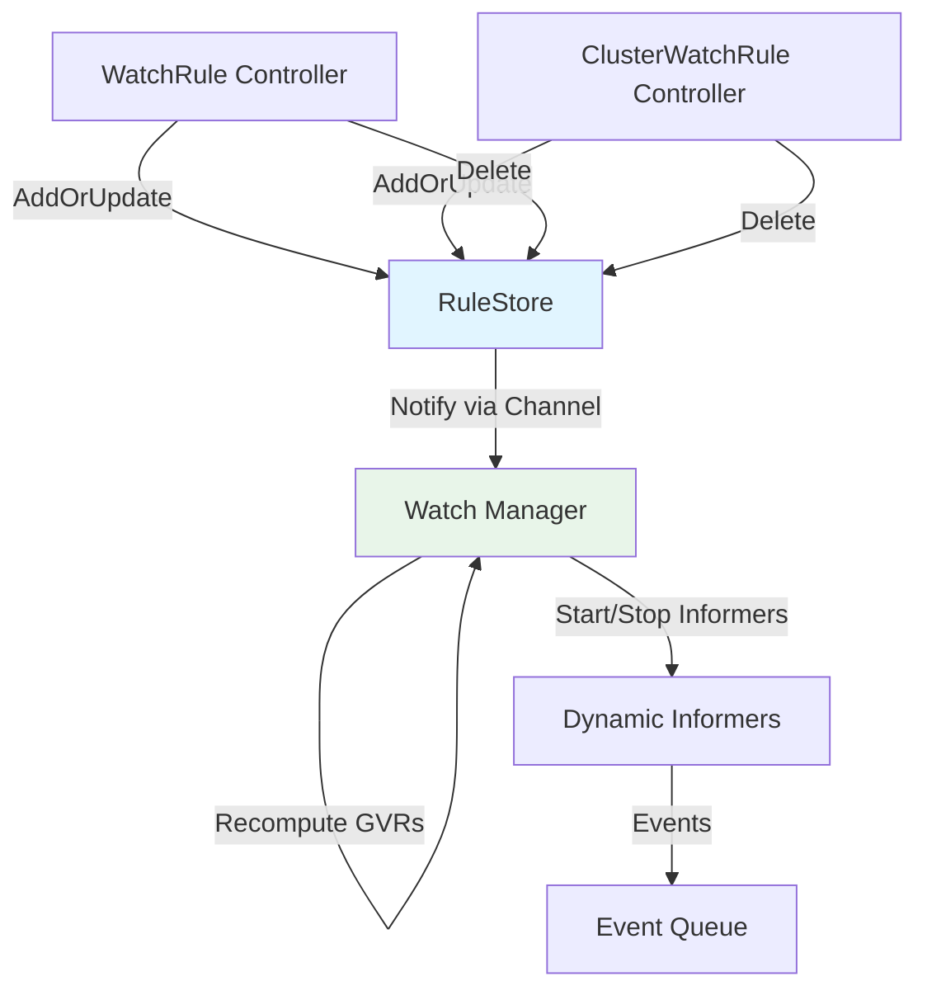

# Dynamic Watch Manager Implementation Plan

## Problem Statement

The watch manager currently computes GVRs **only once at startup**. When WatchRules or ClusterWatchRules are added/updated/deleted after startup, the watch manager doesn't react, causing informers to not start for newly added rules.

**Current Broken Flow:**
```
Pod Start → Watch Manager: "no GVRs yet" → Idle
Later: WatchRule Created → RuleStore Updated → Watch Manager: [still idle]
Result: Informers never start, events never enqueued
```

**Desired Flow:**
```
Pod Start → Watch Manager: "no GVRs yet" → Waiting for notifications
Later: WatchRule Created → RuleStore Updated → Notify Watch Manager
Watch Manager → Recompute GVRs → Start/Update Informers → Events flow
```

---

## Solution: RuleStore Notification Channel

### Architecture



### Key Components

**1. RuleStore Enhancement**
- Add notification channel: `chan struct{}`
- Notify on rule add/update/delete
- Thread-safe channel operations

**2. Watch Manager Enhancement**
- Listen to RuleStore notifications
- Recompute GVRs dynamically
- Start new informers, stop obsolete ones
- Trigger re-seeding when needed

---

## Detailed Implementation

### Phase 1: RuleStore Notification Channel

**File**: `internal/rulestore/store.go`

#### Add Channel to Store

```go
type RuleStore struct {
    mu                sync.RWMutex
    watchRules        map[string][]CompiledRule
    clusterRules      []CompiledClusterRule
    
    // NEW: Notification channel for watch manager
    changeNotifyChan  chan struct{}
    changeNotifyOnce  sync.Once  // Ensure channel initialized once
}
```

#### Initialize Channel

```go
func NewStore() *RuleStore {
    return &RuleStore{
        watchRules:       make(map[string][]CompiledRule),
        clusterRules:     make([]CompiledClusterRule),
        changeNotifyChan: make(chan struct{}, 10), // Buffered for non-blocking
    }
}
```

#### Expose Channel (Read-Only)

```go
// GetChangeNotifications returns a read-only channel that signals when rules change.
// Watch manager should listen to this channel to recompute GVRs and update informers.
func (s *RuleStore) GetChangeNotifications() <-chan struct{} {
    s.changeNotifyOnce.Do(func() {
        if s.changeNotifyChan == nil {
            s.changeNotifyChan = make(chan struct{}, 10)
        }
    })
    return s.changeNotifyChan
}
```

#### Notify on Changes

```go
// notifyChange sends a non-blocking notification that rules have changed.
func (s *RuleStore) notifyChange() {
    select {
    case s.changeNotifyChan <- struct{}{}:
        // Notification sent
    default:
        // Channel full, skip (watch manager will catch up)
    }
}

// Modify existing methods to call notifyChange:

func (s *RuleStore) AddOrUpdateWatchRule(rule WatchRule) {
    s.mu.Lock()
    defer s.mu.Unlock()
    // ... existing logic ...
    s.notifyChange() // NEW
}

func (s *RuleStore) AddOrUpdateClusterRule(rule ClusterWatchRule) {
    s.mu.Lock()
    defer s.mu.Unlock()
    // ... existing logic ...
    s.notifyChange() // NEW
}

func (s *RuleStore) Delete(key types.NamespacedName) {
    s.mu.Lock()
    defer s.mu.Unlock()
    // ... existing logic ...
    s.notifyChange() // NEW
}
```

---

### Phase 2: Watch Manager Dynamic Recomputation

**File**: `internal/watch/manager.go`

#### Add Tracking State

```go
type Manager struct {
    Client           client.Client
    Log              logr.Logger
    RuleStore        *rulestore.RuleStore
    EventQueue       *eventqueue.Queue
    CorrelationStore *correlation.Store
    
    // Deduplication
    lastSeenMu       sync.RWMutex
    lastSeenHash     map[string]uint64
    
    // NEW: Dynamic informer management
    informersMu      sync.Mutex
    activeGVRs       map[GVR]struct{}           // Currently watched GVRs
    informerFactory  dynamicinformer.DynamicSharedInformerFactory
    informerCancel   context.CancelFunc         // Cancel active informers
}
```

#### Enhanced Start Method

```go
func (m *Manager) Start(ctx context.Context) error {
    log := m.Log.WithName("watch")
    log.Info("watch ingestion manager starting (dynamic)")
    defer log.Info("watch ingestion manager stopping")
    
    // Initial GVR computation and informer start
    m.updateInformers(ctx)
    
    // Listen for RuleStore changes
    ruleChanges := m.RuleStore.GetChangeNotifications()
    
    // Heartbeat ticker
    ticker := time.NewTicker(heartbeatInterval)
    defer ticker.Stop()
    
    for {
        select {
        case <-ctx.Done():
            m.stopInformers()
            return nil
        case <-ruleChanges:
            log.Info("RuleStore changed, recomputing GVRs")
            m.updateInformers(ctx)
        case <-ticker.C:
            log.V(1).Info("watch manager heartbeat",
                "activeGVRs", len(m.activeGVRs))
        }
    }
}
```

#### Update Informers Method

```go
// updateInformers recomputes GVRs from rules and starts/stops informers as needed.
func (m *Manager) updateInformers(ctx context.Context) {
    log := m.Log.WithName("update-informers")
    
    // Compute requested GVRs from current rules
    requested := m.ComputeRequestedGVRs()
    if len(requested) == 0 {
        log.Info("no GVRs from rules, stopping all informers")
        m.stopInformers()
        return
    }
    
    // Filter to discoverable
    discoverable := m.FilterDiscoverableGVRs(ctx, requested)
    if len(discoverable) == 0 {
        log.Info("no discoverable GVRs, stopping all informers")
        m.stopInformers()
        return
    }
    
    // Convert to set for comparison
    newGVRs := make(map[GVR]struct{})
    for _, gvr := range discoverable {
        newGVRs[gvr] = struct{}{}
    }
    
    m.informersMu.Lock()
    defer m.informersMu.Unlock()
    
    // Check if GVRs changed
    if m.gvrsEqual(m.activeGVRs, newGVRs) {
        log.V(1).Info("GVRs unchanged, keeping current informers",
            "count", len(m.activeGVRs))
        return
    }
    
    log.Info("GVRs changed, restarting informers",
        "previous", len(m.activeGVRs),
        "new", len(newGVRs))
    
    // Stop old informers
    if m.informerCancel != nil {
        m.informerCancel()
    }
    
    // Start new informers
    informerCtx, cancel := context.WithCancel(ctx)
    m.informerCancel = cancel
    m.activeGVRs = newGVRs
    
    if err := m.startDynamicInformersForGVRs(informerCtx, discoverable); err != nil {
        log.Error(err, "failed to start dynamic informers")
        return
    }
    
    // Trigger seed listing for new GVRs
    go m.seedSelectedResources(informerCtx)
    
    log.Info("informers restarted successfully",
        "gvrCount", len(newGVRs))
}
```

#### Helper Methods

```go
// gvrsEqual checks if two GVR sets are identical.
func (m *Manager) gvrsEqual(a, b map[GVR]struct{}) bool {
    if len(a) != len(b) {
        return false
    }
    for gvr := range a {
        if _, exists := b[gvr]; !exists {
            return false
        }
    }
    return true
}

// stopInformers stops all active informers.
func (m *Manager) stopInformers() {
    m.informersMu.Lock()
    defer m.informersMu.Unlock()
    
    if m.informerCancel != nil {
        m.informerCancel()
        m.informerCancel = nil
    }
    m.activeGVRs = nil
    m.Log.Info("all informers stopped")
}

// startDynamicInformersForGVRs starts informers for specific GVRs.
func (m *Manager) startDynamicInformersForGVRs(
    ctx context.Context,
    gvrs []GVR,
) error {
    cfg := m.restConfig()
    if cfg == nil {
        return nil
    }
    
    client, err := dynamic.NewForConfig(cfg)
    if err != nil {
        return err
    }
    
    // Create new factory
    factory := dynamicinformer.NewDynamicSharedInformerFactory(client, 0)
    m.informerFactory = factory
    
    // Register informers
    for _, g := range gvrs {
        resource := schema.GroupVersionResource{
            Group:    g.Group,
            Version:  g.Version,
            Resource: g.Resource,
        }
        informer := factory.ForResource(resource).Informer()
        m.addHandlers(informer, g)
    }
    
    // Start and sync
    factory.Start(ctx.Done())
    factory.WaitForCacheSync(ctx.Done())
    
    return nil
}
```

---

## Testing Strategy

### Unit Tests

**File**: `internal/watch/dynamic_update_test.go`

```go
func TestWatchManager_DynamicGVRUpdate(t *testing.T) {
    // Setup
    ruleStore := rulestore.NewStore()
    eventQueue := eventqueue.NewQueue()
    manager := &Manager{
        RuleStore:  ruleStore,
        EventQueue: eventQueue,
        activeGVRs: make(map[GVR]struct{}),
    }
    
    // Start manager in background
    ctx, cancel := context.WithCancel(context.Background())
    defer cancel()
    go manager.Start(ctx)
    
    // Initially no GVRs
    time.Sleep(100 * time.Millisecond)
    assert.Equal(t, 0, len(manager.activeGVRs))
    
    // Add WatchRule
    rule := configv1alpha1.WatchRule{
        // ... ConfigMap rule
    }
    ruleStore.AddOrUpdateWatchRule(rule)
    
    // Wait for notification processing
    assert.Eventually(t, func() bool {
        manager.informersMu.Lock()
        defer manager.informersMu.Unlock()
        return len(manager.activeGVRs) > 0
    }, 5*time.Second, 100*time.Millisecond)
    
    // Verify ConfigMap GVR is active
    expectedGVR := GVR{Group: "", Version: "v1", Resource: "configmaps"}
    _, exists := manager.activeGVRs[expectedGVR]
    assert.True(t, exists)
    
    // Delete WatchRule
    ruleStore.Delete(types.NamespacedName{Name: rule.Name, Namespace: rule.Namespace})
    
    // Wait for informers to stop
    assert.Eventually(t, func() bool {
        manager.informersMu.Lock()
        defer manager.informersMu.Unlock()
        return len(manager.activeGVRs) == 0
    }, 5*time.Second, 100*time.Millisecond)
}
```

### Integration Tests

**Test Scenarios:**
1. ✅ Start with no rules → Add WatchRule → Informers start
2. ✅ Add second WatchRule (new GVR) → Informers expand
3. ✅ Delete WatchRule → Informers shrink
4. ✅ Delete all rules → Informers stop
5. ✅ Update rule (same GVRs) → Informers unchanged
6. ✅ Rapid add/delete → Debounce works

### E2E Test Fixes

**No changes needed** - existing e2e tests will pass once dynamic updates work:
- Test creates WatchRule
- RuleStore notifies watch manager
- Watch manager starts informers
- Events flow, commits happen
- Test passes ✅

---

## Performance Considerations

### Notification Rate Limiting

**Problem**: Rapid rule changes could cause informer churn

**Solution**: Debounce notifications

```go
// In Manager.Start():
const debounceDelay = 2 * time.Second

debounceTimer := time.NewTimer(0)
debounceTimer.Stop()
pendingUpdate := false

for {
    select {
    case <-ctx.Done():
        return nil
    case <-ruleChanges:
        // Debounce: wait for quiet period before updating
        if !pendingUpdate {
            pendingUpdate = true
            debounceTimer.Reset(debounceDelay)
        }
    case <-debounceTimer.C:
        if pendingUpdate {
            log.Info("debounce period elapsed, updating informers")
            m.updateInformers(ctx)
            pendingUpdate = false
        }
    case <-ticker.C:
        log.V(1).Info("heartbeat", "activeGVRs", len(m.activeGVRs))
    }
}
```

### Memory Management

**Concern**: Old informer caches in memory

**Solution**: Explicit cleanup

```go
func (m *Manager) stopInformers() {
    m.informersMu.Lock()
    defer m.informersMu.Unlock()
    
    if m.informerCancel != nil {
        m.informerCancel()
        m.informerCancel = nil
    }
    
    // Clear factory reference (allows GC)
    m.informerFactory = nil
    m.activeGVRs = nil
    
    // Clear deduplication cache (optional - may want to keep)
    m.lastSeenMu.Lock()
    m.lastSeenHash = make(map[string]uint64)
    m.lastSeenMu.Unlock()
}
```

### Informer Restart Strategy

**Options:**

**A. Full Restart** (Simpler)
- Stop all informers
- Start all informers with new GVR list
- ✅ Simple, clean state
- ❌ Brief gap in watch coverage

**B. Incremental Update** (Complex)
- Calculate diff: added GVRs, removed GVRs
- Stop only removed, start only added
- ✅ Minimal disruption
- ❌ More complex, tricky lifecycle

**Recommendation**: Start with **Option A** (full restart), optimize to B if needed.

---

## Edge Cases

### 1. Rapid Rule Changes

**Scenario**: 10 WatchRules created in 1 second

**Handling**: Debounce (wait 2s quiet period)
- First notification → Start timer
- More notifications → Reset timer
- Timer expires → Single updateInformers() call

**Result**: 1 informer restart instead of 10

### 2. Informer Startup Failure

**Scenario**: GVR not discoverable (CRD not installed)

**Handling**: Best-effort per GVR
```go
for _, gvr := range gvrs {
    if err := startInformer(gvr); err != nil {
        log.Error(err, "failed to start informer (skipping)",
            "gvr", gvr)
        // Continue with other GVRs
    }
}
```

### 3. Watch Manager Restart

**Scenario**: Leader election changes, new pod becomes leader

**Handling**: Clean initialization
```go
func (m *Manager) Start(ctx context.Context) error {
    // Reset state on start
    m.informersMu.Lock()
    m.activeGVRs = make(map[GVR]struct{})
    m.informersMu.Unlock()
    
    // Proceed with normal startup
    m.updateInformers(ctx)
    // ...
}
```

### 4. Empty RuleStore

**Scenario**: All rules deleted

**Handling**: Stop all informers, idle gracefully
```go
if len(requested) == 0 {
    m.stopInformers()
    log.Info("no rules, informers stopped - waiting for new rules")
    return
}
```

---

## Metrics

### New Metrics

```go
// In internal/metrics/exporter.go:

// WatchManagerGVRsActive tracks currently active GVRs being watched.
WatchManagerGVRsActive metric.Int64UpDownCounter

// WatchManagerUpdatesTotal counts informer restart operations.
WatchManagerUpdatesTotal metric.Int64Counter

// WatchManagerUpdateDurationSeconds tracks informer restart duration.
WatchManagerUpdateDurationSeconds metric.Float64Histogram
```

### Metric Usage

```go
func (m *Manager) updateInformers(ctx context.Context) {
    start := time.Now()
    defer func() {
        metrics.WatchManagerUpdatesTotal.Add(ctx, 1)
        metrics.WatchManagerUpdateDurationSeconds.Record(
            ctx, time.Since(start).Seconds())
    }()
    
    // ... update logic ...
    
    // Update GVR gauge
    m.informersMu.Lock()
    count := int64(len(m.activeGVRs))
    m.informersMu.Unlock()
    
    metrics.WatchManagerGVRsActive.Add(ctx, count)
}
```

---

## Migration Path

### Step 1: Add Notification Channel (Non-Breaking)
- ✅ Add channel to RuleStore
- ✅ Add notifyChange() calls
- ✅ Expose GetChangeNotifications()
- ⚠️ Watch manager doesn't use it yet (no behavior change)

### Step 2: Implement Dynamic Updates (Breaking Fix)
- ✅ Modify Manager.Start() to listen to channel
- ✅ Add updateInformers() method
- ✅ Add state tracking (activeGVRs, etc.)
- ✅ Tests pass

### Step 3: Add Optimizations (Optional)
- ✅ Debouncing
- ✅ Incremental updates
- ✅ Memory cleanup

---

## Success Criteria

### Functional
- ✅ Create WatchRule after startup → Informers start within 5s
- ✅ Delete WatchRule → Informers stop within 5s
- ✅ Update rule (no GVR change) → Informers unchanged
- ✅ Rapid changes debounced → Single restart
- ✅ E2E tests pass

### Performance
- ✅ Notification overhead < 1ms
- ✅ Informer restart < 2s typical
- ✅ No memory leaks
- ✅ Debounce prevents thrashing

### Reliability
- ✅ Thread-safe channel operations
- ✅ Graceful restart on errors
- ✅ No race conditions
- ✅ Clean shutdown

---

## Implementation Checklist

### RuleStore Changes
- [ ] Add `changeNotifyChan chan struct{}` field
- [ ] Add `GetChangeNotifications()` method
- [ ] Add `notifyChange()` helper
- [ ] Call `notifyChange()` in `AddOrUpdateWatchRule()`
- [ ] Call `notifyChange()` in `AddOrUpdateClusterRule()`
- [ ] Call `notifyChange()` in `Delete()`
- [ ] Add unit tests for notification behavior

### Watch Manager Changes
- [ ] Add `activeGVRs map[GVR]struct{}` tracking
- [ ] Add `informerFactory` and `informerCancel` fields
- [ ] Modify `Start()` to listen to notification channel
- [ ] Implement `updateInformers()` method
- [ ] Implement `stopInformers()` helper
- [ ] Implement `gvrsEqual()` helper
- [ ] Implement `startDynamicInformersForGVRs()` helper
- [ ] Add debouncing logic
- [ ] Add unit tests for dynamic updates

### Metrics
- [ ] Add `WatchManagerGVRsActive` gauge
- [ ] Add `WatchManagerUpdatesTotal` counter
- [ ] Add `WatchManagerUpdateDurationSeconds` histogram
- [ ] Update Prometheus dashboards

### Testing
- [ ] Unit test: Add rule after startup
- [ ] Unit test: Delete rule
- [ ] Unit test: Rapid changes (debounce)
- [ ] Integration test: End-to-end flow
- [ ] E2E test: Verify all tests pass

### Documentation
- [ ] Update [`docs/EVENT_FLOW_ARCHITECTURE.md`](EVENT_FLOW_ARCHITECTURE.md)
- [ ] Add dynamic behavior diagram
- [ ] Document debounce configuration
- [ ] Update troubleshooting guide

---

## Estimated Effort

**Total**: 3-4 hours

- **RuleStore changes**: 30 minutes
- **Watch manager core**: 1.5 hours
- **Debouncing/optimization**: 30 minutes
- **Unit tests**: 45 minutes
- **Integration testing**: 30 minutes
- **Documentation**: 15 minutes

---

## Risks and Mitigations

### Risk 1: Informer Restart Causing Event Loss
**Probability**: Medium  
**Impact**: High  
**Mitigation**: 
- Keep informers running during transition
- Use atomic swap of factory
- Re-seed after restart to catch missed events

### Risk 2: Notification Channel Deadlock
**Probability**: Low  
**Impact**: High  
**Mitigation**:
- Buffered channel (10 slots)
- Non-blocking send with default case
- Monitor channel depth metric

### Risk 3: Memory Leak from Old Informers
**Probability**: Medium  
**Impact**: Medium  
**Mitigation**:
- Explicit cancel context
- Clear factory reference
- Monitor memory usage metrics

---

## Future Enhancements

1. **Smart Restart**: Only restart affected informers (incremental)
2. **GVR Lifecycle**: Track per-GVR health and retry failed starts
3. **Namespace Filtering**: Per-namespace informers for better isolation
4. **Resource Version Tracking**: Resume watch from last seen version
5. **Metrics Dashboard**: Visualize GVR lifecycle and restarts

---

## Summary

This plan implements **dynamic watch manager** using **RuleStore notification channel**:

✅ **Reactive**: Watch manager responds to rule changes in real-time  
✅ **Efficient**: Debouncing prevents excessive restarts  
✅ **Clean**: Explicit lifecycle management, no leaks  
✅ **Observable**: Comprehensive metrics for monitoring  
✅ **Testable**: Clear test strategy with success criteria  

**Estimated LOC**: ~200 new, ~50 modified
**Complexity**: Medium (channel coordination, lifecycle management)
**Risk**: Low (well-defined scope, clear rollback path)