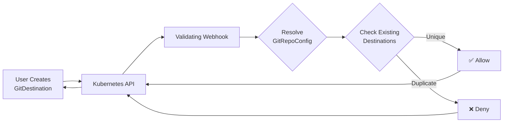

# GitDestination Uniqueness Validation

## Overview

GitDestination resources enforce a **cluster-wide uniqueness constraint** to prevent conflicts when multiple destinations attempt to write to the same Git location. This is enforced via a Kubernetes validating admission webhook.

## Uniqueness Constraint

Each GitDestination must have a unique combination of:
1. **Repository URL** (resolved from referenced GitRepoConfig)
2. **Branch name**
3. **Base folder path**

## How It Works

### Validation Flow



### Implementation Details

**Webhook Location**: [`internal/webhook/gitdestination_validator.go`](../internal/webhook/gitdestination_validator.go)

**Registration**: Automatically registered in [`cmd/main.go`](../cmd/main.go)

**Validation Logic**:
1. Resolve GitRepoConfig to get actual repository URL
2. Normalize URL (handles `.git` suffix, case, trailing slashes)
3. Create SHA256 identifier: `hash(normalized_url:branch:folder)`
4. Query all existing GitDestinations cluster-wide
5. Compare identifiers
6. Allow if unique, deny if duplicate

## Examples

### ✅ Valid - Unique Destinations

```yaml
# Destination 1
apiVersion: configbutler.ai/v1alpha1
kind: GitDestination
metadata:
  name: team-a-prod
  namespace: default
spec:
  repoRef:
    name: shared-repo
  branch: main
  baseFolder: teams/team-a/prod

---
# Destination 2 - ALLOWED (different folder)
apiVersion: configbutler.ai/v1alpha1
kind: GitDestination
metadata:
  name: team-b-prod
  namespace: default
spec:
  repoRef:
    name: shared-repo
  branch: main
  baseFolder: teams/team-b/prod  # Different folder ✅
```

### ❌ Invalid - Duplicate Destination

```yaml
# Destination 1
apiVersion: configbutler.ai/v1alpha1
kind: GitDestination
metadata:
  name: prod-dest-1
  namespace: namespace-a
spec:
  repoRef:
    name: my-repo
  branch: main
  baseFolder: clusters/prod

---
# Destination 2 - REJECTED
apiVersion: configbutler.ai/v1alpha1
kind: GitDestination
metadata:
  name: prod-dest-2
  namespace: namespace-b  # Different namespace
spec:
  repoRef:
    name: my-repo
  branch: main
  baseFolder: clusters/prod  # Same folder ❌ CONFLICT!
```

**Error Message**:
```
Error from server: admission webhook denied the request:
GitDestination conflict detected - another destination already uses this location:
  Repository: https://github.com/myorg/myrepo
  Branch: main
  BaseFolder: clusters/prod
  Conflicting Resource: namespace-a/prod-dest-1

Suggestion: Use a different baseFolder (e.g., 'clusters/prod/namespace-b') to avoid conflicts
```

## URL Normalization

The webhook normalizes repository URLs to ensure consistent comparison:

| Original URL | Normalized URL |
|-------------|----------------|
| `https://GitHub.com/Org/Repo.git` | `https://github.com/org/repo` |
| `https://github.com/org/repo/` | `https://github.com/org/repo` |
| `git@github.com:org/repo.git` | `git@github.com:org/repo` |

## Cross-Namespace Conflicts

The uniqueness constraint is enforced **cluster-wide**, meaning:

- GitDestinations in **different namespaces** can conflict
- Two namespaces **cannot share** the same `(repo+branch+folder)` location
- This prevents git worker race conditions regardless of namespace isolation

## Best Practices

### Strategy 1: Namespace-Specific Folders
```yaml
# Each namespace gets its own folder
baseFolder: clusters/prod/namespace-a
baseFolder: clusters/prod/namespace-b
```

### Strategy 2: Team-Specific Folders
```yaml
# Each team gets its own folder
baseFolder: teams/platform/prod
baseFolder: teams/application/prod
```

### Strategy 3: Environment Separation
```yaml
# Separate by environment
baseFolder: prod/cluster-1
baseFolder: staging/cluster-1
```

## Troubleshooting

### Error: GitDestination conflict detected

**Problem**: Attempting to create/update a GitDestination that conflicts with an existing one.

**Solution**:
1. Check the error message for the conflicting resource name
2. Either:
   - Use a different `baseFolder`
   - Use a different `branch`
   - Delete/modify the conflicting resource
   - Reuse the existing GitDestination (share it between WatchRules)

### Example Resolution

**Before** (Conflict):
```yaml
# Both try to use same location
dest-1: repo=my-repo, branch=main, folder=prod
dest-2: repo=my-repo, branch=main, folder=prod  # ❌ Conflict!
```

**After** (Resolved):
```yaml
# Option A: Different folders
dest-1: repo=my-repo, branch=main, folder=prod/team-a  # ✅
dest-2: repo=my-repo, branch=main, folder=prod/team-b  # ✅

# Option B: Different branches
dest-1: repo=my-repo, branch=main, folder=prod    # ✅
dest-2: repo=my-repo, branch=dev, folder=prod     # ✅

# Option C: Shared destination
# Create one GitDestination, reference it from multiple WatchRules
```

## Testing

### Unit Tests
Location: [`internal/webhook/gitdestination_validator_test.go`](../internal/webhook/gitdestination_validator_test.go)

**Coverage**: 17 test cases including:
- URL normalization
- Uniqueness validation
- Cross-namespace conflict detection
- Error handling

### E2E Tests
Location: [`test/e2e/e2e_test.go`](../test/e2e/e2e_test.go)

**Strategy**: Each e2e test uses a unique baseFolder to prevent conflicts:
- `e2e/configmap-test`
- `e2e/delete-test`
- `e2e/crd-install-test`
- `e2e/icecream-test`
- `e2e/crd-delete-test`

## Implementation References

- **Validator**: [`internal/webhook/gitdestination_validator.go`](../internal/webhook/gitdestination_validator.go)
- **Tests**: [`internal/webhook/gitdestination_validator_test.go`](../internal/webhook/gitdestination_validator_test.go)
- **API Types**: [`api/v1alpha1/gitdestination_types.go`](../api/v1alpha1/gitdestination_types.go)
- **Registration**: [`cmd/main.go`](../cmd/main.go)
- **E2E Helpers**: [`test/e2e/helpers.go`](../test/e2e/helpers.go)