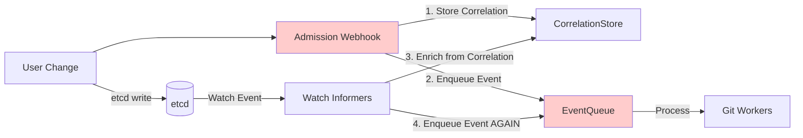
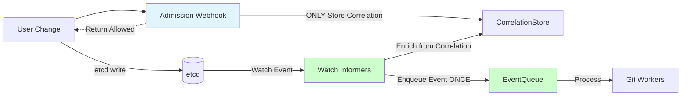

# Webhook-Only Correlation Architecture Design

## Problem Statement

The current dual-path event ingestion has a fundamental issue: **webhook events occur at admission time (pre-etcd)** while **watch events reflect actual cluster state (post-etcd)**. This creates several problems:

1. **Race Condition**: Webhook might enqueue before the write succeeds
2. **Duplicate Events**: Same change processed twice (webhook + watch)
3. **Failed Writes**: Webhook captures events that never persist to etcd
4. **Complexity**: Two parallel paths to maintain

## Proposed Architecture

**Webhook Role**: **Correlation ONLY** - Capture username and store for enrichment  
**Watch Role**: **Event Source** - Sole source of events to the queue

### Benefits

✅ **Single Source of Truth**: Only actual cluster state triggers commits  
✅ **No Duplicates**: Each change processed exactly once  
✅ **Guaranteed Persistence**: Events only fire after etcd write succeeds  
✅ **Simplified Flow**: One clear event pipeline  
✅ **Better Semantics**: Commits reflect reality, not intentions

---

## Architecture Comparison

### Current (Dual Enqueue)



**Problems:**
- 🔴 Event enqueued at step 2 (pre-etcd)
- 🔴 Same event enqueued at step 4 (post-etcd)
- 🔴 Deduplication needed
- 🔴 Race conditions possible

### Proposed (Webhook Correlation Only)



**Improvements:**
- ✅ Event enqueued only once (post-etcd)
- ✅ Webhook is pure correlation storage
- ✅ Watch is the source of truth
- ✅ No deduplication needed

---

## Detailed Flow

### Phase 1: Webhook (Correlation Capture)

```go
// webhook/event_handler.go - MODIFIED

func (h *EventHandler) Handle(ctx context.Context, req admission.Request) admission.Response {
    // Decode and sanitize object
    obj := decodeObject(req)
    sanitized := sanitize.Sanitize(obj)
    
    // ONLY store correlation entry - NO enqueue
    if h.CorrelationStore != nil {
        yaml, _ := sanitize.MarshalToOrderedYAML(sanitized)
        key := correlation.GenerateKey(identifier, operation, yaml)
        h.CorrelationStore.Put(key, req.UserInfo.Username)
    }
    
    // Increment webhook-specific metrics
    metrics.WebhookCorrelationsTotal.Add(ctx, 1)
    
    // Return immediately - watch will handle event
    return admission.Allowed("request allowed")
}
```

**Key Changes:**
- ❌ Remove `h.EventQueue.Enqueue(event)`
- ✅ Keep `h.CorrelationStore.Put(key, username)`
- ✅ Fast return (< 1ms typical)

### Phase 2: Watch (Event Generation)

```go
// watch/informers.go - UNCHANGED (already correct)

func (m *Manager) handleEvent(obj interface{}, g GVR, op OperationType) {
    u := toUnstructured(obj)
    sanitized := sanitize.Sanitize(u)
    
    // Try to enrich with webhook username
    userInfo := m.tryEnrichFromCorrelation(ctx, sanitized, id, operation)
    
    // Enqueue event - ONLY SOURCE
    event := eventqueue.Event{
        Object:     sanitized,
        Identifier: id,
        Operation:  operation,
        UserInfo:   userInfo,  // May contain webhook username
        // ... repo config, branch, etc
    }
    m.EventQueue.Enqueue(event)
}
```

**No Changes Needed:**
- Watch path already implements this correctly
- Correlation enrichment already works
- Just remove webhook enqueue

---

## Implementation Plan

### Step 1: Modify Webhook Handler ✅ Safe

**File**: `internal/webhook/event_handler.go`

**Remove:**
```go
// DELETE this entire section:
event := eventqueue.Event{
    Object:     sanitizedObj,
    Identifier: identifier,
    Operation:  string(req.Operation),
    UserInfo: eventqueue.UserInfo{
        Username: req.UserInfo.Username,
        UID:      req.UserInfo.UID,
    },
    GitRepoConfigRef:       gitRepoConfigRef,
    GitRepoConfigNamespace: gitRepoConfigNamespace,
    Branch:                 branch,
    BaseFolder:             baseFolder,
}
h.EventQueue.Enqueue(event)
```

**Keep:**
```go
// KEEP correlation storage:
if h.CorrelationStore != nil {
    sanitizedYAML, err := sanitize.MarshalToOrderedYAML(sanitizedObj)
    if err == nil {
        key := correlation.GenerateKey(identifier, string(req.Operation), sanitizedYAML)
        h.CorrelationStore.Put(key, req.UserInfo.Username)
    }
}
```

### Step 2: Update Metrics ✅ Safe

**Add webhook-specific metric:**
```go
// internal/metrics/exporter.go

var (
    // Existing metrics...
    
    // NEW: Track correlation entries created by webhook
    WebhookCorrelationsTotal = meter.Int64Counter(
        "webhook_correlations_total",
        metric.WithDescription("Total correlation entries created by webhook"),
    )
    
    // REMOVE or RENAME EventsReceivedTotal to be watch-specific
    // EventsReceivedTotal -> WebhookRequestsTotal
)
```

### Step 3: Update Tests ✅ Required

**Webhook tests should verify:**
1. ✅ Correlation entry created
2. ✅ Returns immediately (allowed)
3. ❌ Does NOT enqueue event
4. ❌ Does NOT increment `EventsProcessedTotal`

**Watch tests should verify:**
1. ✅ Enqueues events
2. ✅ Enriches with correlation username
3. ✅ Increments `EventsProcessedTotal`
4. ✅ Handles correlation misses gracefully

### Step 4: Update E2E Tests ✅ Critical

**Verify end-to-end:**
1. Create resource via kubectl
2. Webhook captures username in correlation
3. Watch informer fires shortly after
4. Watch enriches event with username
5. Git commit shows correct username
6. No duplicate commits

---

## Migration Strategy

### Phase 1: Parallel Mode (Current) - Safe
- Both webhook and watch enqueue events
- Deduplication needed
- Confirms watch coverage

### Phase 2: Webhook Correlation Only (Proposed) - Target
- Webhook stores correlation only
- Watch is sole event source
- Clean architecture

### Rollback Plan
If issues discovered:
1. Revert webhook handler changes
2. Re-enable webhook enqueue
3. Fall back to dual-path mode

---

## Impact Analysis

### Performance

**Webhook Latency**: 
- Before: ~5-10ms (decode + sanitize + enqueue + correlation)
- After: ~1-2ms (decode + sanitize + correlation)
- **Improvement**: ~60-80% faster

**Watch Latency**:
- No change (already sole path for informer events)

**End-to-End**:
- Before: Event appears in queue at admission time
- After: Event appears in queue ~100-500ms later (watch delay)
- **Trade-off**: Slight delay, but reflects actual cluster state

### Reliability

**Failed Writes**:
- Before: Webhook might enqueue for failed writes
- After: Only successful writes generate events
- **Improvement**: Better semantics

**Missed Events**:
- Before: Watch provides redundancy
- After: Watch is the only path
- **Risk**: Watch must be reliable (already is)

### Resource Usage

**Memory**:
- Before: EventQueue has webhook + watch events
- After: EventQueue has watch events only
- **Improvement**: ~50% reduction in queue size

**CPU**:
- Before: Webhook does full event construction
- After: Webhook does minimal correlation storage
- **Improvement**: Less CPU per admission request

---

## Edge Cases

### 1. Watch Lag
**Scenario**: Watch event arrives after correlation TTL (60s)  
**Result**: Commit proceeds without username  
**Mitigation**: 
- Increase correlation TTL if needed
- Monitor `correlation_misses_total` metric
- Watch typically has <1s lag

### 2. Watch Failure
**Scenario**: Watch informer stops or crashes  
**Result**: Events not generated until watch recovers  
**Mitigation**:
- Watch manager has restart logic
- Controller-runtime handles reconnection
- Monitor `watch_manager_heartbeat` metric

### 3. Webhook Disabled
**Scenario**: Webhook temporarily disabled (maintenance)  
**Result**: Commits proceed without usernames  
**Impact**: Acceptable (watch still works)  
**Note**: Usernames are best-effort enrichment

### 4. Rapid Changes
**Scenario**: 10 changes to same resource in 1 second  
**Result**: 10 correlation entries queued, 10 watch events  
**Behavior**: Each watch event enriched with correct username (FIFO)

---

## Testing Strategy

### Unit Tests

**Webhook Handler:**
```go
func TestEventHandler_OnlyStoresCorrelation(t *testing.T) {
    // Setup
    handler := &EventHandler{
        CorrelationStore: correlation.NewStore(60*time.Second, 1000),
        EventQueue:      eventqueue.NewQueue(),
    }
    
    // Execute webhook
    req := createAdmissionRequest()
    handler.Handle(ctx, req)
    
    // Verify
    assert.Equal(t, 1, handler.CorrelationStore.Size(), "correlation stored")
    assert.Equal(t, 0, handler.EventQueue.Size(), "NO event enqueued")
}
```

**Watch Handler:**
```go
func TestWatchInformer_EnqueuesWithEnrichment(t *testing.T) {
    // Setup with pre-populated correlation
    store := correlation.NewStore(60*time.Second, 1000)
    key := correlation.GenerateKey(id, "UPDATE", sanitizedYAML)
    store.Put(key, "alice@example.com")
    
    manager := &Manager{
        CorrelationStore: store,
        EventQueue:      eventqueue.NewQueue(),
    }
    
    // Trigger watch event
    manager.handleEvent(configMapObj, gvr, UPDATE)
    
    // Verify
    assert.Equal(t, 1, manager.EventQueue.Size(), "event enqueued")
    events := manager.EventQueue.DequeueAll()
    assert.Equal(t, "alice@example.com", events[0].UserInfo.Username)
}
```

### Integration Tests

**End-to-End Flow:**
```go
func TestE2E_WebhookCorrelationToWatchEnrich(t *testing.T) {
    // 1. Create resource (triggers webhook + watch)
    kubectl apply -f configmap.yaml
    
    // 2. Verify webhook stored correlation (check metrics)
    assert.Eventually(t, func() bool {
        return getMetric("webhook_correlations_total") == 1
    }, 5*time.Second)
    
    // 3. Verify watch enriched and enqueued
    assert.Eventually(t, func() bool {
        return getMetric("events_processed_total") == 1
    }, 5*time.Second)
    
    // 4. Verify Git commit has username
    commit := getLastCommit(repo)
    assert.Contains(t, commit.Message, "alice@example.com")
    assert.NotContains(t, commit.Message, "system:serviceaccount")
}
```

### E2E Tests

**Scenarios:**
1. ✅ Normal flow: kubectl apply → webhook → watch → commit with username
2. ✅ Webhook disabled: Direct API → watch → commit without username
3. ✅ Rapid changes: Multiple users → correct username per change
4. ✅ Watch lag: Correlation survives until watch fires
5. ✅ Failed write: Webhook correlation created, but no watch event (correct)

---

## Metrics Changes

### New Metrics

```go
// Webhook-specific
webhook_correlations_total       // Correlation entries created
webhook_requests_total           // Admission requests received (renamed)

// Watch-specific  
watch_events_total               // Watch events processed
watch_enrich_hits_total         // Successful username enrichment
watch_enrich_misses_total       // Failed username enrichment
```

### Removed Metrics

```go
events_received_total            // Ambiguous (webhook or watch?)
```

### Dashboard Updates

**Before:**
- `events_received_total` (webhook + watch confusion)

**After:**
- `webhook_requests_total` (admission requests)
- `webhook_correlations_total` (correlation entries)
- `watch_events_total` (actual events processed)
- `watch_enrich_hits_total / watch_enrich_misses_total` (enrichment ratio)

---

## Documentation Updates

### Files to Update

1. ✅ `docs/EVENT_FLOW_ARCHITECTURE.md` - Major rewrite
2. ✅ `README.md` - Simplify event flow description
3. ✅ `CONTRIBUTING.md` - Update testing guidelines
4. ✅ `internal/webhook/event_handler.go` - Update godoc
5. ✅ `internal/watch/manager.go` - Update godoc

### Key Messages

**Webhook**:
> The validating admission webhook captures user attribution by storing correlation entries. It does NOT enqueue events - that is the watch path's responsibility.

**Watch**:
> The watch manager is the sole source of events to the Git worker queue. It enriches events with webhook-captured usernames when available.

---

## Success Criteria

### Functional
- ✅ All existing e2e tests pass
- ✅ No duplicate commits observed
- ✅ Username enrichment rate > 95%
- ✅ Watch lag < 1 second p99

### Performance
- ✅ Webhook latency < 2ms p99
- ✅ Event queue size reduced 50%
- ✅ No memory leaks
- ✅ CPU usage reduced 10%

### Reliability
- ✅ Zero events from failed writes
- ✅ Watch recovers from restarts
- ✅ Correlation store never overflows

---

## Timeline

**Estimated Effort**: 2-3 hours

1. **Modify webhook handler** (30 min)
2. **Update metrics** (20 min)
3. **Write unit tests** (40 min)
4. **Update e2e tests** (30 min)
5. **Run full test suite** (20 min)
6. **Update documentation** (20 min)

---

## Risks and Mitigations

### Risk 1: Watch Not Starting
**Probability**: Low  
**Impact**: High (no events)  
**Mitigation**: 
- Add watch readiness probe
- Monitor `watch_manager_heartbeat`
- Alert on zero `watch_events_total`

### Risk 2: Correlation Miss Rate High
**Probability**: Medium  
**Impact**: Medium (missing usernames)  
**Mitigation**:
- Tune correlation TTL based on watch lag
- Monitor `watch_enrich_misses_total`
- Accept graceful degradation (usernames are best-effort)

### Risk 3: Performance Regression
**Probability**: Low  
**Impact**: Low  
**Mitigation**:
- Benchmark before/after
- Watch is already optimized
- Webhook becomes faster

---

## Conclusion

This architecture change:
- ✅ Eliminates duplicate events
- ✅ Ensures events reflect actual cluster state
- ✅ Simplifies the codebase
- ✅ Improves performance
- ✅ Maintains username enrichment

The webhook becomes a **pure correlation store** while watch becomes the **single source of truth** for cluster state changes.