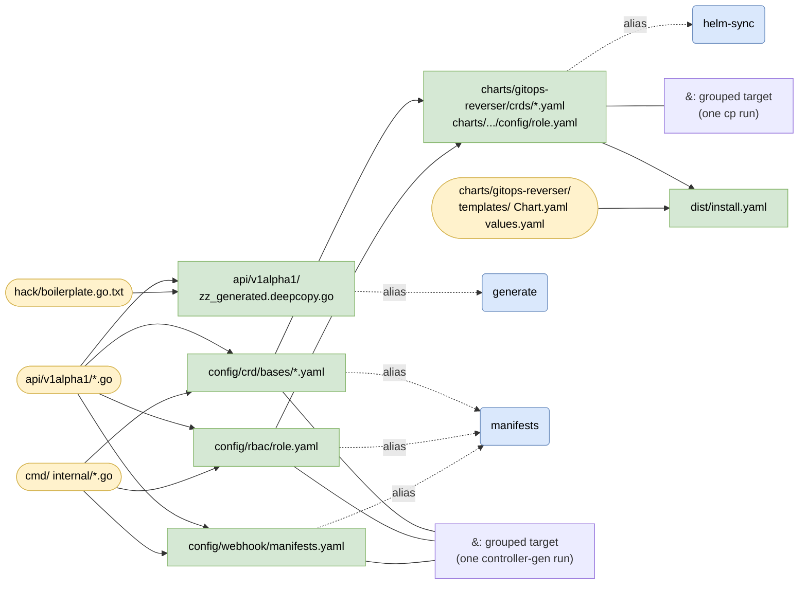
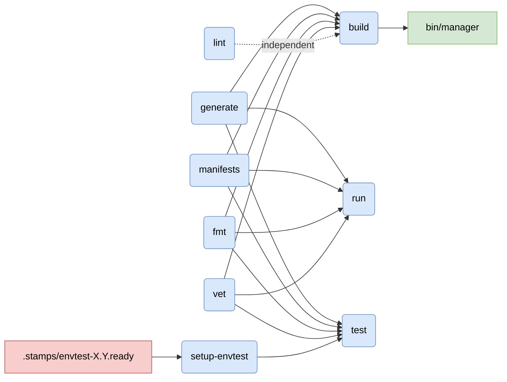
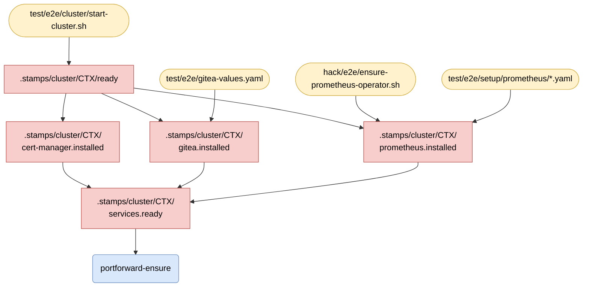
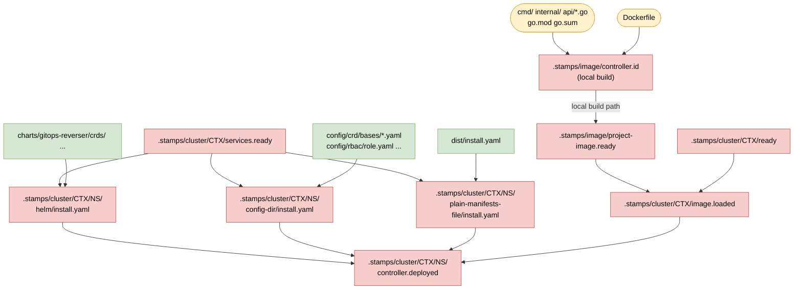
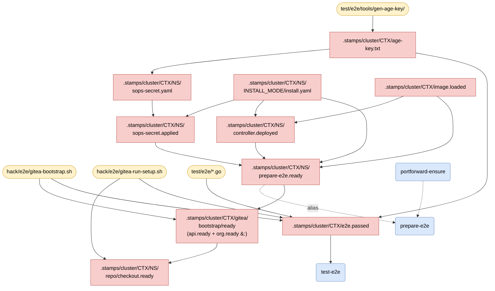
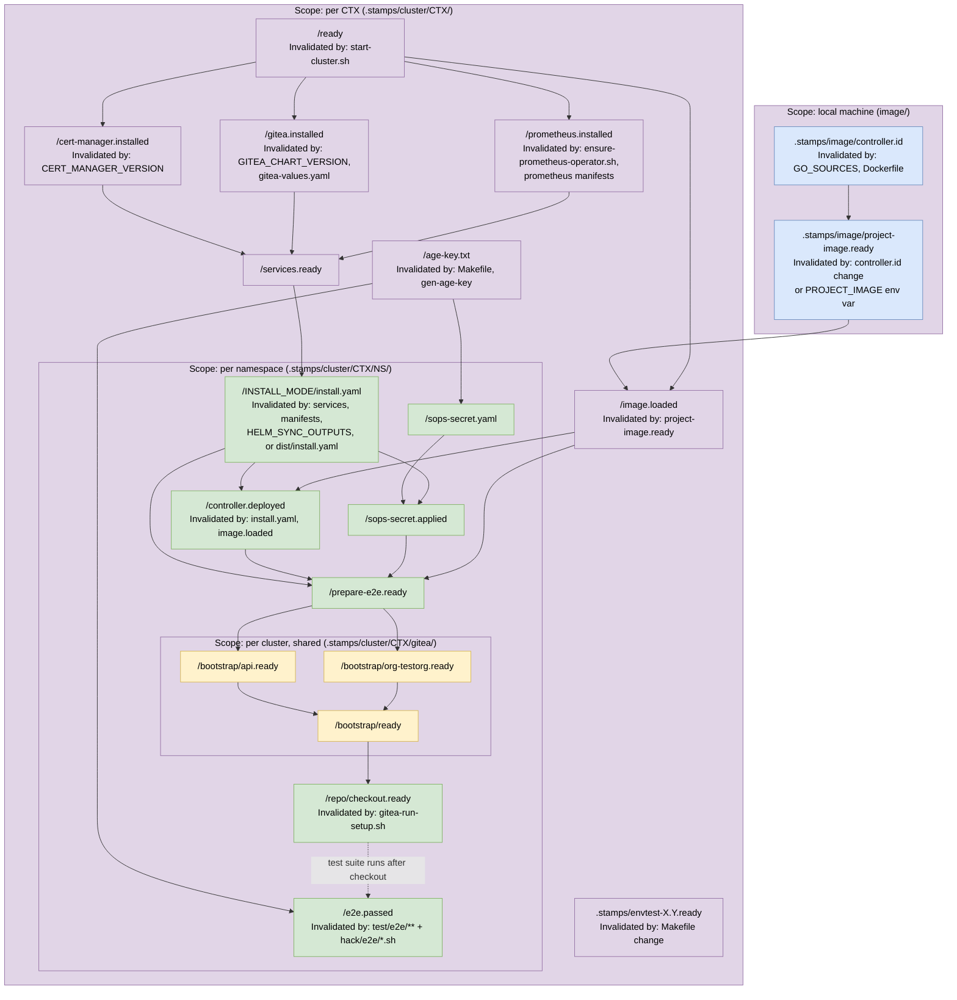

# Makefile Target & Dependency Reference

Rendered with Mermaid (supported in GitHub, VSCode with Markdown Preview Mermaid extension, and most modern docs platforms).

---

## Design Principles

| Principle | How it is implemented |
|---|---|
| **Never delete on abort** | Tests are run against live stamps; nothing is cleaned automatically. State survives for investigation. |
| **Reuse everything possible** | All expensive work (cluster, installed services, image, install) is tracked by stamp files under `.stamps/`. A target only re-runs if its inputs changed. |
| **Mimic real user usage** | Three install paths (`helm`, `config-dir`, `plain-manifests-file`) each apply the controller exactly as a user would, not via shortcuts. |

---

## Quick Reference

### User-facing targets

| Target | Category | What it does |
|---|---|---|
| `build` | Dev | Compile `bin/manager` |
| `run` | Dev | Run controller locally (no container) |
| `test` | Dev | Unit tests with envtest |
| `lint` / `lint-fix` | Dev | golangci-lint |
| `generate` | Codegen | Generate `zz_generated.deepcopy.go` |
| `manifests` | Codegen | Generate CRDs, RBAC, webhook manifests |
| `helm-sync` | Packaging | Sync manifests into Helm chart |
| `docker-build` | Image | Build `IMG` for local use |
| `docker-buildx` | Image | Cross-platform push |
| `install` | E2E | Deploy controller (uses `INSTALL_MODE`) |
| `prepare-e2e` | E2E | Full environment prep (called by Go BeforeSuite) |
| `test-e2e` | E2E | Run full e2e suite |
| `test-e2e-quickstart-helm` | E2E | Quickstart smoke test (Helm) |
| `test-e2e-quickstart-manifest` | E2E | Quickstart smoke test (manifest) |
| `e2e-gitea-bootstrap` | E2E | Bootstrap Gitea org (cluster-scoped, reused) |
| `e2e-gitea-run-setup` | E2E | Create repo + credentials (run-scoped) |
| `portforward-ensure` | E2E | Start/verify port-forwards |
| `setup-envtest` | Tools | Download envtest binaries |
| `clean` | Cleanup | Remove `bin/`, `dist/`, `.stamps/` |
| `clean-installs` | Cleanup | Delete controller namespace + CRDs |
| `clean-port-forwards` | Cleanup | Kill port-forward processes |
| `clean-cluster` | Cleanup | Tear down k3d cluster |

### Key variables

| Variable | Default | Purpose |
|---|---|---|
| `CTX` | `k3d-gitops-reverser-test-e2e` | kubeconfig context; parameterises all stamp paths |
| `NAMESPACE` | `gitops-reverser` | Target namespace for controller install |
| `INSTALL_MODE` | `config-dir` | One of `helm` \| `config-dir` \| `plain-manifests-file` |
| `PROJECT_IMAGE` | `gitops-reverser:e2e-local` | Image to deploy; set externally in CI to skip local build |
| `GITEA_PORT` | `13000` | Local port for Gitea port-forward |
| `PROMETHEUS_PORT` | `19090` | Local port for Prometheus port-forward |

---

## Diagrams

> **Conventions used in all diagrams**
>
> | Shape | Meaning |
> |---|---|
> | Yellow parallelogram | Source file / input |
> | Blue rounded rectangle | Phony Make target (user-facing) |
> | Green rectangle | Generated file or stamp |
> | Red cylinder | `.stamps/` marker file |
> | `&:` label | GNU Make grouped target — one recipe writes all listed outputs |

---

### 1. Code Generation Pipeline

How Go source files flow through `controller-gen` into all generated artifacts.

---

### 2. Developer Daily Workflow

Targets used for local development. All depend on generated artifacts.

---

### 3. E2E Cluster & Services Bootstrap

How the k3d cluster and its shared services come to life. These stamps are **cluster-scoped** and reused across test runs.

---

### 4. Controller Image & Installation

How the controller image is built (or pulled), loaded into k3d, and deployed — one path per install mode.

> **Note on `PROJECT_IMAGE`**: if `PROJECT_IMAGE` is set externally (CI), the `controller.id` build step is skipped entirely and the image is pulled instead. The `project-image.ready` stamp tracks which path was taken.

---

### 5. E2E Test Execution

The full chain from `make test-e2e` to a passing suite. The Go test binary calls `make prepare-e2e` from `BeforeSuite`, so the stamp chain feeds directly into the test process.

> **`e2e-gitea-bootstrap`** and **`e2e-gitea-run-setup`** are convenience phony aliases for `bootstrap/ready` and `repo/checkout.ready` respectively, callable independently for debugging.

---

### 6. Stamp File Hierarchy

All `.stamps/` paths, showing scope and what invalidates each level.

---

## Reuse vs. Rebuild Decision Matrix

| What changed | Stamps invalidated | What Make rebuilds |
|---|---|---|
| `api/*.go` | `controller.id`, `zz_generated.deepcopy.go`, `config/crd/bases/*.yaml` | Image, generated code, manifests, helm-sync, install.yaml, controller.deployed |
| `cmd/` or `internal/*.go` | `controller.id`, CRD manifests | Image rebuilt, controller redeployed |
| `Dockerfile` | `controller.id` | Image rebuilt, controller redeployed |
| `charts/` templates | `dist/install.yaml` | Only `plain-manifests-file` install re-runs |
| `test/e2e/*.go` | `e2e.passed` | Go test binary re-runs, nothing else |
| `hack/e2e/*.sh` | `e2e.passed` (via E2E_TEST_INPUTS) | Go test binary re-runs |
| `test/e2e/gitea-values.yaml` | `gitea.installed` | Gitea upgraded, services chain re-runs |
| `GITEA_CHART_VERSION` | `gitea.installed` (stamp content mismatch) | Gitea upgraded |
| New `CTX=` | All `CS` stamps | Full cluster bootstrap (nothing else) |
| `INSTALL_MODE=` switch | `NS/INSTALL_MODE/install.yaml` | Only new install mode runs; old one cached |
