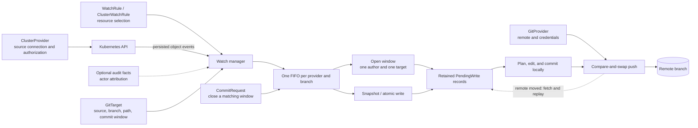
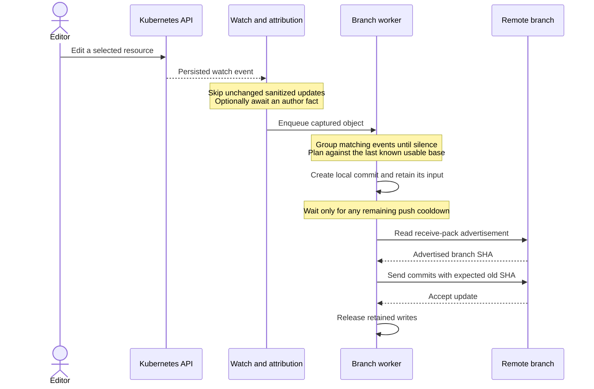
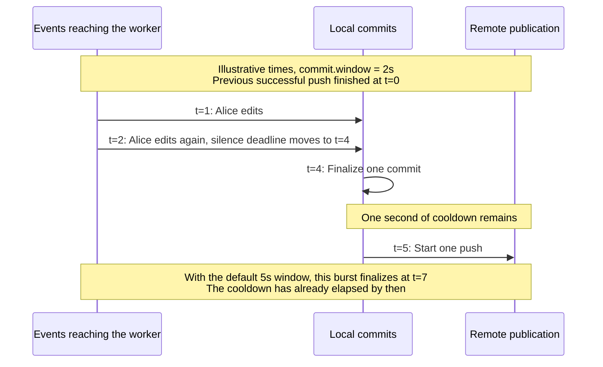
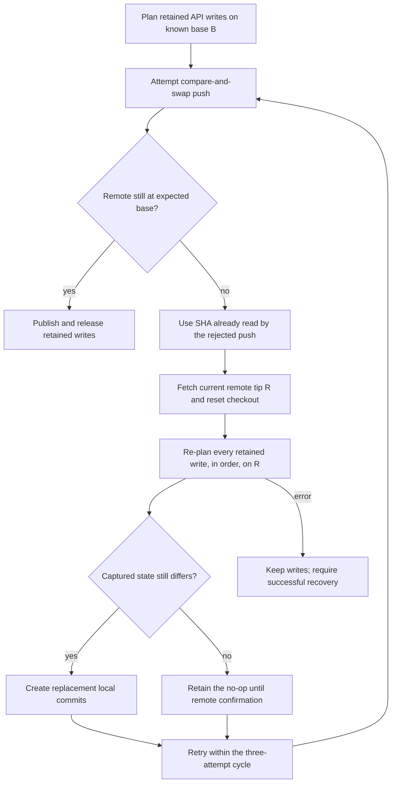
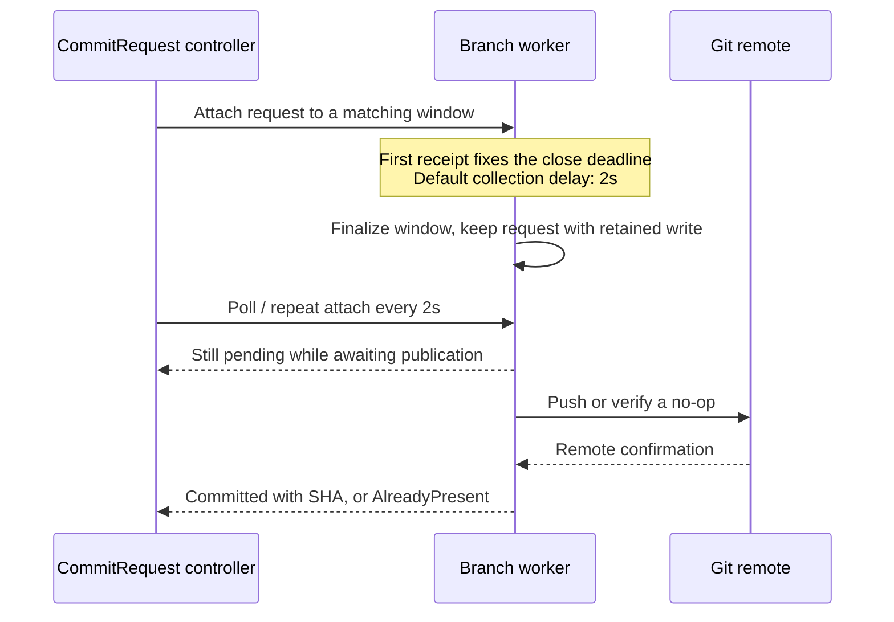

# API-first publication: structure, stories, and timing

**API-first, not API-only.** Anyone can still write to the branch. The Kubernetes API decides only
what happens when both sides change the same object.

GitOps Reverser treats changes persisted through the Kubernetes API as its normal input. It
captures selected live objects, writes their desired state into Git, and publishes quickly while
grouping bursts into useful commits. Another writer moving the remote branch is an expected
exception: the worker fetches that new base and replays the writes it has not yet published.

**The short version.** A captured object, meaning the live resource as the watch saw it, is the
complete desired content of the YAML document that holds it. When an API change and a Git change
reach the same object, publication writes the API object over it, including the fields only Git
changed; every other document keeps what Git says. There is no merge and no conflict state to
clear, and a branch that someone else moved costs a replay rather than a failure.
[Story 2](#story-2-another-writer-moves-the-remote-branch) walks that case, and the
[deferred merge investigation](future/git-api-three-way-comparison.md) records what preserving both
sides would require.

**How the rest is arranged.** [The structures](#the-structures-and-their-responsibilities) name the
moving parts once. Four stories then follow a single change each: a normal publication, a branch
that moved underneath one, a save request, and an idle target. The timing sections after them are
for tuning and debugging.

Publishing before reading the branch is a design decision. A remote request can take a second in a
particular deployment; requiring a fetch before every push would charge every API edit for the less
common case of a competing Git writer. The push already checks the remote branch, so a healthy
worker can plan locally and spend its network budget on publication.

This guide describes the shipped behavior. The inbound Git push receiver remains a proposal: see
[how to call the receiver](design/push-notification-and-reconcile-trigger.md#83-the-wire-contract-for-whoever-calls-it)
for the request shape it will accept. The one scheduling limitation to know about is that retained
work has no retry timer of its own; [failure timing](#failure-timing-and-memory-limits) says what
that means in practice. The [inbound notification design](design/push-notification-and-reconcile-trigger.md)
contains the implementation history and the proposed receiver; [architecture](architecture.md)
covers the wider operator.

## The structures and their responsibilities

One branch worker serializes writes for each `(GitProvider namespace, GitProvider name, branch)`.
Targets on that worker share its queue, checkout, and push cooldown. Their commit settings and
destination paths remain target-specific.



| Structure | Responsibility |
| --- | --- |
| `ClusterProvider` | Selects the source cluster and its access boundary |
| `WatchRule`, `ClusterWatchRule` | Select resources and route them to a target |
| `GitTarget` | Binds source state to a Git path and branch; sets commit shaping |
| `GitProvider` | Supplies repository access and commit identity settings |
| `BranchWorker` | Owns branch ordering, local repository operations, and publication |
| Open window | Coalesces consecutive events from one author for one target |
| `PendingWrite` | Retains captured content and resolved write metadata until publication |
| `CommitRequest` | Claims a matching window and reports its eventual outcome |

The watch stream supplies object state. Audit facts supply authorship when attribution is enabled.
Admission captures the submitter of a `CommitRequest`. These inputs have separate jobs; mirroring
continues without actor attribution. See the [attribution contract](spec/attribution.md).

The queue and retained writes are in memory. They are sufficient for replay during the worker's
lifetime, but do not form a durable event log across a process crash. A restarted watch rebuilds
current state; it cannot reconstruct every unpublished intermediate edit or its original author.

## Story 1: an API edit becomes a published commit

A burst of edits by one actor normally becomes one commit after the target's silence window.
Repeated changes to the same resource within that window retain the latest captured value.
Changing author or target closes the current window, preserving commit attribution and scope.



On the healthy path, there is no pre-publication fetch. The client checks the advertised SHA
against the cycle's base, and the server checks the expected old SHA when accepting the update.
The server check covers a competing push that happens after the advertisement was read.

The first usable base still requires a fetch, reached through the first write or resync. Starting
the worker alone opens no Git connection. Repository preparation handles an existing target
branch, a fallback to the default branch, or an empty repository. Snapshot reconciliation gathers the
selected live resources and applies its scoped mark-and-sweep only after the initial snapshot is
complete. See [watch-list reconciliation](spec/reconcile-via-watchlist-mark-and-sweep.md).

## Two clocks: commit grouping and push cadence

The default `5s` commit window is a rolling silence timer. The fixed `5s` push cooldown starts when
a publication succeeds. These clocks overlap.

| Control | Value | Starts or resets when | Purpose |
| --- | --- | --- | --- |
| `GitTarget.spec.commit.window` | Default `5s`; `0s` disables waiting | A same-author, same-target event enters the open window | Group an editing burst into one commit |
| `PushCooldown` | Fixed `5s` per worker | A publication succeeds, including a verified no-op | Accumulate finalized commits for one push |
| Identity boundary | Immediate | Author or target changes | Keep commit attribution and scope separate |
| Atomic write | Immediate local processing | A caller-defined batch arrives | Preserve a batch after finalizing earlier open work |
| Retained-byte threshold | Default `8Mi` | Estimated open plus retained bytes reach the threshold | Close the open window under memory pressure |
| Shutdown | Immediate attempt | The worker exits | Attempt to publish finalized work without waiting for cooldown |

The first publication can push as soon as a commit is ready. There is no initial five-second
push wait. Setting `commit.window: 0s` makes local commits immediately; subsequent publications
still share the branch cooldown. Multiple targets do not each receive a separate push allowance.

For a healthy, quiet branch, a useful approximation is:

```text
commit ready = last matching event at the worker + commit window + local planning time
push starts  = max(commit ready, previous successful publication finished + 5s)
visible in Git = push starts + Git publication time
```

Watch delivery, attribution, queue backlog, and contention add time outside that approximation.
Timers make work eligible; they cannot interrupt a Git operation already running on the worker.



The silence window has no independent maximum age. Continuous matching edits can keep it open
until another closing condition occurs, such as a `CommitRequest`, identity change, or byte
threshold. A five-second window therefore does not promise publication within five seconds of
the first edit. The [commit-window contract](spec/commit-window-refactor.md) owns the full rules.

## What can stop a write before it reaches Git

Three gates sit between a captured object and a commit. Each fails differently, and only one of
them is retried automatically, so it is worth knowing which one you are looking at.

| Gate | What it protects | What happens when it closes |
| --- | --- | --- |
| Sensitive-resource encryption | Secrets and configured sensitive types must never reach Git in plaintext | The write fails rather than falling back to plaintext. There is no opt-out |
| Acceptance of the Git path | The target's folder must be content the writer can edit safely | The plan is refused and reported as `GitPathAccepted=False` on the `GitTarget`. The target re-checks roughly every ten seconds; recovery requires an accepted resync after correcting the folder or live state |
| Render fidelity | A target whose render-vs-live epoch is pending or divergent must not take live writes | Live events and atomic writes are dropped while the gate is closed. Resync stays allowed so it can measure and repair Git |

A refusal is not a transient error and is not retried into success. It is the common reason a live
edit never appears in Git while the worker looks healthy, so check the `GitTarget` conditions before
the worker logs.

[`spec.onRefusal: PushEmptyCommit`](bi-directional.md#choosing-speconrefusal) can request Git
re-application for eligible refused edits. It leaves these gates in force, and publishing the
empty commit does not establish that the live value was restored or the target recovered.

Separately, a window whose finalize fails is **dropped**, not retried: its events are gone until
the next resync re-derives them from the current live state. That is a deliberate choice, because
the events are already lost to the failed flush and replaying a broken state every cycle helps
nobody. It is counted by `gitopsreverser_git_commit_failures_total`.

## Story 2: another writer moves the remote branch

The worker preserves the new remote history and rebuilds its unpublished writes on top of it.
The replay inputs are the captured objects and metadata retained since the last successful
publication. The known base identifies the Git revision underlying those retained writes. Replay
uses those inputs without querying a historical API event log.



Replay re-runs planning against the fetched tree. It can change unpublished commit SHAs or turn
a write into a no-op. It retains the captured author, target, and resolved write configuration;
prune permissions can tighten before replay. It does not perform a three-way field merge.

For example, Alice changes `replicas` through the API while Bob changes `image` in Git on the
same object. Alice's captured object contains both fields. Replaying it writes her `replicas` and
also the `image` she was looking at, so **Bob's change to that object does not survive**, and a
field Bob added that the cluster never had is removed outright. Bob's commit remains in history.
Separate objects are independent; separate fields of one object are not. Unrelated files are
preserved within the supported layout rules. See
[shared-path behavior](bi-directional.md#what-a-write-does-to-the-file).

This is the consequence of API-first ownership: the captured API object drives the supported
manifest edit. A Git-side change reaches the cluster through a separate reconciler such as Flux
or Argo CD. Reverser does not apply Git to Kubernetes.

The [deferred three-way comparison investigation](future/git-api-three-way-comparison.md) records
the exact merge rules and the alternatives: timestamps, retained API contents, Git field
differences, applier confirmation, and audit request intent. Implementation is deferred while
development remains API-first.

Kubernetes apply and field-ignore policies govern the other reconciliation direction. Ignoring
replicas during apply can preserve an API scale change, but Reverser still captures the whole
object, including an old image. The [Flux and Argo CD source review](facts/gitops-apply-and-field-ignore.md)
explains why these policies help with field authority without providing a concurrent-edit merge.

### Three separate recovery questions

The worker needs three pieces of state because a successful push cannot answer every question
about its local checkout.

| State | Meaning | Recovery consequence |
| --- | --- | --- |
| `baseTrusted` | The last observed base remains usable for optimistic planning | Fetch if untrusted and no writes are retained |
| `worktreeDirty` | A failed write may have left partial filesystem or index changes | Reset; replay retained writes if present |
| `replayRequired` | A reset discarded retained commits and their rebuild is incomplete | Block publication until the retained writes are rebuilt |

“Trusted” does not mean the remote cannot have changed since the last observation. Detecting
that change is the compare-and-swap's job. Similarly, a clean checkout can still be missing the
commits represented by retained writes.

The recovery rule is to fetch, reset, and replay before proceeding with retained work whose local
representation is unsafe. `replayRequired` is set **before** the reset rather than after it,
because a reset can move the branch reference and then fail while rewriting the worktree: the
commits behind the retained writes are already unreachable at that point, and a flag set only on
the success path would miss exactly that case. The cost of setting it too eagerly is one fetch on
the next cycle.

A fourth piece of state is not a flag: the trust above is bound to the repository it was gained
against. A `GitProvider` is repointed by deleting and recreating it, which does not restart the
worker, so trust from the previous repository must not be carried into the new one. Carrying it
forward would skip establishing the new checkout entirely.

## Story 3: save now, and know what reached Git

A `CommitRequest` closes a matching author-and-target window after its collection delay. It
does not bypass the push cooldown. The default delay is `2s`, measured from the worker's first
receipt; repeat attaches keep the original deadline. The accepted range is `0` to `300` seconds.



A local no-diff result still consults the remote before reporting `AlreadyPresent`. A competing
Git edit can make that same captured API object require a real commit after replay.

A worker that stops while still holding the write fails the request with an error rather than
leaving it to time out, so a shutdown mid-publication is reported as a failure and not as silence.

Use `Pushed=True` plus `status.sha` when a particular commit must exist in Git. `Ready=True` also
covers successful outcomes with no commit. Status visibility follows the controller's polling
cadence and Kubernetes status writes. The controller's safety timeout is `420s` from object
creation; resolved worker outcomes are retained for `15m` with cleanup on subsequent resolutions.
See the [request contract](spec/commitrequest-design.md).

The two-second collection delay is not a guarantee that an earlier API edit has reached the
worker. Attribution can wait up to three seconds per event, and queueing adds more. A request
whose matching event arrives after its deadline can finish with `NoWindowInGrace`. Increasing the
delay permits more collection time; it does not reserve an API transaction.

## Story 4: an idle target and a Git-side edit

A healthy idle branch worker generates no Git traffic. Its commit and push timers are armed for
work, and neither is a periodic remote poll. It can therefore retain an old view after a foreign
push until a later publication, resync, or explicit recheck.

The proposed inbound push receiver would notify the worker that its base needs refreshing. It
would coalesce notifications, refresh on the worker, and replay any retained writes. It is useful
for idle visibility and for avoiding a rejected push. The healthy publication optimization
already works without that receiver.

There is a separate, existing manual mechanism: changing
`reconcile.configbutler.ai/requestedAt` on a `GitTarget` requests a fresh reconcile. That performs
a cluster-to-Git snapshot after fetching. It can write the cluster's current values over the
fetched manifests. A passive Git refresh endpoint for a future webhook needs separate handling.

When Flux or Argo CD shares the path, its own refresh and apply cadence also affects whether a
live edit survives long enough to be published. Those clocks belong to the other reconciler.
The [bi-directional guide](bi-directional.md) describes the integration choices and limitations.

## The other clocks around publication

These timers operate at different layers. Adding all their defaults together does not produce
an end-to-end latency budget.

| Mechanism | Current default or bound | Why it exists; relationship to Git |
| --- | --- | --- |
| Actor attribution wait | Up to `3s` per event; configurable | Allows an audit fact to arrive; a match can release the event earlier |
| Attribution fact retention | `10m`; configurable | Keeps identity evidence available for late watches and restarts; adds no intentional publication delay |
| Configuration settling | `2s` silence, capped at `10s` | Groups related target/rule edits before updating watches |
| Shared watch refresh | `30s` | Refreshes API catalogs and namespace scopes; unchanged watch plans do not fetch Git |
| Watch-owner retry | `2s`, `5s`, `10s`, `30s`, then `60s` | Retries failed planning or shared refreshes; separate from Git push retry |
| Watch reconnect | `2s` backoff | Reopens a failed source watch; a fresh snapshot can cause a Git resync |
| Type activation / removal | `5s` stable / `60s` grace | Avoids acting on transient API discovery changes; observation cadence also affects visibility |
| Healthy controller reconcile | `5m` | Refreshes control-plane status and dependencies; does not imply a Git fetch |
| Unconverged target recheck | Normally `10s` | Includes repeated forced rechecks for refused Git paths; these can fetch |
| Lost status-write retry | `100ms` | Retries a Kubernetes status update after an optimistic-lock race |
| Watch planning / shared refresh deadlines | `30s` / `2m` | Bounds watch-owner work; Git publication has separate execution |
| Scoped resync result wait | `5m` | Bounds the observer's wait for a worker result; does not cancel a queued Git operation |

Sources: [attribution resolver](../internal/watch/author_resolver.go),
[watch owner](../internal/watch/owner.go), [watch sessions](../internal/watch/target_watch.go),
[type lifecycle](../internal/typeset/lifecycle.go),
[type removal](../internal/typeset/registry.go),
[controller constants](../internal/controller/constants.go), and
[resync result handling](../internal/watch/event_router.go).

Attribution runs before enqueueing and a watch stream handles events serially. Several missing
facts can therefore accumulate delay on one stream. Lowering the Git commit window does not
remove that upstream wait.

### Failure timing and memory limits

The cooldown limits successful publication cadence. It is not a retry backoff or a global
request-rate limiter. A contention cycle attempts up to three pushes without a deliberate delay
between them, fetching and rebuilding when the remote moved. Different branch workers can
publish independently.

After a push or retained-write recovery fails, `pushPending` stops its timer and keeps the work.
There is currently no dedicated retry timer. Later work that schedules publication can retry it;
a quiet branch has no bounded retry time. A `CommitRequest` poll alone does not schedule another
push. Conversely, continued arrivals after an expired cooldown can provoke frequent failed
attempts. An independent, bounded failure backoff would address both cases while preserving
silence when there is no pending work.

The byte threshold forces finalization but does not free retained writes during a remote outage.
It is not a hard memory ceiling. The separate branch queue has `1000` slots by default and drops
new items when full. Current-state resync can repair the resulting mirror, but cannot recover the
exact dropped history. These throughput and recovery limits do not justify fetching before every
healthy publication.

## What the network saving measures

The checked-in [request ledger](../internal/git/testdata/git-roundtrip-ledger.golden) counts
smart-HTTP requests served by a real Git backend. It measures neither TCP connections nor
wall-clock latency. Authentication, transport setup, object size, and server behavior affect
elapsed time.

| Operation in the harness | HTTP requests |
| --- | ---: |
| Bootstrap helper against an empty remote | 1 |
| Bootstrap helper against a populated remote | 3 |
| Healthy publication after initialization | 2 |
| Several commits in one healthy publication | 2 |
| Live publication whose final plan is a no-op | 1 |
| Publication rejected once, then accepted | 6 |
| Publication rejected twice, then accepted | 10 |
| Forced recheck of an unchanged remote | 2 |
| Snapshot resync that produces a commit | 4 |
| Healthy idle worker | 0 |

The healthy publication drops from four requests before this PR to two. A successful push reads
the receive-pack advertisement and then sends its packfile. A no-op reads the advertisement and
sends no packfile. A fetch with no object transfer still costs two requests in this implementation;
a fetch that transfers objects normally costs three.

For illustration, if each serial HTTP request costs roughly one second, removing two requests
saves roughly two seconds of network wait per healthy publication. Actual elapsed time needs a
benchmark. Local planning, rendering, encryption, and replay also take time; the ledger does not
measure them.

The two bootstrap rows call `EnsurePathBootstrapped` directly. That helper has no production
caller at the reviewed revision, so these rows measure repository preparation through a test
entry point. They do not measure the complete operator startup sequence.

Snapshot resync keeps its fetch because a no-op snapshot can finish without a push advertisement.
Avoiding that fetch safely would require a separate freshness check on that path.

The proposed notification's savings need their own measurement. With today's primitives, an
early notification followed by one object-transferring fetch and one successful push costs five
HTTP requests. Its benefit in that scenario is avoiding the rejected advertisement, reducing six
requests to five. Multiple remote moves depend on notification timing and coalescing.

## How to observe the design in operation

The [metrics guide](interpreting-metrics.md) documents the counters and queries. Read them by
provider and branch so different workers do not hide one another's behavior.

| Signal | Interpretation |
| --- | --- |
| `gitopsreverser_git_fetches_total`, reason `publication` | Base-establishment fetches; should stop increasing during healthy steady publication |
| Same counter, reason `contention` | Fetch/reset after confirmed remote movement |
| Same counter, reason `push_failure_probe` | Remote-state lookup after an unclassified push failure |
| Same counter, reason `recovery` | Attempts to rebuild unsafe retained work or clean a dirty checkout |
| Same counter, reason `forced_recheck` | Explicit refresh, and the snapshot a resync judges against |
| Same counter, reason `bootstrap` | Instrumented bootstrap helper; currently called only by tests |
| `gitopsreverser_git_pushes_total` and `gitopsreverser_git_push_retries_total` | Completed publication cycles and contention retries within them |
| `gitopsreverser_git_push_duration_seconds` | Time inside a push cycle, including its inline replays |
| `gitopsreverser_git_queue_depth` and `gitopsreverser_git_queue_drops_total` | Outstanding work and queue overload |

A fetch counter counts calls. The ledger counts the HTTP requests each call produces.
Push-cycle duration excludes
the earlier attribution and commit-window waits, cooldown, and recovery performed before entering
the cycle. It cannot by itself answer “how long from my API edit until Git accepted it?”

A flat recovery counter also cannot prove progress: the worker may be retaining work without a
retry timer. Check queue depth, failure logs, and `CommitRequest` outcomes alongside rates.

A resync's fetch lands under `forced_recheck` whether or not the branch happened to hold retained
writes, so a growing `publication` series means live publication is fetching again and nothing
else. That was worth getting right: the two cases differ only in push timing, and while they
reported differently the central diagnostic on this page could not be read at face value.
