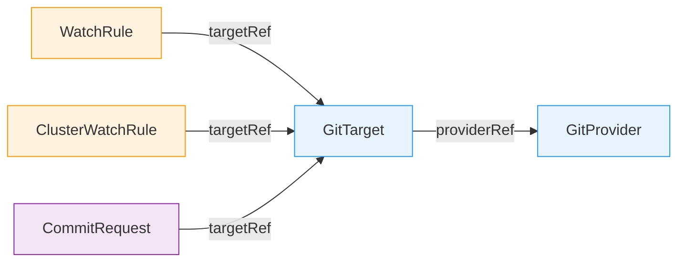
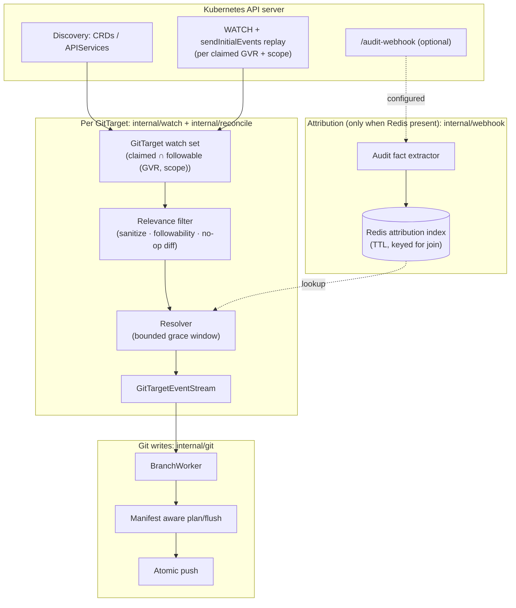
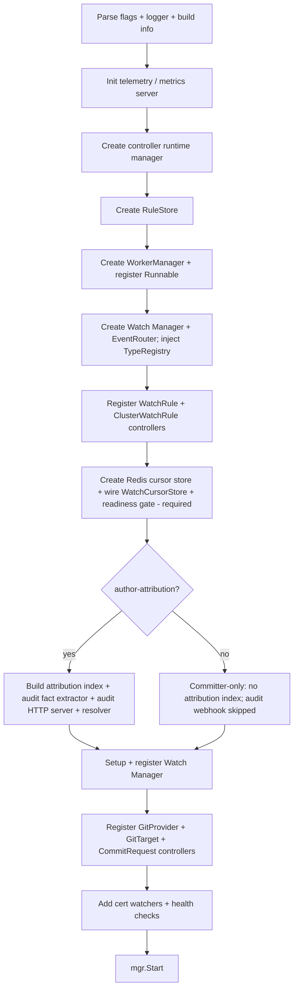

# GitOps Reverser Architecture

GitOps Reverser is a Kubernetes operator that observes cluster mutations and writes the resulting
desired object state to Git. It reverses the traditional GitOps direction: instead of Git driving the
cluster, the Kubernetes API drives Git. The repository becomes a continuously updated mirror of live
cluster state.

This document describes how the operator works **today**. Read the [Ground Rules](#ground-rules) and
[Mental Model](#mental-model) for the shape of the system, then the
[Configuration Model](#configuration-model) and [A Change, End to End](#a-change-end-to-end) for how you
drive it. The later sections give the reference detail behind each piece. If a detail here ever
disagrees with the source, the source wins; deeper design records live under [docs/design/](design/).

***

## Ground Rules

These are the design decisions to keep in your head while reading or changing the code:

**The Kubernetes API is the source of truth.** Git is a materialized mirror of desired state from the
API. State is ingested by **watch**; these paths never treat Git as authority. When a push conflicts
with a newer remote commit, the operator fetches the new remote state, resets its local clone, and
replays its retained writes from the API.

**Watch is the only object-state source.** Each `GitTarget` opens one Kubernetes watch per claimed
`(GVR, scope)` with `sendInitialEvents=true`. Every Git write derives from persisted state the watch
observed. Audit never defines *what* changed — it only, optionally, explains *who* caused it.

**Writes are serialized per Git branch.** One [BranchWorker](../internal/git/branch_worker.go) owns each
`(GitProvider namespace, GitProvider name, branch)` tuple. Multiple `GitTarget`s may share one branch.
Every write to that branch goes through the worker's single event loop and commit window.

**Audit is an optional attribution lookup.** When attribution is enabled, kube-apiserver posts audit
events to `/audit-webhook`; the operator extracts a minimal attribution fact (auditID, user, verb,
resourceVersion, GVR/namespace/name/UID, status, timestamps) into a Redis attribution index keyed for a
join, and a resolver attaches the commit author to a watch event by matching a fact within a bounded
grace window. A missing, late, or absent fact never blocks state capture; it only changes the author.

**Redis/Valkey is required.** It stores each GitTarget's per-watch resume cursors, so the operator
resumes exactly where it left off after a restart or reconnect instead of re-listing from scratch; when
attribution is enabled it also stores the audit facts. Running **committer-only**
(`--author-attribution=false`) disables the audit webhook and author attribution — every commit
is authored by the configured committer — but still requires Redis. Redis is further the substrate for
**high availability** (multi-pod needs durable cross-pod state: branch-shard leases and durable write
queues); see [Operational Boundaries](#operational-boundaries) and the
[HA / GitTarget distribution plan](future/ha-gittarget-distribution-plan.md).

***

## Mental Model

The easy part is "write YAML to Git." The hard parts shape the whole architecture:

* **Ordering.** Two updates to the same object must land in Git in cluster order.
* **Not losing changes.** A dropped or late event must never leave Git *permanently* wrong — in
  particular, a delete that happens while no watch is running must still be reconciled.
* **Secrets.** Sensitive objects must never touch disk in plaintext.
* **Scale.** A cluster holds thousands of objects across hundreds of types; you cannot keep a live
  watch open on all of them.

The solution, in the vocabulary used throughout this document:

* **Watch is the only object-state source.** Each `GitTarget` opens one Kubernetes watch per claimed
  `(GVR, scope)` with `sendInitialEvents=true`. The apiserver delivers a watch's events already ordered
  by `resourceVersion` for that type, so there is nothing to re-order. Every Git write derives from
  persisted state the watch observed.
* **Watches are per `GitTarget` and scaled by claims.** A watch opens only for the claimed ∩ followable
  `(GVR, scope)` set, so cost scales with what `GitTarget`s actually claim, not with cluster type count.
* **Recovery prefers watch.** A new watch normally starts with `sendInitialEvents`, establishes a
  current snapshot boundary, and runs a **mark-and-sweep**: any Git file whose object is no longer
  present is deleted. When Redis has a fresh per-type cursor, the operator skips the snapshot and
  resumes a normal watch from that resourceVersion. Cursors are keyed by `GitTarget` UID and carry a
  TTL refreshed on every watch event and bookmark, so a live watch keeps its cursor warm while a deleted
  one's cursor simply expires — and a stale resourceVersion (`410 Gone`) rebuilds from a fresh replay.
  Older APIs that reject `sendInitialEvents` fall back to LIST plus buffered WATCH. The sweep fires on
  snapshot establishment, **never on a timer**.
* **Audit, when enabled, only names the author.** It is an optional attribution lookup; a missing or
  late fact costs author fidelity, never correctness, and with attribution disabled the product commits
  as the configured committer.
* **One `BranchWorker` per Git branch serializes all writes.** Every write to a branch funnels through a
  single worker and a single commit window, which keeps concurrent GitTargets and authors from racing
  each other into a corrupt tree.

***

## Configuration Model

You configure GitOps Reverser entirely through five CRDs (group `configbutler.ai`, version
`v1alpha2`). `WatchRule` and `ClusterWatchRule` choose which Kubernetes resources enter the pipeline.
`CommitRequest` can ask for the current window to be saved. `GitTarget` chooses the branch and path.
`GitProvider` supplies the repository, credentials, commit settings, and push policy.



| CRD | Scope | One line role |
|---|---|---|
| `WatchRule` | namespaced | which resources in *this* namespace route to a GitTarget |
| `ClusterWatchRule` | cluster | which cluster scoped or cluster wide resources route to a GitTarget |
| `CommitRequest` | namespaced | a one shot "save the open window now" signal |
| `GitTarget` | namespaced | one materialization destination `(provider, branch, path)` |
| `GitProvider` | namespaced | a Git repo + credentials + commit/signing config |

### WatchRule / ClusterWatchRule

* **Sources**: [watchrule_types.go](../api/v1alpha2/watchrule_types.go),
  [clusterwatchrule_types.go](../api/v1alpha2/clusterwatchrule_types.go)
* **Controllers**: [watchrule_controller.go](../internal/controller/watchrule_controller.go),
  [clusterwatchrule_controller.go](../internal/controller/clusterwatchrule_controller.go)

A `WatchRule` selects resources in its own namespace and routes matching events to a same namespace
`GitTarget`. A `ClusterWatchRule` does the same for cluster scoped resources or namespaced resources
across the whole cluster, with an explicit namespace `targetRef`. Both share the rule model:

* `spec.rules[]`: OR resource rules (`MinItems=1`).
* `rules[].operations`: `CREATE` / `UPDATE` / `DELETE` / `*`; omitted means all.
* `rules[].apiGroups`: omitted resolves the named resource across served groups; `""` is the core
  group; `*` is all.
* `rules[].apiVersions`: omitted means the preferred served version.
* `rules[].resources`: plural resource names or `*`.
* `ClusterWatchRule` adds `rules[].scope`: `Cluster` or `Namespaced` (each rule independently scoped).

Subresources are rejected in rule resources. Mirroring operates on top level resources; the selected
`/scale` subresource effect is translated separately into a parent `spec.replicas` field patch.

### CommitRequest

* **Source**: [api/v1alpha2/commitrequest_types.go](../api/v1alpha2/commitrequest_types.go)
* **Controller**: [internal/controller/commitrequest_controller.go](../internal/controller/commitrequest_controller.go)

A one shot "save now" signal that finalizes the open commit window for a same namespace `GitTarget`
instead of waiting for the silence timer. The **entire spec is immutable**. Key fields:

* `spec.targetRef.name`: target whose open window should be finalized.
* `spec.message`: optional verbatim commit message (1–1024 chars, no control characters).
* `spec.closeDelaySeconds`: optional `0–300s` delay before the window is closed, so the author's own
  in flight changes can join the window before it closes.
* `status.conditions`: kstatus-compatible. **Ready** is the summary (True once the request reached a
  terminal outcome that is not an error — a pushed commit, or a benign no-commit);
  **Reconciling**/**Stalled** are the kstatus progress/blocked pair; **AuthorAttributed** reports
  whether the internal commands admission webhook named the submitter or the request fell back to the
  configured committer; **Pushed** reports whether the commit reached the remote. The `Ready`
  condition's `reason` carries `Committed`, `NoWindowInGrace`, `WindowMismatch`, `AlreadyPresent`, or
  `FinalizeFailed`. A benign no-commit (e.g. `NoWindowInGrace`) is `Ready=True`, `Stalled=False` — a correct,
  non-error outcome — whereas a `FinalizeFailed` is `Ready=False`, `Stalled=True`.
* `status.branch` / `status.sha`: set when the commit was pushed (`Pushed=True`).

How attribution and finalization interact is described under
[CommitRequest Finalize](#commitrequest-finalize).

### GitTarget

* **Source**: [api/v1alpha2/gittarget_types.go](../api/v1alpha2/gittarget_types.go)
* **Controller**: [internal/controller/gittarget_controller.go](../internal/controller/gittarget_controller.go)

One materialization destination: `(provider, branch, path)`. Key fields:

* `spec.providerRef`: a `GitProvider` in the same namespace (`group`/`kind` default to
  `configbutler.ai`/`GitProvider`, the only accepted values).
* `spec.branch`: immutable branch, validated against `GitProvider.spec.allowedBranches`.
* `spec.path`: immutable, required path under the repo (`MinLength=1`; `.` means repo root and must be
  chosen explicitly).
* `spec.encryption`: optional SOPS/age encryption settings for sensitive resources.

`providerRef`, `branch`, and `path` are immutable so a target cannot silently orphan an old
materialization. The controller also rejects path overlaps between GitTargets sharing a provider and
branch.

Status has a kstatus-compatible summary layer plus domain conditions:

* `Ready`, `Reconciling`, and `Stalled` are the generic conditions used by GitOps tooling. `Ready=True`
  means the latest observed generation is valid, the Git path is accepted, and source streams are running.
  Initial replay reports `Reconciling=True`. A human-fixable block reports `Stalled=True`.
* `Validated` and `EncryptionConfigured` explain control-plane health.
* `StreamsRunning` explains the source side: every tracked type is past initial replay and routing live
  events.
* `GitPathAccepted` explains the target side: the selected Git path is safe for the operator to
  materialize.
* `status.streams` is a bounded count summary, not a per-type list.

WatchRule and ClusterWatchRule add `ResourcesResolved` and `GitTargetReady`. `ResourcesResolved` explains
the source selector. `GitTargetReady` mirrors the referenced GitTarget's write readiness. This keeps
`StreamsRunning` honest: it only says source watches are running, not that Git writes can succeed.

### GitProvider

* **Source**: [api/v1alpha2/gitprovider_types.go](../api/v1alpha2/gitprovider_types.go)
* **Controller**: [internal/controller/gitprovider_controller.go](../internal/controller/gitprovider_controller.go)

Represents a Git repository and the credentials/configuration used to write it. Key fields:

* `spec.url`: immutable repository URL.
* `spec.secretRef`: optional Secret in the same namespace for HTTP/SSH authentication.
* `spec.knownHostsRef`: optional SSH known hosts source.
* `spec.allowedBranches`: glob patterns that gate writable branches.
* `spec.push.commitWindow`: rolling silence window for grouped commits, defaulting to `5s`.
* `spec.commit.committer`: committer identity (defaults to `GitOps Reverser` / `noreply@configbutler.ai`).
* `spec.commit.message`: `eventTemplate` / `reconcileTemplate` / `groupTemplate` Go templates.
* `spec.commit.signing`: SSH signing key reference and optional key generation.
* `status.signingPublicKey`: populated when signing is configured and key material is available.

The controller verifies repository reachability and manages the signing key lifecycle. It generates an
ed25519 keypair when `signing.generateWhenMissing` is set. The portable artifact across GitOps
ecosystems is the credentials Secret, not a foreign repository object. The credentials reader accepts the
Kubernetes native, Flux, and Argo CD Secret key dialects (see
[design/git-credentials-interop.md](design/git-credentials-interop.md)).

***

## A Change, End to End

Say a `GitTarget` in namespace `team-a` watches ConfigMaps, and a user runs `kubectl apply` to edit the
ConfigMap `team-a/app-config`. Here is the path that change takes.



Following the ConfigMap edit:

1. **Watch delivers it.** The API server applies the change and bumps the object's `resourceVersion`. The
   `GitTarget`'s watch on `core/configmaps` in `team-a` delivers a `MODIFIED` event carrying the new
   object body. (On a cold start or after `410 Gone`, the same object instead arrives as an `ADDED`
   during the `sendInitialEvents` replay.)
2. **Relevance filter.** The event is sanitized (status, managedFields, and volatile metadata stripped),
   checked for followability, and diffed against current Git content. A no-op (e.g. a `*/status` bump
   whose desired-state projection is unchanged) is dropped here.
3. **Resolve the author.** When Redis is present, the resolver waits a bounded grace window
   (`--author-attribution-grace`, default `3s`) for a matching audit fact in the attribution index, joining by
   resourceVersion/UID. On a strong match the real user or named service account becomes the author;
   otherwise (attribution off, no match, or expiry) the commit is authored by the configured committer. This
   wait is per-event and never reorders a watch — see [Watch Event Ordering](#watch-event-ordering).
4. **Route + window.** The event flows into the
   [GitTargetEventStream](../internal/reconcile/git_target_event_stream.go), and the
   [BranchWorker](../internal/git/branch_worker.go) appends it to the open commit window for
   `(author, GitTarget)`.
5. **Commit + push.** When the window closes (5s of silence, a `CommitRequest`, or a buffer limit), the
   manifest aware writer patches `team-a/.../app-config.yaml` in place, commits as the resolved author,
   and pushes via [PushAtomic](../internal/git/git_atomic_push.go) (retrying with fetch/reset/replay if
   the remote moved).

Separately, the audit path (only when Redis is configured): kube-apiserver POSTs audit events to
`/audit-webhook`; [AuditHandler](../internal/webhook/audit_handler.go) extracts a minimal attribution
fact and writes it to the Redis attribution index with a short TTL. That index is read only by the
resolver in step 3; it never creates or repairs object state.

**And if the watch had been lost?** A delete that happened while no watch was running is reconciled on
the next watch (re)connect: the `sendInitialEvents` replay plus **mark-and-sweep** removes any Git file
whose object no longer exists — see [State Ingestion and Not Losing Deletes](#state-ingestion-and-not-losing-deletes).
No path silently drops a delete.

***

## What It Writes to Git

A `GitTarget` owns one subtree (`spec.path`) on one branch. New objects are placed at a canonical REST
like path; once a document exists it is edited in place wherever it already lives. A populated target
looks like:

```text
team-a-config/                              # GitTarget spec.path
├── README.md                               # operator-managed bootstrap file
├── .sops.yaml                              # present only when encryption is configured
├── v1/
│   ├── configmaps/team-a/app-config.yaml
│   └── secrets/team-a/db-creds.sops.yaml   # sensitive types are SOPS/age encrypted
└── apps/
    └── v1/deployments/team-a/api.yaml
```

The path shape is `{spec.path}/{group}/{version}/{resource}/{namespace}/{name}.yaml` (the empty core
group is omitted, sensitive resources get a `.sops.yaml` suffix). Details and the placement policy are in
[Git Write Architecture](#git-write-architecture).

***

## State Ingestion and Not Losing Deletes

This is the heart of the system. Object state is ingested by **watch**, and the guarantee is: every
persisted mutation observed while watching reaches Git, and no delete is ever silently dropped across a
gap.

### Watch is already ordered by resource version

The apiserver delivers a watch's events already ordered by `resourceVersion` for that type, so there is
**nothing to re-order**: a `MODIFIED` always lands after the create it modifies. Each event carries GVR,
scope, event type (`ADDED` / `MODIFIED` / `DELETED`, plus the transport `BOOKMARK` and `ERROR`),
namespace/name/UID/resourceVersion/deletionTimestamp, and the sanitized object body. The
`initial-events-end` bookmark marks the end of a replay, and an `ERROR` such as `410 Gone` triggers a
fresh `sendInitialEvents` reconnect.

### Recovery: resume, replay, or list plus mark-and-sweep

Losing a watch (pod eviction, rollout, crash, `410 Gone`) is normal. When Redis has a cursor for the
watch shard, the next session first opens a normal watch from that resourceVersion. If the apiserver
can supply all events since that cursor, the watch simply continues from there. If the cursor is
expired, or no cursor exists, the watch opens with `sendInitialEvents=true` and
`ResourceVersionMatch=NotOlderThan`, so the apiserver streams current state as a replay of `ADDED`
events terminated by the `initial-events-end` bookmark. The operator runs a **mark-and-sweep** over
that replay:

1. every replayed object is **marked** `ADDED`, up to `initial-events-end`;
2. at the bookmark, any Git file under that GitTarget whose object was **not** marked no longer exists,
   so a `DELETED` is emitted for it (committer-authored — the actual delete was never witnessed);
3. then the watch streams live events.

**This mark-and-sweep is load-bearing and fires only on watch re-establishment, never on a timer** —
there is no periodic LIST or hourly drift sweep. It is the only thing that reconciles a delete that
happened while no watch was running, so it is what makes the watch safe to lose and restart. The sweep
is applied through the same per-type reconcile/writer machinery as live writes (see
[Mark and Sweep Resync](#mark-and-sweep-resync)).

If the apiserver forbids `sendInitialEvents` for a type, the operator logs an explicit warning, starts a
normal watch, buffers its events, performs a LIST snapshot, runs the same scoped mark-and-sweep from
that list, and only then lets the buffered watch events through. This is the compatibility path for
older aggregated API servers that do not implement streaming lists.

### Relevance filtering is product code

Watch has no audit policy, so it delivers every persisted `MODIFIED`, including controller status churn.
The relevance filter reproduces that filter in product code, on the hot path:

* **Sanitization** ([internal/sanitize](../internal/sanitize/)) strips status, managedFields, and
  volatile metadata before diffing, so runtime churn never masquerades as a desired-state change.
* **Followability** ([internal/typeset](../internal/typeset/)) encodes "controller-owned → don't mirror"
  — a type that is not followable never gets a watch.
* **No-op suppression.** A `*/status` write bumps `resourceVersion` but its sanitized projection equals
  the prior commit; the writer diffs it to a no-op and discards it.

### History granularity

Watch carries only the versions it observes. While connected it sees each `MODIFIED`; across a replay
after `410`, a compaction, or downtime it **collapses every intermediate version into current state**.
The product is therefore a *state mirror with opportunistic per-mutation history*, not a guaranteed
per-mutation change log.

***

## Optional Attribution

* **Handler / fact extractor**: [internal/webhook/audit_handler.go](../internal/webhook/audit_handler.go)
* **Attribution index**: [internal/queue/attribution_index.go](../internal/queue/attribution_index.go)
* **Resolver (grace window join)**: [internal/watch/author_resolver.go](../internal/watch/author_resolver.go)

Attribution runs **only when Redis is configured**. The Kubernetes API server POSTs audit `EventList`
payloads to a **single** HTTP endpoint, `/audit-webhook`; there is no supplementary body endpoint and no
body joiner, because watch — not audit — carries the object body. The handler applies an intrinsic accept
gate (StageResponseComplete, a mutating verb, success, non-dry-run, a changed resourceVersion, and the
`/scale` subresource only), extracts a minimal attribution fact, and writes it to the Redis attribution
index with a short TTL.

| Endpoint | Role |
|---|---|
| `/audit-webhook` | Audit source (kube-apiserver) for the optional attribution index |

Cluster ID path segments are rejected; multi cluster routing is not modeled yet.

### Attribution fact shape

The fact is the smallest thing needed to name an author, not an object log:

| Field | Purpose |
|---|---|
| `auditID` | diagnostics / dedupe |
| `user` / `impersonatedUser` | author candidate (human *or* service account) |
| `verb`, `subresource` | explain the write |
| `responseStatus.code`, `dryRun` | reject failures and non-persistent requests (at the handler gate) |
| GVR, namespace, name, UID | exact join keys |
| response object resourceVersion | exact watch-event match |
| stage timestamp | recency |

The index writes the fact under several join keys, strongest first: exact `(GVR, ns, name, uid, rv)`,
then `(GVR, ns, name, uid)` (for deletes whose watch RV differs from the audit RV), then
`(GVR, ns, name, rv)` (when UID is absent). Each key carries the same short TTL (minutes, not hours);
old facts are never needed for correctness because watch owns state.

### The resolver and its grace window

A watch event waits a **bounded grace window** (`--author-attribution-grace`, default `3s`) for a matching fact
to arrive, then ships regardless. On a strong match the actor becomes the author — a human or a service
account alike, always named by its own username (e.g.
`system:serviceaccount:flux-system:kustomize-controller`). A weak, conflicting, missing, or expired fact
resolves to the committer. A late fact that arrives after a commit has shipped **never rewrites it**.
With attribution disabled the resolver is absent and every commit is committer-authored.

The CommitRequest controller reads the same index by `(namespace, name, uid)` to attribute a request to
its submitter (see [CommitRequest Finalize](#commitrequest-finalize)).

***

## Watch Event Ordering

The grace window is a per-event wait on a **single-threaded watch goroutine** (one goroutine per
`(GitTarget, GVR, scope)`), and the downstream `GitTargetEventStream → BranchWorker` path is a synchronous
FIFO. So:

* **Same object / same type order is strictly preserved.** An object's events all flow through one watch
  goroutine in `resourceVersion` order; the grace wait is head-of-line (it delays the next event, never
  lets it overtake), so an older mutation can never overwrite a newer one.
* **The cost is throughput, not ordering.** A long wait stalls its own watch up to the grace window.
* **Unrelated objects on different types** (separate concurrent watches) may interleave or be grouped
  into commits differently than wall-clock — but they are different files, so the materialized state is
  unaffected, and `resourceVersion` is not comparable across types anyway.

The full analysis, worked examples, and the future non-blocking option are in
[Watch event ordering under the attribution grace window](design/watch-event-ordering-and-attribution-grace.md).

***

## Rule and Type Resolution

How a user's `WatchRule` becomes "this GitTarget follows these concrete types in these namespaces."

### RuleStore

* **Source**: [internal/rulestore/store.go](../internal/rulestore/store.go)

An in memory cache populated by the WatchRule and ClusterWatchRule controllers. Compiled rules carry the
full chain from rule to `GitTarget`, `GitProvider`, branch, and path. It is read by the watch manager (to
build watched type tables for GitTargets) and the rule change reconcile path.

### APIResourceCatalog

* **Source**: [internal/watch/api_resource_catalog.go](../internal/watch/api_resource_catalog.go)

A thin normalizer for each scan: it turns one discovery result into a policy annotated `typeset.Scan` and
keeps only mechanical bookkeeping. **All judgement across scans lives in the typeset registry**
(`Registry.UpdateFromScan`): a failed group/version keeps serving last known facts instead of looking
like an empty API surface, and a group/version that vanishes from a complete scan rides a removal grace
rather than being pruned. Both protect against accidental Git deletions on a discovery blink (see
[typeset-owns-discovery-grace.md](design/typeset-owns-discovery-grace.md)). The catalog refreshes on
startup, periodically, and when CRD/APIService trigger informers fire.

### TypeRegistry and Followability

* **Source**: [internal/typeset/](../internal/typeset/)
* **Design**: [design/manifest/version2/type-followability.md](design/manifest/version2/type-followability.md)

`internal/typeset` is the single decision surface for "can this type be followed?" Each `TypeRecord`
carries GVK/GVR identity, scope and preferred version facts, origin classification, subresource facts
(including usable `/scale` bindings), sensitivity policy, and one `Followability` verdict. Manifest
analysis and delete/scale resolution with only GVR all read it. The registry also owns the second, demand
axis via the **Materializer**: a type is materialized only when it is **Followable ∩ claimed**.

### WatchedTypeTable

* **Source**: [internal/watch/watched_type_table.go](../internal/watch/watched_type_table.go)

A projection for each `GitTarget` from the type registry, filtered by that target's rules, recording
resolved GVK/GVR/scope plus namespace and operation coverage. **This is where rule matching effectively
happens:** it resolves the set of `(GVR, scope)` a `GitTarget` claims, so the watch manager opens one
watch per claimed ∩ followable `(GVR, scope)` and scopes each watch's events back to that GitTarget's
namespaces.

***

## Watch Ingestion and Reconcile

Desired state comes from one **raw watch per `(GitTarget, GVR, scope)`**. Each event is sanitized, diffed
against current Git content, and applied — there is no separate per-type object store to reconstruct,
because Git already holds current state. The authoritative design is
[design/watch-first-ingestion-architecture.md](design/watch-first-ingestion-architecture.md).

* **Manager**: [internal/watch/manager.go](../internal/watch/manager.go)
* **Watch / replay / sweep**: [internal/watch/target_watch.go](../internal/watch/target_watch.go)
* **Author resolver (attribution join + grace window)**: [internal/watch/author_resolver.go](../internal/watch/author_resolver.go)
* **Event router**: [internal/watch/event_router.go](../internal/watch/event_router.go)
* **Worker resync apply (mark-and-sweep)**: [internal/git/resync_flush.go](../internal/git/resync_flush.go)

### The Watch Manager

The watch manager is a controller runtime `Runnable` (`NeedLeaderElection`). It owns **type level**
discovery, the per-GitTarget watch sets, and the watched type tables for GitTargets. Its object-state
intake is the watches themselves; its discovery watches/informers track the API surface (CRDs /
APIServices) rather than driving object state.

On `Start` it bootstraps the RuleStore from existing rules, refreshes the API catalog, updates the
TypeRegistry, builds watched type tables, and opens one watch per claimed ∩ followable `(GVR, scope)`.

### Opening watches

On each GitTarget reconcile the controller resolves the GitTarget's claimed ∩ followable `(GVR, scope)`
set. Fully specified GVRs are claimed unconditionally; wildcard rules and rules without a version are
resolved fail closed against discovery. For each `(GVR, scope)` the manager runs one watch goroutine that
opens the watch with `sendInitialEvents=true`, folds the replay into a desired set, runs the
mark-and-sweep at `initial-events-end`, then streams live events through the relevance filter and the
author resolver into the GitTargetEventStream. On disconnect or `410 Gone` the goroutine reconnects and
repeats the replay + sweep. See [Recovery: replay plus mark-and-sweep](#recovery-replay-plus-mark-and-sweep).

There is **no periodic LIST, no checkpoint, and no timer-driven drift sweep** — the sweep fires only on
watch re-establishment.

### Rule Change Reconcile

A WatchRule / ClusterWatchRule / GitTarget / CRD / APIService change reaches a GitTarget through the
**GitTarget controller**, which `Watches` those objects (generation change predicates) and queues the
affected GitTarget again. On reconcile the GitTarget resolves its claimed `(GVR, scope)` set again; a type
a new rule starts watching gets a new watch opened (with a `sendInitialEvents` replay) and a type no
longer claimed has its watch closed. The watch manager refreshes the API catalog and the watched type
tables.

### Mark and Sweep Resync

The BranchWorker applies a reconcile by scanning the GitTarget subtree and building a manifest plan (this
write side is shared with live writes):

* before anything is planned, a **structure-only acceptance gate** runs over the scanned subtree; if it
  finds content the operator cannot safely manage — a kustomization using an unsupported feature
  (generators / patches / components / helm / replacements / transformers / name(pre|suf)fix / remote
  bases), a duplicate manifest identity, an impure managed file, or a standalone non-KRM / invalid YAML —
  the whole apply is **refused**: nothing is committed, `GitPathAccepted=False`, `Stalled=True`, and
  `Ready=False` with reason `UnsupportedContent` until a human cleans the path;
* desired resources are upserted through the same content derived path as live writes;
* existing managed documents that are watched but absent from the desired set are deleted;
* the operator's own build directives (`kustomization.yaml`, `.sops.yaml`) and other allowlisted auxiliary
  YAML are retained, not materialised and not refused;
* nothing is committed if the apply cannot complete safely.

The acceptance gate is **structure-only on purpose**: it never refuses on a discovery-derived
followability fact (unwatched / out-of-scope), which can blink on a discovery wobble; only facts that are
true from the path's structure alone block a GitTarget. The same gate runs on the live write path, so a
refused path is never written into by a racing live event either. See
[unsupported-folder-refusal-plan.md](design/unsupported-folder-refusal-plan.md).

A reconcile is **type scoped** (`ScopeGVR`): the sweep is restricted to one `(group, resource)`, so
anchoring one type again never disturbs another's manifests. The desired set for the sweep is the
`sendInitialEvents` replay (everything marked `ADDED` up to `initial-events-end`), so a delete is
reconciled only after the replay completes.

***

## Git Write Architecture

### BranchWorker

* **Source**: [internal/git/branch_worker.go](../internal/git/branch_worker.go)
* **Worker manager**: [internal/git/worker_manager.go](../internal/git/worker_manager.go)

`BranchWorker` owns a local clone and a single FIFO event loop for its `(provider namespace, provider,
branch)` tuple. Events accumulate in one open commit window, which accepts only one `(author, GitTarget)`
pair at a time:

* same author + same GitTarget: append to the window;
* different author or GitTarget: finalize the current window first;
* repeated writes to the same Git path inside a window use last write wins.

The window finalizes when `spec.push.commitWindow` passes with no new matching event, the retained buffer
reaches `--branch-buffer-max-size` (default `8Mi`), a `CommitRequest` finalize deadline matches the open
author and GitTarget, or a resync request that is not a heal or shutdown arrives. Successful local commits
are retained until a fixed push cooldown (`5s`) allows a push, which prevents remote push storms during
bursts. Heal resyncs that arrive during a window are deferred and drained at the next idle boundary.

### Local Clones and Conflict Retry

Local clones live under `/tmp/gitops-reverser-workers/{namespace}/{provider}/{branch}/repos/{hash}`.
[PushAtomic](../internal/git/git_atomic_push.go) checks the remote ref before pushing. If the remote
diverged it smart fetches the latest tip, hard resets the local clone, replays the retained pending writes
against the fresh tip (refreshing commit hashes), and retries up to the attempt limit. This is valid
because every pending write is rebuilt from sanitized API state; nothing depends on locally edited files.

### Manifest Aware Writer

* **Steady state**: [internal/git/plan_flush.go](../internal/git/plan_flush.go)
* **Resync apply**: [internal/git/resync_flush.go](../internal/git/resync_flush.go)
* **YAML editor**: [internal/git/manifestedit/](../internal/git/manifestedit/)
* **Analyzer/planner**: [internal/manifestanalyzer/](../internal/manifestanalyzer/)
* **Object projection**: [internal/manifestreport/](../internal/manifestreport/)

For each commit the writer scans YAML files under the GitTarget path, builds a manifest store without bytes
keyed by resource identity, resolves each event (or each desired resource, for resync) to one action,
hydrates only touched files into buffers for the commit, and flushes only changed or deleted files.

* **Upserts:** if a managed document for the resource already exists, patch it in place (preserving
  siblings in a multi document file); if it is sensitive, encrypt the whole document again at its existing
  path; if no document exists, create a new file at the canonical placement path.
* **Deletes:** use the manifest identity index, so a moved manifest can still be deleted even when it is
  not at the canonical path.
* **Field patches** (currently `/scale` → parent `spec.replicas`) are intentionally narrow: they only
  patch an existing parent manifest and never fabricate a parent object from partial subresource data.

### File Placement

New resources use the canonical REST like path
`{spec.path}/{group}/{version}/{resource}/{namespace}/{name}.yaml`. The core group's empty segment is
omitted (`{spec.path}/v1/configmaps/ns/name.yaml`), and sensitive resources use a `.sops.yaml` suffix.
Existing resources are **match first**: once a document exists in Git, updates and deletes use its current
location instead of recomputing placement.

### Bootstrap, Encryption, and Signing

* **Bootstrap** ([bootstrapped_repo_template.go](../internal/git/bootstrapped_repo_template.go)): the
  first write to a GitTarget path stages a `README.md` and, when encryption is configured, a `.sops.yaml`
  with age recipient rules. Existing files are preserved.
* **Encryption** ([encryption.go](../internal/git/encryption.go),
  [sops_encryptor.go](../internal/git/sops_encryptor.go),
  [sensitivity policy](../internal/types/sensitive_resource.go)): core Secrets are sensitive by default;
  `--additional-sensitive-resources` adds more. Sensitive resources are **never written in plaintext**. If
  encryption is required and unavailable, the write fails before any plaintext file is created. Encrypted
  output is cached by metadata + plaintext digest to avoid redundant SOPS work.
* **Signing** ([signing.go](../internal/git/signing.go), [sshsig/](../internal/sshsig/)): commits use
  OpenSSH signatures, with the key read from `GitProvider.spec.commit.signing.secretRef` or generated when
  configured.

***

## CommitRequest Finalize

* **Controller**: [internal/controller/commitrequest_controller.go](../internal/controller/commitrequest_controller.go)
* **Admission author cache**:
  [internal/webhook/command_author_store.go](../internal/webhook/command_author_store.go)

A `CommitRequest` finalizes the open commit window for its GitTarget. The request author is resolved from
the internal commands admission webhook when that record exists. If the admission record is missing, the
request **finalizes as the configured committer** with `AuthorAttributed=False`; that fallback does not
fail the request:

1. The controller stamps the in-progress conditions (`Reconciling=True`) and settles
   `AuthorAttributed` synchronously from the admission author cache. There is no audit wait on this path.
2. The controller eagerly **attaches** the request to the worker (`AttachCommitRequest`), anchoring the
   finalize at `receipt + closeDelaySeconds`. The worker binds it to an open window only when author and
   GitTarget match. It **never finalizes another author's window**; a window carries at most one request.
3. The window finalizes on the deadline (or when it closes for any other reason). If a finalize closes an
   open window, the worker always schedules a push, so a window closed by an otherwise no-op resync is not
   stranded.
4. Outcomes resolve on push and are reported as conditions: a pushed commit sets `Ready=True` /
   `Pushed=True` with `branch`/`sha`; a benign no-commit sets `Ready=True` with the reason on `Ready` and
   `Pushed=False`; a failure sets `Ready=False` / `Stalled=True` with a message.

The CommitRequest submitter is not recoverable from object state alone, so without an audit fact the
finalize is committer-authored.

***

## Controller Wiring

Controllers watch their dependencies so dependents reconcile quickly after spec changes:

* `GitTargetReconciler` watches `GitProvider`, `WatchRule`, `ClusterWatchRule`, and the encryption
  `Secret`; it resolves the GitTarget's claimed `(GVR, scope)` watch set and derives the `Synced` condition
  + materialization summary.
* `WatchRuleReconciler` / `ClusterWatchRuleReconciler` watch `GitTarget` and `GitProvider`, populate the
  RuleStore, and trigger the rule-change reconcile.
* `GitProviderReconciler` validates reachability and manages the signing key lifecycle.
* `CommitRequestReconciler` runs with `MaxConcurrentReconciles=1` and attributes/attaches as above; its
  optional `AuthorLookup` is the Redis attribution index (nil in committer-only mode).

Dependency watches use generation change predicates to avoid queueing again on status only heartbeats.
`GitProvider`, `GitTarget`, and `CommitRequest` carry immutability constraints where a spec change would
orphan a materialized subtree or invalidate an in-flight finalize.

***

## Startup Sequence

Defined in [cmd/main.go](../cmd/main.go):



Redis is required: the cursor store is wired unconditionally and a Redis readiness gate keeps the pod
not-ready until Redis is reachable. With `--author-attribution` on (the default), the attribution index is
built on the Redis connection, the audit HTTP handler is wired with the fact extractor, the watch manager
gets the author resolver, the CommitRequest controller gets the index as its `AuthorLookup`, and the audit
ingress is added to `/readyz`. With `--author-attribution=false` (committer-only) no attribution index is
built and the audit webhook is skipped entirely; every commit is committer-authored. Redis stays required
either way.

***

## Observability

* **Source**: [internal/telemetry/exporter.go](../internal/telemetry/exporter.go)

Metrics are exported over OTLP / the metrics server. The audit-attribution path is instrumented:

* `gitopsreverser_audit_events_total{outcome,category}` — one terminal outcome per audit event (e.g.
  `queued`, `stage`, `read_only_or_unknown_verb`, `failed_request`, `dry_run`,
  `unchanged_resource_version`, `non_scale_subresource`, `write_error`);
* `gitopsreverser_audit_eventlists_total` / `_eventlist_events_total` / `_eventlist_duration_seconds`
  `{outcome}` — the `/audit-webhook` request boundary;
* `gitopsreverser_target_reconcile_completed_total{gittarget_*}` — per-GitTarget reconcile completions
  (read by the restart-reconcile guarantee);
* resync/background-apply failure counters so a silently-recovered fault stays visible.

Per-watch volume/restart/replay metrics and per-attribution result/wait histograms are designed
([watch-first metrics](design/watch-first-ingestion-architecture.md#metrics)) but **not yet emitted**; see
[Operational Boundaries](#operational-boundaries).

***

## Operational Boundaries

Current limitations:

* **Single active replica.** The watch manager and worker manager declare `NeedLeaderElection`, so all
  object-state work runs on one elected pod; multi-pod HA is not finished. The target design is the
  [HA / GitTarget distribution plan](future/ha-gittarget-distribution-plan.md), which needs Redis for
  resume cursors, branch-shard leases, and durable write queues.
* **Resume cursors are best-effort.** With Redis configured, each watch shard stores the last processed
  resourceVersion and short reconnects resume a normal watch from that cursor. If the apiserver expires
  the cursor, or Redis is not configured, recovery falls back to `sendInitialEvents` replay or LIST +
  mark-and-sweep.
* **Per-watch and per-attribution metrics are not yet emitted** (see [Observability](#observability)).
* **No pull request creation;** the operator writes directly to branches.
* **No multi cluster routing;** cluster ID path segments on `/audit-webhook` are rejected.
* **`deletecollection`** is reconciled by the watch (each item arrives as its own `DELETED`, or the
  mark-and-sweep reconciles them on replay).
* **New file placement** is the canonical path, not user configurable.

***

## Package Map

| Package | Role |
|---|---|
| [api/v1alpha2/](../api/v1alpha2/) | CRD types |
| [cmd/](../cmd/) | operator entry point and server setup |
| [internal/auditutil/](../internal/auditutil/) | audit identity, objectRef, and subresource helpers feeding attribution facts |
| [internal/controller/](../internal/controller/) | Kubernetes reconcilers |
| [internal/git/](../internal/git/) | branch workers, Git ops, commit/signing/encryption, manifest writer |
| [internal/git/manifestedit/](../internal/git/manifestedit/) | YAML document editor |
| [internal/giteaclient/](../internal/giteaclient/) | Gitea helper client |
| [internal/manifestanalyzer/](../internal/manifestanalyzer/) | manifest inventory, acceptance, and resync planning |
| [internal/manifestreport/](../internal/manifestreport/) | projection of Kubernetes objects into comparable manifest reports |
| [internal/queue/](../internal/queue/) | Redis attribution index (audit facts keyed for the join) and per-watch resume cursors |
| [internal/reconcile/](../internal/reconcile/) | per-GitTarget event stream (watch event → branch worker) |
| [internal/rulestore/](../internal/rulestore/) | compiled rule cache |
| [internal/sanitize/](../internal/sanitize/) | Kubernetes object sanitization and stable YAML marshal |
| [internal/ssh/](../internal/ssh/) | SSH authentication helpers |
| [internal/sshsig/](../internal/sshsig/) | SSH signature implementation |
| [internal/telemetry/](../internal/telemetry/) | metrics and OTLP setup |
| [internal/types/](../internal/types/) | shared resource identity/reference and sensitivity policy |
| [internal/typeset/](../internal/typeset/) | type followability registry, lookup model, and the relevance filter (controller-owned → don't mirror) |
| [internal/watch/](../internal/watch/) | discovery catalog, watch manager, per-`(GVR, scope)` raw watches with `sendInitialEvents` replay + mark-and-sweep, the author resolver, watched type tables, event router |
| [internal/webhook/](../internal/webhook/) | `/audit-webhook` ingress and attribution fact extraction (no body joiner) |

***

## Design Documents

Deeper dives live under [docs/design/](design/):

**Ingestion, attribution, and reconcile:**

* [Watch-first ingestion architecture](design/watch-first-ingestion-architecture.md) — the authoritative
  model: watch is the only object-state source, audit is optional attribution.
* [Watch event ordering under the attribution grace window](design/watch-event-ordering-and-attribution-grace.md)
* [Reconcile via watchlist mark and sweep](design/manifest/reconcile-via-watchlist-mark-and-sweep.md)
* [CommitRequest design](design/stream/commitrequest-design.md)

**Types, discovery, status, and the Git write side:**

* [Type followability](design/manifest/version2/type-followability.md)
* [Typeset owns discovery grace](design/typeset-owns-discovery-grace.md)
* [Kubernetes API resource catalog](design/kubernetes-api-resource-catalog.md)
* [GitTarget status design](design/status-design-git-target.md)
* [GitTarget lifecycle and repo architecture](design/gittarget-lifecycle-and-repo-architecture.md)
* [Git credentials interop](design/git-credentials-interop.md)
* [SOPS/age key management](design/sops-repo-bootstrap-and-key-management-architecture.md)
* [Commit signing](commit-signing.md)
* [Interpreting metrics](interpreting-metrics.md)

**Future direction:**

* [HA / GitTarget distribution plan](future/ha-gittarget-distribution-plan.md)
