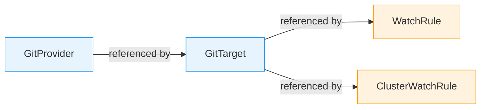
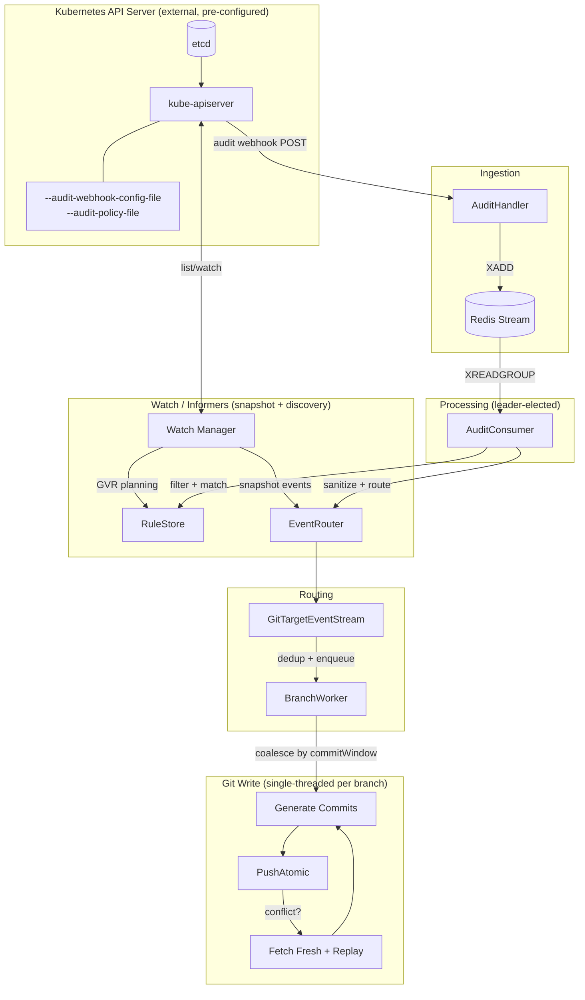
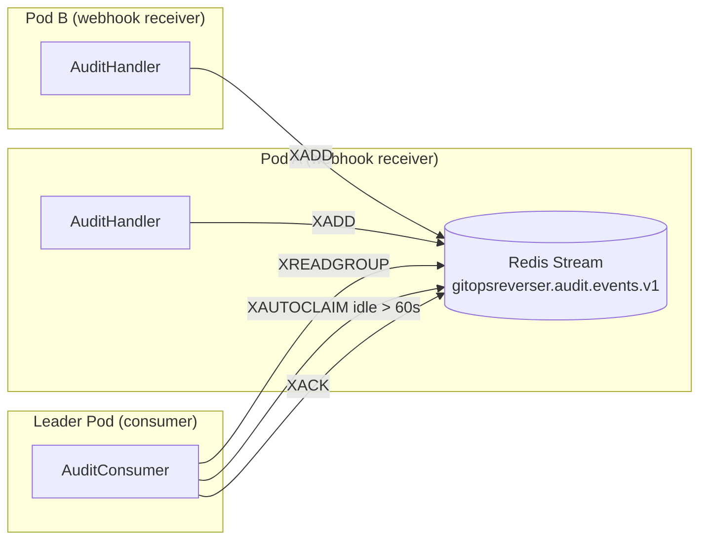
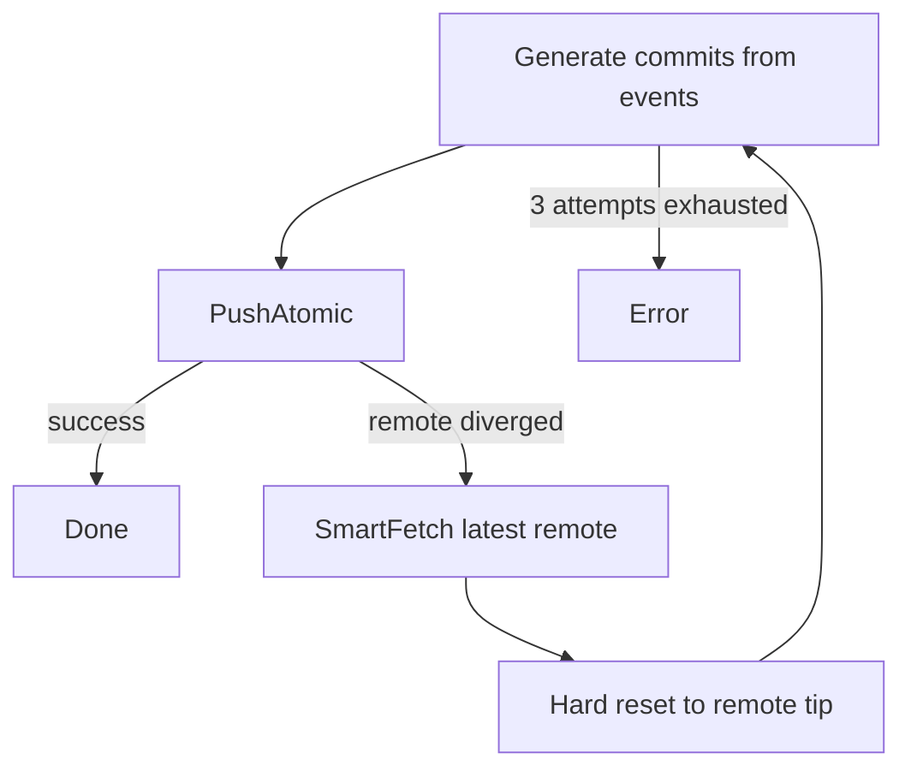
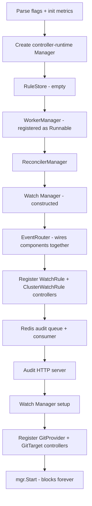
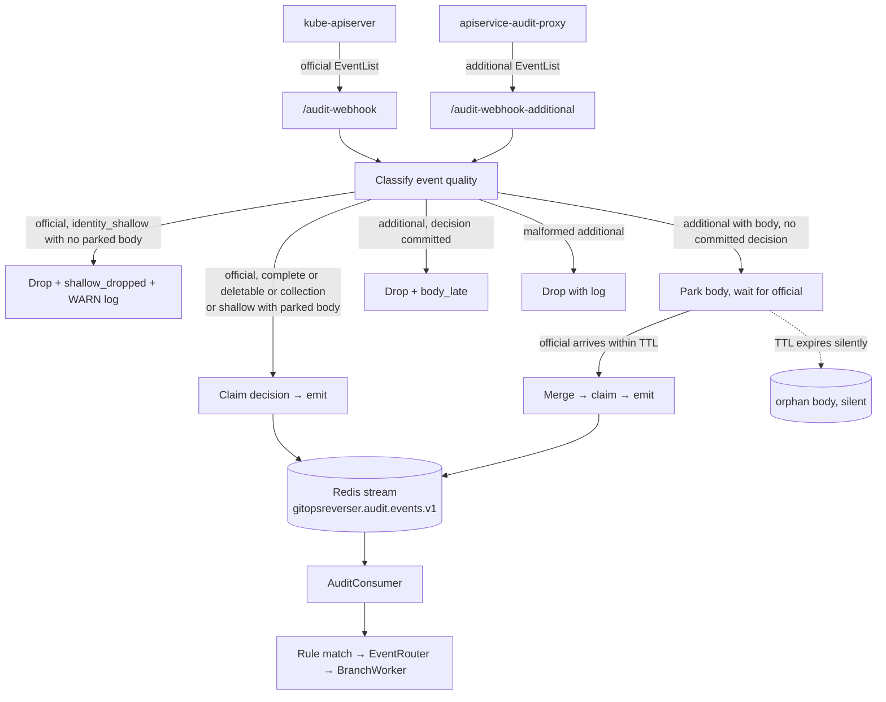
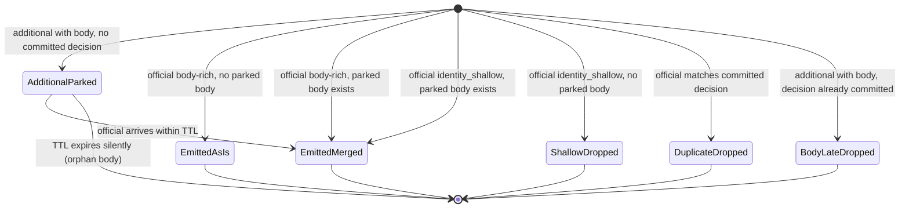

# GitOps Reverser Architecture

> Last updated: May 2026

GitOps Reverser is a Kubernetes operator that observes cluster mutations and writes their resulting
object state to Git. It reverses the traditional GitOps flow: instead of Git driving the cluster,
the cluster drives Git.

This document is intended as the starting point for any new contributor.

---

## Core Philosophy

**The Kubernetes API is the source of truth.** If a conflict occurs during a Git push, the operator
checks out the latest remote commit and replays the stale events from scratch. A full reconcile may
also be forced so that newly appeared resources are captured. The API always wins; Git is the
derived artifact.

This design is chosen for speed. The operator keeps the Git folder and the live API state equal as
fast as possible, without needing distributed locking or multi-step conflict resolution.

**Single-threaded writes per branch.** A Git branch can only have one writer at a time. The
[BranchWorker](internal/git/branch_worker.go) abstraction enforces this: one goroutine per
`(GitProvider, Branch)` pair processes all write events sequentially. Multiple `GitTarget`s may
share a branch (writing to different paths), but they all funnel through the same worker.

**Redis queues for HA preparation.** All event ingestion flows through Redis streams. Today this
runs single-instance, but the architecture is designed so that multiple pods can ingest events
(audit webhook receivers) while a single leader-elected pod processes them. This is the foundation
for future high-availability.

**One event source today, extensible tomorrow.** The audit webhook is the authoritative live event
source. Watch/informer infrastructure exists and is fully functional, but is currently used only for
snapshot/reconcile and GVR discovery. The architecture preserves watch as a future valid source of
state information (it just lacks author attribution).

---

## Custom Resource Definitions

Four CRDs define the user-facing API.



### GitProvider (namespaced)

Represents a Git remote and its credentials.

- **Source**: [api/v1alpha1/gitprovider_types.go](api/v1alpha1/gitprovider_types.go)
- **Controller**: [internal/controller/gitprovider_controller.go](internal/controller/gitprovider_controller.go)

Key fields:
- `spec.url` — repository URL (HTTP or SSH)
- `spec.secretRef` — Kubernetes Secret with authentication credentials
- `spec.allowedBranches` — glob patterns controlling which branches may be written to
- `spec.push.commitWindow` — rolling silence window for coalescing events into one commit per (author, gitTarget); default `5s`. The push cooldown (5s) is fixed in code, and the per-pod buffer cap is operator-configured via `--branch-buffer-max-bytes` (default `8Mi`)
- `spec.commit.committer` / `spec.commit.message` / `spec.commit.signing` — committer identity, Go template for messages, SSH signing config
- `status.signingPublicKey` — populated when commit signing is active

The controller verifies remote connectivity and manages SSH signing key lifecycle (including
auto-generation and Gitea key registration via [internal/giteaclient/](internal/giteaclient/)).

### GitTarget (namespaced)

One `(GitProvider, Branch, Path)` triple = one Git write destination.

- **Source**: [api/v1alpha1/gittarget_types.go](api/v1alpha1/gittarget_types.go)
- **Controller**: [internal/controller/gittarget_controller.go](internal/controller/gittarget_controller.go)

Key fields:
- `spec.providerRef` — reference to a GitProvider in the same namespace
- `spec.branch` — must match an allowed branch pattern in the provider
- `spec.path` — subfolder inside the repo for all writes from this target
- `spec.encryption` — optional SOPS/age encryption for Secrets

The controller exposes a **four-gate lifecycle** via `status.conditions`:

1. **Validated** — GitProvider exists, branch is allowed, no path collision with other GitTargets
2. **EncryptionConfigured** — age key Secret generated/validated (when encryption is requested)
3. **SnapshotSynced** — initial cluster-to-git reconcile completed as a single atomic commit
4. **EventStreamLive** — live event stream is processing; `Ready=True`

Note: the `providerRef` API schema allows referencing a Flux `GitRepository` as an alternative to
`GitProvider` ([api/v1alpha1/gittarget_types.go:33](api/v1alpha1/gittarget_types.go#L33)). This is
not yet supported end-to-end — the controller and rule wiring only handle `GitProvider` today.

### WatchRule (namespaced)

Defines which resources to watch **within the rule's own namespace**.

- **Source**: [api/v1alpha1/watchrule_types.go](api/v1alpha1/watchrule_types.go)
- **Controller**: [internal/controller/watchrule_controller.go](internal/controller/watchrule_controller.go)

Key fields:
- `spec.targetRef` — references a GitTarget in the same namespace
- `spec.rules[]` — logical OR of resource rules, each with `operations`, `apiGroups`, `apiVersions`, `resources`

### ClusterWatchRule (cluster-scoped)

Watches resources across namespaces or cluster-wide.

- **Source**: [api/v1alpha1/clusterwatchrule_types.go](api/v1alpha1/clusterwatchrule_types.go)
- **Controller**: [internal/controller/clusterwatchrule_controller.go](internal/controller/clusterwatchrule_controller.go)

Key fields:
- `spec.targetRef` — references a GitTarget with explicit namespace
- `spec.rules[].scope` — `Cluster` (cluster-scoped resources) or `Namespaced` (namespaced resources across all namespaces)

---

## Kubernetes API Concepts That Matter Here

A few Kubernetes API server concepts are central to how this operator works. This section is for
contributors who may not be deeply familiar with these mechanisms.

### Audit webhook

The Kubernetes API server can be configured to send **audit events** to an external HTTP endpoint
for every API request it processes. This is configured via two flags on the API server itself:

- `--audit-policy-file` — defines which API requests are logged and at what detail level
- `--audit-webhook-config-file` — points to a kubeconfig-style file that tells the API server where
  to POST audit events

This is external infrastructure: the operator cannot influence the API server configuration. It can
only receive what the API server sends. Each audit event includes the full request and/or response
object, the verb (create/update/delete), the user who performed the action, and a `resourceVersion`
that identifies the exact version of the object in etcd.

### Informers (list/watch)

Kubernetes informers use the **list/watch** protocol to track resources. An informer first lists all
existing objects of a given GVR (Group/Version/Resource), then opens a long-lived watch connection
to receive incremental updates. Informers operate at GVR granularity — you subscribe to "all
Deployments" or "all ConfigMaps", not to individual objects.

Watch events also carry `resourceVersion`, which means audit events and watch events for the same
mutation reference the same etcd version. In principle this could be used to correlate and
deduplicate across sources. Today the operator uses content-hash deduplication instead, which is
simpler but does not leverage this ordering guarantee.

### resourceVersion

Every Kubernetes object has a `metadata.resourceVersion` that is incremented on every write to
etcd. Both audit events and watch events carry this version. The operator strips `resourceVersion`
during [sanitization](internal/sanitize/sanitize.go) before writing to Git, since it is
cluster-internal state that would cause spurious diffs.

---

## High-Level Event Flow



### Step-by-step: audit event to Git commit

Audit events are inherently cluster-wide: the API server sends every matching mutation regardless
of namespace. All namespace-level filtering must happen inside the operator.

1. **Kubernetes API Server** sends audit events via webhook POST to `/audit-webhook`
2. Supplementary audit sources can send matching `EventList` payloads to `/audit-webhook-additional`
3. [AuditHandler](internal/webhook/audit_handler.go) deserializes each `EventList`, lets the audit joiner park or merge body contributions by `auditID`, and calls `RedisAuditQueue.Enqueue()` for canonical events
4. [RedisAuditQueue](internal/queue/redis_audit_queue.go) writes to Redis stream `gitopsreverser.audit.events.v1` via `XADD`
5. [AuditConsumer](internal/queue/redis_audit_consumer.go) reads batches of 50 via `XREADGROUP` (consumer group for HA-readiness)
6. For each message: filter to `ResponseComplete` stage + mutating verbs only, then call [RuleStore](internal/rulestore/store.go) to find matching rules
7. Extract the response object (or request object for DELETE), run through [sanitize.Sanitize()](internal/sanitize/) to strip runtime fields
8. For each matched rule: call [EventRouter.RouteToGitTargetEventStream()](internal/watch/event_router.go)
9. [GitTargetEventStream](internal/reconcile/git_target_event_stream.go) deduplicates by content hash and enqueues to the BranchWorker
10. [BranchWorker](internal/git/branch_worker.go) buffers events and flushes when the commit window expires, on shutdown, or when the buffer hits the operator's byte cap
11. [BranchWorker](internal/git/branch_worker.go) converts retained writes into commit plans, executes local commits, and publishes them with [PushAtomic()](internal/git/git_atomic_push.go)
12. If the remote has diverged: fetch fresh remote state, hard-reset, rebuild from retained pending writes, and retry

---

## Key Abstractions

### BranchWorker

- **Source**: [internal/git/branch_worker.go](internal/git/branch_worker.go)
- **Managed by**: [WorkerManager](internal/git/worker_manager.go)

One BranchWorker per `(GitProvider namespace, GitProvider name, Branch)`. Ensures all Git writes
to a branch are serialized into a single goroutine.

```
BranchKey = {ProviderNamespace, ProviderName, Branch}
```

The worker runs a single `processEvents()` goroutine that reads from a buffered channel
(capacity 100). Events are flushed as commits when either:
- the rolling commit-window timer expires after `spec.push.commitWindow` of silence (default `5s`)
- the per-worker buffer hits `--branch-buffer-max-bytes` (default `8Mi`, operator-tuned)
- the worker shuts down

A fixed 5s push cooldown bounds how often successful pushes hit the remote.

Atomic requests (e.g., initial snapshot reconcile) bypass the buffer and commit everything in one
commit.

Local clones live under `/tmp/gitops-reverser-workers/{namespace}/{provider}/{branch}/repos/{hash}`.
Branch metadata (exists, HEAD SHA, last fetch time) is cached for 30 seconds to avoid redundant
fetches when multiple GitTargets share the same branch.

### GitTargetEventStream

- **Source**: [internal/reconcile/git_target_event_stream.go](internal/reconcile/git_target_event_stream.go)

A two-state machine per GitTarget:

| State | Behavior |
|---|---|
| `RECONCILING` | Buffer live events while an initial snapshot or rule-change reconcile is in flight |
| `LIVE_PROCESSING` | Deduplicate by content hash (SHA-256 of sanitized YAML), then enqueue to BranchWorker |

The transition from `RECONCILING` to `LIVE_PROCESSING` flushes all buffered events.

### EventRouter

- **Source**: [internal/watch/event_router.go](internal/watch/event_router.go)

Central dispatch hub. Holds references to `WorkerManager`, `ReconcilerManager`, and `WatchManager`.
Maintains a registry of `GitTargetEventStream`s keyed by `ResourceReference.Key()`.

Responsibilities:
- Route live events to the correct GitTargetEventStream
- Dispatch control events (`RequestClusterState`, `RequestRepoState`, `ReconcileResource`)
- Coordinate reconciliation state transitions

### RuleStore

- **Source**: [internal/rulestore/store.go](internal/rulestore/store.go)

Thread-safe in-memory cache of compiled rules. Populated by WatchRule and ClusterWatchRule
controllers at reconcile time. Each compiled rule stores the full reference chain:
`WatchRule → GitTarget → GitProvider → branch + path`, including the source namespace of the rule.

`GetMatchingRules()` matches by `{resource, operation, apiGroup, apiVersion, scope}`. Supports
wildcards (`*`) and core API group matching (`""`).

This is an important architectural detail: **both the audit path and the watch/informer path depend
on the same `GetMatchingRules` contract.** The RuleStore is also read by the Watch Manager's GVR
planner (`ComputeRequestedGVRs`) to decide which informers to start. That means the RuleStore
serves two different jobs through the same interface:

- **GVR planning** — which resource types need informers (works at GVR granularity)
- **Event routing** — which concrete object event should route to which target (needs full context
  including namespace)

The compiled rule carries the rule's source namespace, but the matching contract does not accept or
check namespace. See
[watch-audit-rule-matching-improvement.md](design/watch-audit-rule-matching-improvement.md) for the
design to address this.

### FolderReconciler

- **Source**: [internal/reconcile/folder_reconciler.go](internal/reconcile/folder_reconciler.go)

Diffs cluster state against Git repository state during initial snapshot sync. Receives both
a `ClusterStateEvent` (what exists in the cluster) and a `RepoStateEvent` (what exists in Git),
then emits a single atomic `WriteRequest` that brings Git in line with the cluster.

---

## Redis Queue Architecture



- **Producer**: [RedisAuditQueue](internal/queue/redis_audit_queue.go) — `XADD` with `MAXLEN ~` for bounded retention
- **Consumer**: [AuditConsumer](internal/queue/redis_audit_consumer.go) — uses Redis consumer groups (`XREADGROUP`) so multiple replicas don't duplicate work
- **Consumer ID**: set to the Pod name
- **Batch size**: 50 messages per read, 2s block timeout
- **Reclaim**: `XAUTOCLAIM` every 30s for messages idle > 60s (crashed consumer recovery)
- **Poison pill**: messages are ACK'd regardless of processing outcome to prevent queue blockage

### Current state and future direction

Today there is a single Redis stream for all audit events. The consumer is leader-elected, meaning
only one pod processes events at a time.

**Desired future**: each GitTarget (or at minimum each Git destination) gets its own Redis queue.
This way a GitHub outage only stalls commits for the affected destination — events keep
accumulating in Redis and are committed once the remote is reachable again. Other Git destinations
continue operating normally.

---

## Watch / Informer System

- **Source**: [internal/watch/manager.go](internal/watch/manager.go), [internal/watch/informers.go](internal/watch/informers.go), [internal/watch/gvr.go](internal/watch/gvr.go)

The Watch Manager is a controller-runtime `Runnable` (leader-elected) that manages dynamic
informers per GVR (Group/Version/Resource).

### Current role

Watch/informers are **not** used as the live event source (audit is). They serve three purposes:

1. **Snapshot and reconcile** — provide cluster state for initial GitTarget sync and rule-change re-sync
2. **GVR discovery and planning** — determine which GVRs need informers based on compiled rules, verified against API server discovery
3. **Content deduplication** — track last-seen content hashes to avoid redundant writes

### Reconcile cycle

When WatchRule/ClusterWatchRule controllers change rules, they call `WatchManager.ReconcileForRuleChange()`:

1. Compute requested GVRs from RuleStore
2. Verify against API server discovery (with exponential backoff for unavailable GVRs)
3. Start/stop informers for added/removed GVRs
4. Put affected GitTargetEventStreams into `RECONCILING` state
5. Wait for informer cache sync
6. Emit snapshot events → FolderReconciler diffs → atomic commit
7. Transition streams to `LIVE_PROCESSING`, flush buffered events

### Future role

The current mode is **audit for live events + watch for reconcile/snapshot**. This is a deliberate
choice: audit events carry the original author, which we value highly.

Watch should remain useful for:
- Snapshot and reconcile (current)
- Discovery and rule planning (current)
- A future fallback source when audit is unavailable, accepting the loss of author attribution

---

## Git Operations

### File path convention

Resources are stored following the Kubernetes REST API structure:

```
{spec.path}/{group}/{version}/{resource}/{namespace}/{name}.yaml
```

For core API resources (empty group), the group segment is omitted:

```
{spec.path}/v1/configmaps/my-namespace/my-config.yaml
```

Secrets with encryption enabled use `.sops.yaml`:

```
{spec.path}/v1/secrets/my-namespace/my-secret.sops.yaml
```

Path generation: [internal/git/git.go:1013](internal/git/git.go#L1013), backed by
[ResourceIdentifier.ToGitPath()](internal/types/identifier.go).

### Path bootstrap

When a GitTarget path is first written to, the BranchWorker bootstraps it with operator-managed
template files to make the target path immediately usable. This currently includes a `README.md`
and, when encryption is configured, a `.sops.yaml` configuration file that maps age recipients to
the correct file patterns.

- **Templates**: [internal/git/bootstrapped-repo-template/](internal/git/bootstrapped-repo-template/)
- **Logic**: [internal/git/bootstrapped_repo_template.go](internal/git/bootstrapped_repo_template.go)

Bootstrap files are included in the **first commit that writes to the target path**. This is
usually the initial snapshot sync, but if the snapshot produces no changes (empty cluster state for
the matched rules), the bootstrap files will appear in the first live event commit instead. They
are part of the actual repo content and should be expected when inspecting a GitTarget path.

### Conflict resolution

The strategy is **checkout fresh + replay**:



1. [PushAtomic()](internal/git/git_atomic_push.go) checks remote refs via `AdvertisedReferences()` before pushing
2. If the remote has moved, [SmartFetch()](internal/git/git_smart_fetch.go) fetches latest state
3. Hard reset discards local commits, then the same events are replayed from scratch
4. Up to 3 retry attempts; each failure is logged as a `PullReport` for observability

This works because the API is the source of truth. Any stale commit can be regenerated from the
current object state.

### Encryption

- **Source**: [internal/git/encryption.go](internal/git/encryption.go), [internal/git/sops_encryptor.go](internal/git/sops_encryptor.go)

**Secrets are never committed in plaintext.** If encryption fails or is not configured, the write
is rejected and no Secret file is written to the worktree. This is enforced at two layers: the
[content writer](internal/git/content_writer.go) refuses to produce plaintext Secret content, and
the [write path](internal/git/git.go) aborts the entire request on encryption failure. Both
invariants are covered by dedicated tests:
- [TestBranchWorker_SecretEncryptionFailureDoesNotWritePlaintext](internal/git/secret_write_test.go#L101) — verifies no file appears on disk
- [TestBuildContentForWrite_SecretRequiresEncryptor](internal/git/content_writer_test.go#L103) — verifies the content writer rejects unencrypted Secrets

When a GitTarget has `spec.encryption` configured, Secret resources are encrypted with SOPS using
age keys. The age key is stored in a Kubernetes Secret and can be auto-generated by the GitTarget
controller.

### Commit signing

- **Source**: [internal/git/signing.go](internal/git/signing.go), [internal/sshsig/](internal/sshsig/)

SSH commit signing using OpenSSH format. The signing key is read from the Secret referenced by
`GitProvider.spec.commit.signing.secretRef`.

---

## Startup Sequence

Defined in [cmd/main.go](cmd/main.go):



**Known issue**: the RuleStore is empty at startup until controllers reconcile existing
WatchRule/ClusterWatchRule CRs. The Watch Manager's initial reconcile reads from this empty store.
See [watch-audit-rule-matching-improvement.md](design/watch-audit-rule-matching-improvement.md) for
the design to add explicit cache warm-up before startup reconcile.

---

## Audit Ingestion Pipeline

The audit handler is the seam where everything that wants to drive a Git write enters the system.
It accepts two semantic source roles, deduplicates by `auditID`, classifies event shape, recovers
bodies for aggregated API requests, and writes one canonical event per `auditID` to the Redis
stream.

### What this pipeline exists for

1. **Trustworthy audit identity.** The official kube-apiserver audit event is the authority for
   who did what, when, and with what response status.
2. **Unique canonical stream.** Within the decision-TTL window, one `auditID` produces at most
   one stream entry.
3. **No silent shallow writes.** A shallow event is either normalized by a matching additional
   body or dropped — it never produces a stub Git commit.
4. **Visibility.** Operators see counters for received events, parked bodies, dedupe decisions,
   join latency, body misses, and late bodies. (Sweeper-driven counters for orphan bodies and
   shallow drops are not yet wired — see [Known gaps](#known-gaps).)
5. **Easy setup.** Deployment intent is the only knob; there are no API-group allowlists or
   join-mode flags to maintain.

### Endpoints

```
POST /audit-webhook              # canonical source: kube-apiserver audit webhook
POST /audit-webhook-additional   # supplementary body source: apiservice-audit-proxy, etc.
```

Both accept `audit.k8s.io/v1 EventList`. Cluster-ID path segments and any trailing slash are
rejected with `400`. The endpoint chosen by the sender is the source role — there is no in-payload
marker. See [audit_handler.go:384](internal/webhook/audit_handler.go#L384).

Cluster identity is intentionally not modeled in the stream. Multi-cluster support is a separate
design problem: it needs source registration, rule-match semantics, metrics cardinality rules,
and file-path semantics together. None of that exists today.

### Deployment modes

| Mode | Posts to /audit-webhook | Posts to /audit-webhook-additional | Notes |
| --- | --- | --- | --- |
| Official only | kube-apiserver | — | Core resources only; aggregated-API events arrive shallow |
| Official + additional | kube-apiserver | `apiservice-audit-proxy` (or similar) | Recommended — recovers aggregated-API bodies |
| Proxy as canonical | `apiservice-audit-proxy` | — | Point the source at `/audit-webhook` when it should drive the canonical stream |

### Pipeline shape



The official channel is strictly synchronous: every official event either emits in arrival
order or drops immediately. Only additional bodies park, and only because they arrive earlier
than the official sibling they're waiting for (see [Timing assumption](#timing-assumption)).

Only `Stage=ResponseComplete` events reach the joiner. kube-apiserver may emit other stages
(`RequestReceived`, `ResponseStarted`, `Panic`) under the same `auditID`; if those were
allowed to claim the dedupe key, the later `ResponseComplete` for the same audit ID would be
silently dropped as a duplicate. The handler filters by stage at the boundary before the
joiner sees the event.

### Quality classification

The classifier ([audit_joiner.go:507](internal/webhook/audit_joiner.go#L507)) decides what to do
based on event shape, not API group:

| Quality | Condition | Treatment |
| --- | --- | --- |
| `complete` | Request or response body present | Emit |
| `body_shallow_deletable` | `verb=delete` with `objectRef.Resource` and `Name` set, no body | Emit (delete carve-out) |
| `collection` | `verb=deletecollection` with body and `objectRef.Resource` | Emit (forwarded raw; per-item routing is a downstream gap) |
| `identity_shallow` | No body, missing `objectRef` identity | On official: merge if body is parked; otherwise immediate drop + `audit_shallow_dropped_total` + WARN log |
| `malformed` | Additional event with no body at all | Drop with log |

Two carve-outs are load-bearing:

- **Bodyless delete with a complete `objectRef`** is kube-apiserver's normal shape for "I deleted
  X by name." It must emit. The classifier mirrors
  [allowsBodylessAuditV1Delete](internal/webhook/audit_joiner.go#L527) and the consumer mirrors
  it again as [allowsBodylessSingleDelete](internal/queue/redis_audit_consumer.go#L512).
- **`deletecollection`** carries a `*List` response body, not a single object, and is a
  high-blast-radius operation that must be auditable. The event is forwarded raw. Per-item
  rule matching from the `*List` body is a known downstream gap, not a reason to drop.

### Joiner state machine



### Timing assumption

The "shallow drop is immediate" choice rests on one assumption:

> Events posted to `/audit-webhook-additional` for an `auditID` reach gitops-reverser before
> the corresponding kube-apiserver event for the same `auditID`.

`apiservice-audit-proxy` emits in line with the request it observed. kube-apiserver's audit
webhook batches with `--audit-webhook-batch-max-wait` (default 30s). In the steady state the
proxy has a margin of seconds to minutes.

If the assumption is violated, the cost is: a shallow drop where a parked-shallow design
would have merged. The corresponding audit fact is logged at WARN and counted in
`audit_shallow_dropped_total` — operators see the failure, they don't lose it silently.

The single thing to verify in the field is that `apiservice-audit-proxy` does not implement
its own batching. If it does, we revisit.

The joiner uses two Redis key families:

| Key | Purpose | TTL flag |
| --- | --- | --- |
| `audit:body:v1:<auditID>` | Parked additional-source body contribution only | `--audit-event-body-ttl` (default `5m`) |
| `audit:decision:v1:<auditID>` | Dedupe marker; bounds the "at most one canonical entry" window | `--audit-event-decision-ttl` (default `1h`) |

The handler uses a two-phase contract on the joiner:

1. `Decide` claims the decision key via `SET NX` before any stream write.
2. On enqueue success, `CommitDecision` promotes the claim to `state=emitted`.
3. On enqueue failure, `ReleaseDecision` deletes the claim so a retry can claim again.

This is what makes "at most one canonical entry per `auditID`" hold across crashes and retries.
See [audit_joiner.go](internal/webhook/audit_joiner.go) and
[audit_handler.go](internal/webhook/audit_handler.go).

### Merge rules

When a parked contribution merges into an official event:

- The official remains authoritative for `auditID`, `level`, `stage`, `requestURI`, `verb`,
  `user`, `impersonatedUser`, `sourceIPs`, `userAgent`, timestamps, and `responseStatus`.
- The contribution can fill in `requestObject`, `responseObject`, missing `objectRef` fields
  (`name`, `namespace`, `uid`, `resourceVersion`), and proxy truncation annotations.
- For `delete` and `deletecollection`, request/response bodies are not merged — the proxy-side
  body for deletes is `DeleteOptions`, not the deleted object.
- The official body wins: parked bodies only fill in when the official body is empty. See
  [mergeParkedObjects](internal/webhook/audit_joiner.go#L433).

### Consumer-side drop is explicit

The consumer used to emit a stub `apiVersion+kind+namespace+name` object straight into the Git
pipeline when no body was present. That silent fallback is gone — `extractObject` now returns
`errAuditEventObjectMissing` and emits a structured warning with copy-pasteable remediation
([redis_audit_consumer.go:351](internal/queue/redis_audit_consumer.go#L351)). The classifier
should have already kept these out, but the consumer enforces it as defense-in-depth.

### Settings

| Flag | Helm value | Default | Meaning |
| --- | --- | --- | --- |
| `--audit-event-body-ttl` | `auditEventJoin.bodyTTL` | `5m` | TTL for parked additional bodies waiting for the matching official |
| `--audit-event-decision-ttl` | `auditEventJoin.decisionTTL` | `1h` | Bounds the dedupe window |

There is no API-group allowlist and no join-mode flag — both were removed because the endpoint
already encodes intent and `wait-official` semantics are always correct.

### Metrics

| Metric | Labels | Meaning |
| --- | --- | --- |
| `gitopsreverser_audit_events_received_total` | `source`, `gvr`, `action`, `user` | Receive counter |
| `gitopsreverser_audit_event_quality_total` | `source`, `quality`, `gvr`, `action` | First-class shape classification |
| `gitopsreverser_audit_join_parked_total` | `parked_kind` | Parked additional bodies (`additional_body` is the only value) |
| `gitopsreverser_audit_join_emitted_total` | `source`, `result` | Canonical emissions: `as_is`, `merged` |
| `gitopsreverser_audit_join_duplicate_dropped_total` | `reason` | Drops from existing decision keys: `decision_exists`, `in_flight_claim` |
| `gitopsreverser_audit_shallow_dropped_total` | `gvr`, `action` | Identity-shallow officials dropped because no parked body was available |
| `gitopsreverser_audit_join_body_late_total` | `gvr`, `action` | Additional body arrived after the decision was committed |

Useful alerts: `audit_shallow_dropped_total` non-zero (operator misconfiguration — install
proxy or update audit policy); `audit_join_duplicate_dropped_total` spikes (likely webhook
retry storm); sustained `audit_join_body_late_total` (proxy timing slipping past the TTL).

### Operator guidance

A shallow event almost always means one of two things:

- kube-apiserver's audit policy does not request bodies for that resource. See
  [test/e2e/cluster/audit/policy.yaml](test/e2e/cluster/audit/policy.yaml) for a working policy.
- The request traversed an aggregated API path where kube-apiserver cannot see the backend body.
  Install `apiservice-audit-proxy` and point it at `/audit-webhook-additional`.

### Known gaps

These are explicit, tracked follow-ups — not hidden surprises:

- **Orphan additional bodies expire silently.** A parked additional body that never finds
  an official twin expires on its Redis TTL with no metric and no log. We accept this for
  simplicity: surfacing it would require a periodic sweeper, and the operational signal —
  proxy disconnected from official stream — is visible via the `audit_join_body_late_total`
  pattern and from the proxy side directly. The identity-shallow drop case is *not* silent;
  it surfaces synchronously via `audit_shallow_dropped_total` + WARN log.
- **No per-item routing for `deletecollection`.** Collection events reach the canonical stream
  intact. The consumer's `extractObject` unmarshals the `*List` envelope as a single object,
  so downstream rule matching may not commit per-item deletes. Forwarding the audit fact is
  correct; per-item Git fan-out is a separate design.
- **Merge under two body writers is last-write-wins.** Today only `apiservice-audit-proxy`
  writes additional bodies. If a future in-process aggregated-API handler also writes, the
  body store has no source priority. Source-priority merge is deferred.
- **Multi-cluster identity.** The removed `{clusterID}` path segment was a half-measure.
  Multi-cluster needs a proper source-identity design across rule matching, metrics cardinality,
  and file paths.

---

## What We Don't Do (Yet)

- **Pull request creation** — the operator writes directly to a branch, it does not create PRs
- **Multi-cluster routing** — audit ingestion supports it, but rule matching and file paths do not
- **High availability** — Redis queuing is the foundation, but the consumer and watch manager are leader-elected single-instance
- **Per-destination queues** — all events flow through a single Redis stream; a Git remote outage stalls all processing

---

## Package Map

| Package | Role | Key types |
|---|---|---|
| [api/v1alpha1/](api/v1alpha1/) | CRD type definitions | `GitProvider`, `GitTarget`, `WatchRule`, `ClusterWatchRule` |
| [cmd/](cmd/) | Operator entry point | `main()` |
| [internal/controller/](internal/controller/) | Kubernetes reconcilers | `GitProviderReconciler`, `GitTargetReconciler`, `WatchRuleReconciler`, `ClusterWatchRuleReconciler` |
| [internal/events/](internal/events/) | Control and state event types | `ClusterStateEvent`, `RepoStateEvent`, `ControlEvent` |
| [internal/git/](internal/git/) | Git operations + BranchWorker | `BranchWorker`, `WorkerManager`, `WriteRequest`, `PushAtomic` |
| [internal/giteaclient/](internal/giteaclient/) | Gitea API client for signing keys | `Client` |
| [internal/queue/](internal/queue/) | Redis stream producer + consumer | `RedisAuditQueue`, `AuditConsumer` |
| [internal/reconcile/](internal/reconcile/) | Folder reconciler + event stream | `FolderReconciler`, `GitTargetEventStream`, `ReconcilerManager` |
| [internal/rulestore/](internal/rulestore/) | Compiled rule cache | `Store`, `CompiledRule`, `CompiledClusterRule` |
| [internal/sanitize/](internal/sanitize/) | K8s object sanitization | `Sanitize()`, `MarshalToOrderedYAML()` |
| [internal/ssh/](internal/ssh/) | SSH key helpers | |
| [internal/sshsig/](internal/sshsig/) | SSH commit signing (OpenSSH format) | |
| [internal/telemetry/](internal/telemetry/) | OpenTelemetry metrics | |
| [internal/types/](internal/types/) | Shared domain types | `ResourceIdentifier`, `ResourceReference` |
| [internal/watch/](internal/watch/) | Dynamic informers + EventRouter | `Manager`, `EventRouter`, `GVR` |
| [internal/webhook/](internal/webhook/) | Audit ingress handling | `AuditHandler`, `AuditEventJoiner`, `RedisAuditEventJoiner` |

---

## Design Documents

For deeper context on specific decisions:

- [Audit ingestion decision record](design/audit-ingestion-decision-record.md) — why audit is the authoritative live source
- [GitTarget lifecycle and repo architecture](design/gittarget-lifecycle-and-repo-architecture.md) — GitTarget state machine details
- [Watch and audit rule matching improvement](design/watch-audit-rule-matching-improvement.md) — known issues with namespace matching and startup bootstrap
- [Multi-cluster audit ingestion implications](design/multi-cluster-audit-ingestion-implications.md) — what multi-cluster means beyond ingestion
- [SOPS/age key management](design/sops-repo-bootstrap-and-key-management-architecture.md) — encryption architecture
- [Audit webhook TLS design](design/audit-webhook-tls-design.md) — webhook transport security
- [Status conditions guide](design/status-conditions-guide.md) — how status conditions are used across CRDs
