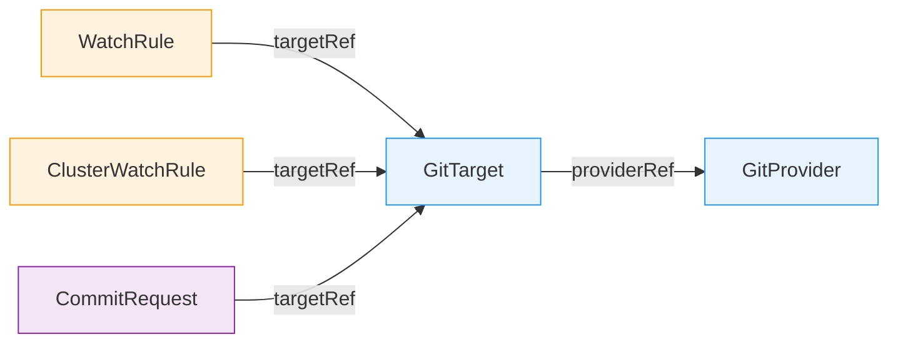
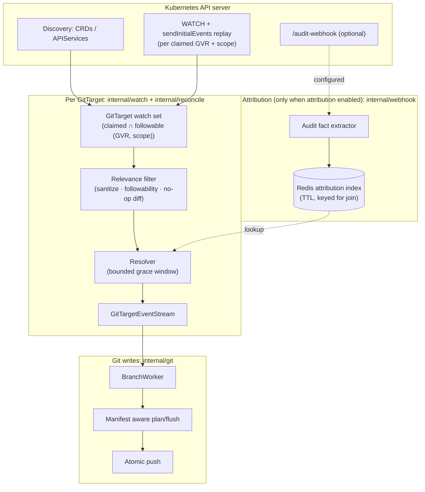
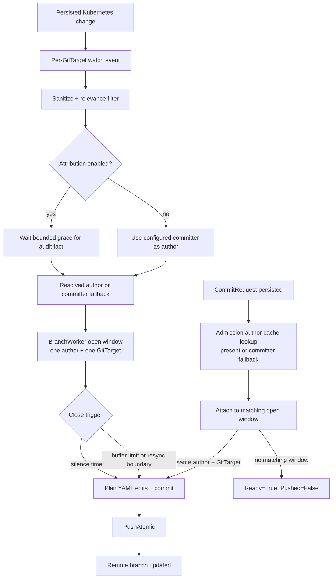
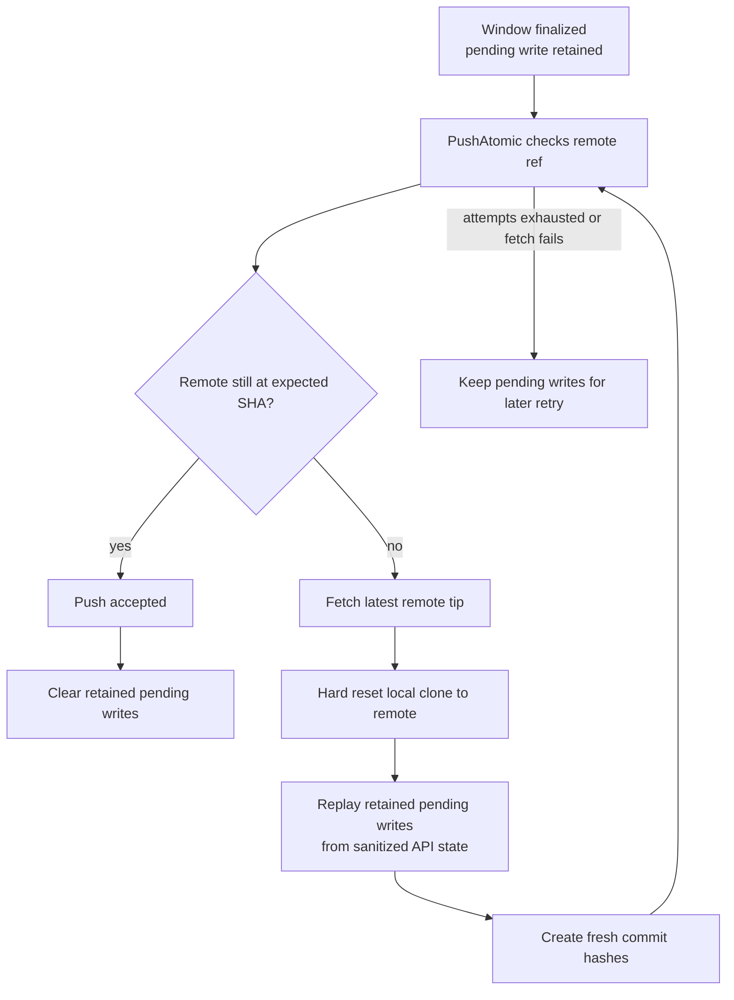
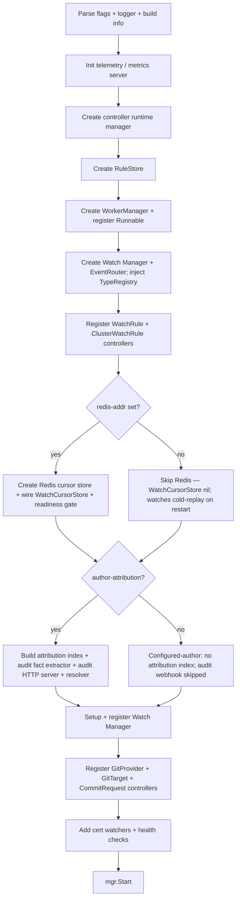

# GitOps Reverser Architecture

GitOps Reverser is a Kubernetes operator that observes cluster mutations and writes the resulting
desired object state to Git. It reverses the traditional GitOps direction: instead of Git driving the
cluster, the Kubernetes API drives Git. The repository becomes a continuously updated mirror of live
cluster state.

This document describes how the operator works **today**. If you are reading it for the first time, keep
one sentence in mind: **Kubernetes watch supplies state, Git stores the mirror, and Redis keeps the
operator's short-lived coordination state.** Read the [Ground Rules](#ground-rules),
[Mental Model](#mental-model), and [Data Sources](#data-sources) for the shape of the system, then the
[Configuration Model](#configuration-model) and [Common Flows](#common-flows) for how the pieces move
together. The later sections give the reference detail behind each piece. If a detail here ever disagrees
with the source, the source wins; deeper design records live under [docs/design/](design/).

***

## Ground Rules

These are the design decisions to keep in your head while reading or changing the code:

**The Kubernetes API is the source of truth.** Git is a materialized mirror of desired state from the
API. State is ingested by **watch**; these paths never treat Git as authority. When a push conflicts
with a newer remote commit, the operator fetches the new remote state, resets its local clone, and
replays its retained writes from the API.

**Watch is the only object-state source.** Each `GitTarget` opens one Kubernetes watch per claimed
`(GVR, scope)` with `sendInitialEvents=true`. Every Git write derives from persisted state the watch
observed. Audit never defines *what* changed — it only, optionally, explains *who* caused it.

**Sensitive resources are never written in plaintext.** Core Secrets and configured sensitive resource
types must be encrypted before they touch the Git worktree. If encryption cannot be configured, the write
fails; there is no plaintext opt-out.

**Writes are serialized per Git branch.** One [BranchWorker](../internal/git/branch_worker.go) owns each
`(GitProvider namespace, GitProvider name, branch)` tuple. Multiple `GitTarget`s may share one branch.
Every write to that branch goes through the worker's single event loop and commit window.

**Redis/Valkey is optional but advised.** The default configured-author mode runs without it: a plain
`helm install` comes up healthy and watches cold-replay on restart. When an endpoint is configured,
Redis stores watch resume cursors (warm restarts) and the small coordination records used by
attribution, CommitRequest author capture, and HA. Attributed-author mode requires Redis, and HA will
require it as the shared store across replicas.

**Audit is an optional attribution lookup.** When attribution is enabled, kube-apiserver posts audit
events to `/audit-webhook`; the operator extracts a minimal attribution fact (auditID, user, verb,
resourceVersion, GVR/namespace/name/UID, status, timestamps) into a Redis attribution index keyed for a
join, and a resolver attaches the commit author to a watch event by matching a fact within a bounded
grace window. A missing, late, or absent fact never blocks state capture; it only changes the author.

**Behavior is deterministic and proven by tests.** Given the same observed Kubernetes state, configuration,
and Git base, the operator makes the same materialization decisions. Ordering, attribution fallbacks,
conflict replay, path refusal, encryption behavior, and commit semantics are pinned by unit and e2e tests.

***

## Mental Model

The easy part is "write YAML to Git." The hard parts shape the whole architecture:

* **Ordering.** Two updates to the same object must land in Git in cluster order.
* **Not losing changes.** A dropped or late event must never leave Git *permanently* wrong — in
  particular, a delete that happens while no watch is running must still be reconciled.
* **Secrets.** Sensitive objects must never touch disk in plaintext.
* **Scale.** A cluster holds thousands of objects across hundreds of types; you cannot keep a live
  watch open on all of them.

The solution, in the vocabulary used throughout this document:

* **Watch is the only object-state source.** Each `GitTarget` opens one Kubernetes watch per claimed
  `(GVR, scope)` with `sendInitialEvents=true`. The apiserver delivers a watch's events already ordered
  by `resourceVersion` for that type, so there is nothing to re-order. Every Git write derives from
  persisted state the watch observed.
* **Watches are per `GitTarget` and scaled by claims.** A watch opens only for the claimed ∩ followable
  `(GVR, scope)` set, so cost scales with what `GitTarget`s actually claim, not with cluster type count.
* **Recovery prefers watch.** A new watch normally starts with `sendInitialEvents`, establishes a
  current snapshot boundary, and runs a **mark-and-sweep**: any Git file whose object is no longer
  present is deleted. When Redis has a fresh per-type cursor, the operator skips the snapshot and
  resumes a normal watch from that resourceVersion. Cursors are keyed by `GitTarget` UID and carry a
  TTL refreshed on every watch event and bookmark, so a live watch keeps its cursor warm while a deleted
  one's cursor simply expires — and a stale resourceVersion (`410 Gone`) rebuilds from a fresh replay.
  Older APIs that reject `sendInitialEvents` fall back to LIST plus buffered WATCH. The sweep fires on
  snapshot establishment, **never on a timer**.
* **Audit, when enabled, only names the author.** It is an optional attribution lookup; a missing or
  late fact costs author fidelity, never correctness, and with attribution disabled the product commits
  as the configured committer.
* **One `BranchWorker` per Git branch serializes all writes.** Every write to a branch funnels through a
  single worker and a single commit window, which keeps concurrent GitTargets and authors from racing
  each other into a corrupt tree.

***

## Data Sources

GitOps Reverser reads Kubernetes through four mechanisms. Two are required to function; the other two are
optional and only add *who* did something:

| Source | Answers | Required | What it carries |
|---|---|---|---|
| **Discovery** (CRD/APIService) | *what types exist* | yes | the API surface — served GVRs, scope, preferred version, subresources; rules resolve against it |
| **Watch** (per claimed `(GVR, scope)`) | *what changed* | yes | the object body, ordered per type; the only object-state source, with deletes reconciled via `sendInitialEvents` replay + mark-and-sweep |
| **Audit webhook** (`/audit-webhook`) | *who changed mirrored state* | no | a post-persist attribution fact, joined to the watch event by resourceVersion ([Optional Attribution](#optional-attribution)) |
| **Validating admission webhook** (`/validate-operator-types`) | *who issued a command* | no | the submitter of a `CommitRequest`, captured at admission and keyed 1:1 by UID ([CommitRequest Finalize](#commitrequest-finalize)) |

With both optional sources off, the product still mirrors state correctly — every commit is simply authored
by the committer.

### Why audit, not admission, attributes a mirrored change

For a mirrored change, taking the author from a validating admission webhook is tempting — the request
already carries `userInfo`. We tried it; the edge cases are not fixable, because **admission runs *before*
the write reaches etcd**:

* **Admission sees attempts, not persistence.** A request that passes our webhook can still be rejected by
  a later webhook or fail an optimistic-concurrency conflict at storage, so the change never becomes state —
  yet we would already have recorded an author for it (a dry-run is the same shape: admission fires, nothing
  persists).
* **There is nothing to join on yet.** Mirrored attribution matches an author to a *persisted* watch event
  by identity **+ resourceVersion**; at admission the resourceVersion does not exist, and for a
  `generateName` create even the final name/UID is unassigned — so an admission record cannot be coupled to
  the watch or audit stream.

Audit avoids both: kube-apiserver posts a `ResponseComplete` event *after* the write persisted, carrying
the resourceVersion that joins it to the watch event.

The one place admission *is* the right source is the `CommitRequest`, and only for its **command** meaning
— *who issued the save* — not for mirroring the object. That holds because it is **our own type with a
memory model we control**: the controller reconciles off its own watch, which only delivers persisted
objects, so the author is captured at admission and read back 1:1 by UID — no resourceVersion join, no
persistence proof from audit needed. (We still can't guarantee a create is never blocked, but it holds
across our edge cases.) If a `WatchRule` also selects CommitRequests, that *mirroring* runs through the
normal pipeline and is audit-attributed like any other resource. See
[CommitRequest Finalize](#commitrequest-finalize).

### Proving it on new Kubernetes versions

How Kubernetes actually emits these structures is not something to guess at. A separate, standalone
project — the **mutation-capture lab** ([design](spec/mutation-capture-lab-design.md),
[cmd/mutation-capture-lab/](../cmd/mutation-capture-lab/)) — records the exact watch, audit, and admission
output a real apiserver produces for each interesting scenario and commits it as normalized example YAML (a
versioned *corpus*). It doubles as a regression harness: point it at a new Kubernetes release, regenerate,
and any change in verb naming, event ordering, body presence, or deletecollection fan-out surfaces as a
reviewable corpus diff before it can surprise the operator. The "admission sees attempts, not persistence"
claim above is read straight out of that corpus — its dry-run, record-and-reject, and conflict scenarios
capture audit and admission with **no** resulting watch event.

***

## Configuration Model

You configure GitOps Reverser entirely through five CRDs (group `configbutler.ai`, version
`v1alpha3`). `WatchRule` and `ClusterWatchRule` choose which Kubernetes resources enter the pipeline.
`CommitRequest` can ask for the current window to be saved. `GitTarget` chooses the branch and path.
`GitProvider` supplies the repository, credentials, commit settings, and push policy.



| CRD | Scope | One line role |
|---|---|---|
| `WatchRule` | namespaced | which resources in *this* namespace route to a GitTarget |
| `ClusterWatchRule` | cluster | which cluster scoped or cluster wide resources route to a GitTarget |
| `CommitRequest` | namespaced | a one shot "save the open window now" signal |
| `GitTarget` | namespaced | one materialization destination `(provider, branch, path)` |
| `GitProvider` | namespaced | a Git repo + credentials + commit/signing config |

### WatchRule / ClusterWatchRule

* **Sources**: [watchrule_types.go](../api/v1alpha3/watchrule_types.go),
  [clusterwatchrule_types.go](../api/v1alpha3/clusterwatchrule_types.go)
* **Controllers**: [watchrule_controller.go](../internal/controller/watchrule_controller.go),
  [clusterwatchrule_controller.go](../internal/controller/clusterwatchrule_controller.go)

A `WatchRule` selects resources in its own namespace and routes matching events to a same namespace
`GitTarget`. A `ClusterWatchRule` does the same for cluster scoped resources or namespaced resources
across the whole cluster, with an explicit namespace `targetRef`. Both share the rule model:

* `spec.rules[]`: OR resource rules (`MinItems=1`).
* `rules[].operations`: `CREATE` / `UPDATE` / `DELETE` / `*`; omitted means all.
* `rules[].apiGroups`: omitted resolves the named resource across served groups; `""` is the core
  group; `*` is all.
* `rules[].apiVersions`: omitted means the preferred served version.
* `rules[].resources`: plural resource names or `*`.
* `ClusterWatchRule` adds `rules[].scope`: `Cluster` or `Namespaced` (each rule independently scoped).

Subresources are rejected in rule resources. Mirroring operates on top level resources; the selected
`/scale` subresource effect is translated separately into a parent `spec.replicas` field patch.

### CommitRequest

* **Source**: [api/v1alpha3/commitrequest_types.go](../api/v1alpha3/commitrequest_types.go)
* **Controller**: [internal/controller/commitrequest_controller.go](../internal/controller/commitrequest_controller.go)

A one shot "save now" signal that finalizes the open commit window for a same namespace `GitTarget`
instead of waiting for the silence timer. The **entire spec is immutable**. Key fields:

* `spec.targetRef.name`: target whose open window should be finalized.
* `spec.message`: optional verbatim commit message (1–1024 chars, no control characters).
* `spec.closeDelaySeconds`: optional `0–300s` delay before the window is closed, so the author's own
  in flight changes can join the window before it closes.
* `status.conditions`: kstatus-compatible. **Ready** is the summary (True once the request reached a
  terminal outcome that is not an error — a pushed commit, or a benign no-commit);
  **Reconciling**/**Stalled** are the kstatus progress/blocked pair; **AuthorAttributed** reports
  whether the `/validate-operator-types` validating admission webhook named the submitter or the request
  fell back to the configured committer; **Pushed** reports whether the commit reached the remote. The `Ready`
  condition's `reason` carries `Committed`, `NoWindowInGrace`, `WindowMismatch`, `AlreadyPresent`, or
  `FinalizeFailed`. A benign no-commit (e.g. `NoWindowInGrace`) is `Ready=True`, `Stalled=False` — a correct,
  non-error outcome — whereas a `FinalizeFailed` is `Ready=False`, `Stalled=True`.
* `status.branch` / `status.sha`: set when the commit was pushed (`Pushed=True`).

How attribution and finalization interact is described under
[CommitRequest Finalize](#commitrequest-finalize).

### GitTarget

* **Source**: [api/v1alpha3/gittarget_types.go](../api/v1alpha3/gittarget_types.go)
* **Controller**: [internal/controller/gittarget_controller.go](../internal/controller/gittarget_controller.go)

One materialization destination: `(provider, branch, path)`. Key fields:

* `spec.providerRef`: a `GitProvider` in the same namespace (`group`/`kind` default to
  `configbutler.ai`/`GitProvider`, the only accepted values).
* `spec.branch`: immutable branch, validated against `GitProvider.spec.allowedBranches`.
* `spec.path`: immutable, required path under the repo (`MinLength=1`; `.` means repo root and must be
  chosen explicitly).
* `spec.encryption`: optional SOPS/age encryption settings for sensitive resources.

`providerRef`, `branch`, and `path` are immutable so a target cannot silently orphan an old
materialization. The controller also rejects path overlaps between GitTargets sharing a provider and
branch.

Status has a kstatus-compatible summary layer plus domain conditions:

* `Ready`, `Reconciling`, and `Stalled` are the generic conditions used by GitOps tooling. `Ready=True`
  means the latest observed generation is valid, the Git path is accepted, and source streams are running.
  Initial replay reports `Reconciling=True`. A human-fixable block reports `Stalled=True`.
* `Validated` and `EncryptionConfigured` explain control-plane health.
* `StreamsRunning` explains the source side: every tracked type is past initial replay and routing live
  events.
* `GitPathAccepted` explains the target side: the selected Git path is safe for the operator to
  materialize.
* `status.streams` is a bounded count summary, not a per-type list.

WatchRule and ClusterWatchRule add `ResourcesResolved` and `GitTargetReady`. `ResourcesResolved` explains
the source selector. `GitTargetReady` mirrors the referenced GitTarget's write readiness. This keeps
`StreamsRunning` honest: it only says source watches are running, not that Git writes can succeed.

### GitProvider

* **Source**: [api/v1alpha3/gitprovider_types.go](../api/v1alpha3/gitprovider_types.go)
* **Controller**: [internal/controller/gitprovider_controller.go](../internal/controller/gitprovider_controller.go)

Represents a Git repository and the credentials/configuration used to write it. Key fields:

* `spec.url`: immutable repository URL.
* `spec.secretRef`: optional Secret in the same namespace for HTTP/SSH authentication.
* `spec.knownHostsRef`: optional SSH known hosts source.
* `spec.allowedBranches`: glob patterns that gate writable branches.
* `spec.push.commitWindow`: rolling silence window for grouped commits, defaulting to `5s`.
* `spec.commit.committer`: committer identity (defaults to `GitOps Reverser` / `noreply@configbutler.ai`).
* `spec.commit.message`: `eventTemplate` / `reconcileTemplate` / `groupTemplate` Go templates.
* `spec.commit.signing`: SSH signing key reference and optional key generation.
* `status.signingPublicKey`: populated when signing is configured and key material is available.

The controller verifies repository reachability and manages the signing key lifecycle. It generates an
ed25519 keypair when `signing.generateWhenMissing` is set. The portable artifact across GitOps
ecosystems is the credentials Secret, not a foreign repository object. The credentials reader accepts the
Kubernetes native, Flux, and Argo CD Secret key dialects (see
[design/git-credentials-interop.md](finished/git-credentials-interop.md)).

***

## Common Flows

Say a `GitTarget` in namespace `team-a` watches ConfigMaps, and a user runs `kubectl apply` to edit the
ConfigMap `team-a/app-config`. Here is the path that change takes.



Following the ConfigMap edit:

1. **Watch delivers it.** The API server applies the change and bumps the object's `resourceVersion`. The
   `GitTarget`'s watch on `core/configmaps` in `team-a` delivers a `MODIFIED` event carrying the new
   object body. (On a cold start or after `410 Gone`, the same object instead arrives as an `ADDED`
   during the `sendInitialEvents` replay.)
2. **Relevance filter.** The event is sanitized (status, managedFields, and volatile metadata stripped),
   checked for followability, and diffed against current Git content. A no-op (e.g. a `*/status` bump
   whose desired-state projection is unchanged) is dropped here.
3. **Resolve the author.** When attribution is enabled, the resolver waits a bounded grace window
   (`--author-attribution-grace`, default `3s`) for a matching audit fact in the attribution index, joining by
   resourceVersion/UID. On a strong match the real user or named service account becomes the author;
   otherwise (attribution off, no match, or expiry) the commit is authored by the configured committer. This
   wait is per-event and never reorders a watch — see [Watch Event Ordering](#watch-event-ordering).
4. **Route + window.** The event flows into the
   [GitTargetEventStream](../internal/reconcile/git_target_event_stream.go), and the
   [BranchWorker](../internal/git/branch_worker.go) appends it to the open commit window for
   `(author, GitTarget)`.
5. **Commit + push.** When the window closes (5s of silence, a `CommitRequest`, or a buffer limit), the
   manifest aware writer patches `team-a/.../app-config.yaml` in place, commits as the resolved author,
   and pushes via [PushAtomic](../internal/git/git_atomic_push.go) (retrying with fetch/reset/replay if
   the remote moved).

Separately, the audit path (only when attribution is enabled): kube-apiserver POSTs audit events to
`/audit-webhook`; [AuditHandler](../internal/webhook/audit_handler.go) extracts a minimal attribution
fact and writes it to the Redis attribution index with a short TTL. That index is read only by the
resolver in step 3; it never creates or repairs object state.

**And if the watch had been lost?** A delete that happened while no watch was running is reconciled on
the next watch (re)connect: the `sendInitialEvents` replay plus **mark-and-sweep** removes any Git file
whose object no longer exists — see [State Ingestion and Not Losing Deletes](#state-ingestion-and-not-losing-deletes).
No path silently drops a delete.

### Normal commit flow

Most writes are closed by the commit window timer. A `CommitRequest` is the explicit "save now" path: it
does not create new state, and it does not bypass watch. It only asks the branch worker to close a matching
open window early.



The important boundary is the open window: it accepts only the same author and `GitTarget`. A
`CommitRequest` from another author never closes someone else's window; it resolves as a benign no-commit
instead.

### Remote moved while we were writing

If someone else pushes to the same remote branch before GitOps Reverser's push lands, the operator does
not treat its local clone as authoritative. It keeps the finalized pending writes, fetches the new remote
tip, resets the local clone, replays those writes, and pushes again.



For a `CommitRequest`, success is reported only after the push reaches the remote. If the push had to
replay on top of someone else's commit, `status.sha` is the refreshed post-replay commit SHA, not the stale
local SHA from before the retry.

***

## What It Writes to Git

A `GitTarget` owns one subtree (`spec.path`) on one branch. A new object follows the layout the folder
already has (or a declared policy); once a document exists it is edited in place wherever it already
lives. A populated target seeded from empty looks like:

```text
team-a-config/                              # GitTarget spec.path
├── README.md                               # operator-managed bootstrap file
├── .sops.yaml                              # present only when encryption is configured
├── team-a/
│   ├── configmaps/app-config.yaml
│   ├── secrets/db-creds.sops.yaml          # sensitive types are SOPS/age encrypted
│   └── apps/deployments/api.yaml
```

The **built-in default** path is `{spec.path}/{namespace}/{group}/{resource}/{name}.yaml` — namespace
first, the API group omitted for core resources, no version segment, and a `.sops.yaml` suffix for
sensitive resources; a cluster-scoped resource uses the literal `cluster/` in place of the namespace.
But that default is only the cold-start seed: a new resource first follows its **siblings'** existing
layout, and a `GitTarget` can declare its own placement policy. Details and the placement policy are in
[File Placement](#file-placement).

***

## State Ingestion and Not Losing Deletes

This is the heart of the system. Object state is ingested by **watch**, and the guarantee is: every
persisted mutation observed while watching reaches Git, and no delete is ever silently dropped across a
gap.

### Watch is already ordered by resource version

The apiserver delivers a watch's events already ordered by `resourceVersion` for that type, so there is
**nothing to re-order**: a `MODIFIED` always lands after the create it modifies. Each event carries GVR,
scope, event type (`ADDED` / `MODIFIED` / `DELETED`, plus the transport `BOOKMARK` and `ERROR`),
namespace/name/UID/resourceVersion/deletionTimestamp, and the sanitized object body. The
`initial-events-end` bookmark marks the end of a replay, and an `ERROR` such as `410 Gone` triggers a
fresh `sendInitialEvents` reconnect.

### Recovery: resume, replay, or list plus mark-and-sweep

Losing a watch (pod eviction, rollout, crash, `410 Gone`) is normal. When Redis has a cursor for the
watch shard, the next session first opens a normal watch from that resourceVersion. If the apiserver
can supply all events since that cursor, the watch simply continues from there. If the cursor is
expired, or no cursor exists, the watch opens with `sendInitialEvents=true` and
`ResourceVersionMatch=NotOlderThan`, so the apiserver streams current state as a replay of `ADDED`
events terminated by the `initial-events-end` bookmark. The operator runs a **mark-and-sweep** over
that replay:

1. every replayed object is **marked** `ADDED`, up to `initial-events-end`;
2. at the bookmark, any Git file under that GitTarget whose object was **not** marked no longer exists,
   so a `DELETED` is emitted for it (committer-authored — the actual delete was never witnessed);
3. then the watch streams live events.

**This mark-and-sweep is load-bearing and fires only on watch re-establishment, never on a timer** —
there is no periodic LIST or hourly drift sweep. It is the only thing that reconciles a delete that
happened while no watch was running, so it is what makes the watch safe to lose and restart. The sweep
is applied through the same per-type reconcile/writer machinery as live writes (see
[Mark and Sweep Resync](#mark-and-sweep-resync)).

If the apiserver forbids `sendInitialEvents` for a type, the operator logs an explicit warning, starts a
normal watch, buffers its events, performs a LIST snapshot, runs the same scoped mark-and-sweep from
that list, and only then lets the buffered watch events through. This is the compatibility path for
older aggregated API servers that do not implement streaming lists.

### Relevance filtering is product code

Watch has no audit policy, so it delivers every persisted `MODIFIED`, including controller status churn.
The relevance filter reproduces that filter in product code, on the hot path:

* **Sanitization** ([internal/sanitize](../internal/sanitize/)) strips status, managedFields, and
  volatile metadata before diffing, so runtime churn never masquerades as a desired-state change.
* **Followability** ([internal/typeset](../internal/typeset/)) encodes "controller-owned → don't mirror"
  — a type that is not followable never gets a watch.
* **No-op suppression.** A `*/status` write bumps `resourceVersion` but its sanitized projection equals
  the prior commit; the writer diffs it to a no-op and discards it.

### History granularity

Watch carries only the versions it observes. While connected it sees each `MODIFIED`; across a replay
after `410`, a compaction, or downtime it **collapses every intermediate version into current state**.
The product is therefore a *state mirror with opportunistic per-mutation history*, not a guaranteed
per-mutation change log.

***

## Optional Attribution

* **Handler / fact extractor**: [internal/webhook/audit_handler.go](../internal/webhook/audit_handler.go)
* **Attribution index**: [internal/queue/attribution_index.go](../internal/queue/attribution_index.go)
* **Resolver (grace window join)**: [internal/watch/author_resolver.go](../internal/watch/author_resolver.go)

Attribution runs **only when attribution is enabled** (`--author-attribution`, the default); Redis — always
required — is its state store. The Kubernetes API server POSTs audit `EventList`
payloads to a **single** HTTP endpoint, `/audit-webhook`; there is no supplementary body endpoint and no
body joiner, because watch — not audit — carries the object body. The handler applies an intrinsic accept
gate (StageResponseComplete, a mutating verb, success, non-dry-run, a changed resourceVersion, and the
`/scale` subresource only), extracts a minimal attribution fact, and writes it to the Redis attribution
index with a short TTL.

| Endpoint | Role |
|---|---|
| `/audit-webhook` | Audit source (kube-apiserver) for the optional attribution index |

Cluster ID path segments are rejected; multi cluster routing is not modeled yet.

### Optional, but never casual

Attribution being optional does **not** make it casual or take-it-or-leave-it. When it is enabled the
operator does everything it can to name the real actor — but it values **high certainty over a plausible
guess**. Attaching a name to a change is a consequential, sometimes politically charged claim ("*this*
person did *that*"), so it must not be made lightly. The design therefore fails toward honesty: a weak,
conflicting, late, or absent fact resolves to the committer rather than to a guessed author. **It is better
to clearly record that the operator made a change than to assert an actor we are not sure of.**

Two engineering choices follow directly from that stance:

* **mTLS on the audit ingress is on by default.** An attribution fact names a human or a service account,
  so the channel that delivers it must be trustworthy. The audit server requires and verifies a client
  certificate (`tls.RequireAndVerifyClientCert` against a configured CA; `--audit-insecure` defaults to
  `false`), so nothing can **impersonate the kube-apiserver** and inject forged facts. Disabling
  verification is an explicit, deliberate opt-out.
* **Tests pin the behavior.** Because a misattribution is a real harm, the attribution and resolver paths
  carry unit and e2e tests that prove the concrete cases — strong match, weak/last-key match, deletes whose
  audit RV differs from the watch RV, missing/late/expired facts, service-account vs human actor,
  impersonation, and the committer fallback — so these certainty guarantees cannot silently regress.

### Attribution fact shape

The fact is the smallest thing needed to name an author, not an object log:

| Field | Purpose |
|---|---|
| `auditID` | diagnostics / dedupe |
| `user` / `impersonatedUser` | author candidate (human *or* service account) |
| `verb`, `subresource` | explain the write |
| `responseStatus.code`, `dryRun` | reject failures and non-persistent requests (at the handler gate) |
| GVR, namespace, name, UID | exact join keys |
| response object resourceVersion | exact watch-event match |
| stage timestamp | recency |

The index writes the fact under several join keys, strongest first: exact `(GVR, ns, name, uid, rv)`,
then `(GVR, ns, name, uid)` (for deletes whose watch RV differs from the audit RV), then
`(GVR, ns, name, rv)` (when UID is absent). Each key carries the same short TTL (minutes, not hours);
old facts are never needed for correctness because watch owns state.

### The resolver and its grace window

A watch event waits a **bounded grace window** (`--author-attribution-grace`, default `3s`) for a matching fact
to arrive, then ships regardless. On a strong match the actor becomes the author — a human or a service
account alike, always named by its own username (e.g.
`system:serviceaccount:flux-system:kustomize-controller`). A weak, conflicting, missing, or expired fact
resolves to the committer. A late fact that arrives after a commit has shipped **never rewrites it**.
With attribution disabled the resolver is absent and every commit is committer-authored.

The CommitRequest controller does **not** read this audit index. A CommitRequest's submitter is named by
the `/validate-operator-types` validating admission webhook instead — captured synchronously at admission,
never joined from an audit fact (see [CommitRequest Finalize](#commitrequest-finalize)).

### Author and committer identity in Git

Git natively carries **two** identities on every commit — the *committer* (who created the commit object)
and the *author* (who wrote the change) — and GitOps Reverser uses both on purpose
([commit.go](../internal/git/commit.go)):

* The **committer is always the operator** — the configured `GitProvider.spec.commit.committer`, defaulting
  to `GitOps Reverser <noreply@configbutler.ai>`. Every commit, attributed or not, is committed by the
  operator, because the operator is what actually wrote it to Git.
* The **author is the real actor — but only when we are sure.** On a strong attribution match the author is
  set to that actor; with no confident match the author is set to the operator too. Git always carries an
  author, so it is **never left blank** — when we are not sure it is simply the operator (identical to the
  committer), never a guessed person. A commit whose author differs from the committer is therefore a
  positive statement that the operator is confident who made the change.

The author identity is never invented — it is taken from the authenticated request. The name and email come
from the **OIDC claims** when the apiserver maps them; otherwise they come from the actor's own
**Kubernetes identity** — the username, which for a controller is its service account
(`system:serviceaccount:<namespace>:<name>`), with a stable derived email under `noreply.cluster.local`.
The two `user.extra` keys the operator reads for the OIDC name and email, and the apiserver config that
fills them, are in [Wiring OIDC author claims](#wiring-oidc-author-claims).

A confidently attributed commit shows distinct author and committer lines, which `git` surfaces with
`--format=fuller`. A human carries the OIDC display name and email:

```console
$ git show --no-patch --format=fuller HEAD
Author:     alice <alice@example.com>
AuthorDate: Mon Jun 30 12:00:05 2026 +0000
Commit:     GitOps Reverser <noreply@configbutler.ai>
CommitDate: Mon Jun 30 12:00:05 2026 +0000
```

A service-account actor (no OIDC claims) is named by its own Kubernetes identity, with a complete derived
email and the operator still the committer:

```console
$ git show --no-patch --format=fuller HEAD
Author:     system:serviceaccount:flux-system:kustomize-controller <systemserviceaccountflux-systemkustomize-controller@noreply.cluster.local>
AuthorDate: Mon Jun 30 12:00:05 2026 +0000
Commit:     GitOps Reverser <noreply@configbutler.ai>
CommitDate: Mon Jun 30 12:00:05 2026 +0000
```

When attribution is off, or no fact matched, the author is set to the operator as well, so both lines are
identical. A Git UI will show this as a single "author". Effectively we say "we
don't know who, so we don't claim":

```console
$ git show --no-patch --format=fuller HEAD
Author:     GitOps Reverser <noreply@configbutler.ai>
AuthorDate: Mon Jun 30 12:00:05 2026 +0000
Commit:     GitOps Reverser <noreply@configbutler.ai>
CommitDate: Mon Jun 30 12:00:05 2026 +0000
```

### Wiring OIDC author claims

* **Audit-path extractor**: [internal/queue/audit_event_parsing.go](../internal/queue/audit_event_parsing.go)
* **Admission-path extractor**:
  [internal/webhook/validate_operator_types_handler.go](../internal/webhook/validate_operator_types_handler.go)
* **Signature construction**: [internal/git/commit.go](../internal/git/commit.go) (`authorName` / `authorEmail`)

The operator never talks to the identity provider. It reads two fixed keys from the request's `user.extra`
map — the audit attribution path and the CommitRequest admission path resolve the **same** two keys:

| `user.extra` key | OIDC claim it carries | Used for |
|---|---|---|
| `configbutler.ai/claims/display-name` | `name` | git author `Name` |
| `configbutler.ai/claims/email` | `email` | git author `Email` |

So the ID token the provider issues must carry the standard `name` and `email` claims:

```json
{
  "iss": "https://idp.example.com",
  "sub": "248289761001",
  "name": "alice",
  "email": "alice@example.com",
  "aud": "kubernetes",
  "exp": 1751284805
}
```

The cluster operator maps those claims into the two keys with a structured
[`AuthenticationConfiguration`](https://kubernetes.io/docs/reference/access-authn-authz/authentication/#using-authentication-configuration)
(`apiserver.config.k8s.io`, beta from Kubernetes 1.30):

```yaml
apiVersion: apiserver.config.k8s.io/v1beta1
kind: AuthenticationConfiguration
jwt:
  - issuer:
      url: https://idp.example.com
      audiences: [kubernetes]
    claimMappings:
      username:
        claim: email          # the Kubernetes username; `sub` also works
      extra:
        - key: "configbutler.ai/claims/display-name"
          valueExpression: "claims.name"
        - key: "configbutler.ai/claims/email"
          valueExpression: "claims.email"
```

Both mappings are optional: a missing or unusable `name` falls back to the username, and a missing or
invalid `email` falls back to a derived address under `noreply.cluster.local`.

***

## Watch Event Ordering

The grace window is a per-event wait on a **single-threaded watch goroutine** (one goroutine per
`(GitTarget, GVR, scope)`), and the downstream `GitTargetEventStream → BranchWorker` path is a synchronous
FIFO. So:

* **Same object / same type order is strictly preserved.** An object's events all flow through one watch
  goroutine in `resourceVersion` order; the grace wait is head-of-line (it delays the next event, never
  lets it overtake), so an older mutation can never overwrite a newer one.
* **The cost is throughput, not ordering.** A long wait stalls its own watch up to the grace window.
* **Unrelated objects on different types** (separate concurrent watches) may interleave or be grouped
  into commits differently than wall-clock, and `resourceVersion` is not comparable across types anyway.
  They are usually different files, but they *can* share one — different documents of a multi-document YAML,
  e.g. when a human or kustomize placed them together — so "different files" is not guaranteed. It still
  does not affect the materialized state: every write carries its object's current state, all writes to a
  branch funnel through one BranchWorker, and the editor patches each document in place without disturbing
  its siblings. Only *which* commit each lands in and *when* can differ, and only within the commit window —
  a few seconds at most.

The full analysis, worked examples, and the future non-blocking option are in
[Watch event ordering under the attribution grace window](facts/watch-event-ordering-and-attribution-grace.md).

***

## Rule and Type Resolution

How a user's `WatchRule` becomes "this GitTarget follows these concrete types in these namespaces."

### RuleStore

* **Source**: [internal/rulestore/store.go](../internal/rulestore/store.go)

An in memory cache populated by the WatchRule and ClusterWatchRule controllers. Compiled rules carry the
full chain from rule to `GitTarget`, `GitProvider`, branch, and path. It is read by the watch manager (to
build watched type tables for GitTargets) and the rule change reconcile path.

### APIResourceCatalog

* **Source**: [internal/watch/api_resource_catalog.go](../internal/watch/api_resource_catalog.go)

A thin normalizer for each scan: it turns one discovery result into a policy annotated `typeset.Scan` and
keeps only mechanical bookkeeping. **All judgement across scans lives in the typeset registry**
(`Registry.UpdateFromScan`): a failed group/version keeps serving last known facts instead of looking
like an empty API surface, and a group/version that vanishes from a complete scan rides a removal grace
rather than being pruned. Both protect against accidental Git deletions on a discovery blink (see
[typeset-owns-discovery-grace.md](spec/typeset-owns-discovery-grace.md)). The catalog refreshes on
startup, periodically, and when CRD/APIService trigger informers fire.

### TypeRegistry and Followability

* **Source**: [internal/typeset/](../internal/typeset/)
* **Design**: [design/manifest/version2/type-followability.md](spec/type-followability.md)

`internal/typeset` is the single decision surface for "can this type be followed?" Each `TypeRecord`
carries GVK/GVR identity, scope and preferred version facts, origin classification, subresource facts
(including usable `/scale` bindings), sensitivity policy, and one `Followability` verdict. Manifest
analysis and delete/scale resolution with only GVR all read it. The registry also owns the second, demand
axis via the **Materializer**: a type is materialized only when it is **Followable ∩ claimed**.

### WatchedTypeTable

* **Source**: [internal/watch/watched_type_table.go](../internal/watch/watched_type_table.go)

A projection for each `GitTarget` from the type registry, filtered by that target's rules, recording
resolved GVK/GVR/scope plus namespace and operation coverage. **This is where rule matching effectively
happens:** it resolves the set of `(GVR, scope)` a `GitTarget` claims, so the watch manager opens one
watch per claimed ∩ followable `(GVR, scope)` and scopes each watch's events back to that GitTarget's
namespaces.

***

## Watch Ingestion and Reconcile

Desired state comes from one **raw watch per `(GitTarget, GVR, scope)`**. Each event is sanitized, diffed
against current Git content, and applied — there is no separate per-type object store to reconstruct,
because Git already holds current state. The authoritative design is
[design/watch-first-ingestion-architecture.md](finished/watch-first-ingestion-architecture.md).

* **Manager**: [internal/watch/manager.go](../internal/watch/manager.go)
* **Watch / replay / sweep**: [internal/watch/target_watch.go](../internal/watch/target_watch.go)
* **Author resolver (attribution join + grace window)**: [internal/watch/author_resolver.go](../internal/watch/author_resolver.go)
* **Event router**: [internal/watch/event_router.go](../internal/watch/event_router.go)
* **Worker resync apply (mark-and-sweep)**: [internal/git/resync_flush.go](../internal/git/resync_flush.go)

### The Watch Manager

The watch manager is a controller runtime `Runnable` (`NeedLeaderElection`). It owns **type level**
discovery, the per-GitTarget watch sets, and the watched type tables for GitTargets. Its object-state
intake is the watches themselves; its discovery watches/informers track the API surface (CRDs /
APIServices) rather than driving object state.

On `Start` it bootstraps the RuleStore from existing rules, refreshes the API catalog, updates the
TypeRegistry, builds watched type tables, and opens one watch per claimed ∩ followable `(GVR, scope)`.

### Opening watches

On each GitTarget reconcile the controller resolves the GitTarget's claimed ∩ followable `(GVR, scope)`
set. Fully specified GVRs are claimed unconditionally; wildcard rules and rules without a version are
resolved fail closed against discovery. For each `(GVR, scope)` the manager runs one watch goroutine that
opens the watch with `sendInitialEvents=true`, folds the replay into a desired set, runs the
mark-and-sweep at `initial-events-end`, then streams live events through the relevance filter and the
author resolver into the GitTargetEventStream. On disconnect or `410 Gone` the goroutine reconnects and
repeats the replay + sweep. See [Recovery: replay plus mark-and-sweep](#recovery-replay-plus-mark-and-sweep).

There is **no periodic LIST, no checkpoint, and no timer-driven drift sweep** — the sweep fires only on
watch re-establishment.

### Rule Change Reconcile

A WatchRule / ClusterWatchRule / GitTarget / CRD / APIService change reaches a GitTarget through the
**GitTarget controller**, which `Watches` those objects (generation change predicates) and queues the
affected GitTarget again. On reconcile the GitTarget resolves its claimed `(GVR, scope)` set again; a type
a new rule starts watching gets a new watch opened (with a `sendInitialEvents` replay) and a type no
longer claimed has its watch closed. The watch manager refreshes the API catalog and the watched type
tables.

### Mark and Sweep Resync

The BranchWorker applies a reconcile by scanning the GitTarget subtree and building a manifest plan (this
write side is shared with live writes):

* before anything is planned, a **structure-only acceptance gate** runs over the scanned subtree; if it
  finds content the operator cannot safely manage — a kustomization using an unsupported feature
  (generators / inline or JSON6902 patches / components / helm / replacements / transformers /
  name(pre|suf)fix / remote bases) or malformed `images:`/`replicas:` overrides, a duplicate manifest
  identity, an impure managed file, or a standalone non-KRM / invalid YAML —
  (a path-based strategic-merge `patches:` entry is tolerated as read-only build context, and an
  overlay reading `../../base` is rendered by reading that base — neither refuses the folder)
  the whole apply is **refused**: nothing is committed, `GitPathAccepted=False`, `Stalled=True`, and
  `Ready=False` with reason `UnsupportedContent` until a human cleans the path;
* desired resources are upserted through the same content derived path as live writes;
* existing managed documents that are watched but absent from the desired set are deleted;
* the operator's own build directives (`kustomization.yaml`, `.sops.yaml`) and other allowlisted auxiliary
  YAML are retained, not materialised and not refused;
* nothing is committed if the apply cannot complete safely.

The acceptance gate is **structure-only on purpose**: it never refuses on a discovery-derived
followability fact (unwatched / out-of-scope), which can blink on a discovery wobble; only facts that are
true from the path's structure alone block a GitTarget. The same gate runs on the live write path, so a
refused path is never written into by a racing live event either. See
[unsupported-folder-refusal-plan.md](spec/unsupported-folder-refusal-plan.md).

A reconcile is **type scoped** (`ScopeGVR`): the sweep is restricted to one `(group, resource)`, so
anchoring one type again never disturbs another's manifests. The desired set for the sweep is the
`sendInitialEvents` replay (everything marked `ADDED` up to `initial-events-end`), so a delete is
reconciled only after the replay completes.

***

## Git Write Architecture

### BranchWorker

* **Source**: [internal/git/branch_worker.go](../internal/git/branch_worker.go)
* **Worker manager**: [internal/git/worker_manager.go](../internal/git/worker_manager.go)

`BranchWorker` owns a local clone and a single FIFO event loop for its `(provider namespace, provider,
branch)` tuple. Events accumulate in one open commit window, which accepts only one `(author, GitTarget)`
pair at a time:

* same author + same GitTarget: append to the window;
* different author or GitTarget: finalize the current window first;
* repeated writes to the same Git path inside a window use last write wins.

The window finalizes when `spec.push.commitWindow` passes with no new matching event, the retained buffer
reaches `--branch-buffer-max-size` (default `8Mi`), a `CommitRequest` finalize deadline matches the open
author and GitTarget, or a resync request that is not a heal or shutdown arrives. Successful local commits
are retained until a fixed push cooldown (`5s`) allows a push, which prevents remote push storms during
bursts. Heal resyncs that arrive during a window are deferred and drained at the next idle boundary.

### Local Clones and Conflict Retry

Local clones live under
`/tmp/gitops-reverser-workers/{provider namespace}/{provider}/{branch}/repos/{url-digest}` — the leading
segments are exactly the `(provider namespace, provider, branch)` tuple that identifies the
[BranchWorker](../internal/git/branch_worker.go), and the final `{url-digest}` segment is a short digest
of `GitProvider.spec.url` (a truncated SHA-256 of the remote URL,
[`repoCacheKey`](../internal/git/branch_worker.go)), **not** a commit hash. It only disambiguates distinct
remote URLs under the same branch and is stable across commits, so the worker reuses one clone for the life
of the branch. [PushAtomic](../internal/git/git_atomic_push.go) checks the remote ref before pushing. If the
remote diverged it smart fetches the latest tip, hard resets the local clone, replays the retained pending
writes against the fresh tip (refreshing commit hashes), and retries up to the attempt limit. This is valid
because every pending write is rebuilt from sanitized API state; nothing depends on locally edited files.

### Durability of the Write Queue (planned)

A BranchWorker's queue — the open commit window's retained writes plus any local commits not yet pushed —
lives **only in process memory today**. It is about to be **materialized into Redis**, for two reasons:

* **High availability.** Multi-pod HA needs a durable, cross-pod write queue so a branch's
  accepted-but-unpushed work survives a failover: the pod that takes the branch-shard lease resumes that
  queue instead of starting from an empty buffer. This is part of the
  [HA / GitTarget distribution plan](future/ha-gittarget-distribution-plan.md).
* **Crash safety that watch replay cannot guarantee.** A crash drops the in-memory queue, and those writes
  cannot be reliably re-derived by replaying the watch, because **Kubernetes does not guarantee it can
  replay events from every `resourceVersion`.** The apiserver compacts old versions, so resuming from a
  stored cursor can return `410 Gone`; recovery then falls back to a full `sendInitialEvents` replay plus
  mark-and-sweep, which rebuilds *current* state but collapses the intermediate versions (see
  [History granularity](#history-granularity)). Persisting the queue lets accepted-but-unpushed writes
  survive a restart on their own, independent of whether the watch can resume from where it left off.

### Manifest Aware Writer

* **Steady state**: [internal/git/plan_flush.go](../internal/git/plan_flush.go)
* **Resync apply**: [internal/git/resync_flush.go](../internal/git/resync_flush.go)
* **YAML editor**: [internal/git/manifestedit/](../internal/git/manifestedit/)
* **Analyzer/planner**: [internal/manifestanalyzer/](../internal/manifestanalyzer/)
* **Object projection**: [internal/manifestreport/](../internal/manifestreport/)

For each commit the writer scans YAML files under the GitTarget path, builds a manifest store without bytes
keyed by resource identity, resolves each event (or each desired resource, for resync) to one action,
hydrates only touched files into buffers for the commit, and flushes only changed or deleted files.

* **Upserts:** if a managed document for the resource already exists, patch it in place (preserving
  siblings in a multi document file); if it is sensitive, encrypt the whole document again at its existing
  path; if no document exists, place a new file per [File Placement](#file-placement) (declared policy,
  then sibling inference, then the canonical default).
* **Kustomize override edit-through:** a live value produced by a well-formed `images:` or `replicas:`
  entry in the document's kustomization chain is written back to that entry (comment-preserving, only
  fields the entry already declares); the source manifest keeps its bytes. Anything the inversion cannot
  express falls back to the plain in-place patch. See
  [gitops-api/finished/images-and-replicas-edit-through.md](design/support-boundary/finished/images-and-replicas-edit-through.md).
* **Deletes:** use the manifest identity index, so a moved manifest can still be deleted even when it is
  not at the canonical path.
* **Field patches** (currently `/scale` → parent `spec.replicas`) are intentionally narrow: they only
  patch an existing parent manifest and never fabricate a parent object from partial subresource data; a
  `spec.replicas` assignment governed by a `replicas:` override is routed to the entry instead.

### File Placement

Placement runs **only for a resource with no existing document** in the target. Existing resources are
**match first**: once a document exists in Git, updates and deletes use its current location — found by
manifest identity, not by path — instead of recomputing placement. So a change to how new files are
placed never moves a file already in Git. A new resource is placed by the first of these that applies
([internal/manifestanalyzer/placement.go](../internal/manifestanalyzer/placement.go),
[design](spec/gittarget-new-file-placement-rules.md)):

1. **Declared policy (`spec.placement`).** A `GitTarget` can declare a `byType` map (exact
   `[group/]version/resource` → path template) plus a `default` template, rendered from a small
   brace-variable path language (`{namespace}`, `{group}`, `{resource}`, `{name}`, …).
2. **Sibling inference.** With no matching declared template, the new resource follows the layout its
   siblings already use — appended to the bundle its type shares, or placed one-per-file beside them —
   so pointing a target at an existing folder just continues that folder's convention. When the whole
   subtree is governed by one supported kustomization and the type is brand new, the file lands beside
   that kustomization and gets a `resources:` entry.
3. **Canonical fallback.** With nothing to follow (an empty repo, a brand-new type), the built-in default
   `{spec.path}/{namespace}/{group}/{resource}/{name}.yaml` — namespace-first, group omitted for core, no
   version, `_cluster/` for cluster-scoped, `.sops.yaml` for sensitive — so a fresh target is deterministic
   and self-propagating.

Sensitivity is a write-safety classifier, not a placement input: whatever path is chosen, a sensitive
resource is written encrypted, is never appended to an existing file, and is never co-mingled with a
plaintext document. When those guarantees cannot be honoured (e.g. a bundling `default` would route a
sensitive resource into a shared file), the resource is **skipped fail-safe** — logged per-resource and
counted in the resync summary (`placementSkipped`) — rather than written unsafely.

### Bootstrap, Encryption, and Signing

* **Bootstrap** ([bootstrapped_repo_template.go](../internal/git/bootstrapped_repo_template.go)): the
  first write to a GitTarget path stages a `README.md` and, when encryption is configured, a `.sops.yaml`
  with age recipient rules. Existing files are preserved.
* **Encryption** ([encryption.go](../internal/git/encryption.go),
  [sops_encryptor.go](../internal/git/sops_encryptor.go),
  [sensitivity policy](../internal/types/sensitive_resource.go)): core Secrets are sensitive by default;
  `--additional-sensitive-resources` adds more. Sensitive resources are **never written in plaintext**. If
  encryption is required and unavailable, the write fails before any plaintext file is created. Encrypted
  output is cached by metadata + plaintext digest to avoid redundant SOPS work.
* **Signing** ([signing.go](../internal/git/signing.go), [sshsig/](../internal/sshsig/)): commits use
  OpenSSH signatures, with the key read from `GitProvider.spec.commit.signing.secretRef` or generated when
  configured.

***

## CommitRequest Finalize

* **Controller**: [internal/controller/commitrequest_controller.go](../internal/controller/commitrequest_controller.go)
* **Admission handler**:
  [internal/webhook/validate_operator_types_handler.go](../internal/webhook/validate_operator_types_handler.go)
* **Admission author cache**:
  [internal/queue/command_author_store.go](../internal/queue/command_author_store.go)

A `CommitRequest` finalizes the open commit window for its GitTarget. The request author is resolved from
the `/validate-operator-types` validating admission webhook, which captures the authenticated submitter at
admission (keyed by the object's UID) before the object is visible. The lookup is **present-or-never**: if
the record is missing, the request **finalizes as the configured committer** with `AuthorAttributed=False`,
and that fallback does not fail the request:

1. The controller stamps the in-progress conditions (`Reconciling=True`) and settles
   `AuthorAttributed` synchronously from the admission author cache. There is no audit wait on this path.
2. The controller eagerly **attaches** the request to the worker (`AttachCommitRequest`), anchoring the
   finalize at `receipt + closeDelaySeconds`. The worker binds it to an open window only when author and
   GitTarget match. It **never finalizes another author's window**; a window carries at most one request.
3. The window finalizes on the deadline (or when it closes for any other reason). If a finalize closes an
   open window, the worker always schedules a push, so a window closed by an otherwise no-op resync is not
   stranded.
4. Outcomes resolve on push and are reported as conditions: a pushed commit sets `Ready=True` /
   `Pushed=True` with `branch`/`sha`; a benign no-commit sets `Ready=True` with the reason on `Ready` and
   `Pushed=False`; a failure sets `Ready=False` / `Stalled=True` with a message.

The CommitRequest submitter is not recoverable from object state alone, so without an admission record the
finalize is committer-authored. There is no audit-fact join on this path: the submitter is captured at
admission by the validating webhook, not derived from the audit attribution index.

***

## Controller Wiring

Controllers watch their dependencies so dependents reconcile quickly after spec changes:

* `GitTargetReconciler` watches `GitProvider`, `WatchRule`, `ClusterWatchRule`, and the encryption
  `Secret`; it resolves the GitTarget's claimed `(GVR, scope)` watch set and derives the `Synced` condition
  + materialization summary.
* `WatchRuleReconciler` / `ClusterWatchRuleReconciler` watch `GitTarget` and `GitProvider`, populate the
  RuleStore, and trigger the rule-change reconcile.
* `GitProviderReconciler` validates reachability and manages the signing key lifecycle.
* `CommitRequestReconciler` runs with `MaxConcurrentReconciles=1` and attributes/attaches as above; its
  optional `AuthorLookup` is the command-author cache populated by the `/validate-operator-types` webhook
  (wired whenever the admission webhook is enabled — independent of `--author-attribution` — and nil
  otherwise, so the request finalizes as the committer).

Dependency watches use generation change predicates to avoid queueing again on status only heartbeats.
`GitProvider`, `GitTarget`, and `CommitRequest` carry immutability constraints where a spec change would
orphan a materialized subtree or invalidate an in-flight finalize.

***

## Startup Sequence

Defined in [cmd/main.go](../cmd/main.go):



Redis is optional in configured-author mode. When `--redis-addr` is set, the cursor store is wired and a
Redis readiness gate keeps the pod not-ready until Redis is reachable; watches resume from their last
stored resourceVersion after a restart. When `--redis-addr` is empty, the cursor store is skipped and
watches cold-replay from scratch on restart instead. With `--author-attribution` on (the default), a
non-empty `--redis-addr` is required: the attribution index is built on the Redis connection, the audit
HTTP handler is wired with the fact extractor, the watch manager gets the author resolver, and the audit
ingress is added to `/readyz`. With `--author-attribution=false` (configured-author) no attribution index is
built and the audit webhook is skipped entirely; every commit is committer-authored.

***

## Observability

* **Source**: [internal/telemetry/exporter.go](../internal/telemetry/exporter.go)

Metrics are exported over OTLP / the metrics server. The audit-attribution path is instrumented:

* `gitopsreverser_audit_events_total{outcome,category}` — one terminal outcome per audit event (e.g.
  `queued`, `stage`, `read_only_or_unknown_verb`, `failed_request`, `dry_run`,
  `unchanged_resource_version`, `non_scale_subresource`, `write_error`);
* `gitopsreverser_audit_eventlists_total` / `_eventlist_events_total` / `_eventlist_duration_seconds`
  `{outcome}` — the `/audit-webhook` request boundary;
* `gitopsreverser_target_reconcile_completed_total{gittarget_*}` — per-GitTarget reconcile completions
  (read by the restart-reconcile guarantee);
* resync/background-apply failure counters so a silently-recovered fault stays visible.

Per-watch volume/restart/replay metrics and per-attribution result/wait histograms are designed
([watch-first metrics](finished/watch-first-ingestion-architecture.md#metrics)) but **not yet emitted**; see
[Operational Boundaries](#operational-boundaries).

***

## Operational Boundaries

Current limitations:

* **Single active replica.** The watch manager and worker manager declare `NeedLeaderElection`, so all
  object-state work runs on one elected pod; multi-pod HA is not finished. The target design is the
  [HA / GitTarget distribution plan](future/ha-gittarget-distribution-plan.md), which needs Redis for
  resume cursors, branch-shard leases, and durable write queues.
* **Resume cursors are best-effort.** Each watch shard stores its last processed resourceVersion in Redis,
  so short reconnects resume a normal watch from that cursor. Kubernetes does not guarantee replay from an
  arbitrary resourceVersion, so if the apiserver has expired the cursor (`410 Gone`) recovery falls back to
  `sendInitialEvents` replay or LIST + mark-and-sweep.
* **Per-watch and per-attribution metrics are not yet emitted** (see [Observability](#observability)).
* **No pull request creation;** the operator writes directly to branches.
* **No multi cluster routing;** cluster ID path segments on `/audit-webhook` are rejected.
* **`deletecollection`** is reconciled by the watch (each item arrives as its own `DELETED`, or the
  mark-and-sweep reconciles them on replay).
* **A fail-safe placement skip has no dedicated status condition.** A resource the writer refuses to
  place unsafely is logged per-resource and counted in the resync summary (`placementSkipped`), but is
  not (yet) surfaced as a distinct GitTarget status condition.

***

## Package Map

| Package | Role |
|---|---|
| [api/v1alpha3/](../api/v1alpha3/) | CRD types |
| [cmd/](../cmd/) | operator entry point and server setup |
| [internal/auditutil/](../internal/auditutil/) | audit identity, objectRef, and subresource helpers feeding attribution facts |
| [internal/controller/](../internal/controller/) | Kubernetes reconcilers |
| [internal/git/](../internal/git/) | branch workers, Git ops, commit/signing/encryption, manifest writer |
| [internal/git/manifestedit/](../internal/git/manifestedit/) | YAML document editor |
| [internal/giteaclient/](../internal/giteaclient/) | Gitea helper client |
| [internal/manifestanalyzer/](../internal/manifestanalyzer/) | manifest inventory, acceptance, and resync planning |
| [internal/manifestreport/](../internal/manifestreport/) | projection of Kubernetes objects into comparable manifest reports |
| [internal/queue/](../internal/queue/) | Redis attribution index (audit facts keyed for the join) and per-watch resume cursors |
| [internal/reconcile/](../internal/reconcile/) | per-GitTarget event stream (watch event → branch worker) |
| [internal/rulestore/](../internal/rulestore/) | compiled rule cache |
| [internal/sanitize/](../internal/sanitize/) | Kubernetes object sanitization and stable YAML marshal |
| [internal/ssh/](../internal/ssh/) | SSH authentication helpers |
| [internal/sshsig/](../internal/sshsig/) | SSH signature implementation |
| [internal/telemetry/](../internal/telemetry/) | metrics and OTLP setup |
| [internal/types/](../internal/types/) | shared resource identity/reference and sensitivity policy |
| [internal/typeset/](../internal/typeset/) | type followability registry, lookup model, and the relevance filter (controller-owned → don't mirror) |
| [internal/watch/](../internal/watch/) | discovery catalog, watch manager, per-`(GVR, scope)` raw watches with `sendInitialEvents` replay + mark-and-sweep, the author resolver, watched type tables, event router |
| [internal/webhook/](../internal/webhook/) | `/audit-webhook` ingress and attribution fact extraction (no body joiner) |

***

## Design Documents

Deeper dives live under [docs/design/](design/):

**Ingestion, attribution, and reconcile:**

* [Watch-first ingestion architecture](finished/watch-first-ingestion-architecture.md) — the authoritative
  model: watch is the only object-state source, audit is optional attribution.
* [Watch event ordering under the attribution grace window](facts/watch-event-ordering-and-attribution-grace.md)
* [Reconcile via watchlist mark and sweep](spec/reconcile-via-watchlist-mark-and-sweep.md)
* [CommitRequest design](spec/commitrequest-design.md)

**Types, discovery, status, and the Git write side:**

* [Type followability](spec/type-followability.md)
* [Typeset owns discovery grace](spec/typeset-owns-discovery-grace.md)
* [Kubernetes API resource catalog](facts/kubernetes-api-resource-catalog.md)
* [GitTarget status design](spec/status-conditions-guide.md)
* [GitTarget lifecycle and repo architecture](architecture.md)
* [Git credentials interop](finished/git-credentials-interop.md)
* [SOPS/age key management](finished/sops-repo-bootstrap-and-key-management-architecture.md)
* [Commit signing](commit-signing.md)
* [Interpreting metrics](interpreting-metrics.md)

**Future direction:**

* [HA / GitTarget distribution plan](future/ha-gittarget-distribution-plan.md)
