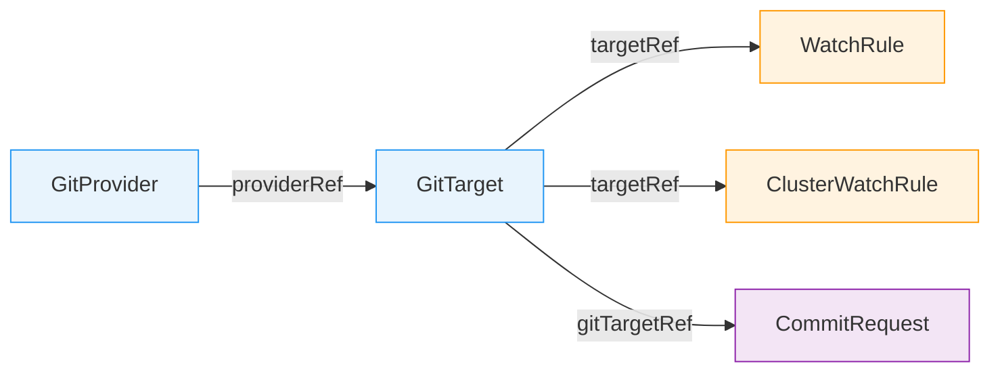
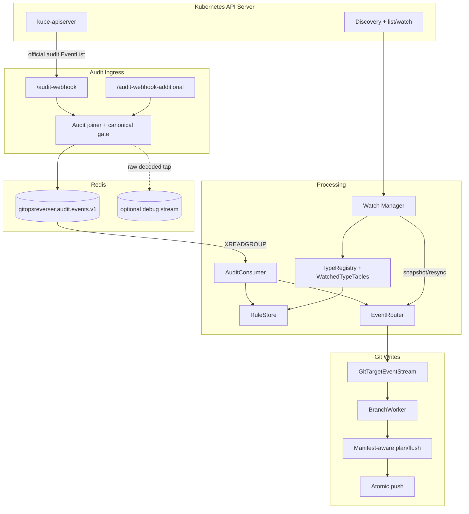
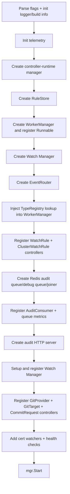

# GitOps Reverser Architecture

> Last updated: June 2026

GitOps Reverser is a Kubernetes operator that observes cluster mutations and writes the resulting
desired object state to Git. It reverses the traditional GitOps direction: instead of Git driving
the cluster, the Kubernetes API drives Git.

This document is the starting point for new contributors. It describes the current code, not only
the original design intent.

---

## Core Philosophy

**The Kubernetes API is the source of truth.** Git is a materialized mirror. When a push conflicts
with a newer remote commit, the operator fetches the new remote state, resets the local clone, and
replays retained writes. Snapshot and resync paths always derive their desired state from the live
API, never from Git.

**Writes are serialized per Git branch.** One [BranchWorker](../internal/git/branch_worker.go) owns
each `(GitProvider namespace, GitProvider name, branch)` tuple. Multiple `GitTarget`s may share one
branch, but all writes funnel through that worker.

**Audit is the authoritative live event source.** Audit events carry user identity, request intent,
and response bodies. Dynamic watch/informer infrastructure is still essential, but it is used for
API discovery, type followability, initial snapshots, rule-change resync, and cache/dedup support.

**Manifest content is treated as structured YAML, not just generated files.** Existing manifests are
scanned by identity. Updates patch an existing document in place when it is safe, moved manifests
stay where they are, and resync uses mark-and-sweep only after a complete cluster snapshot.

**Redis/Valkey is the ingestion buffer.** Audit webhook receivers enqueue canonical audit events
into Redis streams. The consumer group model is HA-ready, but deployments run one replica by
default while full HA support remains unfinished.

---

## User-Facing API

Five CRDs define the public API.



### GitProvider

- **Scope**: namespaced
- **Source**: [api/v1alpha1/gitprovider_types.go](../api/v1alpha1/gitprovider_types.go)
- **Controller**: [internal/controller/gitprovider_controller.go](../internal/controller/gitprovider_controller.go)

`GitProvider` represents a Git repository and the credentials/configuration used to write it.

Key fields:

- `spec.url`: repository URL. It is immutable.
- `spec.secretRef`: optional namespace-local Secret for HTTP/SSH authentication.
- `spec.allowedBranches`: glob patterns that gate writable branches.
- `spec.push.commitWindow`: rolling silence window for grouped commits, defaulting to `5s`.
- `spec.commit.committer`: committer identity.
- `spec.commit.message`: templates for event, snapshot, and grouped commit messages.
- `spec.commit.signing`: SSH signing key reference and optional key generation.
- `status.signingPublicKey`: populated when signing is configured and key material is available.

The controller verifies repository reachability and manages signing key lifecycle. For Gitea, the
helper client in [internal/giteaclient/](../internal/giteaclient/) can register generated signing
keys.

### GitTarget

- **Scope**: namespaced
- **Source**: [api/v1alpha1/gittarget_types.go](../api/v1alpha1/gittarget_types.go)
- **Controller**: [internal/controller/gittarget_controller.go](../internal/controller/gittarget_controller.go)

`GitTarget` is one materialization destination: `(provider, branch, path)`.

Key fields:

- `spec.providerRef`: currently implemented for namespace-local `GitProvider`.
- `spec.branch`: immutable branch name, validated against `GitProvider.spec.allowedBranches`.
- `spec.path`: immutable required path under the repository; `.` deliberately means repo root.
- `spec.encryption`: optional SOPS/age encryption settings for sensitive resources.

The destination fields `providerRef`, `branch`, and `path` are immutable so a target cannot silently
orphan an old materialization. The controller also rejects path overlaps between GitTargets that
share the same provider and branch.

`GitTarget` status exposes readiness gates:

- `Validated`: provider exists, branch is allowed, and the target path is valid/non-overlapping.
- `EncryptionConfigured`: required encryption material exists or has been generated.
- `SnapshotSynced`: initial cluster-to-Git resync completed.
- `EventStreamLive`: the target is ready for live audit-driven writes.
- `Ready`: aggregate readiness.

Snapshot stats are stored in `status.snapshot.stats`.

The `providerRef` schema still mentions Flux `GitRepository`, but the controller path only supports
`GitProvider` today.

### WatchRule

- **Scope**: namespaced
- **Source**: [api/v1alpha1/watchrule_types.go](../api/v1alpha1/watchrule_types.go)
- **Controller**: [internal/controller/watchrule_controller.go](../internal/controller/watchrule_controller.go)

`WatchRule` selects resources in its own namespace and routes matching events to a namespace-local
`GitTarget`.

Key fields:

- `spec.targetRef`: same-namespace `GitTarget`.
- `spec.rules[]`: OR-ed resource rules.
- `rules[].operations`: `CREATE`, `UPDATE`, `DELETE`, or `*`; omitted means all operations.
- `rules[].apiGroups`: omitted means resolve the named resource across served API groups.
- `rules[].apiVersions`: omitted means preferred served version.
- `rules[].resources`: plural resource names or `*`.

Subresources are intentionally rejected in rule resources. Snapshot and steady-state mirroring
operate on top-level resources; selected subresource effects are translated separately when they can
be safely mapped back to parent desired state.

### ClusterWatchRule

- **Scope**: cluster
- **Source**: [api/v1alpha1/clusterwatchrule_types.go](../api/v1alpha1/clusterwatchrule_types.go)
- **Controller**: [internal/controller/clusterwatchrule_controller.go](../internal/controller/clusterwatchrule_controller.go)

`ClusterWatchRule` selects cluster-scoped resources or namespaced resources across the cluster.

Key fields:

- `spec.targetRef`: `GitTarget` reference with explicit namespace.
- `spec.rules[].scope`: `Cluster` for cluster-scoped resources, `Namespaced` for namespaced
  resources across all namespaces.
- `spec.rules[]`: same operation/group/version/resource model as `WatchRule`.

### CommitRequest

- **Scope**: namespaced
- **Source**: [api/v1alpha1/commitrequest_types.go](../api/v1alpha1/commitrequest_types.go)
- **Controller**: [internal/controller/commitrequest_controller.go](../internal/controller/commitrequest_controller.go)
- **Audit handling**: [internal/queue/commit_request.go](../internal/queue/commit_request.go)

`CommitRequest` is a one-shot "save now" signal. Creating it finalizes the open commit window for a
same-namespace `GitTarget` instead of waiting for the silence timer.

Key fields:

- `spec.gitTargetRef.name`: target whose open window should be finalized.
- `spec.message`: optional verbatim commit message, bounded by CRD validation.
- `status.phase`: `WaitingForAuditEvent`, `Committed`, `NoOpenWindow`, or `Failed`.
- `status.branch` / `status.sha`: set when a commit was produced.

The controller only stamps `WaitingForAuditEvent`. The actual finalize happens when the audit
consumer processes the CommitRequest's own create audit event. That ordering is deliberate: by the
time the CommitRequest audit event is consumed, earlier user mutations have already entered the open
window.

---

## Kubernetes Concepts That Matter

### Audit Webhook

The Kubernetes API server can POST audit `EventList` payloads to an external HTTP endpoint. The
operator cannot configure that API server policy itself; it only receives what the cluster sends.
Audit events are valuable because they include the original user, verb, object identity, response
status, and often request/response bodies.

GitOps Reverser exposes:

```text
POST /audit-webhook
POST /audit-webhook-additional
```

`/audit-webhook` is the canonical kube-apiserver source. `/audit-webhook-additional` is for
supplementary body providers, especially aggregated API paths where the kube-apiserver audit events are shallow. Meaning that not the full body is available.

### Discovery and Informers

Discovery reports the served API surface. Dynamic informers and streaming-list watches observe
resources by GVR `(group, version, resource)`. GitOps Reverser uses this to resolve user rules,
decide which types are followable, start needed informers, and gather complete snapshots.

### resourceVersion

Kubernetes objects carry `metadata.resourceVersion`, but it is cluster-internal runtime state.
[internal/sanitize/](../internal/sanitize/) strips it before writing to Git.

---

## High-Level Flow



### Audit Event to Commit

1. The API server posts an audit `EventList` to `/audit-webhook`.
2. Optional supplementary body providers post matching `EventList` payloads to
   `/audit-webhook-additional`.
3. [AuditHandler](../internal/webhook/audit_handler.go) decodes, classifies, joins, deduplicates,
   and enqueues one canonical event per `auditID`.
4. [RedisAuditQueue](../internal/queue/redis_audit_queue.go) writes to
   `gitopsreverser.audit.events.v1`.
5. [AuditConsumer](../internal/queue/redis_audit_consumer.go) reads batches via Redis consumer
   groups.
6. The consumer keeps `ResponseComplete` mutating events and drops unsupported shallow or
   subresource-only shapes.
7. [RuleStore](../internal/rulestore/store.go) finds matching `WatchRule` and `ClusterWatchRule`
   entries.
8. The event is sanitized, sensitive/subresource handling is applied, and
   [EventRouter](../internal/watch/event_router.go) routes it to the target stream.
9. [GitTargetEventStream](../internal/reconcile/git_target_event_stream.go) buffers during target
   reconciliation and deduplicates live content.
10. [BranchWorker](../internal/git/branch_worker.go) groups events by author and GitTarget inside
    the commit window.
11. The manifest-aware writer scans the target subtree, applies structured edits, commits, and
    eventually pushes through [PushAtomic](../internal/git/git_atomic_push.go).
12. If the remote moved, the worker fetches, resets, rebuilds retained pending writes, and retries.

---

## Rule and Type Resolution

### RuleStore

- **Source**: [internal/rulestore/store.go](../internal/rulestore/store.go)

The RuleStore is an in-memory cache populated by the WatchRule and ClusterWatchRule controllers.
Compiled rules include the full chain from rule to `GitTarget`, `GitProvider`, branch, and path.

It is read by:

- the audit consumer for live event routing;
- the watch manager for target watch planning;
- rule-change reconciliation for deciding which targets need resync.

### APIResourceCatalog

- **Source**: [internal/watch/api_resource_catalog.go](../internal/watch/api_resource_catalog.go)
- **Observation projection**: [internal/watch/catalog_observe.go](../internal/watch/catalog_observe.go)

`APIResourceCatalog` is the discovery-backed view of served resources. Trust is tracked per
group/version. If one aggregated API group/version is degraded, the catalog keeps the last trusted
entries for that group/version instead of treating it as an empty API surface and causing accidental
Git deletions.

The catalog refreshes on startup, periodically, and when CRD/APIService trigger informers observe
API-surface changes.

### TypeRegistry and Followability

- **Source**: [internal/typeset/](../internal/typeset/)
- **Design**: [docs/design/manifest/version2/type-followability.md](design/manifest/version2/type-followability.md)

`internal/typeset` is the single decision surface for "can this type be followed?" The watch manager
projects catalog entries into `typeset.Observation`s, then publishes one `TypeRecord` per known
type in a `TypeRegistry`.

Each record carries:

- GVK and GVR identity;
- scope and preferred version facts;
- origin classification;
- subresource facts, including usable `/scale` bindings;
- sensitivity policy;
- one `Followability` verdict and reason-code summary.

Followability replaces older scattered checks. Snapshot planning, informer planning, manifest
analysis, and GVR-only delete/scale resolution all read the same registry.

### WatchedTypeTable

- **Source**: [internal/watch/watched_type_table.go](../internal/watch/watched_type_table.go)

A `WatchedTypeTable` is a per-GitTarget projection of the type registry filtered by that target's
WatchRules and ClusterWatchRules. It records the resolved GVK/GVR/scope plus namespace and
operation coverage.

The table is the resident answer to "what does this GitTarget watch?" and feeds:

- the demand `Declare` — the set of types the GitTarget claims for materialization;
- the per-type splice's namespace scope — which of a type's objects this GitTarget mirrors;
- the per-type audit tail's fan-out — which GitTargets a live event routes to.

---

## Watch, Checkpoint, and Reconcile

> **Updated for the api-source-of-truth model (R3, landed 2026-06-11).** The long-lived object
> informers and the per-reconcile streaming snapshot gather are **gone**; desired state now comes
> from a per-type **checkpoint + audit-log splice**. For the full picture and the bootstrap
> walk-through see [design/stream/architecture-and-bootstrap.md](design/stream/architecture-and-bootstrap.md)
> and [design/stream/api-source-of-truth-reconcile.md](design/stream/api-source-of-truth-reconcile.md).

- **Manager**: [internal/watch/manager.go](../internal/watch/manager.go)
- **Checkpoint fill (LIST)**: [internal/watch/type_objects_mirror.go](../internal/watch/type_objects_mirror.go)
- **Per-type audit tail (freshness)**: [internal/watch/audit_tail.go](../internal/watch/audit_tail.go)
- **Splice (checkpoint + log → desired)**: [internal/queue/redis_type_splice.go](../internal/queue/redis_type_splice.go)
- **Router resync path**: [internal/watch/event_router.go](../internal/watch/event_router.go)
- **Worker resync apply**: [internal/git/resync_flush.go](../internal/git/resync_flush.go)

The watch manager is a controller-runtime `Runnable`. It owns **type-level** discovery, the demand
`Materializer`, the checkpoint driver, the per-type audit tails, and the splicer. There are **no
object-watch informers** — the only watch it keeps is the type-level discovery watch (CRDs /
APIServices). The API is captured **once per type**, only for the types a GitTarget claims, by two
decoupled writers: an always-on audit-webhook **log** (`:audit:stream`) and a periodic LIST
**checkpoint** (`:objects:items` @ `:objects:rv`).

On startup it bootstraps the RuleStore from existing rules, replays durable checkpoints into the
Materializer (so a restart resumes serving without re-listing), refreshes the API catalog, updates
the TypeRegistry, and builds watched-type tables.

### Rule-Change Reconcile

A WatchRule / ClusterWatchRule / GitTarget / CRD / APIService change reaches a GitTarget through the
**GitTarget controller**, which `Watches` those objects and re-enqueues the affected GitTarget. On
reconcile the GitTarget re-`Declare`s its complete watched-type set to the Materializer; a type a new
rule starts watching is claimed, materialized (checkpoint), and backfilled via the splice.
`Manager.ReconcileForRuleChange` itself now only refreshes the API-resource catalog and the
watched-type tables — there is no longer a whole-GitTarget rule-change snapshot gather.

### Checkpoint + Splice (the desired set)

Desired state for a reconcile is produced by the **splice**: it reads a type's checkpoint pinned at
revision `R` and folds in every audit-log entry strictly after `R`, scoped to the GitTarget's
namespaces, into the complete desired set. The checkpoint LIST uses a streaming-list watch
(`sendInitialEvents=true`, `resourceVersionMatch=NotOlderThan`, `allowWatchBookmarks=true`) and
falls back to a consistent LIST for servers that cannot stream; a missing checkpoint **fails closed**
(the reconcile holds rather than sweeping against nothing). Between checkpoints, a per-type **audit
tail** applies each new log entry as an incremental upsert/delete for freshness.

### Mark-and-Sweep Resync

The BranchWorker applies a reconcile by scanning the GitTarget subtree and building a manifest plan
(this write side is **unchanged**):

- desired resources are upserted through the same content-derived path as live writes;
- existing managed documents that are watched but absent from the desired set are deleted;
- untracked, non-Kubernetes, unresolved, or unsafe YAML is left alone according to analyzer policy;
- nothing is committed if the apply cannot complete safely.

An empty desired set is authoritative only because the **checkpoint** completed for that type.

---

## Git Write Architecture

### BranchWorker

- **Source**: [internal/git/branch_worker.go](../internal/git/branch_worker.go)
- **Worker manager**: [internal/git/worker_manager.go](../internal/git/worker_manager.go)

`BranchWorker` owns a local clone and a single event loop for its branch. Events are buffered in a
single open commit window.

The open window accepts only one `(author, GitTarget)` pair at a time:

- same author + same GitTarget: append to the window;
- different author or GitTarget: finalize the current window first;
- repeated writes to the same Git path inside a window are last-write-wins.

The window finalizes when:

- `spec.push.commitWindow` passes with no new matching event;
- the retained buffer reaches `--branch-buffer-max-bytes` (default `8Mi`);
- a `CommitRequest` finalize signal matches the open author and GitTarget;
- the worker receives a resync request or shutdown.

Successful local commits are retained until the push cooldown allows a push. The fixed cooldown
prevents remote push storms during bursts.

### Local Clones and Conflict Retry

Local clones live under:

```text
/tmp/gitops-reverser-workers/{namespace}/{provider}/{branch}/repos/{hash}
```

`PushAtomic` checks the remote ref before pushing. If the remote diverged:

1. smart-fetch the latest remote state;
2. hard-reset the local clone to the remote tip;
3. replay retained pending writes;
4. retry, up to the configured attempt limit.

This is valid because pending writes can be rebuilt from sanitized API-derived state.

### Manifest-Aware Writer

- **Steady state**: [internal/git/plan_flush.go](../internal/git/plan_flush.go)
- **YAML editor**: [internal/git/manifestedit/](../internal/git/manifestedit/)
- **Analyzer/planner**: [internal/manifestanalyzer/](../internal/manifestanalyzer/)
- **Object projection**: [internal/manifestreport/](../internal/manifestreport/)

The writer no longer blindly regenerates one canonical file per event when a manifest already
exists. For each commit it:

1. scans YAML files under the GitTarget path;
2. builds a byte-free manifest store keyed by resource identity;
3. resolves each event to one action;
4. hydrates only touched files into commit-scoped buffers;
5. flushes only changed/deleted files.

Upserts behave this way:

- if a managed document for the resource already exists, patch it in place;
- if it is sensitive/encrypted, re-encrypt the whole document at its existing path;
- if no document exists, create a new file at the canonical placement path.

Deletes use the manifest identity index, so a moved manifest can still be deleted even when it is
not at the canonical path.

Field patches, currently used for supported subresource effects such as `/scale`, are intentionally
narrow. They only patch existing parent manifests and never fabricate a parent object from partial
subresource data.

### Current File Placement

New resources still use the canonical REST-like path:

```text
{spec.path}/{group}/{version}/{resource}/{namespace}/{name}.yaml
```

For core resources, the empty group segment is omitted:

```text
{spec.path}/v1/configmaps/my-namespace/my-config.yaml
```

Sensitive resources use `.sops.yaml`:

```text
{spec.path}/v1/secrets/my-namespace/my-secret.sops.yaml
```

Existing resources are match-first: once a document exists in Git, updates and deletes use that
document's current location instead of recomputing placement.

Future placement policy is tracked in
[docs/design/manifest/version2/gittarget-new-file-placement-rules.md](design/manifest/version2/gittarget-new-file-placement-rules.md).

### Bootstrap Files

- **Templates**: [internal/git/bootstrapped-repo-template/](../internal/git/bootstrapped-repo-template/)
- **Logic**: [internal/git/bootstrapped_repo_template.go](../internal/git/bootstrapped_repo_template.go)

The first write to a GitTarget path stages operator-managed bootstrap content. That includes a
`README.md` and, when encryption is configured, a `.sops.yaml` file with age recipient rules.

### Sensitive Resources and Encryption

- **Encryption model**: [internal/git/encryption.go](../internal/git/encryption.go)
- **SOPS implementation**: [internal/git/sops_encryptor.go](../internal/git/sops_encryptor.go)
- **Sensitivity policy**: [internal/types/sensitive_resource.go](../internal/types/sensitive_resource.go)

Core Secrets are sensitive by default. Operators can mark additional resource types sensitive with
`--additional-sensitive-resources`.

Sensitive resources are never written in plaintext. If encryption is required and unavailable, the
write fails before the plaintext file is created. The content writer also caches encrypted output by
resource metadata and plaintext digest to avoid unnecessary SOPS work.

### Commit Signing

- **Git signing**: [internal/git/signing.go](../internal/git/signing.go)
- **SSH signatures**: [internal/sshsig/](../internal/sshsig/)

Commit signing uses OpenSSH signatures. The signing key is read from
`GitProvider.spec.commit.signing.secretRef` or generated when configured.

---

## Audit Ingestion

- **Handler**: [internal/webhook/audit_handler.go](../internal/webhook/audit_handler.go)
- **Joiner**: [internal/webhook/audit_joiner.go](../internal/webhook/audit_joiner.go)
- **Consumer**: [internal/queue/redis_audit_consumer.go](../internal/queue/redis_audit_consumer.go)

The audit handler produces a canonical stream with at most one event per `auditID` inside the
decision TTL.

### Source Roles

| Endpoint | Role |
|---|---|
| `/audit-webhook` | Canonical source, normally kube-apiserver |
| `/audit-webhook-additional` | Supplementary body source for matching `auditID`s |

The endpoint encodes the source role. Cluster-ID path segments are rejected; multi-cluster routing
is not modeled yet.

### Joiner Behavior

The joiner classifies audit shape:

- body-rich official events emit as-is unless a parked body can fill missing fields;
- bodyless single-resource deletes with complete `objectRef` emit as deletable deletes;
- `deletecollection` events emit as collection audit facts, but per-item Git fan-out is still a
  known downstream gap;
- identity-shallow official events wait up to `--audit-event-body-wait` for a supplementary body;
- malformed additional events are dropped;
- late additional bodies are dropped once a decision has already committed.

The official canonical gate is an in-pod mutex. It preserves per-pod official event order while an
earlier shallow official waits for its body. It is not a global cross-pod ordering guarantee.

Redis key families:

| Key | Purpose | Default TTL |
|---|---|---|
| `audit:body:v1:<auditID>` | parked additional body | `5m` |
| `audit:decision:v1:<auditID>` | dedupe/decision marker | `1h` |

### Consumer Handling

The consumer filters to mutating `ResponseComplete` events, matches rules, extracts objects, and
routes Git events. It also handles special cases:

- CommitRequest create events finalize open windows.
- Safe `/scale` events become field patches to parent `spec.replicas` when the type registry has a
  usable scale binding.
- unsupported subresources are dropped before routing.
- shallow events that reach the consumer are dropped with explicit warning/metrics instead of
  creating stub manifests.

### Redis Queue

- **Queue producer**: [internal/queue/redis_audit_queue.go](../internal/queue/redis_audit_queue.go)
- **Metrics reporter**: [internal/queue/queue_metrics.go](../internal/queue/queue_metrics.go)

The canonical stream defaults to `gitopsreverser.audit.events.v1`. Consumers use Redis consumer
groups with pod-name consumer IDs. Stale pending messages are reclaimed with `XAUTOCLAIM`, and
messages are ACKed even on processing failure so one poison event cannot block the stream. The
consumer and watch manager declare `NeedLeaderElection`, but the shipped deployment defaults to one
replica while full HA behavior is still future work.

An optional debug stream records every decoded audit event before normal filtering and joining.

---

## Controller Wiring

Controllers also watch their dependencies so dependent resources reconcile quickly after spec
changes:

- `GitTargetReconciler` watches `GitProvider`.
- `WatchRuleReconciler` watches `GitTarget` and `GitProvider`.
- `ClusterWatchRuleReconciler` watches `GitTarget` and `GitProvider`.

These dependency watches use generation-change predicates to avoid re-enqueuing on status-only
heartbeat updates.

GitProvider, GitTarget, and CommitRequest specs have immutability constraints where changing the
spec would invalidate materialized state or delayed audit behavior.

---

## Startup Sequence

Defined in [cmd/main.go](../cmd/main.go):



The watch manager bootstraps the RuleStore from existing rules during its `Start` path before the
initial watch reconciliation.

---

## Operational Boundaries

Current limitations:

- no pull-request creation; the operator writes directly to branches;
- no multi-cluster routing or file identity;
- no per-destination Redis streams, so a blocked destination can still stall the single consumer
  path;
- `deletecollection` reaches the canonical audit stream but does not yet fan out per item;
- Flux `GitRepository` provider references are schema-visible but not implemented;
- new-file placement is still canonical path based, not user-configurable.

---

## Package Map

| Package | Role |
|---|---|
| [api/v1alpha1/](../api/v1alpha1/) | CRD types |
| [cmd/](../cmd/) | operator entry point and server setup |
| [internal/auditutil/](../internal/auditutil/) | audit identity, objectRef, and subresource helpers |
| [internal/controller/](../internal/controller/) | Kubernetes reconcilers |
| [internal/git/](../internal/git/) | branch workers, Git operations, commit/signing/encryption, manifest writer |
| [internal/git/manifestedit/](../internal/git/manifestedit/) | YAML document editor |
| [internal/giteaclient/](../internal/giteaclient/) | Gitea helper client |
| [internal/manifestanalyzer/](../internal/manifestanalyzer/) | manifest inventory, acceptance, and resync planning |
| [internal/manifestreport/](../internal/manifestreport/) | projection of Kubernetes objects into comparable manifest reports |
| [internal/queue/](../internal/queue/) | Redis queues, audit consumer, CommitRequest audit handling |
| [internal/reconcile/](../internal/reconcile/) | per-GitTarget event stream state |
| [internal/rulestore/](../internal/rulestore/) | compiled rule cache |
| [internal/sanitize/](../internal/sanitize/) | Kubernetes object sanitization and stable YAML marshal |
| [internal/ssh/](../internal/ssh/) | SSH authentication helpers |
| [internal/sshsig/](../internal/sshsig/) | SSH signature implementation |
| [internal/telemetry/](../internal/telemetry/) | metrics and OTLP setup |
| [internal/types/](../internal/types/) | shared resource identity/reference and sensitivity policy |
| [internal/typeset/](../internal/typeset/) | type followability registry and lookup model |
| [internal/watch/](../internal/watch/) | discovery catalog, watch manager, watched-type tables, event router, snapshots |
| [internal/webhook/](../internal/webhook/) | audit ingress and audit event joiner |

---

## Design Documents

Useful deeper dives:

- [Audit ingestion decision record](design/audit-ingestion-decision-record.md)
- [GitTarget lifecycle and repo architecture](design/gittarget-lifecycle-and-repo-architecture.md)
- [Watch and catalog architecture](design/watch-and-catalog-architecture.md)
- [Kubernetes API resource catalog](design/kubernetes-api-resource-catalog.md)
- [Type followability](design/manifest/version2/type-followability.md)
- [Type followability implementation log](design/manifest/version2/type-followability-implementation.md)
- [Per-type reconcile and streaming tail](design/manifest/version2/per-type-reconcile-and-streaming-tail.md)
- [Manifest current support review](design/manifest/current-manifest-support-review.md)
- [Reconcile via watchlist mark-and-sweep](design/manifest/reconcile-via-watchlist-mark-and-sweep.md)
- [SOPS/age key management](design/sops-repo-bootstrap-and-key-management-architecture.md)
- [Commit signing](commit-signing.md)
- [Interpreting metrics](interpreting-metrics.md)
