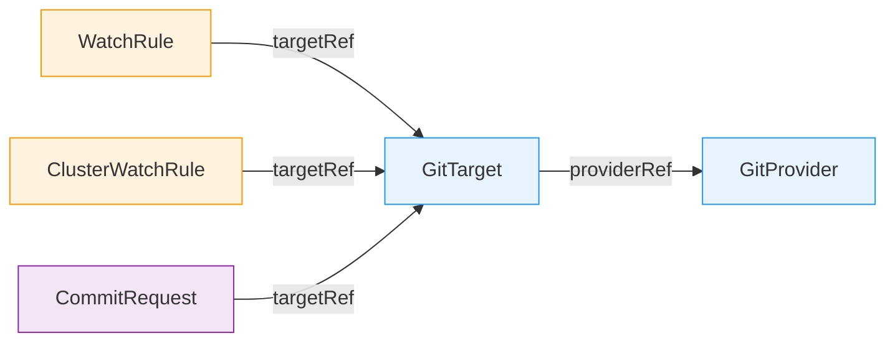
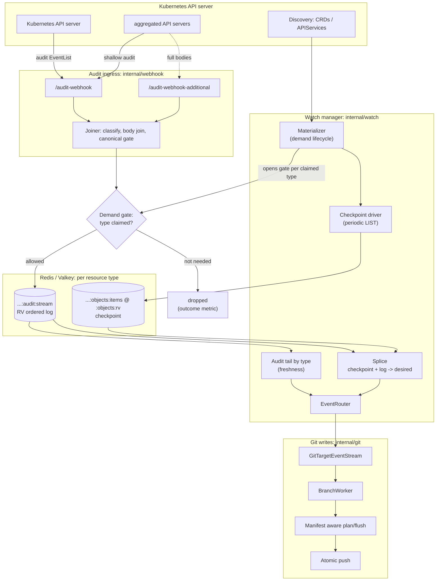
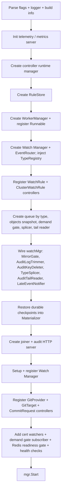

# GitOps Reverser Architecture

> Last updated: June 2026

GitOps Reverser is a Kubernetes operator that observes cluster mutations and writes the resulting
desired object state to Git. It reverses the traditional GitOps direction: instead of Git driving the
cluster, the Kubernetes API drives Git. The repository becomes a continuously updated mirror of live
cluster state.

This document is the starting point for new contributors. Read the [Ground Rules](#ground-rules) and
[Mental Model](#mental-model) for the shape of the system, then the
[Configuration Model](#configuration-model) and [A Change, End to End](#a-change-end-to-end) for how
you drive it. The later sections give the reference detail behind each piece. It describes the
current code. If a detail here ever disagrees with the source, the source wins. The design records
under [docs/design/](design/) and [docs/finished/](finished/) carry the full reasoning.

***

## Ground Rules

These are the design decisions to keep in your head while reading or changing the code:

**The Kubernetes API is the source of truth.** Git is a materialized mirror of desired state from the
API. Snapshot and resync paths use live API checkpoints plus the audit log. They never treat Git as
authority. When a push conflicts with a newer remote commit, the operator fetches the new remote
state. It resets its local clone, then replays retained writes from the API.

**Writes are serialized per Git branch.** One [BranchWorker](../internal/git/branch_worker.go) owns
each `(GitProvider namespace, GitProvider name, branch)` tuple. Multiple `GitTarget`s may share one
branch. Every write to that branch goes through the worker's single event loop and commit window.

**Audit is the authoritative live event source.** Audit events carry user identity, request intent,
object identity, and response bodies. Kubernetes watches, informers, and dynamic clients are still
essential. They support API discovery, type followability, checkpoint fills, rule change resyncs,
controller caches, duplicate safe queue state, and routing state. They are not the authoritative live
object change stream.

**Redis/Valkey is the mirror substrate.** It holds audit logs by type, checkpoints, the demand gate,
and CommitRequest attribution facts. The Git write side consumes those API records.

***

## Mental Model

The easy part is "write YAML to Git." The hard parts shape the whole architecture:

* **Ordering.** Two updates to the same object must land in Git in cluster order.
* **Not losing changes.** A dropped or late event must never leave Git *permanently* wrong.
* **Secrets.** Sensitive objects must never touch disk in plaintext.
* **Scale.** A cluster holds thousands of objects across hundreds of types; you cannot keep a live
  informer open on all of them.

The solution, in the vocabulary used throughout this document:

* **Audit is the live event source.** The Kubernetes API server posts an [audit
  webhook](#demand-gated-audit-ingestion) for every mutation, carrying the user, verb, object
  identity, and (usually) the object body. This is what makes Git writes attributable to a real user.
* **Each followed type gets its own Redis stream ordered by resource version.** Stream entry IDs use
  `metadata.resourceVersion`, so every type's log *replays in exact etcd commit order*. This one fact
  is the backbone of ordering. See [Ordering and Not Losing Events](#ordering-and-not-losing-events).
* **Ingestion is demand gated.** The webhook only mirrors a type while some `GitTarget` actually
  claims it, so cost scales with demand, not with cluster type count.
* **Desired state is a checkpoint + log splice.** For each type, a periodic consistent **LIST** writes
  a full **checkpoint**, and the always on audit **log** records every mutation after it. A reconcile
  *splices* the two: checkpoint pinned at revision `R`, plus every log entry after `R`. The checkpoint
  is the **integrity backstop**. A live event that is missed, dropped, or diverted is recovered by the
  next checkpoint. A miss costs *latency, not correctness*.
* **One `BranchWorker` per Git branch serializes all writes.** Every write to a branch funnels through
  a single worker and a single commit window, which is what keeps concurrent GitTargets and authors
  from racing each other into a corrupt tree.

***

## Configuration Model

You configure GitOps Reverser entirely through five CRDs (group `configbutler.ai`, version
`v1alpha2`). They describe a configurable pipeline. `WatchRule` and `ClusterWatchRule` choose which
Kubernetes resources enter the pipeline. `CommitRequest` can ask for the current window to be saved.
`GitTarget` chooses the branch and path. `GitProvider` supplies the repository, credentials, commit
settings, and push policy.



| CRD | Scope | One line role |
|---|---|---|
| `WatchRule` | namespaced | which resources in *this* namespace route to a GitTarget |
| `ClusterWatchRule` | cluster | which cluster scoped or cluster wide resources route to a GitTarget |
| `CommitRequest` | namespaced | a one shot "save the open window now" signal |
| `GitTarget` | namespaced | one materialization destination `(provider, branch, path)` |
| `GitProvider` | namespaced | a Git repo + credentials + commit/signing config |

### WatchRule / ClusterWatchRule

* **Sources**: [watchrule_types.go](../api/v1alpha2/watchrule_types.go),
  [clusterwatchrule_types.go](../api/v1alpha2/clusterwatchrule_types.go)
* **Controllers**: [watchrule_controller.go](../internal/controller/watchrule_controller.go),
  [clusterwatchrule_controller.go](../internal/controller/clusterwatchrule_controller.go)

A `WatchRule` selects resources in its own namespace and routes matching events to a same namespace
`GitTarget`. A `ClusterWatchRule` does the same for cluster scoped resources or namespaced resources
across the whole cluster, with an explicit namespace `targetRef`. Both share the rule model:

* `spec.rules[]`: OR resource rules (`MinItems=1`).
* `rules[].operations`: `CREATE` / `UPDATE` / `DELETE` / `*`; omitted means all.
* `rules[].apiGroups`: omitted resolves the named resource across served groups; `""` is the core
  group; `*` is all.
* `rules[].apiVersions`: omitted means the preferred served version.
* `rules[].resources`: plural resource names or `*`.
* `ClusterWatchRule` adds `rules[].scope`: `Cluster` or `Namespaced` (each rule independently scoped).

Subresources are rejected in rule resources. Mirroring operates on top level resources; selected
subresource effects (`/scale`) are translated separately.

### CommitRequest

* **Source**: [api/v1alpha2/commitrequest_types.go](../api/v1alpha2/commitrequest_types.go)
* **Controller**: [internal/controller/commitrequest_controller.go](../internal/controller/commitrequest_controller.go)

A one shot "save now" signal that finalizes the open commit window for a same namespace `GitTarget`
instead of waiting for the silence timer. The **entire spec is immutable**. Key fields:

* `spec.targetRef.name`: target whose open window should be finalized.
* `spec.message`: optional verbatim commit message (1–1024 chars, no control characters).
* `spec.delaySeconds`: optional `0–300s` grace so the author's own in flight changes can join the
  window before it closes.
* `status.phase`: `WaitingForAuditEvent` (initial) → terminal `Committed`, `Rejected`, or `Failed`.
* `status.reason` (when `Rejected`): `NoWindowInGrace`, `WindowMismatch`, or `AlreadyPresent`.
  `Rejected` is a correct, non error outcome.
* `status.branch` / `status.sha`: set when `Committed`.

Why the finalize waits for the request's *own* audit event is explained under
[CommitRequest Finalize](#commitrequest-finalize).

### GitTarget

* **Source**: [api/v1alpha2/gittarget_types.go](../api/v1alpha2/gittarget_types.go)
* **Controller**: [internal/controller/gittarget_controller.go](../internal/controller/gittarget_controller.go)

One materialization destination: `(provider, branch, path)`. Key fields:

* `spec.providerRef`: a `GitProvider` in the same namespace (`group`/`kind` default to
  `configbutler.ai`/`GitProvider`, the only accepted values).
* `spec.branch`: immutable branch, validated against `GitProvider.spec.allowedBranches`.
* `spec.path`: immutable, required path under the repo (`MinLength=1`; `.` means repo root and must be
  chosen explicitly).
* `spec.encryption`: optional SOPS/age encryption settings for sensitive resources.

`providerRef`, `branch`, and `path` are immutable so a target cannot silently orphan an old
materialization. The controller also rejects path overlaps between GitTargets sharing a provider and
branch.

Status splits into two **orthogonal axes** (see
[design/status-design-git-target.md](design/status-design-git-target.md)):

* **Control plane. Is it configured and wired?** `Validated` (provider exists, branch allowed, path
  valid with no overlap), `EncryptionConfigured` (required key material present), and `Ready` (the
  aggregate of those plus a wired branch worker). `Ready` does **not** depend on data plane sync.
* **Data plane. Is desired state actually materializing?** `Synced`, a pure projection of the
  materialization summary, with reasons `OK` / `Initializing` (first checkpoint building) /
  `NotFollowable` (a claimed type is refused) / `SyncFailing` (checkpoint sync failing with no prior
  checkpoint). `status.phase` (`Pending`/`Initializing`/`Synced`/`Degraded`) is an informational
  projection only. Automation gates on conditions, never phase. `status.materialization` is a bounded
  **counts** summary (`claimedTypes`, `syncedTypes`, `pendingTypes`, `failingTypes`,
  `notFollowableTypes`, `observedTime`), not a list by type.

### GitProvider

* **Source**: [api/v1alpha2/gitprovider_types.go](../api/v1alpha2/gitprovider_types.go)
* **Controller**: [internal/controller/gitprovider_controller.go](../internal/controller/gitprovider_controller.go)

Represents a Git repository and the credentials/configuration used to write it. Key fields:

* `spec.url`: immutable repository URL.
* `spec.secretRef`: optional Secret in the same namespace for HTTP/SSH authentication.
* `spec.knownHostsRef`: optional SSH known hosts source.
* `spec.allowedBranches`: glob patterns that gate writable branches.
* `spec.push.commitWindow`: rolling silence window for grouped commits, defaulting to `5s`.
* `spec.commit.committer`: committer identity (defaults to `GitOps Reverser` / `noreply@configbutler.ai`).
* `spec.commit.message`: `eventTemplate` / `reconcileTemplate` / `groupTemplate` Go templates.
* `spec.commit.signing`: SSH signing key reference and optional key generation.
* `status.signingPublicKey`: populated when signing is configured and key material is available.

The controller verifies repository reachability and manages the signing key lifecycle. It generates
an ed25519 keypair when `signing.generateWhenMissing` is set. The portable artifact across GitOps
ecosystems is the credentials Secret, not a foreign repository object. The credentials reader accepts
the Kubernetes native, Flux, and Argo CD Secret key dialects. See
[design/git-credentials-interop.md](design/git-credentials-interop.md). There is no Flux
`GitRepository` provider option.

***

## A Change, End to End

Say a `GitTarget` in namespace `team-a` watches ConfigMaps, and a user runs
`kubectl apply` to edit the ConfigMap `team-a/app-config`. Here is the path that change takes.



The diagram has two cooperating halves: **ingest** (top: webhook → gate → stream by type) and
**materialize** (bottom: checkpoint + log → desired state → Git). Following the ConfigMap edit:

1. **Audit.** The API server applies the change, bumps the object's `resourceVersion`, and POSTs an
   audit `EventList` to `/audit-webhook`.
2. **Filter.** [AuditHandler](../internal/webhook/audit_handler.go) decodes it and keeps it. It is a
   `ResponseComplete`, mutating verb, with a changed RV and a body. (Events that can never become a
   Git write are dropped here: stages other than `ResponseComplete`, read only verbs, failures, dry
   runs, no op updates where request RV == response RV, and unsupported subresources.)
3. **Join.** [AuditJoiner](../internal/webhook/audit_joiner.go) sees a body rich event and emits it
   as is. (For aggregated APIs whose official event is *shallow*, it would instead wait briefly for a
   matching body on `/audit-webhook-additional` and join them by `auditID`.)
4. **Gate.** The [demand gate](../internal/gate/gate.go) is asked "does anyone claim
   `core/configmaps`?" Our GitTarget does, so the event is allowed. (If nobody claimed it, it would be
   dropped as `not_needed`.)
5. **Mirror.** [RedisByTypeStreamQueue](../internal/queue/redis_bytype_queue.go) appends it to
   `gitops-reverser:core:configmaps:audit:stream` with ID `<resourceVersion>-<subseq>`, keeping that
   type's log in etcd commit order.
6. **Freshness.** The [audit tail](../internal/watch/audit_tail.go) for the type wakes, applies the
   change as an upsert, and fans it out to every GitTarget whose watched type table covers ConfigMaps
   in `team-a`.
7. **Route + window.** [EventRouter](../internal/watch/event_router.go) hands it to the
   [GitTargetEventStream](../internal/reconcile/git_target_event_stream.go), and the
   [BranchWorker](../internal/git/branch_worker.go) appends it to the open commit window for
   `(author, GitTarget)`.
8. **Commit + push.** When the window closes (5s of silence, a `CommitRequest`, or a buffer limit),
   the manifest aware writer patches `team-a/.../app-config.yaml` in place, commits as the original
   user, and pushes via [PushAtomic](../internal/git/git_atomic_push.go) (retrying with fetch/reset/
   replay if the remote moved).

**And if step 5 or 6 had failed?** Suppose the event arrived out of order and was *diverted*, or
demand opened a beat too late and it was dropped. The new ConfigMap state is still captured at the
next periodic **checkpoint LIST**: the [splice](#splice-the-desired-set) reads checkpoint + log, a
mark and sweep reconcile rewrites the subtree, and Git converges. The live
path is for *latency*; the checkpoint is for *correctness*. This split is the spine of the next
section.

***

## What It Writes to Git

A `GitTarget` owns one subtree (`spec.path`) on one branch. New objects are placed at a canonical
REST like path; once a document exists it is edited in place wherever it already lives. A populated
target looks like:

```text
team-a-config/                              # GitTarget spec.path
├── README.md                               # operator-managed bootstrap file
├── .sops.yaml                              # present only when encryption is configured
├── v1/
│   ├── configmaps/team-a/app-config.yaml
│   └── secrets/team-a/db-creds.sops.yaml   # sensitive types are SOPS/age encrypted
└── apps/
    └── v1/deployments/team-a/api.yaml
```

The path shape is `{spec.path}/{group}/{version}/{resource}/{namespace}/{name}.yaml` (the empty core
group is omitted, sensitive resources get a `.sops.yaml` suffix). Details and the placement policy are
in [Git Write Architecture](#git-write-architecture).

***

## Ordering and Not Losing Events

This is the heart of the system. The guarantee is **layered: ordering is enforced structurally,
integrity is guaranteed by the checkpoint, and freshness is best effort on top.** A lost live event
costs freshness, never integrity.

### Per type streams ordered by resource version

Every followed type gets its own Redis stream at
`<prefix>:<group-or-core>:<resource>:audit:stream` (default prefix `gitops-reverser`; the core group
renders as `core`). Each accepted event is one entry whose ID is `<resourceVersion>-<subseq>`. Because
Redis stream IDs are compared as two 64 bit integers, the stream **replays in exact etcd commit order**
with no string/decimal RV gymnastics. The high water mark and counters by type live in a companion
`…:audit:idstate` hash; a `<prefix>:__index__` set lists every active base key so the keyspace can be
enumerated without `SCAN`. Ordering is a property of the RV keying in Redis, not of any in process
lock. So it holds across pods.

### Divert: a late event is rejected, never forced in

When an event's RV is **strictly below the stream's high water mark**, forcing it in would corrupt the
replay order. Instead it is **diverted**:

* it is **rejected from the main stream** (Redis returns the "equal or smaller" error on `XADD`);
* its outcome is recorded (`older_than_high_water`, or `non_numeric_rv` for aggregated API RVs that
  are not monotonic integers);
* a `lateNotify` nudge fires so the Materializer can pull the next checkpoint forward;
* when the opt in `diag_all` firehose is enabled, the full payload is captured there for diagnosis.

Diverted events are represented by their outcome, the `lateNotify` nudge, and optional diagnostic
firehose records. They are not replayed as authoritative object changes because the checkpoint heals
the gap (below). A divert costs freshness until the next checkpoint, not integrity.

### Events without RV and the empty stream guard

Some events carry no usable RV (certain GC / aggregated API deletes). If the stream already has a
high water mark, an event without RV **attaches to it** (`attached-to-last-rv`) so it applies after
everything known. If the stream is **empty**, the event without RV is dropped as a no op
(`rv_less_empty_high_water`): there is nothing in the mirror for it to act on and the checkpoint is the
backstop. This guard is what keeps a freshly claimed type's divert metric quiet.

### The checkpoint is the integrity backstop

This is the single most important invariant, referenced from everywhere else. Desired state for a
reconcile is a **splice**. It reads the type's checkpoint pinned at revision `R`. Then it folds in
every audit log entry strictly after `R`. A **missing checkpoint fails closed**. The splice errors and
the reconcile *holds* rather than sweeping a target against an empty desired set. An empty desired set is
authoritative **only because the checkpoint completed**. So even if the live log dropped, diverted, or
never received an event, the next checkpoint LIST observes the true cluster state and the mark and sweep
reconcile converges Git to it.

### Freshness is sweep free

Between checkpoints, the audit tail for the type applies each new entry as an **upsert or delete only**.
It never sweeps. Because of that, it can never delete an object whose `create` is still in flight.
Partial bursts are made safe by construction rather than by a settle timer. Each `(GitTarget, type)`
has a **coverage watermark** `Hc`. It is a full `<rv>-<seq>` stream position, not a bare RV. It gates which tail
entries are "live" (strictly after the last reconcile) versus already covered by a splice. It advances
monotonically and is published only after a resync is actually enqueued.

### The demand gate is best effort by design

The gate (a shared Redis SET, detailed [below](#demand-gated-audit-ingestion)) is intentionally *not* a
synchronous lock, because it does not need to be: mirroring a type slightly **too early** is free (the
extra entries trim away at the next checkpoint), and slightly **too late** can miss an event, but the
next checkpoint LIST heals it. Demand is opened **synchronously when a GitTarget declares a type**, not
deferred to an async hop. That is what stops the first event after a claim from being lost.

### The canonical gate (per pod official ordering)

A small in pod mutex serializes official source `ResponseComplete` events while an earlier shallow
official event waits for its supplementary body, so within a pod official events keep their arrival
order. It is **not** a cross pod ordering guarantee. Cross stream order is the RV keying above.

### Observability

Every decoded event is recorded exactly once on
`gitopsreverser_audit_events_total{outcome, category, group, version, resource, verb}` by the layer
that terminates it (see [internal/audit/outcome/](../internal/audit/outcome/outcome.go)). Outcomes are
`Stored` (queued), `Held` (parked body), `Dropped` (with a precise reason such as `not_needed`,
`older_than_high_water`, `dry_run`, `unchanged_resource_version`, `shallow_dropped`), or `Error`. An
opt in `diag_all` firehose and the debug stream can capture full payloads when chasing a specific
failure.

***

## Demand Gated Audit Ingestion

* **Handler**: [internal/webhook/audit_handler.go](../internal/webhook/audit_handler.go)
* **Joiner**: [internal/webhook/audit_joiner.go](../internal/webhook/audit_joiner.go)
* **Queue by type**: [internal/queue/redis_bytype_queue.go](../internal/queue/redis_bytype_queue.go)
* **Demand gate**: [internal/gate/gate.go](../internal/gate/gate.go)

The Kubernetes API server can POST audit `EventList` payloads to an external HTTP endpoint. The
operator cannot configure that policy itself; it only receives what the cluster sends. Two endpoints
encode the source role:

| Endpoint | Role |
|---|---|
| `/audit-webhook` | Canonical source, normally the Kubernetes API server |
| `/audit-webhook-additional` | Supplementary body source for matching `auditID`s |

The additional endpoint exists for aggregated API paths where the Kubernetes API server's own audit events
are *shallow* (identity present, body absent), so the full body arrives on a second channel and is
joined by `auditID`. Cluster ID path segments are rejected; multi cluster routing is not modeled yet.

### Joiner Behavior

The joiner classifies audit shape and joins bodies across the two sources:

* body rich official events emit as is (a parked additional body can fill missing fields);
* bodyless single object deletes with a complete `objectRef` emit as deletable deletes;
* `deletecollection` events emit as collection facts. Identity is the `objectRef`, the body is never
  consumed, and item removals are reconciled by the checkpoint sweep;
* identity shallow official events wait up to `--audit-event-body-wait` (default `500ms`) for a body,
  then drop if none arrives;
* additional events with no body are dropped as malformed; other additional bodies park for their
  `auditID`.

The joiner uses one Redis key family:

| Key | Purpose | Default TTL |
|---|---|---|
| `audit:body:v1:<auditID>` | parked additional body | `5m` |

### The Demand Gate

The gate is a shared Redis SET (`<prefix>:__required__`) of claimed type keys, fanned out to every
ingest pod by a tiny ping STREAM (`…:__required__:updates`). Each pod keeps a local copy. It seeds
with `SMEMBERS`, wakes on the ping, and slow polls as a backstop. The hot path
`Allow(group, resource)` is an in memory lookup with no Redis round trip for each event. `SADD` is
idempotent, so a transient `SADD`/`SREM` disagreement between pods resolves to harmless over capture
or a checkpoint healed miss. See [the best effort posture above](#the-demand-gate-is-best-effort-by-design).

### Redis Key Families

Per type, base key `<prefix>:<group-or-core>:<resource>`:

| Key | Purpose |
|---|---|
| `…:audit:stream` | RV ordered audit log, IDs `<resourceVersion>-<subseq>` |
| `…:audit:idstate` | high water mark + counters by type (main / diverted / rv missing) |
| `…:objects:items` @ `…:objects:rv` | latest checkpoint contents + its revision |
| `…:objects:state` | durable phase + full GVR for restart restore |

Global (under the prefix):

| Key | Purpose |
|---|---|
| `<prefix>:__index__` | set of all active base keys (enumerate without `SCAN`) |
| `<prefix>:__required__` (+ `…:updates`) | demand gate set + ping stream |
| `<prefix>:diag_all` | opt in diagnostic firehose (off by default) |
| `<prefix>:commitrequests:authors:<id>` | CommitRequest author facts that survive diverts |

A dedicated reader client (large connection pool) serves the blocking tails by type, kept separate
from the mirror writer's client so dozens of parked `XREAD`s (a wildcard GitTarget follows many types)
never starve the writes.

***

## Rule and Type Resolution

How a user's `WatchRule` becomes "this GitTarget follows these concrete types in these namespaces."

### RuleStore

* **Source**: [internal/rulestore/store.go](../internal/rulestore/store.go)

An in memory cache populated by the WatchRule and ClusterWatchRule controllers. Compiled rules carry
the full chain from rule to `GitTarget`, `GitProvider`, branch, and path. It is read by the watch
manager (to build watched type tables for GitTargets) and the rule change reconcile path.

### APIResourceCatalog

* **Source**: [internal/watch/api_resource_catalog.go](../internal/watch/api_resource_catalog.go)

A thin normalizer for each scan: it turns one discovery result into a policy annotated `typeset.Scan`
and keeps only mechanical bookkeeping. **All judgement across scans lives in the typeset registry**
(`Registry.UpdateFromScan`): a failed group/version keeps serving last known facts instead of looking
like an empty API surface, and a group/version that vanishes from a complete scan rides a removal
grace rather than being pruned. Both protect against accidental Git deletions on a discovery blink
(see [typeset-owns-discovery-grace.md](design/typeset-owns-discovery-grace.md)). The catalog refreshes
on startup, periodically, and when CRD/APIService trigger informers fire.

### TypeRegistry and Followability

* **Source**: [internal/typeset/](../internal/typeset/)
* **Design**: [design/manifest/version2/type-followability.md](design/manifest/version2/type-followability.md)

`internal/typeset` is the single decision surface for "can this type be followed?" Each `TypeRecord`
carries GVK/GVR identity, scope and preferred version facts, origin classification, subresource facts
(including usable `/scale` bindings), sensitivity policy, and one `Followability` verdict. Checkpoint
planning, manifest analysis, and delete/scale resolution with only GVR all read it. The registry also owns
the second, demand axis via the **Materializer**: a type is materialized only when it is **Followable ∩
claimed**.

### WatchedTypeTable

* **Source**: [internal/watch/watched_type_table.go](../internal/watch/watched_type_table.go)

A projection for each `GitTarget` from the type registry, filtered by that target's rules, recording resolved
GVK/GVR/scope plus namespace and operation coverage. **This is where rule matching effectively
happens:** ingestion mirrors per type for *anyone* who claims it, and the watched type table scopes
each type back to specific GitTargets and namespaces at read time. It feeds three consumers:

* the demand `Declare`, the set of types the GitTarget claims for materialization;
* the splice namespace scope by type, which of a type's objects this GitTarget mirrors;
* the audit tail fan out by type, which GitTargets a live event routes to.

***

## Demand Driven Materialization and Reconcile

Desired state comes from a **checkpoint + audit log splice** by type. The checkpoint is filled from
the live API, the audit log supplies the ordered changes after that checkpoint, and the worker applies
the result as a type scoped mark and sweep reconcile. Full picture:
[design/stream/architecture-and-bootstrap.md](design/stream/architecture-and-bootstrap.md),
[finished/api-source-of-truth-reconcile.md](finished/api-source-of-truth-reconcile.md), and
[finished/demand-driven-type-materialization-lifecycle.md](finished/demand-driven-type-materialization-lifecycle.md).

* **Manager**: [internal/watch/manager.go](../internal/watch/manager.go)
* **Materialization lifecycle**: [internal/watch/materialization.go](../internal/watch/materialization.go)
* **Checkpoint fill (LIST)**: [internal/watch/type_objects_mirror.go](../internal/watch/type_objects_mirror.go)
* **Audit tail by type**: [internal/watch/audit_tail.go](../internal/watch/audit_tail.go)
* **Coverage watermark**: [internal/watch/target_type_watermark.go](../internal/watch/target_type_watermark.go)
* **Splice (checkpoint + log → desired)**: [internal/queue/redis_type_splice.go](../internal/queue/redis_type_splice.go)
* **Router**: [internal/watch/event_router.go](../internal/watch/event_router.go)
* **Worker resync apply**: [internal/git/resync_flush.go](../internal/git/resync_flush.go)

### The Watch Manager

The watch manager is a controller runtime `Runnable` (`NeedLeaderElection`). It owns **type level**
discovery, the demand `Materializer`, the checkpoint driver, the audit tails by type, the splicer,
and the watched type tables for GitTargets. Its only always on resource intake is the audit webhook
push; its scheduled API touch is the brief checkpoint LIST. Its watches/informers track the API
surface itself (CRDs / APIServices) rather than every object instance of every followed type.

On `Start` it bootstraps the RuleStore from existing rules, replays durable checkpoints into the
Materializer (so a restart resumes serving without listing again), refreshes the API catalog, updates the
TypeRegistry, builds watched type tables, runs an initial reconcile, then services periodic reconciles
plus CRD/APIService triggers and a ~hourly materialization sweep.

### Materialization Lifecycle

Materialization is the second axis (demand) layered on followability. A type a GitTarget claims moves
`Dormant → Requested → Syncing → Synced`, then refreshes via `Synced ⇄ Resyncing`, with `Failing` when
a checkpoint sync errors and a durable `removed` state when fully released.

* **Declare.** On each GitTarget reconcile the controller declares the GitTarget's complete
  watched type set again. Fully specified GVRs are claimed unconditionally; wildcard rules and rules
  without a version are resolved fail closed against discovery. Declaring a type **synchronously opens the demand gate** for
  it (mirroring starts before any event can arrive), claims it in the Materializer, and renews the
  GitTarget's claim lease.
* **Sweep.** A ~hourly ticker anchors claimed and Synced types again (requesting a fresh checkpoint), GCs
  aged out leases, and releases types no longer claimed. The sweep interval *is* the release grace. A
  healthy GitTarget reconciles far more often, so it always renews in time.
* **Durable state.** `…:objects:state` stores phase + full GVR. On boot the composition root reads it
  via `LoadSyncedCheckpoints` and `RestoreSyncedCheckpoint`s each type, so a restart serves the prior
  checkpoint immediately.

### Checkpoint Fill (the consistent LIST)

For a claimed type the driver fills a checkpoint with a streaming list watch
(`sendInitialEvents=true`, `resourceVersionMatch=NotOlderThan`, `allowWatchBookmarks=true`), folding
initial `ADDED` events until the initial events end bookmark pins the checkpoint revision; it falls
back to a consistent LIST for servers that cannot stream. Results are sanitized, wrapped in an
identity/RV envelope, and written to `…:objects:items` @ `…:objects:rv`. After a successful fill the
audit log is trimmed below the checkpoint revision (the trim cursor).

### Splice (the desired set)

A reconcile asks the splice for the complete desired set: it reads the checkpoint at revision `R`,
`XRANGE`s the audit log `(R, +]`, and folds each entry. Delete drops an identity. Any mutating verb
upserts it. Last writer wins by stream order. The result is scoped to the GitTarget's namespaces and
projected into desired resources. The splice **holds (fails closed)** unless the type's phase is
`Synced`, so a reconcile never sweeps against a partial or missing checkpoint. It also returns the
**coverage head** `Hc` (the last folded stream position) used to gate the audit tail.

### Rule Change Reconcile

A WatchRule / ClusterWatchRule / GitTarget / CRD / APIService change reaches a GitTarget through the
**GitTarget controller**, which `Watches` those objects (generation change predicates) and queues
the affected GitTarget again. On reconcile the GitTarget declares its watched type set again; a type a new
rule starts watching is claimed, gated, checkpointed, and backfilled through the splice.
`Manager.ReconcileForRuleChange` itself now only refreshes the API catalog and the watched type
tables. It does not gather a whole GitTarget snapshot.

### Mark and Sweep Resync

The BranchWorker applies a reconcile by scanning the GitTarget subtree and building a manifest plan
(this write side is shared with live writes):

* desired resources are upserted through the same content derived path as live writes;
* existing managed documents that are watched but absent from the desired set are deleted;
* untracked, non Kubernetes, unresolved, or unsafe YAML is left alone per analyzer policy;
* nothing is committed if the apply cannot complete safely.

A reconcile can be **type scoped** (`ScopeGVR`): the sweep is restricted to one `(group, resource)`, so
anchoring one type again never disturbs another's manifests. As established above, an empty desired set is
authoritative only because the checkpoint completed for that type.

***

## Git Write Architecture

### BranchWorker

* **Source**: [internal/git/branch_worker.go](../internal/git/branch_worker.go)
* **Worker manager**: [internal/git/worker_manager.go](../internal/git/worker_manager.go)

`BranchWorker` owns a local clone and a single event loop for its `(provider namespace, provider,
branch)` tuple. Events accumulate in one open commit window, which accepts only one `(author,
GitTarget)` pair at a time:

* same author + same GitTarget: append to the window;
* different author or GitTarget: finalize the current window first;
* repeated writes to the same Git path inside a window use last write wins.

The window finalizes when `spec.push.commitWindow` passes with no new matching event, the retained
buffer reaches `--branch-buffer-max-bytes` (default `8Mi`), a `CommitRequest` finalize deadline matches
the open author and GitTarget, or a resync request that is not a heal or shutdown arrives. Successful local
commits are retained until a fixed push cooldown (`5s`) allows a push, which prevents remote push
storms during bursts. Heal resyncs that arrive during a window are deferred and drained at the next idle
boundary.

### Local Clones and Conflict Retry

Local clones live under `/tmp/gitops-reverser-workers/{namespace}/{provider}/{branch}/repos/{hash}`.
[PushAtomic](../internal/git/git_atomic_push.go) checks the remote ref before pushing. If the remote
diverged it smart fetches the latest tip, hard resets the local clone, replays the retained pending
writes against the fresh tip (refreshing commit hashes), and retries up to the attempt limit. This is
valid because every pending write is rebuilt from sanitized API state. Nothing depends on locally
edited files.

### Manifest Aware Writer

* **Steady state**: [internal/git/plan_flush.go](../internal/git/plan_flush.go)
* **Resync apply**: [internal/git/resync_flush.go](../internal/git/resync_flush.go)
* **YAML editor**: [internal/git/manifestedit/](../internal/git/manifestedit/)
* **Analyzer/planner**: [internal/manifestanalyzer/](../internal/manifestanalyzer/)
* **Object projection**: [internal/manifestreport/](../internal/manifestreport/)

For each commit the writer scans YAML files under the GitTarget path, builds a manifest store without bytes
keyed by resource identity, resolves each event (or each desired resource, for resync) to one action,
hydrates only touched files into buffers for the commit, and flushes only changed or deleted files.

* **Upserts:** if a managed document for the resource already exists, patch it in place (preserving
  siblings in a multi document file); if it is sensitive, encrypt the whole document again at its existing
  path; if no document exists, create a new file at the canonical placement path.
* **Deletes:** use the manifest identity index, so a moved manifest can still be deleted even when it
  is not at the canonical path.
* **Field patches** (currently `/scale` → parent `spec.replicas`) are intentionally narrow: they only
  patch an existing parent manifest and never fabricate a parent object from partial subresource data.

### File Placement

New resources use the canonical REST like path
`{spec.path}/{group}/{version}/{resource}/{namespace}/{name}.yaml`. The core group's empty segment is
omitted (`{spec.path}/v1/configmaps/ns/name.yaml`), and sensitive resources use a `.sops.yaml` suffix.
Existing resources are **match first**: once a document exists in Git, updates and deletes use its
current location instead of recomputing placement. Future placement policy is tracked in
[design/manifest/version2/gittarget-new-file-placement-rules.md](design/manifest/version2/gittarget-new-file-placement-rules.md).

### Bootstrap, Encryption, and Signing

* **Bootstrap** ([bootstrapped_repo_template.go](../internal/git/bootstrapped_repo_template.go)): the
  first write to a GitTarget path stages a `README.md` and, when encryption is configured, a
  `.sops.yaml` with age recipient rules. Existing files are preserved.
* **Encryption** ([encryption.go](../internal/git/encryption.go),
  [sops_encryptor.go](../internal/git/sops_encryptor.go),
  [sensitivity policy](../internal/types/sensitive_resource.go)): core Secrets are sensitive by
  default; `--additional-sensitive-resources` adds more. Sensitive resources are **never written in
  plaintext**. If encryption is required and unavailable, the write fails before any plaintext file is
  created. Encrypted output is cached by metadata + plaintext digest to avoid redundant SOPS work.
* **Signing** ([signing.go](../internal/git/signing.go), [sshsig/](../internal/sshsig/)): commits use
  OpenSSH signatures, with the key read from `GitProvider.spec.commit.signing.secretRef` or generated
  when configured.

***

## CommitRequest Finalize

* **Controller**: [internal/controller/commitrequest_controller.go](../internal/controller/commitrequest_controller.go)
* **Author attribution**: [internal/queue/commitrequest_author.go](../internal/queue/commitrequest_author.go)
* **Design**: [design/stream/commitrequest-design.md](design/stream/commitrequest-design.md),
  [finished/commitrequest-attribution-divert-reliability.md](finished/commitrequest-attribution-divert-reliability.md)

A `CommitRequest` finalizes the open commit window for its GitTarget. The flow is ordered so the
request always lands *after* the user mutations it is meant to capture:

1. The controller stamps `WaitingForAuditEvent` and waits for the CommitRequest's own create audit
   event to be **attributed** to an author (up to a 60s timeout that fails closed).
2. Author attribution is written at ingestion into a **dedicated store that survives diverts**
   (`<prefix>:commitrequests:authors:<id>`, 10m TTL). It is deliberately separate from the ordered stream by type
   stream so attribution survives demand gating and RV diverts.
3. Once attributed, the controller eagerly **attaches** the request to the worker
   (`AttachCommitRequest`), anchoring the finalize at `receipt + delaySeconds`. The worker binds it to
   an open window only when author and GitTarget match. It **never finalizes another author's
   window**; a window carries at most one request.
4. The window finalizes on the deadline (or when it closes for any other reason). If a finalize closes
   an open window, the worker always schedules a push, so a window closed by an otherwise no op resync
   is not stranded.
5. Outcomes resolve on push: `Committed` carries the pushed `branch`/`sha`; `Rejected` carries a
   structured reason; `Failed` carries a message (e.g. attribution that never arrived). There is no
   watermark barrier in this path.

***

## Controller Wiring

Controllers watch their dependencies so dependents reconcile quickly after spec changes:

* `GitTargetReconciler` watches `GitProvider`, `WatchRule`, `ClusterWatchRule`, and the encryption
  `Secret`; it Declares the GitTarget's demand and derives the `Synced` condition + materialization
  summary.
* `WatchRuleReconciler` / `ClusterWatchRuleReconciler` watch `GitTarget` and `GitProvider`, populate
  the RuleStore, and trigger `ReconcileForRuleChange`.
* `GitProviderReconciler` validates reachability and manages the signing key lifecycle.
* `CommitRequestReconciler` runs with `MaxConcurrentReconciles=1` and attributes/attaches as above.

Dependency watches use generation change predicates to avoid queueing again on status only heartbeats.
`GitProvider`, `GitTarget`, and `CommitRequest` carry immutability constraints where a spec change
would invalidate materialized state or delayed audit behavior.

***

## Startup Sequence

Defined in [cmd/main.go](../cmd/main.go):



The audit HTTP handler is wired with the queue by type (mirror), the demand gate (`MirrorGate`), the
joiner, the optional debug queue, and the CommitRequest author capturer. `/readyz` gates on a healthy
audit ingress and a pingable Redis connection before the pod reports ready.

***

## Operational Boundaries

Current limitations:

* one replica by default; the consumer/watch components declare `NeedLeaderElection` but full HA is
  unfinished (prep in [design/stream/ha-improvements.md](design/stream/ha-improvements.md));
* no pull request creation; the operator writes directly to branches;
* no multi cluster routing or file identity;
* `deletecollection` reaches the audit stream and is reconciled by the checkpoint sweep, but does not
  yet fan out per item on the live path;
* new file placement is based on the canonical path, not user configurable.

***

## Package Map

| Package | Role |
|---|---|
| [api/v1alpha2/](../api/v1alpha2/) | CRD types |
| [cmd/](../cmd/) | operator entry point and server setup |
| [internal/audit/outcome/](../internal/audit/outcome/) | ingestion outcome classification for each event + the `audit_events_total` metric |
| [internal/auditutil/](../internal/auditutil/) | audit identity, objectRef, and subresource helpers |
| [internal/controller/](../internal/controller/) | Kubernetes reconcilers |
| [internal/gate/](../internal/gate/) | demand gate (shared required types set + ping stream) |
| [internal/git/](../internal/git/) | branch workers, Git ops, commit/signing/encryption, manifest writer |
| [internal/git/manifestedit/](../internal/git/manifestedit/) | YAML document editor |
| [internal/giteaclient/](../internal/giteaclient/) | Gitea helper client |
| [internal/manifestanalyzer/](../internal/manifestanalyzer/) | manifest inventory, acceptance, and resync planning |
| [internal/manifestreport/](../internal/manifestreport/) | projection of Kubernetes objects into comparable manifest reports |
| [internal/queue/](../internal/queue/) | RV streams by type, objects snapshot/checkpoint, splice reader, CommitRequest author store, debug queue |
| [internal/reconcile/](../internal/reconcile/) | event stream state for each GitTarget |
| [internal/rulestore/](../internal/rulestore/) | compiled rule cache |
| [internal/sanitize/](../internal/sanitize/) | Kubernetes object sanitization and stable YAML marshal |
| [internal/ssh/](../internal/ssh/) | SSH authentication helpers |
| [internal/sshsig/](../internal/sshsig/) | SSH signature implementation |
| [internal/telemetry/](../internal/telemetry/) | metrics and OTLP setup |
| [internal/types/](../internal/types/) | shared resource identity/reference and sensitivity policy |
| [internal/typeset/](../internal/typeset/) | type followability registry, lookup model, and the demand Materializer |
| [internal/watch/](../internal/watch/) | discovery catalog, watch manager, materialization lifecycle, checkpoint fill, audit tail, splice, watched type tables, event router |
| [internal/webhook/](../internal/webhook/) | audit ingress and audit event joiner |

***

## Design Documents

Useful deeper dives live in [docs/design/](design/) and [docs/finished/](finished/).

**Stream / ordering / reconcile (the current model):**

* [Audit log ingestion and ordering](design/stream/audit-log-ingestion-and-ordering.md)
* [Stream architecture and bootstrap](design/stream/architecture-and-bootstrap.md)
* [API source of truth reconcile](finished/api-source-of-truth-reconcile.md)
* [Demand gated audit ingestion](finished/demand-gated-audit-ingestion.md)
* [Demand driven type materialization lifecycle](finished/demand-driven-type-materialization-lifecycle.md)
* [RV keyed streams experiment for each resource type](finished/per-resource-type-rv-keyed-streams-experiment.md)
* [Reconcile and streaming tail by type](design/manifest/version2/per-type-reconcile-and-streaming-tail.md)
* [Audit diagnostic streams plan](design/stream/audit-diagnostic-streams-plan.md)
* [CommitRequest design](design/stream/commitrequest-design.md) and
  [attribution/divert reliability](finished/commitrequest-attribution-divert-reliability.md)
* [HA improvements (future)](design/stream/ha-improvements.md)

**Types, discovery, status, and Git write side:**

* [Type followability](design/manifest/version2/type-followability.md)
* [Typeset owns discovery grace](design/typeset-owns-discovery-grace.md)
* [Kubernetes API resource catalog](design/kubernetes-api-resource-catalog.md)
* [GitTarget status design](design/status-design-git-target.md)
* [GitTarget lifecycle and repo architecture](design/gittarget-lifecycle-and-repo-architecture.md)
* [Reconcile via watchlist mark and sweep](design/manifest/reconcile-via-watchlist-mark-and-sweep.md)
* [Git credentials interop](design/git-credentials-interop.md)
* [SOPS/age key management](design/sops-repo-bootstrap-and-key-management-architecture.md)
* [Commit signing](commit-signing.md)
* [Interpreting metrics](interpreting-metrics.md)
