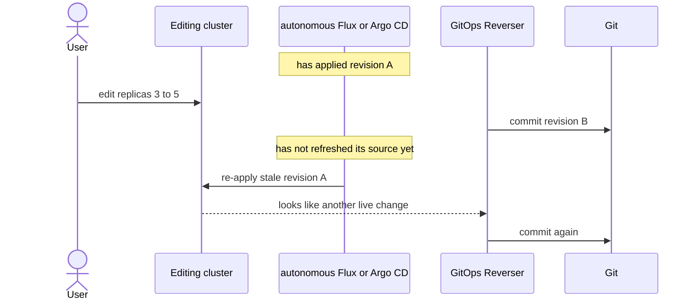
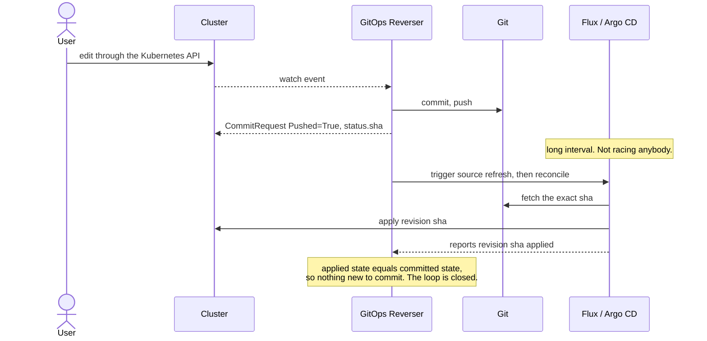
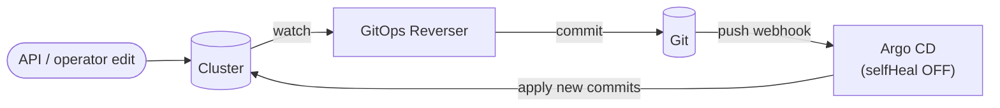

# Bi-Directional Usage Guide

## Summary

GitOps Reverser runs in exactly one direction: **live → Git**. It watches the
cluster and writes what it observes back to a branch.

A *bi-directional* workflow adds the other direction — **Git → cluster** — supplied
by a normal GitOps reconciler (Flux or Argo CD). That is safe on a shared path
**only if the reconciler never autonomously overwrites a live edit before GitOps
Reverser has captured it.** Get that wrong and the two loops fight: stale reverts,
extra commits, possible loops.

The whole thing reduces to one sentence: **the Kubernetes API is the write path,
GitOps Reverser is the publisher, and the reconciler is a *triggered applier* — not
an always-on loop.**

This area is still experimental. The building blocks are proven in e2e against both
Flux and Argo CD, but there is not yet a first-class product surface for it.

## Recommended Modes

Pick the least powerful mode that meets the need.

| Mode | Shape | Best for |
| --- | --- | --- |
| **1. Audit only** | Reverser captures live changes; nothing writes the same path back into the cluster. | audit trails, brownfield discovery, teams not ready for strict GitOps |
| **2. Human in the loop** | User edits live; Reverser commits; a human reviews / promotes later. | hotfix capture, migration from cluster-first ops |
| **3. Split ownership** | Some fields are API-owned, others Git-owned; **never the same field on both loops**. | both GitOps and interactive ops, without shared write ownership |
| **4. Controlled bi-directional** | Reverser commits; the reconciler is triggered deliberately; Reverser waits for that exact revision. | advanced teams with genuinely shared-path workflows |

Modes 1–3 are safe today. Mode 4 is the one this guide is mostly about, because it
is the only one where the *same* resource changes from *both* sides.

## The core problem: causality, not YAML

A GitOps reconciler does not "hydrate" a cluster — it **reconciles** it. Its whole
value is that when live state diverges from Git, it *puts it back*.

In an editing cluster, live state diverging from Git is not drift to be corrected.
**It is the user's edit.** So a reconciler left on its own interval is a hazard:

The failure is a **race window** between the Reverser's commit and the reconciler's
source refresh — not a fundamental incompatibility. Sanitizing metadata noise does
**not** fix it; only controlling *when* the reconciler applies does.

## The model that works: a triggered applier

Treat the reconciler as something you **trigger deliberately** after publishing a
commit, and that applies **that exact commit** — never a stale one on a blind
interval. When the applied revision equals the committed revision, there is nothing
new for the Reverser to capture, and the loop is closed:

GitOps Reverser already exposes the primitive the handshake needs: a `CommitRequest`
reaching `Pushed=True` with `status.sha` and `status.branch`.

Every safe configuration is just **two requirements** met:

1. **No watch-based auto-revert of live drift.** The reconciler must not instantly
   snap a live edit back to Git.
2. **Git → cluster applies the *fresh* commit, on a trigger** — not a stale commit
   on a blind interval.

Flux and Argo CD each meet both requirements. They differ in exactly one place,
which the table below makes explicit.

## Flux and Argo CD, side by side

| Property | Flux | Argo CD | Mitigation |
| --- | --- | --- | --- |
| **Watch-based reconcile guarantee** (auto-reverts a live edit the instant it happens) | **n/a** — Flux has no per-object drift watch | **`selfHeal`** — reverts a live edit in ~1s (measured), watch-driven | **Argo: never enable `selfHeal` on a shared path.** There is no way to make it selective (see below). |
| **Git → cluster trigger** (how the *fresh* commit is applied) | Kustomization interval + source events; `flux reconcile` or a `Receiver` webhook | refresh poll (~2–3 min) + automated sync; a push webhook to `/api/webhook` | Trigger after the commit, or wire the webhook, so it applies the fresh commit — not a stale one. |
| **Stale-replay race window** | yes (interval fires before the source has refreshed) | yes (syncs before the refresh lands) | Same as above: deliberate trigger + wait-for-SHA (Flux), or webhook (Argo). |
| **Metadata stamped on your objects** | `kustomize.toolkit.fluxcd.io/*` labels/annotations | `argocd.argoproj.io/tracking-id` annotation; client-side apply also writes `last-applied-configuration` | **Stripped automatically** by GitOps Reverser, so it never reaches Git. |
| **Acknowledgment signal** | `Kustomization.status.lastAppliedRevision == sha` | `Application.status.sync.revision` / `operationState` | Use it to close the handshake (requirement 2). |
| **SOPS-encrypted Secrets** | native decryption (`spec.decryption.provider: sops`) | needs a Config Management Plugin | **Flux-only** in this repository today. |

The one row that matters most is the first: **Argo CD has a watch-based reconcile
guarantee (`selfHeal`); Flux has none.** For bi-directional it is the enemy, and
the mitigation is blunt — never turn it on for a shared path.

### Flux realization

Requirement 1 is free (no watch-based revert). Requirement 2 is a deliberate
trigger:

- keep the `GitRepository`;
- suspend the `Kustomization` for the shared path (or give it a long interval);
- after the commit: refresh the source, reconcile the `Kustomization`, and wait
  until `status.lastAppliedRevision` equals the committed SHA;
- (or wire the Flux `Receiver` webhook so the source refreshes on push before the
  reconcile).

### Argo CD realization

Two knobs, one per requirement:

- `syncPolicy.automated.selfHeal: false` — requirement 1;
- a push webhook (Gitea/GitHub → `argocd-server /api/webhook`) so Argo applies the
  fresh commit within seconds — requirement 2.

This exact loop — `selfHeal: false` + webhook, one shared field changing from
*both* sides — is exercised end-to-end in the bi-directional corner (the
`selfHeal`-off phase of
[`argocd_bi_directional_e2e_test.go`](../test/e2e/argocd_bi_directional_e2e_test.go)),
alongside its foil: the same field with `selfHeal: true`, where the API edit is
lost and Git history flaps.

**Do not** reach for `ignoreDifferences`, `managedFieldsManagers`, or "just use the
three-way merge" to make `selfHeal` safe. They all work by removing a field from
Argo's comparison — which removes it in *both* directions, so a Git-side change to
that field silently stops applying too. That is [split ownership](#recommended-modes)
(mode 3), a legitimate but *different* mode — not the shared, both-ways behaviour
this guide is about. The full reasoning — including why PreSync hooks and self-heal
timers can't rescue it either — is in
[`design/support-boundary/argocd-bi-directional.md`](design/support-boundary/argocd-bi-directional.md).

## Practical Platform Guidance

If you are evaluating this as a platform engineer:

- prefer audit-only or split-ownership mode first;
- never let a shared resource have two autonomous reconciliation loops;
- make the authoritative write path obvious to operators, and document who may make
  live changes and when;
- keep rollback expectations clear: Git history is useful, but replay timing still
  matters;
- test remote-moved, delete, and controller-restart scenarios before calling the
  workflow production-ready.

Questions to answer before rollout:

- which resources are API-first and which are Git-first?
- who approves live-cluster hotfixes?
- what should happen when the remote branch advances outside GitOps Reverser?
- how will operators detect a stuck or timed-out acknowledgment?
- what metrics and alerts prove the workflow is healthy?

## Practical Engineering Guidance

If you are evaluating this as a Go or controller engineer, focus on:

- idempotency across repeated watch events;
- semantic comparison rather than YAML text comparison;
- sanitization of controller-added operational metadata (both Flux and Argo CD
  stamp it — see the table);
- explicit tracking of pending acknowledgments;
- deterministic handling of "remote moved" conditions;
- timeout, status, and degraded-mode behaviour when the reconciler does not
  acknowledge a revision.

Good implementation boundaries:

- keep reconciler-specific coordination isolated from generic Git write logic;
- expose handshake progress in status instead of only in logs;
- make replay suppression depend on **observed revisions**, not on timing guesses.

## Current Status In This Repository

The foundation already exists:

- reverse writes are optimized for frequent live changes;
- the Git path notices when the tracked branch moved externally;
- e2e coverage exists for a controlled shared-resource scenario against **both**
  Flux and Argo CD — including, for Argo CD, the recommended `selfHeal: false` +
  webhook loop with a field changing from both sides, and its `selfHeal: true`
  foil where the edit is lost;
- known Flux **and** Argo CD operational metadata is sanitized, so tests focus on
  meaningful diffs.

What is not complete yet:

- a stable, well-shaped product story for bi-directional usage;
- a finished first-class product surface for manual Flux acknowledgment;
- a first-class Argo CD surface — today the "`selfHeal` off + webhook" loop is a
  configuration pattern, not a product feature, and it cannot yet tell a *sanctioned*
  bi-directional edit from *unsanctioned* drift (that decision belongs at an
  admission gate — see the design note);
- alignment patterns for reconcilers other than Flux and Argo CD;
- HA support for the controller;
- full production hardening for all shared-ownership edge cases.

## Suggested Rollout Path

Adopt the feature in this order, keeping the simplest workflows as the default:

1. Run GitOps Reverser in audit-only mode.
2. Move to human-in-the-loop hotfix capture.
3. Use split ownership for real environments.
4. Add controlled bi-directional mode only for paths that truly need it.

## References

Exercised behaviour (both live in the opt-in bi-directional e2e corner — the only
place Argo CD is installed; run with `task test-e2e-bi-directional`, browse Argo CD
with `task argocd-ui`):

- [`../test/e2e/flux_bi_directional_e2e_test.go`](../test/e2e/flux_bi_directional_e2e_test.go)
- [`../test/e2e/argocd_bi_directional_e2e_test.go`](../test/e2e/argocd_bi_directional_e2e_test.go)

Design detail:

- [`design/e2e-bi-directional-corner.md`](spec/e2e-bi-directional-corner.md) — the corner
- [`design/support-boundary/argocd-bi-directional.md`](design/support-boundary/argocd-bi-directional.md)
  — why `selfHeal` is opposed to bi-directional
- [`design/gittarget-lifecycle-and-repo-architecture.md`](architecture.md) — controller and repo lifecycle
