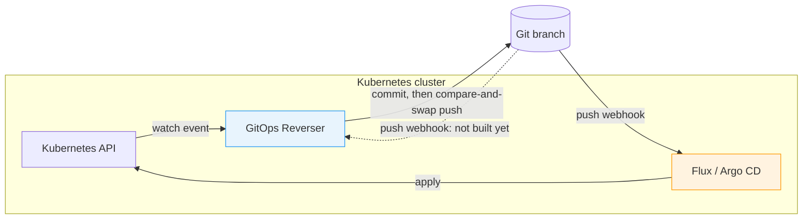
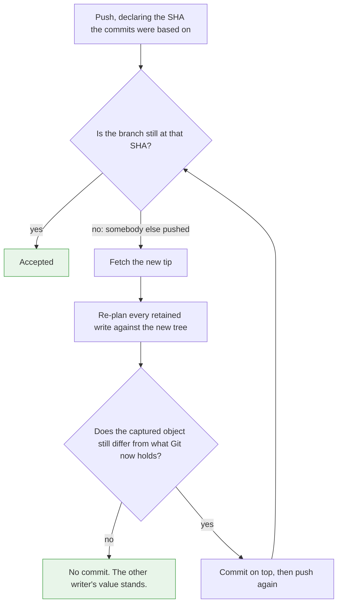
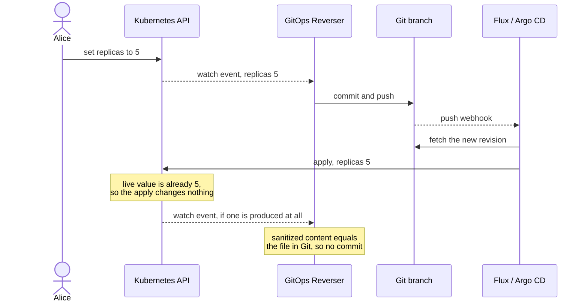

# Bi-directional usage guide

GitOps Reverser publishes live cluster state to Git. Flux or Argo CD applies Git back to the
cluster. Run both and a resource can be changed from either side. This guide covers what that
costs you, how to configure the two reconcilers for it, and which parts are proven by tests.

**The short version.** Point your Git host's push webhook at the reconciler, turn Argo CD's
`selfHeal` off, and treat publishable live state as the input Reverser writes to Git. There is no
merge, no lock, and no timing guarantee. Choose what should happen when an edit cannot be
published: [leave it for intervention or request Git re-application](#choosing-speconrefusal).

**What you are trading.** Round trips to the Git host are the seconds you wait through, so a
publication talks to the remote **twice**: it opens the push, reads where the branch is, and sends
the commits, never reading the branch beforehand. A publication with nothing to change costs one
request; a foreign push costs a handful of extra requests and a recomputation on a checkout
already on disk, and the branch still ends up correct. If your workload is mostly Git-side edits
with occasional live changes, you are using the tool against its grain. The per-operation numbers
are measured, in
[`git-roundtrip-ledger.golden`](../internal/git/testdata/git-roundtrip-ledger.golden).


```mermaid
flowchart LR
    subgraph CLUSTER["Kubernetes cluster"]
        API["Kubernetes API"]
        REV["GitOps Reverser"]
        REC["Flux / Argo CD"]
    end
    GIT[("Git branch")]

    API -->|"watch event"| REV
    REV -->|"commit, then compare-and-swap push"| GIT
    GIT -->|"push webhook"| REC
    REC -->|"apply"| API
    GIT -. "push webhook: not built yet" .-> REV

    style REV fill:#e8f4fd,stroke:#2196f3
    style REC fill:#fff3e0,stroke:#ff9800
```

Both solid legs are configuration you control. The dashed leg does not exist: nothing tells
Reverser that somebody else moved the branch. [Telling Reverser that somebody else
pushed](#telling-reverser-that-somebody-else-pushed) covers what that costs and how to work
around it.

## One queue per branch

Every watched event for a given `GitProvider` and branch lands on one queue owned by one branch
worker. Events are applied in arrival order and never overtake each other, and two `GitTarget`
objects on the same provider and branch share that worker and its ordering.

1. **Commit.** Events collapse into one local commit per author after
   [`spec.commit.window`](configuration.md#the-commit-window-speccommitwindow) of silence,
   `5s` by default. `0s` gives one commit per event.
2. **Push.** Local commits go to the remote at most once every five seconds, as a
   compare-and-swap. The push declares the SHA it expects the branch to be at, and the Git host
   refuses the update if the branch has moved off the commits' base.

That compare-and-swap is what detects a foreign push, and it does so from the remote's ref
advertisement before uploading a single object, on a connection the cycle was making anyway.

**Reverser never polls the remote and holds no timer against it**, so an idle target generates no
Git traffic at all. That is measured rather than approximate, and there is no interval setting
that changes it.

Planning does not read the branch either: the worker plans on the checkout it already has and lets
the compare-and-swap catch a move. The exceptions are a worker that has not yet seen the remote, a
previous write that failed and left the checkout in an unknown state, and a resync, which keeps
reading because it can finish without ever opening a push.

## What happens when somebody else pushed first

Your push is rejected and the worker **replays**: it fetches the new tip, re-plans every retained
write against it, and pushes again. Three attempts, then the writes stay retained for a later try.

Replaying is the cheap half: the re-planning is local and the branch ends up correct either way.
What a rejection costs is the extra conversations with the Git host around it, which is what
[a webhook pointed back at Reverser](#telling-reverser-that-somebody-else-pushed) would remove.


```mermaid
flowchart TD
    PUSH["Push, declaring the SHA the commits were based on"] --> MOVED{"Is the branch still at that SHA?"}
    MOVED -->|yes| DONE["Accepted"]
    MOVED -->|"no: somebody else pushed"| FETCH["Fetch the new tip"]
    FETCH --> REPLAN["Re-plan every retained write against the new tree"]
    REPLAN --> DIFF{"Does the captured object still differ from what Git now holds?"}
    DIFF -->|no| NOOP["No commit. The other writer's value stands."]
    DIFF -->|yes| COMMIT["Commit on top, then push again"]
    COMMIT --> MOVED

    style DONE fill:#e8f5e9,stroke:#43a047
    style NOOP fill:#e8f5e9,stroke:#43a047
```

Replay re-plans, it does not rebase a diff. Each retained write still carries the object as the
watch captured it, and writing that object onto the new tree has one of two outcomes:

- **No change, so no commit.** The file in Git already says what the captured object says,
  because whoever pushed made the same change. Git had it first and that is the end of it.
- **A change, committed on top.** The captured object is written over the other writer's value,
  and the branch ends at the API side's value.

There is no third outcome, and there is no merge: a watch event carries the object's whole state,
with no retained baseline that would say which fields changed on each side. The
[deferred merge investigation](future/git-api-three-way-comparison.md#what-three-way-merge-means-here)
defines the comparison that would take.

### What a write does to the file

The writer edits fields in place within the existing document, so what matters is which fields
change rather than which files. For a plain manifest:

| In the file | What a replay does to it |
| --- | --- |
| A field the live object also carries | Set to the live value |
| A field in Git that the live object does not have | **Removed** |
| Comments, key order, other documents in the file | Preserved |
| An edit that cannot be placed safely | Refused, and the file is left untouched |

In a kustomize layout the live object is the rendered result rather than the contents of any one
file, so the edit is projected back through the build first and only the fields that document is
responsible for are touched. An edit the projection cannot place is refused rather than guessed
at, which is why the last row exists.

**The consequence to plan around.** If Alice changes `replicas` through the API while Bob changes
`image` in Git on the same object, replaying Alice's captured object writes her `replicas` and
also the `image` she was looking at. Bob's change to a different field of the same object does
not survive, and a field Bob added that the cluster never had is removed outright. Separate
objects are independent of each other. Separate fields of one object are not.

## There are no timing guarantees

Committing and pushing takes on the order of a second at best, and the Kubernetes API accepts a
great many changes in a second. Nothing paces the two against each other and nothing reserves a
window, so treat live editing as a different way of making changes rather than a faster
`git push`:

- You make a change and then observe that it arrived. You do not save and receive a confirmation.
- Intermediate values may never reach Git. Two edits inside one commit window produce one commit
  holding the later value.
- Git history records the states the worker captured and published. Expect gaps between them.

When a specific change has to be confirmed in Git, use a
[`CommitRequest`](configuration.md#commitrequest). `Pushed=True` with `status.sha` and
`status.branch` names the commit it produced.

## Why the loop stops

The obvious fear is a feedback loop: Reverser commits, the reconciler applies, the apply produces
a watch event, Reverser commits again. With no intervening edits or admission changes, it settles
instead.


```mermaid
sequenceDiagram
    actor Alice
    participant API as Kubernetes API
    participant Rev as GitOps Reverser
    participant Git as Git branch
    participant Rec as Flux / Argo CD

    Alice->>API: set replicas to 5
    API-->>Rev: watch event, replicas 5
    Rev->>Git: commit and push
    Git-->>Rec: push webhook
    Rec->>Git: fetch the new revision
    Rec->>API: apply, replicas 5
    Note over API: live value is already 5,<br/>so the apply changes nothing
    API-->>Rev: watch event, if one is produced at all
    Note over Rev: sanitized content equals<br/>the file in Git, so no commit
```

When the reconciler applies a commit Reverser wrote, the live object already holds those values,
because they were read from that object in the first place. The apply changes nothing, the event
it produces carries content identical to the file already in Git, and no commit is made. In
general: **applying a resource that already matches does not produce a change.** What can break
that reasoning is controller bookkeeping.

## Keep controller bookkeeping out of Git

Argo CD stamps `argocd.argoproj.io/tracking-id` on every non-CRD object it applies, Flux stamps
`kustomize.toolkit.fluxcd.io/` labels and annotations, and a client-side apply writes
`kubectl.kubernetes.io/last-applied-configuration`. None of it is user intent. If it reached Git
the sanitized live object would stop matching the committed file, and every reconciler sync would
produce a commit.

Reverser strips all of it before writing, along with `argocd.argoproj.io/installation-id`,
`kro.run/`, `applyset.kubernetes.io/`, and `kcp.io/cluster`. The rules and the reasoning for each
are in [`internal/sanitize/types.go`](../internal/sanitize/types.go). Under
`argocd.argoproj.io/` only the exact tracking keys go: siblings such as `sync-wave`,
`sync-options`, and `hook` are user intent that belongs in Git.

**Leave Argo CD on its default `annotation` resource tracking for Reverser-managed paths.** The
`label` and `annotation+label` methods stamp `app.kubernetes.io/instance`, which is
indistinguishable from the standard recommended label that Helm and Kustomize set for application
reasons. Reverser therefore does not strip it, and label tracking would put Argo's bookkeeping
into your commits.

## Configure Argo CD

`selfHeal` is the setting that decides what happens to a live edit.

| `selfHeal` | What happens to a live edit | Use when |
| --- | --- | --- |
| `true` | Argo reverts it, in about a second in our e2e corner, usually before Reverser can publish. The edit is lost and Git records a two-commit flap. | The path is Git-owned and drift is an error |
| `false` | It survives, is captured to Git, and is applied onward from there. Both directions work on the same field. | Anything edited through the API |

Both rows are measured outcomes. Neither is an ordering guarantee: self-heal is watch-driven and the first
revert of fresh drift has zero backoff, while Argo notices a new Git revision only on its timed
refresh (`timeout.reconciliation`, 120s plus up to 60s of jitter) or when a webhook tells it. And
`selfHeal: false` only suppresses repeating a sync of the same revision and parameters, so a new
revision or a manual sync still applies Git values over an unpublished API edit.

There is no knob that delays that first revert.
[Why `selfHeal` cannot be made selective](design/support-boundary/argocd-bi-directional.md) walks
the code paths, including the options that look like they would work, and the
[apply and field-ignore source review](facts/gitops-apply-and-field-ignore.md) separates Argo's
scheduling, comparison, and write paths.

```yaml
spec:
  syncPolicy:
    automated:
      selfHeal: false
      prune: true
```

Use `prune: true` only when a deletion in Git should delete the live object. Then configure the
[Argo CD webhook](https://argo-cd.readthedocs.io/en/stable/operator-manual/webhook/) on your Git
host, pointing at `https://<argocd-server>/api/webhook` with a shared secret. In the e2e corner
that path drives a sync about four seconds after the push. Without it you wait for the timed
refresh. A webhook only requests a refresh: an apply follows only where a sync is permitted, so it
does not substitute for automated sync.

### The split-ownership alternative

`ignoreDifferences` on a field, with `RespectIgnoreDifferences=true`, keeps `selfHeal: true`
everywhere else and hands that one field to the API. Its differences alone do not make the
Application `OutOfSync`, and the respect option copies the live value into the apply target, so an
ordinary sync preserves it. Without that option, a later sync can still write the field from Git.

The cost is that the field stops being Git-driven on an existing object: Git seeds it at creation,
but later Git edits to it do not reach the object while the ignore is active. It buys authority for
one named field, and protects no other field from Reverser's whole-object replay. The e2e corner
checks that an API edit survives and is published back to Git; it does not test a later Git edit to
the ignored field.

## Configure Flux

Flux has no `selfHeal` toggle: kustomize-controller corrects drift on every reconcile, so a live
edit survives until the next apply of a revision that still carries the old value. The two
settings that matter are therefore the apply interval and how quickly a push reaches Flux.

```yaml
# GitRepository: short, so a missed webhook becomes a delay rather than a stall.
spec:
  interval: 1m
---
# Kustomization on the shared path: long, so the timer is not what reverts live edits.
spec:
  interval: 24h
  retryInterval: 1m
  suspend: false
```

Configure a [Flux `Receiver`](https://fluxcd.io/flux/guides/webhook-receivers/) against the
**`GitRepository`**, not the Kustomization. Source-controller fetches Git and publishes a new
artifact revision, which wakes the dependent Kustomizations. A Receiver aimed at the Kustomization
can re-apply the artifact Flux already has cached, which is the old content.

A long interval delays periodic correction. It reserves nothing: a new source revision, a
configuration change, a retry, or a controller restart all trigger an apply sooner. Keep the
Kustomization **unsuspended**, because suspension blocks source-triggered applies as well and a
manual reconcile request does not bypass it. To trigger the source and the apply together:

```bash
flux reconcile kustomization editing -n flux-system --with-source
```

When upgrading a chart whose pin is declared in Git, reconcile the owning `Kustomization` first
so it applies the new `HelmRelease` and source configuration. Then reconcile the `HelmRelease` if
needed. `flux reconcile helmrelease --with-source` refreshes its configured chart source; it does
not first apply the Git manifests that change that configuration. A successful reconcile can
therefore still use the old pin.

Flux's equivalent of split ownership is `Kustomization.spec.ignore`, added in kustomize-controller
`v1.9.0`, with the same trade as Argo's: selected live fields survive later applies, Git seeds them
at creation, later Git edits to them do not land, and Reverser still captures them back into Git.
Our e2e installs Flux `2.9.5` but no spec exercises `spec.ignore`, so it is upstream behavior we
have read in the source and have no test of our own behind; the
[source review](facts/gitops-apply-and-field-ignore.md) has the code paths.

## Telling Reverser that somebody else pushed

Everything above points a webhook from the Git host at the reconciler. The other direction does
not exist yet, so what a moved branch costs depends on what the target is doing:

- **Actively writing:** nothing breaks. The compare-and-swap catches the move and replay handles
  it. It is only slower than it needs to be, because the move is discovered by a push that was
  always going to fail.
- **Refused:** it recovers on its own. While `GitPathAccepted` is `False` the target is not
  converged, so it requeues every 10 seconds and each pass forces a re-read. Fix an unsupported
  folder in Git and the condition clears within about ten seconds.
- **Healthy and idle:** it does not. A converged target requeues every 5 minutes and those passes
  publish status without touching Git, so it holds its previous answer about the folder until it
  next writes.

Force a re-read of an idle target:

```bash
kubectl annotate gittarget editing -n gitops-reverser \
  reconcile.configbutler.ai/requestedAt="$(date +%s)" --overwrite
```

A receiver that does this automatically is designed in
[inbound push notification](design/push-notification-and-reconcile-trigger.md); the other half of
that design, removing the head-of-cycle fetch, has shipped. Its request shape is
[§8.3, the wire contract](design/push-notification-and-reconcile-trigger.md#83-the-wire-contract-for-whoever-calls-it):
one signed `POST /git-push/<route>` carrying the repository, the branch, and the SHA the branch now
points at. It deliberately does not take a Git host's native payload, so the mapping from your
host's webhook belongs in the host's own configuration or in a relay.

One rule matters if you build anything similar yourself: **a notification that a branch moved must
not trigger a fresh cluster snapshot.** Our handler and the reconciler's both fire on the same
push, and ours has less work to do, so it would reliably publish the pre-push cluster state over
the incoming change before the reconciler ever applied it. That is also why the design does not
wire a webhook to the annotation above, which asks for exactly such a resync. A push tells you
about Git; it says nothing about the cluster.

## When a write is refused or a push fails

A live edit can succeed while its publication does not. The cluster holds the change and Git does
not, and **a refused write writes no file, so nothing reaches the reconciler through the ordinary
path**. Watch push failures and the target's write-acceptance conditions: a successful Kubernetes
edit confirms the API write and nothing beyond it.

Retained writes are held in worker memory. They do not survive a restart, and an edit that failed
before becoming a pending write is gone from Reverser's side. Recovery is a resync, which derives
state from the cluster as it exists at that moment, so it cannot reproduce an intermediate value
that has since been overwritten.

### Choosing `spec.onRefusal`

**Enable `PushEmptyCommit` when restoring Git state takes priority over keeping unpublished live
edits.** It is useful on a dedicated demo or editing branch where users accept that trade and an
active GitOps reconciler applies the branch. Keep the default `Ignore` when live edits need human
review before being discarded, or when unrelated workloads share the branch and their owners have
not agreed to an extra apply.

| Policy | Response to a refused edit | Operator's trade |
| --- | --- | --- |
| `Ignore` (default) | Report the refusal without moving the branch | Leave recovery to a human or a later apply |
| `PushEmptyCommit` | For eligible edits, publish an empty commit requesting Git re-application | Accept an extra apply across the branch, including over unpublished edits |

[`spec.onRefusal: PushEmptyCommit`](configuration.md#reverting-a-refused-edit-speconrefusal)
changes no file. The new revision gives Flux or Argo CD a reason to apply Git again. Restoration
depends on the reconciler observing the revision and successfully applying it. GitOps Reverser
does not write the old value back to the Kubernetes API itself.

Eligibility is narrow: the folder must be accepted, the refused edit must concern an existing
document, and the write must remove no document. Invalid or unsupported folders, new objects, and
removals do not trigger it. A standing refusal is deduplicated; rechecks do not keep producing empty
commits for the same observation. A failed push is a separate failure and this policy does not
repair Git connectivity.

The apply still follows the reconciler's configuration. Flux must be unsuspended; Argo CD needs
automated sync and an `OutOfSync` Application. An Argo CD Application using
`argocd.argoproj.io/manifest-generate-paths` can skip the empty revision because no relevant file
changed. Fields protected by the split-ownership settings above remain protected. A webhook
reduces discovery delay but gives no completion guarantee.

### How a refused edit can undo an allowed one

The setting belongs to a `GitTarget`, but the new revision can wake every consumer of its branch.
Separate folders or targets on that branch do not isolate this effect. One possible ordering is:

1. Alice makes an allowed live edit. It is still in an open commit window, so Git has the old value.
2. Bob makes a refused edit whose window closes first. Reverser pushes an empty commit for it.
3. The reconciler applies that revision, restoring Git's values over both live edits.
4. Reverser observes the restoration. Alice's earlier value may never reach Git.

Alice and Bob can be the same person, and the edits can affect different objects. The empty commit
does not erase accepted commits already included in the published revision; the risk is live
state missing from the revision being applied. The same race exists whenever a new Git revision
arrives. `PushEmptyCommit` adds a trigger at the moment a publication was refused. Shortening the
commit window reduces exposure but does not reserve time against an apply. An extra apply can also
advance unrelated work, including pruning already requested in Git.

### A restored value does not prove the target recovered

`Ignore` still reports `GitPathAccepted=False`, `Stalled=True`, and `Ready=False`. The target keeps
rechecking, roughly every ten seconds; `Stalled` does not mean the controller has stopped running.
Normal publication can remain blocked, and changing `onRefusal` does not bypass acceptance or
render-fidelity checks.

An empty commit neither clears those conditions nor makes an unrepresentable edit writable. A
successful resync covering the refused scope must establish acceptance again. Re-applying Git can
remove the offending live difference, but other differences can remain: API defaults on a
Deployment inherited from a read-only base can still have no writable destination in the overlay.

Treat recovery as two observations: the live resource has the intended value, and the `GitTarget`
returns to `Ready=True`. If it remains refused, use the condition's reason to correct the folder,
the live state, or what the target watches. Leaving the target stalled indefinitely is an
unresolved publication failure under either policy.

## What the tests prove

The bi-directional corner runs against deployed Flux and Argo CD. Its timing and event-count
assertions describe those scenarios; they do not guarantee the ordering of concurrent writers.

| Covered | Where |
| --- | --- |
| Argo bookkeeping never reaches Git, asserted as zero commits during a sync | [Argo phase 1](../test/e2e/argocd_bi_directional_e2e_test.go) |
| `selfHeal: true` loses the API edit, and the flap is exactly two commits | Argo phase 2 |
| `ignoreDifferences` keeps the edit and holds the Application `Synced` | Argo phase 3 |
| `selfHeal: false` keeps the API edit and still applies a Git-side change to the same field | Argo phase 4 |
| Git to cluster to Git round trip settles without a commit loop | [Flux](../test/e2e/flux_bi_directional_e2e_test.go) |
| A SOPS-encrypted Secret round-trips without a reverse commit | Flux |
| A Git revert removes the live object and the committed file | Flux |
| Waking only the `GitRepository` makes the Kustomization apply a new revision by itself, reverting live drift, with an **empty** commit as that revision | Flux |
| An eligible refusal produces an empty commit; unchanged refusals settle, and a new refused value produces another commit | [Refusal action](../test/e2e/refusal_empty_commit_e2e_test.go) |

The refusal-action spec and the Flux spec prove the two halves separately. They do not exercise an
actual refusal through reconciler restoration to `GitTarget` recovery in one scenario, or an
allowed edit racing the empty commit's apply.

Two other gaps worth knowing. The **Flux spec drives reconciliation manually** with 30m intervals, so
only the Argo webhook is exercised; the mechanism a `Receiver` depends on is covered by the Flux
test that wakes the `GitRepository` alone and lets the Kustomization apply on its own. And **no
spec tests simultaneous writes to one field from both sides**, because the outcome depends on
arrival order the corner does not control. The replay mechanism is covered; a conflict policy is
not, because there is not one.

Run `task test-e2e-bi-directional` for the corner, which is also a CI job. `task test-e2e`
excludes the corner and includes the refusal-action spec. `task argocd-ui` opens the installed
Argo CD UI. The
[corner specification](spec/e2e-bi-directional-corner.md) describes the setup and the coverage
still missing.
