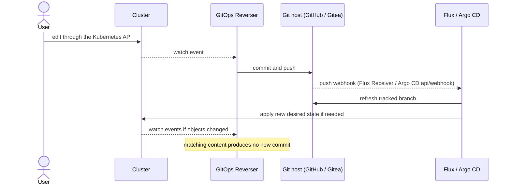
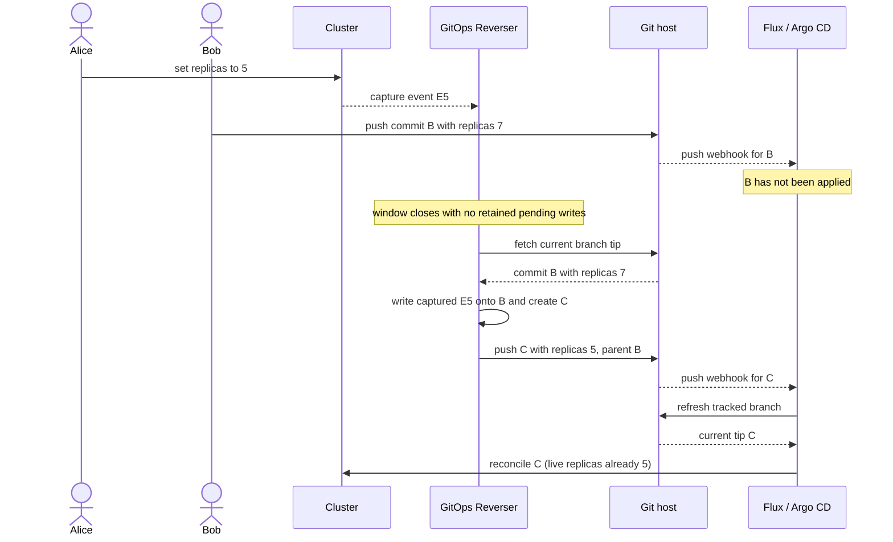
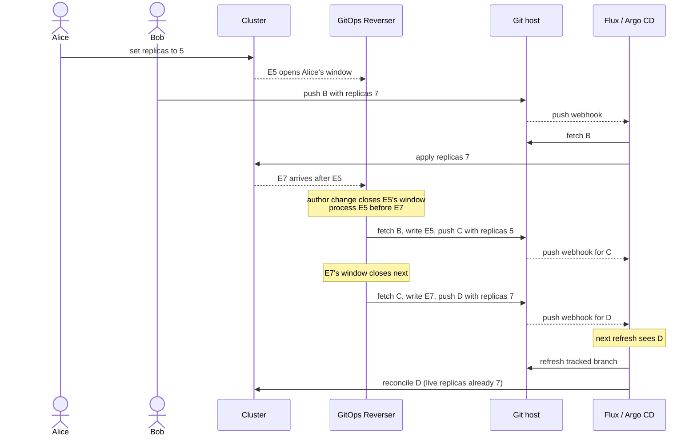

# Bi-directional usage guide

GitOps Reverser publishes **live → Git**. Flux or Argo CD supplies **Git → cluster**.
Together, they let operators edit resources through the Kubernetes API and through Git.

**Whether that is safe depends on who owns each field.** Give every field a single
writer and the two directions never compete. Let API edits and Git edits reach the same
field and nothing in this system arbitrates between them: a push webhook shortens the
window in which a reconciler applies stale desired state, but it only notifies, and it
reserves nothing. Shared-field operation is therefore experimental, and it needs an
operating procedure that people follow.

If every field has one writer, read [Recommended modes](#recommended-modes) and
[Configure the reconciler](#configure-the-reconciler), then stop. The rest of the guide
is about shared fields: the [handoff](#operate-a-shared-field) that makes them workable,
and the [mechanics](#when-two-people-change-things-at-almost-the-same-time) that decide
which value survives when two writes overlap.

## Recommended modes

Choose the ownership model before configuring reconciliation.

| Mode | Ownership | Typical use |
| --- | --- | --- |
| **1. Audit only** | Reverser captures live changes; no reconciler writes the captured path back. | Audit trails and discovery |
| **2. Human in the loop** | Reverser captures changes; a human reviews or promotes them. | Hotfix capture and migration |
| **3. Split ownership** | Each field has one writer; API and Git workflows own different fields. | Interactive operations alongside GitOps |
| **4. Controlled bi-directional** | API and Git workflows share fields and coordinate when they write. | Experimental editing environments |

Modes 1–3 avoid competing writes when their ownership boundaries are enforced.
The rest of this guide focuses on mode 4.

## How the webhook loop works

**A configured Git push webhook removes the need for a direct trigger from Reverser
after each successful push.** GitHub or Gitea sends the notification to Flux or Argo CD:


```mermaid
sequenceDiagram
    actor User
    participant K8s as Cluster
    participant Rev as GitOps Reverser
    participant Git as Git host (GitHub / Gitea)
    participant Recon as Flux / Argo CD

    User->>K8s: edit through the Kubernetes API
    K8s-->>Rev: watch event
    Rev->>Git: commit and push
    Git-->>Recon: push webhook (Flux Receiver / Argo CD api/webhook)
    Recon->>Git: refresh tracked branch
    Recon->>K8s: apply new desired state if needed
    K8s-->>Rev: watch events if objects changed
    Note over Rev: matching content produces no new commit
```

Flux's `Receiver` requests a source refresh; the new artifact revision triggers dependent
`Kustomization` objects. Argo CD's webhook requests an application refresh; automated sync
applies changed desired state. Reverser itself neither triggers these controllers nor waits
for their applied revisions.

The webhook carries a notification, not a lock or an apply acknowledgment. A reconciler
can fetch a later branch tip when pushes arrive close together. It need not apply each
intermediate commit, and it can already be applying another revision when an API edit lands.

## Configure the reconciler

| Setting | Flux Kustomization | Argo CD Application |
| --- | --- | --- |
| Push notification | `Receiver` targets the `GitRepository` | Git host calls `/api/webhook` |
| Shared-field operation | Unsuspended, long apply interval | Automated sync enabled, `selfHeal: false` |
| Remaining overwrite triggers | Timer, source/configuration changes, retries, restart, explicit reconcile | New desired revision, application changes, retries, explicit sync |
| Convergence check | `Ready=True` and `status.lastAppliedRevision` | `Synced` and `status.sync.revision` |

### Flux

Configure a [Flux webhook Receiver](https://fluxcd.io/flux/guides/webhook-receivers/)
for the **`GitRepository`**. Source-controller fetches Git before the artifact revision
change wakes dependent Kustomizations. Targeting only the Kustomization could apply the
source artifact that Flux already has cached.

For a shared editing path, start with **`Kustomization.spec.interval: 24h`** and a
shorter **`GitRepository.spec.interval: 1m`** as a fallback for missed webhooks:

```yaml
# Fields on the GitRepository:
spec:
  interval: 1m
---
# Fields on the Kustomization for the shared editing path:
spec:
  interval: 24h
  retryInterval: 1m
  timeout: 2m
  suspend: false
```

These are pilot settings. The long apply interval reduces periodic correction of live
edits, while the source interval bounds the usual polling delay after a missed webhook.
New source revisions still trigger applies immediately. Failures retry at `retryInterval`,
which can also interrupt an editing session.

**Flux has no separate maximum interval in hours in the current Kustomization API.**
The [interval implementation](https://github.com/fluxcd/kustomize-controller/blob/main/api/v1/kustomization_types.go)
uses a Go duration without an additional hours-based cap. `24h` is an operating recommendation.
Controller-runtime's [10-hour cache resync](https://github.com/kubernetes-sigs/controller-runtime/blob/main/pkg/cache/cache.go)
is not a hard apply limit: Flux's
[watch predicates](https://github.com/fluxcd/kustomize-controller/blob/main/internal/controller/kustomization_manager.go)
filter unchanged generation/request tokens and unchanged source revisions.

An active Kustomization still reconciles periodically, and source changes, configuration
changes, retries, or controller restarts can cause earlier applies. A long interval does
not reserve an editing window. See the
[Flux reconciliation contract](https://fluxcd.io/flux/components/kustomize/kustomizations/#interval).

Keep the Kustomization **unsuspended** for the automatic webhook loop. Suspension blocks
source-triggered applies too. A workflow that suspends it must explicitly resume it after
publishing, wait for convergence, and suspend it again before accepting another edit.
A manual reconcile request does not bypass suspension.

For an unsuspended path, a manual source-first trigger is:

```bash
flux reconcile kustomization editing -n flux-system --with-source
```

### Argo CD

Enable automated sync and disable self-heal on the shared path:

```yaml
spec:
  syncPolicy:
    automated:
      enabled: true
      selfHeal: false
      prune: true
```

Use `prune: true` only when Git deletions should delete live objects. Configure the
Git host's [Argo CD webhook](https://argo-cd.readthedocs.io/en/stable/operator-manual/webhook/)
to `https://<argocd-server>/api/webhook`, with a shared secret. A refresh can lead to an
apply only when a sync is permitted; configuring a webhook does not enable automated sync.

With self-heal off, live drift alone does not trigger another automated sync after a
successful sync of the same revision and parameters. Polling still discovers new Git
commits without a webhook; the default period is `120s` plus up to `60s` jitter. See
[automated sync semantics](https://argo-cd.readthedocs.io/en/stable/user-guide/auto_sync/).

**`selfHeal: false` permits live editing; it does not freeze deployments.** A new commit,
a changed application parameter, or an explicit sync can still overwrite an unpublished
edit. A change to another source in a multi-source application can also trigger a sync.

For split ownership, `ignoreDifferences` excludes fields from drift comparison. It does
not alone protect them during a sync triggered for another reason.
[`RespectIgnoreDifferences=true`](https://argo-cd.readthedocs.io/en/stable/user-guide/sync-options/#respect-ignore-differences-configs)
also preserves the live value during sync for existing resources. Those fields become
API-owned, so this setting does not suit fields that Git must also drive.

[Why `selfHeal` cannot be made selective](design/support-boundary/argocd-bi-directional.md)
records the remaining alternatives, including the ones that look like they would work.

## Operate a shared field

For shared fields, establish a handoff between API editing and Git deployments:

1. Keep conflicting Git deployments and manual reconciles out of the editing session.
   A webhook or a long interval alone does not enforce this rule.
2. Let API edits reach the remote branch and check for refused writes or push failures.
3. Have the Git-side writer fetch that updated branch before preparing a deployment.
4. Apply the intended revision, confirm convergence, and then reopen API editing.

This is an operating procedure, held up by the people and pipelines that follow it.
Reverser implements no edit lock and reserves no transaction when a `CommitRequest` is
submitted. For unattended concurrent operation, prefer split ownership or separate
reconciliation scopes. Use Kubernetes preconditions for competing API editors and normal
Git review for competing Git authors. Treat simultaneous API and Git writes to shared
fields as a case that requires an explicit conflict policy.

## When two people change things at almost the same time

**Reverser serializes its writes through one worker per `GitProvider` and branch.** The
key includes the provider's namespace and name. Targets using that same key share the
worker. Accepted queue entries are processed in order, and retained writes are replayed
in order. Commit-window coalescing can replace an earlier snapshot before it is committed.
See [`worker_manager.go`](../internal/git/worker_manager.go).

For a specified order of events, window boundaries, Git updates, and applies, the outcomes
below follow from that sequence. Bob's direct Git push and Argo CD's fetch/apply run
outside Reverser's queue. Knowing whose push reached Git first does not also establish
when Argo CD applied it or where the resulting watch event sits in the worker's queue.
There is no shared transaction spanning those operations.

The timelines use one notation throughout. Alice edits through the Kubernetes API and Bob
pushes to Git. `E5` is a captured watch event carrying `replicas: 5`, and `B`, `C`, and
`D` are commits on the tracked branch, named in the order they are created.

| Concurrent actions | What handles the collision | What remains unprotected |
| --- | --- | --- |
| Two API edits to one object | Kubernetes update preconditions and field ownership | Unconditional patches can overwrite the same field |
| Two API edits to different objects | Independent API writes; Reverser's branch worker serializes its commits | No atomic transaction across the objects |
| Two pushes to one Git branch | Git branch update checks; Reverser retries its own rejected push | Conflicting application intent still needs a decision |
| One API edit and one Git deployment | Each side has its own local checks | No ordering barrier prevents the deployment from overwriting the live edit |

### Two people edit through the Kubernetes API

Alice and Bob both read `replicas: 3`. Alice requests `5`; Bob requests `7`.

- If both submit updates with the resource version they read, Alice's accepted update
  changes that version. Bob's stale update gets `409 Conflict`; he must read again and
  decide whether to overwrite Alice's value.
- If both submit unconditional patches to `spec.replicas`, both can succeed. If Bob's
  patch is accepted last, the live value is `7`, until another writer changes it.
- Patches to different fields can preserve both edits. Replacing a list or parent object
  can overwrite another person's change.

Use `resourceVersion` preconditions or conditional JSON Patch when the user should decide
whether to overwrite a concurrent edit. These checks apply within Kubernetes. See
[Kubernetes update semantics](https://kubernetes.io/docs/reference/using-api/api-concepts/#updates-to-existing-resources).
[Server-side apply](https://kubernetes.io/docs/reference/using-api/server-side-apply/#conflicts)
adds field-ownership conflicts between managers, but forced ownership changes can overwrite
values. It does not coordinate publishing to Git.

Reverser observes accepted live state. A request rejected by Kubernetes does not become
a state change to publish. Separate objects can be captured independently; editing two
objects together does not make their API updates or their eventual applies atomic.

### What appears in Git history

**Two accepted API edits do not necessarily produce two commits.**
[`spec.commit.window`](configuration.md#the-commit-window-speccommitwindow) defaults to a
rolling `5s` silence window. Within one window, Reverser keeps the latest event for each
resource path. If `replicas: 5` is followed by `replicas: 7` in that window, the commit can
contain only `7`.

A window contains one target, author identity, and attribution outcome. A change to any
of those closes it. When attribution identifies Alice and Bob separately, their changes
split windows. Shared credentials or events without distinct attribution can place both
people's changes in the same window. Git history therefore is not a complete record of
every accepted API write.

Setting `window: 0s` requests per-event local commits in normal operation. It does not
make each push immediate: the branch worker has a separate push cooldown. No-op writes
need no commit, and replay after a moved remote can change unpublished commit SHAs.
Neither a shorter window nor more commits creates a lock against Flux or Argo CD.

The implementation is in [`open_window.go`](../internal/git/open_window.go); the
[commit-window specification](spec/commit-window-refactor.md) defines the flush rules.

### The states between an edit and an apply

**A captured event, a local commit, a published commit, and an applied revision are
different states.** The ordinary watch-driven path goes through these stages:

| Stage | State held by Reverser or the reconciler | Timing or boundary |
| --- | --- | --- |
| Observed and queued | A snapshot of an accepted API change | Watch delivery, attribution, and worker availability |
| Open commit window | Latest snapshot per resource path in this window | Default `5s` of silence, or an earlier flush boundary |
| Local commit | Captured state written onto the worker's Git checkout | Successful planning and commit creation |
| Waiting to push | Ordered, retained pending writes and local commits | Remaining push cooldown |
| Push or replay | Conditional branch update; rebuild on a moved remote | Successful push, refusal, or exhausted attempts |
| Published | New remote branch tip | Successful branch update |
| Source refreshed | Flux artifact or Argo CD's selected desired revision | Git webhook or source polling |
| Applied | Reconciler's selected revision applied to the cluster | Permitted sync or reconciliation |

At the start of a publication cycle, when there are no retained pending writes, Reverser
**fetches the remote tip before writing the captured state**. Additional windows finalized
while writes remain unpublished build on that local history without fetching each time.
If a competing push moves the remote, Reverser fetches again and replays all retained
writes in order. A forced target recheck can also refresh and replay pending writes.

Replay uses the captured object. It does not reread the object's current live value or
compare the event's time with the Git commit's time to select a winner. A later pending
write to the same field can supersede an earlier one within the rebuilt history.

The timers have different meanings:

- The commit window is a rolling silence timer. Each compatible event restarts it.
  Continuing traffic can extend a window beyond five seconds; identity changes, buffer
  limits, and explicit save requests can close it earlier.
- The push cooldown is a minimum `5s` between successful pushes for one branch worker.
  The first push, or a push after that cooldown has elapsed, starts immediately after
  committing. Otherwise it waits only for the remaining cooldown. Several local commits
  can travel in one push.
- Webhook delivery, source refresh, and apply have their own queues and retry schedules.
  There is no fixed end-to-end cadence such as “five seconds to commit, then five to push.”

The worker's timers start after event delivery and attribution; those earlier steps and
queued work add latency between the API edit and publication.

Each branch worker processes Git operations serially. Watch events arriving during a
fetch, commit, or push can queue, but cannot alter the pending batch while it is being
replayed. The worker processes them afterward. A successful push clears the published
pending writes; it does not establish that the event queue or another open window is empty.

These boundaries are implemented in [`branch_worker.go`](../internal/git/branch_worker.go)
and [`commit_executor.go`](../internal/git/commit_executor.go).

### Two writers push to Git

For ordinary human Git clients, a competing push can make the local branch stop being a
fast-forward of the remote. The rejected writer fetches and integrates the new commits
before retrying. Git can merge independent changes, but conflicting edits to one field
require a choice. See [Git push behavior](https://git-scm.com/docs/git-push).

Reverser handles its own competing push as follows:

1. It attempts a branch update conditional on the remote tip it started from.
2. If the branch moved, it fetches the new tip and rebuilds unpublished commits from
   retained pending writes on top of that tip.
3. It retries the push. If replay finds the desired content already present, that write
   can become a no-op. Failed pushes retain pending writes for a later retry.

This preserves the other writer's commits in branch history. It **does not guarantee
that both writers' field values survive in the final manifests**. Replaying a captured
live object can supersede a Git-side change to that object. Reverser does not ask a
human to resolve every such collision as a textual Git merge conflict.

Different fields of the same object also need care. If Alice changes replicas in the
cluster while Bob updates an image in Git, Alice's captured object can still contain the
old image. Replaying that state against Bob's revision can replace his image value.
Supported-layout and render checks can refuse a write, but they do not implement a general
merge of two people's intentions.

See [`plan_flush.go`](../internal/git/plan_flush.go) for planning writes from captured objects.

### Timeline: a captured live value wins publication

**Within a successful publish, a retained live snapshot can overwrite a newer Git-side
value because Reverser writes it after fetching that Git revision.** Suppose both sides
start at `replicas: 3`. Alice's event contains `5`; Bob subsequently pushes `7`. Assume
the write is supported, no later event replaces Alice's snapshot, and the reconciler
has not yet applied Bob's revision:


```mermaid
sequenceDiagram
    actor Alice
    actor Bob
    participant K8s as Cluster
    participant Rev as GitOps Reverser
    participant Git as Git host
    participant Recon as Flux / Argo CD

    Alice->>K8s: set replicas to 5
    K8s-->>Rev: capture event E5
    Bob->>Git: push commit B with replicas 7
    Git-->>Recon: push webhook for B
    Note over Recon: B has not been applied
    Note over Rev: window closes with no retained pending writes
    Rev->>Git: fetch current branch tip
    Git-->>Rev: commit B with replicas 7
    Rev->>Rev: write captured E5 onto B and create C
    Rev->>Git: push C with replicas 5, parent B
    Git-->>Recon: push webhook for C
    Recon->>Git: refresh tracked branch
    Git-->>Recon: current tip C
    Recon->>K8s: reconcile C (live replicas already 5)
```

The published history is `B (7) → C (5)`. Bob's commit remains in history, but Alice's
older snapshot supplies the value at the new tip. The reconciler can skip applying `B`.
Reverser's fetch and the reconciler's source fetch are independent operations; neither
waits for the other to finish.

The same outcome is possible if Bob pushes after Reverser's initial fetch: the conditional
push rejects the stale base, then Reverser fetches `B`, replays `E5`, and retries.
For this single retained edit, the boundaries are:

| When Bob's `7` reaches the branch | Reverser's response | Tip after the successful publication described |
| --- | --- | --- |
| Before Reverser's initial fetch | Write `E5` onto Bob's revision | Reverser's `5` |
| After that fetch, before Reverser's branch update | Fetch and replay `E5` after a rejected push | Reverser's `5` |
| After Reverser's successful push | Bob can push a new commit based on the updated branch | Bob's `7` |

The final row requires Bob to integrate the new branch tip; an ordinary stale push can
be rejected. Continued contention or a refused replay can prevent Reverser's publication.
“The event wins” therefore describes a successful publication of that retained snapshot,
not a permanent priority for API edits over Git edits.

### One person edits live while another pushes to Git

**A reconciler event is a no-op when its captured content matches the checkout used to
build its commit.** Its origin in a Git apply does not automatically make it a no-op.
The following orders assume successful writes to the same supported field, distinct
Alice/reconciler identities, and no additional edits or applies beyond those shown.

#### Bob pushes after Alice's live edit is published

This order ends at `7` without a reverse commit for the reconciler's event:

1. Alice edits the API to `5`; Reverser processes `E5` and pushes `5`.
2. Bob integrates that branch tip and pushes `7`.
3. The Git webhook triggers Argo CD to refresh and apply `7`, producing `E7`.
4. Reverser processes `E7`, fetches Git containing `7`, and finds no content change.

Both sides contain `7`. The echoed event creates no commit and therefore no further
push webhook. This is the normal no-op behavior after a Git-driven update.

#### Bob's revision is applied while Alice's event is still pending

The same FIFO worker produces an extra commit when `E5` is still waiting as `E7` arrives:


```mermaid
sequenceDiagram
    actor Alice
    actor Bob
    participant K8s as Cluster
    participant Rev as GitOps Reverser
    participant Git as Git host
    participant Recon as Flux / Argo CD

    Alice->>K8s: set replicas to 5
    K8s-->>Rev: E5 opens Alice's window
    Bob->>Git: push B with replicas 7
    Git-->>Recon: push webhook
    Recon->>Git: fetch B
    Recon->>K8s: apply replicas 7
    K8s-->>Rev: E7 arrives after E5
    Note over Rev: author change closes E5's window<br/>process E5 before E7
    Rev->>Git: fetch B, write E5, push C with replicas 5
    Git-->>Recon: push webhook for C
    Note over Rev: E7's window closes next
    Rev->>Git: fetch C, write E7, push D with replicas 7
    Git-->>Recon: push webhook for D
    Note over Recon: next refresh sees D
    Recon->>Git: refresh tracked branch
    Recon->>K8s: reconcile D (live replicas already 7)
```

Here the first push is eligible immediately, and the next window closes before another
apply. The states at the publication boundaries are explicit:

| Completed operation | Remote Git value | Live value | Reverser work still to publish |
| --- | --- | --- | --- |
| Alice's API edit | `3` | `5` | `E5` |
| Bob's push | `7` | `5` | `E5` |
| Argo CD applies Bob's revision | `7` | `7` | `E5`, then `E7` |
| Reverser publishes `E5` | `5` | `7` | `E7` |
| Reverser publishes `E7` | `7` | `7` | None |

The history is `B (7) → C (5) → D (7)`. **`E7` creates a commit in this order:** by the
time it is finalized, the preceding `E5` has changed Git to `5`. The worker preserves
`E5 → E7` throughout. There is no concurrent execution of those two Reverser writes.

A webhook for `C` announces a branch update. Applying `C` would set the cluster to `5`.
An apply of `7` uses a revision containing `7`, such as `B` or `D`; publishing `C` does
not itself request that value. Track the selected commit as well as the live value.

Argo CD can perform the apply of `B` with `selfHeal: false`: Bob introduced a new Git
revision. Flux can perform it despite a `24h` apply interval: the source revision changed.

If the reconciler instead applies `C` before reaching `D`, that adds a later `E5` to the
queue. Account for that additional event in the same order; the single worker does not
prevent the external apply. If the reconciler skips `B` entirely, the preceding
[live-value timeline](#timeline-a-captured-live-value-wins-publication) ends at `5`.

#### Where no-op detection happens

The [watch filter](../internal/watch/target_watch.go) compares an object's sanitized
content with its previous observed live content. A real `5 → 7` change passes that check.
The [event stream](../internal/reconcile/git_target_event_stream.go) forwards it to the
branch worker. The Git writer then compares the captured object with the checkout at
commit time, including preceding local writes or a freshly fetched remote tip.

This gives a concrete decision rule: first establish the retained event order and
checkout state, then evaluate each write against that state. A push notification alone
does not prove that the resulting event will be a no-op. To establish that the loop has
settled, also check the reconciler's selected/applied revision, the live object, and
outstanding Reverser work.

Even editing different objects is not complete isolation when they share a Kustomization
or Application: a deployment triggered by Bob's commit can reapply Alice's object too.
Isolation requires controlling the actual apply scope and any shared configuration.

## Confirm that a change is published and applied

Publishing and applying are separate observations. A successful Kubernetes edit confirms
only the API write; a successful webhook delivery confirms only receipt of a notification.

For an explicit save workflow, a [`CommitRequest`](configuration.md#commitrequest) with
`Pushed=True`, `status.sha`, and `status.branch` identifies its published commit.
`Ready=True` also includes successful no-commit outcomes. Ordinary watch-driven commits
do not automatically create a `CommitRequest`.

Then check the reconciler:

- **Flux:** require `Ready=True` and match the SHA in `status.lastAppliedRevision`.
  The revision is formatted like `main@sha1:<sha>`, rather than a bare SHA.
- **Argo CD:** require `status.sync.status: Synced` at the intended `status.sync.revision`.
  If Git already matches live state, no new sync operation is needed. For an explicit sync,
  check that the new operation succeeded at the requested revision.

If a later commit supersedes the one you are waiting for, inspect the new revision and
its content. A later descendant can revert the edit; ancestry alone does not prove it
survived. Workflows requiring an exact apply must coordinate or pin the revision.

## Handle failed pushes and refused edits

A live edit can succeed while its publication fails. The cluster already contains the
change; Git does not yet contain it. Reverser retains pending writes after push failures,
but that does not stop a reconciler from applying older or competing desired state.
Monitor push failures and the target's write-acceptance conditions.

Retention starts after a window successfully becomes a pending write. If preparing the
repository or creating the local commit fails, Reverser drops that open window. A later
resync derives state from the cluster as it exists then; it cannot promise to recover an
overwritten intermediate edit. Pending writes are held in worker memory, so they are not
a durable event log across process restarts. The push cooldown also does not promise a
retry every five seconds after failure.

If Reverser refuses to publish an edit, **there is no commit and no push webhook**.
Choose whether to repair the destination so the edit can be saved or restore the approved
Git state. With Argo self-heal off, refreshing an unchanged, already-synced revision does
not restore the live object; restoration needs an explicit sync. Flux can restore it on
reconciliation, but a long apply interval can leave the edit live for hours.

Reverser has no automatic restoration or applied-revision barrier. It also has no inbound
Git push receiver to coordinate a foreign push with pending live edits. The
[orchestrator integration design](design/support-boundary/orchestrator-reconcile-trigger.md)
and [source-notification design](design/reconcile-triggering.md) cover these unimplemented
capabilities. Existing admission and audit webhooks serve validation and attribution.

## Keep controller metadata out of Git

Reverser strips Flux's operational `kustomize.toolkit.fluxcd.io/` labels and annotations,
Argo CD's `argocd.argoproj.io/tracking-id` and `installation-id`, and
`kubectl.kubernetes.io/last-applied-configuration`. This avoids commits caused only by
controller bookkeeping. The rules are in [`internal/sanitize/types.go`](../internal/sanitize/types.go).

Use **annotation resource tracking** for Argo CD on Reverser-managed paths.
`app.kubernetes.io/instance` is preserved because it can be meaningful user metadata;
Argo label tracking can therefore introduce reverse commits.

## What the e2e tests cover

The bi-directional tests are useful regression coverage for controlled round trips:

| Test | Covered behavior | Coverage boundary |
| --- | --- | --- |
| [Flux](../test/e2e/flux_bi_directional_e2e_test.go) | Git/API round trips, commit counts, ready/applied revisions, SOPS Secret, revert and prune | Explicit CLI reconciliation with `30m` intervals; no Receiver-driven shared-path case |
| [Argo CD](../test/e2e/argocd_bi_directional_e2e_test.go) | Metadata cleanup, explicit sync, self-heal, ignored fields, one shared field edited from both sides | Real Gitea webhook; automatic phases mainly check content and bounded settling |

Neither test establishes safe simultaneous API/Git editing. The commit-count settling
windows are `3–6s`, so later scheduled loops need separate coverage. In the Argo test,
the `20s` webhook-sync timeout sits below the lab's configured `timeout.reconciliation`
of `180s` (upstream defaults to `120s`), so it cannot rule out a poll that was already due.
Its self-heal phase also leaves the webhook active, so the exact two-commit assertion
depends on the ordering of source refresh and self-heal.

Additional coverage is needed for a Flux Receiver round trip, stale periodic applies,
competing pushes during an open commit window, webhook loss, restart recovery, and
refused edits with the GitOps reconciler active. Git push-conflict tests verify the
branch update/replay mechanism; they do not establish a conflict policy for shared fields.
The timelines above describe the implementation; e2e tests still need to exercise these
same-field interleavings.

Run `task test-e2e-bi-directional` for the dedicated Flux/Argo CD corner. It is also a CI
job. `task test-e2e` excludes it; `task argocd-ui` opens the installed Argo CD UI.
The [test fixtures](../test/e2e/templates/bi-directional/) and
[corner specification](spec/e2e-bi-directional-corner.md) describe the setup.
