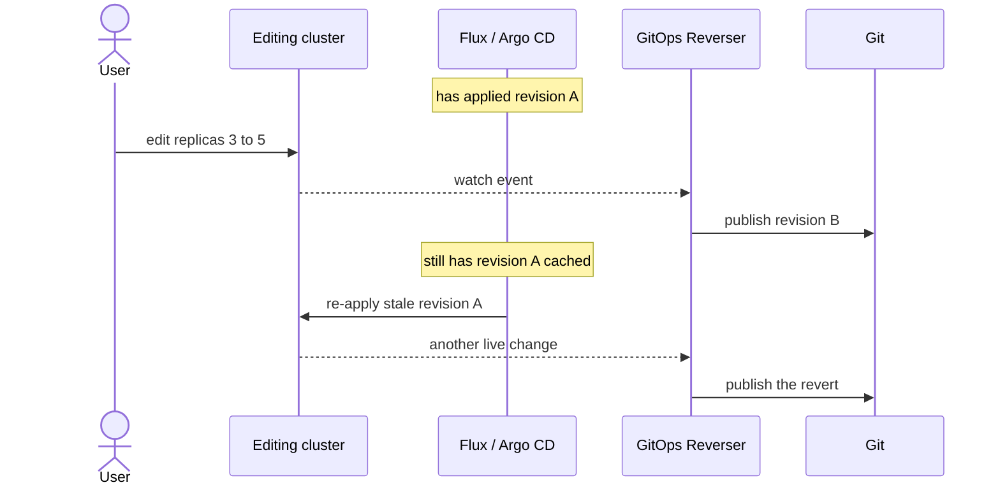
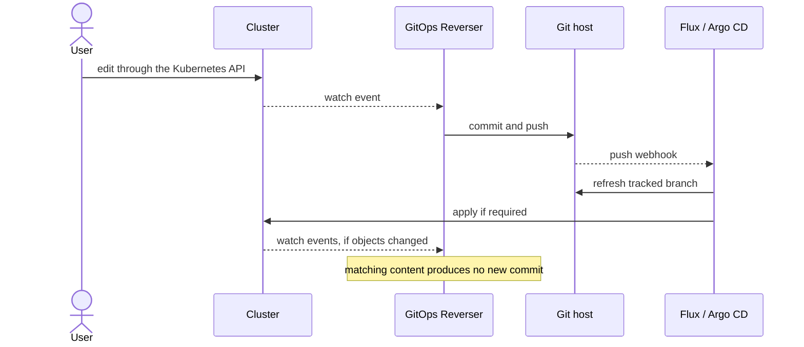

# Bi-directional usage guide

## Summary

GitOps Reverser runs in one direction: **live → Git**. A bi-directional workflow adds
**Git → cluster** through Flux or Argo CD. The central constraint still holds: **the
reconciler must give Reverser time to publish a live edit before overwriting it.**

You do **not** need to reconcile by hand after every commit. A GitHub or Gitea push
webhook can wake the GitOps reconciler automatically. In this guide, a *triggered
applier* means applying after Git changes; the trigger can be a webhook or external
automation. Reverser itself does not currently trigger Flux/Argo CD or wait for their
applied revisions.

This remains experimental. The e2e tests exercise controlled round trips with both
reconcilers. They do not establish safe ordering for simultaneous Git and API edits.
The guidance below was checked against the repository and upstream documentation on
2026-09-18.

## Recommended modes

Start with the mode that needs the least coordination.

| Mode | Shape | Best for |
| --- | --- | --- |
| **1. Audit only** | Reverser captures live changes; no reconciler writes the same path back. | Audit trails and discovery |
| **2. Human in the loop** | Reverser commits; a human reviews or promotes later. | Hotfix capture and migration |
| **3. Split ownership** | Each field has one writer; the two loops own different fields. | GitOps alongside interactive operations |
| **4. Controlled bi-directional** | Both directions change the same fields, with coordinated publishing and applying. | Experimental shared-path workflows |

Modes 1–3 avoid competing writers when their ownership boundaries are enforced.
Mode 4 is the subject of this guide.

## The core problem: causality, not YAML

In an editing cluster, live state diverging from Git can be an edit waiting to be
published. Applying older desired state during that window can erase it:


```mermaid
sequenceDiagram
    actor User
    participant K8s as Editing cluster
    participant Recon as Flux / Argo CD
    participant Rev as GitOps Reverser
    participant Git

    Note over Recon: has applied revision A
    User->>K8s: edit replicas 3 to 5
    K8s-->>Rev: watch event
    Rev->>Git: publish revision B
    Note over Recon: still has revision A cached
    Recon->>K8s: re-apply stale revision A
    K8s-->>Rev: another live change
    Rev->>Git: publish the revert
```

The race starts as soon as the live edit lands, including time spent in a commit
window or retrying a failed push. It can continue after the push until the reconciler
sees the new revision. Sanitizing metadata prevents bookkeeping commits; it does not
solve this ordering problem.

## The model that works: a triggered applier

For the ordinary successful path, let the Git host notify the reconciler after the
push. This is the automatic version of the trigger arrow:


```mermaid
sequenceDiagram
    actor User
    participant K8s as Cluster
    participant Rev as GitOps Reverser
    participant Git as Git host
    participant Recon as Flux / Argo CD

    User->>K8s: edit through the Kubernetes API
    K8s-->>Rev: watch event
    Rev->>Git: commit and push
    Git-->>Recon: push webhook
    Recon->>Git: refresh tracked branch
    Recon->>K8s: apply if required
    K8s-->>Rev: watch events, if objects changed
    Note over Rev: matching content produces no new commit
```

The Git host sends the webhook; Flux's notification-controller or `argocd-server`
receives it. No Git push webhook endpoint in Reverser is needed for this path.

A webhook requests a refresh. It does **not** pin the push's SHA, acknowledge an
apply, or serialize competing writers. If several pushes arrive quickly, the
reconciler can observe a later branch tip without applying every intermediate commit.

For an explicitly coordinated operation, external automation can use a
[`CommitRequest`](configuration.md#commitrequest) that reaches `Pushed=True`, with
`status.sha` and `status.branch`, then check the reconciler's revision and outcome.
`Ready=True` alone is insufficient: a request can finish successfully without
creating a commit. Ordinary watch-driven commits do not automatically create a
`CommitRequest`.

That status primitive exists. A built-in trigger, pending-acknowledgment state, and
wait-for-revision barrier do **not** exist yet.

## Flux and Argo CD, side by side

| Property | Flux Kustomization | Argo CD Application |
| --- | --- | --- |
| Reapply unchanged Git over live edits | Periodic reconciliation and other reconcile triggers | Automated self-heal when enabled; explicit syncs can also overwrite edits |
| Push notification | `Receiver` targets the `GitRepository` | Git host calls `/api/webhook` |
| After source refresh | A new artifact revision triggers dependent `Kustomization` objects | Automated sync applies changed desired state when needed |
| Shared-field setting | Long apply interval; keep source refresh responsive | Automated sync enabled, `selfHeal: false` |
| Revision observation | `Ready=True` and `status.lastAppliedRevision`, including its SHA | `status.sync.status` and `status.sync.revision`; successful `operationState` for an explicit sync |
| SOPS in these e2es | Encrypted Secret round trip | Not exercised |

These settings reduce the usual stale-replay race. They do not prevent a new,
unrelated Git commit or an already-running apply from overwriting unpublished edits.

### Flux realization

Configure a [Flux webhook Receiver](https://fluxcd.io/flux/guides/webhook-receivers/)
for the **`GitRepository`**, rather than targeting the `Kustomization` directly.
Source-controller fetches Git first; the new artifact revision then wakes dependent
`Kustomization` objects. This provides automatic Git → cluster propagation without
a second manual trigger.

Set a long `Kustomization.spec.interval` on the shared editing path, for example
**`24h`**, and keep `GitRepository.spec.interval` shorter, for example `1m`, as a
fallback for missed webhooks. These are suggested starting values for a pilot:

```yaml
# Fields on the GitRepository:
spec:
  interval: 1m
---
# Fields on the Kustomization for the shared editing path:
spec:
  interval: 24h
  retryInterval: 1m
  timeout: 2m
  suspend: false
```

The long interval reduces periodic drift correction; the source interval controls
how quickly a missed push notification is recovered. Failure retries remain prompt.
A shorter retry interval can also reapply during an edit, so treat recovery from a
failed reconciliation as another coordination point.

**There is no documented maximum interval in hours in the current Kustomization
API.** Its [interval implementation](https://github.com/fluxcd/kustomize-controller/blob/main/api/v1/kustomization_types.go)
accepts a Go duration and returns that duration for requeueing, without a separate
hours-based cap. `24h` here is a suggested operating interval.

The **10-hour** number sometimes associated with this is controller-runtime's
[default cache resync period](https://github.com/kubernetes-sigs/controller-runtime/blob/main/pkg/cache/cache.go).
That generates synthetic update events. Flux's
[watch predicates](https://github.com/fluxcd/kustomize-controller/blob/main/internal/controller/kustomization_manager.go)
filter unchanged generation/request tokens and unchanged source revisions, so it
does not establish a universal “Flux must apply every 10 hours” limit.

An active `Kustomization` still has periodic reconciliation. Source changes,
configuration changes, controller restarts, and explicit requests can also cause
earlier reconciliation. A long interval therefore cannot guarantee an uninterrupted
editing window. The [Flux interval and suspension contract](https://fluxcd.io/flux/components/kustomize/kustomizations/#interval)
describes these controls; referenced configuration watches add further triggers.

**Keep the Kustomization unsuspended for webhook-driven operation.** Suspension
blocks applying source updates too. A suspended workflow needs an external owner to
resume it after publishing, wait for the required revision, and suspend it again
before accepting another edit. A manual reconcile request does not bypass suspension.

For an unsuspended path, a manual source-first operation is:

```bash
flux reconcile kustomization editing -n flux-system --with-source
```

When checking completion, compare the SHA within the Flux revision string, such as
`main@sha1:<sha>`, and require `Ready=True`. The revision field is not a bare SHA.
If an exact commit matters, coordinate or pin the source revision; refreshing a
moving branch alone does not provide that guarantee.

### Argo CD realization

Enable automated sync and disable self-heal on the shared path:

```yaml
spec:
  syncPolicy:
    automated:
      enabled: true
      selfHeal: false
      prune: true
```

Use `prune: true` only when Git deletions should delete live objects. Configure the
Git host's push webhook to `https://<argocd-server>/api/webhook`, with a shared secret.
The [Argo CD webhook](https://argo-cd.readthedocs.io/en/stable/operator-manual/webhook/)
refreshes the application; automated sync is what permits applying changes.
A webhook by itself does not turn a manually synced application into an automated one.

Argo CD's [automated sync semantics](https://argo-cd.readthedocs.io/en/stable/user-guide/auto_sync/)
leave live drift alone after a successful sync of the same revision when self-heal
is off. Polling can discover new Git commits without a webhook; the default refresh
period is `120s` plus up to `60s` jitter. The webhook reduces that delay.

Disabling self-heal does not freeze the application. A different commit, changed
application parameters, a manual sync, or another source in a multi-source application
can still cause an apply. Coordinate those operations with live editing. Keep
`selfHeal: false` wherever the same fields must accept edits from both directions.

If Reverser's commit already matches live state, Argo CD can report `Synced` at the
new revision without running a new sync operation. For convergence, check that status
and revision together. When requesting an explicit sync, check the new operation's
`Succeeded` phase and revision instead of accepting a previous operation's result.

Use Argo CD's **annotation resource tracking** on Reverser-managed paths. Reverser
strips `argocd.argoproj.io/tracking-id` and `installation-id`, as well as
`kubectl.kubernetes.io/last-applied-configuration`. It preserves
`app.kubernetes.io/instance`, which can be meaningful user metadata; switching Argo
to label tracking can therefore introduce reverse commits. Flux's operational
`kustomize.toolkit.fluxcd.io/` labels and annotations are also stripped. The exact
rules are in [`internal/sanitize/types.go`](../internal/sanitize/types.go).

For split ownership, `ignoreDifferences` can exclude an API-owned field from drift
comparison. It does **not** by itself prevent a later sync from writing that field.
[`RespectIgnoreDifferences=true`](https://argo-cd.readthedocs.io/en/stable/user-guide/sync-options/#respect-ignore-differences-configs)
also preserves the live value during sync for an existing resource. That makes the
field API-owned; it is unsuitable when Git must also drive that same field.

## Why Reverser might need its own integration

The successful push path already has a webhook. The missing integration concerns
cases that this path cannot cover:

- **Someone else pushes to Git.** Reverser needs a signal that its Git baseline has
  changed and coordination with the incoming apply, especially while it holds
  unpublished live edits. Options in the design include an inbound Git webhook or
  watching an existing Flux `GitRepository` revision. Watching Flux could reuse the
  Git host webhook already configured by the user.
- **Reverser refuses to publish a live edit.** No commit means no push webhook.
  With Argo self-heal off, refreshing the unchanged revision does not restore the
  object after that revision has already been synced. Restoring it needs an explicit,
  scoped sync. Flux can restore it on reconciliation, but a long apply interval can
  leave it live for hours. An outbound trigger could request that recovery promptly.
- **A workflow needs confirmation.** A successful webhook delivery is not evidence
  that the intended revision reached the cluster. A coordinator needs revision
  observation, timeouts, and a policy for commits superseded by later pushes.

These are recorded in
[`orchestrator-reconcile-trigger.md`](design/support-boundary/orchestrator-reconcile-trigger.md)
and [`reconcile-triggering.md`](design/reconcile-triggering.md). These integrations
remain at the design stage. Reverser's existing admission and audit webhooks serve
attribution and validation; they are separate from a Git push receiver.

## Practical platform guidance

- Prefer audit-only or split ownership when both writers do not need the same fields.
- Define when API editing is allowed and how Git-side deployments are coordinated.
- Monitor refused writes and push failures: a live edit can remain unpublished.
- Make rollback ownership explicit, including who restores an edit that cannot be saved.
- Exercise missed webhooks, competing pushes, deletion, and controller restarts before
  relying on shared ownership in production.

For implementation work, the missing boundary is a coordinator that observes revisions,
preserves pending intent, and reports progress and failures. Keep that logic separate
from generic Git writes. Successful conflict handling at push time does not prove safe
ordering between a GitOps apply and live watch events.

## Current status in this repository

Reverser captures live changes, handles a moved remote branch during Git writes,
compares meaningful content, and removes known controller bookkeeping. The e2e corner
exercises these building blocks with real Flux and Argo CD installations.

It does not yet provide a Git push receiver, an orchestrator trigger, an applied-revision
barrier, or automatic restoration of refused edits. HA and production hardening for
shared-ownership edge cases also remain incomplete.

### What the e2e tests prove

The tests are useful regression coverage for the controlled workflows they execute:

| Test | Covered behavior | Important boundary |
| --- | --- | --- |
| [Flux](../test/e2e/flux_bi_directional_e2e_test.go) | Git → live → Git, exact commit counts, ready/applied-revision checks, SOPS round trip, Git revert and prune | Uses explicit CLI reconciliation and `30m` source/apply intervals; no Receiver-driven shared-path scenario |
| [Argo CD](../test/e2e/argocd_bi_directional_e2e_test.go) | Metadata cleanup, explicit resync, self-heal reverting an edit, ignored fields, both directions on one field with self-heal off | Uses a real Gitea webhook; automatic phases mostly check content and bounded settling |

The main gaps to close before treating them as evidence of production safety are:

1. Add a Flux shared-path case driven solely by a `Receiver`, and force a periodic
   stale-source apply while an API edit is pending. The existing test's short checks
   do not exercise its `30m` timer.
2. Make Argo webhook causality observable. A `20s` deadline below a `180s` polling
   period does not exclude a poll already due or a refresh caused by changing the
   `Application`. Isolate polling for that case or assert delivery and processing;
   check the expected revision and convergence too.
3. Control the Argo self-heal race in its failure demonstration. The webhook remains
   active, so Reverser's push can refresh desired state while self-heal is running.
   Exact `+2` commits and a final reverted value depend on that ordering; Kubernetes
   watch ordering alone does not make the two controllers deterministic. Gate delivery
   for this phase and assert the intermediate edit and revert in Git history.
4. Exercise an external push during an open commit window, webhook loss, restart
   recovery, and refused edits with the GitOps reconciler active. Other tests cover
   parts of these behaviors, but these two scenarios do not prove their composition.

The shared commit-count settling windows are only `3–6s`. They catch immediate churn;
loops that start on a later scheduled reconcile need separate coverage.

## Suggested rollout path

1. Run GitOps Reverser in audit-only mode.
2. Move to human-reviewed hotfix capture.
3. Use split ownership where fields have different authorities.
4. Pilot controlled bi-directional mode only on paths that need shared fields, with
   the timing and recovery limitations above made explicit.

## References

Run the opt-in corner with `task test-e2e-bi-directional`; `task test-e2e` excludes it.
The dedicated corner is also a CI job and installs Argo CD. Browse it with `task argocd-ui`.

- [E2e corner specification](spec/e2e-bi-directional-corner.md)
- [Argo CD design discussion](design/support-boundary/argocd-bi-directional.md)
- [Orchestrator trigger and ordering design](design/support-boundary/orchestrator-reconcile-trigger.md)
- [Controller and repository architecture](architecture.md)
