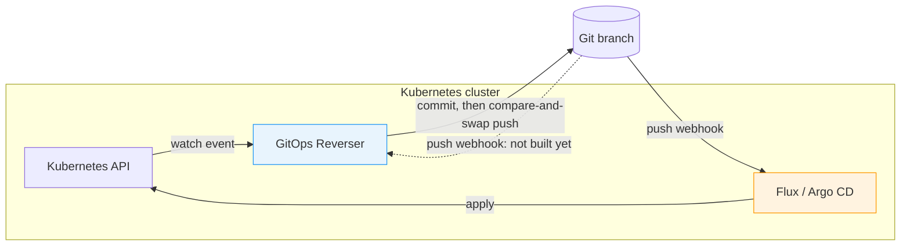
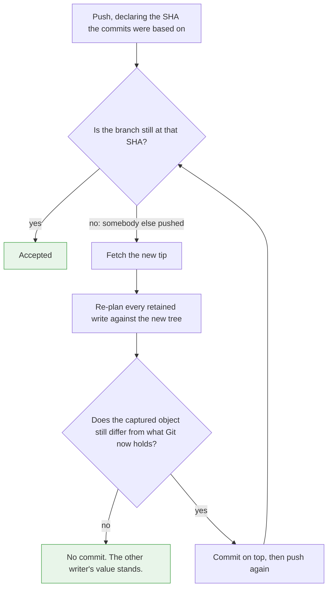
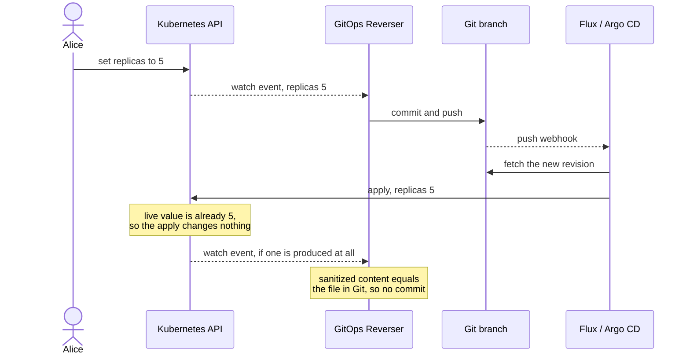

# Bi-directional usage guide

GitOps Reverser publishes live cluster state to Git. Flux or Argo CD applies Git back to the
cluster. Run both and a resource can be changed from either side. This guide covers what that
costs, how to configure the two reconcilers for it, and which parts are proven by tests.

**The short version.** Point your Git host's push webhook at the reconciler, turn Argo CD's
`selfHeal` off, and accept that for anything edited live the Kubernetes API is the source of
truth. There is no merge, no lock, and no timing guarantee.

**What the system is optimized for.** Reverser assumes most changes arrive through the Kubernetes
API, and it spends its budget on **round trips to the Git host**, because those are the seconds
an operator waits through. Local work is not in that budget: recomputing a change against a
moved branch happens on a checkout that is already on disk and costs nothing worth naming.

That ordering explains the design. A publication talks to the remote **twice**: it opens the push,
reads where the branch is, and sends the commits. It learns everything it needs from that one
exchange, so it does not read the branch beforehand. A publication that turns out to have nothing
to change costs a single request. A foreign push is not a problem and not lost work; it costs a
handful of extra requests and a recomputation, and the branch ends up correct. If your workload is
mostly Git-side edits with occasional live changes, this guide still applies, but you are using
the tool against its grain.

Those numbers are measured rather than estimated, and the per-operation table lives in
[`git-roundtrip-ledger.golden`](../internal/git/testdata/git-roundtrip-ledger.golden).


```mermaid
flowchart LR
    subgraph CLUSTER["Kubernetes cluster"]
        API["Kubernetes API"]
        REV["GitOps Reverser"]
        REC["Flux / Argo CD"]
    end
    GIT[("Git branch")]

    API -->|"watch event"| REV
    REV -->|"commit, then compare-and-swap push"| GIT
    GIT -->|"push webhook"| REC
    REC -->|"apply"| API
    GIT -. "push webhook: not built yet" .-> REV

    style REV fill:#e8f4fd,stroke:#2196f3
    style REC fill:#fff3e0,stroke:#ff9800
```

Both solid legs are configuration you control. The dashed leg does not exist: nothing tells
Reverser that somebody else moved the branch. [Telling Reverser that somebody else
pushed](#telling-reverser-that-somebody-else-pushed) covers what that costs and how to work
around it.

## One queue per branch

Every watched event for a given `GitProvider` and branch lands on one queue owned by one branch
worker. Events are applied in arrival order and never overtake each other. Two `GitTarget`
objects on the same provider and branch share that worker, so they share the ordering too.

The worker does two things with the queue:

1. **Commit.** Events are collapsed into one local commit per author after
   [`spec.commit.window`](configuration.md#the-commit-window-speccommitwindow) of silence,
   `5s` by default. `0s` gives one commit per event.
2. **Push.** Local commits go to the remote at most once every five seconds, as a
   compare-and-swap. The push declares the SHA it expects the branch to be at, and the Git host
   refuses the update if the branch has moved off the commits' base.

That compare-and-swap is what detects a foreign push. The push session reads the remote's ref
advertisement and refuses a moved branch before uploading a single object, so contention is
caught on a connection the cycle was making anyway.

**Reverser never polls the remote and holds no timer against it**, so an idle target generates no
Git traffic at all. That is measured rather than approximate, and there is no interval setting
that changes it.

A publishing target does not read the branch before planning either. It plans on the checkout it
already has and lets the compare-and-swap catch it if the branch moved, which is the one case
where it pays to re-read and replay. The exceptions are a worker that has not yet seen the
remote, a previous write that failed and left the checkout in an unknown state, and a resync,
which keeps reading because it can finish without ever opening a push. What is still missing is
anything that *tells* an idle target its branch moved; that is
[inbound push notification](design/push-notification-and-reconcile-trigger.md). `--base-trust-max-age`
puts a ceiling on how long it can be wrong in the meantime; see
[Telling Reverser that somebody else pushed](#telling-reverser-that-somebody-else-pushed).

## What happens when somebody else pushed first

The push is rejected and the worker **replays**: it fetches the new tip, re-plans every retained
write against it, and pushes again. Three attempts, then the writes stay retained for a later
try.

Replaying is the cheap half. The re-planning is local and the branch ends up correct either way.
What a rejection costs is the extra conversations with the Git host that surround it,
which is why a push webhook pointed back at Reverser is worth having: told in advance that the
branch moved, it can fetch once and push onto the right tip instead of discovering the move by
being turned away. That receiver is designed but not yet built, and
[Telling Reverser that somebody else pushed](#telling-reverser-that-somebody-else-pushed) covers
where that leaves you today.


```mermaid
flowchart TD
    PUSH["Push, declaring the SHA the commits were based on"] --> MOVED{"Is the branch still at that SHA?"}
    MOVED -->|yes| DONE["Accepted"]
    MOVED -->|"no: somebody else pushed"| FETCH["Fetch the new tip"]
    FETCH --> REPLAN["Re-plan every retained write against the new tree"]
    REPLAN --> DIFF{"Does the captured object still differ from what Git now holds?"}
    DIFF -->|no| NOOP["No commit. The other writer's value stands."]
    DIFF -->|yes| COMMIT["Commit on top, then push again"]
    COMMIT --> MOVED

    style DONE fill:#e8f5e9,stroke:#43a047
    style NOOP fill:#e8f5e9,stroke:#43a047
```

Replay re-plans, it does not rebase a diff. Each retained write still carries the object as the
watch captured it, and writing that object onto the new tree has one of two outcomes:

- **No change, so no commit.** The file in Git already says what the captured object says,
  because whoever pushed made the same change. Git had it first and that is the end of it.
- **A change, committed on top.** The captured object is written over the other writer's value,
  and the branch ends at the API side's value.

There is no third outcome, and there is no merge. An ordinary watch event carries the object's
whole state, without a retained common baseline that identifies which fields changed on each
side. Replay writes what the cluster said. The
[deferred merge investigation](future/git-api-three-way-comparison.md#what-three-way-merge-means-here)
defines the additional comparison that would require.

### What a write does to the file

The writer edits fields in place within the existing document, preserving its presentation.
For a plain manifest:

| In the file | What a replay does to it |
| --- | --- |
| A field the live object also carries | Set to the live value |
| A field in Git that the live object does not have | **Removed** |
| Comments, key order, other documents in the file | Preserved |
| An edit that cannot be placed safely | Refused, and the file is left untouched |

In a kustomize layout the live object is the rendered result rather than the contents of any one
file, so the edit is projected back through the build first and only the fields that document is
responsible for are touched. An edit the projection cannot place is refused rather than guessed
at, which is why the last row exists.

**The consequence to plan around.** If Alice changes `replicas` through the API while Bob changes
`image` in Git on the same object, replaying Alice's captured object writes her `replicas` and
also the `image` she was looking at. Bob's change to a different field of the same object does
not survive, and a field Bob added that the cluster never had is removed outright. Separate
objects are independent of each other. Separate fields of one object are not.

## There are no timing guarantees

Committing and pushing to a remote takes on the order of a second at best, and the Kubernetes API
accepts a great many changes in a second. Nothing paces the two against each other and nothing
reserves a window, so treat live editing as a different way of making changes rather than a
faster `git push`:

- You make a change and then observe that it arrived. You do not save and receive a confirmation.
- Intermediate values may never reach Git. Two edits inside one commit window produce one commit
  holding the later value.
- Git history records the states the worker captured and published. Expect gaps between them.

When a specific change has to be confirmed in Git, use a
[`CommitRequest`](configuration.md#commitrequest). `Pushed=True` with `status.sha` and
`status.branch` names the commit it produced.

## Why the loop stops

The obvious fear is a feedback loop: Reverser commits, the reconciler applies, the apply produces
a watch event, Reverser commits again. With no intervening edits or admission changes, the loop
settles as follows.


```mermaid
sequenceDiagram
    actor Alice
    participant API as Kubernetes API
    participant Rev as GitOps Reverser
    participant Git as Git branch
    participant Rec as Flux / Argo CD

    Alice->>API: set replicas to 5
    API-->>Rev: watch event, replicas 5
    Rev->>Git: commit and push
    Git-->>Rec: push webhook
    Rec->>Git: fetch the new revision
    Rec->>API: apply, replicas 5
    Note over API: live value is already 5,<br/>so the apply changes nothing
    API-->>Rev: watch event, if one is produced at all
    Note over Rev: sanitized content equals<br/>the file in Git, so no commit
```

When the reconciler applies a commit Reverser wrote, the live object already holds those values,
because they were read from that object in the first place. The apply changes nothing, so the
event it produces carries content identical to the file already in Git, and no commit is made.

This is worth stating in its general form, because it answers a question people reasonably ask
about the Git to cluster leg: **applying a resource that already matches does not produce a
change.** Only a differing value counts as a write here.

What can break that reasoning is controller bookkeeping, which is why the next section exists.

## Keep controller bookkeeping out of Git

Argo CD stamps `argocd.argoproj.io/tracking-id` on every non-CRD object it applies, Flux stamps
`kustomize.toolkit.fluxcd.io/` labels and annotations, and a client-side apply writes
`kubectl.kubernetes.io/last-applied-configuration`. None of it is user intent. If it reached Git
the sanitized live object would stop matching the committed file, and every reconciler sync would
produce a commit.

Reverser strips all of it before writing, along with `argocd.argoproj.io/installation-id`,
`kro.run/`, `applyset.kubernetes.io/`, and `kcp.io/cluster`. The rules and the reasoning for each
are in [`internal/sanitize/types.go`](../internal/sanitize/types.go).

Reverser strips only the exact Argo CD tracking keys. Sibling annotations under
`argocd.argoproj.io/` (`sync-wave`, `sync-options`, `hook`) are user intent that belongs in Git.

**Leave Argo CD on its default `annotation` resource tracking for Reverser-managed paths.** The
`label` and `annotation+label` methods stamp `app.kubernetes.io/instance`, which is
indistinguishable from the standard recommended label that Helm and Kustomize set for application
reasons. Reverser therefore does not strip it, and label tracking would put Argo's bookkeeping
into your commits.

## Configure Argo CD

`selfHeal` controls automatic correction of live drift after a successful sync. Field ignores
control which differences count and, with the respect option below, which values apply writes.

| `selfHeal` | What happens to a live edit | Use when |
| --- | --- | --- |
| `true` | Automatic drift correction can restore Git before publication completes. | The path is Git-owned and drift is an error |
| `false` | Live drift alone does not repeat a successful sync of the same revision and parameters. | Anything edited through the API |

In the e2e corner, self-heal restores the Git value in about one second and the edit produces a
two-commit flap. These measurements do not establish an ordering guarantee. A new desired revision
or a manual sync can still overwrite an unpublished API edit with `selfHeal: false`.
The [apply and field-ignore source review](facts/gitops-apply-and-field-ignore.md) explains the
separate scheduling, comparison, and write paths.

```yaml
spec:
  syncPolicy:
    automated:
      selfHeal: false
      prune: true
```

Use `prune: true` only when a deletion in Git should delete the live object. Then configure the
[Argo CD webhook](https://argo-cd.readthedocs.io/en/stable/operator-manual/webhook/) on your Git
host, pointing at `https://<argocd-server>/api/webhook` with a shared secret. In the e2e corner
that path drives a sync about four seconds after the push. Without it you wait for the timed
refresh.

A webhook only requests a refresh. An apply follows only where a sync is permitted, so the
webhook does not substitute for automated sync.

### The split-ownership alternative

`ignoreDifferences` on a field, with `RespectIgnoreDifferences=true`, allows `selfHeal: true`
elsewhere while preserving that field's live value during ordinary syncs. Its differences alone
do not make the Application `OutOfSync`. Without the respect option, a later sync can still write
the ignored field from Git.

Git seeds the field on creation, but later Git edits to it do not reach the existing object while
the apply ignore is active. That behavior follows from the source review. The e2e corner checks
that an API edit survives and Reverser publishes its value back into Git; it does not test a later
Git edit to the ignored field. This configures authority for one field; it does not preserve
unrelated Git fields against Reverser's whole-object replay.

## Configure Flux

Flux kustomize-controller performs drift correction on reconciliation, without Argo CD's
`selfHeal` toggle. For ordinary declared fields, a reconcile can restore a revision's Git values.
The periodic interval and source notifications influence how long an API edit has to reach Git.
Field-ignore policies change which values the apply enforces.

From kustomize-controller `v1.9.0`, `Kustomization.spec.ignore` can preserve selected live fields
during subsequent applies, while still creating them from Git initially. The source review above
covers its ownership handling and tests. As with Argo's apply ignores, a later Git edit to an
ignored field does not normally apply, and Reverser can still capture that field back into Git.

```yaml
# GitRepository: short, so a missed webhook becomes a delay rather than a stall.
spec:
  interval: 1m
---
# Kustomization on the shared path: long, so the timer is not what reverts live edits.
spec:
  interval: 24h
  retryInterval: 1m
  suspend: false
```

Configure a [Flux `Receiver`](https://fluxcd.io/flux/guides/webhook-receivers/) against the
**`GitRepository`**, not the Kustomization. Source-controller fetches Git and publishes a new
artifact revision, which wakes the dependent Kustomizations. A Receiver aimed at the
Kustomization can re-apply the artifact Flux already has cached, which is the old content.

A long interval delays periodic correction. It reserves nothing: a new source revision, a
configuration change, a retry, or a controller restart all trigger an apply sooner.

Keep the Kustomization **unsuspended**. Suspension blocks source-triggered applies as well, and a
manual reconcile request does not bypass it. To trigger the source and the apply together:

```bash
flux reconcile kustomization editing -n flux-system --with-source
```

## Telling Reverser that somebody else pushed

Everything above points a webhook from the Git host at the reconciler. The other direction does
not exist yet: nothing tells Reverser that a branch it tracks moved, so it finds out when it next
pushes.

For a target that is actively writing, nothing breaks: the compare-and-swap catches the move and
replay handles it. It is slower than it needs to be, because the move is discovered by a push
that was always going to fail, and that is the cost the receiver removes.

A **refused** target also recovers on its own. While `GitPathAccepted` is `False` the target is
not converged, so it requeues every 10 seconds and each pass forces a re-read. Fix an unsupported
folder in Git and the condition clears within about ten seconds without anyone doing anything.

The case that does not recover is a **healthy, idle** target. It is converged, so it requeues
every 5 minutes, and those passes publish status without touching Git. Somebody changes the
folder underneath it and it holds its previous answer until it next writes. You can force a
re-read:

```bash
kubectl annotate gittarget editing -n gitops-reverser \
  reconcile.configbutler.ai/requestedAt="$(date +%s)" --overwrite
```

To bound it instead of watching for it, set `--base-trust-max-age` on the controller: a `GitTarget`
that has not re-read its folder within that age is made to, whether or not it has anything to
publish. It is off by default, because it trades requests for freshness: one folder re-read per
target per interval, including targets that are perfectly quiet. The age is per target rather than
per branch: one worker serves every target on a `(provider, branch)` and every push renews the
shared checkout, so a branch-wide age would let one busy target postpone a quiet one beside it
indefinitely.

A receiver that does this automatically is designed in
[inbound push notification](design/push-notification-and-reconcile-trigger.md). The other half of that
design, removing the head-of-cycle fetch, has shipped; the receiver is what remains.
That design deliberately does **not** wire the webhook to the annotation above: the
annotation asks for a full resync, which publishes cluster state, and that is the one
thing a push notification must not do.

If you are building that receiver, or a relay to call it, the request shape is specified in
[§8.3, the wire contract](design/push-notification-and-reconcile-trigger.md#83-the-wire-contract-for-whoever-calls-it):
one signed `POST /git-push/<route>` carrying the repository, the branch, and the SHA the branch now
points at. It deliberately does not take a Git host's native payload, so the mapping from your
host's webhook belongs in the host's own configuration or in the relay.

One property that design fixes in advance, and that matters if you build anything similar
yourself: **a notification that a branch moved must not trigger a fresh cluster snapshot.** Our
handler and the reconciler's both fire on the same push, and ours has less work to do, so it
would reliably publish the pre-push cluster state over the incoming change before the reconciler
ever applied it. A push tells you about Git. It says nothing about the cluster.

## When a write is refused or a push fails

A live edit can succeed while its publication does not. The cluster holds the change and Git does
not, and **a refused write writes no file, so nothing reaches the reconciler through the ordinary
path**. Watch push failures and the target's write-acceptance conditions: a successful Kubernetes
edit confirms the API write and nothing beyond it.

Retained writes are held in worker memory. They do not survive a restart, and an edit that failed
before becoming a pending write is gone from Reverser's side. Recovery is a resync, which derives
state from the cluster as it exists at that moment, so it cannot reproduce an intermediate value
that has since been overwritten.

Reverser performs no restoration of its own, with one opt-in exception:
[`spec.onRefusal: PushEmptyCommit`](configuration.md#reverting-a-refused-edit-specconrefusal) answers
a refused edit with a commit that changes no file, which moves the branch and so asks both
reconcilers to re-apply. It is off by default and its blast radius is the branch, not the object.
Otherwise, with Argo `selfHeal` off, refreshing an already-synced revision will not put the
approved value back; that needs an explicit sync, and Flux restores it on its next apply, which a
24h interval can leave hours away.

## What the tests prove

The bi-directional corner runs against deployed Flux and Argo CD. Its timing and event-count
assertions describe those scenarios; they do not guarantee the ordering of concurrent writers.

| Covered | Where |
| --- | --- |
| Argo bookkeeping never reaches Git, asserted as zero commits during a sync | [Argo phase 1](../test/e2e/argocd_bi_directional_e2e_test.go) |
| `selfHeal: true` loses the API edit, and the flap is exactly two commits | Argo phase 2 |
| `ignoreDifferences` keeps the edit and holds the Application `Synced` | Argo phase 3 |
| `selfHeal: false` keeps the API edit and still applies a Git-side change to the same field | Argo phase 4 |
| Git to cluster to Git round trip settles without a commit loop | [Flux](../test/e2e/flux_bi_directional_e2e_test.go) |
| A SOPS-encrypted Secret round-trips without a reverse commit | Flux |
| A Git revert removes the live object and the committed file | Flux |
| Waking only the `GitRepository` makes the Kustomization apply a new revision by itself, reverting live drift, with an **empty** commit as that revision | Flux |

Two gaps worth knowing. The **Flux spec drives reconciliation manually** with 30m intervals, so no
spec delivers a webhook to a `Receiver`; only the Argo webhook is exercised. The mechanism that
path depends on is, though: the last row above wakes the `GitRepository` alone and the Kustomization
applies on its own, which is exactly what a Receiver aimed at the source produces. And **no spec
tests simultaneous writes to one field from both sides**, because the outcome depends on arrival
order that the corner does not control. The replay mechanism is covered; a conflict policy is not,
because there is not one.

Run `task test-e2e-bi-directional` for the corner, which is also a CI job. `task test-e2e`
excludes it, and `task argocd-ui` opens the installed Argo CD UI. The
[corner specification](spec/e2e-bi-directional-corner.md) describes the setup and the coverage
still missing.
