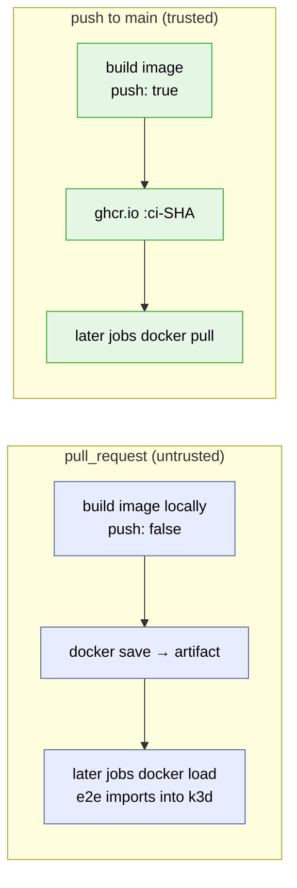

# CI/CD Overview

The pipeline is split by **trust level**, not by topic. One rule drives the whole design:

> Untrusted (pull-request) code may be built and tested, but it never meets a write
> token, a secret, or publishing credentials.

Everything else follows from that rule. The checks themselves come from the same
[Task graph](tasks-overview.md) you run locally — CI is just `task lint`, `task test`,
and the e2e suite executed inside the same CI container the devcontainer is built from,
so local and CI results cannot drift apart.

## The four trust zones

| Zone | Workflow | Trigger | Secrets | Writes | Purpose |
| --- | --- | --- | --- | --- | --- |
| Untrusted validation | [ci.yml](../.github/workflows/ci.yml) | `pull_request` | none | none | Full contributor validation: containers, lint, unit, e2e, image scan |
| Trusted validation | [release.yml](../.github/workflows/release.yml) → calls `ci.yml` | `push` to `main` | `GITHUB_TOKEN` | `packages` (CI images) | The *same* jobs, now allowed to publish per-commit CI images |
| Release & publish | [release.yml](../.github/workflows/release.yml) tail jobs | after trusted validation is green | `GITHUB_TOKEN` + OIDC | packages, releases, attestations | Version (release-please), publish multi-arch images + chart, sign, attest |
| Hygiene | [scorecard.yml](../.github/workflows/scorecard.yml) | weekly + `main` | none | security-events | OpenSSF Scorecard supply-chain checks |

Two properties are worth calling out:

- **One copy of the validation pipeline.** `ci.yml` runs directly for PRs and is invoked
  by `release.yml` as a [reusable workflow](https://docs.github.com/en/actions/using-workflows/reusing-workflows)
  for pushes to `main`. PR runs and main runs execute the *same jobs from the same file* —
  there is no `pr.yml`/`main.yml` pair that can drift apart.
- **Release only after everything passed.** `release.yml` chains
  `ci → release-please → publish` with `needs:`. This is deliberate: tags created by
  release-please with `GITHUB_TOKEN` never trigger other workflows (GitHub's recursion
  guard), so a separate tag-triggered release workflow would either silently not run or
  need a PAT. Chaining in one run keeps the guarantee *structural*: nothing can be
  published from a commit that did not pass the full pipeline first.

## How fork PRs work

GitHub gives fork PRs a read-only `GITHUB_TOKEN` and no secrets. The pipeline adapts by
changing the *delivery* of images, never the *checks*:



- The CI base container and the project image are built from the PR's own code, so a PR
  that changes the toolchain is validated against *its own* toolchain.
- Images travel between jobs as **artifacts** (`docker save`/`docker load`), and e2e
  imports them into k3d with `IMAGE_DELIVERY_MODE=load` instead of pulling.
- Nothing is published from a PR, regardless of origin. Same-repo PRs follow the exact
  same path so the two flavors can't diverge.
- The `image-refresh` e2e lane validates the local build → k3d load → rollout chain with
  a locally built image (`PROJECT_IMAGE` unset), so it works identically on fork PRs.

First-time contributors additionally need a maintainer to approve the workflow run —
that is a GitHub Actions repository setting, the last line of defense for CI-minute
abuse, not something the workflow files control.

## Release artifacts and how to verify them

On a release (release-please PR merged to `main`), `release.yml` publishes:

| Artifact | Where | Integrity |
| --- | --- | --- |
| Multi-arch image (`linux/amd64`, `linux/arm64`) | `ghcr.io/configbutler/gitops-reverser` | cosign keyless signature, SLSA build provenance attestation, SPDX SBOM attestation |
| Helm chart | `oci://ghcr.io/configbutler/charts/gitops-reverser` | cosign keyless signature |
| `install.yaml` + `sbom.spdx.json` | GitHub release assets | part of the signed release |

Verify an image (also embedded in every release's notes):

```bash
cosign verify \
  --certificate-identity-regexp '^https://github.com/ConfigButler/gitops-reverser/\.github/workflows/release\.yml@refs/heads/main$' \
  --certificate-oidc-issuer https://token.actions.githubusercontent.com \
  ghcr.io/configbutler/gitops-reverser:<version>

gh attestation verify oci://ghcr.io/configbutler/gitops-reverser:<version> \
  --repo ConfigButler/gitops-reverser
```

Signing is *keyless* (Sigstore): there is no private key to store or leak. The signature
certifies "built by the `release.yml` workflow on `main` of this repository", issued via
GitHub's OIDC identity and logged in the public Rekor transparency log.

## Supply-chain hygiene

- **Every GitHub Action is pinned to a full commit SHA** (with a `# vX.Y.Z` comment);
  Dependabot's `github-actions` ecosystem bumps pin + comment together.
- **Every base image is pinned by digest** (`golang`, `alpine`, `distroless` in
  [Dockerfile](../Dockerfile), `golang-bookworm` in
  [.devcontainer/Dockerfile](../.devcontainer/Dockerfile)); Dependabot's `docker`
  ecosystem keeps the digests moving.
- **Trivy scans the built project image** in every run (`image-scan` job): full report
  to the job log (and code scanning on trusted runs), and the job fails on CRITICAL
  vulnerabilities that have a fix available.
- **Minimal token permissions** per job; the workflow default is `contents: read`.
- **OpenSSF Scorecard** runs weekly and on every push to `main`.

## Where things are defined

| Concern | Lives in |
| --- | --- |
| What gets checked (lint, unit, e2e, packaging) | [Taskfile-build.yml](../Taskfile-build.yml), [test/e2e/Taskfile.yml](../test/e2e/Taskfile.yml) — see [tasks-overview.md](tasks-overview.md) |
| Tool versions | [.devcontainer/Dockerfile](../.devcontainer/Dockerfile) (single source for devcontainer *and* CI) |
| Validation pipeline | [.github/workflows/ci.yml](../.github/workflows/ci.yml) |
| Release pipeline | [.github/workflows/release.yml](../.github/workflows/release.yml) |
| Hygiene | [.github/workflows/scorecard.yml](../.github/workflows/scorecard.yml), [.github/dependabot.yml](../.github/dependabot.yml) |
| Release process details | [.github/RELEASES.md](../.github/RELEASES.md) |
