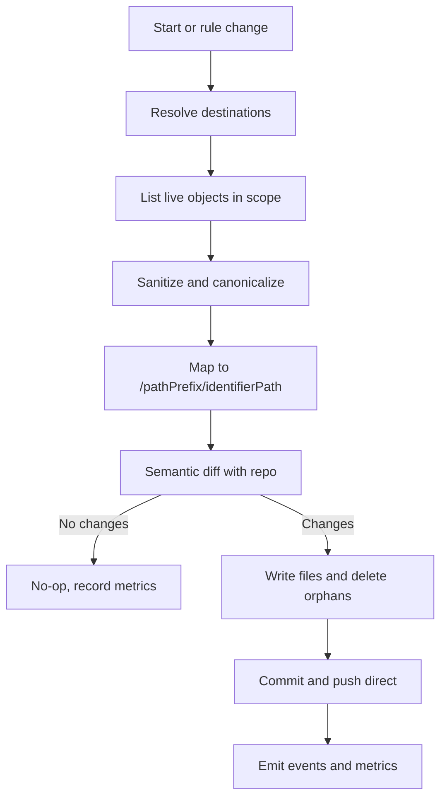
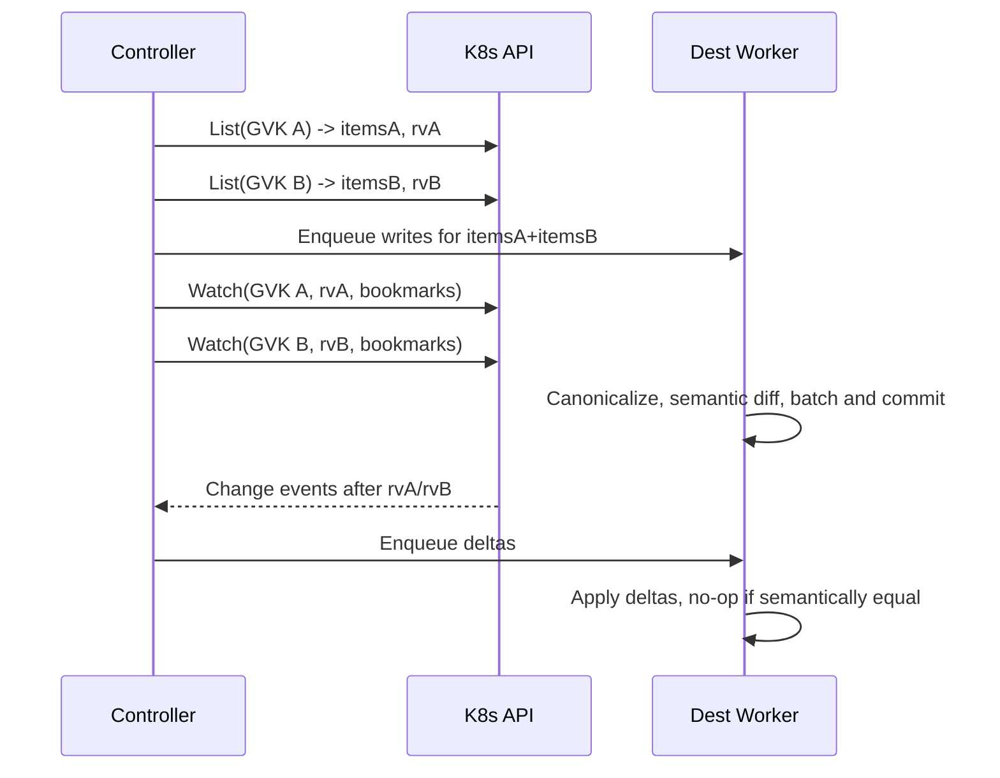

# GitOps Reverser: Cluster-as-Source-of-Truth with syncContext ownership and direct push

This document defines the startup and reconciliation strategy where the live Kubernetes cluster is the source of truth for a scoped set of objects, and gitops-reverser writes directly to Git without PR gating. The controller takes ownership of per-rule syncContext folders and can push to multiple branches within a single repository via explicit destinations.

References to current code and CRDs:
- [api/v1alpha1/watchrule_types.go](api/v1alpha1/watchrule_types.go)
- [api/v1alpha1/clusterwatchrule_types.go](api/v1alpha1/clusterwatchrule_types.go)
- [api/v1alpha1/gitrepoconfig_types.go](api/v1alpha1/gitrepoconfig_types.go)
- [internal/types/identifier.go](internal/types/identifier.go)
- [internal/sanitize/marshal.go](internal/sanitize/marshal.go)

Objectives
- On startup, enumerate all Kubernetes objects in scope and reconcile the backing Git repository so that files reflect the live state for the owned syncContext folder.
- Take explicit ownership of a base path in the repository per rule (syncContext) and write directly to configured branches.
- Support multiple branches per repository by targeting multiple destinations.
- Prevent churn and loops with external GitOps engines by using semantic equivalence and canonical rendering.
- Keep current secrets behavior (sync secrets as implemented today).

Non goals for this iteration
- No PR-first or manual review flow; direct pushes are used.
- No global label-based ownership model; selection remains rule-defined only.
- No migration concerns yet; APIs can be adjusted since the tool is not yet officially released.

Core decisions
- Ownership and pathing
  - Each rule owns a syncContext folder in the target repo branch: effective path template is `/{syncContext}/{identifierPath}` where identifierPath is produced by the existing mapping in [internal/types/identifier.go](internal/types/identifier.go)
  - Overlaps are allowed across rules and destinations, consistent with current behavior; conflict handling is defined below.
- Direct pushes
  - The controller pushes commits directly to destination branches (no PR gating by default).
- Multi-branch support
  - A single installation can commit to multiple branches of a repo by using one or more destinations.
- CRDs and secrets
  - CRD resources can be handled by dedicated ClusterWatchRule instances per customer using native rule selectors.
  - Secrets continue to be synced as today; no special casing added now.

Proposed API design

1. Introduce a namespaced GitDestination API
- Purpose: declare a writable destination within a Git repository and bind a base folder for one syncContext on a specific branch.
- Location: same API group and version as existing CRDs next to [api/v1alpha1/gitrepoconfig_types.go](api/v1alpha1/gitrepoconfig_types.go)
- Key fields (high level)
  - repoRef: reference to a GitRepoConfig by name; optionally same namespace as the rule
  - branch: branch name to push to
  - pathPrefix: the syncContext base path within the repo branch; controller owns this folder hierarchy
  - allowedPaths: optional allowlist under pathPrefix for additional guardrails
  - accessPolicy: properties currently on GitRepoConfig that govern write behavior and identities move here
  - writeMode: direct (default), future: pr
  - conflictPolicy: last-writer-wins (default), future: block-or-pr
- Notes
  - Multiple GitDestination objects may reference the same GitRepoConfig to enable multi-branch writes.

2. Extend WatchRule and ClusterWatchRule to reference destinations
- Add a destinations list (or a single destination reference if we prefer strictness now) to both [api/v1alpha1/watchrule_types.go](api/v1alpha1/watchrule_types.go) and [api/v1alpha1/clusterwatchrule_types.go](api/v1alpha1/clusterwatchrule_types.go)
- Behavior
  - For each destination, the controller writes outputs for that rule under `/{pathPrefix}/{identifierPath}` on the specified branch of the referenced repo.
  - If multiple destinations are configured, the same selection scope is written to each destination independently.

3. Modify GitRepoConfig
- Remove: branch field
- Add: allowedBranches list to constrain which branches can be targeted by GitDestination
- Keep: connectivity, auth, repository URL and non-write operational details
- Move: access-related write policies from GitRepoConfig to GitDestination

Rationale for this split
- GitRepoConfig is the repository connectivity contract.
- GitDestination is the write contract per branch and per base path (syncContext).
- Rules define selection and attach to one or more destinations.

Startup and reconciliation behavior
- Trigger conditions
  - Controller start and leader acquisition
  - New or updated WatchRule or ClusterWatchRule
  - New or updated GitDestination or GitRepoConfig
- Steps per destination
  - List live objects in the rule’s selection scope
  - Sanitize and canonicalize objects to a declarative form
  - Map each object to `/{pathPrefix}/{identifierPath}`
  - Compute semantic diffs against repository contents at that branch and folder
  - Write changed or new files; identify orphaned files under the owned pathPrefix that have no live counterpart and delete them
  - Commit and push directly to the destination branch; fast-forward only and rebase if needed
- Idempotency
  - Re-running without changes must result in a no-op (zero diff, zero commits)

Canonicalization and diff policy
- Use a stable renderer and sanitizer similar to utilities under [internal/sanitize/marshal.go](internal/sanitize/marshal.go)
- Drop or normalize runtime-managed fields
  - status
  - metadata.managedFields
  - metadata.resourceVersion
  - metadata.uid
  - timestamps and observedGeneration where applicable
- Optionally drop defaulted fields when safe to derive from OpenAPI defaults
- Canonical YAML
  - Stable key ordering and indentation
  - No extraneous whitespace differences
- Semantic equivalence
  - Changes that are only presentational are treated as no-op

Repository layout and mapping
- Base prefix: syncContext provided by GitDestination.pathPrefix
- Trailing mapping: produced by existing identifier mapping in [internal/types/identifier.go](internal/types/identifier.go)
- Resulting structure example
  - {branch}:{repoRoot}/{pathPrefix}/...identifierPath...
- Cluster-scoped vs namespace-scoped objects follow current rules in the identifier mapping

Loop-avoidance with Flux or Argo CD
- Direct push means we must minimize oscillations with external GitOps tools
- Mitigations
  - Canonicalization and semantic diffing as above
  - No-op commits avoided; commit only on semantic differences
  - Optional ignore lists for fields commonly mutated by admission or controllers
  - Optional alignment with rendering used by external engines if practical
- If external tools also write, overlapping writes outside pathPrefix are out of scope; within pathPrefix, gitops-reverser is authoritative

Overlapping contexts and conflict handling
- Allowed: multiple rules may target the same resource or path across different destinations or even the same destination
- Within a single destination pathPrefix, last-writer-wins by default at the Git level
- To reduce unintended overwrites
  - Serialize writes per destination with a queue worker
  - Detect foreign changes since last read; if branch tip moved, rebase and re-evaluate diffs before push
  - Emit metrics and warnings when overwriting recent commits from a different controller instance
- Cross-repo duplication is acceptable and intentional

Delete policy
- Default: immediate deletion of orphaned files under the owned pathPrefix when no corresponding live object exists in scope
- Safeguards
  - Hard cap on max deletes per reconciliation cycle (configurable)
  - Dry-run toggle per destination for validation phases
- Future options
  - Quarantine folder with TTL for safety in shared repos

Git operations and concurrency
- Fetch and fast-forward rebase before write
- Commit granularity
  - Batch per namespace or per 100 files to keep diffs reviewable even without PRs
- Push policy
  - Fast-forward only; if non fast-forward required, retry after refresh
- Concurrency model
  - Per-destination worker serializes writes to a given branch and pathPrefix
  - Read paths can be parallelized with bounded concurrency

Observability
- Metrics
  - objects_scanned_total
  - objects_written_total
  - files_deleted_total
  - commits_total and commit_bytes_total
  - rebase_retries_total
  - overlap_warnings_total
- Logs
  - Object identifiers, destination refs, commit shas
- Kubernetes events for major lifecycle actions

Security and permissions
- Kubernetes: list, get, watch limited to the rule scope
- Git: credentials with least privilege; branch protections may need exceptions for bot user on allowedBranches
- Secret handling: use Kubernetes Secrets; avoid logging sensitive data

Testing and acceptance criteria
- Unit tests
  - Identifier mapping stability based on [internal/types/identifier.go](internal/types/identifier.go)
  - Sanitization golden tests for canonical output
- Integration tests
  - Snapshot reconciliation writes files, deletes orphans, is idempotent on rerun
  - Multi-branch destinations for one repo
- E2E tests
  - End-to-end cluster with seeded repo; verify no-op on second run; verify overlap behavior and last-writer-wins
- Acceptance criteria
  - Direct push only; no PRs created
  - Multiple branches supported via destinations
  - No-op on repeated runs with unchanged cluster
  - Immediate delete within owned pathPrefix works and respects safety caps

Phased milestones
- Phase 1 MVP
  - Implement GitDestination CRD and controller support in rules
  - Implement direct-push snapshot reconciliation on startup and on rule changes
  - Implement immediate delete with safety cap
  - Implement per-destination worker and basic metrics
- Phase 2
  - Incremental per-object hashing and batched updates
  - Advanced conflict detection and optional quarantine deletes
  - Extended field ignore lists and renderer alignment options
- Phase 3
  - Optional PR mode for special cases without changing the default
  - Performance tuning on large clusters and repos

Open questions for later iterations
- Do we need per-kind toggles within a destination for selective write?
- Should rules reference one destination or many? MVP supports one; many can be enabled by schema if desired.
- Do we need controller instance identity markers in commit trailers for audit?

High-level flow

Appendix: CRD touch points
- Extend rule CRDs in-place; all changes are backward compatible with defaulted fields
- Add GitDestination CRD in the same API group and version next to [api/v1alpha1/gitrepoconfig_types.go](api/v1alpha1/gitrepoconfig_types.go)
- Update Helm chart values and RBAC to allow managing the new CRD

End of document.

## Destination queueing, snapshot/watch model, and ownership safeguards

This section records decisions for queue architecture, point-in-time snapshot plus trailing updates, and anti-conflict ownership when multiple operator instances might target the same destination. References: [internal/git/worker.go](internal/git/worker.go), [internal/eventqueue/queue.go](internal/eventqueue/queue.go), [internal/types/identifier.go](internal/types/identifier.go)

### Per-destination workers and checkout strategy

Key decisions
- Worker key: one queue/worker per Destination identity (repoURL, branch, pathPrefix)
- Checkout: dedicated clone per worker to eliminate branch switching and enable parallel branch writes; consider git worktree optimization later when safe
- Concurrency: configurable global cap (max concurrent destinations per repo and per process) to protect IO/CPU and remote limits
- Batching: batch commits per worker based on count and size thresholds; time-based flush as a backstop

Working directories
- Layout suggestion (per process):
  - baseDir: /var/cache/gitops-reverser or an overridable path
  - per destination: baseDir/hash(repoURL,branch,pathPrefix)
- Cleanup:
  - Stale checkout GC on startup and periodically (e.g., last-used timestamp + TTL)

Trade-offs
- Dedicated clones:
  - Pros: isolation, no branch thrash, simple mental model
  - Cons: more disk usage; more remote fetches (mitigate with shallow+fetch after)
- Git worktrees (future option):
  - Pros: less disk use; shared object store
  - Cons: .git-level contention risk and more complex failure modes

Metrics
- destination_active_workers, destination_queue_depth, destination_commit_batches_total, destination_push_retries_total

### Startup snapshot plus trailing updates (List + Watch)

Constraints
- Kubernetes does not offer a single atomic snapshot across all GVKs at a specific cluster time
- Consistency is per-GVK via resourceVersion

Model
- At startup per GVK in rule scope:
  - List() and capture list resourceVersion as seed
  - Sanitization and canonicalization (see section above)
  - Enqueue write operations to the appropriate Destination workers
- Trailing changes:
  - Start Watch() for each GVK from the captured resourceVersion
  - Use resourceVersionMatch=NotOlderThan and allowWatchBookmarks=true to improve continuity
  - On Expired errors, re-List and resume with the new resourceVersion
- Ordering and idempotency:
  - Each Destination worker serializes file writes; events across GVKs are eventually consistent
  - Re-running without changes must be a no-op (no diffs, no commits)

Mermaid overview

References
- Mapping: [internal/types/identifier.go](internal/types/identifier.go)
- Sanitization: [internal/sanitize/marshal.go](internal/sanitize/marshal.go)

### Ownership and anti-conflict safeguards

Problem
- Multiple operator instances (across namespaces or clusters) could write to the same repo/branch/pathPrefix (Destination), causing churn

Mitigations (MVP)
- Kubernetes Lease per Destination:
  - Lease name: hash(repoURL|branch|pathPrefix) for stable identity
  - Namespace: operator namespace (or configurable)
  - Acquire before repo writes; renew while active
  - If lease held by another identity, set Ready=False on the affected rule/destination with reason=OwnershipConflict and skip writes (or warn if policy allows)
- Optional exclusive mode with repo marker file:
  - On first successful write, create .configbutler/owner.yaml under pathPrefix and commit it
  - Content: clusterUID, operator namespace/name, controllerInstanceID, timestamp
  - If marker exists and does not match this instance and exclusive=true, refuse writes and report conflict
  - If exclusive=false, warn and proceed (last-writer-wins remains)
- Commit trailers for audit:
  - Add trailers like:
    - X-ConfigButler-ClusterUID
    - X-ConfigButler-ControllerNS
    - X-ConfigButler-ControllerName
    - X-ConfigButler-InstanceID

Events and metrics
- ownership_conflicts_total
- lease_acquire_failures_total
- marker_conflicts_total
- Ready condition updates on rules referencing contended destinations

### Multi-branch parallelism

- Independent workers per branch enable simultaneous commits to multiple branches of the same repo
- Avoid branch switching within a single working tree by design
- Enforce per-repo concurrency limits to avoid overwhelming remotes

### Open items to decide (defaults)

- Exclusive mode on GitDestination: default true or false?
- Max concurrent destinations per repo: default value (e.g., 3)
- Commit batching thresholds: max files per batch (e.g., 100), max bytes (e.g., 5 MiB), max wait (e.g., 30s)
- Delete safety cap per cycle per destination: default (e.g., 200)
- Lease settings: renew interval and lease duration (e.g., 10s renew, 30s duration)
- Working directory base path: default (e.g., /var/cache/gitops-reverser) and size/TMPFS policies
- Watch configuration: enable bookmarks by default; backoff policy for watch restarts

## Chosen MVP defaults (Performance preset)

Selected defaults for destination workers, batching, deletes, leases, watch settings, and checkout strategy. These values drive initial performance-oriented behavior with parallel branch writes and minimal contention.

Defaults
- exclusiveMode: false
  - Behavior: proceed on marker-owner mismatch with warnings; rely on Leases for coordination; last-writer-wins at Git level within a destination
- maxConcurrentDestinationsPerRepo: 5
  - Caps concurrent per-repo workers to protect remote and IO
- maxGlobalWorkers: 24
  - Global limit on active destination workers
- batch thresholds
  - maxFiles: 200 per commit
  - maxBytesMiB: 10 per commit
  - maxWaitSec: 20 flush interval backstop
- deleteCapPerCycle: 500
  - Safety cap on orphan deletions per reconciliation cycle per destination
- lease settings
  - renewSec: 8
  - leaseSec: 24
  - Notes: Leases remain enabled even with exclusiveMode=false to reduce contention among instances sharing the same API control plane
- workDir base: /var/cache/gitops-reverser
  - Per-destination checkout path: /var/cache/gitops-reverser/hash(repoURL,branch,pathPrefix)
  - Stale checkout GC: enabled via last-used timestamp + TTL (to be specified during implementation)
- watch configuration
  - bookmarks: true
  - resourceVersionMatch: NotOlderThan
  - backoff: exponential 500ms .. 30s on watch restarts
- checkout strategy
  - Dedicated clone per destination (no branch switching); consider git worktree optimization later

Operational implications
- Parallelism
  - Independent workers enable simultaneous pushes to multiple branches for a single repo
  - Per-repo and global caps bound concurrency
- Ownership and conflict handling
  - Kubernetes Lease per destination: enabled by default (acquire before writes, renew while active)
  - Repo marker .configbutler/owner.yaml: created on first write; with exclusiveMode=false it is advisory (warn on mismatch, continue)
  - Commit trailers: always appended for traceability (e.g., X-ConfigButler-ClusterUID, X-ConfigButler-ControllerNS, X-ConfigButler-InstanceID)
- Safety
  - Immediate deletes within pathPrefix are allowed up to deleteCapPerCycle
  - Batching reduces commit frequency while maintaining timely flush via maxWaitSec

These defaults finalize the open items from the Destination queueing and snapshot/watch sections and will be used for Phase 1 MVP implementation.

## Security and RBAC requirements (MVP)

Kubernetes API permissions
- Controller namespace-scoped permissions
  - coordination.k8s.io Leases: get, list, watch, create, update, patch, delete for per-Destination lease-based coordination
  - events: create, patch (emit reconciliation and conflict events)
  - secrets: get (read Git credentials referenced by GitRepoConfig in the same namespace or the referenced namespace)
  - configmaps: get (optional, for future feature flags/config)
- Cluster-scoped read for watched resources
  - apiGroups: ["*"], resources: ["*"], verbs: ["get", "list", "watch"]
  - Rationale: rules may select any GVK; we need broad list/watch. Operators should scope using ClusterWatchRule/WatchRule to reduce actual surface used
- CRD management for configbutler.ai group
  - configbutler.ai: watchrules, clusterwatchrules, gitrepoconfigs, gitdestinations (new) — get, list, watch
  - Status updates for rules: watchrules/status, clusterwatchrules/status — get, update, patch
  - Finalizers for rules (future cleanup): watchrules/finalizers, clusterwatchrules/finalizers — update
- Namespaces get (for access policy checks based on namespace labels)
- Optional: discovery
  - apiGroups: "", resources: services, endpoints — get (only if metrics/service discovery flows require it)

Helm/RBAC updates
- Extend chart RBAC to include:
  - Leases verbs above (coordination.k8s.io)
  - Secrets get in namespaces where GitRepoConfig resides (documented constraint)
  - CRD verbs for new GitDestination kind
- Reference manifests to adjust: 
  - [config/rbac/role.yaml](config/rbac/role.yaml)
  - [charts/gitops-reverser/templates/rbac.yaml](charts/gitops-reverser/templates/rbac.yaml)

Git security
- Credentials via Kubernetes Secret referenced by GitRepoConfig.Spec.SecretRef
  - HTTPS: username/password or bearerToken
  - SSH: identity and known_hosts
- Branch authorization enforced by GitRepoConfig.Spec.allowedBranches (new) and GitDestination.Spec.branch selection
- Commit identity (bot user) configured via env or values.yaml; include commit trailers for audit

Isolation and ownership
- Per-Destination Lease (enabled by default) to avoid concurrent writers to the same (repoURL, branch, pathPrefix)
- Repository marker file .configbutler/owner.yaml under pathPrefix
  - exclusiveMode=false (default for performance profile) — warn on mismatch and continue
  - exclusiveMode=true (opt-in) — refuse writes and set Ready=False on rules referencing the destination

Secrets handling
- Secrets synced “as-is” per current behavior; no additional obfuscation in repo beyond canonicalization rules
- Avoid logging secret content; ensure redaction in error paths

## CI gating and release checks (tooling)

Validation sequence (must pass in CI)
- make fmt, make vet
- make manifests (after API changes) and ensure CRDs updated under [config/crd/bases/](config/crd/bases/)
- make generate (if code generation is used)
- make lint (golangci-lint)
- make test (unit tests with &gt;90% coverage)
- make test-e2e (Docker/Kind required; see [TESTING.md](TESTING.md))

Chart and docs
- Update Helm chart:
  - Add GitDestination CRD to [charts/gitops-reverser/crds/](charts/gitops-reverser/crds/)
  - Update RBAC in [charts/gitops-reverser/templates/rbac.yaml](charts/gitops-reverser/templates/rbac.yaml)
- Update repository documentation and CRD READMEs accordingly

Acceptance criteria (security/RBAC)
- With only the RBAC listed above, controller:
  - Acquires and renews Leases for each active Destination
  - Lists/watches only the GVKs selected by rules; no unauthorized writes occur
  - Reads Git credentials Secret referenced by GitRepoConfig
  - Emits Events for major actions
  - Updates WatchRule/ClusterWatchRule status conditions
- E2E: RBAC violations should cause clear Ready=False condition with reason=AccessDenied and appropriate logs

Open items (security defaults)
- Should secrets get be restricted strictly to the GitRepoConfig namespace only (recommended)? If cross-namespace access is desired, document and gate via accessPolicy
- Decide default service account name/namespace for multi-tenant deployments; recommend one per operator installation

## GitDestination spec simplification (MVP)

Per latest decisions, simplify the GitDestination API. Remove: allowedPaths, writeMode, conflictPolicy. Final MVP shape:

- repoRef: NamespacedName reference to [api/v1alpha1/gitrepoconfig_types.go](api/v1alpha1/gitrepoconfig_types.go)
- branch: string
- pathPrefix: string (syncContext base under repo)
- accessPolicy: move access-related properties down from GitRepoConfig
- exclusiveMode: bool (default false) for optional repo marker enforcement under pathPrefix

Notes
- Behavior for direct push and last-writer-wins remains the documented default; no explicit writeMode or conflictPolicy fields needed.
- GitRepoConfig keeps connectivity/auth; remove spec.branch and add spec.allowedBranches (as defined earlier).

## Event ingestion architecture: Webhook vs Watch

Context
- Current system includes webhook-based ingestion, see [internal/webhook/event_handler.go](internal/webhook/event_handler.go).
- Cluster-as-source-of-truth with startup snapshot naturally aligns with List + Watch per GVK.

Options

A) Watch-only ingestion (recommended for MVP)
- Startup: List all selected GVKs to build initial state, then Watch from the captured resourceVersion.
- Selection: derive GVKs from WatchRule and ClusterWatchRule; optional “all resources mode” discussed below.
- Pros
  - Clear, deterministic bootstrap of cluster state
  - No admission path dependency; simpler ops and fewer failure modes
  - Works even if API servers block or throttle webhooks
- Cons
  - Requires dynamic discovery and informer management across many GVKs
  - RBAC must allow list/watch for all selected resources

B) Hybrid: keep webhook + add List/Watch bootstrap
- Pros
  - Potentially faster initial event capture while bootstrapping
  - Redundancy if watch streams are disrupted
- Cons
  - More moving parts and duplicate ingestion paths
  - Harder to reason about exactly-once semantics

C) Webhook-only (status quo)
- Pros
  - Lower steady-state API load if only events drive changes
- Cons
  - No cluster snapshot; missed events become drift
  - Admission changes do not represent current cluster state after restarts

Recommendation
- Adopt Watch-only ingestion for MVP; deprecate mutating webhook path.
- Implement dynamic discovery to enumerate API resources supporting list/watch, then create shared informers per selected GVK.

All resources mode (optional, advanced)
- If enabled, discover all API resources with verbs [list, watch] and establish informers across the board.
- Pros: minimal configuration, guaranteed coverage, simpler user story.
- Cons: potentially high memory/CPU and API server load on large clusters.
- Safeguards
  - Exclusion list by default (e.g., events, leases, endpointslices) configurable via values
  - Concurrency and informer count caps
  - Namespace scoping for namespaced rules where applicable
  - Backpressure via per-destination queues

Kubernetes API impact and best practices
- Use shared informers and controller-runtime caches to avoid N× watches per resource.
- Use allowWatchBookmarks=true and resourceVersionMatch=NotOlderThan to improve watch continuity.
- Expect to re-list on Expired; apply exponential backoff (500ms..30s as chosen).
- Discovery caching: periodically refresh server resources to catch CRD adds/updates.
- RBAC: grant list/watch only for GVKs actually used; if “all resources mode” is enabled, document the broad RBAC trade-off.

Migration
- Remove webhook path by default; keep behind a feature flag for fallback if desired.
- Update RBAC and chart values to reflect watch-first ingestion.

Open decisions to lock (proposed defaults)
- Ingestion model: Watch-only (default), webhook path disabled
- All resources mode: off by default; gated by values flag and exclusion lists
- Default exclusion list candidates: events, leases, endpoints, endpointslices (to be validated)
- Discovery refresh interval and informer lifecycle strategy: to be finalized in implementation notes
