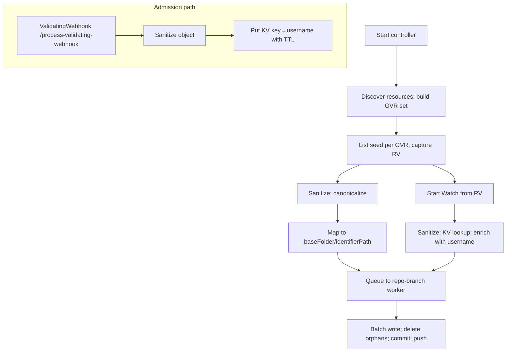

# GitOps Reverser: Cluster-as-Source-of-Truth — concise plan

Purpose
- Make the live cluster the source of truth using List + Watch
- Keep Git clean, deterministic, and scoped under a baseFolder per destination
- Retain the validating webhook permanently for username capture
- Keep configuration minimal with strong defaults; bytes trigger fixed at 1 MiB
- Alpha posture: no migration/compat constraints; prioritize simplest viable surfaces

Why both ValidatingWebhook and Watch
- ValidatingWebhook: reliable admission username for commit authorship/metadata; retained permanently (FailurePolicy=Ignore, leader-only); see [cmd.main()](cmd/main.go:1) and [webhook.event_handler()](internal/webhook/event_handler.go:1)
- Watch: durable system-of-record that a change actually persisted into etcd; webhook calls can be dropped/rejected
- Ordering caveat: Kubernetes provides different resourceVersion values and no cross-stream ordering guarantees. We never order across signals; we correlate by sanitized identity/content equivalence

Executive summary
- Ingest via List + Watch; object state comes from the API server, not admission paths
- Username attribution comes from the validating webhook; we correlate on sanitized object identity
- Write canonical YAML to Git at /{baseFolder}/{identifierPath}; one K8s object per file
- One worker per (repoURL,branch), dedicated clone, batching by count, time, and bytes (1 MiB)
- Minimal configuration; orphan deletes are immediate (no caps) — Git history provides revert safety

Current state (2025-10-16)
- Dynamic informers for discovered GVRs: [watch.startDynamicInformers()](internal/watch/informers.go:48), handlers: [watch.addHandlers()](internal/watch/informers.go:82), events: [watch.handleEvent()](internal/watch/informers.go:105)
- Initial List-based seed enqueues UPDATEs: [watch.Manager.seedSelectedResources()](internal/watch/manager.go:185)
- Worker and Git pipeline reused: dispatch: [git.Worker.dispatchEvents()](internal/git/worker.go:92), process: [git.Worker.processRepoEvents()](internal/git/worker.go:178), push with retry: [git.Repo.TryPushCommits()](internal/git/git.go:181)
- Username capture via webhook retained at /process-validating-webhook, see [cmd.main()](cmd/main.go:1) and [webhook.event_handler()](internal/webhook/event_handler.go:1)
- Pending: orphan deletes (uncapped), GitDestination baseFolder prefixing, correlation store, periodic discovery refresh

Dual-signal correlation design (authoritative)
- Goal: enrich watch events with the admission username without relying on resourceVersion ordering
- Sanitization first: both webhook objects and watch objects sanitize via [sanitize.MarshalToOrderedYAML()](internal/sanitize/marshal.go:31) and [sanitize.Sanitize()](internal/sanitize/sanitize.go:1)
- Keying: ResourceIdentifier (GVK/ns/name) + Operation (CREATE|UPDATE|DELETE) + short hash of sanitized spec; identifier via [types.ResourceIdentifier.ToGitPath()](internal/types/identifier.go:62)
- Store: on webhook admission, write {key → {username, ts}} to an in-memory KV with TTL (~60s) + LRU bounds
- Lookup: on watch event, sanitize + key + GetAndDelete; on hit, enrich event with username; on miss, use bot/UnknownUser
- Guarantees: no cross-system ordering; we correlate by identity+content within a small time window
- Metrics: enrich_hits_total, enrich_misses_total, kv_evictions_total (export in [metrics.exporter](internal/metrics/exporter.go:1))

High-level architecture

CRDs in-scope (alpha, simplified)
- GitRepoConfig (namespaced): repoUrl, allowedBranches, secretRef (optional); see [api.gitrepoconfig types](api/v1alpha1/gitrepoconfig_types.go:1)
- GitDestination (namespaced, prioritized): repoRef (to GitRepoConfig), branch (∈ allowedBranches), baseFolder (relative POSIX path)
  - No exclusiveMode for now
- WatchRule (namespaced): destinationRef, rules[] (operations?, apiGroups?, apiVersions?, resources)
  - No objectSelector
- ClusterWatchRule (cluster): destinationRef, rules[] (as above + scope=Cluster|Namespaced)
  - No namespaceSelector
- No accessPolicy fields anywhere in MVP (move policy ideas to “Out of scope” in spec)

Defaults and caps (fixed, minimal)
- Watch config: resourceVersionMatch=NotOlderThan; allowWatchBookmarks=true; backoff=500ms..30s
- Discovery: refresh=5m; watchAll=false; built-in excludes (pods, events, endpoints, endpointslices, leases, controllerrevisions, flowcontrol*, jobs, cronjobs)
- Batching: maxFiles=200, maxBytes=1MiB, maxWaitSec=20
- Deletes: no cap (immediate orphan deletes); Git is your safety net
- Workers: maxPerRepo=5, maxGlobal=24; workDir=/var/cache/gitops-reverser

Desired-state preset (default include)
- apps: deployments, statefulsets, daemonsets
- core: services, configmaps, secrets, serviceaccounts, resourcequotas, limitranges
- networking.k8s.io: ingresses, networkpolicies
- rbac.authorization.k8s.io: roles, rolebindings, clusterroles, clusterrolebindings
- policy: poddisruptionbudgets
- apiextensions.k8s.io: customresourcedefinitions
- apiregistration.k8s.io: apiservices
- scheduling.k8s.io: priorityclasses
- storage.k8s.io: storageclasses
Default exclude: pods, events, endpoints, endpointslices, leases, controllerrevisions, flowschemas, prioritylevelconfigurations, jobs, cronjobs

Reconciliation algorithm (concise)
- Seed: List selected GVRs; sanitize; build S_live; enqueue upserts
- Orphans: compute S_git under baseFolder; delete S_git − S_live (uncapped)
- Trail: Watch from captured RV; sanitize; KV-enrich; enqueue upserts/deletes; on Expired re-list and recompute deletes
- Idempotency: no semantic change ⇒ no commit

Git operations (go-git)
- Fast-forward pushes; on reject: fetch tip, reset --hard, reapply, push; see [git.Repo.TryPushCommits()](internal/git/git.go:181)
- No merges; rebase-like replay; commit trailers for audit

Observability
- Metrics: objects_scanned_total, objects_written_total, files_deleted_total, commits_total, commit_bytes_total, rebase_retries_total, repo_branch_active_workers, repo_branch_queue_depth, enrich_hits_total, enrich_misses_total, kv_evictions_total — exporter: [metrics.exporter](internal/metrics/exporter.go:1)
- Logs: identifiers, destination, enrichment result, commit SHAs; Events for key actions

Security and RBAC (chart)
- list/watch for desired-state resources
- events: create, patch
- configbutler.ai: watchrules, clusterwatchrules, gitrepoconfigs, gitdestinations (get, list, watch)
- secrets: get (repo creds)
- Templates: [charts/rbac.yaml](charts/gitops-reverser/templates/rbac.yaml)

Helm and flags (minimal)
- --enable-watch-ingestion
- --discovery-refresh=5m, --watch-all=false, repeated --discovery-exclude=...
- --git-batch-max-files=200, --git-batch-max-bytes-mib=1, --git-batch-max-wait-sec=20
- --workers-max-global=24, --workers-max-per-repo=5
- --work-dir=/var/cache/gitops-reverser
- Values wiring in [charts/deployment.yaml](charts/gitops-reverser/templates/deployment.yaml:1) and [charts/values.yaml](charts/gitops-reverser/values.yaml:1)

Testing and CI gates (mandatory)
- make lint, make test, make test-e2e; Docker required for e2e; see [Makefile](Makefile:1)

Tests (focus on in-scope)
- Correlation
  - Unit: sanitize equivalence (webhook vs watch); deterministic key; TTL/LRU; no dependence on resourceVersion ordering
  - Integration: webhook put → watch hit; dropped webhook → miss; metrics for hits/misses/evictions; commit trailers reflect username on hits
  - E2E: high-rate updates; enrichment hit rate within TTL; stable throughput; no deadlocks
- GitDestination + baseFolder
  - Unit: path prefixing correctness; no base path traversal; single-object-per-file
  - Integration: writes land under baseFolder; seed + deletes → convergence; second run → no-op

Alpha posture
- No migration/compat concerns — we will break surfaces to keep MVP simple and coherent

Key references
- Manager: [watch.Manager.Start()](internal/watch/manager.go:66), seed: [watch.Manager.seedSelectedResources()](internal/watch/manager.go:185)
- Informers: [watch.startDynamicInformers()](internal/watch/informers.go:48), [watch.addHandlers()](internal/watch/informers.go:82), [watch.handleEvent()](internal/watch/informers.go:105)
- Identifier mapping: [types.ResourceIdentifier.ToGitPath()](internal/types/identifier.go:62)
- Worker: dispatch: [git.Worker.dispatchEvents()](internal/git/worker.go:92), loop: [git.Worker.processRepoEvents()](internal/git/worker.go:178), buffer: [git.Worker.handleNewEvent()](internal/git/worker.go:300), ticker: [git.Worker.handleTicker()](internal/git/worker.go:323), commit: [git.Worker.commitAndPush()](internal/git/worker.go:338)
- Git push: [git.Repo.TryPushCommits()](internal/git/git.go:181)
- Webhook: [webhook.event_handler()](internal/webhook/event_handler.go:1), charts: [charts/validating-webhook.yaml](charts/gitops-reverser/templates/validating-webhook.yaml:1)

Status marker
- Watch ingestion active; seed enqueues UPDATEs; webhook retained for username; 1 MiB batch bytes trigger selected
- Plan aligned to in-scope items: GitDestination (no exclusiveMode), simplified CRDs (no accessPolicy/selectors), uncapped deletes, correlation store, and discovery refresh

## Execution checklist and work‑order template

Use this section to drive incremental delivery. For every part:
- Always deliver tests with the code (unit, integration, e2e where applicable)
- Update this plan and the spec upon completion
- Keep changes minimal and in scope for the chosen part

Per delivery checklist (tick all before merge)
- [ ] Scope: implement exactly one part from the backlog below
- [ ] Code: edits localized to relevant files (anchor references kept current)
- [ ] Unit tests added/updated to prove behavior
- [ ] Integration tests added/updated where cross‑component behavior applies
- [ ] E2E scenario added/updated when user‑visible behavior changes
- [ ] Docs updated: this plan and the spec reflect the new state and anchors
- [ ] Lint/tests/e2e: make lint, make test, make test-e2e all pass (see [Makefile](Makefile:1))
- [ ] Links verified: function/file anchors remain clickable (e.g., [watch.Manager.seedSelectedResources()](internal/watch/manager.go:185), [types.ResourceIdentifier.ToGitPath()](internal/types/identifier.go:62))

Backlog of parts (pick one per PR)
- [ ] GitDestination CRD (prioritized)
  - Types + CRD: repoRef, branch, baseFolder only (no exclusiveMode)
  - Samples in charts/examples
  - Tests:
    - Unit: API defaulting/validation; namespaced referencing to GitRepoConfig
    - Integration: resolving destination→repo (repoUrl/branch), failure on missing repo
- [ ] BaseFolder prefix in write path
  - Prefix BaseFolder before [types.ResourceIdentifier.ToGitPath()](internal/types/identifier.go:62) inside [git.Repo.generateLocalCommits()](internal/git/git.go:231)
  - Tests:
    - Unit: path join correctness; guard against path traversal
    - Integration: writes land under baseFolder; second run is no‑op
- [ ] Correlation KV store (sanitize+key; enrich watch with username)
  - Webhook Put on admission: [webhook.event_handler()](internal/webhook/event_handler.go:1)
  - Watch GetAndDelete on event: [watch.handleEvent()](internal/watch/informers.go:105)
  - Metrics: enrich_hits_total, enrich_misses_total, kv_evictions_total via [metrics.exporter](internal/metrics/exporter.go:1)
  - Tests:
    - Unit: sanitize equivalence ([sanitize.MarshalToOrderedYAML()](internal/sanitize/marshal.go:31)); key determinism; TTL/LRU; independence from resourceVersion ordering
    - Integration: admission→watch enrichment under load; dropped admission → miss
- [ ] Orphan deletes (uncapped)
  - Compute S_live in seed ([watch.Manager.seedSelectedResources()](internal/watch/manager.go:185)); compute S_git in worker; delete S_git − S_live
  - Tests:
    - Integration: seed→writes+deletes; second run→no‑op; unmanaged paths preserved
    - E2E: convergence under real cluster+repo
- [ ] Batch bytes cap enforcement (1 MiB)
  - Enforce alongside maxFiles=200 and maxWait=20s inside [git.Worker.handleNewEvent()](internal/git/worker.go:300) and [git.Worker.handleTicker()](internal/git/worker.go:323)
  - Tests:
    - Unit: flush by bytes threshold with synthetic objects
    - Integration: mixed sizes respect count/bytes/time triggers
- [ ] Periodic discovery refresh (5m) + add/remove informers
  - Refresh loop in manager: [watch.Manager.Start()](internal/watch/manager.go:66); filter via [watch.FilterDiscoverableGVRs()](internal/watch/discovery.go:44)
  - Tests:
    - Integration: CRD add/remove starts/stops informers without restart
- [ ] RBAC/flags minimal surfacing
  - Chart args wired for existing flags; RBAC allow desired‑state baseline + events
  - Tests:
    - E2E: controller starts with flags; can list/watch baseline resources

Work‑order template (paste into your request to execute one part)
- Title: Implement &lt;Part Name&gt; (single‑scope PR)
- Code edits:
  - Files/functions to touch:
    - (e.g.) [git.Repo.generateLocalCommits()](internal/git/git.go:231), [watch.handleEvent()](internal/watch/informers.go:105), [webhook.event_handler()](internal/webhook/event_handler.go:1)
  - Acceptance behavior:
    - Describe the precise observable outcome for this part
- Tests (deliver with PR):
  - Unit:
    - List concrete cases and expected outcomes
  - Integration:
    - Describe the scenario across components and expected repository side‑effects
  - E2E (when applicable):
    - Outline the end‑to‑end behavior to validate in [test.e2e](test/e2e/e2e_test.go:1)
- Docs:
  - Update this plan (check off the backlog item) and the spec (scope and anchors)
- Gates:
  - make lint; make test (&gt;90% coverage for new code); make test-e2e (Docker/Kind)
- Link check:
  - Verify all anchors in this plan/spec remain valid (e.g., [watch.startDynamicInformers()](internal/watch/informers.go:48), [git.Worker.processRepoEvents()](internal/git/worker.go:178))

Usage pattern
- Pick one unchecked backlog item
- Paste the Work‑order template, filled with specifics, to request implementation
- On completion, tick the backlog item here and update the spec’s scope/status marker
