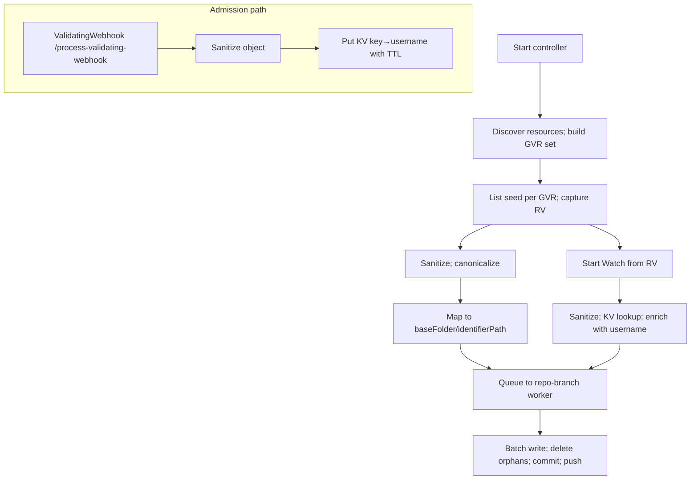

# GitOps Reverser: Cluster-as-Source-of-Truth — concise plan

Purpose
- Make the live cluster the source of truth using List + Watch
- Keep Git clean, deterministic, and scoped under a baseFolder per destination
- Retain the validating webhook permanently for username capture
- Keep configuration minimal with strong defaults; bytes trigger fixed at 1 MiB
- Alpha posture: no migration/compat constraints; prioritize simplest viable surfaces

Why both ValidatingWebhook and Watch
- ValidatingWebhook: reliable admission username for commit authorship/metadata; retained permanently (FailurePolicy=Ignore, leader-only); see [cmd.main()](cmd/main.go:1) and [webhook.event_handler()](internal/webhook/event_handler.go:1)
- Watch: durable system-of-record that a change actually persisted into etcd; webhook calls can be dropped/rejected
- Ordering caveat: Kubernetes provides different resourceVersion values and no cross-stream ordering guarantees. We never order across signals; we correlate by sanitized identity/content equivalence

Executive summary
- Ingest via List + Watch; object state comes from the API server, not admission paths
- Username attribution comes from the validating webhook; we correlate on sanitized object identity
- Write canonical YAML to Git at /{baseFolder}/{identifierPath}; one K8s object per file
- One worker per (repoURL,branch), dedicated clone, batching by count, time, and bytes (1 MiB)
- Minimal configuration; orphan deletes are immediate (no caps) — Git history provides revert safety

Current state (as of 2025-10-16 analysis)

**Implemented (verified in codebase):**
- ✓ Dynamic informers for discovered GVRs: [watch.startDynamicInformers()](internal/watch/informers.go:48), [watch.addHandlers()](internal/watch/informers.go:82), [watch.handleEvent()](internal/watch/informers.go:105)
- ✓ Initial List-based seed enqueues UPDATEs: [watch.Manager.seedSelectedResources()](internal/watch/manager.go:190)
- ✓ Worker and Git pipeline: [git.Worker.dispatchEvents()](internal/git/worker.go:115), [git.Worker.processRepoEvents()](internal/git/worker.go:211), [git.Repo.TryPushCommits()](internal/git/git.go:181)
- ✓ Username capture via webhook at /process-validating-webhook: [webhook.event_handler()](internal/webhook/event_handler.go:62)
- ✓ GitDestination DestinationRef wiring with baseFolder: events carry BaseFolder, paths use /{baseFolder}/{identifierPath}
- ✓ Orphan detection implemented: [git.Worker.computeOrphanDeletes()](internal/git/worker.go:599) with SEED_SYNC control events
- ✓ Byte-based batching tracking: [git.Worker.handleIncomingEvent()](internal/git/worker.go:385) accumulates bufferByteCount

**Gaps identified:**
- ❌ **Correlation KV store**: No implementation exists; webhook captures username but watch path has no enrichment logic
- ⚠️ **Batch bytes cap**: Implemented but defaults to 10 MiB ([worker.go:62](internal/git/worker.go:62)), spec mandates fixed 1 MiB
- ⚠️ **Orphan deletes**: Implemented but capped at 500/cycle ([worker.go:72](internal/git/worker.go:72)), spec says "uncapped"
- ❌ **Periodic discovery refresh**: No 5-minute loop to add/remove informers dynamically
- ⚠️ **Correlation metrics**: Missing enrich_hits_total, enrich_misses_total, kv_evictions_total from [metrics/exporter.go](internal/metrics/exporter.go:1)

Dual-signal correlation design (authoritative)
- Goal: enrich watch events with the admission username without relying on resourceVersion ordering
- Sanitization first: both webhook objects and watch objects sanitize via [sanitize.MarshalToOrderedYAML()](internal/sanitize/marshal.go:31) and [sanitize.Sanitize()](internal/sanitize/sanitize.go:1)
- Keying: ResourceIdentifier (GVK/ns/name) + Operation (CREATE|UPDATE|DELETE) + short hash of sanitized spec; identifier via [types.ResourceIdentifier.ToGitPath()](internal/types/identifier.go:62)
- Store: on webhook admission, write {key → {username, ts}} to an in-memory KV with TTL (~60s) + LRU bounds
- Lookup: on watch event, sanitize + key + GetAndDelete; on hit, enrich event with username; on miss, use bot/UnknownUser
- Guarantees: no cross-system ordering; we correlate by identity+content within a small time window
- Metrics: enrich_hits_total, enrich_misses_total, kv_evictions_total (export in [metrics.exporter](internal/metrics/exporter.go:1))

High-level architecture


CRDs in-scope (alpha, simplified)
- GitRepoConfig (namespaced): repoUrl, allowedBranches, secretRef (optional); see [api.gitrepoconfig types](api/v1alpha1/gitrepoconfig_types.go:1)
- GitDestination (namespaced, prioritized): repoRef (to GitRepoConfig), branch (∈ allowedBranches), baseFolder (relative POSIX path)
  - No exclusiveMode for now
- WatchRule (namespaced): destinationRef, rules[] (operations?, apiGroups?, apiVersions?, resources)
  - No objectSelector
- ClusterWatchRule (cluster): destinationRef, rules[] (as above + scope=Cluster|Namespaced)
  - No namespaceSelector
- No accessPolicy fields anywhere in MVP (move policy ideas to “Out of scope” in spec)

Defaults and caps (fixed, minimal)
- Watch config: resourceVersionMatch=NotOlderThan; allowWatchBookmarks=true; backoff=500ms..30s
- Discovery: refresh=5m; watchAll=false; built-in excludes (pods, events, endpoints, endpointslices, leases, controllerrevisions, flowcontrol*, jobs, cronjobs)
- Batching: maxFiles=200, maxBytes=1MiB, maxWaitSec=20
- Deletes: no cap (immediate orphan deletes); Git is your safety net
- Workers: maxPerRepo=5, maxGlobal=24; workDir=/var/cache/gitops-reverser

Desired-state preset (default include)
- apps: deployments, statefulsets, daemonsets
- core: services, configmaps, secrets, serviceaccounts, resourcequotas, limitranges
- networking.k8s.io: ingresses, networkpolicies
- rbac.authorization.k8s.io: roles, rolebindings, clusterroles, clusterrolebindings
- policy: poddisruptionbudgets
- apiextensions.k8s.io: customresourcedefinitions
- apiregistration.k8s.io: apiservices
- scheduling.k8s.io: priorityclasses
- storage.k8s.io: storageclasses
Default exclude: pods, events, endpoints, endpointslices, leases, controllerrevisions, flowschemas, prioritylevelconfigurations, jobs, cronjobs

Reconciliation algorithm (concise)
- Seed: List selected GVRs; sanitize; build S_live; enqueue upserts
- Orphans: compute S_git under baseFolder; delete S_git − S_live (uncapped)
- Trail: Watch from captured RV; sanitize; KV-enrich; enqueue upserts/deletes; on Expired re-list and recompute deletes
- Idempotency: no semantic change ⇒ no commit

Git operations (go-git)
- Fast-forward pushes; on reject: fetch tip, reset --hard, reapply, push; see [git.Repo.TryPushCommits()](internal/git/git.go:181)
- No merges; rebase-like replay; commit trailers for audit

Observability
- Metrics: objects_scanned_total, objects_written_total, files_deleted_total, commits_total, commit_bytes_total, rebase_retries_total, repo_branch_active_workers, repo_branch_queue_depth, enrich_hits_total, enrich_misses_total, kv_evictions_total — exporter: [metrics.exporter](internal/metrics/exporter.go:1)
- Logs: identifiers, destination, enrichment result, commit SHAs; Events for key actions

Security and RBAC (chart)
- list/watch for desired-state resources
- events: create, patch
- configbutler.ai: watchrules, clusterwatchrules, gitrepoconfigs, gitdestinations (get, list, watch)
- secrets: get (repo creds)
- Templates: [charts/rbac.yaml](charts/gitops-reverser/templates/rbac.yaml)

Helm and flags (minimal)
- --enable-watch-ingestion
- --discovery-refresh=5m, --watch-all=false, repeated --discovery-exclude=...
- --git-batch-max-files=200, --git-batch-max-bytes-mib=1, --git-batch-max-wait-sec=20
- --workers-max-global=24, --workers-max-per-repo=5
- --work-dir=/var/cache/gitops-reverser
- Values wiring in [charts/deployment.yaml](charts/gitops-reverser/templates/deployment.yaml:1) and [charts/values.yaml](charts/gitops-reverser/values.yaml:1)

Testing and CI gates (mandatory)
- make lint, make test, make test-e2e; Docker required for e2e; see [Makefile](Makefile:1)

Tests (focus on in-scope)
- Correlation
  - Unit: sanitize equivalence (webhook vs watch); deterministic key; TTL/LRU; no dependence on resourceVersion ordering
  - Integration: webhook put → watch hit; dropped webhook → miss; metrics for hits/misses/evictions; commit trailers reflect username on hits
  - E2E: high-rate updates; enrichment hit rate within TTL; stable throughput; no deadlocks
- GitDestination + baseFolder
  - Unit: path prefixing correctness; no base path traversal; single-object-per-file
  - Integration: writes land under baseFolder; seed + deletes → convergence; second run → no-op

Alpha posture
- No migration/compat concerns — we will break surfaces to keep MVP simple and coherent

Key references
- Manager: [watch.Manager.Start()](internal/watch/manager.go:66), seed: [watch.Manager.seedSelectedResources()](internal/watch/manager.go:185)
- Informers: [watch.startDynamicInformers()](internal/watch/informers.go:48), [watch.addHandlers()](internal/watch/informers.go:82), [watch.handleEvent()](internal/watch/informers.go:105)
- Identifier mapping: [types.ResourceIdentifier.ToGitPath()](internal/types/identifier.go:62)
- Worker: dispatch: [git.Worker.dispatchEvents()](internal/git/worker.go:92), loop: [git.Worker.processRepoEvents()](internal/git/worker.go:178), buffer: [git.Worker.handleNewEvent()](internal/git/worker.go:300), ticker: [git.Worker.handleTicker()](internal/git/worker.go:323), commit: [git.Worker.commitAndPush()](internal/git/worker.go:338)
- Git push: [git.Repo.TryPushCommits()](internal/git/git.go:181)
- Webhook: [webhook.event_handler()](internal/webhook/event_handler.go:1), charts: [charts/validating-webhook.yaml](charts/gitops-reverser/templates/validating-webhook.yaml:1)

Status marker (updated 2025-10-16)
- Watch ingestion: ✓ Active with dynamic informers and seed listing
- Webhook: ✓ Retained for username capture at /process-validating-webhook
- BaseFolder: ✓ Fully wired from rules → destination → worker
- Orphan detection: ✓ Implemented with SEED_SYNC control events (currently capped at 500/cycle)
- Byte batching: ✓ Tracking implemented (currently defaults to 10 MiB vs spec's 1 MiB)
- **Next critical work**: Correlation KV store (dual-signal enrichment), then align batch bytes to 1 MiB and remove orphan caps

## Execution checklist and work‑order template

Use this section to drive incremental delivery. For every part:
- Always deliver tests with the code (unit, integration, e2e where applicable)
- Update this plan and the spec upon completion
- Keep changes minimal and in scope for the chosen part

Per delivery checklist (tick all before merge)
- [ ] Scope: implement exactly one part from the backlog below
- [ ] Code: edits localized to relevant files (anchor references kept current)
- [ ] Unit tests added/updated to prove behavior
- [ ] Integration tests added/updated where cross‑component behavior applies
- [ ] E2E scenario added/updated when user‑visible behavior changes
- [ ] Docs updated: this plan and the spec reflect the new state and anchors
- [ ] Lint/tests/e2e: make lint, make test, make test-e2e all pass (see [Makefile](Makefile:1))
- [ ] Links verified: function/file anchors remain clickable (e.g., [watch.Manager.seedSelectedResources()](internal/watch/manager.go:185), [types.ResourceIdentifier.ToGitPath()](internal/types/identifier.go:62))

Backlog of parts (prioritized by criticality and dependencies)

### Completed
- [x] **GitDestination CRD** (prioritized)
  - Types + CRD: repoRef, branch, baseFolder (no exclusiveMode per MVP)
  - CRDs in [api/v1alpha1/gitdestination_types.go](api/v1alpha1/gitdestination_types.go:1)
  - Generated manifests: [config/crd/bases/configbutler.ai_gitdestinations.yaml](config/crd/bases/configbutler.ai_gitdestinations.yaml:1)
  - Samples: [config/samples/configbutler.ai_v1alpha1_gitdestination.yaml](config/samples/configbutler.ai_v1alpha1_gitdestination.yaml:1)
  
- [x] **BaseFolder prefix in write path**
  - WatchRule/ClusterWatchRule → GitDestination → GitRepoConfig resolution chain
  - BaseFolder propagated via [eventqueue.Event](internal/eventqueue/queue.go:1)
  - Path prefixing in [git.Repo.generateLocalCommits()](internal/git/git.go:231)
  - Legacy GitRepoConfigRef fallback maintained for compatibility

### High Priority (Core Functionality)
- [ ] **Correlation KV store** (CRITICAL - dual-signal core)
  - **Scope**: Create internal/correlation package with in-memory KV (TTL ~60s, LRU bounded)
  - **Key generation**: ResourceIdentifier + Operation + hash(sanitized spec) via [sanitize.MarshalToOrderedYAML()](internal/sanitize/marshal.go:31)
  - **Webhook integration**: Put(key → {username, ts}) in [webhook.Handle()](internal/webhook/event_handler.go:62)
  - **Watch integration**: GetAndDelete(key) in [watch.handleEvent()](internal/watch/informers.go:105)
  - **Metrics**: Add enrich_hits_total, enrich_misses_total, kv_evictions_total to [metrics/exporter.go](internal/metrics/exporter.go:1)
  - **Tests**:
    - Unit: key determinism, TTL expiry, LRU eviction, sanitize equivalence
    - Integration: webhook→watch enrichment under load; dropped webhook → miss → metrics
    - E2E: high-rate updates; enrichment hit rate validation; commit trailers show username

- [ ] **Fix batch bytes cap to 1 MiB** (ALIGNMENT - spec compliance)
  - **Current**: DefaultMaxBytesMiB = 10, TestMaxBytesMiB = 1 in [worker.go:62-64](internal/git/worker.go:62)
  - **Required**: Change DefaultMaxBytesMiB to 1 (spec mandates "fixed batching bytes trigger = 1 MiB")
  - **Location**: [git.Worker.getMaxBytesMiB()](internal/git/worker.go:291)
  - **Tests**: Verify production flush at ~1 MiB in integration tests

- [ ] **Remove orphan delete cap** (ALIGNMENT - spec compliance)
  - **Current**: Capped at DefaultDeleteCapPerCycle=500 in [worker.go:72](internal/git/worker.go:72)
  - **Required**: Remove cap (spec: "Delete S_git − S_live (uncapped; Git history allows revert)")
  - **Location**: [git.Worker.computeOrphanDeletes()](internal/git/worker.go:599) and [git.Worker.getDeleteCapPerCycle()](internal/git/worker.go:591)
  - **Tests**: Integration test with >500 orphans; verify all deleted in single cycle

### Medium Priority (Operational Robustness)
- [ ] **Periodic discovery refresh** (5m interval)
  - **Scope**: Add 5-minute ticker to [watch.Manager.Start()](internal/watch/manager.go:66)
  - **Actions**: Re-run [ComputeRequestedGVRs()](internal/watch/manager.go:72) → [FilterDiscoverableGVRs()](internal/watch/discovery.go:44)
  - **Behavior**: Start new informers for added GVRs; stop removed ones (handle CRD lifecycle)
  - **Tests**:
    - Integration: Install CRD → verify new informer starts within 5m
    - Integration: Delete CRD → verify informer stops

- [ ] **RBAC/flags validation and completion**
  - **Scope**: Audit chart templates and flag wiring
  - **Files**: [charts/gitops-reverser/templates/rbac.yaml](charts/gitops-reverser/templates/rbac.yaml:1), [values.yaml](charts/gitops-reverser/values.yaml:1)
  - **Verify**: All flags from spec section 9 are wired; RBAC matches section 8 requirements
  - **Tests**: E2E with minimal RBAC; verify controller starts and operates correctly

## Implementation roadmap (recommended sequence)

### Phase 1: Core Dual-Signal Correlation (Highest Priority)
**Goal**: Enable webhook username enrichment of watch events via sanitization-based correlation

1. **Create correlation package**
   - New package: `internal/correlation/` with `store.go` and `store_test.go`
   - In-memory KV: sync.Map or mutex-protected map with entry struct {Username string, Timestamp time.Time}
   - TTL: ~60 seconds (configurable)
   - LRU: Bounded size (e.g., 10,000 entries max)
   - Key format: `{GVK}/{namespace}/{name}:{operation}:{specHash}` where specHash = first 8 chars of SHA256(sanitized YAML)

2. **Integration points**
   - Webhook path: In [`webhook.EventHandler.Handle()`](internal/webhook/event_handler.go:62), after sanitization, compute key and Put(key, {username, now})
   - Watch path: In [`watch.handleEvent()`](internal/watch/informers.go:105), after sanitization, compute key and GetAndDelete(key); on hit, populate UserInfo; on miss, use empty UserInfo
   - Wire store instance through Manager and EventHandler constructors

3. **Add correlation metrics**
   - Update [`internal/metrics/exporter.go`](internal/metrics/exporter.go:1):
     ```go
     EnrichHitsTotal metric.Int64Counter
     EnrichMissesTotal metric.Int64Counter
     KVEvictionsTotal metric.Int64Counter
     ```
   - Increment in correlation store and watch handler

4. **Tests**
   - Unit: Key determinism (same object → same key), TTL expiry, LRU eviction, sanitize equivalence between webhook and watch objects
   - Integration: Webhook admission followed by watch event within TTL → enrichment hit; dropped webhook → miss and metric increment
   - E2E: High-rate create/update/delete; verify enrichment hit rate >80% within TTL window; check commit trailers contain username

**Success criteria**: `make test` and `make test-e2e` pass; enrichment metrics show hits for correlated events; commit authors reflect admission usernames

---

### Phase 2: Spec Alignment (Medium Priority)
**Goal**: Align implementation defaults with specification

5. **Fix batch bytes cap to 1 MiB**
   - Change [`DefaultMaxBytesMiB`](internal/git/worker.go:62) from 10 to 1
   - Keep `TestMaxBytesMiB = 1` for test consistency
   - Update integration tests to verify 1 MiB production flush threshold

6. **Remove orphan delete cap**
   - Remove cap logic from [`computeOrphanDeletes()`](internal/git/worker.go:599)
   - Remove [`getDeleteCapPerCycle()`](internal/git/worker.go:591) or set to unlimited
   - Update tests to handle >500 orphan deletes in single SEED_SYNC cycle
   - Document Git history as revert safety mechanism

**Success criteria**: Batching flushes at ~1 MiB; orphan deletion handles thousands of files in single cycle

---

### Phase 3: Dynamic Discovery (Lower Priority)
**Goal**: Handle CRD lifecycle without controller restart

7. **Periodic discovery refresh**
   - Add 5-minute ticker to [`watch.Manager.Start()`](internal/watch/manager.go:66)
   - On tick: Re-run GVR computation and filtering
   - Compare new vs. current GVR sets: start informers for added GVRs, stop for removed GVRs
   - Track active informers (map[GVR]cancelFunc) for lifecycle management

8. **Tests**
   - Integration: Install CRD → verify new informer active within 5 minutes
   - Integration: Delete CRD → verify informer stops gracefully
   - E2E: Full lifecycle with Custom Resource instances

**Success criteria**: Controller adapts to CRD changes without restart; no resource leaks

---

### Phase 4: Validation and Polish (Ongoing)
**Goal**: Ensure production readiness

9. **RBAC audit**
   - Verify [`charts/gitops-reverser/templates/rbac.yaml`](charts/gitops-reverser/templates/rbac.yaml:1) matches spec section 8
   - Ensure minimal permissions (list/watch for desired-state, events create/patch)

10. **Flag wiring**
    - Audit all flags from spec section 9 are exposed via [`charts/gitops-reverser/values.yaml`](charts/gitops-reverser/values.yaml:1)
    - Test with non-default values

11. **Documentation**
    - Update this plan after each phase completion
    - Keep spec status marker current
    - Maintain anchor links (function/file references)

---

## Usage pattern
- Pick one task from the roadmap (start with Phase 1)
- Implement with tests (unit, integration, e2e as applicable)
- Run `make lint && make test && make test-e2e` before considering complete
- Update this plan: mark item complete, update "Current state" and "Status marker" sections
- Update [`docs/cluster-source-of-truth-spec.md`](docs/cluster-source-of-truth-spec.md:1) if architectural changes made
