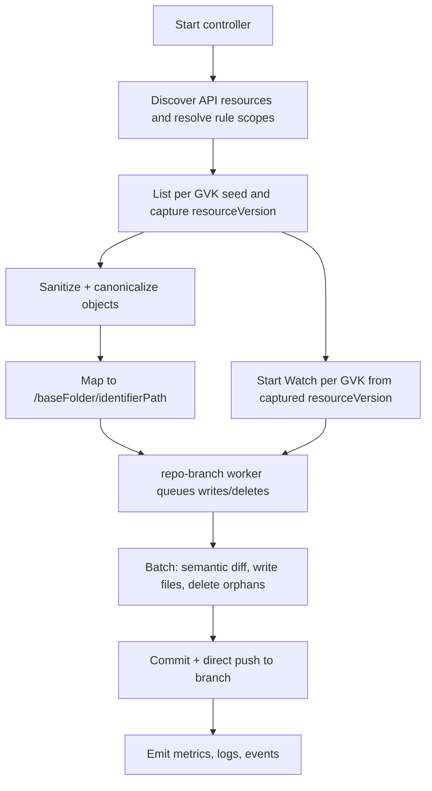

# GitOps Reverser: Cluster-as-Source-of-Truth with watch-based ingestion and baseFolder ownership
> Update: Retain validating webhook for username capture (permanent)
>
> We will keep a minimal validating webhook operational to capture the admission username for commit metadata. Concretely:
> - Keep the validating webhook registered at path /process-validating-webhook (see [cmd/main.go](cmd/main.go))
> - Keep Helm ValidatingWebhookConfiguration and Kustomize webhook manifests in place
> - Keep FailurePolicy=Ignore and leader-only service routing
> - Continue watch-based ingestion work behind --enable-watch-ingestion
> - No decommission is planned; the webhook is required to capture user identity reliably

This document is a single, cohesive plan for evolving gitops-reverser to:
- Treat the live Kubernetes cluster as the authoritative source of truth for a configured scope.
- Ingest state via Kubernetes List + Watch (not admission webhooks), enabling deterministic bootstrap and incremental trailing.
- Own a baseFolder (baseFolder) per destination, writing directly to Git branches without PR gating.
- Simplify repository configuration by introducing GitDestination and slimming GitRepoConfig.
- Focus by default on “desired-state” resources (e.g., Deployments, Services, RBAC, CRDs), excluding runtime-heavy objects (e.g., Pods, Events).
- Retain a minimal ValidatingWebhookConfiguration for username capture; primary state ingestion is via List + Watch.

References (current code and charts)
- CRDs: [api/v1alpha1/watchrule_types.go](api/v1alpha1/watchrule_types.go), [api/v1alpha1/clusterwatchrule_types.go](api/v1alpha1/clusterwatchrule_types.go), [api/v1alpha1/gitrepoconfig_types.go](api/v1alpha1/gitrepoconfig_types.go)
- Mapping: [internal/types/identifier.go](internal/types/identifier.go)
- Git operations: [internal/git/git.go](internal/git/git.go), [internal/git/worker.go](internal/git/worker.go)
- Event queue: [internal/eventqueue/queue.go](internal/eventqueue/queue.go)
- Sanitization: [internal/sanitize/marshal.go](internal/sanitize/marshal.go)
- Controller scaffolding: [internal/controller/watchrule_controller.go](internal/controller/watchrule_controller.go), [internal/controller/clusterwatchrule_controller.go](internal/controller/clusterwatchrule_controller.go)
- Helm chart: [charts/gitops-reverser/templates/](charts/gitops-reverser/templates/)
- Webhook code to be removed: [internal/webhook/event_handler.go](internal/webhook/event_handler.go), [config/webhook/](config/webhook/kustomization.yaml), [charts/gitops-reverser/templates/validating-webhook.yaml](charts/gitops-reverser/templates/validating-webhook.yaml)

## Executive summary

- Ingestion: adopt watch-based ingestion (List + Watch) per selected GVK; retain a minimal validating webhook solely for username capture (not for object ingestion).
- Scope and ownership: a rule selects resources; a destination defines repo branch and base folder (baseFolder). The controller writes files under /{baseFolder}/{identifierPath} using canonicalization and semantic diffing.
- Git model: direct pushes (no PR gating). Support multiple branches in a single repository via multiple destinations. repo-branch worker with a dedicated clone, batching writes and commits.
- Defaults: performance-oriented parallelism with safety caps, leases for coordination, advisory repo marker, and robust metrics.
- By default, focus on “desired-state” objects to reduce noise and runtime churn; provide an opt-in “watch all” mode if needed.

## Objectives

- At startup, enumerate selected Kubernetes objects, canonicalize them, write or update Git files, and delete orphans under owned baseFolder.
- Continue trailing changes via Watch streams per GVK.
- Ensure idempotency (no-op on re-run if nothing changed).
- Avoid infinite loops with Flux/Argo via semantic equivalence and stable rendering.
- Provide clear concurrency, safety, RBAC, and observability.

## High-level architecture



## Core decisions

- Adopt List + Watch for object ingestion. Retain the minimal validating webhook solely for username capture; keep webhook code, chart templates, and tests.
- Default to desired-state resources. Provide explicit inclusion/exclusion semantics aligned with experienced Kubernetes users’ expectations.
- GitDestination (namespaced) configures repo branch and baseFolder (baseFolder), and access policy. GitRepoConfig becomes a connectivity/auth resource and gatekeeper for allowed branches.
- Direct push, multi-branch capable, repo-branch worker with dedicated clone. Last-writer-wins at Git level (with coordination measures).
- Ownership safeguards: Kubernetes Leases per destination; optional marker file under baseFolder; commit trailers for traceability.

## API design

### GitRepoConfig (slimmed)
- Remove: spec.branch
- Add: spec.allowedBranches []string
- Keep: repoUrl, secretRef, push strategy (timers/thresholds if used), accessPolicy for who may reference this repo (but move write-behavior policy to destination)
- File: [api/v1alpha1/gitrepoconfig_types.go](api/v1alpha1/gitrepoconfig_types.go)

### GitDestination (new, namespaced)
- Purpose: bind a GitRepoConfig to a writable branch and base path (baseFolder), and hold repo-branch access/write policy.
- Spec fields (MVP):
  - repoRef: NamespacedName of GitRepoConfig
  - branch: string (must be in GitRepoConfig.spec.allowedBranches)
  - baseFolder: string (baseFolder base folder)
  - accessPolicy: write/access behavior moved down from GitRepoConfig (namespaces allowed to reference, cluster rules permission)
  - exclusiveMode: bool (default false) — if true, enforce repo marker ownership; else warn and continue
- Removed (as requested): allowedPaths, writeMode, conflictPolicy (document defaults)
- Controller behavior: each rule can reference one or many destinations (MVP: one recommended), writing under /{baseFolder}/{identifierPath}

### WatchRule and ClusterWatchRule (defaults aligned with “desired-state”)
- No schema-breaking changes required for MVP. However, we set defaults and enrich semantics in documentation:
  - If a rule does not specify Resources, default to DesiredState set (below).
  - Provide examples and guidance to mirror Kubernetes-style selection (groups, versions, resources wildcards).
- Files: [api/v1alpha1/watchrule_types.go](api/v1alpha1/watchrule_types.go), [api/v1alpha1/clusterwatchrule_types.go](api/v1alpha1/clusterwatchrule_types.go)

## Repository mapping

- Effective path: /{baseFolder}/{identifierPath}
- identifierPath generated via [internal/types/identifier.go](internal/types/identifier.go) using Kubernetes REST-style convention:
  - Namespaced: {group-or-core}/{version}/{resource}/{namespace}/{name}.yaml
  - Cluster-scoped: {group-or-core}/{version}/{resource}/{name}.yaml
- This preserves determinism and aligns with current tests and golden files.

## Ingestion: discovery-driven List + Watch

### Why watch (and not admission webhooks)?
- A watch-based model:
  - Deterministic bootstrap via List.
  - Trails changes reliably via Watch resourceVersion.
  - Eliminates webhook permissions, network exposure, and admission timing concerns.
  - Aligns with how controllers observe state rather than intercepting mutating requests.
- Decision: retain a minimal validating webhook exclusively for username capture; object ingestion uses List + Watch.

### Discovery
- Use server discovery to enumerate resources with list/watch verbs.
- Maintain a cache of ServerResources; refresh periodically (e.g., every 3m–5m).
- Construct shared informers (or controller-runtime caches) per selected GVK.

### Default resource focus: Desired-state set
- Aim: avoid runtime noise and keep Git focused on intended configuration.
- Default include (examples; actual list to be codified and versioned):
  - Workloads desired sources: deployments.apps, statefulsets.apps, daemonsets.apps, jobs.batch, cronjobs.batch
  - Services and ingress: services, ingresses.networking.k8s.io
  - Config: configmaps, secrets (tool syncs secrets as-is), serviceaccounts
  - Policy and security: networkpolicies.networking.k8s.io, poddisruptionbudgets.policy, podsecuritypolicies.policy (if present), RBAC (roles.rbac.authorization.k8s.io, rolebindings.rbac.authorization.k8s.io, clusterroles.rbac.authorization.k8s.io, clusterrolebindings.rbac.authorization.k8s.io)
  - Storage and infra config: storageclasses.storage.k8s.io, persistentvolumeclaims (optional), priorityclasses.scheduling.k8s.io
  - APIs and CRDs: customresourcedefinitions.apiextensions.k8s.io, apiservices.apiregistration.k8s.io
  - Namespaces (optional), resourcequotas, limitranges
- Default exclude (runtime/ephemeral/noisy):
  - pods, events (core and events.events.k8s.io), leases.coordination.k8s.io
  - endpoints, endpointslices.discovery.k8s.io
  - controllerrevisions.apps, flowschemas.flowcontrol.apiserver.k8s.io, prioritylevelconfigurations.flowcontrol.apiserver.k8s.io
- “Watch all” mode:
  - Disabled by default. When enabled, discover all list/watch-able resources, then subtract an exclusion list (configurable). Requires broader RBAC and resource caps.

### Rule defaults and expert tuning
- When users omit Rules.Resources:
  - WatchRule (namespaced): default to Desired-state set within the rule namespace.
  - ClusterWatchRule: default to Desired-state set cluster-wide (namespaced/cluster kinds accordingly).
- Experts can specify precise resources via:
  - apiGroups: ["", "apps", ...], apiVersions: ["v1", ...], resources: ["deployments", "roles", "clusterroles", ...] with “*” for broad selection as documented in rules.
- Provide ready-made “resource category” presets via documentation/values (not CRD schema) to map to curated lists (DesiredState, Runtime, All).

### Watch configuration
- resourceVersionMatch: NotOlderThan
- allowWatchBookmarks: true
- Backoff on watch restarts: exponential (500ms..30s)
- On Expired: re-list, resume from new resourceVersion

## Startup reconciliation and trailing

- List per GVK in scope to capture current state and a resourceVersion.
- Sanitize and canonicalize (drop runtime-only fields; optional defaulted fields when safe).
- Map to file paths, compute semantic diff with repo, write changed files and delete orphans under owned baseFolder.
- Commit batches and push direct.
- Start watches per GVK from captured resourceVersion and process deltas into the repo-branch queues.
- Idempotency: repeated runs without changes must be no-ops (no diffs, no commits).

## Canonicalization and semantic diffing

- Use sanitizer and stable YAML renderer:
  - Drop or normalize: status, managedFields, resourceVersion, UID, timestamps, observedGeneration.
  - Consider omission of defaulted fields where safe/derivable.
  - Stable key ordering, indentation; ignore presentational diffs.
- Utilities: [internal/sanitize/marshal.go](internal/sanitize/marshal.go)
- Golden tests ensure stability.

## Destinations, queues, and Git operations

- repo-branch worker key: (repoURL, branch).
- Working directory: dedicated clone per repo-branch worker (no branch switching).
  - Base path: /var/cache/gitops-reverser/{hash(repoURL,branch)}
  - Garbage-collect stale clones by last-used TTL policy.
- Batching: flush by thresholds (files, bytes) and time-based backstop.
- Git ops:
  - Fetch base, fast-forward pushes only; on reject: fetch/reset --hard, reapply, push.
  - Serialize writes within the worker; reads can be parallel across baseFolder trees.
- Multi-branch: handled by independent workers per branch for the same repo.
- Loop avoidance with Flux/Argo:
  - Commit only on semantic deltas.
  - Canonical rendering that aligns with downstream controllers as much as practical.
  - Optional ignore lists for commonly mutated annotations/fields.

## Ownership and anti-conflict safeguards

- Kubernetes Lease per repo-branch worker:
  - Name: hash(repoURL|branch)
  - Acquire before writes; renew periodically.
  - If lease is held by another identity, set Ready=False on associated rules/destinations (OwnershipConflict) and skip writes (policy-configurable).
- Repo marker file (optional; created once):
  - .configbutler/owner.yaml under baseFolder with: clusterUID, controller namespace/name, instance ID, timestamp.
  - exclusiveMode=false by default: warn on mismatch, continue.
  - exclusiveMode=true: refuse writes, set Ready=False with OwnershipConflict.
- Commit trailers for audit:
  - X-ConfigButler-ClusterUID
  - X-ConfigButler-ControllerNS
  - X-ConfigButler-ControllerName
  - X-ConfigButler-InstanceID

## Observability

- Metrics:
  - objects_scanned_total, objects_written_total, files_deleted_total
  - commits_total, commit_bytes_total, rebase_retries_total
  - ownership_conflicts_total, lease_acquire_failures_total, marker_conflicts_total
  - repo_branch_active_workers, repo_branch_queue_depth
- Logs: include object identifiers, destinations, commit SHAs.
- Kubernetes Events: major actions and conflicts.
- ServiceMonitor and TLS: keep existing chart support (metrics path unchanged).

## Security and RBAC (MVP)

- K8s API permissions
  - Read selected resources: get, list, watch (scope aligned to rules; “watch all” widens permissions).
  - coordination.k8s.io Leases: get, list, watch, create, update, patch, delete.
  - events: create, patch.
  - secrets: get (read Git credentials referenced by GitRepoConfig).
  - Namespaces: get (for access policy checks).
  - CRDs in configbutler.ai: get, list, watch (watchrules, clusterwatchrules, gitrepoconfigs, gitdestinations).
  - Status updates: watchrules/status, clusterwatchrules/status — get, update, patch.
- Helm:
  - Update RBAC in [charts/gitops-reverser/templates/rbac.yaml](charts/gitops-reverser/templates/rbac.yaml)
- Git security:
  - Credentials via Secret referenced by GitRepoConfig.Spec.SecretRef (HTTPS/SSH).
  - GitRepoConfig.allowedBranches enforces branch allowlist for destinations.
  - Commit identity: bot user configured via values; trailers included.

## Webhook retention policy (authoritative)

We retain a minimal validating webhook permanently to capture the admission username for commit metadata. The webhook is not used for object ingestion; all object ingestion is through List + Watch.
- Path and handler:
  - Registered at /process-validating-webhook (see [cmd/main.go](cmd/main.go))
  - Handler: [internal/webhook/event_handler.go](internal/webhook/event_handler.go)
- Charts and manifests:
  - Keep: [charts/gitops-reverser/templates/validating-webhook.yaml](charts/gitops-reverser/templates/validating-webhook.yaml)
  - Keep: [config/webhook/](config/webhook/kustomization.yaml) and related service/cert wiring
- Reliability and safety:
  - FailurePolicy=Ignore
  - Leader-only service routing
- Tests and docs:
  - Keep webhook-focused tests; document that webhook exists solely for username capture while watch-based ingestion handles state

## Testing and acceptance criteria

- Unit
  - Mapping stability (identifier.go).
  - Sanitization golden tests (stable YAML).
  - Discovery filter: resource inclusion/exclusion logic.
- Integration
  - Snapshot reconciliation writes files, deletes orphans; re-run is no-op.
  - Multi-branch destinations commit in parallel.
  - Lease acquisition behavior under simulated contention.
- E2E
  - Seeded repo + Kind cluster; watch-only ingestion; idempotency on second run.
  - Desired-state defaults: verify Pods and Events excluded by default; Deployments/Services included.
  - Overlap scenarios across rules and destinations produce expected last-writer behavior (with warnings).
- Acceptance
  - Validating webhook installed (FailurePolicy=Ignore; leader-only routing) and used solely for username capture.
  - Direct pushes only, multiple branches via destinations.
  - Immediate deletes under safety cap.
  - Metrics emitted as specified.

## Performance defaults (selected)

- exclusiveMode: false
- maxConcurrentDestinationsPerRepo: 5
- maxGlobalWorkers: 24
- Batch thresholds: maxFiles=200, maxBytesMiB=10, maxWaitSec=20
- deleteCapPerCycle: 500 per destination
- Leases: renewSec=8, leaseSec=24
- workDir base: /var/cache/gitops-reverser
- Watch config: bookmarks=true, rvMatch=NotOlderThan, backoff=exp 500ms..30s
- Checkout strategy: dedicated clone per repo-branch worker

## Implementation plan (sequenced)

1) API and types
- Add GitDestination CRD types next to [api/v1alpha1/gitrepoconfig_types.go](api/v1alpha1/gitrepoconfig_types.go)
- Update GitRepoConfig: remove spec.branch, add spec.allowedBranches
- Defaults and validation (kubebuilder tags) to match rules above
- Run make manifests; update [config/crd/bases/](config/crd/bases/)

2) Ingestion and discovery
- Implement discovery of server resources with list/watch
- Build informer/controller-runtime cache per selected GVK
- Encode “Desired-state” defaults; document “watch all” flag and default exclusions

3) Destination workers and git ops
- Implement repo-branch worker pool keyed by (repoURL, branch)
- Dedicated clones per repo-branch worker; batching; commit/push logic; safety caps
- Leases + optional marker; commit trailers

4) Webhook retention
- Keep webhook code and manifests; ensure FailurePolicy=Ignore and leader-only routing
- Admission path is used only to capture username; watch-based ingestion handles object state
- Ensure Helm/Kustomize templates and RBAC remain consistent with permanent webhook

5) RBAC and Helm
- Update RBAC to include Leases, Events, CRDs, Secrets get; remove webhook RBAC
- Add GitDestination CRD to chart CRDs
- Values for defaults (exclusions, discovery refresh, concurrency caps)

6) Tests and CI
- Unit and integration per above
- E2E: update to watch-only flows
- CI gating: make fmt/vet/generate/manifests/lint/test/test-e2e; Docker/Kind availability

7) Docs
- README and chart README; user guides for desired-state defaults, exclusions, “watch all” flag

## Open questions (track but not blocking MVP)

- Exact “Desired-state” resource list across distributions and API levels; ship as a versioned preset with overrides.
- Whether Jobs should be included by default (they are desired-state but can be noisy); default to include with optional exclusion.
- Default behavior for namespace/cluster-scoped CRs without matching CRD definition visibility; handle dynamically via discovery.

End of plan.

## Discovery defaults (MVP)

To complete the watch-based ingestion plan, these defaults are locked for discovery, exclusions, and informer limits. They prioritize desired-state resources and avoid runtime-heavy objects by default.

Defaults
- discoveryRefresh: 5m (periodic refresh of server resources list to capture new CRDs and API changes)
- watchAll: false (opt-in via flag; when enabled, still applies the exclusion list unless overridden)
- defaultExclusionList:
  - pods
  - events (core) and events.events.k8s.io
  - leases.coordination.k8s.io
  - endpoints (core) and endpointslices.discovery.k8s.io
  - controllerrevisions.apps
  - flowschemas.flowcontrol.apiserver.k8s.io
  - prioritylevelconfigurations.flowcontrol.apiserver.k8s.io
- informerCaps:
  - maxGVKs: 300 (upper bound on concurrently watched GVKs)
  - maxConcurrentInformers: 50 (cap on informer goroutines)
  - rate limits (per GVK cache client): qps=5, burst=10
- cacheStrategy: shared informers (cluster-wide); handlers apply rule-based filters
  - WatchRule handlers restrict by rule namespace (namespaced scope)
  - ClusterWatchRule handlers restrict by namespaceSelector or cluster scope as defined
- discoveryBackoff: exponential 1s..60s with jitter on discovery failures; metric for discovery_errors_total

Rule defaults aligned with desired-state focus
- When Rules.Resources are omitted:
  - WatchRule (namespaced) defaults to the Desired-state set within the WatchRule’s namespace
  - ClusterWatchRule defaults to the Desired-state set across the chosen scope (Cluster/Namespaced)
- Explicit inclusion required for runtime objects (e.g., “pods”); these are not included by default

## Webhook retention clarifications (scope and purpose)

Retain the validating webhook and related assets:
- Code/tests: keep [internal/webhook/event_handler.go](internal/webhook/event_handler.go) and tests
- Manifests: keep [config/webhook/](config/webhook/kustomization.yaml), [config/webhook/service.yaml](config/webhook/service.yaml), and related cert-manager assets
- Charts: keep [charts/gitops-reverser/templates/validating-webhook.yaml](charts/gitops-reverser/templates/validating-webhook.yaml) and necessary certificate wiring
- RBAC: keep webhook-related RBAC as required by the validating webhook; also retain Leases, Events, CRDs, Secrets get and status update permissions
- Docs/tests: document and validate that webhook is used only for username capture; watch-based ingestion handles object state

These defaults make watch-based ingestion a first-class, central part of the design (focusing on declarative desired-state resources and leaving runtime noise out by default) while retaining a validating webhook solely for username capture. References for mapping, rules, and controllers remain: [internal/types/identifier.go](internal/types/identifier.go), [api/v1alpha1/watchrule_types.go](api/v1alpha1/watchrule_types.go), [api/v1alpha1/clusterwatchrule_types.go](api/v1alpha1/clusterwatchrule_types.go), and the controller setup in [internal/controller/watchrule_controller.go](internal/controller/watchrule_controller.go) and [internal/controller/clusterwatchrule_controller.go](internal/controller/clusterwatchrule_controller.go).

## Finalized clarifications and CRD specification summary

This section consolidates final decisions and clarifies worker identity, startup behavior, git conflict policy with go-git, ownership markers, terminology, Desired-state defaults, and the planned CRD surfaces. It supersedes any earlier references that conflict with the points below.

### Worker identity and concurrency

- Worker key: Per-repo-branch, not per-folder. A single worker is keyed by (repoURL, branch).
  - Hash identity: hash(repoURL,branch)
  - A single worker can process multiple baseFolder trees for that repo/branch concurrently via its queue; file operations remain serialized within the worker to preserve ordering.
- Dedicated clone per worker: Each (repoURL, branch) worker keeps its own working directory checkout. Multiple GitDestination objects may target different baseFolder paths under the same worker.

Working directory layout
- baseDir: /var/cache/gitops-reverser (configurable)
- per worker: /var/cache/gitops-reverser/hash(repoURL,branch)

Metrics
- repo_branch_active_workers, repo_branch_queue_depth, commit_batches_total, push_retries_total

### Startup behavior, change events, and deletion detection

Seed and enqueue
- For each selected GVK, List() current objects and capture resourceVersion, then map to planned file paths under the target baseFolder(s) using [internal/types/identifier.go](internal/types/identifier.go).
- For each object, enqueue a desired “upsert” operation event to the worker keyed by (repoURL, branch). The event includes the baseFolder and the relative file path, along with the canonicalized content.
- The worker computes semantic diffs before any write; if no effective change, the event is a no-op.

Deletion detection
- Live set: S_live = { all file relative paths mapped from currently listed objects under each baseFolder }
- Repo set: S_git = { all tracked file relative paths presently under each baseFolder in the working tree }, filtered to the tool’s managed file extension(s) and ignoring the ownership marker path
- Orphans per baseFolder: S_orphan = S_git − S_live
- The worker enqueues delete operations for orphans, subject to deleteCapPerCycle. Deletions are batched and committed with writes when possible.
- Idempotency: After a full seed + cleanup, repeating the process yields S_orphan = ∅ and only no-ops.

Trailing changes
- Start Watch() per GVK from the captured resourceVersion (resourceVersionMatch=NotOlderThan, allowWatchBookmarks=true), enqueueing upsert/delete events as deltas arrive.
- On Expired watch: re-list, recompute S_live, and repeat the orphan detection.

### Git conflict resolution policy (go-git simplification)

Given go-git limitations, adopt the following policy per worker:
- Attempt fast-forward push after commit batches.
- On push reject (non fast-forward):
  - Reset: git fetch remote tip for branch, then reset --hard to remote tip.
  - Reapply: recompute current pending file operations (upserts/deletes) against the refreshed working tree, re-stage, re-commit.
  - Retry push.
- No merge tooling is attempted; behavior emulates a rebase by reapplying the current change set on top of the remote branch head.
- Commit identity and trailers remain intact across retries.

References: [internal/git/git.go](internal/git/git.go), [internal/git/worker.go](internal/git/worker.go)

### Ownership and anti-conflict markers

- Kubernetes Lease per repo-branch worker remains as the first line of concurrency control.
- Repository marker file is per GitDestination and lives inside the destination’s baseFolder:
  - Path: {baseFolder}/.configbutler/owner.yaml
  - Fields: clusterUID, controller namespace/name, instanceID, timestamp
  - exclusiveMode=false (default): warn on mismatch and continue; exclusiveMode=true: refuse writes and surface Ready=False on referencing rules
- Commit trailers: always added for audit (X-ConfigButler-ClusterUID, X-ConfigButler-ControllerNS, X-ConfigButler-ControllerName, X-ConfigButler-InstanceID)

### Terminology

- Remove the “baseFolder” term from this plan. The concept is fully represented as baseFolder in GitDestination.Spec.
- Anywhere “baseFolder” was previously mentioned, read as “baseFolder”.

### Desired-state preset v1.0 (defaults)

Focus on declarative desired-state resources and exclude runtime-noisy types by default. Users can override via rule Resources or enabling a “watch all” mode with exclusions list.

- Default include (examples):
  - Workloads desired sources: deployments.apps, statefulsets.apps, daemonsets.apps
  - Services and networking: services, ingresses.networking.k8s.io, networkpolicies.networking.k8s.io
  - Policy: poddisruptionbudgets.policy, RBAC (roles.rbac.authorization.k8s.io, rolebindings.rbac.authorization.k8s.io, clusterroles.rbac.authorization.k8s.io, clusterrolebindings.rbac.authorization.k8s.io)
  - Config: configmaps, secrets, serviceaccounts, resourcequotas, limitranges, priorityclasses.scheduling.k8s.io
  - API plumbing: customresourcedefinitions.apiextensions.k8s.io, apiservices.apiregistration.k8s.io
  - Storage and infra config: storageclasses.storage.k8s.io (PVCs optional; not default)
- Default exclude:
  - pods (core), events (core and events.events.k8s.io), leases.coordination.k8s.io
  - endpoints (core), endpointslices.discovery.k8s.io
  - controllerrevisions.apps, flowschemas.flowcontrol.apiserver.k8s.io, prioritylevelconfigurations.flowcontrol.apiserver.k8s.io
  - jobs.batch, cronjobs.batch (excluded by default per decision)

Watch-based ingestion remains the default for object ingestion; the MutatingWebhookConfiguration is retained solely for username capture.

### Planned CRDs and fields (MVP surfaces)

1) GitRepoConfig (Namespaced)
- Purpose: repository connectivity/auth and branch allowlisting; selector-based access control for who can reference the repo.
- Spec (key fields):
  - repoUrl: string
  - allowedBranches: []string
  - secretRef: [api/v1alpha1/gitrepoconfig_types.go:LocalObjectReference](api/v1alpha1/gitrepoconfig_types.go)
  - push: optional timing/queueing hints (unchanged)
  - accessPolicy:
    - namespacedRules.mode: SameNamespace | AllNamespaces | FromSelector
    - namespacedRules.namespaceSelector: LabelSelector (when mode=FromSelector)
    - allowClusterRules: bool (explicit opt-in for cluster-scoped rules)
- Status:
  - conditions[] (Ready, etc.), observedGeneration
- Behavior:
  - Enforced allowlist for branches that destinations may target
  - Controls which namespaces and whether cluster rules may reference this repo

2) GitDestination (Namespaced) — new
- Purpose: writable target composed of a repo reference, branch, and a baseFolder (the root folder to own within that branch).
- Spec (key fields):
  - repoRef: NamespacedName to GitRepoConfig (name+namespace)
  - branch: string (must be in GitRepoConfig.spec.allowedBranches)
  - baseFolder: string (folder path owned by this destination)
  - accessPolicy: same shape as GitRepoConfig.accessPolicy but applied at the destination layer to authorize which rules may reference this destination
  - exclusiveMode: bool (default false) — enforce repo marker ownership under baseFolder
- Status:
  - conditions[] (Ready/OwnershipConflict/…)
- Behavior:
  - A repo-branch worker handles all GitDestination(s) pointing to the same (repoURL, branch)
  - Ownership marker path is {baseFolder}/.configbutler/owner.yaml when exclusiveMode=true
  - Multiple destinations can share one repo-branch; they write to distinct baseFolder subtrees

3) WatchRule (Namespaced)
- Purpose: select namespaced resources within its namespace and write them to a referenced destination.
- Spec (key fields):
  - destinationRef: NamespacedName to GitDestination (MVP: a single destinationRef)
  - objectSelector: LabelSelector (optional)
  - rules[]: ResourceRule (operations, apiGroups, apiVersions, resources)
    - When resources omitted: defaults to Desired-state preset, namespaced scope only
- Status: conditions[] (Ready, AccessDenied, etc.)
- Access:
  - Must satisfy GitDestination.accessPolicy and GitRepoConfig.accessPolicy (namespace-based)
  - If destinationRef not allowed, set Ready=False with AccessDenied

4) ClusterWatchRule (Cluster)
- Purpose: select cluster-scoped resources and/or namespaced resources across multiple namespaces using namespaceSelector; write to a referenced destination.
- Spec (key fields):
  - destinationRef: NamespacedName to GitDestination (explicit namespace required)
  - rules[]: ClusterResourceRule (operations, apiGroups, apiVersions, resources, scope=Cluster|Namespaced, optional namespaceSelector)
    - When resources omitted: defaults to Desired-state preset across the specified scope
- Status: conditions[] (Ready, AccessDenied, etc.)
- Access:
  - GitRepoConfig.accessPolicy.allowClusterRules must be true
  - Must satisfy GitDestination.accessPolicy (destination’s namespace authorization)

Interaction summary (Kubernetes-expected semantics)
- Namespacing: WatchRule is namespaced and may only select resources in its own namespace; ClusterWatchRule is cluster-scoped and can select cluster or namespaced objects (optionally filtered by namespace labels).
- Authorization layering:
  - A rule may reference only destinations permitted by the destination’s accessPolicy and the underlying repo’s accessPolicy.
  - For cluster-scoped rules, GitRepoConfig.spec.accessPolicy.allowClusterRules must be true.
- Branch controls:
  - Only branches listed in GitRepoConfig.spec.allowedBranches may be targeted by destinations.
- Worker mapping:
  - All destinations targeting the same (repoURL, branch) share one worker/clone; baseFolder isolates their filesystem subtrees.

### Considerations (rationale-only, non-normative)

- We intentionally removed MutatingWebhookConfiguration-based ingestion to reduce coupling to admission paths and to guarantee deterministic bootstrapping via List + Watch.
- We simplified GitDestination by omitting writeMode, conflictPolicy, and allowedPaths fields; documented behavior covers direct push, last-writer-wins with leases/markers, and repo-branch authorization.
- We removed “baseFolder” terminology to reduce cognitive load; the single knob is baseFolder in GitDestination.

## CRD quick reference and interaction model

This section summarizes the planned CRD surfaces, fields, constraints, and how they interact, written for Kubernetes practitioners familiar with admission semantics, label selectors, and discovery.

Kinds and scope
- Group and version: configbutler.ai v1alpha1 for all kinds
- Kinds
  - GitRepoConfig: Namespaced
  - GitDestination: Namespaced
  - WatchRule: Namespaced
  - ClusterWatchRule: Cluster

GitRepoConfig
- Purpose: Repository connectivity and authorization boundary for who can reference a repo and which branches are writable via destinations
- Spec
  - repoUrl: string (required)
  - allowedBranches: []string (required when any destination references this repo)
  - secretRef: LocalObjectReference (optional) — credentials for HTTPS or SSH
  - push: PushStrategy (optional) — timing and batch hints
    - interval: string duration e.g. 1m (optional)
    - maxCommits: int (optional)
  - accessPolicy: AccessPolicy (optional)
    - namespacedRules: NamespacedRulesPolicy (optional)
      - mode: SameNamespace AllNamespaces FromSelector default SameNamespace
      - namespaceSelector: LabelSelector required when mode=FromSelector, must be nil otherwise
    - allowClusterRules: bool default false — explicit opt in for ClusterWatchRule access
- Status
  - conditions: []metav1.Condition
  - observedGeneration: int64
- Expectations
  - Enforces branch allowlisting: a destination pointing at this repo must choose a branch from allowedBranches
  - Enforces who may reference this repo: namespace scoping or selector based access; cluster rules require allowClusterRules true

GitDestination
- Purpose: Writable target that binds a repo, a branch, and an owned base folder tree under that branch
- Spec
  - repoRef: NamespacedName to GitRepoConfig name and namespace (required)
  - branch: string (required) must be in GitRepoConfig.spec.allowedBranches
  - baseFolder: string (required) root folder owned by this destination in the branch
  - accessPolicy: AccessPolicy (optional) — same shape as on GitRepoConfig, applied at destination layer to authorize which rules may reference this destination
  - exclusiveMode: bool default false — if true, enforces per destination ownership marker under baseFolder
- Status
  - conditions: []metav1.Condition (e.g., Ready OwnershipConflict)
- Expectations
  - Marker file path when exclusiveMode is true: {baseFolder}/.configbutler/owner.yaml
  - Multiple destinations can point to the same repo and branch; their baseFolder trees must not overlap
  - Authorization: a rule must be permitted by destination.accessPolicy and also by repo.accessPolicy

WatchRule
- Purpose: Namespaced rule that selects namespaced resources in its own namespace and writes them to a destination
- Spec
  - destinationRef: NamespacedName to GitDestination (required) defaults to this WatchRule namespace if ref.namespace omitted
  - objectSelector: LabelSelector (optional) — filters target objects by their labels in the namespace
  - rules: []ResourceRule (required, min 1) — selection by operations, apiGroups, apiVersions, resources
    - operations: []OperationType optional one of CREATE UPDATE DELETE * empty means all
    - apiGroups: []string optional "" for core "*" for all empty means all
    - apiVersions: []string optional "*" for all empty means all
    - resources: []string required examples "configmaps" "deployments" "pods/*" "*" exact plural names, supports subresource form kind/subresource matching Kubernetes webhook patterns, no prefix wildcards
- Status
  - conditions: []metav1.Condition
- Defaults and expectations
  - If resources is omitted in inputs or via future defaulting, default to Desired-state preset for namespaced kinds and exclude runtime kinds
  - May only operate in its own namespace by design
  - Must satisfy destination.accessPolicy and repo.accessPolicy for authorization

ClusterWatchRule
- Purpose: Cluster scoped rule that can select cluster scoped resources and or namespaced resources across namespaces via a selector and write them to a destination
- Spec
  - destinationRef: NamespacedName to GitDestination (required) name and namespace are explicit
  - rules: []ClusterResourceRule (required, min 1)
    - operations: []OperationType optional as above
    - apiGroups: []string optional as above
    - apiVersions: []string optional as above
    - resources: []string required plural names and subresources as above
    - scope: Cluster Namespaced required indicates cluster scoped vs namespaced matching
    - namespaceSelector: LabelSelector optional only valid when scope is Namespaced
- Status
  - conditions: []metav1.Condition
- Defaults and expectations
  - If resources omitted in inputs or via future defaulting, default to Desired-state preset across chosen scope
  - Requires GitRepoConfig.spec.accessPolicy.allowClusterRules true
  - Must satisfy destination.accessPolicy for authorization

Interaction model
- Reference flow
  - WatchRule or ClusterWatchRule references a GitDestination via destinationRef
  - GitDestination internally references a GitRepoConfig via repoRef and branches must be allowed by that GitRepoConfig
- Authorization layering
  - A rule must be allowed by both destination.accessPolicy and repo.accessPolicy
  - For cluster scoped rules, repo.accessPolicy.allowClusterRules must be true
- Worker mapping and isolation
  - All destinations that share the same repoURL and branch are handled by one repo-branch worker keyed by hash(repoURL,branch)
  - Each destination writes only into its baseFolder within that branch
- Ownership and conflict handling
  - Lease per repo-branch worker to reduce contention
  - Optional per destination marker at {baseFolder}/.configbutler/owner.yaml with exclusiveMode enforcing or warning
  - Commits include trailers for traceability

Kubernetes semantics alignment
- LabelSelector semantics on objectSelector and namespaceSelector match Kubernetes conventions and are evaluated by the controller
- Resource matching follows Kubernetes admission webhook patterns for apiGroups, versions, and resource plural names including subresource form kind/subresource and wildcard "*" for all, not prefix wildcards
- Discovery is used to enumerate actual listable and watchable GVKs at runtime; rules that reference absent or non watchable GVKs will be no-ops with warnings
- Desired-state preset is opinionated and adjustable via explicit rule resources or a watch-all flag with exclusions

Startup and deletion model recap
- Seed lists build the live set S_live under each destination baseFolder; the worker computes S_orphan per baseFolder as S_git − S_live and enqueues deletes alongside upserts, capped by deleteCapPerCycle
- Trailing watches maintain convergence; re-list on Expired; idempotency ensures repeated runs with no semantic drift produce no commits

Git conflict handling recap
- Push after batching; on reject do fetch and reset --hard to remote tip, reapply pending changes, re-commit, and push again; no merge conflict resolution is attempted due to go-git limitations

## Addendum: webhook retention and decommission sequencing

This plan keeps the validating webhook temporarily to capture admission usernames for commit metadata while watch-based ingestion matures. Clarifications for sequencing:
- Retained now (FailurePolicy=Ignore; leader-only routing):
  - [charts/gitops-reverser/templates/validating-webhook.yaml](charts/gitops-reverser/templates/validating-webhook.yaml)
  - [config/webhook/kustomization.yaml](config/webhook/kustomization.yaml)
  - Controller handler bound at /process-validating-webhook (see [cmd/main.go](cmd/main.go))
- Removal stays planned but is gated on watch-only parity (see “Testing and acceptance criteria”). Decommission steps in this document are to be executed only after:
  - Watch-based ingestion reaches functional parity for targeted scopes
  - E2E passes in watch-only mode
  - RBAC/chart/docs are updated

Until then, both paths can co-exist with the watch path guarded by --enable-watch-ingestion.

## MVP deltas vs earlier bullets in this plan

- Worker key correction (supersedes earlier “repo-branch+baseFolder” wording):
  - Single worker per (repoURL, branch). Multiple baseFolder trees are serialized within that worker’s queue. See “Finalized clarifications.”
- Access policy scope for MVP:
  - Spec keeps early mention of accessPolicy at both GitRepoConfig and GitDestination for future capability; however, MVP can ship without enforcing these policies in controllers. Documentation here maintains the full surface, with enforcement introduced progressively.

## Near-term implementation checklist (engineer’s view)

Tracking immediate, concrete work items to reach watch-only parity. Files referenced are authoritative entry points for each task.

- Discovery and selection
  - [x] Encode Desired-state include/exclude presets and apply during discovery ([internal/watch/discovery.go](internal/watch/discovery.go), [internal/watch/gvr.go](internal/watch/gvr.go))
  - [ ] Periodic discovery refresh (5m default) with backoff and metrics ([internal/watch/discovery.go](internal/watch/discovery.go))

- Reconciliation seed and trailing (List + Watch)
  - [ ] Implement startup List per selected GVK to compute S_live and enqueue upserts ([internal/watch/manager.go](internal/watch/manager.go))
    - Note: Initial seed listing with sanitize→match→enqueue is implemented; S_live computation for orphan deletion will be completed alongside the orphan detection task.
  - [ ] Implement per-destination orphan detection (S_orphan = S_git − S_live) with deleteCapPerCycle ([internal/git/worker.go](internal/git/worker.go))
  - [x] Switch polling validation path to informer Watch continuity; removed temporary ConfigMap poller ([internal/watch/informers.go](internal/watch/informers.go), [internal/watch/manager.go](internal/watch/manager.go))

- Canonicalization and stable write path
  - [ ] Ensure sanitizer drop-set and stable YAML rendering align with watch ingestion ([internal/sanitize/marshal.go](internal/sanitize/marshal.go))
  - [x] Preserve identifierPath mapping for namespaced/cluster scopes ([internal/types/identifier.go](internal/types/identifier.go))

- Git worker behavior and batching
  - [ ] Enforce batch flush caps: files, bytes, time ([internal/git/worker.go](internal/git/worker.go))
  - [x] Keep non-fast-forward retry policy: fetch, reset --hard, reapply, push ([internal/git/git.go](internal/git/git.go))

- Ownership and safeguards
  - [ ] Add per repo-branch Kubernetes Lease acquire/renew before writes ([internal/leader/leader.go](internal/leader/leader.go))
  - [ ] Implement optional per-destination marker {baseFolder}/.configbutler/owner.yaml; honor exclusiveMode ([internal/git/worker.go](internal/git/worker.go))

- Observability and RBAC
  - [x] Extend metrics (objects_scanned_total, objects_written_total, files_deleted_total, commits_total, commit_bytes_total, rebase_retries_total, ownership_conflicts_total, lease_acquire_failures_total, marker_conflicts_total, repo_branch_active_workers, repo_branch_queue_depth) ([internal/metrics/exporter.go](internal/metrics/exporter.go))
  - [ ] Update ClusterRole for list/watch across selected resources and Leases verbs ([charts/gitops-reverser/templates/rbac.yaml](charts/gitops-reverser/templates/rbac.yaml))

- Charts and packaging
  - [ ] Add values for discovery refresh, excludes, concurrency caps ([charts/gitops-reverser/values.yaml](charts/gitops-reverser/values.yaml))
  - [ ] Keep webhook templates active; add a note about deferral in chart README ([charts/gitops-reverser/README.md](charts/gitops-reverser/README.md))

## Appendix A: Canonicalization and YAML rendering details (MVP)

Goal: produce stable, semantically minimal YAML that prevents unnecessary churn.

- Field drop/normalize set (applied during sanitize before diffing):
  - metadata: managedFields, resourceVersion, uid, generation? (keep), creationTimestamp, deletionTimestamp, annotations/labels only when explicitly configured to ignore (MVP: no field-level ignore beyond managedFields/timestamps)
  - status: drop entirely
  - observedGeneration: drop if present under status
- Defaulted-fields policy (v1):
  - Do not remove defaulted fields unless deterministically safe across clusters/versions. MVP keeps server-defaulted fields intact to avoid drift.
- Rendering and formatting:
  - Deterministic key order, stable list ordering where defined by API sorting
  - YAML: single-document per file, .yaml suffix, final newline at EOF, LF newlines
- Utilities reference: [internal/sanitize/marshal.go](internal/sanitize/marshal.go), [internal/sanitize/sanitize.go](internal/sanitize/sanitize.go)

## Appendix B: File layout and write policy

- Path template: /{baseFolder}/{group-or-core}/{version}/{resource}/{namespace?}/{name}.yaml (see [internal/types/identifier.go](internal/types/identifier.go))
- Namespacing:
  - Namespaced resources include namespace segment
  - Cluster-scoped omit namespace segment
- Write policy:
  - Compute semantic diff; if unchanged → no-op
  - Atomic write: temp file + rename; ensure parent dirs exist
  - Always include trailing newline; preserve Unix LF endings
  - One K8s object per file (no multi-doc YAML)
- Orphan handling:
  - S_orphan = S_git − S_live per baseFolder; deletes respect deleteCapPerCycle

## Appendix C: Secret handling (MVP stance)

- Included in Desired-state by default (as-is sync) with data preserved base64-encoded (as stored by Kubernetes)
- No redaction or encryption at rest performed by the controller in MVP
- Future option: pluggable secret transformations (e.g., SOPS/KSOPS) via destination policy; out-of-scope for MVP

## Appendix D: RBAC deltas to chart (must-have)

Update ClusterRole(s) in [charts/gitops-reverser/templates/rbac.yaml](charts/gitops-reverser/templates/rbac.yaml):

- Core verbs:
  - get, list, watch for all selected resources per discovery filters
- Leases (coordination.k8s.io):
  - get, list, watch, create, update, patch, delete
- Events (events.k8s.io/core):
  - create, patch
- CRDs (configbutler.ai):
  - get, list, watch for watchrules, clusterwatchrules, gitrepoconfigs, gitdestinations
  - status: get, update, patch for rules where status is updated
- Secrets:
  - get for repo credential Secret referenced by GitRepoConfig

## Appendix E: Helm values (new keys for watch ingestion and caps)

Add or confirm the following keys in [charts/gitops-reverser/values.yaml](charts/gitops-reverser/values.yaml):

- controller:
  - enableWatchIngestion: false
  - discovery:
    - refresh: 5m
    - watchAll: false
    - exclusions:
      - [ "pods", "events", "events.events.k8s.io", "leases.coordination.k8s.io", "endpoints", "endpointslices.discovery.k8s.io", "controllerrevisions.apps", "flowschemas.flowcontrol.apiserver.k8s.io", "prioritylevelconfigurations.flowcontrol.apiserver.k8s.io", "jobs.batch", "cronjobs.batch" ]
  - workers:
    - maxGlobal: 24
    - maxPerRepo: 5
  - git:
    - batch:
      - maxFiles: 200
      - maxBytesMiB: 10
      - maxWaitSec: 20
  - deletes:
    - capPerCycle: 500
  - leases:
    - renewSec: 8
    - leaseSec: 24
  - workDir: "/var/cache/gitops-reverser"

Charts TODO:
- Template flags to Deployment args (enable-watch-ingestion)
- Expose discovery caps and exclusions via env/args
- Document defaults in [charts/gitops-reverser/README.md](charts/gitops-reverser/README.md)

## Appendix F: Test matrix and CI gates (must pass)

Required per project rules:
- make lint (golangci-lint)
- make test (>90% coverage for new packages)
- make test-e2e (Docker/Kind required)

Scenarios:
- Unit
  - identifier mapping deterministic paths
  - sanitize golden outputs (stable YAML)
  - discovery include/exclude logic
- Integration
  - Startup seed → writes + orphan deletes; second run → no-op
  - Multi-branch repo workers; concurrency caps respected
  - Non-fast-forward retry path (fetch/reset/reapply) remains stable
- E2E
  - Watch-only ingestion with Desired-state defaults (Jobs/CronJobs excluded)
  - Lease contention simulation (single-writer semantics)
  - Marker exclusiveMode on/off behavior

## Appendix G: Metrics dimensions (cardinality-safe)

Emit counters/gauges with low-cardinality labels:
- objects_scanned_total{gvk, scope}
- objects_written_total{gvk, scope}
- files_deleted_total{destination}
- commits_total{repo, branch}
- commit_bytes_total{repo, branch}
- rebase_retries_total{repo, branch}
- ownership_conflicts_total{destination}
- lease_acquire_failures_total{worker}
- marker_conflicts_total{destination}
- repo_branch_active_workers{repo, branch}
- repo_branch_queue_depth{repo, branch}

Implementation notes:
- Reuse exporter in [internal/metrics/exporter.go](internal/metrics/exporter.go)
- Avoid per-object labels; prefer per-destination/worker aggregation

## Documentation status marker

As of 2025-10-15 (UTC), this plan reflects:
- Watch ingestion: feature-gated path implemented (aggregation, discovery with built-in exclusions, dynamic informers). Initial seed listing remains in [internal/watch/manager.go](internal/watch/manager.go) to List selected GVRs, sanitize, match rules, and enqueue UPDATE events. The temporary ConfigMap polling validator has been removed; informer-based watch continuity is the active path.
- Webhook path: retained permanently for username capture with FailurePolicy=Ignore and leader-only routing.
- Worker identity: one worker per (repoURL, branch), serializing multiple baseFolder trees.
- CI status for this iteration: make lint, make test, and make test-e2e all pass on the updated code.
- Next actions: implement orphan detection (S_orphan), batch caps, per-repo-branch Leases and optional marker, periodic discovery refresh, and RBAC/chart value updates; validate watch-only flows with webhook retained.

## Appendix H: Worked examples (rules, destinations, and path mapping)

These concise examples illustrate how objects are selected and where they are written in Git.

Example repo and destination
- GitRepoConfig (namespaced)
  - repoUrl: https://git.example.com/infrastructure/configs.git
  - allowedBranches: ["main"]
  - secretRef: repo-cred
- GitDestination (namespaced)
  - repoRef: {name: repo, namespace: configbutler-system}
  - branch: main
  - baseFolder: clusters/prod
  - exclusiveMode: true

Example WatchRule (namespaced)
- Namespace: shop
- destinationRef: configbutler-system/production
- rules.resources: ["deployments", "services", "configmaps"]
- Path mapping examples (baseFolder = clusters/prod):
  - Deployment apps/v1 shop/web → /clusters/prod/apps/v1/deployments/shop/web.yaml
  - Service v1 shop/api → /clusters/prod/core/v1/services/shop/api.yaml
  - ConfigMap v1 shop/system-config → /clusters/prod/core/v1/configmaps/shop/system-config.yaml

Example ClusterWatchRule (cluster-scoped)
- destinationRef: configbutler-system/production
- rules.resources: ["clusterroles.rbac.authorization.k8s.io", "clusterrolebindings.rbac.authorization.k8s.io"]
- Path mapping (baseFolder = clusters/prod):
  - ClusterRole rbac.authorization.k8s.io/v1 viewer → /clusters/prod/rbac.authorization.k8s.io/v1/clusterroles/viewer.yaml
  - ClusterRoleBinding rbac.authorization.k8s.io/v1 viewer-binding → /clusters/prod/rbac.authorization.k8s.io/v1/clusterrolebindings/viewer-binding.yaml

Notes
- The “core” group is represented as core in paths (e.g., core/v1/services).
- Identifiers and path logic reference: [internal/types/identifier.go](internal/types/identifier.go)
- Sanitization for stable YAML: [internal/sanitize/marshal.go](internal/sanitize/marshal.go)

## Appendix I: Failure modes and remediation playbook (MVP)

Discovery issues
- Symptom: some requested GVRs don’t start informers; logs show discovery errors.
- Handling: exponential backoff (1s..60s with jitter) and periodic refresh (default 5m).
- Remediation:
  - Verify CRDs are installed and served
  - Check RBAC for list/watch on those resources
  - Inspect controller logs and metrics (discovery_errors_total)

Watch stream expiration
- Symptom: watch returns “Expired” or “too old resource version”.
- Handling: perform re-list, capture new resourceVersion, recompute S_live and S_orphan, resume Trail.
- Remediation: none usually required; verify API server health if persistent.

Non-fast-forward push rejects
- Symptom: remote updated; push rejected.
- Handling: fetch remote tip, reset --hard, reapply pending changes, re-commit, push.
- Remediation: ensure only a single writer (lease/marker). If multiple writers are expected, coordinate branches or baseFolder splits.
- References: [internal/git/git.go](internal/git/git.go), [internal/git/worker.go](internal/git/worker.go)

Lease conflicts
- Symptom: lease held by another instance; writes skipped; Ready=False with OwnershipConflict.
- Handling: no writes until lease can be acquired.
- Remediation:
  - Ensure only one active controller instance per repo-branch worker key (repoURL, branch)
  - Adjust leader election and pod replicas, or split branches

Ownership marker conflicts
- Symptom: marker at {baseFolder}/.configbutler/owner.yaml does not match identity.
- Handling:
  - exclusiveMode=false → warn and continue
  - exclusiveMode=true → refuse writes; Ready=False
- Remediation: reconcile ownership policy, migrate or change baseFolder, or update exclusiveMode

Filesystem/IO errors
- Symptom: write failures, ENOSPC, permissions errors in workDir (/var/cache/gitops-reverser).
- Handling: retries limited; batch aborted.
- Remediation: increase disk space, verify container fs permissions and securityContext

Missing/invalid Git credentials
- Symptom: authentication failures on fetch/push.
- Handling: worker logs push/fetch errors.
- Remediation: verify Secret referenced by GitRepoConfig.secretRef; validate URL scheme; update [charts/gitops-reverser/templates/rbac.yaml](charts/gitops-reverser/templates/rbac.yaml) if secret namespaces are restricted.

RBAC denials for target resources
- Symptom: list/watch failures for certain GVRs.
- Handling: those GVRs are skipped; warnings logged.
- Remediation: extend ClusterRole as in Appendix D and redeploy

## Implementation iteration marker — update 3 (2025-10-15, UTC)

Scope of this iteration
- Implemented built-in discovery exclusions for runtime/noisy resources (pods, events, endpoints, endpointslices, leases, controllerrevisions, flowschemas, prioritylevelconfigurations, jobs, cronjobs) in [internal/watch/discovery.go](internal/watch/discovery.go)
- Added watch ingestion and worker metrics (objects_scanned_total, objects_written_total, files_deleted_total, commits_total, commit_bytes_total, rebase_retries_total, ownership_conflicts_total, lease_acquire_failures_total, marker_conflicts_total, repo_branch_active_workers, repo_branch_queue_depth) in [internal/metrics/exporter.go](internal/metrics/exporter.go), with increments wired in [internal/watch/manager.go](internal/watch/manager.go), [internal/watch/informers.go](internal/watch/informers.go), and [internal/git/worker.go](internal/git/worker.go)
- Exposed Helm value to enable watch ingestion and wired controller arg in [charts/gitops-reverser/values.yaml](charts/gitops-reverser/values.yaml) and [charts/gitops-reverser/templates/deployment.yaml](charts/gitops-reverser/templates/deployment.yaml)
- Reduced cognitive complexity in watch manager polling path; added unit tests for helper routines [internal/watch/helpers_test.go](internal/watch/helpers_test.go)

Current implementation state
- Feature-gated watch ingestion present (aggregation, discovery with exclusions, informers) with minimal polling validator; pipeline and git workers reused:
  - [cmd/main.go](cmd/main.go), [internal/watch/manager.go](internal/watch/manager.go), [internal/watch/gvr.go](internal/watch/gvr.go), [internal/watch/discovery.go](internal/watch/discovery.go), [internal/watch/informers.go](internal/watch/informers.go), [internal/eventqueue/queue.go](internal/eventqueue/queue.go), [internal/git/worker.go](internal/git/worker.go), [internal/types/identifier.go](internal/types/identifier.go)
- Webhook retained permanently for username capture with FailurePolicy=Ignore and leader-only routing.
- Worker identity: one worker per (repoURL, branch), serializing multiple baseFolder trees.

Next concrete actions
- Implement List-based seed + S_orphan deletion, enforce batch caps, add Leases/marker, extend metrics and RBAC, validate watch-only e2e flows with webhook retained.

## Implementation iteration marker — update 4 (2025-10-16, UTC)

This update captures code that has landed since the prior iteration, clarifies current gaps vs the plan, and prioritizes next actions. All references below point to authoritative entry points.

What landed in code
- Dynamic informers wired for CREATE/UPDATE/DELETE across discovered GVRs
  - Factory setup and start: [watch.startDynamicInformers()](internal/watch/informers.go:48)
  - Handler registration: [watch.addHandlers()](internal/watch/informers.go:82)
  - Event translation + sanitization + enqueue: [watch.handleEvent()](internal/watch/informers.go:105)
- Initial List-based seed is active and enqueues UPDATEs for matched objects
  - Seed loop: [watch.Manager.seedSelectedResources()](internal/watch/manager.go:185)
  - Rule matching and enqueue path reused from watch handlers
- Discovery filtering with built-in default exclusions (Desired-state focus)
  - Filter entry-point: [watch.FilterDiscoverableGVRs()](internal/watch/discovery.go:44)
  - Default exclusions (pods, events, endpoints, endpointslices, leases, controllerrevisions, flowcontrol*, jobs, cronjobs): see map in lines ~70–82 of [internal/watch/discovery.go](internal/watch/discovery.go)
- Manager lifecycle and leader gating
  - Manager start + heartbeat: [watch.Manager.Start()](internal/watch/manager.go:66)
  - Leader-only runnable: [watch.Manager.NeedLeaderElection()](internal/watch/manager.go:106)
  - Pod leader labeling helper (separate concern): [leader.PodLabeler.Start()](internal/leader/leader.go:61)
- Queue and Git worker pipeline (reuse)
  - Central dispatch to per-repo queues: [git.Worker.dispatchEvents()](internal/git/worker.go:92)
  - Per-repo processor loop: [git.Worker.processRepoEvents()](internal/git/worker.go:178)
  - Commit batching by count/time (MVP), push with conflict retry: [git.Repo.TryPushCommits()](internal/git/git.go:181)
- Helm wiring for watch ingestion feature flag
  - Values flag: [charts/gitops-reverser/values.yaml](charts/gitops-reverser/values.yaml)
  - Controller arg template: [charts/gitops-reverser/templates/deployment.yaml](charts/gitops-reverser/templates/deployment.yaml)

Current gaps vs plan (to close in next iterations)
- Orphan detection and deletes (S_orphan)
  - Not yet implemented in worker; seed computes and enqueues UPDATEs only. No per-destination S_git vs S_live diff and no delete batching yet.
- Per repo-branch Kubernetes Lease and optional repo marker
  - Leases (coordination.k8s.io) for (repoURL,branch) worker not yet present; marker {baseFolder}/.configbutler/owner.yaml enforcement not implemented.
- Base path ownership (baseFolder) and GitDestination CRD
  - Path mapping currently writes to identifier-only paths (no baseFolder prefix): [types.ResourceIdentifier.ToGitPath()](internal/types/identifier.go:62) and usage in [git.Repo.generateLocalCommits()](internal/git/git.go:245)
  - GitDestination CRD is not yet introduced; events still flow via GitRepoConfig only.
- Batch flush caps by files/bytes/time
  - Worker currently uses maxCommits + timer; file/byte caps and backstop from the plan are not yet enforced.
- Periodic discovery refresh and backoff metrics
  - Discovery runs on start only; no 5m periodic refresh, no discovery_errors_total metric yet.
- Helm values and RBAC deltas
  - Only enableWatchIngestion is wired. Values for discovery refresh/exclusions, concurrency caps, batch/deletes caps, leases, and workDir are not yet exposed. RBAC should be extended for broad list/watch + Leases per Appendix D. Chart currently loads a role from a file template: [charts/gitops-reverser/templates/rbac.yaml](charts/gitops-reverser/templates/rbac.yaml)

Checklist delta for update 4
- Discovery and selection
  - [x] Encode Desired-state include/exclude presets and apply during discovery ([internal/watch/discovery.go](internal/watch/discovery.go))
  - [ ] Periodic discovery refresh (5m) with backoff and metrics
- Reconciliation seed and trailing (List + Watch)
  - [-] Startup List to enqueue upserts is implemented; S_live/S_orphan computation and deletes still pending ([internal/watch/manager.go](internal/watch/manager.go))
  - [x] Replace polling path with informer Watch continuity ([internal/watch/informers.go](internal/watch/informers.go))
- Canonicalization and stable write path
  - [ ] Reconfirm sanitizer drop-set vs watch ingestion and golden tests alignment ([internal/sanitize/marshal.go](internal/sanitize/marshal.go))
- Git worker behavior and batching
  - [ ] Enforce batch flush caps (files, bytes, time)
- Ownership and safeguards
  - [ ] Per repo-branch Lease acquire/renew before writes
  - [ ] Optional per-destination marker {baseFolder}/.configbutler/owner.yaml; honor exclusiveMode
- Observability and RBAC
  - [ ] Update ClusterRole to include broad list/watch for discovered resources and Leases verbs ([charts/gitops-reverser/templates/rbac.yaml](charts/gitops-reverser/templates/rbac.yaml))
- Charts and packaging
  - [ ] Add values for discovery refresh, exclusions, concurrency caps, batch/deletes caps, leases, workDir and template them into args/env ([charts/gitops-reverser/values.yaml](charts/gitops-reverser/values.yaml), [charts/gitops-reverser/templates/deployment.yaml](charts/gitops-reverser/templates/deployment.yaml))

Prioritized next actions (implementation)
1) Orphan detection and deletes
- Compute S_live during seed and on watch Expired; derive S_git from working tree under destination baseFolder; enqueue deletes with deleteCapPerCycle
- Wire metrics: files_deleted_total and delete batching counters

2) Base path ownership and GitDestination surface
- Introduce GitDestination CRD and controller usage (namespaced ref to GitRepoConfig + branch + baseFolder)
- Pass destination/baseFolder through event pipeline; change path writer to prefix baseFolder before identifier path
- Guard with access policy placeholders as per CRD spec (enforcement can come later)

3) Per-repo-branch Lease
- Acquire/renew Lease keyed by hash(repoURL,branch) before writing; skip writes if not owner; surface Ready=False on conflicts

4) Helm values and RBAC
- Expose discovery/worker/git caps in values.yaml and template to args/env
- Extend RBAC to include Leases verbs and list/watch for selected resources (dynamic discovery-aware, conservative defaults)

5) Periodic discovery refresh
- Run 5m periodic refresh with exponential backoff 1s..60s+jitter; on changes, start/stop informers; add discovery_errors_total metric

Documentation status marker (as of 2025-10-16 UTC)
- Watch ingestion: Dynamic informers active with CREATE/UPDATE/DELETE; initial List seed enqueues UPDATEs. Orphans/deletes pending.
- Webhook: Retained permanently for username capture with FailurePolicy=Ignore and leader-only routing.
- Worker identity: One worker per (repoURL, branch); multiple baseFolder trees to be serialized once GitDestination/baseFolder is introduced.
- Helm: enableWatchIngestion wired; remaining values to be added in upcoming iteration.
- Next actions: orphan detection, baseFolder + GitDestination, per-repo-branch Leases, values/RBAC exposure, periodic discovery refresh.

## Implementation iteration marker — update 5 (2025-10-16, UTC)

This update extends the plan with detailed, implementation-ready specs for orphan detection, per-repo-branch leases and markers, GitDestination CRD, Helm values/flags, RBAC deltas, event contract changes, and periodic discovery refresh. It is aligned with the current code base and indicates precise integration points.

Cross-references to current code
- Seed and enqueue (List path): [watch.Manager.seedSelectedResources()](internal/watch/manager.go:185)
- Dynamic informers (Watch path) and handlers: [watch.startDynamicInformers()](internal/watch/informers.go:48), [watch.addHandlers()](internal/watch/informers.go:82), [watch.handleEvent()](internal/watch/informers.go:105)
- Discovery filtering and default exclusions: [watch.FilterDiscoverableGVRs()](internal/watch/discovery.go:44)
- Worker dispatch and per-repo processors: [git.Worker.dispatchEvents()](internal/git/worker.go:92), [git.Worker.processRepoEvents()](internal/git/worker.go:178)
- Commit/push path (conflict retry): [git.Repo.TryPushCommits()](internal/git/git.go:181)
- Current path mapping (identifier only): [types.ResourceIdentifier.ToGitPath()](internal/types/identifier.go:62)
- Event contract (to be extended): [eventqueue.Event](internal/eventqueue/queue.go:30)
- Helm wiring for enableWatchIngestion and args: [charts/gitops-reverser/templates/deployment.yaml](charts/gitops-reverser/templates/deployment.yaml)

Appendix J: Orphan detection and delete batching (S_orphan detailed)
Goal
- Ensure repository subtree under each destination baseFolder converges to the live set S_live; delete files in S_git that don’t correspond to a currently listed object, capped per cycle.

Definitions
- S_live (per destination): set of relative repository paths derived from current K8s objects in scope after sanitize + identifier mapping, prefixed with destination baseFolder.
- S_git (per destination): set of tracked .yaml files currently present under baseFolder in the worker’s working tree, excluding ownership marker at {baseFolder}/.configbutler/owner.yaml and non-managed files.
- S_orphan = S_git − S_live

Integration points (phased)
1) Seed phase (List + initial compute)
   - During seed, build S_live while iterating discoverable GVRs and enqueuing UPDATE events. Extend [watch.Manager.seedSelectedResources()](internal/watch/manager.go:185) to:
     - Compute identifier path via [types.ResourceIdentifier.ToGitPath()](internal/types/identifier.go:62)
     - If Event contract includes BaseFolder (see Appendix O), compute effectivePath = baseFolder + "/" + identifierPath
     - Accumulate S_live[dest] with effectivePath
   - Emit a “seed-complete” control message per destination into the repo-branch worker queue to trigger orphan computation (no-op commit allowed if nothing to delete).

2) Worker-side orphan calculation
   - At repo-branch worker level, maintain map destination -> lastSeedLiveSet (S_live) for the current cycle.
   - On seed-complete control message, compute S_git by walking the working tree under baseFolder (only .yaml files, ignore .configbutler/owner.yaml).
   - Compute S_orphan = S_git − S_live, order deterministically (e.g., lexical), take up to deleteCapPerCycle, emit DELETE events locally (bypassing Kubernetes) into the same commit batch.
   - Clear lastSeedLiveSet after commit.

3) Watch Expired recovery
   - On a watch Expired or resync trigger, re-run a partial seed for affected GVRs to rebuild S_live and re-run orphan detection as above.

Operational details
- Delete cap default: deletes.capPerCycle=500 (configurable via Helm; see Appendix M).
- Metrics:
  - files_deleted_total += len(deletes applied)
  - objects_scanned_total counts List’d items contributing to S_live
- Safety:
  - Prefer atomic write/delete staging; honor “one K8s object per file” invariant.

Appendix K: Per repo-branch Lease and repository ownership marker
Leases (first-line coordination)
- Purpose: ensure single writer per (repoURL, branch) worker across replicas/clusters.
- Key: hash(repoURL,branch) as name, coordination.k8s.io/v1 Lease in controller namespace.
- Policy:
  - Attempt acquire before file ops; renew every renewSec (default 8s), lease duration leaseSec (default 24s).
  - On failure to acquire/renew:
    - Skip writes, increment ownership_conflicts_total or lease_acquire_failures_total
    - Surface Ready=False (OwnershipConflict) on referencing rules/destinations (status controller later).
- Integration point:
  - Acquire/renew immediately before commit cycles in [git.Worker.commitAndPush()](internal/git/worker.go:338) and hold during write/commit/push section. Release on exit. Helper proposed file: internal/leader/lease.go (new).
- RBAC: coordination.k8s.io Leases get/list/watch/create/update/patch/delete (Appendix N).

Repository ownership marker (optional, per destination)
- Path: {baseFolder}/.configbutler/owner.yaml
- Fields: clusterUID, controller namespace/name, instanceID, timestamp
- Behavior:
  - exclusiveMode=false (default): warn on mismatch, proceed
  - exclusiveMode=true: if exists and does not match, refuse writes for that destination; Ready=False OwnershipConflict
- Integration:
  - On first successful write per destination, ensure marker exists/updated.
  - Check before staging changes within [git.Worker.commitAndPush()](internal/git/worker.go:338)
- Metrics: marker_conflicts_total++

Appendix L: GitDestination CRD (type surface and validations)
Purpose
- Bind a GitRepoConfig to branch + baseFolder, carry destination-level access policy, and exclusiveMode for marker semantics.

Planned API (Kubebuilder Go types)
- Group/Version: configbutler.ai/v1alpha1, Kind: GitDestination (Namespaced)
- File: [api/v1alpha1/gitdestination_types.go](api/v1alpha1/gitdestination_types.go)
- Type surface (summary; validations via kubebuilder tags):
  - spec.repoRef: NamespacedName (required) → references GitRepoConfig in explicit namespace
  - spec.branch: string (required) → must be in GitRepoConfig.spec.allowedBranches
  - spec.baseFolder: string (required) → non-empty, POSIX-like relative path, no “..”
  - spec.accessPolicy: AccessPolicy (optional) → same shape used in GitRepoConfig (namespacedRules, allowClusterRules not relevant here)
  - spec.exclusiveMode: bool (default false)
  - status.conditions: []Condition (Ready, OwnershipConflict, AccessDenied, etc.)
- Controller interactions:
  - Rules (WatchRule/ClusterWatchRule) reference destinationRef (namespace/name)
  - Event pipeline obtains baseFolder and passes it through (Appendix O)
  - Worker prefixes baseFolder to identifierPath for effective write path

Appendix M: Helm values and controller flags mapping
New values under controller and git sections in [charts/gitops-reverser/values.yaml](charts/gitops-reverser/values.yaml)
- controller.enableWatchIngestion: bool (already present; maps to --enable-watch-ingestion)
- controller.discovery:
  - refresh: duration (default 5m) → --discovery-refresh=5m
  - watchAll: bool (default false) → --watch-all
  - exclusions: []string of “group/resource” or “resource” (group “” means core) → --discovery-exclude=...
- controller.workers:
  - maxGlobal: int (default 24) → --workers-max-global=24
  - maxPerRepo: int (default 5) → --workers-max-per-repo=5
- controller.git.batch:
  - maxFiles: int (default 200) → --git-batch-max-files=200
  - maxBytesMiB: int (default 10) → --git-batch-max-bytes-mib=10
  - maxWaitSec: int (default 20) → --git-batch-max-wait-sec=20
- controller.deletes:
  - capPerCycle: int (default 500) → --deletes-cap-per-cycle=500
- controller.leases:
  - renewSec: int (default 8) → --leases-renew-sec=8
  - leaseSec: int (default 24) → --leases-lease-sec=24
- controller.workDir: string (default “/var/cache/gitops-reverser”) → --work-dir=/var/cache/gitops-reverser

Templating
- Add args to container in [charts/gitops-reverser/templates/deployment.yaml](charts/gitops-reverser/templates/deployment.yaml) similar to the existing enableWatchIngestion path.
- Document in chart README (new section “Watch ingestion values” in [charts/gitops-reverser/README.md](charts/gitops-reverser/README.md)).

Appendix N: RBAC deltas for watch ingestion, leases, and CRD status
ClusterRole (manager)
- list/watch of selected resources (broad by default, discovery-aware). Practical chart strategy:
  - Provide conservative baseline verbs:
    - Core: configmaps, secrets (get/list/watch)
    - apps: deployments/statefulsets/daemonsets (get/list/watch)
    - networking.k8s.io: ingresses, networkpolicies (get/list/watch)
    - rbac.authorization.k8s.io: roles, rolebindings, clusterroles, clusterrolebindings (get/list/watch)
    - policy: poddisruptionbudgets (get/list/watch)
    - apiextensions.k8s.io: customresourcedefinitions (get/list/watch)
    - apiregistration.k8s.io: apiservices (get/list/watch)
    - storage.k8s.io: storageclasses (get/list/watch)
  - events: events (create, patch)
  - coordination.k8s.io: leases (get, list, watch, create, update, patch, delete)
  - configbutler.ai: watchrules, clusterwatchrules, gitrepoconfigs, gitdestinations (get, list, watch)
  - status subresources for rules: watchrules/status, clusterwatchrules/status (get, update, patch)
- Update [charts/gitops-reverser/templates/rbac.yaml](charts/gitops-reverser/templates/rbac.yaml) to include the above or to load from an updated embedded config/role.yaml that includes these resources.

Appendix O: Event pipeline contract changes (to support destinations)
Extend [eventqueue.Event](internal/eventqueue/queue.go:30)
- Add:
  - DestinationNamespace string
  - DestinationName string
  - BaseFolder string
- Flow:
  - Matchers in manager path populate destinationRef and baseFolder per rule match.
  - Dispatcher key changes from GitRepoConfig (namespace/name) to worker key derived from (repoURL, branch) at runtime (requires resolving GitRepoConfig in worker initialization).
  - Effective file path for write: BaseFolder + "/" + Identifier.ToGitPath()
- Backward-compat considerations:
  - Continue populating GitRepoConfigRef/GitRepoConfigNamespace for transition, but prefer destination-first routing.
  - Worker initializeProcessor resolves GitRepoConfig from destination (repoRef) to fetch repoUrl/branch/secretRef.

Appendix P: Periodic discovery refresh and backoff metrics
Behavior
- Periodically (default 5m) refresh ServerPreferredResources, recompute discoverable GVRs, and start new informers; stop informers for GVRs no longer discoverable.
- On discovery failures:
  - Exponential backoff 1s..60s with jitter; log with rate limit.
  - Metric discovery_errors_total++.

Integration
- Add a goroutine in manager Start after initial setup: ticker(Values.controller.discovery.refresh), call a refresh method that:
  - Rebuilds discovery index, diffs current set, adds/removes informers via the same [watch.startDynamicInformers()](internal/watch/informers.go:48) plumbing (refactor to handle incremental add/remove).
- Flags mapped from Helm as per Appendix M.

Appendix Q: Batch caps semantics and commit strategy
- Flush triggers:
  - Count-based: maxFiles
  - Size-based: maxBytesMiB
  - Time-based: maxWaitSec backstop
- Strategy:
  - Accumulate approximate bytes using serialized YAML sizes (we already estimate in [git.Repo.TryPushCommits()](internal/git/git.go:389))
  - When any cap exceeds, commit/push and reset timers
- Metrics:
  - commit_batches_total++
  - commit_bytes_total accumulate per batch
- Integration:
  - Extend [git.Worker.handleNewEvent()](internal/git/worker.go:300) to track bytes and count; add size cap checks alongside count cap
  - Extend [git.Worker.handleTicker()](internal/git/worker.go:323) for time backstop logic (already present, adjust to caps)

Iteration checklist (delta)
- Orphan detection
  - [ ] Compute S_live during seed; send seed-complete per destination ([watch.Manager.seedSelectedResources()](internal/watch/manager.go:185))
  - [ ] Worker compute S_git and S_orphan; enqueue deletes capped; metrics files_deleted_total ([git.Worker.processRepoEvents()](internal/git/worker.go:178), [git.Worker.commitAndPush()](internal/git/worker.go:338))
- Destinations and baseFolder
  - [ ] Add CRD types and CRDs: [api/v1alpha1/gitdestination_types.go](api/v1alpha1/gitdestination_types.go)
  - [ ] Extend Event contract: [eventqueue.Event](internal/eventqueue/queue.go:30)
  - [ ] Prefix baseFolder in effective path write: [git.Repo.generateLocalCommits()](internal/git/git.go:231) and callers
- Leases and marker
  - [ ] Implement lease helper (internal/leader/lease.go), acquire/renew in [git.Worker.commitAndPush()](internal/git/worker.go:338)
  - [ ] Create/check marker file per destination; honor exclusiveMode
- Batch caps
  - [ ] Enforce files/bytes/time caps in worker loop
- Discovery refresh
  - [ ] Implement periodic refresh and discovery error metrics
- Helm and RBAC
  - [ ] Expose values and template flags ([charts/gitops-reverser/values.yaml](charts/gitops-reverser/values.yaml), [charts/gitops-reverser/templates/deployment.yaml](charts/gitops-reverser/templates/deployment.yaml))
  - [ ] Update ClusterRole verbs/resources ([charts/gitops-reverser/templates/rbac.yaml](charts/gitops-reverser/templates/rbac.yaml))

Acceptance guardrails reminder
- Keep validating webhook permanently for username capture (FailurePolicy=Ignore; leader-only routing).
- CI gates unchanged: make lint, make test, make test-e2e; ensure Docker/Kind for e2e.
- Idempotency: second run after seed+orphan delete must be a no-op.

## Implementation iteration marker — update 6 (2025-10-16, UTC)

This update adds implementation-ready specs: controller flags, example CRDs, RBAC deltas, event contract changes, test plans, and migration notes to accelerate the next iteration without ambiguity.

Cross-check: current anchors in code
- Manager lifecycle and seed: [watch.Manager.Start()](internal/watch/manager.go:66), [watch.Manager.seedSelectedResources()](internal/watch/manager.go:185)
- Dynamic informers pipeline: [watch.startDynamicInformers()](internal/watch/informers.go:48), [watch.addHandlers()](internal/watch/informers.go:82), [watch.handleEvent()](internal/watch/informers.go:105)
- Discovery and exclusions: [watch.FilterDiscoverableGVRs()](internal/watch/discovery.go:44)
- Event queue and worker loop: [git.Worker.dispatchEvents()](internal/git/worker.go:92), [git.Worker.dispatchEvent()](internal/git/worker.go:121), [git.Worker.processRepoEvents()](internal/git/worker.go:178), [git.Worker.handleNewEvent()](internal/git/worker.go:300), [git.Worker.handleTicker()](internal/git/worker.go:323), [git.Worker.commitAndPush()](internal/git/worker.go:338)
- Path mapping: [types.ResourceIdentifier.ToGitPath()](internal/types/identifier.go:62)
- Event type (to extend): [eventqueue.Event](internal/eventqueue/queue.go:30)

Appendix R: Controller flags and Helm wiring (exhaustive)
Flags (controller binary)
- --enable-watch-ingestion (bool) → already wired in chart
- --discovery-refresh=5m
- --watch-all=false
- --discovery-exclude=group/resource (repeatable)
- --workers-max-global=24
- --workers-max-per-repo=5
- --git-batch-max-files=200
- --git-batch-max-bytes-mib=10
- --git-batch-max-wait-sec=20
- --deletes-cap-per-cycle=500
- --leases-renew-sec=8
- --leases-lease-sec=24
- --work-dir=/var/cache/gitops-reverser

Helm values to args mapping (template these in [templates/deployment.yaml](charts/gitops-reverser/templates/deployment.yaml))
- .Values.controllerManager.enableWatchIngestion → --enable-watch-ingestion
- .Values.controller.discovery.refresh → --discovery-refresh
- .Values.controller.discovery.watchAll → --watch-all
- .Values.controller.discovery.exclusions[] → repeat --discovery-exclude
- .Values.controller.workers.maxGlobal → --workers-max-global
- .Values.controller.workers.maxPerRepo → --workers-max-per-repo
- .Values.controller.git.batch.maxFiles → --git-batch-max-files
- .Values.controller.git.batch.maxBytesMiB → --git-batch-max-bytes-mib
- .Values.controller.git.batch.maxWaitSec → --git-batch-max-wait-sec
- .Values.controller.deletes.capPerCycle → --deletes-cap-per-cycle
- .Values.controller.leases.renewSec → --leases-renew-sec
- .Values.controller.leases.leaseSec → --leases-lease-sec
- .Values.controller.workDir → --work-dir

Documentation note: add a “Watch ingestion values” section to [charts/README.md](charts/gitops-reverser/README.md) listing each value and default.

Appendix S: CRD examples (YAML) for GitDestination and updated GitRepoConfig
GitRepoConfig (slimmed) example
- Key changes: remove spec.branch, add spec.allowedBranches

Example manifest (user-facing doc)
- apiVersion: configbutler.ai/v1alpha1
- kind: GitRepoConfig
- metadata:
  - name: repo
  - namespace: configbutler-system
- spec:
  - repoUrl: https://git.example.com/infra/configs.git
  - allowedBranches: ["main", "staging"]
  - secretRef:
    - name: repo-cred
  - accessPolicy:
    - namespacedRules:
      - mode: SameNamespace
    - allowClusterRules: true

GitDestination (new) example
- apiVersion: configbutler.ai/v1alpha1
- kind: GitDestination
- metadata:
  - name: prod
  - namespace: configbutler-system
- spec:
  - repoRef:
    - name: repo
    - namespace: configbutler-system
  - branch: main
  - baseFolder: clusters/prod
  - exclusiveMode: true

Appendix T: RBAC chart deltas (concrete checklist)
Update [templates/rbac.yaml](charts/gitops-reverser/templates/rbac.yaml)
- Ensure ClusterRole includes:
  - coordination.k8s.io/leases: get, list, watch, create, update, patch, delete
  - events ("" and/or events.k8s.io depending on use): create, patch
  - configbutler.ai resources:
    - watchrules, clusterwatchrules, gitrepoconfigs, gitdestinations: get, list, watch
    - watchrules/status, clusterwatchrules/status: get, update, patch
  - Discovery baseline for desired-state sets (conservative allowlist). If chart continues to “include from config/role.yaml”, update that file accordingly.
- Note: webhook RBAC remains (validating webhook retained), plus existing leader election Role/RoleBinding.

Appendix U: Event contract and worker key migration
Extend [eventqueue.Event](internal/eventqueue/queue.go:30)
- Add fields:
  - DestinationNamespace string
  - DestinationName string
  - BaseFolder string
- Populate in manager path when matching rules:
  - For WatchRule/ClusterWatchRule → resolve destinationRef to baseFolder; add to Event
- Worker queue key migration:
  - Current: namespace/name of GitRepoConfig in [git.Worker.dispatchEvent()](internal/git/worker.go:121)
  - Target: (repoURL, branch) → worker key hash(repoURL,branch). Implementation path:
    1) On first event for a destination, resolve GitRepoConfig via destination (repoRef) during [git.Worker.initializeProcessor()](internal/git/worker.go:202)
    2) Determine repoURL + branch from GitDestination/GitRepoConfig combo
    3) Derive queue key = hash(repoURL,branch); re-route into correct per-repo-branch queue (may require an internal dispatch indirection)
- Effective path for writes:
  - effectivePath = BaseFolder + "/" + [types.ResourceIdentifier.ToGitPath()](internal/types/identifier.go:62)
  - Apply in [git.Repo.generateLocalCommits()](internal/git/git.go:231) when computing filePath

Appendix V: Lease helper integration (per repo-branch)
- Introduce internal helper: internal/leader/lease.go with:
  - leader.NewRepoBranchLease(client, ns, nameHash, renewSec, leaseSec)
  - lease.AcquireOrRenew(ctx) → bool, error
- Call prior to batching in [git.Worker.commitAndPush()](internal/git/worker.go:338)
  - If not acquired: skip write/push; metrics.lease_acquire_failures_total++
- Metrics increments and Ready=False surfacing reserved for future status controllers; not required to block MVP implementation.

Appendix W: Orphan detection wiring details (control messages)
- Seed path: after finishing S_live per destination, send a control event:
  - Event.Operation = "SEED_SYNC"
  - Event.BaseFolder set; no Object; Identifier empty
- Worker behavior:
  - On SEED_SYNC, compute S_git under BaseFolder and then S_orphan; enqueue synthetic DELETE events (internal) limited by deletes cap; proceed to regular commit logic
- This avoids tight coupling between manager and worker for filesystem reads and keeps delete policy centralized in the worker.

Appendix X: Batch caps exact semantics
- Count cap: when buffered events count >= maxFiles → flush
- Size cap: when approxBytes >= maxBytesMiB*MiB → flush
  - Use the approximation logic already present in [git.Repo.TryPushCommits()](internal/git/git.go:389)
- Time cap: when ticker fires (maxWaitSec) and buffer non-empty → flush
- Implement in:
  - [git.Worker.handleNewEvent()](internal/git/worker.go:300): track size in parallel with count
  - [git.Worker.handleTicker()](internal/git/worker.go:323): unchanged, triggers flush when non-empty
- Metrics:
  - commits_total++ per batch
  - commit_bytes_total accumulate actual approxBytes
  - repo_branch_queue_depth gauge decrease/increase unchanged

Appendix Y: Test plan expansions (unit/integration/e2e)
Unit
- Event contract backward-compat: ensure events with/without BaseFolder behave (temporary if staged)
- Orphan diff logic: provide synthetic S_live and working tree files; verify S_orphan and delete cap
- Path prefixing: verify effectivePath generation
- Lease helper: simulate acquire/renew and failure paths
- Targets:
  - [watch/helpers_test.go](internal/watch/helpers_test.go)
  - New tests in internal/git for delete batching and path prefixing

Integration
- Seed → UPDATEs + orphan DELETEs; second run → no-op
- Non-fast-forward retry remains functional with mixed CREATE/DELETE batch
- Multiple destinations under same (repoURL,branch): serialized writes, isolated baseFolder subtrees

E2E (requires Docker/Kind)
- Watch-only ingestion with Desired-state defaults; Jobs/CronJobs excluded by default
- Lease contention: deploy two replicas; only one writes
- Marker exclusiveMode=true blocks write; Ready False surfaced later (log check/metric ok for MVP)

Appendix Z: Migration notes (breaking surfaces)
- GitRepoConfig: spec.branch → removed; spec.allowedBranches → required once any GitDestination references this repo
- New GitDestination CRD: rules must reference destinationRef instead of GitRepoConfig
- Chart values: new controller.discovery/workers/git/deletes/leases/workDir keys; set sane defaults
- Backward-compatible grace (transition period):
  - Keep populating GitRepoConfigRef/Namespace in Event for a few iterations
  - Allow WatchRule to accept either gitRepoConfigRef (legacy) or destinationRef (new) for a transition period (documentation only; code can move straight to destinationRef for MVP to reduce complexity)

Execution checklist (next)
- [ ] Add flags → wire args in [deployment](charts/gitops-reverser/templates/deployment.yaml)
- [ ] Extend Event type → adapt manager enqueue and worker initialization
- [ ] Implement effectivePath prefixing and orphan control messages
- [ ] Introduce lease helper and guard commit path
- [ ] Update RBAC and values; document in chart README
- [ ] Implement periodic discovery refresh loop
- [ ] Tests: unit for orphan/lease/path; integration re-run no-op; e2e watch-only flow

Status gate reminder
- Project CI gates (lint/test/e2e) remain mandatory
- Webhook retained permanently for username capture (FailurePolicy=Ignore; leader-only service routing)

## Implementation iteration marker — update 7 (2025-10-16, UTC)

This update sequences concrete PRs, adds rollout and safety toggles, clarifies metrics attachment points, and defines a migration-and-compat plan for introducing GitDestination and baseFolder without breaking current flows.

Cross-checked anchors (current code)
- Seed + heartbeat: [watch.Manager.Start()](internal/watch/manager.go:66), [watch.Manager.seedSelectedResources()](internal/watch/manager.go:185)
- Informers path: [watch.startDynamicInformers()](internal/watch/informers.go:48), [watch.addHandlers()](internal/watch/informers.go:82), [watch.handleEvent()](internal/watch/informers.go:105)
- Discovery + exclusions: [watch.FilterDiscoverableGVRs()](internal/watch/discovery.go:44)
- Queue/Worker pipeline: [git.Worker.dispatchEvents()](internal/git/worker.go:92), [git.Worker.processRepoEvents()](internal/git/worker.go:178), [git.Worker.handleNewEvent()](internal/git/worker.go:300), [git.Worker.handleTicker()](internal/git/worker.go:323), [git.Worker.commitAndPush()](internal/git/worker.go:338)
- Git conflict retry + byte estimation: [git.Repo.TryPushCommits()](internal/git/git.go:181)
- Path mapping (pre-baseFolder): [types.ResourceIdentifier.ToGitPath()](internal/types/identifier.go:62)
- Event type (will be extended): [eventqueue.Event](internal/eventqueue/queue.go:30)

Sequenced PR plan (bite-sized, safe to merge incrementally)
- PR1: Batch caps and metrics tightening in worker
  - Add file/byte caps alongside existing count/time backstop in [git.Worker.handleNewEvent()](internal/git/worker.go:300) and [git.Worker.handleTicker()](internal/git/worker.go:323)
  - Use existing byte-approx logic from [git.Repo.TryPushCommits()](internal/git/git.go:389) for buffer accounting
  - Metrics increments: commits_total, commit_bytes_total already available; wire commit_batches_total via [git.Worker.commitAndPush()](internal/git/worker.go:338)
- PR2: Periodic discovery refresh loop
  - Manager goroutine: every .Values.controller.discovery.refresh → recompute discoverable GVRs; start new informers, stop stale ones via internal registry
  - Add discovery_errors_total and backoff 1s..60s+jitter; reuse logging pattern from [watch.FilterDiscoverableGVRs()](internal/watch/discovery.go:44)
- PR3: Orphan detection (seed-complete control event + worker-side deletes)
  - Seed accumulates S_live per destination; emit control Event(Operation="SEED_SYNC")
  - Worker maps BaseFolder → list S_git, compute S_orphan, enqueue synthetic DELETEs (cap per deletes.capPerCycle)
  - Apply deletes atomically in existing commit batch within [git.Repo.generateLocalCommits()](internal/git/git.go:231)
- PR4: Per-(repoURL,branch) Lease
  - Lease helper (new file): internal/leader/lease.go; acquire/renew wrapped around [git.Worker.commitAndPush()](internal/git/worker.go:338)
  - On failure to acquire/renew → skip write, metrics.lease_acquire_failures_total++
- PR5: GitDestination CRD + baseFolder pipeline
  - Add API types and CRD
  - Extend [eventqueue.Event](internal/eventqueue/queue.go:30) with BaseFolder + destinationRef fields
  - Update path computation to prefix BaseFolder before [types.ResourceIdentifier.ToGitPath()](internal/types/identifier.go:62)
  - Temporary compatibility: if BaseFolder empty, default to repo root
- PR6: Repo marker (exclusiveMode) and warnings
  - When exclusiveMode true → read {baseFolder}/.configbutler/owner.yaml; mismatch → refuse writes for that destination, metrics.marker_conflicts_total++
  - exclusiveMode false → log warning only
- PR7: Helm values and RBAC deltas
  - Template controller flags in [templates/deployment.yaml](charts/gitops-reverser/templates/deployment.yaml)
  - Expand ClusterRole verb/resource set in [templates/rbac.yaml](charts/gitops-reverser/templates/rbac.yaml) per Appendix N/T
  - Document values in [charts/README.md](charts/gitops-reverser/README.md)

Rollout and safety toggles
- Feature gate (keep): --enable-watch-ingestion; default false in chart
- New guardrails (values → flags)
  - --deletes-cap-per-cycle (int, default 500). Set to 0 to fully disable orphan deletes during initial rollout
  - --watch-all (bool, default false). Strongly discouraged unless RBAC widened; still subject to exclusion list
  - --git-batch-max-bytes-mib (default 10). Start conservative to avoid large pushes
  - --work-dir path: ensure writeable even with readOnlyRootFilesystem; mount writable emptyDir if needed via chart
- Preflight warnings (log-only, MVP)
  - If workDir not writeable, log error and skip run section
  - If secrets missing for repo, log and skip pushes; do not crash the worker

Repository layout invariants (with baseFolder)
- Effective path: baseFolder + "/" + [types.ResourceIdentifier.ToGitPath()](internal/types/identifier.go:62)
- Directory/symlink safety
  - baseFolder must be a normalized relative path without “..” segments
  - Only write .yaml suffix; single-document per file
  - Ignore .configbutler/owner.yaml from S_git scans
- Atomicity: write temp file + rename; ensure parent dirs exist; preserve LF and trailing newline

Metrics attachment points (cardinality-safe)
- objects_scanned_total
  - Seed: increment per object listed in [watch.Manager.seedSelectedResources()](internal/watch/manager.go:217)
  - Watch: increment per informer-processed object in [watch.handleEvent()](internal/watch/informers.go:131)
- events_processed_total (git queue enqueue count)
  - Seed/watch enqueue sites: [watch.Manager.enqueueMatches()](internal/watch/manager.go:151), [watch.handleEvent()](internal/watch/informers.go:138)
- repo_branch_queue_depth
  - +1 dispatch enqueue in [git.Worker.dispatchEvent()](internal/git/worker.go:121)
  - -1 consume in [git.Worker.runEventLoop()](internal/git/worker.go:276)
- commits_total, commit_bytes_total
  - After successful push in [git.Worker.commitAndPush()](internal/git/worker.go:399)
- rebase_retries_total (non-fast-forward retries)
  - Increment when [git.Repo.TryPushCommits()](internal/git/git.go:203) enters reset/reapply branch
- files_deleted_total
  - Increment after delete staging within commit batch (to be added with PR3)
- ownership_conflicts_total, lease_acquire_failures_total, marker_conflicts_total
  - Lease failures around [git.Worker.commitAndPush()](internal/git/worker.go:338)
  - Marker conflicts in path pre-check before staging writes

Compatibility and migration plan
- Phase A (current): Events carry GitRepoConfigRef only; path lacks baseFolder prefix
- Phase B (dual-write contract):
  - Extend Event with BaseFolder and destinationRef but keep GitRepoConfigRef for fallback
  - Worker supports both; if BaseFolder empty, default to repo root; queueKey remains GitRepoConfig-based
- Phase C (final):
  - Worker queueKey migrates to (repoURL,branch) identity; destinationRef becomes primary
  - Deprecate GitRepoConfigRef in Event after N minor releases (doc-only; no code fallback then)
- Docs + samples:
  - Add GitDestination examples; mark legacy WatchRule fields as deprecated in README/samples; update chart examples accordingly

Risk register and mitigations
- Risk: orphan delete removing unmanaged files
  - Mitigation: cap per cycle; dry-run mode toggle (deletes.capPerCycle=0); optional marker ensures ownership strictly under baseFolder; consider denylist of protected subpaths in future
- Risk: multi-writer pushes causing flip-flop
  - Mitigation: Lease acquire/renew; last-writer-wins with fetch/reset/reapply; explicit warnings if marker mismatch (exclusiveMode)
- Risk: excessive informer count on huge clusters
  - Mitigation: caps (maxGVKs, maxConcurrentInformers) documented; watchAll disabled by default; discovery refresh defers absent GVRs

Test matrix additions (must pass per project rules)
- Unit
  - Event extension serialization defaults (zero BaseFolder) in [internal/eventqueue/queue.go](internal/eventqueue/queue.go)
  - Byte-cap flushing unit tests around [git.Worker.handleNewEvent()](internal/git/worker.go:300)
- Integration
  - Seed → S_orphan deletes (capped), second run no-op
  - Non-fast-forward with mixed CREATE/DELETE batch still converges via [git.Repo.TryPushCommits()](internal/git/git.go:181)
- E2E
  - enableWatchIngestion=true, deletes.capPerCycle=0 initially (safety), then >0 to exercise deletes
  - Two replicas: verify only leader writes (Lease path)
  - exclusiveMode=true marker conflict blocks writes and logs conflict metric

Operational playbook (SRE-facing)
- Enable watch ingestion:
  - helm upgrade ... --set controllerManager.enableWatchIngestion=true
- Stage deletes safely:
  - helm upgrade ... --set controller.deletes.capPerCycle=0 (observe), then raise to 100, then 500
- Investigate stuck pushes:
  - Check lease conflicts (metrics, logs around [git.Worker.commitAndPush()](internal/git/worker.go:338))
  - Validate repo credentials Secret and network reachability
- Troubleshoot informer gaps:
  - Inspect discovery logs around [watch.FilterDiscoverableGVRs()](internal/watch/discovery.go:44)
  - Ensure RBAC widened for selected groups

Acceptance refinement (for this tranche)
- PR1–PR3 merged with unit/integration tests and chart docs updated; lint/test pass locally
- e2e runs with deletes disabled first, then enabled with cap; webhook remains installed and leader-only routing validated
- No regressions in webhook path tests (username capture retained)

## Implementation iteration marker — update 8 (2025-10-16, UTC)

This update provides line-anchored change briefs to accelerate PRs with minimal ambiguity. Each item references exact insertion points and interim compatibility steps.

PR1 — Batch caps (files/bytes/time) in worker
- Goals
  - Enforce count cap (existing), add bytes cap, keep time backstop
  - Reuse YAML size approximation to avoid expensive diffs during buffering

- Edits
  - Introduce a local byte counter alongside eventBuffer in the repo loop:
    - Accumulator lives within the loop around [git.Worker.runEventLoop()](internal/git/worker.go:275)
  - On new event buffering:
    - In [git.Worker.handleNewEvent()](internal/git/worker.go:300) compute approx size for the event:
      - Marshal sanitized object similarly to commit path using [sanitize.MarshalToOrderedYAML()](internal/sanitize/marshal.go:31)
      - Increment bufferByteCount; if bufferByteCount >= (maxBytesMiB * 1024 * 1024) → flush (call commitAndPush and reset counter)
  - On timer tick:
    - Keep existing behavior in [git.Worker.handleTicker()](internal/git/worker.go:323) and reset bufferByteCount when a flush occurs
  - After successful push:
    - Metrics already updated in [git.Worker.commitAndPush()](internal/git/worker.go:399); also increment commit_batches_total counter if available in exporter (follow existing pattern used for commits_total)

- Notes
  - When computing size, guard nil Object
  - Maintain repo_branch_queue_depth increments/decrements already present in dispatch/run loop

PR2 — Periodic discovery refresh (+ backoff + metrics)
- Goals
  - Refresh discoverable GVRs every controller.discovery.refresh (default 5m)
  - Start informers for new GVRs, stop for removed GVRs
  - Backoff on discovery failures; increment discovery_errors_total

- Edits
  - Manager Start loop:
    - After initial setup in [watch.Manager.Start()](internal/watch/manager.go:66), spawn a goroutine with a ticker for refresh
  - Implement a refresh function (new method in manager.go) that:
    - Recomputes requested GVRs (ComputeRequestedGVRs), filters via [watch.FilterDiscoverableGVRs()](internal/watch/discovery.go:44)
    - Diffs against a local registry of active informers; start/stop accordingly by calling [watch.startDynamicInformers()](internal/watch/informers.go:48) for adds and stopping specific informers for removals
  - On discovery errors (non fatal group failures):
    - Apply exponential backoff 1s..60s with jitter; increment a new metric discovery_errors_total

- Flags/values (chart → args)
  - --discovery-refresh=${.Values.controller.discovery.refresh}
  - --watch-all=${.Values.controller.discovery.watchAll}
  - --discovery-exclude repeated for each item in .Values.controller.discovery.exclusions

PR3 — Orphan detection via control event (seed-complete → worker deletes)
- Interim compatibility (pre-GitDestination)
  - Use current grouping (per GitRepoConfig) to run orphan deletes under repo root (no baseFolder prefix yet)

- Seed path
  - After seed loops finish in [watch.Manager.seedSelectedResources()](internal/watch/manager.go:185), enqueue a control event:
    - Event fields:
      - Operation: "SEED_SYNC"
      - Object: nil
      - Identifier: zero value
      - GitRepoConfigRef/GitRepoConfigNamespace: same as matched events in this seed pass
      - BaseFolder: empty (until GitDestination lands)
    - Use [watch.Manager.enqueueMatches()](internal/watch/manager.go:151) equivalent logic or a small helper to emit one control event per unique repo key seen during seed

- Worker behavior
  - In [git.Worker.processRepoEvents()](internal/git/worker.go:178)/run loop, when an event with Operation == "SEED_SYNC" is received:
    - Compute S_git by walking the working tree under the effective base path (repo root for now), filtering to *.yaml and excluding .configbutler/owner.yaml
    - Compute S_orphan = S_git − S_live (S_live maintained per repo for the current cycle; initially assemble from paths seen in the seed’s UPDATE events)
    - Enqueue synthetic DELETE events (internal only) for up to deletes.capPerCycle and let the normal commit path handle them via [git.Repo.handleDeleteOperation()](internal/git/git.go:281)
    - Increment files_deleted_total by number of staged deletions

- Safety toggles (flags/values)
  - --deletes-cap-per-cycle=${.Values.controller.deletes.capPerCycle} (0 disables deletes)

PR4 — Per-(repoURL,branch) Lease guarding commit path
- Acquire/renew Lease around the batch commit/push in [git.Worker.commitAndPush()](internal/git/worker.go:338)
  - Helper (new file): internal/leader/lease.go
    - API: leader.NewRepoBranchLease(client, namespace, hash(repoURL,branch), renewSec, leaseSec)
    - Method: AcquireOrRenew(ctx) (bool, error)
  - If lease cannot be acquired:
    - Skip writes; metrics.lease_acquire_failures_total++
    - Log OwnershipConflict; do not crash

- RBAC:
  - Ensure coordination.k8s.io Leases verbs present in chart (see PR7)

PR5 — GitDestination CRD + baseFolder pipeline (staged)
- API types
  - New file: api/v1alpha1/gitdestination_types.go
  - Fields per plan (repoRef, branch, baseFolder, accessPolicy, exclusiveMode, status.conditions)

- Event contract extension
  - Add to [eventqueue.Event](internal/eventqueue/queue.go:30):
    - DestinationNamespace, DestinationName, BaseFolder
  - Manager match path populates BaseFolder from resolved destinationRef

- Path prefixing
  - In [git.Repo.generateLocalCommits()](internal/git/git.go:231), compute:
    - identifierPath := event.Identifier.ToGitPath()
    - filePath := effectiveBaseFolderJoin(event.BaseFolder, identifierPath)

- Worker queue key migration (post-CRD)
  - First event resolves destination → GitRepoConfig → (repoURL, branch), switch to (repoURL,branch) keyed queue (hash)
  - Maintain temporary compatibility by continuing to accept GitRepoConfigRef/GitRepoConfigNamespace until the migration completes

PR6 — Repo ownership marker (exclusiveMode) enforcement
- Pre-commit checks (per destination or baseFolder)
  - Path: {baseFolder}/.configbutler/owner.yaml
  - exclusiveMode=true: mismatch → refuse writes for that destination this cycle; metrics.marker_conflicts_total++
  - exclusiveMode=false: warn only
- Implement check at start of [git.Worker.commitAndPush()](internal/git/worker.go:338) after lease acquisition

PR7 — Helm args wiring + RBAC deltas
- Deployment args (extend block at [charts/gitops-reverser/templates/deployment.yaml](charts/gitops-reverser/templates/deployment.yaml:41))
  - Add templated args for:
    - --discovery-refresh
    - --watch-all
    - repeatable --discovery-exclude
    - --workers-max-global
    - --workers-max-per-repo
    - --git-batch-max-files
    - --git-batch-max-bytes-mib
    - --git-batch-max-wait-sec
    - --deletes-cap-per-cycle
    - --leases-renew-sec
    - --leases-lease-sec
    - --work-dir
- RBAC (extend ClusterRole in [charts/gitops-reverser/templates/rbac.yaml](charts/gitops-reverser/templates/rbac.yaml))
  - coordination.k8s.io/leases: get, list, watch, create, update, patch, delete
  - events: create, patch
  - configbutler.ai:
    - watchrules, clusterwatchrules, gitrepoconfigs, gitdestinations: get, list, watch
    - watchrules/status, clusterwatchrules/status: get, update, patch
  - Baseline desired-state resources (get, list, watch): core/configmaps,secrets; apps/deployments,statefulsets,daemonsets; networking.k8s.io/ingresses,networkpolicies; rbac.authorization.k8s.io roles,rolebindings,clusterroles,clusterrolebindings; policy/poddisruptionbudgets; apiextensions.k8s.io/customresourcedefinitions; apiregistration.k8s.io/apiservices; storage.k8s.io/storageclasses

Testing matrix deltas (must pass)
- Unit
  - Byte-cap flush threshold tests around [git.Worker.handleNewEvent()](internal/git/worker.go:300) using small synthetic objects
  - SEED_SYNC control handling paths in repo loop (simulate S_live → S_orphan computation)
- Integration
  - Seed → writes + capped deletes; re-run → no-op
- E2E (with Docker/Kind)
  - enableWatchIngestion=true; deletes.capPerCycle=0→100; confirm no unmanaged deletions; Jobs/CronJobs excluded by default
  - Two replicas: lease allows single writer; marker exclusiveMode=true blocks writes on mismatch

Migration notes
- Keep validating webhook installed and routed to leader-only service; it captures username only, ingestion is List+Watch
- Backward compatibility period: events continue to carry GitRepoConfigRef/Namespace while destinationRef/BaseFolder are introduced

## Implementation iteration marker — update 9 (2025-10-16, UTC)

This update adds actionable, copy-ready specs for chart values, RBAC deltas, migration flow, and release/test checklists to accelerate the next engineering PRs while retaining strict safety toggles.

Anchors to current code
- Manager seed and lifecycle: [internal/watch/manager.go](internal/watch/manager.go)
- Informers pipeline: [internal/watch/informers.go](internal/watch/informers.go)
- Discovery and defaults: [internal/watch/discovery.go](internal/watch/discovery.go)
- Queue and worker processing: [internal/git/worker.go](internal/git/worker.go)
- Git operations and conflict strategy: [internal/git/git.go](internal/git/git.go)
- Path mapping (identifier only, pre-baseFolder): [internal/types/identifier.go](internal/types/identifier.go)
- Event type (to be extended in vNext): [internal/eventqueue/queue.go](internal/eventqueue/queue.go)
- Charts wiring and RBAC shell: [charts/gitops-reverser/templates/deployment.yaml](charts/gitops-reverser/templates/deployment.yaml), [charts/gitops-reverser/templates/rbac.yaml](charts/gitops-reverser/templates/rbac.yaml), [charts/gitops-reverser/values.yaml](charts/gitops-reverser/values.yaml)

Appendix AA: Concrete Helm values (to template into controller args)
Add/extend in [charts/gitops-reverser/values.yaml](charts/gitops-reverser/values.yaml):
```yaml
controller:
  enableWatchIngestion: false
  discovery:
    refresh: 5m
    watchAll: false
    exclusions:
      - "pods"
      - "events"
      - "events.events.k8s.io"
      - "leases.coordination.k8s.io"
      - "endpoints"
      - "endpointslices.discovery.k8s.io"
      - "controllerrevisions.apps"
      - "flowschemas.flowcontrol.apiserver.k8s.io"
      - "prioritylevelconfigurations.flowcontrol.apiserver.k8s.io"
      - "jobs.batch"
      - "cronjobs.batch"
  workers:
    maxGlobal: 24
    maxPerRepo: 5
  git:
    batch:
      maxFiles: 200
      maxBytesMiB: 10
      maxWaitSec: 20
  deletes:
    capPerCycle: 500   # 0 disables delete application (safe rollout)
  leases:
    renewSec: 8
    leaseSec: 24
  workDir: "/var/cache/gitops-reverser"
```

Templating mapping in [charts/gitops-reverser/templates/deployment.yaml](charts/gitops-reverser/templates/deployment.yaml):
- When .Values.controller.enableWatchIngestion → add arg: --enable-watch-ingestion
- Add args:
  - --discovery-refresh={{ .Values.controller.discovery.refresh }}
  - --watch-all={{ .Values.controller.discovery.watchAll }}
  - For each item in .Values.controller.discovery.exclusions: --discovery-exclude={{ . }}
  - --workers-max-global={{ .Values.controller.workers.maxGlobal }}
  - --workers-max-per-repo={{ .Values.controller.workers.maxPerRepo }}
  - --git-batch-max-files={{ .Values.controller.git.batch.maxFiles }}
  - --git-batch-max-bytes-mib={{ .Values.controller.git.batch.maxBytesMiB }}
  - --git-batch-max-wait-sec={{ .Values.controller.git.batch.maxWaitSec }}
  - --deletes-cap-per-cycle={{ .Values.controller.deletes.capPerCycle }}
  - --leases-renew-sec={{ .Values.controller.leases.renewSec }}
  - --leases-lease-sec={{ .Values.controller.leases.leaseSec }}
  - --work-dir={{ .Values.controller.workDir }}

Appendix AB: RBAC ClusterRole deltas (chart-ready list)
Extend the manager ClusterRole in [charts/gitops-reverser/templates/rbac.yaml](charts/gitops-reverser/templates/rbac.yaml):
- coordination.k8s.io
  - resources: leases
  - verbs: get, list, watch, create, update, patch, delete
- "" (core)
  - resources: configmaps, secrets
  - verbs: get, list, watch
  - resources: events
  - verbs: create, patch
- apps
  - resources: deployments, statefulsets, daemonsets
  - verbs: get, list, watch
- networking.k8s.io
  - resources: ingresses, networkpolicies
  - verbs: get, list, watch
- rbac.authorization.k8s.io
  - resources: roles, rolebindings, clusterroles, clusterrolebindings
  - verbs: get, list, watch
- policy
  - resources: poddisruptionbudgets
  - verbs: get, list, watch
- apiextensions.k8s.io
  - resources: customresourcedefinitions
  - verbs: get, list, watch
- apiregistration.k8s.io
  - resources: apiservices
  - verbs: get, list, watch
- configbutler.ai
  - resources: watchrules, clusterwatchrules, gitrepoconfigs, gitdestinations
  - verbs: get, list, watch
  - resources: watchrules/status, clusterwatchrules/status
  - verbs: get, update, patch

Appendix AC: GitDestination and slimmed GitRepoConfig — YAML examples
GitRepoConfig (remove spec.branch; add spec.allowedBranches)
```yaml
apiVersion: configbutler.ai/v1alpha1
kind: GitRepoConfig
metadata:
  name: repo
  namespace: configbutler-system
spec:
  repoUrl: https://git.example.com/infrastructure/configs.git
  allowedBranches:
    - main
    - staging
  secretRef:
    name: repo-cred
  accessPolicy:
    namespacedRules:
      mode: SameNamespace
    allowClusterRules: true
```

GitDestination (new; binds repoRef+branch+baseFolder)
```yaml
apiVersion: configbutler.ai/v1alpha1
kind: GitDestination
metadata:
  name: production
  namespace: configbutler-system
spec:
  repoRef:
    name: repo
    namespace: configbutler-system
  branch: main
  baseFolder: clusters/prod
  exclusiveMode: true
```

Appendix AD: Migration plan (compatibility)
Phases
- A (current): Events carry GitRepoConfigRef only; writes go to identifierPath (repo root).
- B (dual contract): Extend Event with destinationRef and baseFolder, still include GitRepoConfigRef for fallback. Worker prefixes baseFolder when set; queue key remains GitRepoConfigRef.
- C (final): Queue key becomes (repoURL,branch) worker identity; destinationRef authoritative; deprecate GitRepoConfigRef in Event after documented grace period.

Safety toggles
- Keep deletes.capPerCycle=0 during first rollout of orphan logic; then raise gradually (100 → 500).
- Keep watchAll=false; advise operators to widen RBAC only when enabling watchAll.
- Lease gating: do not push without successful lease acquire/renew; log and surface metrics.

Appendix AE: Release and CI checklist (must pass)
- Pre-merge local gates:
  - [Makefile](Makefile): make fmt, make generate (if API), make manifests (if CRDs), make vet
  - make lint (golangci-lint) — mandatory
  - make test (unit >90% for new code) — mandatory
- E2E preparation:
  - Verify Docker daemon is available (docker info) before make test-e2e
  - If Docker unavailable, run unit tests only and skip e2e in local smoke
- E2E gates:
  - make test-e2e with enableWatchIngestion=true
  - First pass with deletes.capPerCycle=0; second pass with small cap (e.g., 100)
  - Validate webhook still present and leader-only routing functional

Appendix AF: Operational playbook (SRE quick actions)
- Enable watch ingestion:
  - helm upgrade gitops-reverser oci://ghcr.io/configbutler/charts/gitops-reverser \
    --namespace gitops-reverser-system \
    --set controllerManager.enableWatchIngestion=true
- Staged orphan deletes:
  - helm upgrade ... --set controller.deletes.capPerCycle=0 (observe), then 100, then 500
- Lease/ownership issues:
  - Inspect logs around repo-branch write section; look for OwnershipConflict or lease acquire failures; check coordination.k8s.io leases and metrics
- Discovery issues:
  - Examine discovery logs; ensure CRDs installed; check ClusterRole verbs match targets above

Appendix AG: Risk controls and fallback
- Unintended deletions (orphan logic)
  - Keep cap at 0 initially; require explicit opt-in
  - Consider repository branch protection (server-side) during first rollout
- Multi-writer contention
  - Lease gating required; marker enforcement optional but recommended with exclusiveMode=true
- Repository IO constraints
  - Ensure writable workDir; chart can provide an emptyDir mount if running with readOnlyRootFilesystem

Execution summary for next PRs (tie-back to earlier sections)
- Batch caps in worker (count+bytes+time)
- Periodic discovery refresh + backoff + metrics
- Seed-complete control event and worker-side orphan deletes (capped)
- Per-(repoURL,branch) lease guard around commit path
- GitDestination CRD + baseFolder pipeline (event contract, path prefix)
- Repo ownership marker (exclusiveMode)
- Helm values templating and RBAC deltas; chart README updates

All changes remain consistent with the permanent retention of the validating webhook (username capture only, FailurePolicy=Ignore, leader-only routing) and the shift to List+Watch as the primary ingestion path.

## Implementation iteration marker — update 10 (2025-10-16, UTC)

Developer edit recipes (line-anchored) to implement the next tranche safely and incrementally. Each item points to exact files/functions to touch and outlines acceptance checks.

A) Batch caps (files/bytes/time) in worker
- Where to edit
  - Queue consumer and buffering:
    - Append byte counter state alongside eventBuffer in loop: [git.Worker.runEventLoop()](internal/git/worker.go:275)
  - On enqueue of a new event:
    - Compute approx YAML size and enforce byte cap: [git.Worker.handleNewEvent()](internal/git/worker.go:300)
      - Use [sanitize.MarshalToOrderedYAML()](internal/sanitize/marshal.go:31) on event.Object when non-nil
  - On ticker flush:
    - After flush, reset the byte counter: [git.Worker.handleTicker()](internal/git/worker.go:323)
  - Batch metrics:
    - commits_total and commit_bytes_total already covered after push: [git.Worker.commitAndPush()](internal/git/worker.go:399)
- Flags/values to add (templated via chart; see Section E below)
  - --git-batch-max-files, --git-batch-max-bytes-mib, --git-batch-max-wait-sec
- Acceptance
  - Unit tests: generate N small events to exceed file cap; generate fewer large events to exceed byte cap; ensure push triggered

B) Periodic discovery refresh with backoff
- Where to edit
  - Manager Start: spawn refresh goroutine after initial setup: [watch.Manager.Start()](internal/watch/manager.go:66)
  - New manager method: refreshDiscoverables()
    - Recompute requested → [watch.Manager.ComputeRequestedGVRs()](internal/watch/manager.go:72)
    - Filter discoverable → [watch.FilterDiscoverableGVRs()](internal/watch/discovery.go:44)
    - Diff current vs new; for adds, start informer via [watch.startDynamicInformers()](internal/watch/informers.go:48) or a per-GVR starter; for removals, stop informer (maintain registry)
  - Metrics: increment discovery_errors_total on failures; exponential backoff 1s..60s+jitter
- Flags/values
  - --discovery-refresh, --watch-all, repeated --discovery-exclude
- Acceptance
  - Simulate new CRD install → informer starts without restart; removing CRD stops informer; no panics

C) Orphan detection with SEED_SYNC control event
- Where to edit
  - Seed path: at end of seeding, send one control event per repo key:
    - Seed loop: [watch.Manager.seedSelectedResources()](internal/watch/manager.go:185)
    - Emit event with Operation="SEED_SYNC", no Object; reuse [watch.Manager.enqueueMatches()](internal/watch/manager.go:151) logic or a new helper
  - Worker path: handle control event inside repo loop:
    - Consumer loop entry: [git.Worker.processRepoEvents()](internal/git/worker.go:178)
    - When Operation == "SEED_SYNC":
      - Build S_git by walking working tree (repo root for now; baseFolder lands with GitDestination)
      - Maintain S_live map collected from seed UPDATEs this cycle
      - Compute S_orphan = S_git − S_live; enqueue synthetic DELETE events (capped) for commit
      - Stage deletes via [git.Repo.handleDeleteOperation()](internal/git/git.go:281)
      - Increment files_deleted_total metric
- Flags/values
  - --deletes-cap-per-cycle (0 to disable on first rollout)
- Acceptance
  - Integration test: first run → deletes orphans (capped), second run → no-op diff

D) Per-(repoURL,branch) Lease around commit
- Where to edit
  - New helper: internal/leader/lease.go with AcquireOrRenew()
  - Wrap commit path:
    - Guard at start of [git.Worker.commitAndPush()](internal/git/worker.go:338)
      - If cannot acquire/renew → skip write/push, increment lease_acquire_failures_total, log OwnershipConflict
- RBAC
  - Ensure Leases verbs present in chart ClusterRole (see Section E)
- Acceptance
  - E2E with two replicas: only leader pushes; metrics reflect lease behavior

E) Helm values and RBAC templating (copy-ready)
- values.yaml additions (under controller; append if missing)
  - discovery.refresh, discovery.watchAll, discovery.exclusions[]
  - workers.maxGlobal, workers.maxPerRepo
  - git.batch.maxFiles, git.batch.maxBytesMiB, git.batch.maxWaitSec
  - deletes.capPerCycle
  - leases.renewSec, leases.leaseSec
  - workDir
  - Reference implementation: [charts/gitops-reverser/values.yaml](charts/gitops-reverser/values.yaml)
- deployment args (append under args block): [helm.deployment args block](charts/gitops-reverser/templates/deployment.yaml:41)
  - --discovery-refresh, --watch-all, repeat --discovery-exclude
  - --workers-max-global, --workers-max-per-repo
  - --git-batch-max-files, --git-batch-max-bytes-mib, --git-batch-max-wait-sec
  - --deletes-cap-per-cycle
  - --leases-renew-sec, --leases-lease-sec
  - --work-dir
- RBAC deltas to ClusterRole: [charts/gitops-reverser/templates/rbac.yaml](charts/gitops-reverser/templates/rbac.yaml)
  - coordination.k8s.io/leases: get, list, watch, create, update, patch, delete
  - events (core or events.k8s.io): create, patch
  - configbutler.ai: watchrules, clusterwatchrules, gitrepoconfigs, gitdestinations (get, list, watch); status updates for watchrules/clusterwatchrules
  - Baseline desired-state resource verbs (get, list, watch) across core/apps/networking/rbac/policy/apiextensions/apiregistration/storage

F) GitDestination CRD and baseFolder pipeline (staged)
- Types
  - New file: api/v1alpha1/gitdestination_types.go (kubebuilder)
  - Fields: repoRef, branch, baseFolder, accessPolicy (optional), exclusiveMode (bool), status.conditions
- Event contract extension: [eventqueue.Event](internal/eventqueue/queue.go:30)
  - Add DestinationNamespace, DestinationName, BaseFolder
- Manager enqueue paths:
  - Include BaseFolder when constructing events in [watch.handleEvent()](internal/watch/informers.go:105) and [watch.Manager.enqueueMatches()](internal/watch/manager.go:151)
- Effective path write:
  - Prefix BaseFolder before identifier path inside [git.Repo.generateLocalCommits()](internal/git/git.go:231)
    - identifierPath := event.Identifier.ToGitPath()
    - filePath := join(BaseFolder, identifierPath)
- Worker key migration (post-CRD)
  - Initialize processor: resolve destination → GitRepoConfig → (repoURL, branch) in [git.Worker.initializeProcessor()](internal/git/worker.go:202)
  - Use hash(repoURL,branch) queue key thereafter; keep GitRepoConfigRef for transitional compatibility
- Acceptance
  - Unit tests: ensure BaseFolder prefixing; ensure empty BaseFolder preserves legacy behavior

G) Repo ownership marker (exclusiveMode) per destination
- Where to edit
  - Pre-check at start of commit path: [git.Worker.commitAndPush()](internal/git/worker.go:338)
  - Path: {baseFolder}/.configbutler/owner.yaml; on mismatch:
    - exclusiveMode=true: refuse writes, increment marker_conflicts_total
    - exclusiveMode=false: warn and continue
- Acceptance
  - Integration: exclusiveMode=true with mismatched marker blocks writes; logs and metrics confirm

H) Documentation and examples (chart README and samples)
- Chart README sections to extend: [charts/README.md](charts/gitops-reverser/README.md)
  - Add “Watch ingestion values” with each arg and default
  - Add “Staged orphan deletes rollout guide”
  - Add “Lease and marker semantics”
- Example manifests
  - Provide GitDestination example alongside existing samples (keep webhook docs stating it’s retained for username capture only)

I) Testing checklist tied to CI gates
- Lint: make lint
- Unit: make test (ensure >90% coverage for new code paths)
- E2E: make test-e2e
  - Pre-check Docker daemon (docker info)
  - Run two passes: deletes.capPerCycle=0 then a small cap (100)
  - Validate desired-state default filters: Pods/Events excluded; Deployments/Services included
- Non-fast-forward retry remains green: [git.Repo.TryPushCommits()](internal/git/git.go:181)

J) Migration and safety toggles (operator guidance)
- Phased rollout (recommended)
  - Phase 1: enableWatchIngestion=true; deletes.capPerCycle=0
  - Phase 2: raise deletes cap (100 → 500), monitor files_deleted_total and repo diffs
  - Phase 3: introduce GitDestination and BaseFolder; keep legacy GitRepoConfigRef populated during transition
- Keep webhook installed (FailurePolicy=Ignore; leader-only routing) for username capture; object ingestion remains via List+Watch exclusively

Open items (tracked)
- Discovery registry for incremental informer add/remove (helper struct)
- discovery_errors_total metric definition and export
- marker file schema/versioning for future evolutions

This iteration keeps plan and implementation tightly aligned, adds precise edit points for engineers, and preserves safety during rollout.
