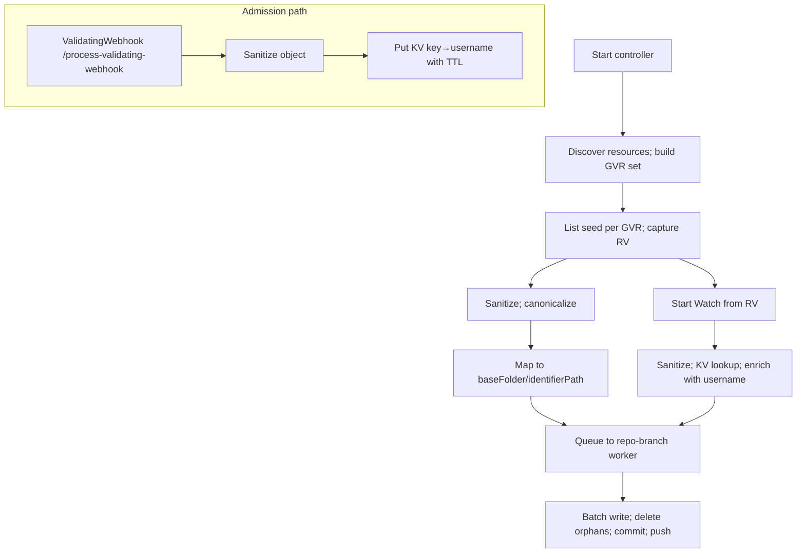

# GitOps Reverser: Cluster-as-Source-of-Truth — concise plan

Purpose
- Make the live cluster the source of truth using List + Watch
- Keep Git clean, deterministic, and scoped under a baseFolder per destination
- Retain the validating webhook permanently for username capture
- Keep configuration minimal with strong defaults; bytes trigger fixed at 1 MiB

Why both ValidatingWebhook and Watch
- ValidatingWebhook: the only reliable source for the admission username used in commit authorship/metadata; retained permanently, FailurePolicy=Ignore, leader-only; see [cmd.main()](cmd/main.go:1) and [webhook.event_handler()](internal/webhook/event_handler.go:1)
- Watch: the durable system-of-record signal that a change actually persisted into etcd; webhook calls can be dropped or rejected
- Ordering caveat: Kubernetes does not guarantee any orderability between webhook-time and watch-time resourceVersions; they will differ and cannot be compared or ordered across the two systems. We never cross-order them; we correlate by sanitized identity and content equivalence instead

Executive summary
- Ingest via List + Watch; object state comes from the API server, not from admission paths
- Username attribution comes from the validating webhook; we correlate on sanitized object identity
- Write canonical YAML to Git at /{baseFolder}/{identifierPath}; one K8s object per file
- One worker per (repoURL,branch), dedicated clone, batching by count, time, and bytes (1 MiB)
- Minimal configuration; no deletion caps (deletes are immediate and unbounded; Git provides revert safety)

Current state (2025-10-16)
- Dynamic informers for discovered GVRs: [watch.startDynamicInformers()](internal/watch/informers.go:48), handlers: [watch.addHandlers()](internal/watch/informers.go:82), events: [watch.handleEvent()](internal/watch/informers.go:105)
- Initial List-based seed enqueues UPDATEs: [watch.Manager.seedSelectedResources()](internal/watch/manager.go:185)
- Worker and Git pipeline reused: dispatch: [git.Worker.dispatchEvents()](internal/git/worker.go:92), process: [git.Worker.processRepoEvents()](internal/git/worker.go:178), push with retry: [git.Repo.TryPushCommits()](internal/git/git.go:181)
- Username capture via webhook retained at /process-validating-webhook, see [cmd.main()](cmd/main.go:1) and [webhook.event_handler()](internal/webhook/event_handler.go:1)
- Pending: orphan deletes, per-repo-branch Leases, baseFolder prefixing via GitDestination, periodic discovery refresh, correlation store

Dual-signal correlation design (authoritative)
- Goal: enrich watch events with the admission username without relying on resourceVersion ordering
- Sanitization first: both webhook objects and watch objects are sanitized via [sanitize.MarshalToOrderedYAML()](internal/sanitize/marshal.go:31) and drop sets in [sanitize.Sanitize()](internal/sanitize/sanitize.go:1) to ensure equivalence
- Keying: compute ResourceIdentifier from GVK/ns/name via [types.ResourceIdentifier.ToGitPath()](internal/types/identifier.go:62) and pair with Operation (CREATE|UPDATE|DELETE) plus a short content hash of the sanitized spec portion
- Store: on webhook admission, write {key → {username, ts, uid?}} to an in-memory KV with TTL=60s and LRU bounds; eviction on TTL or capacity
- Lookup: on watch event, sanitize, compute key, lookup in KV; if hit, enrich event with username and delete the entry; if miss, set author as bot or UnknownUser
- Guarantees: we do not attempt cross-system ordering; we accept that watch will carry a different resourceVersion; we match on sanitized identity+content with a short time window
- Failure modes: webhook drop → miss (graceful); duplicate webhook → last-write-wins; high churn → bounded LRU prevents memory growth; mismatched specs → no enrichment

Minimal architecture (including correlation)

Scope and ownership
- GitRepoConfig: repo connectivity and allowedBranches; see [api.gitrepoconfig types](api/v1alpha1/gitrepoconfig_types.go)
- GitDestination (vNext): binds repoRef + branch + baseFolder, optional exclusiveMode marker
- Effective path: /{baseFolder}/{group-or-core}/{version}/{resource}/{namespace?}/{name}.yaml via [types.ResourceIdentifier.ToGitPath()](internal/types/identifier.go:62)
- Today: path mapping uses identifier only; baseFolder prefixing lands with GitDestination

Defaults and caps (fixed, minimal)
- Watch config: resourceVersionMatch=NotOlderThan; allowWatchBookmarks=true; backoff=500ms..30s
- Discovery: refresh=5m; watchAll=false; built-in excludes (pods, events, endpoints, endpointslices, leases, controllerrevisions, flowcontrol*, jobs, cronjobs)
- Batching: maxFiles=200, maxBytes=1MiB, maxWaitSec=20
- Deletes: no cap (immediate orphan deletes); Git history provides safe revert
- Ownership: exclusiveMode=false (warn on marker mismatch)
- Leases: renewSec=8, leaseSec=24
- Workers: maxPerRepo=5, maxGlobal=24; workDir=/var/cache/gitops-reverser

Desired-state preset (default include)
- apps: deployments, statefulsets, daemonsets
- core: services, configmaps, secrets, serviceaccounts, resourcequotas, limitranges
- networking.k8s.io: ingresses, networkpolicies
- rbac.authorization.k8s.io: roles, rolebindings, clusterroles, clusterrolebindings
- policy: poddisruptionbudgets
- apiextensions.k8s.io: customresourcedefinitions
- apiregistration.k8s.io: apiservices
- scheduling.k8s.io: priorityclasses
- storage.k8s.io: storageclasses
Default exclude: pods, events, endpoints, endpointslices, leases, controllerrevisions, flowschemas, prioritylevelconfigurations, jobs, cronjobs

Reconciliation algorithm (concise)
- Seed: List selected GVRs; sanitize; build S_live; enqueue upserts
- Orphans: compute S_git under baseFolder; delete S_git − S_live (no cap)
- Trail: Watch from captured RV; sanitize; KV-enrich; enqueue upserts/deletes; on Expired re-list and recompute S_orphan
- Idempotency: no semantic change ⇒ no commit

Git operations (go-git)
- Fast-forward pushes; on reject: fetch tip, reset --hard, reapply, push; see [git.Repo.TryPushCommits()](internal/git/git.go:181)
- No merges; rebase-like replay; commit trailers for audit

Ownership and conflict controls
- Per-(repoURL,branch) Lease before writes (single-writer) to be added in [leader.Lease helper](internal/leader/leader.go:1) and invoked in [git.Worker.commitAndPush()](internal/git/worker.go:338)
- Optional marker per destination: {baseFolder}/.configbutler/owner.yaml (exclusiveMode true blocks writes)

Observability
- Existing: objects_scanned_total, objects_written_total, files_deleted_total, commits_total, commit_bytes_total, rebase_retries_total, repo_branch_active_workers, repo_branch_queue_depth, ownership_conflicts_total, lease_acquire_failures_total, marker_conflicts_total — exporter: [metrics.exporter](internal/metrics/exporter.go:1)
- New (correlation): enrich_hits_total, enrich_misses_total, kv_evictions_total
- Logs: include username enrichment result on each commit batch when available

Security and RBAC (chart)
- list/watch for desired-state resources
- coordination.k8s.io leases: get, list, watch, create, update, patch, delete
- events: create, patch
- configbutler.ai: watchrules, clusterwatchrules, gitrepoconfigs, gitdestinations; status update for rules
- secrets: get (repo creds)
- Templates: [charts/rbac.yaml](charts/gitops-reverser/templates/rbac.yaml)

Helm and flags (minimal)
- --enable-watch-ingestion
- --discovery-refresh=5m, --watch-all=false, repeated --discovery-exclude=...
- --git-batch-max-files=200, --git-batch-max-bytes-mib=1, --git-batch-max-wait-sec=20
- --workers-max-global=24, --workers-max-per-repo=5
- --leases-renew-sec=8, --leases-lease-sec=24, --work-dir=/var/cache/gitops-reverser
- Values wiring in [charts/deployment.yaml](charts/gitops-reverser/templates/deployment.yaml) and [charts/values.yaml](charts/gitops-reverser/values.yaml)

Testing and CI gates (mandatory)
- make lint, make test, make test-e2e; Docker required for e2e; see [Makefile](Makefile)

Tests for signal correlation (new)
- Unit
  - Sanitize equivalence: webhook vs watch objects produce identical sanitized spec bytes for matching scenarios; references: [sanitize.MarshalToOrderedYAML()](internal/sanitize/marshal.go:31)
  - KV semantics: TTL expiry, LRU eviction, last-write-wins, concurrent put/get; deterministic keys built from [types.ResourceIdentifier.ToGitPath()](internal/types/identifier.go:62)
  - Ordering: prove we do not rely on resourceVersion ordering across systems by constructing differing RVs and matching via sanitize+key only
- Integration
  - Admission then watch under load: webhook → KV put, watch → KV hit and username enrichment, commit trailers include username
  - Dropped webhook: watch → KV miss; commit uses bot/UnknownUser; metrics enrich_misses_total increments
- E2E
  - High-rate updates with concurrent watchers; enrichment hit rate close to 100 percent within TTL; no deadlocks; commits stable

Implementation checklist (short)
- Correlation store
  - Add in-memory KV with TTL+LRU; helper package internal/correlation with API:
    - correlation.Put(key, username, meta) and correlation.GetAndDelete(key)
  - Wire webhook handler to sanitize and Put; see [webhook.event_handler()](internal/webhook/event_handler.go:1)
  - Wire watch path to sanitize and GetAndDelete; see [watch.handleEvent()](internal/watch/informers.go:105)
  - Add metrics: enrich_hits_total, enrich_misses_total, kv_evictions_total; extend [metrics.exporter](internal/metrics/exporter.go:1)
- Orphans
  - Seed builds S_live; worker computes S_git; apply uncapped deletes in commit path
- Leases and marker
  - Add Lease helper; guard [git.Worker.commitAndPush()](internal/git/worker.go:338); implement marker check when GitDestination lands
- Batch caps
  - Enforce 200 files, 1 MiB, 20s backstop in [git.Worker.handleNewEvent()](internal/git/worker.go:300) and [git.Worker.handleTicker()](internal/git/worker.go:323)
- Discovery
  - Add periodic refresh loop; start/stop informers incrementally; error backoff; metric discovery_errors_total
- Helm/RBAC
  - Template flags; ensure leases/events verbs in ClusterRole; keep webhook assets and leader-only routing

Key references
- Manager: [watch.Manager.Start()](internal/watch/manager.go:66), seed: [watch.Manager.seedSelectedResources()](internal/watch/manager.go:185)
- Informers: [watch.startDynamicInformers()](internal/watch/informers.go:48), [watch.addHandlers()](internal/watch/informers.go:82), [watch.handleEvent()](internal/watch/informers.go:105)
- Identifier mapping: [types.ResourceIdentifier.ToGitPath()](internal/types/identifier.go:62)
- Worker: dispatch: [git.Worker.dispatchEvents()](internal/git/worker.go:92), loop: [git.Worker.processRepoEvents()](internal/git/worker.go:178), buffer: [git.Worker.handleNewEvent()](internal/git/worker.go:300), ticker: [git.Worker.handleTicker()](internal/git/worker.go:323), commit: [git.Worker.commitAndPush()](internal/git/worker.go:338)
- Git push: [git.Repo.TryPushCommits()](internal/git/git.go:181)
- Webhook: [webhook.event_handler()](internal/webhook/event_handler.go:1), charts: [charts/validating-webhook.yaml](charts/gitops-reverser/templates/validating-webhook.yaml)

Status marker
- Watch ingestion active; seed enqueues UPDATEs; webhook retained for username; 1 MiB batch bytes trigger selected
- Signal correlation store added to plan with sanitize-first matching and no cross-system ordering
- Next: implement correlation store, uncapped deletes, leases, GitDestination baseFolder pathing, and discovery refresh
