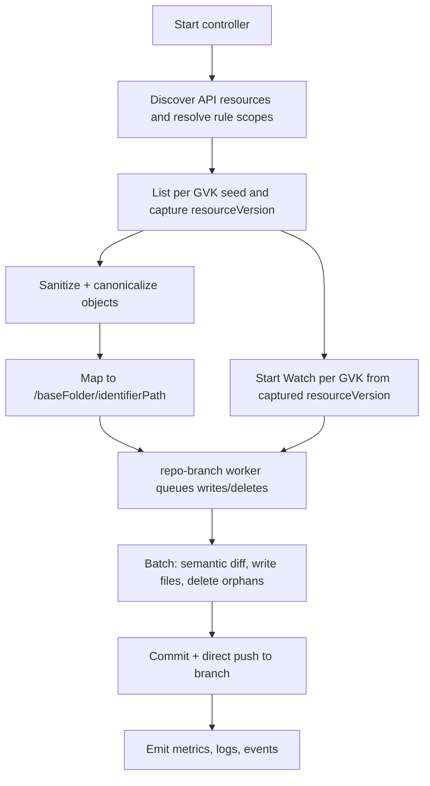

# GitOps Reverser: Cluster-as-Source-of-Truth with watch-based ingestion and baseFolder ownership

This document is a single, cohesive plan for evolving gitops-reverser to:
- Treat the live Kubernetes cluster as the authoritative source of truth for a configured scope.
- Ingest state via Kubernetes List + Watch (not admission webhooks), enabling deterministic bootstrap and incremental trailing.
- Own a baseFolder (baseFolder) per destination, writing directly to Git branches without PR gating.
- Simplify repository configuration by introducing GitDestination and slimming GitRepoConfig.
- Focus by default on “desired-state” resources (e.g., Deployments, Services, RBAC, CRDs), excluding runtime-heavy objects (e.g., Pods, Events).
- Remove all MutatingWebhookConfiguration-based ingestion, including code, Helm charts, and tests.

References (current code and charts)
- CRDs: [api/v1alpha1/watchrule_types.go](api/v1alpha1/watchrule_types.go), [api/v1alpha1/clusterwatchrule_types.go](api/v1alpha1/clusterwatchrule_types.go), [api/v1alpha1/gitrepoconfig_types.go](api/v1alpha1/gitrepoconfig_types.go)
- Mapping: [internal/types/identifier.go](internal/types/identifier.go)
- Git operations: [internal/git/git.go](internal/git/git.go), [internal/git/worker.go](internal/git/worker.go)
- Event queue: [internal/eventqueue/queue.go](internal/eventqueue/queue.go)
- Sanitization: [internal/sanitize/marshal.go](internal/sanitize/marshal.go)
- Controller scaffolding: [internal/controller/watchrule_controller.go](internal/controller/watchrule_controller.go), [internal/controller/clusterwatchrule_controller.go](internal/controller/clusterwatchrule_controller.go)
- Helm chart: [charts/gitops-reverser/templates/](charts/gitops-reverser/templates/)
- Webhook code to be removed: [internal/webhook/event_handler.go](internal/webhook/event_handler.go), [config/webhook/](config/webhook/kustomization.yaml), [charts/gitops-reverser/templates/validating-webhook.yaml](charts/gitops-reverser/templates/validating-webhook.yaml)

## Executive summary

- Ingestion: adopt watch-only ingestion with discovery-driven List + Watch per selected GVK; deprecate and remove the MutatingWebhookConfiguration path.
- Scope and ownership: a rule selects resources; a destination defines repo branch and base folder (baseFolder). The controller writes files under /{baseFolder}/{identifierPath} using canonicalization and semantic diffing.
- Git model: direct pushes (no PR gating). Support multiple branches in a single repository via multiple destinations. repo-branch worker with a dedicated clone, batching writes and commits.
- Defaults: performance-oriented parallelism with safety caps, leases for coordination, advisory repo marker, and robust metrics.
- By default, focus on “desired-state” objects to reduce noise and runtime churn; provide an opt-in “watch all” mode if needed.

## Objectives

- At startup, enumerate selected Kubernetes objects, canonicalize them, write or update Git files, and delete orphans under owned baseFolder.
- Continue trailing changes via Watch streams per GVK.
- Ensure idempotency (no-op on re-run if nothing changed).
- Avoid infinite loops with Flux/Argo via semantic equivalence and stable rendering.
- Provide clear concurrency, safety, RBAC, and observability.

## High-level architecture

## Core decisions

- Replace MutatingWebhookConfiguration ingestion with List + Watch. Remove webhook code, chart templates, and tests.
- Default to desired-state resources. Provide explicit inclusion/exclusion semantics aligned with experienced Kubernetes users’ expectations.
- GitDestination (namespaced) configures repo branch and baseFolder (baseFolder), and access policy. GitRepoConfig becomes a connectivity/auth resource and gatekeeper for allowed branches.
- Direct push, multi-branch capable, repo-branch worker with dedicated clone. Last-writer-wins at Git level (with coordination measures).
- Ownership safeguards: Kubernetes Leases per destination; optional marker file under baseFolder; commit trailers for traceability.

## API design

### GitRepoConfig (slimmed)
- Remove: spec.branch
- Add: spec.allowedBranches []string
- Keep: repoUrl, secretRef, push strategy (timers/thresholds if used), accessPolicy for who may reference this repo (but move write-behavior policy to destination)
- File: [api/v1alpha1/gitrepoconfig_types.go](api/v1alpha1/gitrepoconfig_types.go)

### GitDestination (new, namespaced)
- Purpose: bind a GitRepoConfig to a writable branch and base path (baseFolder), and hold repo-branch access/write policy.
- Spec fields (MVP):
  - repoRef: NamespacedName of GitRepoConfig
  - branch: string (must be in GitRepoConfig.spec.allowedBranches)
  - baseFolder: string (baseFolder base folder)
  - accessPolicy: write/access behavior moved down from GitRepoConfig (namespaces allowed to reference, cluster rules permission)
  - exclusiveMode: bool (default false) — if true, enforce repo marker ownership; else warn and continue
- Removed (as requested): allowedPaths, writeMode, conflictPolicy (document defaults)
- Controller behavior: each rule can reference one or many destinations (MVP: one recommended), writing under /{baseFolder}/{identifierPath}

### WatchRule and ClusterWatchRule (defaults aligned with “desired-state”)
- No schema-breaking changes required for MVP. However, we set defaults and enrich semantics in documentation:
  - If a rule does not specify Resources, default to DesiredState set (below).
  - Provide examples and guidance to mirror Kubernetes-style selection (groups, versions, resources wildcards).
- Files: [api/v1alpha1/watchrule_types.go](api/v1alpha1/watchrule_types.go), [api/v1alpha1/clusterwatchrule_types.go](api/v1alpha1/clusterwatchrule_types.go)

## Repository mapping

- Effective path: /{baseFolder}/{identifierPath}
- identifierPath generated via [internal/types/identifier.go](internal/types/identifier.go) using Kubernetes REST-style convention:
  - Namespaced: {group-or-core}/{version}/{resource}/{namespace}/{name}.yaml
  - Cluster-scoped: {group-or-core}/{version}/{resource}/{name}.yaml
- This preserves determinism and aligns with current tests and golden files.

## Ingestion: discovery-driven List + Watch

### Why watch (and not admission webhooks)?
- A watch-based model:
  - Deterministic bootstrap via List.
  - Trails changes reliably via Watch resourceVersion.
  - Eliminates webhook permissions, network exposure, and admission timing concerns.
  - Aligns with how controllers observe state rather than intercepting mutating requests.
- Decision: remove MutatingWebhookConfiguration ingestion entirely.

### Discovery
- Use server discovery to enumerate resources with list/watch verbs.
- Maintain a cache of ServerResources; refresh periodically (e.g., every 3m–5m).
- Construct shared informers (or controller-runtime caches) per selected GVK.

### Default resource focus: Desired-state set
- Aim: avoid runtime noise and keep Git focused on intended configuration.
- Default include (examples; actual list to be codified and versioned):
  - Workloads desired sources: deployments.apps, statefulsets.apps, daemonsets.apps, jobs.batch, cronjobs.batch
  - Services and ingress: services, ingresses.networking.k8s.io
  - Config: configmaps, secrets (tool syncs secrets as-is), serviceaccounts
  - Policy and security: networkpolicies.networking.k8s.io, poddisruptionbudgets.policy, podsecuritypolicies.policy (if present), RBAC (roles.rbac.authorization.k8s.io, rolebindings.rbac.authorization.k8s.io, clusterroles.rbac.authorization.k8s.io, clusterrolebindings.rbac.authorization.k8s.io)
  - Storage and infra config: storageclasses.storage.k8s.io, persistentvolumeclaims (optional), priorityclasses.scheduling.k8s.io
  - APIs and CRDs: customresourcedefinitions.apiextensions.k8s.io, apiservices.apiregistration.k8s.io
  - Namespaces (optional), resourcequotas, limitranges
- Default exclude (runtime/ephemeral/noisy):
  - pods, events (core and events.events.k8s.io), leases.coordination.k8s.io
  - endpoints, endpointslices.discovery.k8s.io
  - controllerrevisions.apps, flowschemas.flowcontrol.apiserver.k8s.io, prioritylevelconfigurations.flowcontrol.apiserver.k8s.io
- “Watch all” mode:
  - Disabled by default. When enabled, discover all list/watch-able resources, then subtract an exclusion list (configurable). Requires broader RBAC and resource caps.

### Rule defaults and expert tuning
- When users omit Rules.Resources:
  - WatchRule (namespaced): default to Desired-state set within the rule namespace.
  - ClusterWatchRule: default to Desired-state set cluster-wide (namespaced/cluster kinds accordingly).
- Experts can specify precise resources via:
  - apiGroups: ["", "apps", ...], apiVersions: ["v1", ...], resources: ["deployments", "roles", "clusterroles", ...] with “*” for broad selection as documented in rules.
- Provide ready-made “resource category” presets via documentation/values (not CRD schema) to map to curated lists (DesiredState, Runtime, All).

### Watch configuration
- resourceVersionMatch: NotOlderThan
- allowWatchBookmarks: true
- Backoff on watch restarts: exponential (500ms..30s)
- On Expired: re-list, resume from new resourceVersion

## Startup reconciliation and trailing

- List per GVK in scope to capture current state and a resourceVersion.
- Sanitize and canonicalize (drop runtime-only fields; optional defaulted fields when safe).
- Map to file paths, compute semantic diff with repo, write changed files and delete orphans under owned baseFolder.
- Commit batches and push direct.
- Start watches per GVK from captured resourceVersion and process deltas into the repo-branch queues.
- Idempotency: repeated runs without changes must be no-ops (no diffs, no commits).

## Canonicalization and semantic diffing

- Use sanitizer and stable YAML renderer:
  - Drop or normalize: status, managedFields, resourceVersion, UID, timestamps, observedGeneration.
  - Consider omission of defaulted fields where safe/derivable.
  - Stable key ordering, indentation; ignore presentational diffs.
- Utilities: [internal/sanitize/marshal.go](internal/sanitize/marshal.go)
- Golden tests ensure stability.

## Destinations, queues, and Git operations

- repo-branch worker key: (repoURL, branch, baseFolder).
- Working directory: dedicated clone per destination (no branch switching).
  - Base path: /var/cache/gitops-reverser/{hash(repoURL,branch,baseFolder)}
  - Garbage-collect stale clones by last-used TTL policy.
- Batching: flush by thresholds (files, bytes) and time-based backstop.
- Git ops:
  - Fetch base, rebase if needed, fast-forward pushes only; retry on non-fast-forward with refreshed base.
  - Serialize writes per destination; read paths can be parallel.
- Multi-branch: handled by independent workers per branch for the same repo.
- Loop avoidance with Flux/Argo:
  - Commit only on semantic deltas.
  - Canonical rendering that aligns with downstream controllers as much as practical.
  - Optional ignore lists for commonly mutated annotations/fields.

## Ownership and anti-conflict safeguards

- Kubernetes Lease per destination:
  - Name: hash(repoURL|branch|baseFolder)
  - Acquire before writes; renew periodically.
  - If lease is held by another identity, set Ready=False on associated rules/destinations (OwnershipConflict) and skip writes (policy-configurable).
- Repo marker file (optional; created once):
  - .configbutler/owner.yaml under baseFolder with: clusterUID, controller namespace/name, instance ID, timestamp.
  - exclusiveMode=false by default: warn on mismatch, continue.
  - exclusiveMode=true: refuse writes, set Ready=False with OwnershipConflict.
- Commit trailers for audit:
  - X-ConfigButler-ClusterUID
  - X-ConfigButler-ControllerNS
  - X-ConfigButler-ControllerName
  - X-ConfigButler-InstanceID

## Observability

- Metrics:
  - objects_scanned_total, objects_written_total, files_deleted_total
  - commits_total, commit_bytes_total, rebase_retries_total
  - ownership_conflicts_total, lease_acquire_failures_total, marker_conflicts_total
  - destination_active_workers, destination_queue_depth
- Logs: include object identifiers, destinations, commit SHAs.
- Kubernetes Events: major actions and conflicts.
- ServiceMonitor and TLS: keep existing chart support (metrics path unchanged).

## Security and RBAC (MVP)

- K8s API permissions
  - Read selected resources: get, list, watch (scope aligned to rules; “watch all” widens permissions).
  - coordination.k8s.io Leases: get, list, watch, create, update, patch, delete.
  - events: create, patch.
  - secrets: get (read Git credentials referenced by GitRepoConfig).
  - Namespaces: get (for access policy checks).
  - CRDs in configbutler.ai: get, list, watch (watchrules, clusterwatchrules, gitrepoconfigs, gitdestinations).
  - Status updates: watchrules/status, clusterwatchrules/status — get, update, patch.
- Helm:
  - Update RBAC in [charts/gitops-reverser/templates/rbac.yaml](charts/gitops-reverser/templates/rbac.yaml)
- Git security:
  - Credentials via Secret referenced by GitRepoConfig.Spec.SecretRef (HTTPS/SSH).
  - GitRepoConfig.allowedBranches enforces branch allowlist for destinations.
  - Commit identity: bot user configured via values; trailers included.

## Decommission MutatingWebhookConfiguration

Remove webhook-based ingestion entirely:
- Code to delete:
  - [internal/webhook/event_handler.go](internal/webhook/event_handler.go)
  - [internal/webhook/event_handler_test.go](internal/webhook/event_handler_test.go)
- Kustomize and manifests to delete:
  - [config/webhook/](config/webhook/kustomization.yaml) (entire directory)
- Helm chart templates to delete or disable:
  - [charts/gitops-reverser/templates/validating-webhook.yaml](charts/gitops-reverser/templates/validating-webhook.yaml)
  - Any webhook Service/Certificate templates: [charts/gitops-reverser/templates/certificates.yaml](charts/gitops-reverser/templates/certificates.yaml) if webhook-only; otherwise adjust if shared with metrics.
- RBAC:
  - Remove webhook-related RBAC if present; keep Leases, Events, and CRD RBAC.
- Tests:
  - Remove webhook-focused tests and adjust e2e to rely on watch-only ingestion.
- Docs:
  - Remove webhook setup instructions; update README to describe watch-based ingestion and defaults.

## Testing and acceptance criteria

- Unit
  - Mapping stability (identifier.go).
  - Sanitization golden tests (stable YAML).
  - Discovery filter: resource inclusion/exclusion logic.
- Integration
  - Snapshot reconciliation writes files, deletes orphans; re-run is no-op.
  - Multi-branch destinations commit in parallel.
  - Lease acquisition behavior under simulated contention.
- E2E
  - Seeded repo + Kind cluster; watch-only ingestion; idempotency on second run.
  - Desired-state defaults: verify Pods and Events excluded by default; Deployments/Services included.
  - Overlap scenarios across rules and destinations produce expected last-writer behavior (with warnings).
- Acceptance
  - No webhooks installed.
  - Direct pushes only, multiple branches via destinations.
  - Immediate deletes under safety cap.
  - Metrics emitted as specified.

## Performance defaults (selected)

- exclusiveMode: false
- maxConcurrentDestinationsPerRepo: 5
- maxGlobalWorkers: 24
- Batch thresholds: maxFiles=200, maxBytesMiB=10, maxWaitSec=20
- deleteCapPerCycle: 500 per destination
- Leases: renewSec=8, leaseSec=24
- workDir base: /var/cache/gitops-reverser
- Watch config: bookmarks=true, rvMatch=NotOlderThan, backoff=exp 500ms..30s
- Checkout strategy: dedicated clone per destination

## Implementation plan (sequenced)

1) API and types
- Add GitDestination CRD types next to [api/v1alpha1/gitrepoconfig_types.go](api/v1alpha1/gitrepoconfig_types.go)
- Update GitRepoConfig: remove spec.branch, add spec.allowedBranches
- Defaults and validation (kubebuilder tags) to match rules above
- Run make manifests; update [config/crd/bases/](config/crd/bases/)

2) Ingestion and discovery
- Implement discovery of server resources with list/watch
- Build informer/controller-runtime cache per selected GVK
- Encode “Desired-state” defaults; document “watch all” flag and default exclusions

3) Destination workers and git ops
- Implement repo-branch worker pool keyed by (repoURL, branch, baseFolder)
- Dedicated clones; batching; commit/push logic; safety caps
- Leases + optional marker; commit trailers

4) Remove webhook ingestion
- Delete webhook code and manifests as listed
- Remove Helm webhook templates; ensure chart installs only watch-based controller

5) RBAC and Helm
- Update RBAC to include Leases, Events, CRDs, Secrets get; remove webhook RBAC
- Add GitDestination CRD to chart CRDs
- Values for defaults (exclusions, discovery refresh, concurrency caps)

6) Tests and CI
- Unit and integration per above
- E2E: update to watch-only flows
- CI gating: make fmt/vet/generate/manifests/lint/test/test-e2e; Docker/Kind availability

7) Docs
- README and chart README; user guides for desired-state defaults, exclusions, “watch all” flag

## Open questions (track but not blocking MVP)

- Exact “Desired-state” resource list across distributions and API levels; ship as a versioned preset with overrides.
- Whether Jobs should be included by default (they are desired-state but can be noisy); default to include with optional exclusion.
- Default behavior for namespace/cluster-scoped CRs without matching CRD definition visibility; handle dynamically via discovery.

End of plan.

## Discovery defaults (MVP)

To complete the watch-based ingestion plan, these defaults are locked for discovery, exclusions, and informer limits. They prioritize desired-state resources and avoid runtime-heavy objects by default.

Defaults
- discoveryRefresh: 5m (periodic refresh of server resources list to capture new CRDs and API changes)
- watchAll: false (opt-in via flag; when enabled, still applies the exclusion list unless overridden)
- defaultExclusionList:
  - pods
  - events (core) and events.events.k8s.io
  - leases.coordination.k8s.io
  - endpoints (core) and endpointslices.discovery.k8s.io
  - controllerrevisions.apps
  - flowschemas.flowcontrol.apiserver.k8s.io
  - prioritylevelconfigurations.flowcontrol.apiserver.k8s.io
- informerCaps:
  - maxGVKs: 300 (upper bound on concurrently watched GVKs)
  - maxConcurrentInformers: 50 (cap on informer goroutines)
  - rate limits (per GVK cache client): qps=5, burst=10
- cacheStrategy: shared informers (cluster-wide); handlers apply rule-based filters
  - WatchRule handlers restrict by rule namespace (namespaced scope)
  - ClusterWatchRule handlers restrict by namespaceSelector or cluster scope as defined
- discoveryBackoff: exponential 1s..60s with jitter on discovery failures; metric for discovery_errors_total

Rule defaults aligned with desired-state focus
- When Rules.Resources are omitted:
  - WatchRule (namespaced) defaults to the Desired-state set within the WatchRule’s namespace
  - ClusterWatchRule defaults to the Desired-state set across the chosen scope (Cluster/Namespaced)
- Explicit inclusion required for runtime objects (e.g., “pods”); these are not included by default

## Webhook decommission clarifications (scope of removal)

Remove all Mutating/Validating webhook-based ingestion from code and charts:
- Code to delete:
  - [internal/webhook/event_handler.go](internal/webhook/event_handler.go)
  - [internal/webhook/event_handler_test.go](internal/webhook/event_handler_test.go)
- Kustomize/manifests to delete:
  - Entire [config/webhook/](config/webhook/kustomization.yaml) directory
  - Cert-manager assets used for webhook serving:
    - [config/certmanager/certificate-webhook.yaml](config/certmanager/certificate-webhook.yaml)
    - [config/webhook/service.yaml](config/webhook/service.yaml)
- Helm chart templates to delete/disable:
  - [charts/gitops-reverser/templates/validating-webhook.yaml](charts/gitops-reverser/templates/validating-webhook.yaml)
  - Remove webhook Service/Certificate wiring from [charts/gitops-reverser/templates/certificates.yaml](charts/gitops-reverser/templates/certificates.yaml) if it only existed for webhook; retain metrics certificates if present and separate
- RBAC:
  - Remove webhook-specific RBAC; retain Leases, Events, CRDs, Secrets get and status update permissions
- Tests:
  - Remove webhook E2E coverage; ensure E2E uses watch-only ingestion
- Docs:
  - Remove webhook setup; update [README.md](README.md) and chart docs to reflect watch-based ingestion and desired-state defaults

These defaults and removals make watch-based ingestion a first-class, central part of the design, focusing on declarative desired-state resources and leaving runtime noise out by default. References for mapping, rules, and controllers remain: [internal/types/identifier.go](internal/types/identifier.go), [api/v1alpha1/watchrule_types.go](api/v1alpha1/watchrule_types.go), [api/v1alpha1/clusterwatchrule_types.go](api/v1alpha1/clusterwatchrule_types.go), and the controller setup in [internal/controller/watchrule_controller.go](internal/controller/watchrule_controller.go) and [internal/controller/clusterwatchrule_controller.go](internal/controller/clusterwatchrule_controller.go).

## Finalized clarifications and CRD specification summary

This section consolidates final decisions and clarifies worker identity, startup behavior, git conflict policy with go-git, ownership markers, terminology, Desired-state defaults, and the planned CRD surfaces. It supersedes any earlier references that conflict with the points below.

### Worker identity and concurrency

- Worker key: Per-repo-branch, not per-folder. A single worker is keyed by (repoURL, branch).
  - Hash identity: hash(repoURL,branch)
  - A single worker can process multiple baseFolder trees for that repo/branch concurrently via its queue; file operations remain serialized within the worker to preserve ordering.
- Dedicated clone per worker: Each (repoURL, branch) worker keeps its own working directory checkout. Multiple GitDestination objects may target different baseFolder paths under the same worker.

Working directory layout
- baseDir: /var/cache/gitops-reverser (configurable)
- per worker: /var/cache/gitops-reverser/hash(repoURL,branch)

Metrics
- repo_branch_active_workers, repo_branch_queue_depth, commit_batches_total, push_retries_total

### Startup behavior, change events, and deletion detection

Seed and enqueue
- For each selected GVK, List() current objects and capture resourceVersion, then map to planned file paths under the target baseFolder(s) using [internal/types/identifier.go](internal/types/identifier.go).
- For each object, enqueue a desired “upsert” operation event to the worker keyed by (repoURL, branch). The event includes the baseFolder and the relative file path, along with the canonicalized content.
- The worker computes semantic diffs before any write; if no effective change, the event is a no-op.

Deletion detection
- Live set: S_live = { all file relative paths mapped from currently listed objects under each baseFolder }
- Repo set: S_git = { all tracked file relative paths presently under each baseFolder in the working tree }, filtered to the tool’s managed file extension(s) and ignoring the ownership marker path
- Orphans per baseFolder: S_orphan = S_git − S_live
- The worker enqueues delete operations for orphans, subject to deleteCapPerCycle. Deletions are batched and committed with writes when possible.
- Idempotency: After a full seed + cleanup, repeating the process yields S_orphan = ∅ and only no-ops.

Trailing changes
- Start Watch() per GVK from the captured resourceVersion (resourceVersionMatch=NotOlderThan, allowWatchBookmarks=true), enqueueing upsert/delete events as deltas arrive.
- On Expired watch: re-list, recompute S_live, and repeat the orphan detection.

### Git conflict resolution policy (go-git simplification)

Given go-git limitations, adopt the following policy per worker:
- Attempt fast-forward push after commit batches.
- On push reject (non fast-forward):
  - Reset: git fetch remote tip for branch, then reset --hard to remote tip.
  - Reapply: recompute current pending file operations (upserts/deletes) against the refreshed working tree, re-stage, re-commit.
  - Retry push.
- No merge tooling is attempted; behavior emulates a rebase by reapplying the current change set on top of the remote branch head.
- Commit identity and trailers remain intact across retries.

References: [internal/git/git.go](internal/git/git.go), [internal/git/worker.go](internal/git/worker.go)

### Ownership and anti-conflict markers

- Kubernetes Lease per repo-branch worker remains as the first line of concurrency control.
- Repository marker file is per GitDestination and lives inside the destination’s baseFolder:
  - Path: {baseFolder}/.configbutler/owner.yaml
  - Fields: clusterUID, controller namespace/name, instanceID, timestamp
  - exclusiveMode=false (default): warn on mismatch and continue; exclusiveMode=true: refuse writes and surface Ready=False on referencing rules
- Commit trailers: always added for audit (X-ConfigButler-ClusterUID, X-ConfigButler-ControllerNS, X-ConfigButler-ControllerName, X-ConfigButler-InstanceID)

### Terminology

- Remove the “baseFolder” term from this plan. The concept is fully represented as baseFolder in GitDestination.Spec.
- Anywhere “baseFolder” was previously mentioned, read as “baseFolder”.

### Desired-state preset v1.0 (defaults)

Focus on declarative desired-state resources and exclude runtime-noisy types by default. Users can override via rule Resources or enabling a “watch all” mode with exclusions list.

- Default include (examples):
  - Workloads desired sources: deployments.apps, statefulsets.apps, daemonsets.apps
  - Services and networking: services, ingresses.networking.k8s.io, networkpolicies.networking.k8s.io
  - Policy: poddisruptionbudgets.policy, RBAC (roles.rbac.authorization.k8s.io, rolebindings.rbac.authorization.k8s.io, clusterroles.rbac.authorization.k8s.io, clusterrolebindings.rbac.authorization.k8s.io)
  - Config: configmaps, secrets, serviceaccounts, resourcequotas, limitranges, priorityclasses.scheduling.k8s.io
  - API plumbing: customresourcedefinitions.apiextensions.k8s.io, apiservices.apiregistration.k8s.io
  - Storage and infra config: storageclasses.storage.k8s.io (PVCs optional; not default)
- Default exclude:
  - pods (core), events (core and events.events.k8s.io), leases.coordination.k8s.io
  - endpoints (core), endpointslices.discovery.k8s.io
  - controllerrevisions.apps, flowschemas.flowcontrol.apiserver.k8s.io, prioritylevelconfigurations.flowcontrol.apiserver.k8s.io
  - jobs.batch, cronjobs.batch (excluded by default per decision)

Watch-only ingestion remains the default; MutatingWebhookConfiguration is removed entirely.

### Planned CRDs and fields (MVP surfaces)

1) GitRepoConfig (Namespaced)
- Purpose: repository connectivity/auth and branch allowlisting; selector-based access control for who can reference the repo.
- Spec (key fields):
  - repoUrl: string
  - allowedBranches: []string
  - secretRef: [api/v1alpha1/gitrepoconfig_types.go:LocalObjectReference](api/v1alpha1/gitrepoconfig_types.go)
  - push: optional timing/queueing hints (unchanged)
  - accessPolicy:
    - namespacedRules.mode: SameNamespace | AllNamespaces | FromSelector
    - namespacedRules.namespaceSelector: LabelSelector (when mode=FromSelector)
    - allowClusterRules: bool (explicit opt-in for cluster-scoped rules)
- Status:
  - conditions[] (Ready, etc.), observedGeneration
- Behavior:
  - Enforced allowlist for branches that destinations may target
  - Controls which namespaces and whether cluster rules may reference this repo

2) GitDestination (Namespaced) — new
- Purpose: writable target composed of a repo reference, branch, and a baseFolder (the root folder to own within that branch).
- Spec (key fields):
  - repoRef: NamespacedName to GitRepoConfig (name+namespace)
  - branch: string (must be in GitRepoConfig.spec.allowedBranches)
  - baseFolder: string (folder path owned by this destination)
  - accessPolicy: same shape as GitRepoConfig.accessPolicy but applied at the destination layer to authorize which rules may reference this destination
  - exclusiveMode: bool (default false) — enforce repo marker ownership under baseFolder
- Status:
  - conditions[] (Ready/OwnershipConflict/…)
- Behavior:
  - A repo-branch worker handles all GitDestination(s) pointing to the same (repoURL, branch)
  - Ownership marker path is {baseFolder}/.configbutler/owner.yaml when exclusiveMode=true
  - Multiple destinations can share one repo-branch; they write to distinct baseFolder subtrees

3) WatchRule (Namespaced)
- Purpose: select namespaced resources within its namespace and write them to a referenced destination.
- Spec (key fields):
  - destinationRef: NamespacedName to GitDestination (MVP: a single destinationRef)
  - objectSelector: LabelSelector (optional)
  - rules[]: ResourceRule (operations, apiGroups, apiVersions, resources)
    - When resources omitted: defaults to Desired-state preset, namespaced scope only
- Status: conditions[] (Ready, AccessDenied, etc.)
- Access:
  - Must satisfy GitDestination.accessPolicy and GitRepoConfig.accessPolicy (namespace-based)
  - If destinationRef not allowed, set Ready=False with AccessDenied

4) ClusterWatchRule (Cluster)
- Purpose: select cluster-scoped resources and/or namespaced resources across multiple namespaces using namespaceSelector; write to a referenced destination.
- Spec (key fields):
  - destinationRef: NamespacedName to GitDestination (explicit namespace required)
  - rules[]: ClusterResourceRule (operations, apiGroups, apiVersions, resources, scope=Cluster|Namespaced, optional namespaceSelector)
    - When resources omitted: defaults to Desired-state preset across the specified scope
- Status: conditions[] (Ready, AccessDenied, etc.)
- Access:
  - GitRepoConfig.accessPolicy.allowClusterRules must be true
  - Must satisfy GitDestination.accessPolicy (destination’s namespace authorization)

Interaction summary (Kubernetes-expected semantics)
- Namespacing: WatchRule is namespaced and may only select resources in its own namespace; ClusterWatchRule is cluster-scoped and can select cluster or namespaced objects (optionally filtered by namespace labels).
- Authorization layering:
  - A rule may reference only destinations permitted by the destination’s accessPolicy and the underlying repo’s accessPolicy.
  - For cluster-scoped rules, GitRepoConfig.spec.accessPolicy.allowClusterRules must be true.
- Branch controls:
  - Only branches listed in GitRepoConfig.spec.allowedBranches may be targeted by destinations.
- Worker mapping:
  - All destinations targeting the same (repoURL, branch) share one worker/clone; baseFolder isolates their filesystem subtrees.

### Considerations (rationale-only, non-normative)

- We intentionally removed MutatingWebhookConfiguration-based ingestion to reduce coupling to admission paths and to guarantee deterministic bootstrapping via List + Watch.
- We simplified GitDestination by omitting writeMode, conflictPolicy, and allowedPaths fields; documented behavior covers direct push, last-writer-wins with leases/markers, and repo-branch authorization.
- We removed “baseFolder” terminology to reduce cognitive load; the single knob is baseFolder in GitDestination.

## CRD quick reference and interaction model

This section summarizes the planned CRD surfaces, fields, constraints, and how they interact, written for Kubernetes practitioners familiar with admission semantics, label selectors, and discovery.

Kinds and scope
- Group and version: configbutler.ai v1alpha1 for all kinds
- Kinds
  - GitRepoConfig: Namespaced
  - GitDestination: Namespaced
  - WatchRule: Namespaced
  - ClusterWatchRule: Cluster

GitRepoConfig
- Purpose: Repository connectivity and authorization boundary for who can reference a repo and which branches are writable via destinations
- Spec
  - repoUrl: string (required)
  - allowedBranches: []string (required when any destination references this repo)
  - secretRef: LocalObjectReference (optional) — credentials for HTTPS or SSH
  - push: PushStrategy (optional) — timing and batch hints
    - interval: string duration e.g. 1m (optional)
    - maxCommits: int (optional)
  - accessPolicy: AccessPolicy (optional)
    - namespacedRules: NamespacedRulesPolicy (optional)
      - mode: SameNamespace AllNamespaces FromSelector default SameNamespace
      - namespaceSelector: LabelSelector required when mode=FromSelector, must be nil otherwise
    - allowClusterRules: bool default false — explicit opt in for ClusterWatchRule access
- Status
  - conditions: []metav1.Condition
  - observedGeneration: int64
- Expectations
  - Enforces branch allowlisting: a destination pointing at this repo must choose a branch from allowedBranches
  - Enforces who may reference this repo: namespace scoping or selector based access; cluster rules require allowClusterRules true

GitDestination
- Purpose: Writable target that binds a repo, a branch, and an owned base folder tree under that branch
- Spec
  - repoRef: NamespacedName to GitRepoConfig name and namespace (required)
  - branch: string (required) must be in GitRepoConfig.spec.allowedBranches
  - baseFolder: string (required) root folder owned by this destination in the branch
  - accessPolicy: AccessPolicy (optional) — same shape as on GitRepoConfig, applied at destination layer to authorize which rules may reference this destination
  - exclusiveMode: bool default false — if true, enforces per destination ownership marker under baseFolder
- Status
  - conditions: []metav1.Condition (e.g., Ready OwnershipConflict)
- Expectations
  - Marker file path when exclusiveMode is true: {baseFolder}/.configbutler/owner.yaml
  - Multiple destinations can point to the same repo and branch; their baseFolder trees must not overlap
  - Authorization: a rule must be permitted by destination.accessPolicy and also by repo.accessPolicy

WatchRule
- Purpose: Namespaced rule that selects namespaced resources in its own namespace and writes them to a destination
- Spec
  - destinationRef: NamespacedName to GitDestination (required) defaults to this WatchRule namespace if ref.namespace omitted
  - objectSelector: LabelSelector (optional) — filters target objects by their labels in the namespace
  - rules: []ResourceRule (required, min 1) — selection by operations, apiGroups, apiVersions, resources
    - operations: []OperationType optional one of CREATE UPDATE DELETE * empty means all
    - apiGroups: []string optional "" for core "*" for all empty means all
    - apiVersions: []string optional "*" for all empty means all
    - resources: []string required examples "configmaps" "deployments" "pods/*" "*" exact plural names, supports subresource form kind/subresource matching Kubernetes webhook patterns, no prefix wildcards
- Status
  - conditions: []metav1.Condition
- Defaults and expectations
  - If resources is omitted in inputs or via future defaulting, default to Desired-state preset for namespaced kinds and exclude runtime kinds
  - May only operate in its own namespace by design
  - Must satisfy destination.accessPolicy and repo.accessPolicy for authorization

ClusterWatchRule
- Purpose: Cluster scoped rule that can select cluster scoped resources and or namespaced resources across namespaces via a selector and write them to a destination
- Spec
  - destinationRef: NamespacedName to GitDestination (required) name and namespace are explicit
  - rules: []ClusterResourceRule (required, min 1)
    - operations: []OperationType optional as above
    - apiGroups: []string optional as above
    - apiVersions: []string optional as above
    - resources: []string required plural names and subresources as above
    - scope: Cluster Namespaced required indicates cluster scoped vs namespaced matching
    - namespaceSelector: LabelSelector optional only valid when scope is Namespaced
- Status
  - conditions: []metav1.Condition
- Defaults and expectations
  - If resources omitted in inputs or via future defaulting, default to Desired-state preset across chosen scope
  - Requires GitRepoConfig.spec.accessPolicy.allowClusterRules true
  - Must satisfy destination.accessPolicy for authorization

Interaction model
- Reference flow
  - WatchRule or ClusterWatchRule references a GitDestination via destinationRef
  - GitDestination internally references a GitRepoConfig via repoRef and branches must be allowed by that GitRepoConfig
- Authorization layering
  - A rule must be allowed by both destination.accessPolicy and repo.accessPolicy
  - For cluster scoped rules, repo.accessPolicy.allowClusterRules must be true
- Worker mapping and isolation
  - All destinations that share the same repoURL and branch are handled by one repo-branch worker keyed by hash(repoURL,branch)
  - Each destination writes only into its baseFolder within that branch
- Ownership and conflict handling
  - Lease per repo-branch worker to reduce contention
  - Optional per destination marker at {baseFolder}/.configbutler/owner.yaml with exclusiveMode enforcing or warning
  - Commits include trailers for traceability

Kubernetes semantics alignment
- LabelSelector semantics on objectSelector and namespaceSelector match Kubernetes conventions and are evaluated by the controller
- Resource matching follows Kubernetes admission webhook patterns for apiGroups, versions, and resource plural names including subresource form kind/subresource and wildcard "*" for all, not prefix wildcards
- Discovery is used to enumerate actual listable and watchable GVKs at runtime; rules that reference absent or non watchable GVKs will be no-ops with warnings
- Desired-state preset is opinionated and adjustable via explicit rule resources or a watch-all flag with exclusions

Startup and deletion model recap
- Seed lists build the live set S_live under each destination baseFolder; the worker computes S_orphan per baseFolder as S_git − S_live and enqueues deletes alongside upserts, capped by deleteCapPerCycle
- Trailing watches maintain convergence; re-list on Expired; idempotency ensures repeated runs with no semantic drift produce no commits

Git conflict handling recap
- Push after batching; on reject do fetch and reset --hard to remote tip, reapply pending changes, re-commit, and push again; no merge conflict resolution is attempted due to go-git limitations
