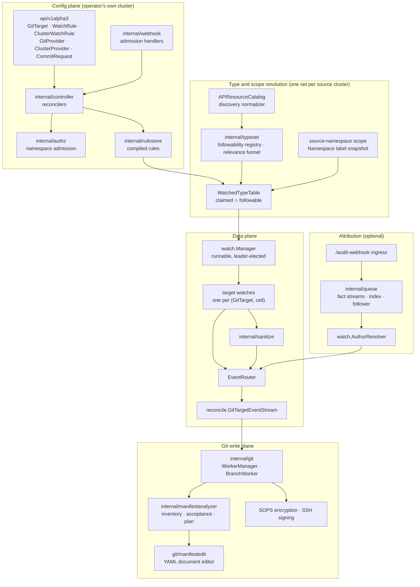
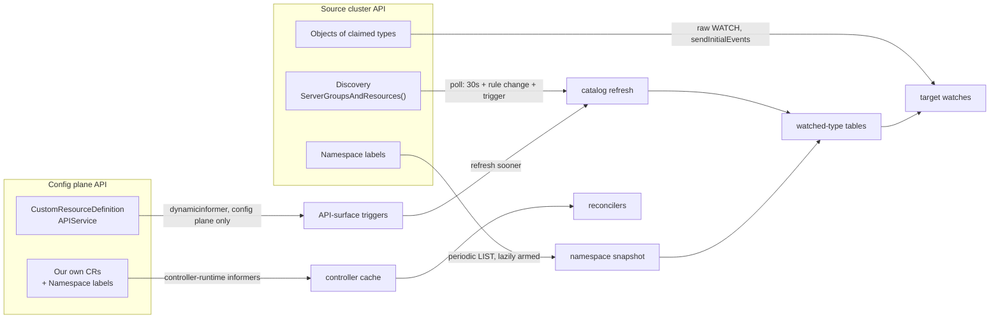
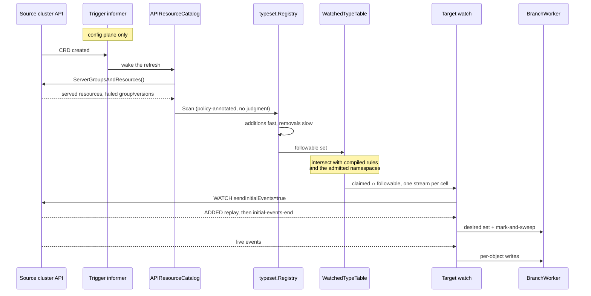

# Component map

What the operator is made of, plane by plane, and which components talk to a Kubernetes API server.
[`architecture.md`](architecture.md) explains how the operator *works*; this page answers the
narrower question of *what the pieces are* and where the boundaries between them fall. If a detail
here disagrees with the source, the source wins.

The operator is **one binary** ([`cmd/main.go`](../cmd/main.go)), assembled onto a single
controller-runtime manager. There is no second deployment and no sidecar. Every plane below is part
of that process, apart from the last: [support and tooling](#support-and-tooling) holds two separate
command-line binaries that are never deployed with it. What makes the operator feel like several
programs is that the one process spans two clusters' worth of concerns:

- the **config plane**, the cluster the operator runs in, where its own custom resources live;
- one or more **source clusters**, each named by a `ClusterProvider`, whose objects are mirrored
  into Git.

The shortest description of the split of responsibility: rules and discovery decide *what* to watch,
the target watches supply *state*, the branch worker owns *Git*, and audit only ever answers *who*.

## The five planes

### Config plane

The operator's own API surface and the reconcilers behind it.

| Component | Path | Role |
|---|---|---|
| CRD types | [`api/v1alpha3/`](../api/v1alpha3/) | the six kinds users apply |
| Reconcilers | [`internal/controller/`](../internal/controller/) | one per kind, plus shared condition and status helpers |
| Admission handlers | [`internal/webhook/`](../internal/webhook/) | the always-allow observer and `validate-operator-types`, which captures a `CommitRequest` submitter |
| Namespace admission | [`internal/authz/`](../internal/authz/) | the `ClusterProvider.spec.accessFrom` decision and the `spec.allowAnySourceNamespace` gate, in their own package because several call sites need the same answer |
| Rule store | [`internal/rulestore/`](../internal/rulestore/) | compiled `WatchRule` and `ClusterWatchRule` cache the data plane reads |

### Type and scope resolution

This layer answers "what does this cluster serve, can we trust that right now, and which of it does
this GitTarget claim". Every source cluster gets its own instance of the whole stack, held in a
`clusterContext`, so one unreachable source never borrows facts from another.

| Component | Path | Role |
|---|---|---|
| `APIResourceCatalog` | [`internal/watch/api_resource_catalog.go`](../internal/watch/api_resource_catalog.go) | turns one discovery result into a policy-annotated `typeset.Scan`. Holds no judgment |
| Followability registry | [`internal/typeset/registry.go`](../internal/typeset/registry.go) | applies "additions fast, removals slow": retain-on-error, and a removal grace before a type is called withdrawn |
| Relevance funnel | [`internal/typeset/funnel.go`](../internal/typeset/funnel.go) | the pure function that judges one type followable, and names the single reason when it is not |
| `WatchedTypeTable` | [`internal/watch/watched_type_table.go`](../internal/watch/watched_type_table.go) | the per-GitTarget resident set of claimed and followable `(GVR, scope)` with its operation filter, which `targetWatchStreams` collapses to one stream per cell |
| `clusterContext` | [`internal/watch/cluster_context.go`](../internal/watch/cluster_context.go) | one per distinct cluster: catalog, registry, dynamic client, discovery client, reachability |
| Type lifecycle | [`internal/typeset/lifecycle.go`](../internal/typeset/lifecycle.go) | names each verdict transition (`TypeActivated`, `TypeWobbling`, `TypeRecovered`, `TypeRemoved`, `TypeRefused`) so a consumer reacts to an edge instead of diffing tables. `Registry.Subscribe` has no observer yet; it is a future input to the watch plan |

### Data plane

State ingestion. One raw watch per `(GitTarget, cell)`, where a cell is group, resource and
namespace and the served version is carried as data rather than identity. Each is sanitized and
routed to a branch worker.

| Component | Path | Role |
|---|---|---|
| Watch manager | [`internal/watch/manager.go`](../internal/watch/manager.go) | a leader-elected runnable that refreshes catalogs and tables, and owns every stream |
| Target watches | [`internal/watch/target_watch.go`](../internal/watch/target_watch.go) | opens the watch with `sendInitialEvents=true`, folds the replay, runs the mark-and-sweep at `initial-events-end`, then streams live |
| Stream readiness | [`internal/watch/stream_readiness.go`](../internal/watch/stream_readiness.go) | the `Replaying` / `Streaming` / `Blocked` roll-up the CRD conditions render |
| Event router | [`internal/watch/event_router.go`](../internal/watch/event_router.go) | dispatches per-type reconciles, sweeps, and field patches to the right branch worker |
| Event stream | [`internal/reconcile/`](../internal/reconcile/) | the per-GitTarget path from watch event to branch worker |
| Sanitizer | [`internal/sanitize/`](../internal/sanitize/) | strips server-side and GitOps-tool fields, and marshals stable YAML |

### Git write plane

One `BranchWorker` owns each `(GitProvider namespace, GitProvider name, branch)` tuple, and every
write to that branch goes through its single event loop.

| Component | Path | Role |
|---|---|---|
| `WorkerManager` and `BranchWorker` | [`internal/git/`](../internal/git/) | clone, plan, commit window, atomic push, conflict replay |
| Manifest analyzer | [`internal/manifestanalyzer/`](../internal/manifestanalyzer/) | folder inventory, the structure-only acceptance gate, and resync planning |
| Document editor | [`internal/git/manifestedit/`](../internal/git/manifestedit/) | edits one YAML document in place inside a multi-document file |
| Manifest report | [`internal/manifestreport/`](../internal/manifestreport/) | projects a live object into a comparable manifest |
| Encryption and signing | [`internal/git/sops_encryptor.go`](../internal/git/sops_encryptor.go), [`internal/sshsig/`](../internal/sshsig/) | SOPS for sensitive types, SSH signatures for commits |

### Attribution

Optional, and deliberately unable to affect *what* is written. It only names the author.

| Component | Path | Role |
|---|---|---|
| Audit ingress | [`internal/webhook/audit_handler.go`](../internal/webhook/audit_handler.go) | receives kube-apiserver audit events on `/audit-webhook/<route>` and publishes a minimal fact |
| Fact transport | [`internal/queue/fact_stream.go`](../internal/queue/fact_stream.go) | Redis Streams by default, an in-process ring with `--author-attribution-transport=memory` |
| Fact index and follower | [`internal/queue/fact_index.go`](../internal/queue/fact_index.go) | a bounded, TTL'd in-process index, followed per type while at least one watch needs it |
| Author resolver | [`internal/watch/author_resolver.go`](../internal/watch/author_resolver.go) | joins a watch event to a fact within a bounded grace window |
| Command author store | [`internal/queue/command_author_store.go`](../internal/queue/command_author_store.go) | the `CommitRequest` submitter captured at admission |

### Support and tooling

| Component | Path | Role |
|---|---|---|
| Resume cursors | [`internal/queue/redis_store.go`](../internal/queue/redis_store.go) | per-watch `resourceVersion` cursors, so a restart resumes instead of cold-replaying |
| Telemetry | [`internal/telemetry/`](../internal/telemetry/) | metrics and OTLP setup |
| SSH and kubeconfig | [`internal/ssh/`](../internal/ssh/), [`internal/kubeconfig/`](../internal/kubeconfig/) | host-key handling, and the reject-not-strip kubeconfig safety check |
| Gitea client | [`internal/giteaclient/`](../internal/giteaclient/) | helper used by the e2e lab |
| `manifest-analyzer` CLI | [`cmd/manifest-analyzer/`](../cmd/manifest-analyzer/) | standalone read-only consumer of the analyzer library |
| Mutation capture lab | [`cmd/mutation-capture-lab/`](../cmd/mutation-capture-lab/), [`internal/mutationlab/`](../internal/mutationlab/) | records real API mutations for test corpora |

## What watches a Kubernetes API server

Five components observe an API server, and they are easy to mistake for duplicates of each other.
Only two of them observe **types**, and those two are complementary by design.

| Observer | Observes | Cluster | Mechanism |
|---|---|---|---|
| Controller cache | the operator's own custom resources, plus `Namespace` (label changes only) | config plane | controller-runtime informers ([`cmd/main.go:1130`](../cmd/main.go#L1130)) |
| API-surface triggers | **types**: `CustomResourceDefinition` and `APIService` objects | config plane only | one private `dynamicinformer` per resource ([`internal/watch/manager_catalog.go:458`](../internal/watch/manager_catalog.go#L458)) |
| Catalog refresh | **types**: the served API surface | every cluster, including remote | polled every 30s, plus rule changes and the trigger above ([`internal/watch/manager.go:288`](../internal/watch/manager.go#L288)) |
| Target watches | **objects** of claimed types | source cluster | raw `dynamic ... Watch()`, no informer and no cache ([`internal/watch/target_watch.go:969`](../internal/watch/target_watch.go#L969)) |

Two more paths reach the operator without being watches at all. The audit webhook is a **push** from
kube-apiserver, and the admission webhooks are synchronous requests. Neither observes state.

### Why two type observers is correct

The catalog refresh is the authority. It is the only thing that produces a `typeset.Scan`, and it is
the only path a **remote** source cluster has, because the trigger informers run in the config plane
only. Discovery has no watch verb, so there is nothing to subscribe to.

The CRD and APIService informers exist to say "refresh sooner than 30 seconds". They hold no
judgment, feed no registry, and post a shared-refresh trigger onto the watch plane owner's queue,
which then marks dirty only the GitTargets whose rendered plan the refresh actually changed
([watch-manager-ownership.md](design/watch-manager-ownership.md)). Removing them would cost latency
on a freshly installed CRD, not correctness. Each one runs under its own context rather than a
shared informer factory, because a factory records a resource as started forever, and a trigger
stopped on `Forbidden` could then never be re-armed.

### The duplication that does exist

Not in the observers. Three places currently recompute a GitTarget's watch set from the same
watched-type table:

- the runner, at [`target_watch.go:105`](../internal/watch/target_watch.go#L105);
- the status roll-up, at [`stream_readiness.go:125`](../internal/watch/stream_readiness.go#L125);
- the resident table store itself, in [`watched_type_resolver.go`](../internal/watch/watched_type_resolver.go).

They agree today only because each re-derives the same answer from the same inputs, and the runner
then cancels and rebuilds every stream whenever any part of the set changes. That is the problem
[`design/target-watch-plan.md`](design/target-watch-plan.md) sets out to fix: diff the plan by cell,
and start, restart or cancel only the cells that changed. The branch worker's queue is untouched by
that plan, so a canceled cell's already-queued work still runs.

## From a served type to an open stream

The path a new CRD takes to become an open watch, and the three places it can stop.

Three gates can stop a type before it reaches a stream:

1. **Followability.** The type must serve `get`, `list`, and `watch`, resolve to a unique kind, and
   come from trusted discovery. A degraded group version keeps its last-known record and is
   `Retained`, never treated as withdrawn.
2. **The claim.** Some rule attached to the GitTarget must select it, and the GitTarget's namespace
   must be admitted by the `ClusterProvider`.
3. **The acceptance gate.** The Git folder must be one the operator can own. A refusal is recorded
   as `GitPathAccepted=False` and nothing is committed.

## Where to read next

- [`architecture.md`](architecture.md) for how the pieces work together, starting at Ground Rules
  and Mental Model.
- [`design/watch-and-catalog-architecture.md`](design/watch-and-catalog-architecture.md) for the
  target three-layer watch model: cells, the confidence model, and the managed projection.
- [`design/target-watch-plan.md`](design/target-watch-plan.md) for the implementable plan that
  replaces wholesale stream replacement with an incremental diff.
- [`design/data-plane-triggering.md`](design/data-plane-triggering.md) for why that refactor is
  needed, starting from the production failure that prompted it.
