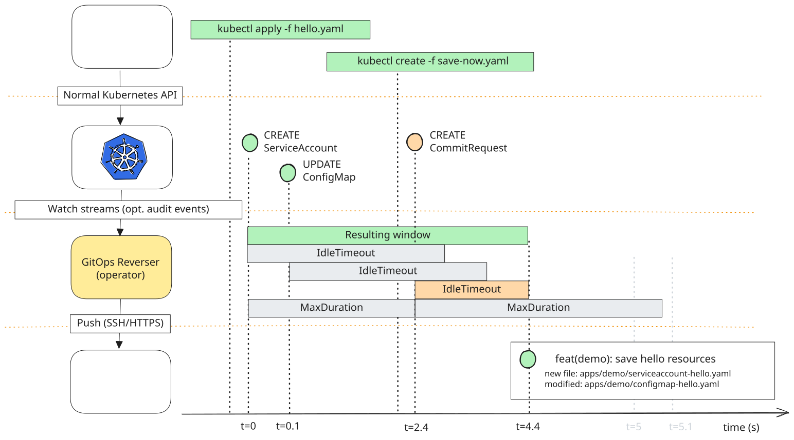
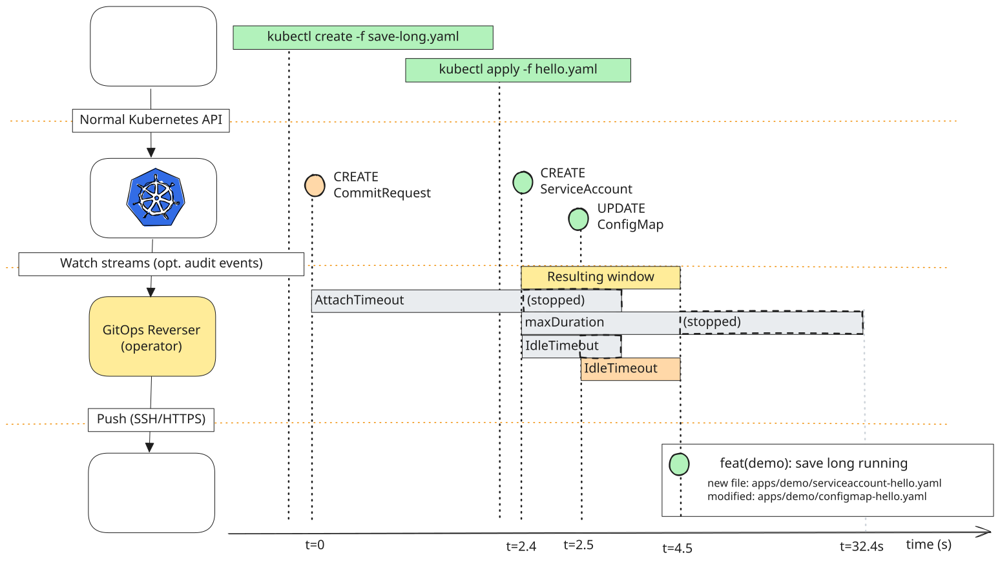

# Commit-window example

Two Kubernetes resources become one Git commit: one created, one edited. A `CommitRequest` supplies
the message and its own timers, which replace the target's for that one window. You can save after
the changes or before them; the example shows both. The request itself is outside the selected
resource types, so saving never commits the save button.

**Run the [quickstart](../quickstart.md) first.** It leaves behind everything this example builds
on: the `gitops-reverser-quickstart-demo` namespace, the `git-creds` Secret, a `GitProvider` named
`example-provider` whose `allowedBranches` is `"*"`, and the `default` `ClusterProvider`. If you
configured those yourself instead, substitute your own names below.

The example writes to its own branch, `commit-window-demo`, which no reconciler deploys. The
quickstart's own starter `GitTarget` keeps watching ConfigMaps in this namespace and writing them to
`live-cluster` on `main`, so the ConfigMap below lands in both places. That is expected: two targets
may share one provider as long as they write different folders.

## Select the resources

Save as `watch.yaml`. All resources in this example use the same namespace and target.

```yaml
apiVersion: configbutler.ai/v1alpha3
kind: GitTarget
metadata:
  name: window-demo
  namespace: gitops-reverser-quickstart-demo
spec:
  gitProviderRef:
    name: example-provider
  branch: commit-window-demo
  path: apps/demo
  commit:
    window:
      idleTimeout: "5s"
    message:
      requestTemplate: |-
        {{.RequestMessage}}

        {{range .Resources -}}
        {{.Kind}}/{{.Name}}
        {{end -}}
  placement:
    byType:
      v1/configmaps: "configmap-{name}.yaml"
      v1/serviceaccounts: "serviceaccount-{name}.yaml"
---
apiVersion: configbutler.ai/v1alpha3
kind: WatchRule
metadata:
  name: window-demo
  namespace: gitops-reverser-quickstart-demo
spec:
  gitTargetRef:
    name: window-demo
  rules:
    - apiGroups: [""]
      apiVersions: [v1]
      resources: [configmaps, serviceaccounts]
```

The rule mirrors each selected collection's creates, updates, and deletions; the target's
`spec.prune.mode` decides whether a deletion removes the Git document.

Two fields exist for the sake of a legible demo rather than because the window needs them:

- **`placement.byType`** puts both files directly under `apps/demo` as `configmap-hello.yaml` and
  `serviceaccount-hello.yaml`. Without it they land on the
  [built-in canonical path](../configuration.md#declaring-a-layout-bytype--default),
  `apps/demo/gitops-reverser-quickstart-demo/configmaps/hello.yaml`.
- **`requestTemplate`** keeps the changed resources in the commit body underneath the requested
  message. A request message otherwise **replaces** the generated message entirely, so the commit
  would say why but no longer say what. See
  [framing a save message](../commit-messages.md#framing-a-save-message).
  `{{.Kind}}` is read off the object, and a `DELETE` event carries none, so a deletion in the window
  renders as `/hello`. Use `{{.Resource}}` where a window can contain one; the built-in live template
  does.

Apply this setup and let the initial synchronization finish before going on:

```bash
kubectl apply -f watch.yaml
kubectl get gittarget,watchrule -n gitops-reverser-quickstart-demo
```

The rule selects **two resource types in that namespace**, not two individual names. Other ConfigMaps and
ServiceAccounts in that namespace are also eligible. Initial synchronization may capture existing
resources such as the `kube-root-ca.crt` ConfigMap and the `default` ServiceAccount. Keep other
writes to the target quiet while you run the example.

## Seed the ConfigMap

Create the ConfigMap on its own first, so the recorded batch below contains one `CREATE` and one
`UPDATE` rather than two creates. Let its commit land before going on:

```bash
kubectl create configmap hello --from-literal=message="Hello" -n gitops-reverser-quickstart-demo
```

## Apply the resources

Save as `hello.yaml`. These demonstrate resource capture without deploying a workload. The
ServiceAccount is new; the ConfigMap changes the value seeded above.

```yaml
apiVersion: v1
kind: ServiceAccount
metadata:
  name: hello
  namespace: gitops-reverser-quickstart-demo
automountServiceAccountToken: false
---
apiVersion: v1
kind: ConfigMap
metadata:
  name: hello
  namespace: gitops-reverser-quickstart-demo
data:
  message: Hello from Reverse GitOps
```

## Save after the changes

Save as `save-now.yaml`. Use `kubectl create` rather than `kubectl apply`: the request has a
`generateName` and no name, so each save is a fresh object and `apply` refuses it.

```yaml
apiVersion: configbutler.ai/v1alpha3
kind: CommitRequest
metadata:
  generateName: save-hello-
  namespace: gitops-reverser-quickstart-demo
spec:
  gitTargetRef:
    name: window-demo
  message: "feat(demo): save hello resources"
  window:
    attach: CurrentOrNext
    attachTimeout: "2s"
    maxDuration: "2s"
```

These are the defaults written out. Apply the resources, then save:

```bash
kubectl apply -f hello.yaml && sleep 2 && kubectl create -f save-now.yaml
```

The `sleep` only spreads the timeline out so it matches the picture; the save works without it.



| Time | What happens |
|---|---|
| t=0 | `CREATE ServiceAccount` opens the window, under the target's timers: `idleTimeout: 5s` and the default `maxDuration: 1m` |
| t=0.1 | `UPDATE ConfigMap` joins it and restarts the idle timer, which would now close the window at t=5.1 |
| t≈2.4 | The request attaches to the open window. Its timers replace the target's: `maxDuration: 2s` from now, and no idle timer |
| t≈4.4 | `maxDuration` closes the window, and the commit carries the request's message |

`attachTimeout` hardly matters here, because the window is already open when the request arrives. It
is there for the case where the watch events reach the operator a little after the request.

## Save before the changes

The request can come first, and wait for the changes. Save as `save-long.yaml`:

```yaml
apiVersion: configbutler.ai/v1alpha3
kind: CommitRequest
metadata:
  generateName: save-hello-
  namespace: gitops-reverser-quickstart-demo
spec:
  gitTargetRef:
    name: window-demo
  message: "feat(demo): save hello resources"
  window:
    attach: Next
    attachTimeout: "10s"
    idleTimeout: "2s"
    maxDuration: "30s"
```

To run it after the first save, put the resources back where they started: delete the
ServiceAccount, set the ConfigMap back to `Hello`, and wait five seconds for that commit to land.

```bash
kubectl delete serviceaccount hello -n gitops-reverser-quickstart-demo
kubectl create configmap hello --from-literal=message="Hello" -n gitops-reverser-quickstart-demo \
  --dry-run=client -o yaml | kubectl apply -f -
```

Then save, and make the changes:

```bash
kubectl create -f save-long.yaml && sleep 2 && kubectl apply -f hello.yaml
```



| Time | What happens |
|---|---|
| t=0 | The request registers and waits up to `attachTimeout: 10s` for a window. `attach: Next` first closes any window of yours that is already open, so earlier edits keep their own commit |
| t≈2.4 | `CREATE ServiceAccount` opens a window, and the waiting request attaches in the same step. Its timers replace the target's: `idleTimeout: 2s` and `maxDuration: 30s`, both counted from here |
| t≈2.5 | `UPDATE ConfigMap` joins it and restarts the idle timer |
| t≈4.5 | Two seconds of silence: `idleTimeout` closes the window, and the commit carries the request's message |

A request that waits needs an `idleTimeout`. Without one, only `maxDuration` would close the window,
thirty seconds after the first change. If no change arrives within `attachTimeout`, the request ends
with `NoWindow` and commits nothing, unless it sets `whenNothingToCommit: CommitEmpty`.

In both variants, the request must reach a matching open window, or one must open before
`attachTimeout` runs out. Neither timer guarantees that every event has arrived: an event that
reaches the operator after the window closed goes into the next commit.

The default configured-author setup without request author capture works for this example. If actor
attribution and request author capture are enabled, submit the resources and the request as the same
Kubernetes user. See [CommitRequest](../configuration.md#commitrequest) for author matching and
outcomes.

## Check the result

```bash
kubectl get commitrequests -n gitops-reverser-quickstart-demo -o wide
```

Look for `Pushed=True` and a `status.commit`. `Pushed` is a wide column; `Ready` and the `COMMIT`
column show without `-o wide`. A terminal `Ready=True` on its own does not prove a commit was pushed: it is
also the outcome when there was nothing to save or no matching open window.

Applying several resources sends separate API writes. The window groups their captured changes into
one commit:

```text
feat(demo): save hello resources

ServiceAccount/hello
ConfigMap/hello
```

The commit adds `apps/demo/serviceaccount-hello.yaml` and modifies `apps/demo/configmap-hello.yaml`.

| Resource | Captured by this rule? |
|---|---|
| ServiceAccount, ConfigMap | Yes |
| CommitRequest, GitTarget, WatchRule | No |
| Services, Deployments, Pods, ReplicaSets | No |

Without the request, the window closes on its own five seconds after the last change, and the
built-in live template writes the message instead.
