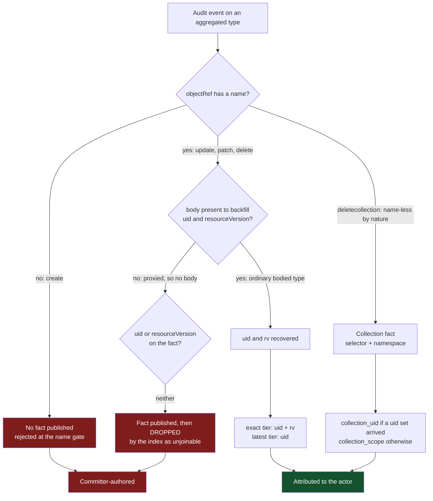
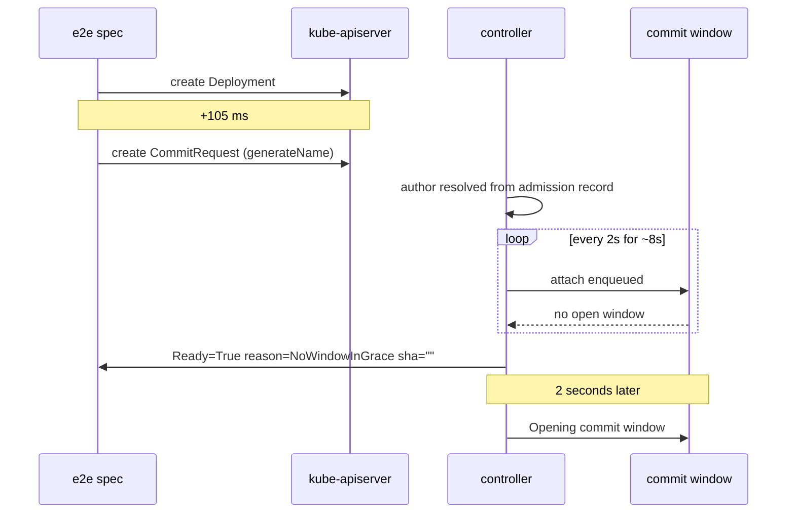

# Findings on the attribution fact switchover

What this branch's loose ends turned out to be, and which of them are measured rather than reasoned.
Four findings: one lab defect that hid every other measurement, two results about aggregated-API
removals that the corpus now carries, and one open product race the e2e suite was failing to report.

The two aggregated results are measurements, captured by the mutation lab against the e2e cluster and
committed to the corpus. The window race is reproduced but not root-caused.

## 1. The lab was serving the wrong audit route, so nothing was audited

The mutation lab registered exactly one audit path, `/audit-webhook`. The e2e cluster's audit
kubeconfig posts to `/audit-webhook/default` — the route is NAMED after the `default`
ClusterProvider, because the bare path is the product's shared, annotation-routed endpoint. Go's
`ServeMux` treats a pattern without a trailing slash as an exact match, so every audit event the API
server sent got a 404.

The store held 133 admission records and 10 watch records, and zero audit records. Every scenario
that requires an audit event timed out — including the seventeen long-standing ones — which reads
exactly like a broken cluster rather than a one-line routing mismatch. That is the expensive part:
the lab's failure mode is indistinguishable from the environment's.

Fixed by serving the whole `/audit-webhook/` subtree. Row 15 went from a 91-second timeout to passing
in 6.6 seconds, and all twenty scenarios pass. The seventeen previously committed corpus rows
re-captured byte-identical, which is the positive result for a re-capture.

## 2. An aggregated-API removal carries no uid

Corpus `flunder/aggregated-api-delete/`. The kube-apiserver proxies the request to the extension
server and never decodes what came back, so the audit event's `objectRef` carries:

```yaml
objectRef:
  apiGroup: wardle.example.com
  apiVersion: v1alpha1
  name: fl-del          # from the URL path
  namespace: <ns-1>
  resource: flunders
verb: delete
```

No `uid`. No `resourceVersion`. No `responseObject` to recover either from. Meanwhile the watch
`DELETED` for the same object carries the full body, uid included.

## 3. An aggregated deletecollection returns no response body

Corpus `flunder/aggregated-api-deletecollection/`. One audit record, name-less, with the selector
visible only in the `requestURI`, and no response body — so the collection fact carries no uid set
and the join can only proceed by scope. This is precisely the case the deleted response-body expander
produced nothing at all for, and it is the case `collection_scope` exists to serve.

The scenario deletes three flunders to make the asymmetry unmistakable: three watch `DELETED` events
and three admission records against one audit record that names none of them.

## Where each verb falls out



Only the collection delete reaches an author. A create produces no fact at all; an update, a patch or
a single delete produces one the index discards on arrival.

## 4. The missing name changes behaviour only where there is no body

This was worth checking, because "the name is not available yet" describes both a `generateName`
create and an aggregated write, and it would be reasonable to expect them to fail the same way. They
do not, and the reason is the fork in the middle of the diagram.

`IdentityFromAuditEvent` takes namespace, name and uid from `objectRef`, then backfills whatever is
still missing from the event's body:

```go
preferred, fallback := bodyPriority(event, op)
backfillIdentityFromBody(&id, preferred)
backfillIdentityFromBody(&id, fallback)
```

For a `generateName` create on an ordinary type, `objectRef.name` is empty — the API server assigns
the name — but the policy captures at `RequestResponse`, so the `responseObject` carries the assigned
name and uid and the backfill recovers both. The fact publishes and joins normally.

For an aggregated write there is no body to backfill from, so nothing is recovered. The same empty
field is fatal in one case and harmless in the other, and the discriminator is the body, not the
name. So: yes, the unavailable name does change behaviour — but only where the body cannot cover for
it, and that is exactly the aggregated population.

Worth capturing as a lab row rather than leaving as reasoning. A `generateName` scenario on an
ordinary type would commit the recovery as evidence, and the corpus has no row for it today.

## 5. Open: a CommitRequest can miss the window of the write it follows

The e2e spec `finalizes a CommitRequest created with metadata.generateName` fails in CI, in the full
local suite, and in an isolated local run. It is not a flake.



Both runs show the same two-second miss, so it is not load. Two earlier Deployments against the same
GitTarget opened their windows within a couple of seconds; the third does not open one for about ten,
and the request's grace expires at eight.

Not yet established: whether this is new on this branch. The shape is consistent with making the
write path wait for attribution evidence before it can act, and audit latency is ruled out — the
cluster runs `--audit-webhook-batch-max-wait=1s`. Confirming it needs a run against a pre-branch
commit.

### The assertion that hid it

The spec asserted `Ready=True` and then a non-empty `status.sha`. But `Ready=True` is also the benign
rejection state: `rejectCommitRequest` sets it deliberately for `NoWindowInGrace`, `WindowMismatch`
and `AlreadyPresent`, so that kstatus reads Current rather than Failed. The Ready assertion therefore
passed on a request that committed nothing, and the spec spent the remaining two minutes re-reading
an empty string before reporting:

```text
Expected
    <string>:
not to be empty
```

The reason was sitting in the condition the spec never read. `expectCommitRequestCommitted` now
requires the Ready reason to be `Committed` and gives up as soon as any other terminal outcome
appears, because a terminal outcome is final and re-reading it cannot change the answer. The same
failure now reports in ten seconds, naming `NoWindowInGrace` and its message.

## Potential solutions

### For aggregated per-object attribution

**A. A name tier.** `(route, group/resource, namespace, name)`, joining the audit event's name
against the watch event's name. It fixes the update, the patch and the single delete. It cannot fix
the create, whose `objectRef` has no name at all, so nothing is published for any tier to join.

It is weaker than uid: a name is reused after a delete-and-recreate where a uid is not. So it belongs
below the uid tiers, and plausibly below `latest`, with the same care the scope tier gets.

It also needs the fact's `name` field back on the wire. That field was removed during this work on
the observation that no tier read it — true at the time, and exactly the field this tier would need.
"No code reads it" and "nothing could ever read it" are different claims, and only the second one
justifies deleting a field.

**B. Accept that aggregated types are collection-only.** Document that per-object attribution does
not apply to them, keep `collection_scope`, and let everything else ship committer-authored. Cheapest
option, and honest, but it makes the guarantee type-dependent in a way a user cannot predict from the
API surface.

**C. Shorten the wait for the populations that can never produce a fact.** An aggregated create can
be recognised as unattributable at publish time rather than after a grace. This does not attribute
anything; it stops paying the grace for evidence that provably is not coming.

Recommendation: A for the two rows it fixes, C alongside it, and B written down for the create either
way — because A does not reach it.

### For the window race

The assertion fix is landed and is not itself a fix for the race. The remaining question is which of
these is true:

1. The window legitimately takes ten seconds to open and the CommitRequest's grace is simply too
   short, in which case the grace is the thing to change.
2. The window is waiting on attribution evidence it should not need to open, in which case the write
   path is the thing to change.

These are distinguishable by measurement, and the same pre-branch run settles both.
