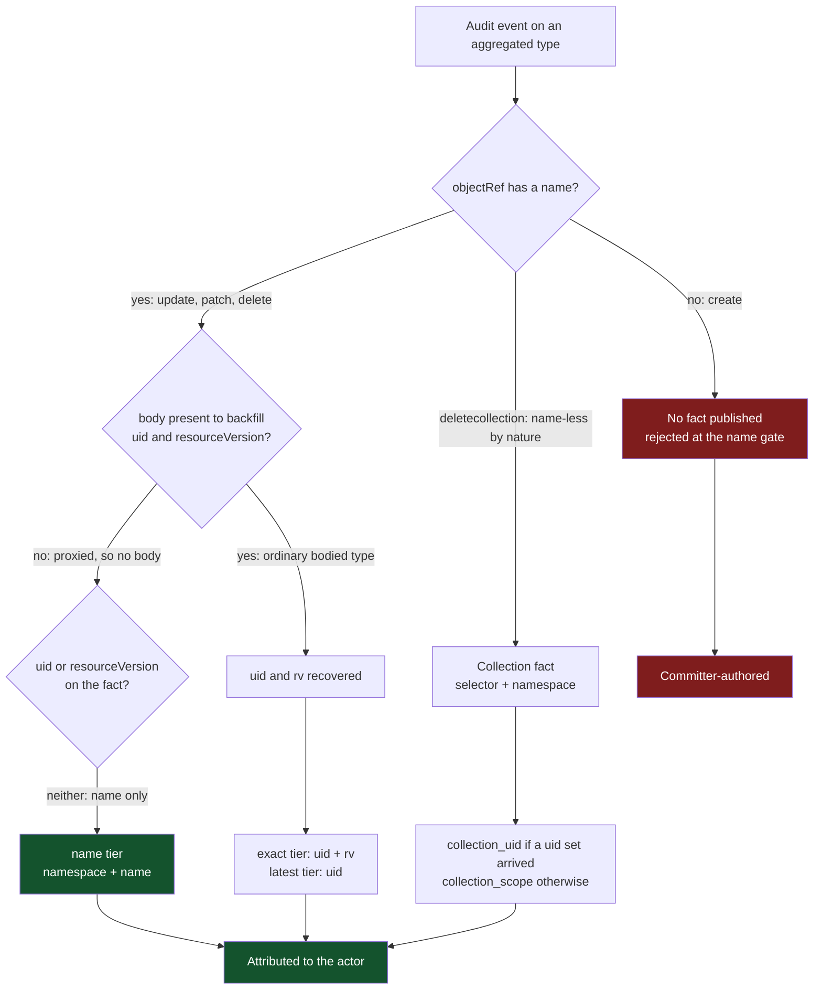
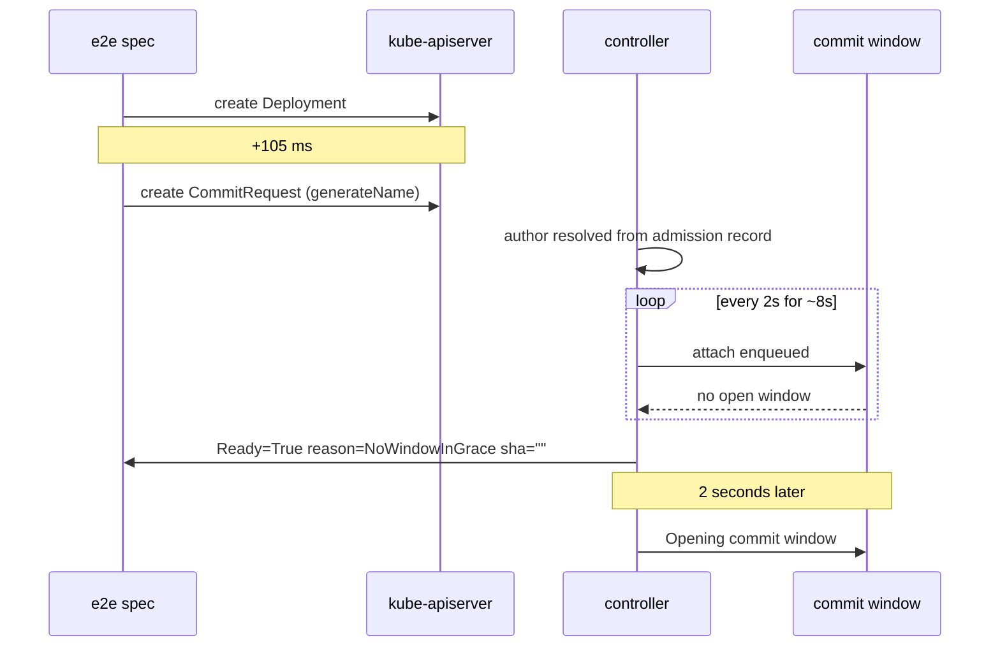

# Findings on the attribution fact switchover

What this branch's loose ends turned out to be, and which of them are measured rather than reasoned.
Five findings: one lab defect that hid every other measurement, three results about how an audit event
identifies its object that the corpus now carries, and one open product race the e2e suite was failing
to report.

The three identity results are measurements, captured by the mutation lab against the e2e cluster and
committed to the corpus. The window race is reproduced but not root-caused.

## 1. The lab was serving the wrong audit route, so nothing was audited

The mutation lab registered exactly one audit path, `/audit-webhook`. The e2e cluster's audit
kubeconfig posts to `/audit-webhook/default`. The route is NAMED after the `default`
ClusterProvider, because the bare path is the product's shared, annotation-routed endpoint. Go's
`ServeMux` treats a pattern without a trailing slash as an exact match, so every audit event the API
server sent got a 404.

The store held 133 admission records and 10 watch records, and zero audit records. Every scenario
that requires an audit event timed out (including the seventeen long-standing ones), which reads
exactly like a broken cluster rather than a one-line routing mismatch. That is the expensive part:
the lab's failure mode is indistinguishable from the environment's.

Fixed by serving the whole `/audit-webhook/` subtree. Row 15 went from a 91-second timeout to passing
in 6.6 seconds, and every scenario passes. The seventeen previously committed corpus rows re-captured
byte-identical, which is the positive result for a re-capture.

## 2. An aggregated-API removal carries no uid

Corpus `flunder/aggregated-api-delete/`. The kube-apiserver proxies the request to the extension
server and never decodes what came back, so the audit event's `objectRef` carries:

```yaml
objectRef:
  apiGroup: wardle.example.com
  apiVersion: v1alpha1
  name: fl-del          # from the URL path
  namespace: <ns-1>
  resource: flunders
verb: delete
```

No `uid`. No `resourceVersion`. No `responseObject` to recover either from. Meanwhile the watch
`DELETED` for the same object carries the full body, uid included.

## 3. An aggregated deletecollection returns no response body

Corpus `flunder/aggregated-api-deletecollection/`. One audit record, name-less, with the selector
visible only in the `requestURI`, and no response body: the collection fact therefore carries no uid
set and the join can only proceed by scope. This is precisely the case the deleted response-body expander
produced nothing at all for, and it is the case `collection_scope` exists to serve.

The scenario deletes three flunders to make the asymmetry unmistakable: three watch `DELETED` events
and three admission records against one audit record that names none of them.

## Where each verb falls out



Every verb but the create now reaches an author. Before the name tier, only the collection delete
did: an update, a patch or a single delete published a fact the index discarded on arrival, because
it could be keyed on nothing. The create still reaches no one, and cannot, because its audit event
never says which object it was about.

## 4. The missing name changes behavior only where there is no body

This was worth checking, because "the name is not available yet" describes both a `generateName`
create and an aggregated write, and it would be reasonable to expect them to fail the same way. They
do not, and the reason is the fork in the middle of the diagram.

`IdentityFromAuditEvent` takes namespace, name and uid from `objectRef`, then backfills whatever is
still missing from the event's body:

```go
preferred, fallback := bodyPriority(event, op)
backfillIdentityFromBody(&id, preferred)
backfillIdentityFromBody(&id, fallback)
```

For a `generateName` create on an ordinary type, `objectRef.name` is empty (the API server assigns
the name), but the policy captures at `RequestResponse`, so the `responseObject` carries the assigned
name and uid and the backfill recovers both. The fact publishes and joins normally.

For an aggregated write there is no body to backfill from, so nothing is recovered. The same empty
field is fatal in one case and harmless in the other, and the discriminator is the body, not the
name. So: yes, the unavailable name does change behavior, but only where the body cannot cover for
it, and that is exactly the aggregated population.

This is captured rather than left as reasoning. Corpus `configmap/generate-name-create/` is row 18,
the control for the two aggregated rows: it asserts that the `objectRef` carries no name and that the
response body does, so the recovery is evidence in the tree rather than a claim in a paragraph. Put
the three rows side by side and the discriminator is visible without reading any code.

## 5. Open: a CommitRequest can miss the window of the write it follows

The e2e spec `finalizes a CommitRequest created with metadata.generateName` fails in CI, in the full
local suite, and in an isolated local run. It is not a flake.



Both runs show the same two-second miss, so it is not load. Two earlier Deployments against the same
GitTarget opened their windows within a couple of seconds; the third does not open one for about ten,
and the request's grace expires at eight.

Not yet established: whether this is new on this branch. The shape is consistent with making the
write path wait for attribution evidence before it can act, and audit latency is ruled out: the
cluster runs `--audit-webhook-batch-max-wait=1s`. Confirming it needs a run against a pre-branch
commit.

### The assertion that hid it

The spec asserted `Ready=True` and then a non-empty `status.sha`. But `Ready=True` is also the benign
rejection state: `rejectCommitRequest` sets it deliberately for `NoWindowInGrace`, `WindowMismatch`
and `AlreadyPresent`, so that kstatus reads Current rather than Failed. The Ready assertion therefore
passed on a request that committed nothing, and the spec spent the remaining two minutes re-reading
an empty string before reporting:

```text
Expected
    <string>:
not to be empty
```

The reason was sitting in the condition the spec never read. `expectCommitRequestCommitted` now
requires the Ready reason to be `Committed` and gives up as soon as any other terminal outcome
appears, because a terminal outcome is final and re-reading it cannot change the answer. The same
failure now reports in ten seconds, naming `NoWindowInGrace` and its message.

## The decision: a name tier, built

A name tier is now built rather than proposed. `AuthorFact.Name` is back on the wire, and the
index files a fact under `(namespace, name)` when it carries neither a uid nor a resourceVersion.
`Lookup` consults that tier last, below the rv-only hatch, and reports `AttributionName`.

The ordering argument is that a name is the weakest per-object evidence available: it is reused after
a delete and recreate, where a uid never is and an rv identifies one specific write. Ranking it last
costs the stronger tiers nothing, because no fact carrying a uid or an rv is ever filed there, and no
query reaches it until every stronger tier has missed.

What it fixes is exactly the two rows it can reach: an aggregated update or patch, and an aggregated
single delete. Both used to publish a fact the index then discarded, so they shipped
committer-authored whoever ran them.

Restoring the field is the part worth being explicit about. It was removed during this work on the
observation that no tier read it. That was true of the code and false of the domain: for a whole
population of writes the name is the only identity the audit event carries, so a fact without it
could not be joined at all. "No code reads it" and "nothing could ever read it" are different claims,
and only the second one justifies deleting a field.

### What the name tier still does not reach

**The aggregated create.** Its `objectRef` carries no name, and there is no response body to recover
one from, so `AuthorFactFromEvent` rejects it at the name gate and nothing is published for any tier
to join. This is not a gap in the tier; it is a request the API server logged without ever saying
which object it was about.

Two options remain open for that population, and they are not exclusive:

**B. Accept that aggregated creates are unattributable.** Document that per-object attribution does
not apply to them, and let them ship committer-authored. Honest, but it makes the guarantee
type-dependent in a way a user cannot predict from the API surface.

**C. Shorten the wait for facts that provably are not coming.** An aggregated create can be
recognized as unattributable at publish time rather than after a full grace. This attributes nothing;
it stops paying for evidence that cannot arrive.

### For the window race

The assertion fix is landed and is not itself a fix for the race. The remaining question is which of
these is true:

1. The window legitimately takes ten seconds to open and the CommitRequest's grace is too
   short, in which case the grace is the thing to change.
2. The window is waiting on attribution evidence it should not need to open, in which case the write
   path is the thing to change.

These are distinguishable by measurement, and the same pre-branch run settles both.
