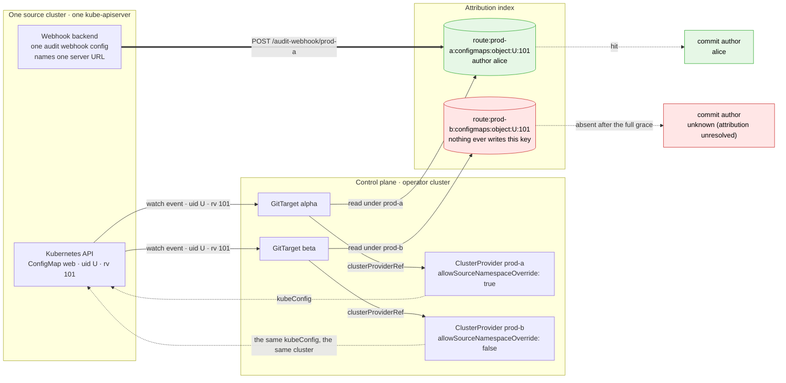
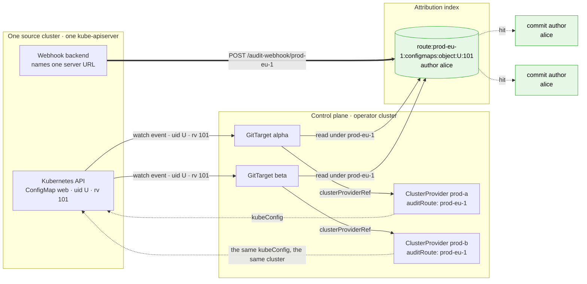

# Attribution when several ClusterProviders name one cluster

> **design**: implemented. Index: [`../INDEX.md`](../INDEX.md)
>
> Status: the field, the two renames, the dropped ingestion gate, and the warning are built and
> covered by unit and e2e tests. Two deviations from the text below are marked in place: the value
> is validated as a DNS-1123 **subdomain** rather than a label, and the `lastAuditEventTime` status
> field is NOT built (the warning is).
>
> Prompted by a bug report from the gitops-api team (`docs/bug-report.md`): every object mirrored
> through a dedicated in-cluster `ClusterProvider` was committed as
> `unknown (attribution unresolved)`. The report's diagnosis is correct and is reproduced in code
> below. Its recommended fix (make the failure loud) is adopted here as one half of the answer.

## The decision

A `ClusterProvider` declares the audit route its cluster's events arrive on, and that declared
value rather than the object's name is what partitions the attribution facts. Several providers may
name one physical cluster by carrying the same route. The field defaults to the object's own name,
so every install that works today keeps working unchanged.

```yaml
apiVersion: configbutler.ai/v1alpha3
kind: ClusterProvider
metadata:
  name: tenant-acme-delegating   # the name humans read and GitTargets reference
spec:
  attribution:
    auditRoute: prod-eu-1        # the route this cluster's audit events arrive on
```

Ingestion does not change, and it loses its only Kubernetes read: an audit event arrives, and its
fact is stored under the route it arrived on, with no lookup, no existence check, and no fan out.
The key keeps its structure, and the rest of the system is renamed to speak the same word.

## What happens today

The write side files a fact under the name in the audit route. The read side looks one up under the
name on the `GitTarget`. Both are the provider name, exactly as designed, and they diverge whenever
those two names are not the same object.

| Side | Code | Key input |
|---|---|---|
| write | [`audit_handler.go`](../../internal/webhook/audit_handler.go) `resolveRoute` then `RecordFact` | the `<name>` in `/audit-webhook/<name>` |
| read | [`target_watch.go`](../../internal/watch/target_watch.go) `attachAuthor` then `LookupAuthorResolution` | `GitTarget.SourceCluster()`, the `spec.clusterProviderRef` name |

A kube-apiserver takes one `--audit-webhook-config-file`, and that file
[uses the kubeconfig format to specify *the remote address of the service*](https://kubernetes.io/docs/tasks/debug/debug-cluster/audit/#webhook-backend),
singular. So one physical cluster feeds exactly one provider name through its
[webhook backend](https://kubernetes.io/docs/tasks/debug/debug-cluster/audit/#webhook-backend), and
that is the constraint everything below follows from. Every other `ClusterProvider` naming that same
cluster reads a partition nothing writes, and each of its commits is authored
`unknown (attribution unresolved)` after waiting out the full grace window. Nothing fails, no
condition changes, and the mirrored content is correct, so the loss is visible only in the commit
author.

Two providers, one remote cluster, one audit route. Both targets see the same object on their own
watch, and both look for the same write, under two different keys:



The reported case is this picture with `kubeConfig` omitted from both providers and the route named
`default`: the local apiserver posts to `/audit-webhook/default`, `prod-b` becomes
`srcns-delegating`, and the red path is the one the gitops-api team saw. Nothing about the diagram
depends on the cluster being remote. It depends only on two provider names sharing one audit route.

The reported run is the clean form of this: five objects mirrored through `srcns-delegating` were
`absent`, the objects mirrored through `default` in the same run resolved, and the fact counters
showed `written=66 / matched=12` with zero expiries. Facts were being written the whole time, under
a key nobody read.

## Why several providers name one cluster

`ClusterProvider` carries two jobs on one object. It is the cluster's **identity** (the audit route,
the fact partition, the GVK to GVR registry key), and it is a **policy** holder:
`spec.allowedNamespaces` decides which namespaces may reference it, and
`spec.allowSourceNamespaceOverride` delegates source-namespace selection to admitted `GitTarget`s.

The identity job wants one object per cluster. The policy job wants one object per delegation
stance, because both fields are provider-wide. A platform administrator who grants the override to
one tenant and withholds it from another has no choice but to create two providers on the same
cluster. That is what [`watchrule-source-namespace/`](watchrule-source-namespace/README.md) shipped,
and its own e2e creates `srcns-delegating` and `srcns-non-delegating` side by side. The
configuration in the bug report is one the product encourages.

Splitting `metadata.name` from the audit route resolves that tension without splitting the object:
the name serves the policy job (one object per stance, named for the stance), and the route serves
the identity job (one value per cluster, shared by every object that carries it).

## The constraint on any fix

Ingestion stays low level and trackable. An audit event arrives, it is reduced to a fact, and the
fact is stored under the route it arrived on. Ingestion does not read a `ClusterProvider`,
does not resolve locality, does not write a fact more than once, and does not refuse an event
because something is missing. A provider may be created later, deleted and recreated, or renamed
around a running audit stream, and none of that is ingestion's problem: the facts carry a short TTL
and a stored fact nobody reads costs one expiring Redis key.

Whether a fact may be *used* is not a keyspace question. A `GitTarget` mirrors an object only when
`allowedNamespaces`, `allowedSourceNamespaces`, and the `WatchRule` gate all admit it. By the time a
watch event reaches the resolver, the decision to mirror that object has been taken. Attribution
answers a narrower question: who last wrote the object this event carries.

## The proposal

### The field

A new optional field, on the provider that owns the cluster identity:

```go
// AuditRoute is the route this cluster's audit events arrive on. The sender is the API server's
// webhook backend (https://kubernetes.io/docs/tasks/debug/debug-cluster/audit/#webhook-backend),
// and this is the <name> segment its configured URL ends in: /audit-webhook/<name>. When several
// logical clusters share one backend it is instead the value of the audit-event annotation named
// by --author-attribution-audit-route-annotation-key.
//
// It partitions the attribution facts, so two ClusterProviders carrying the same route read one
// cluster's facts, and two carrying different routes can never cross-credit an author.
//
// Empty means metadata.name, which is the single-provider-per-cluster convention and what every
// existing install already does. Set it when several ClusterProviders name one cluster (only one
// of them can be what the API server posts under), or when the audit events are labelled for
// something other than this object, such as a kcp logical cluster.
// +optional
AuditRoute string `json:"auditRoute,omitempty"`
```

Resolved through a method, the same shape as
[`GitTarget.SourceCluster()`](../../api/v1alpha3/gittarget_types.go), so no caller ever sees the
empty case:

```go
func (p *ClusterProvider) AuditRoute() string {
    if p.Spec.Attribution == nil || p.Spec.Attribution.AuditRoute == "" {
        return p.Name
    }
    return p.Spec.Attribution.AuditRoute
}
```

It is **mutable**, unlike `spec.kubeConfig`. Repointing it changes which partition is read, not
which cluster is mirrored, so it is not the silent-retarget hazard immutability exists to prevent.
Correcting a typo should not require deleting the object.

### The key keeps its shape and renames its infix

```text
<prefix>:author:v1:audit:route:<auditRoute>:<group/resource>:object:<uid>:<rv>
<prefix>:author:v1:audit:route:<auditRoute>:<group/resource>:object:<uid>:last
<prefix>:author:v1:audit:route:<auditRoute>:<group/resource>:rv:<rv>
```

The infix stays on all three families, including the rv-only hatch where it is
[correctness work](../finished/multi-cluster-author-attribution.md) rather than partitioning, since
resourceVersions are small cluster-scoped integers that collide freely. Two things change: the
value, which becomes a declared route rather than an object name, and the label, which becomes
`route:` where it was `cluster:`.

The label is spelled `route:` rather than `auditRoute:` because the key already says `audit` one
segment earlier (`author:v1:audit:`), so the longer form would stutter. It reads as one path:
*author, from audit, on route `prod-eu-1`*.

The same two providers, now agreeing on one identifier:



### Ingestion gets simpler, not harder

Today a named route 404s when the `ClusterProvider` does not exist, and the annotation-routed bare
endpoint rejects an event whose annotation names no provider. Both checks go away, and with them the
`AuditProviderResolver` interface, its `clusterProviderExistence` implementation in `cmd/main.go`,
and the startup rule that annotation routing requires a resolver. Ingestion becomes: parse the route
or the annotation, record the fact under it. It makes no Kubernetes API call at all.

That is correct under this design because the route is no longer a claim about an object that must
exist. It is the partition name. An audit batch in flight while a provider is being created or
recreated is currently dropped (and the apiserver does not retry a 404); now it is stored, and the
provider joins it when it arrives.

The authentication boundary does not move. The audit server still requires a client certificate
signed by the audit CA (`RequireAndVerifyClientCert`), which is what stops an unauthenticated
producer. The existence check was never an authorization check:
[`multi-source-audit-ingress-hardening.md`](multi-source-audit-ingress-hardening.md) already records
that "a holder of a shared, CA-signed client certificate can therefore submit facts for any existing
provider route". Removing it widens that from any existing route to any string, which changes the
blast radius of an already-accepted trust assumption rather than opening a new one.

> **This touches an open design.**
> [`multi-source-audit-ingress-hardening.md`](multi-source-audit-ingress-hardening.md) lists "an
> event with a missing, unknown, or untrusted annotation records no fact" as an acceptance criterion
> for annotation routing. That criterion needs restating in terms of routes rather than providers.
> Its option A (provider-bound mTLS) becomes route-bound mTLS and gets *stronger* here, because the
> certificate would bind to the route, which is now the real identity.

### What this does for kcp and shared streams

Annotation routing becomes coherent rather than coincidental. With
`--author-attribution-audit-route-annotation-key=kcp.io/cluster`, the annotation value on each
event is the logical cluster it came from, and that value is now matched against `auditRoute`
rather than against `metadata.name`. A workspace provider can be called `tenant-acme` and carry
`auditRoute: <logical cluster hash>`.

Today those installs have to name the Kubernetes object after the hash for attribution to resolve,
which answers open question 2 in the bug report: the remote path works, but only if you accept
hash-named objects. This removes that constraint.

### Cloned and restored clusters stay separate

Keeping the partition on every key family is what makes this topology supportable, and it is the
main reason this design was chosen over dropping the partition in favour of the object UID.

An etcd snapshot restored into a second cluster reproduces every `metadata.uid` exactly, so the
original and the copy contain the same objects with the same identities. Mirroring both from one
operator is then only safe if something separates their facts, and under this design that something
is a value a human sets:

```yaml
metadata: {name: prod}            # the original
spec: {attribution: {auditRoute: prod-eu-1}}
---
metadata: {name: prod-restored}   # an etcd snapshot of it, stood up for a rehearsal
spec: {attribution: {auditRoute: prod-eu-1-restored}}
```

Object `U` exists in both with the same UID. Its facts land under
`route:prod-eu-1:…:object:U:…` and `route:prod-eu-1-restored:…:object:U:…`, which never
join. A design keying facts by object identity alone could not make that distinction, because
every identity readable from inside a cloned cluster was cloned along with it.

The same applies to the narrower case of one provider name being repointed at a different physical
cluster. `spec.kubeConfig` is immutable precisely so that repointing means delete and recreate, and
giving the recreated provider a fresh `auditRoute` also gives it a fresh partition, without the
purge mechanism that was considered and rejected earlier.

That rejection also settles the fate of the dormant `PurgeClusterFacts`, which had been left exported
and tested in case purge-on-adopt was ever wanted. It is deleted as part of this change, along with
the decision record that kept it alive. A shared route makes it unsafe rather than merely unused:
purging on one provider's deletion would drop the facts of every other provider reading that route,
including the operator's own cluster, which was never torn down. The reasoning that still binds (no
finalizer, because `helm uninstall` would strand the object in `Terminating`) now lives on
`LegacyClusterProviderFinalizer` in
[`clusterprovider_controller.go`](../../internal/controller/clusterprovider_controller.go).

## The naming of the field

`auditRoute` is chosen, and the rest of the system is renamed to speak the same word. That second
half is the point: the concept is currently spelled three different ways, and adding a fourth name
for it would be the actual mistake.

| Where | Today | Becomes |
|---|---|---|
| the `ClusterProvider` field | does not exist | `spec.attribution.auditRoute` |
| the fact key infix | `cluster:<name>` | `route:<auditRoute>` |
| the shared-stream flag | `--author-attribution-cluster-annotation-key` | `--author-attribution-audit-route-annotation-key` |

The word earns it on two grounds. It is already the internal name:
[`audit_handler.go`](../../internal/webhook/audit_handler.go) defines an `auditRoute` type whose job
is mapping one request's events to a source cluster, and it deliberately spans both delivery forms
(a named path sets `provider`, the shared endpoint sets `annotationKey`). And it says *audit*, which
is the half that distinguishes this from every other cluster identity in the system: a
`ClusterProvider` also has a name, a kubeconfig, and a watch context, and none of those are this.

The objection to it is that a reader takes "route" to mean the URL, while the value also arrives as
an annotation with no URL involved
([`audit_handler.go`](../../internal/webhook/audit_handler.go) does
`name := event.Annotations[route.annotationKey]`, which is the kcp form). Renaming the flag to
`--author-attribution-audit-route-annotation-key` answers that directly: the annotation is stated,
in the flag's own name, to carry an audit route. The word then means "the label these events arrive
under", in both forms, everywhere.

| Rejected | Why |
|---|---|
| `clusterID` | matches the current key infix and `internal/watch`'s 99 uses of `clusterID`, but says nothing about audit, and a `ClusterProvider` has several identities that are not this one. Renaming the key and the flag removes its one advantage |
| `auditWebhookBackendRoute` | uses the official upstream term, and is the closest miss. A [webhook backend](https://kubernetes.io/docs/tasks/debug/debug-cluster/audit/#webhook-backend) is one per API server, but one backend carries many routes under annotation routing (a kcp shard posts every logical cluster through a single backend), so the name implies a 1:1 exactly where the interesting case is N:1. It also names the sender's configuration rather than our partition |
| `auditPathSegmentName`, `auditSegmentName` | describe one of the two delivery forms, and the wrong one for kcp. A `...Name` suffix also works against the point, which is separating a technical identifier from the friendly `metadata.name` |
| `auditClusterID` | `auditRoute` with a redundant noun, once the flag and the key both say route |
| `clusterIngestionID` | reads well standing alone, but "ingestion" is ambiguous: [watch-first ingestion](../finished/watch-first-ingestion-architecture.md) is the object-state path, and this is the audit path |
| `auditIngressID` | "audit ingress" is established repo vocabulary, but it names the operator's own receiving server, so it reads as the wrong end of the connection |
| `auditID` | taken: `event.AuditID` is the per-event UUID on every Kubernetes audit event |
| `auditStreamID` | "stream" means watch streams (`StreamsRunning`, `status.streams.summary`) |
| `auditSourceID` | "source" means the watched cluster (`SourceCluster()`, `sourceNamespace`) |
| `uploadID` | implies a per-batch handle, as in S3 multipart uploads |

The name still carries less weight than the field's description, which is what a reader meets in
`kubectl explain`. That description states both delivery forms literally, so the concrete question
("what do I type here?") is answered where it is asked rather than compressed into an identifier.

The block is `spec.attribution`, not `spec.authorAttribution`, even though every flag in the group
is spelled `--author-attribution-*`. The prefix is a
[flat-namespace device](../config-flag-conventions.md): flags need it because the product has two
attribution concepts (author attribution and
[render attribution](support-boundary/render-attribution.md)) sharing one undifferentiated list,
while a block on a source-cluster object cannot mean the rendering one. The chart already made this
call in four places, mapping `attribution.ttl` to `--author-attribution-ttl`, and the metrics agree
with `gitopsreverser_attribution_*`. Only the annotation-key flag is renamed here, and it keeps the
prefix, so the flag group stays internally consistent.

The field sits under `spec.attribution` rather than at the top level, so later attribution settings
(per-provider grace, per-provider mode, both already contemplated in the `ClusterProvider` decision
record) have somewhere to go, and so `auditRoute` is unambiguous within its block.

## What this costs

One field, and one new way to be silently wrong. An `auditRoute` that names a route no apiserver
posts to produces exactly the failure in the bug report, and so does forgetting to set it on the
second provider for a cluster. That is why the warning below is part of this change rather than a
follow-up: without it, this design moves the silence one field to the left.

The cost is bounded by being **explicit and inspectable**. `kubectl get clusterprovider -o yaml`
shows which route a provider reads, `kubectl get` can print it as a column, and two providers
sharing a cluster are visible as two objects carrying one value. None of that is true today, where
the coupling is implied by a name and discoverable only by reading a Redis key.

### What it does not cost

The semantics do not move, which is worth stating because the alternatives below all move something:

- No change to the key's **structure**. The infix is relabelled and its value is sourced
  differently, but no family gains or loses a dimension, so every join keeps its meaning.
- No test inversion. `TestAttributionIndex_CrossClusterIsolation` and
  `TestAttributionIndex_RVOnlyHatchIsClusterScoped` both stay true as written, and only their key
  fixtures move.
- No behaviour change for any existing install, because the field defaults to `metadata.name`.
- No resolve step in ingestion. The read side gains one field access on an object it already holds.

The vocabulary rename costs a rollout window and a hard flag break, both taken deliberately and
without compatibility shims. See [migration](#no-backward-compatibility-is-implemented).

## Could the cluster identify itself instead?

This was the main alternative and it does not survive contact with the clone case. It is recorded
because the reasoning is what makes the declared route the right answer rather than a resigned one.

| Candidate | Where it comes from | Distinct per cluster | Survives an etcd clone |
|---|---|---|---|
| `kube-system` namespace UID | one GET on the source client | yes | no, it is copied |
| `default/kubernetes` Service UID | one GET on the source client | yes | no, it is copied |
| kubeconfig `server` URL | the kubeconfig itself | no | not applicable |
| API server CA bundle | the kubeconfig itself | mostly | no, it is copied |
| API server `/version` | discovery | no | not applicable |
| `kcp.io/cluster` annotation | the audit event | yes, per logical cluster | not applicable |

The `kube-system` namespace UID is the usual answer and the best of these. It is minted when the
cluster is created, it never changes, and the operator can already read it: `namespaces: get, list,
watch` is in [`config/rbac/role.yaml`](../../config/rbac/role.yaml) and applies to every source
client, so it would cost one cached GET and no new permission.

The server URL cannot work, for two independent reasons. One cluster is reachable at several
addresses (an internal service address, an external load balancer, a bastion), so the same cluster
yields different strings. And the in-cluster config's server is `https://kubernetes.default.svc` for
every cluster viewed from inside itself, so the string that would identify the local cluster is the
one string that is identical everywhere.

### A fingerprint cannot separate a clone from its origin

An etcd snapshot restore copies the keyspace byte for byte, including every `metadata.uid`. A
cluster restored from a snapshot of another therefore carries the same `kube-system` UID as its
origin, exactly as it carries the same object UIDs. A fingerprint read from inside the cluster
cannot tell a clone from its origin, because the fingerprint is one of the things that got cloned.

A restore that replays objects through the API instead (the Velero shape) has the API server mint
fresh UIDs for everything, so that topology collides on nothing and needs no protection either way.

What separates two clones is not an identity that can be read. It is a human deciding these are two
clusters and saying so. A declared `auditRoute` is that decision, written down in the one place the
audit pipeline can act on it.

### The options in full

| # | Scheme | Fixes the reported bug | Separates clones | Cost |
|---|---|---|---|---|
| A | provider name in the key (today) | no | yes | none, it is what ships |
| B | object UID, dropping the cluster partition | yes | no | inverts a unit test and a documented invariant |
| C | cluster fingerprint as the key | yes | no | a resolve step on both sides, and the layer ingestion is meant not to have |
| **D** | **declared `auditRoute`, chosen** | **yes** | **yes** | **one field, and a new way to misconfigure** |
| E | B plus the fingerprint as a diagnostic | yes | no | one cached GET per provider |

B is the tempting one, because object UIDs are globally unique and the
earlier fact-purge decision already leaned on exactly that to justify not purging. It was rejected
here for one reason: it makes the cluster boundary an emergent
property of UUID uniqueness instead of a stated fact, and that property is the one thing an etcd
clone breaks. C is B with more machinery and no more safety, since its identity is copied by the
same clone that copies the object UIDs.

One property worth stating because it is easy to miss: under any of these, **a cluster sends its
audit events once**, however many `ClusterProvider`s name it. Under A that is also true, but only
one of those providers can use them.

## Making the misconfiguration loud

Part of this change, not a follow-up, because `auditRoute` introduces a value that can be wrong.

`lastAuditEventTime` was specified in the `ClusterProvider` decision record and never implemented.
The `ClusterProviderStatus` doc comment still records it as deferred, and there is no such field in
`api/v1alpha3` today. It remains the right shape, because a quiet cluster is not an unhealthy one
and a timestamp says that where a condition cannot:

**Built.** The resolver tracks, per route, whether attribution has ever resolved and how many events
have gone unresolved since. A route that has never resolved and produces
`attributionUnresolvedWarnThreshold` (5) unresolved events in a row logs once, naming the fix rather
than the symptom. It is one line per route per process: the condition is a configuration mistake, so
repeating it per event would bury it.

The threshold is not 1 because a lone miss is ordinary (an audit batch can land after the grace
window under load). A run of them with nothing ever matched is the signature of a route nobody
writes to.

**Not built.** The two status bullets originally specified here:

- Record the time of the last fact stored per audit route.
- Surface it on `ClusterProvider.status`, alongside the resolved route.

`lastAuditEventTime` remains what the `ClusterProviderStatus` doc comment already calls it:
deferred. The warning delivers the loudness this design owes the bug report; the timestamp is a
separate, smaller piece of observability work, listed here so its absence is a decision rather than
an oversight.

## Migration

No data migration, and no API version bump. `auditRoute` defaults to `metadata.name`, which is the
value every install already uses, so a provider that sets nothing resolves exactly what it resolved
before. Adopting the fix is per-provider and opt-in: set `auditRoute` on the extra providers for a
cluster, and their targets start resolving. The chart's `default` provider needs no change.

### No backward compatibility is implemented

Both renames are hard renames. There is **no deprecated flag alias, no dual-read of the old key
prefix, and no migration shim**, because the shared-stream audit path has no users to protect. That
is a deliberate decision recorded here so the absence does not read as an oversight, and so a
reviewer does not add compatibility code back on the assumption that it was forgotten.

- `--author-attribution-cluster-annotation-key` becomes
  `--author-attribution-audit-route-annotation-key`, and the old spelling is removed outright. An
  operator that still passes it fails to start on an unknown flag, which is the loud outcome, and
  the chart's `values.yaml` key is renamed in the same change.
- The fact key infix becomes `route:` with no dual-read. Facts written by an old pod under
  `cluster:…` are never read again, and they expire on their own.

The one consequence that survives is a rollout window: while old and new pods overlap, facts written
by one are not read by the other, so those events find no fact and commit as the configured
committer. That is the ordinary degradation, it self-clears at the fact TTL of minutes, and it is
the same rollout behaviour [`redis-key-schema-v3.md`](../finished/redis-key-schema-v3.md) §10
documented for the `v2` to `v3` bump. Attribution is a freshness SLO rather than a correctness one,
so a few minutes of committer-authored commits is the accepted price for one vocabulary.

## Tests

Unit:

- `ClusterProvider.AuditRoute()` returns the name when unset and the field when set.
- Two providers with different names and one shared `auditRoute` resolve one recorded fact.
- Two providers with distinct routes do not cross-credit. This is
  `TestAttributionIndex_CrossClusterIsolation` unchanged in meaning, with its key fixtures moved.
- The audit handler records a fact for a route with no matching `ClusterProvider`, replacing the
  test that asserts a 404.

An e2e pins the reported behaviour so it cannot return. It belongs with the existing attribution
specs and mirrors their shape (`commit_author_attribution_e2e_test.go` already proves the OIDC claim
chain through the `default` provider):

1. Create a dedicated in-cluster `ClusterProvider` whose name is not `default` and which sets
   `spec.attribution.auditRoute: default`, plus a `GitProvider` with a zero commit window and a
   `GitTarget` referencing that provider.
2. Create a `ConfigMap` while impersonating a user carrying OIDC display-name and email claims,
   using the same helper the existing spec uses.
3. Assert `git log --pretty=%an <%ae>` for that object's own path is the impersonated identity, and
   specifically not `unknown (attribution unresolved)`.

Step 3 fails on `main` today and passes after this change, which is the property that makes the spec
worth having. A second case should mirror an object reached through a `rules[].sourceNamespace`
override on that provider, because that is the exact shape the bug report hit, and it also records
that the override itself was never implicated.

A third case is worth its cost: a provider that sets no `auditRoute`, and whose name is not what the
apiserver posts under, still commits `unknown (attribution unresolved)` and fires the warning. That
pins the loud path, which is the half of this design that stops the next occurrence being
invisible.

## Open questions

1. **Should an in-cluster provider default differently?** Two distinct defaults are in play, and
   only the second is open.

   The **baseline default is settled**: an empty `auditRoute` resolves to `metadata.name`, for every
   provider. That is what keeps existing installs byte-identical, since the object name is already
   what partitions their facts.

   The open one is a **conditional override on top of it**: a provider with no `kubeConfig` could
   resolve an empty `auditRoute` to the literal `default` instead of to its own name, which would
   fix the reported case with no configuration at all and save the srcns e2e providers a line each.

   The recommendation is no, and the reason is stronger than "it infers something". It would make
   `default` a reserved name for the local cluster again, and
   [that exact rule was proposed, enforced with CEL, and reversed](../finished/multi-cluster-author-attribution.md)
   before shipping: local-versus-remote follows from `spec.kubeConfig` alone, for any name, and
   pinning a name to a physical cluster is *"the same silent-retarget hazard that `kubeConfig`
   immutability exists to prevent"*. A conditional default would smuggle that coupling back in
   through the audit path, and it would also assume a provider named `default` is the local audit
   route, which is exactly what an operator who renamed their route has not got. One explicit line
   per extra provider, plus a warning that names the fix, is the cheaper trade.
2. **Value format validation.** RESOLVED, as a DNS-1123 **subdomain** (max 253) rather than the
   label this section first proposed. A label would have been more restrictive than the default:
   `metadata.name` on a cluster-scoped object is a subdomain and may contain dots, so an explicit
   `auditRoute` could not have expressed the value it defaults to. Subdomain characters are all safe
   in a URL path segment and in a Redis key, where `escapeKeyField` already handles `:` and `%`.
3. **Does the hardening doc's option A become identifier-bound mTLS?** Binding a certificate to the
   `auditRoute` is strictly more useful than binding it to a provider object now that the identifier
   is what partitions facts, but that is that document's call.
