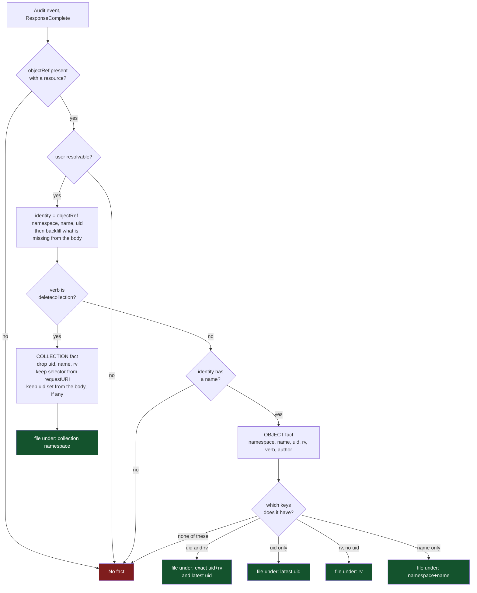
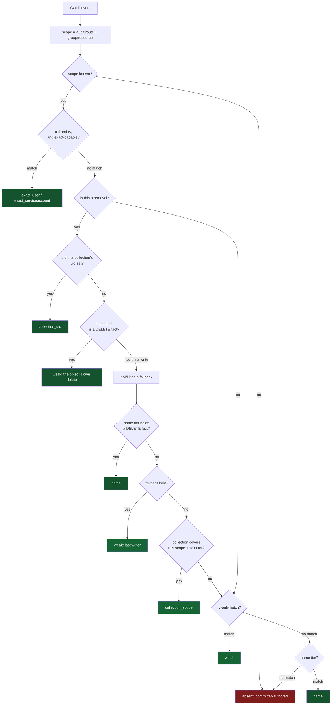

# How attribution works: the publish side and the join side

Attribution has two halves that never call each other. One turns an audit event into a FACT; the
other turns a watch event into an AUTHOR by finding a fact. They meet only in the index, through the
keys a fact was filed under.

This is the reference for what each half does, exactly. For the measurements that produced these
rules, see [`attribution-branch-findings.md`](attribution-branch-findings.md).

The one thing to carry into both diagrams: **neither half branches on the type.** Every decision is
made on the VERB of the request and on which fields the event happens to carry. Why that is a
requirement rather than a coincidence is the last section.

## Part 1: the publish side, audit event to fact

One audit event in. Zero or one fact out, filed under one to three keys.

Two gates drop an event entirely: no resource, and no resolvable name on a non-collection verb. A
collection request is exempt from the name gate because it names no object by nature, and that is
the one place the verb changes which gate applies.

The body backfill is why the name gate is survivable. `objectRef` alone often lacks the name or the
uid; `IdentityFromAuditEvent` fills what is missing from the request or response object, preferring
the request object for a delete and the response object otherwise. What the event carries in its body
therefore decides which keys the fact ends up with, and the type has nothing to do with it.

## Part 2: the join side, watch event to author

One watch event in. It asks the index for the strongest fact about this object, waiting up to the
grace for one to arrive.

### The tiers, strongest first

| Tier | Key | Result | What it asserts |
|---|---|---|---|
| exact | uid + rv | `exact_user` / `exact_serviceaccount` | this actor produced this exact version |
| collection uid | uid in a collection's set | `collection_uid` | the API server said this request deleted this object |
| latest, delete | uid | `weak` | this object's own delete fact |
| name, delete | namespace + name | `name` | this object's own delete fact, when it has no uid |
| latest, write | uid | `weak` | who last wrote it; a fallback for a removal |
| collection scope | namespace + selector + window | `collection_scope` | a collection request covering it was made |
| rv-only | rv | `weak` | a fact with an rv but no uid |
| name | namespace + name | `name` | the only key an aggregated write has |
| absent | none | `absent` | committer-authored |

### Two rules that are easy to miss

**A removal never returns on a write fact without looking further.** The per-object tiers are
last-writer-wins, so for a removal they hold whoever last EDITED the object, which is not who deleted
it. Such a match is held as a fallback while the search continues, and the caller keeps waiting for
delete evidence until the grace expires. A fact about the deletion, filed under any key, ends the
wait immediately.

**An exact-capable event may not fall through to the removal tiers.** A create or update presents the
resourceVersion its own write produced. If the exact tier misses, the `latest` pointer may name an
older, different author, so the lookup skips straight to the rv hatch and the name tier.

## No branch anywhere depends on the type

Verified across the whole path: `internal/queue`, `internal/auditutil`, and the resolver contain no
comparison against a group, a resource, a kind or an API version. The only `Resource ==` in the path
is `Resource == ""`, a presence check.

Everything dispatches on one of three things:

- **the verb**: `deletecollection` publishes a collection fact, and `delete` plus `deletecollection`
  are what `isRemovalVerb` recognizes as evidence about a deletion;
- **the operation kind**: `ExactCapable` is false for a removal, which is what unlocks the weaker
  tiers;
- **which fields are present**: uid, resourceVersion, name, request body, response body.

The type appears exactly once, in `factScope{route, groupResource}`, and there it is a PARTITION
rather than a decision: it keeps one cluster's and one type's facts from being handed to another's.
No code reads it to choose a behavior.

### This is a requirement, not an accident

A type-based rule would be wrong, and the corpus already proves it. Two ConfigMap deletes, same
cluster, same type, same verb, different shapes:

- `configmap/finalizer-delete/audit.delete.yaml`: the response object is the **ConfigMap**, so the
  uid is recoverable and the fact lands on the uid tiers.
- `configmap/owner-ref-cascade/audit.delete.cm-parent.yaml`: the response object is a **`Status`**,
  so there is no uid anywhere and the fact's only key is its name.

A rule of the form "ConfigMaps behave like this" cannot express that, because the difference is not a
property of ConfigMaps. It is a property of the individual request, decided by propagation policy and
by what the API server chose to return.

The same principle is what makes aggregated APIs work without ever being mentioned in the code. A
flunder is not special-cased anywhere; it produces events with no uid, and the shape-driven rules
route it to the name tier on their own. When the wardle API was added to the lab, no
attribution code changed to accommodate it.

So the answer to "is a type check needed?" is no, and adding one would be a regression: it would
replace a rule that reads what the event contains with a guess about what a type usually contains.
The exception that would justify one has not appeared, and the two ConfigMap rows above are the
standing argument that it would be unsound if it did.
