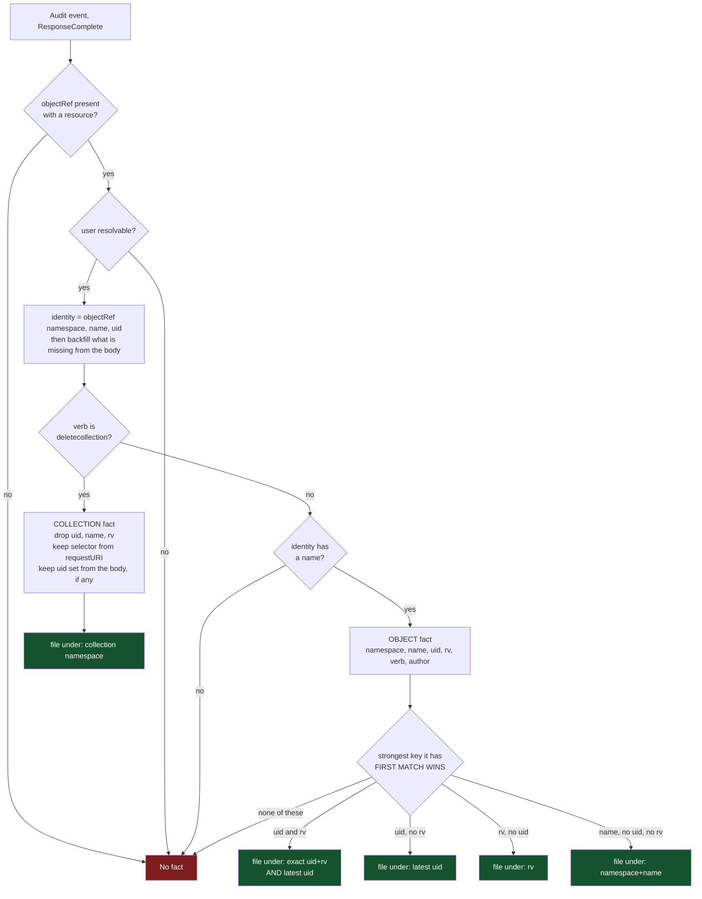
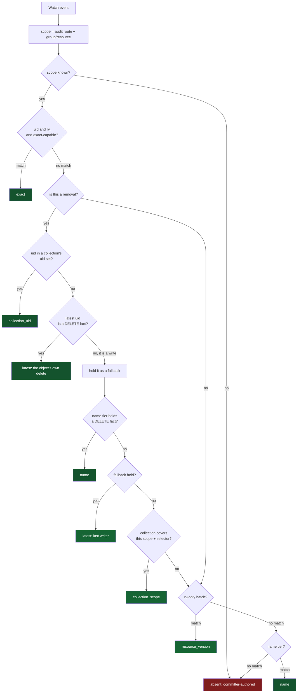
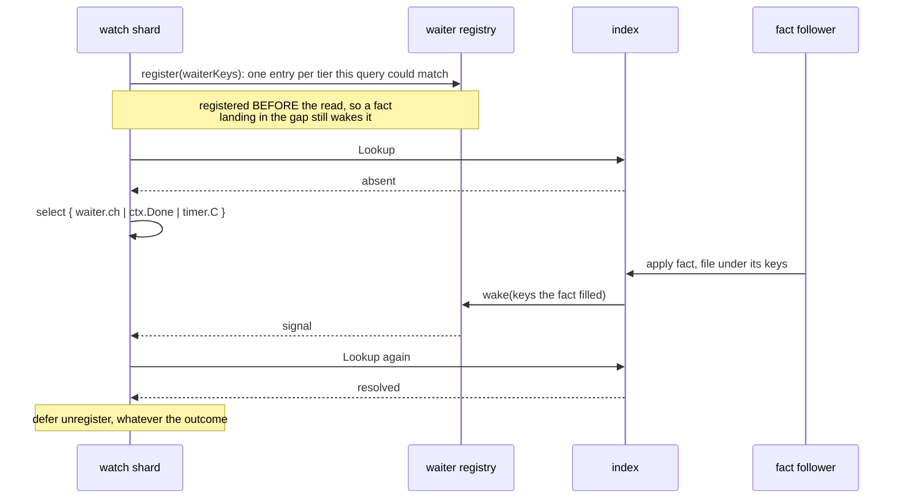

# How attribution works: the publish side and the join side

Attribution has two halves that never call each other. One turns an audit event into a FACT; the
other turns a watch event into an AUTHOR by finding a fact. They meet only in the index, through the
keys a fact was filed under.

This is the reference for what each half does, exactly. For the measurements that produced these
rules, see [`attribution-branch-findings.md`](attribution-branch-findings.md).

The one thing to carry into both diagrams: **neither half branches on the type.** Every decision is
made on the VERB of the request and on which fields the event happens to carry. Why that is a
requirement rather than a coincidence is the last section.

## Part 1: the publish side, audit event to fact

One audit event in. Zero or one fact out, filed under one to three keys.

Two gates drop an event entirely: no resource, and no resolvable name on a non-collection verb. A
collection request is exempt from the name gate because it names no object by nature, and that is
the one place the verb changes which gate applies.

A third gate is the fact's whole reason to exist: **no resolvable user, no fact**. It is the one
field the wire contract requires, and the read side enforces it too. `AuthorFact.UnmarshalJSON`
refuses an entry naming nobody, which lands on
`gitopsreverser_attribution_fact_stream_decode_errors_total` rather than being half-absorbed. So a
fact in the index always names an actor, and the metrics can read attribution coverage off the tier
alone. The event that produced no fact is not lost either: it is counted `no_attribution_fact` on
`audit_events_total`, where its type and verb are still in hand.

The body backfill is why the name gate is survivable. `objectRef` alone often lacks the name or the
uid; `IdentityFromAuditEvent` fills what is missing from the request or response object, preferring
the request object for a delete and the response object otherwise. What the event carries in its body
therefore decides which keys the fact ends up with, and the type has nothing to do with it.

### Filing picks one branch

The fact keeps every field it recovered, but it is FILED under one branch only. `file` is a switch on
the strongest key present, and the first matching case wins: a fact with a uid is not also filed
under its name or its resourceVersion, even though it has them.

The reason is memory. A watch event always knows its object's uid, so it always asks a uid tier
first, and a uid-keyed fact always answers there. A second copy of that same fact under its name
would never be the one read. Storing it anyway costs the entry on every replica following the type,
for the whole TTL, and again on every restart replay, and buys nothing.

The one branch that files twice is the uid case, and only when it also has a resourceVersion: `exact`
serves creates and updates, `latest` serves removals, and the two answer different questions about
the same object: one fact serving two tiers.

So the rule is: keep every field, file under exactly the keys a query could reach you by.

## Part 2: the join side, watch event to author

One watch event in. It asks the index for the strongest fact about this object, waiting up to the
grace for one to arrive.

### The tiers, strongest first

| Tier | Key | `tier` label | What it asserts |
|---|---|---|---|
| exact | uid + rv | `exact` | this actor produced this exact version |
| collection uid | uid in a collection's set | `collection_uid` | the API server said this request deleted this object |
| latest, delete | uid | `latest` | this object's own delete fact |
| name, delete | namespace + name | `name` | this object's own delete fact, when it has no uid |
| latest, write | uid | `latest` | who last wrote it; a fallback for a removal |
| collection scope | namespace + selector + window | `collection_scope` | a collection request covering it was made |
| rv-only | rv | `resource_version` | a fact with an rv but no uid |
| name | namespace + name | `name` | the only key an aggregated write has |
| absent | none | `absent` | committer-authored |

Who the evidence named is the separate `actor_kind` label (`user` / `serviceaccount` / `none`), so
every row above can be asked about either kind of actor.

### Two rules that are easy to miss

**A removal never returns on a write fact without looking further.** The per-object tiers are
last-writer-wins, so for a removal they hold whoever last EDITED the object, which is not who deleted
it. Such a match is held as a fallback while the search continues, and the caller keeps waiting for
delete evidence until the grace expires. A fact about the deletion, filed under any key, ends the
wait immediately.

**An exact-capable event may not fall through to the removal tiers.** A create or update presents the
resourceVersion its own write produced. If the exact tier misses, the `latest` pointer may name an
older, different author, so the lookup skips straight to the rv hatch and the name tier.

## The wait, and what changed about it

The two halves are racing, and the watch side reliably wins. The API server batches audit deliveries
(`--audit-webhook-batch-max-wait`), while the watch event is streamed, so by the time a watch event
needs an author its fact is usually still inside the batch window. The first lookup is a
near-guaranteed miss. That is the whole reason a grace window exists.

So the resolver does not ask repeatedly. It arms a signal, looks once, and then sleeps until either a
fact that could match it arrives or the grace runs out.

Registering first is what closes the race the old 150ms poll loop papered over by looking again: a
fact delivered between the register and the read wakes a waiter that is already listening. There is
no Redis call on this path. The fast case is a map read; the waiting case is a channel receive.

### The Go mechanics, because they carry the guarantees

The registry is `map[factWaiterKey]map[*factWaiter]struct{}`: candidate key to the set of resolvers
blocked on it. That shape is the fan-out. One resolver registers under SEVERAL keys, one per tier its
event could resolve through, and one applied fact wakes every resolver registered under any of the
keys that fact filled. It is a many-to-many join done through an index rather than a broadcast, so a
fact never touches a resolver it could not have answered.

Four details do real work:

- **`chan struct{}` with buffer 1.** The signal carries no payload, because the payload is the index
  itself: the woken resolver re-reads it. Buffering one means a signal sent while the resolver is
  mid-recheck is still there when it comes back around, so it is not lost.
- **Non-blocking send.** `wake` does `select { case ch <- struct{}{}: default: }`, so the goroutine
  applying facts is never slowed by a resolver that has not looked yet, and a second signal on an
  already-signaled waiter is dropped. One pending wake-up is enough, because the resolver
  re-reads everything rather than consuming a queue of events. It also makes the send safe to do
  while holding the registry lock, since it cannot block.
- **`select` on three cases.** The resolver waits on the waiter, `ctx.Done()`, and the grace timer
  together, so shutdown and the deadline are not special paths.
- **`defer unregister`.** Registration is undone on every exit, including the ones that return early.
  The registry exposes a `len()` purely so a test can assert a resolver left nothing behind.

The loop around the `select` matters too, because a wake-up is only a hint. The resolver re-runs the
whole lookup, and if what arrived was not good enough (a write fact when it needs delete evidence)
it keeps waiting rather than treating the signal as a result.

### A removal waits for evidence about the deletion

A match does not always end the wait. The per-object tiers are last-writer-wins, so the fact present
earliest for a removal is usually the object's last WRITE, which says who edited it and nothing about
who deleted it. Returning on that answered "who deleted this" with "who last edited it" whenever
anyone had touched the object first.

Such a match is now held as a fallback and the wait continues for evidence about the deletion itself.
Waiting never costs an attribution: the worst case returns exactly what returning early would have
returned, one grace later.

### What that cost, and the fix

The wait is not free, and this is the part worth knowing before tuning anything. `attachAuthor` runs
on the watch shard's own goroutine, and a shard processes its events serially, so a removal that
waits out its grace is **head-of-line blocking** for every later event of that type. The commit
window for a subsequent write cannot open until its event is processed.

That turned into a real failure. Measured on the e2e cluster, which runs a 10s grace, three removals
in one run spent 20.18s between them; a later Deployment create queued behind them, its window opened
about ten seconds late, and a CommitRequest created 105ms after the write reported `NoWindowInGrace`
about a window that had not been allowed to exist yet.

The cause was that the delete evidence was in the index and unreachable. A delete fact only has a uid
if the API server answered the request with the object; when it answers with a `Status` the fact's
only key is its name. `Lookup` returned as soon as the removal ladder yielded anything, and the uid
tier yielded the last write fact, so the name-keyed delete fact below was never consulted.

`lookupRemoval` now applies one rule: **a fact about the DELETION outranks a fact about a write,
whichever key each is filed under.** The object's own delete fact answers from the uid tier, then
from the name tier, and only then does the held write fact answer.

| | before | after |
|---|---|---|
| `weak` | 3 resolutions, 20.18s, mean 6.73s | 2 resolutions, 0.28s, mean 0.14s |
| `name` | never reached | 2 resolutions, 0.60s, mean 0.30s |
| total resolver wait | **21.24s** | **1.63s** |

Still open: the head-of-line block itself. A removal with no delete fact coming at all (a type the
audit policy excludes) still stalls its shard for a whole grace. This change removes the
largest population that was hitting it; it does not change that a blocking resolve on a serial
goroutine can do this at all. See
[`attribution-removal-wait-options.md`](attribution-removal-wait-options.md).

## What is observable

Every metric on this path, and the question each answers.

| Metric | Labels | Answers |
|---|---|---|
| `gitopsreverser_attribution_resolutions_total` | `tier`, `actor_kind`, `group`, `version`, `resource` | which evidence named the author and who it named, per type |
| `gitopsreverser_attribution_resolution_wait_seconds` | `tier`, `event_kind`, `group`, `version`, `resource` | how long the join waited, by tier and by write/removal |
| `gitopsreverser_attribution_facts_total` | `op` = `written` / `matched` | how much of what is published is ever used |
| `gitopsreverser_attribution_fact_index_entries` | none | entries held across every scope |
| `gitopsreverser_attribution_fact_index_evictions_total` | `reason` = `per_type` / `total` | whether the caps are binding |
| `gitopsreverser_attribution_collection_without_uidset_total` | `reason` = `uid_cap` / `no_uids` | how often the precise collection join was unavailable |
| `gitopsreverser_attribution_fact_stream_gaps_total` | `stream` | facts lost for good to a trim |
| `gitopsreverser_attribution_fact_stream_decode_errors_total` | `transport` | entries skipped because they could not be decoded |
| `gitopsreverser_attribution_fact_follower_errors_total` | `transport` | follower reads that failed and were retried |
| `gitopsreverser_attribution_fact_follower_last_success_timestamp_seconds` | none | whether the follower is reading at all |
| `gitopsreverser_attribution_transport_info` | `transport` | which contract the metrics above are read under |
| `gitopsreverser_commits_total` | …, `author_kind` | what reached Git |

The wait histogram is the one that earns its keep. Splitting wait time BY TIER is what turned the
window race from a mystery into a measurement: the uid-latest tier at a 6.7s mean against the exact
tier at 0.18s said immediately that removals were sitting out their grace, which no aggregate mean
would have shown. `event_kind` now makes that reading direct rather than inferred: the measurement
that found the race had to deduce "these were latest matches held as fallbacks" from the shape of a
distribution, because no label could say it.

### What is not visible, and one gap that mattered

**`written` minus `matched` is not delivery loss, and never was.** `written` counts every fact
appended for every type; `matched` counts only facts joined on streams THIS process follows, and a
restart re-files the whole retention window. Two counters over different populations do not subtract.

The population that motivated the subtraction (name-only delete facts published and silently
discarded) no longer exists: the name tier files them, so `file` returning no keys is now
unreachable behind the publish gate, and a counter on that branch would be a flat zero that reads as
health. What the loss paths needed was measuring where delivery happens: the stream
decode-error counter and the follower's last-success timestamp, both of which now ship.

**Head-of-line blocking is not measured.** The wait histogram times each resolution in isolation. It
does not measure the delay a slow resolution imposes on the events queued behind it on the same
shard, which is the thing that broke a spec. Time-in-queue per shard, or the age of an event
when it reaches the branch worker, would name it directly.

**The publish-side tier distribution is not counted.** How many facts land under a name versus a uid
is only discoverable by reading the index. Given that this ratio is the aggregated-API story, it is
worth a counter.

## The `exact_user` / `exact_serviceaccount` split was a modeling wart, now **fixed**

`result` is gone; `tier` and `actor_kind` replace it, `weak` split into `latest` and
`resource_version`, and the wait histogram gained `event_kind`. The reasoning is kept below because
it is the argument for the shape, and the migration is in
[`UPGRADING.md`](../UPGRADING.md#0410--the-attribution-metrics-are-relabelled-and-partly-renamed-breaking-for-queries).

The inconsistency was real rather than cosmetic. `result` should have named the TIER: `weak`,
`name`, `collection_uid`, `collection_scope`, `absent` all did. `exact` was the only one that also
encoded WHO the actor was, which crammed two orthogonal dimensions into one label.

Two consequences followed directly:

- counting exact resolutions meant summing two series, and any new actor kind would have multiplied
  them again;
- the actor kind could only be asked of the exact tier. There was no way to ask how many `name`-tier
  or `collection_uid` resolutions named a service account, because that dimension did not exist
  there.

The decisive argument was that the codebase already modeled it correctly one metric over:
`gitopsreverser_commits_total` carries `author_kind` as its own label, with `user`, `serviceaccount`,
`committer` and `unresolved` as values. So the two metrics disagreed about the shape of the same
distinction.

The shipped shape is that one: `tier` names the evidence, `actor_kind` matches `commits_total` and is
available on every tier. It was cheap in code, as predicted: the actor kind is derived from the
author string at read time, so nothing new is stored or plumbed. It was still a **breaking metric
change**, taken deliberately in one release with the other label work rather than as a side effect of
an attribution fix.

## Why it is split into two halves at all

The split is not an accident of layering. Three requirements each rule out the obvious alternative of
resolving an author inside the audit receiver, or handing it to the watcher over a channel.

**The audit endpoint must answer fast, and keep answering during a deploy.** The receiver decodes a
batch, appends one entry per type, and returns. It does no lookup, waits for no watcher, and holds no
per-object state. A retried POST may append the same batch twice and that is safe without any
deduplication work on the hot path, because a fact is keyed data rather than a position in a
sequence: the duplicate carries the same author under the same `(uid, rv)`, `latest` is
last-writer-wins over identical content, and a waiter woken twice resolves to the same name.

**It has to survive more than one replica.** The API server's audit webhook posts through a Service
to whichever replica answers, while a given object's watch shard lives on whichever replica owns that
`GitTarget`. Those are unrelated choices, so the fact and the watcher that needs it routinely land in
different processes. A per-type stream with independent per-reader cursors is exactly the primitive
for that: the receiving replica appends, every replica watching the type reads, and neither needs to
know about the other. An in-process channel works perfectly on one replica and has to be thrown away
on the second. The alternatives are worse in a more expensive way: sticky audit routing would make
the API server's load balancing this operator's problem.

**Rollouts are the normal state, not the exception.** A replicated deployment is almost always
mid-rollout, reconnecting, or restarting a pod, and those are precisely the cases where plain publish
and subscribe drops facts silently. A resumable stream replays the retention window instead, so a
process that restarts rebuilds its index rather than starting blind.

**And the delay is not ours to remove.** The batching parameters belong to the API server. Since the
fact is late by construction, the resolver must wait for something rather than ask repeatedly, which
is why the wait is a signal on an in-process index and not a poll against Redis. The old loop ran to
completion on essentially every attributable event, because the first lookup was a near-guaranteed
miss.

What the split does NOT solve is worth stating too: it stops attribution being an HA blocker, but the
real HA problem is ownership: which replica owns a `GitTarget`, and keeping commits to one
`(GitProvider, branch)` serialized through a single writer. That lives in
[`ha-gittarget-distribution-plan.md`](../future/ha-gittarget-distribution-plan.md).

## No branch anywhere depends on the type

Verified across the whole path: `internal/queue`, `internal/auditutil`, and the resolver contain no
comparison against a group, a resource, a kind or an API version. The only `Resource ==` in the path
is `Resource == ""`, a presence check.

Everything dispatches on one of three things:

- **the verb**: `deletecollection` publishes a collection fact, and `delete` plus `deletecollection`
  are what `isRemovalVerb` recognizes as evidence about a deletion;
- **the operation kind**: `ExactCapable` is false for a removal, which is what unlocks the weaker
  tiers;
- **which fields are present**: uid, resourceVersion, name, request body, response body.

The type appears exactly once, in `factScope{route, groupResource}`, and there it is a PARTITION
rather than a decision: it keeps one cluster's and one type's facts from being handed to another's.
No code reads it to choose a behavior.

### This is a requirement, not an accident

A type-based rule would be wrong, and the corpus already proves it. Two ConfigMap deletes, same
cluster, same type, same verb, different shapes:

- `configmap/finalizer-delete/audit.delete.yaml`: the response object is the **ConfigMap**, so the
  uid is recoverable and the fact lands on the uid tiers.
- `configmap/owner-ref-cascade/audit.delete.cm-parent.yaml`: the response object is a **`Status`**,
  so there is no uid anywhere and the fact's only key is its name.

A rule of the form "ConfigMaps behave like this" cannot express that, because the difference is not a
property of ConfigMaps. It is a property of the individual request, decided by propagation policy and
by what the API server chose to return.

The same principle is what makes aggregated APIs work without ever being mentioned in the code. A
flunder is not special-cased anywhere; it produces events with no uid, and the shape-driven rules
route it to the name tier on their own. When the wardle API was added to the lab, no
attribution code changed to accommodate it.

So the answer to "is a type check needed?" is no, and adding one would be a regression: it would
replace a rule that reads what the event contains with a guess about what a type usually contains.
The exception that would justify one has not appeared, and the two ConfigMap rows above are the
standing argument that it would be unsound if it did.
