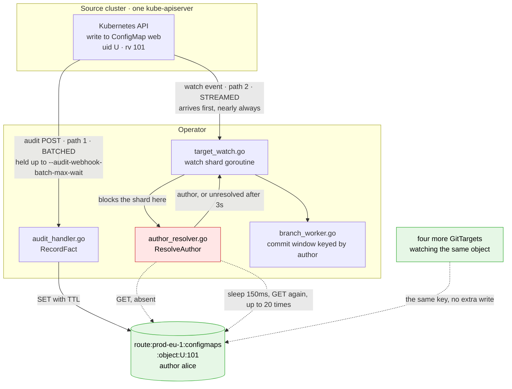

# Waiting for an audit fact without polling for it

> **design**: superseded. Index: [`../INDEX.md`](../INDEX.md)
>
> **The decision was taken in [`attribution-fact-stream.md`](../finished/attribution-fact-stream.md)**, which
> replaces the fact keyspace with a per-type Redis stream and an in-memory index. This record is
> kept as the reasoning trail: the six options, what each costs, and the measurements that ruled
> most of them out. Read it for why, then read the other one for what.
>
> Nothing here is shipped. The current behavior is the poll loop described under
> [what the wait costs today](#what-the-wait-costs-today); everything from
> [the options](#the-options) onward is intent.
>
> Prompted by a review question: the attribution lookup waits for a fact to appear in Redis, and
> the way it waits is a fixed-interval poll. This record separates the part of that design that is
> forced (the wait) from the part that is a choice (the poll), and lists what could replace the
> choice.
>
> The finding that drives the recommendation is in
> [which one fires first](#which-one-fires-first): audit delivery is batched by the apiserver, so
> the watch event arrives first by roughly the batch window and the first lookup is a
> near-guaranteed miss. Two measurements already in the repository support it.

## The decision to make

A live watch event needs a commit author before it can be routed, and the audit fact that names
that author may not have arrived yet. Waiting is unavoidable. Polling Redis every 150ms for up to
three seconds, on the watch shard's own goroutine, is one way to wait, and it is the expensive one.

The question is whether to keep it, tune it, or replace it with a notification.

## Why the shape of this architecture is worth keeping

Before criticizing the wait, it is worth being explicit about what the surrounding design gets
right, because every option below is constrained by wanting to preserve it.

**Attribution is a layer on top of the watch, not a rewrite of it.** The mirroring path is complete
without it. A watch event carries the object, the operation, and the resource identity, and it
produces a correct commit whether or not anyone ever names an author.
[`RedisStore`](../../internal/queue/redis_store.go#L45) holds the resume cursors and is a hard
dependency in every mode;
`AttributionIndex` is built on the same connection
only when the operator asks for author attribution, and it
[knows nothing about cursors](../../internal/queue/redis_store.go#L79). Turning attribution off is
expressed by leaving `Manager.AuthorResolver` nil, at which point
[`attachAuthor`](../../internal/watch/target_watch.go#L748) returns immediately and the commit is
authored by the configured committer. There is no second code path for the unattributed case, no
feature flag threaded through the writer, and no degraded mode to test separately. The enhancement
is optional in the strong sense, and the cost of not using it is zero.

**One fact serves every watcher that needs it.** A fact key is
`route:<route>:<group/resource>:object:<uid>:<rv>`
(`factKeyExact`). Notice what is absent from it:
the `GitTarget`, the `WatchRule`, the branch, the folder. The key names the *write that happened in
Kubernetes*, and it says nothing about which consumer is interested. So when five `GitTarget`s
mirror the same `Deployment` into five repositories, the API server posts one audit event,
ingestion stores one fact, and all five watch shards join that same key independently and each
stamps the same author on its own commit. Adding a sixth `GitTarget` adds no work on the write side
at all.

That property is what makes the audit route the correct partition rather than the provider name,
which is the whole argument of
[`attribution-fact-identity.md`](attribution-fact-identity.md): several `ClusterProvider`s naming
one physical cluster deliberately share one route so they share its facts. Fan-in on a shared key
is what the schema is for.

Both properties survive every option below, and the push option in
[option D](#option-d-publish-from-the-audit-receiver) actively exploits the second
one: a single notification on a shared key wakes every waiter on it, for the same reason a single
`GET` on that key serves every reader.

## Why a wait is unavoidable

The author fact and the watch event are two independent deliveries out of the same kube-apiserver.
One travels the audit webhook backend as an HTTP POST to
[`audit_handler.go`](../../internal/webhook/audit_handler.go#L312); the other travels the watch
stream into [`routeLiveTargetWatchEvent`](../../internal/watch/target_watch.go#L692). Nothing
orders them against each other, and the watch event frequently wins.

The wait also cannot be deferred until after routing, which is the obvious alternative. The branch
worker groups events into a commit window keyed by author:
[`canAppend`](../../internal/git/branch_worker.go#L730) force-finalizes the open window as soon as
the incoming author differs from the window's. An event routed with the author still unknown would
either split the window immediately or need its author patched in afterward, and patching it means
rewriting a commit that may already be pushed. Waiting briefly before shipping is what makes "a late
audit arrival must not rewrite a shipped commit" enforceable, which is exactly what the constant
says it is for
([`DefaultAttributionGraceWindow`](../../internal/watch/author_resolver.go#L21)).

So the three-second grace stays. Only the mechanism inside it is open.

Ordering between events is a separate question and it is already settled in
[`watch-event-ordering-and-attribution-grace.md`](../facts/watch-event-ordering-and-attribution-grace.md):
the wait cannot reorder the events of one object or one type, because each
`(GitTarget, GVR, scope)` watch is a single goroutine that finishes one event before reading the
next. Read that record before touching option F, which is the non-blocking variant it sketches.

## Which one fires first

The watch event, nearly always, and the margin is not small. This is structural rather than
incidental, and it is the single most important input to the options below.

The watch is a streamed push: the apiserver writes the event to an open connection as soon as the
write commits. The audit event is **batched**. `--audit-webhook-mode=batch` is what the
[attribution setup guide](../attribution-setup-guide.md) tells operators to configure, and batch
mode holds events until either `--audit-webhook-batch-max-size` events have accumulated or
`--audit-webhook-batch-max-wait` elapses. The batching parameters belong to the apiserver, not to
this operator, so the delay is not ours to remove.

The consequence for the resolver: **the first `GET` in `ResolveAuthor` is a near-guaranteed miss**.
The poll loop is not an exceptional path taken under load, it is the normal path taken by every
attributable event. That inverts the usual instinct about a retry loop, where the first attempt
usually succeeds and the retries are the rare case.

[`configuration.md`](../configuration.md) already records the operational half of this as a warning
on `--author-attribution-grace`: the apiserver's `--audit-webhook-batch-max-wait` delays every fact
by up to that much, so a grace at or below it loses actors systematically. Worth checking against
the upstream default for that flag, which is considerably larger than the one-second value the e2e
cluster uses, and larger than this operator's three-second default grace. There is no Kubernetes
checkout under `external-sources/` to source-verify it here, so treat it as a number to confirm
before it is written down as a fact.

## What has already been measured

Two measurements exist in the repository today, and they agree.

**The e2e suite reports the wait distribution on every run.**
[`reportAttributionStats`](../../test/e2e/e2e_suite_test.go) queries
`gitopsreverser_attribution_resolutions_total` by `tier` and prints the
`gitopsreverser_attribution_resolution_wait_seconds` histogram, split into resolved and absent
because the two populations answer different questions. It also prints how many resolutions
succeeded only because e2e widens the grace past the three-second default, which is a direct
measure of how much headroom the flag buys.

The finding is written into the comment above it: the e2e cluster runs
`--audit-webhook-batch-max-wait=1s` ([`start-cluster.sh`](../../test/e2e/cluster/start-cluster.sh)),
and a healthy run puts most waits in the 0.5 to 2 second range. Fact delivery is bounded below by
the batch window, exactly as the section above predicts.

**The corpus records which events have no audit event at all.** Several rows of the mutation-capture
lab corpus are documented silences rather than gaps: a status subresource update produces two watch
events and **no** audit event, and a graceful pod delete produces watch `MODIFIED` plus `DELETED`
and **no** audit event ([`test/mutationlab/README.md`](../../test/mutationlab/README.md), rows 5 and
7). Those events can never resolve no matter how long the resolver waits. They are a structural
population that burns the entire grace window and then ships unresolved, which is a stronger version
of the problem [option C](#option-c-circuit-break-a-route-that-has-never-resolved-anything)
addresses per route.

## What the mutation-capture lab can add

The lab is the right instrument for the part the Prometheus histogram cannot answer, and it needs
only a small addition.

It already has what matters. Every recorder stamps `ObservedAt: time.Now()` on its record
([`record.go`](../../internal/mutationlab/record.go), and the four recorders under
[`internal/mutationlab/recorder/`](../../internal/mutationlab/recorder/)), all in one process on one
clock, and every record carries an `ObjectKey` with the uid and resourceVersion that correlate the
watch event with the audit event for the same write. The skew this whole design is about is
therefore already captured on every lab run. It is discarded on the way to the corpus, because the
normalizer replaces timestamps with `<ts>` so the golden files stay deterministic.

So the addition is a **separate, non-golden timing report**: per scenario, the delta between the
audit record's `ObservedAt` and the watch record's `ObservedAt` for the same `(uid, rv)`. It must
not enter `corpus/`, which exists precisely to be byte-stable across runs.

What that buys over the aggregate histogram:

- **Per-scenario skew instead of one blended distribution.** A create, a server-side apply, and a
  finalizer delete may sit in different places relative to the batch window, and the Prometheus
  histogram blends them.
- **The sign of the skew, confirmed per scenario** rather than inferred. If any scenario ever shows
  the audit record arriving first, that is worth knowing, and no current measurement would show it.
- **The structural silences priced.** Rows 5 and 7 have no audit record to subtract, so they appear
  as "no fact, ever" rather than as a large delta. That distinction is exactly the one
  `AttributionAbsent` cannot make today, since an aged-out fact and a fact that never existed are
  indistinguishable by design.
- **A regression signal on a Kubernetes upgrade.** The corpus is already the behavioral changelog
  for a version bump. A timing report alongside it would show a batching or delivery change in the
  same review.

The honest limits: the lab and the product deliver differently enough that the absolute numbers do
not transfer. The lab records at handler entry rather than after ingestion, it runs on the e2e
cluster's deliberately aggressive batch profile (which
[`audit-webhook-api-server-connectivity.md`](../facts/audit-webhook-api-server-connectivity.md)
states is a test feedback optimization and not production advice), and it does not write to Redis at
all. It answers "which one fires first, and by roughly how much, per scenario". It does not predict
a production install's numbers, and the flag values below should still come from the e2e histogram
and from real installs.

## What the wait costs today

[`ResolveAuthor`](../../internal/watch/author_resolver.go#L160) loops: look up, and if the result is
`AttributionAbsent`, sleep `attributionPollInterval` (150ms) and look up again until the grace
expires.

Each iteration is not one Redis round trip.
`LookupAuthorResolution` tries up to three keys:
the immutable exact key, the `:last` pointer for removals, and the type-scoped rv-only hatch. So a
single event that never resolves costs roughly 20 wakeups and 40 to 60 `GET`s, and an event whose
fact lands mid-grace pays an average of 75ms of pure poll-interval latency on top of however long
the fact took to arrive.

The larger cost is where the loop runs.
[`attachAuthor`](../../internal/watch/target_watch.go#L729) is called inline in the shard's event
loop, before `RouteToGitTargetEventStream` and before
[`recordTargetWatchCursor`](../../internal/watch/target_watch.go#L689). The grace is not a
background wait. It head-of-line blocks that entire `(GitTarget, GVR, namespace)` shard, so a burst
of 50 unattributed events on one shard serializes into 150 seconds during which the shard reads
nothing from its watch channel.

The red box is the only thing under discussion. The green path is the fan-in property from
[the section above](#why-the-shape-of-this-architecture-is-worth-keeping), and it is not a problem
to solve.

Two distinct problems hide in the red box, and they need separating because most options address
only one:

1. **Wasted round trips and added latency** while waiting for a fact that will arrive.
2. **Head-of-line blocking** for the full three seconds when the fact will never arrive.

## The options

### Option A: measure, then leave it alone

The resolver already emits everything needed to price this problem:
[`recordAttributionResolution`](../../internal/watch/author_resolver.go#L213) records
`AttributionResolutionsTotal` broken down by `result` and `AttributionResolutionWaitSeconds` as a
histogram, and the e2e suite already reads both.

This was the natural first option before the batching floor was written down. It is much weaker now.
"The poll loop rarely runs a second iteration" was the outcome that would have justified stopping
here, and the measured 0.5 to 2 second waits rule it out: with audit delivery batched, roughly every
attributable event runs the loop to completion.

What is still worth measuring is the *split*, which decides between the options rather than against
them: how much of the population resolves late (option D territory) against how much never resolves
at all (option C and the structural silences).

### Option B: shift the first re-check to the delivery floor

The original form of this option was a decaying backoff starting fast, on the theory that a fact
that is going to arrive arrives almost immediately. The batching floor says otherwise, so a
sequence like 25ms, 50ms, 100ms spends its cheapest attempts in the window where a fact provably
cannot have arrived yet.

The corrected shape is the opposite: **wait before looking, then look often**. Skip the first
re-check until roughly the observed delivery floor, then poll on a short interval through the
window where facts actually land.

The floor is not configured in this operator and cannot be read from the apiserver, so it has to be
learned. `routeAttributionHealth` already holds per-route state and is the natural place to keep a
cheap running estimate of that route's resolved-wait percentile, which the resolver then uses as
its first-check delay. A route whose facts land at 1.2 seconds stops paying for eight useless
lookups per event.

Cost: still small, and contained inside the resolver. It is no longer the obvious first move it
looked like, because a learned first-check delay is most of the way to admitting that a
notification would be better.

### Option C: circuit-break a route that has never resolved anything

[`routeAttributionHealth`](../../internal/watch/author_resolver.go#L108) already tracks, per audit
route, whether attribution has ever resolved and how many events have gone unresolved since. Today
it is used for exactly one thing: logging a warning once, in
[`warnIfRouteNeverResolves`](../../internal/watch/author_resolver.go#L237).

The same signal can gate the wait. Once a route crosses the unresolved streak threshold having never
resolved a single event, collapse its grace to a single lookup. A route nobody posts to currently
costs three seconds of shard blocking and dozens of `GET`s per event indefinitely; this turns it
into one `GET`, while the existing warning keeps telling the operator what to fix.

The recovery rule matters: the streak counter is already cleared on any resolution
([`observe`](../../internal/watch/author_resolver.go#L119)), so a route that starts working restores
its full grace on the first fact it resolves. The breaker must therefore keep taking one real lookup
per event rather than skipping the lookup entirely, which it does.

This is the only cheap option that fixes head-of-line blocking, and it fixes it exactly in the case
where the blocking is unbounded rather than incidental.

The corpus silences argue for a second breaker beside it. A status subresource update and a graceful
pod delete produce no audit event at all, so those events pay the full grace on a route that is
otherwise healthy, which the per-route breaker will never trip on. A per-`(route, resource,
operation)` variant of the same counter would catch them. That is a larger change and it needs the
lab's per-scenario report to size it, which is one concrete reason to build the report first.

### Option D: publish from the audit receiver

Turn the wait from a poll into a push, driven by the code that receives the audit events.

1. `writeFactKeys` pipelines a `PUBLISH` of each
   written key onto a per-route channel alongside its `SET`. Pipelined, so the write side pays no
   extra round trip. See [where to publish from](#where-to-publish-from) for the better placement.
2. The resolver process holds one long-lived subscription per audit route. Routes are bounded by
   the number of `ClusterProvider`s, so this is a handful of connections for the whole process. The
   subscriber fans out into a `key -> waiters` registry.
3. `ResolveAuthor` registers its waiters **before** performing the existing lookup, then selects on
   the notification, `ctx.Done()`, and the grace deadline.
4. A coarse re-check stays as a safety net, for example one at the deadline.

Point 3 is the entire correctness argument. Registering after the lookup loses any fact published
in the gap between the two, which is precisely the window that matters. Point 4 is the other half:
Redis pub/sub is at-most-once and drops messages on reconnect or failover, so the fallback ensures a
lost notification degrades to today's behavior rather than to a hang.

The transport is available without changing anything else.
[`NewRedisStore`](../../internal/queue/redis_store.go#L56) builds a plain `redis.NewClient`, not a
cluster client, so ordinary `PUBLISH` and `SUBSCRIBE` apply with no shard-routing caveat. Writer and
reader are frequently different pods (the audit POST arrives through a Service while the watch shard
lives wherever it lives), which is why an in-process channel cannot substitute.

This option composes with the fan-in property: one publish on a shared key wakes all five waiting
`GitTarget`s at once, for the same reason one `GET` served all five before.

Cost: a subscriber lifecycle to own and reconnect, a waiter registry, and a new dependency on a
Redis feature the deployment has not used so far. Benefit: round trips per unresolved event drop
from dozens to roughly zero, and resolution latency for a late fact drops from 75ms of poll jitter
to about one round trip.

The batching floor is what promotes this option. When the loop was assumed to exit on its first or
second lookup, a subscriber lifecycle was a lot of machinery for a rare path. With delivery batched,
every attributable event runs the loop for most of a second or more, so the dozens of saved round
trips are the steady state rather than the exception. This is where the wasted work sits.

It does **not** fix head-of-line blocking. An event whose fact never arrives still holds its shard
for the full grace, and it still holds it for the delivery latency when the fact does arrive.

#### Why the batching floor also makes the push reliable

Publish and subscribe has one structural weakness: it is at-most-once, and a message only reaches
subscribers that are subscribed **at the moment it is published**. A late subscriber gets nothing.
That is normally the reason to be careful with it.

Here that weakness is mostly canceled by the ordering measured in
[which one fires first](#which-one-fires-first). The watch event arrives first, by roughly the batch
window, and the resolver blocks inline the moment it arrives. So by the time the audit POST is
received and the fact is published, **the waiter is already waiting**. The one arrival order that
would defeat the push is the one the apiserver's batching makes rare.

This is the argument that promotes the push from "a caching trick" to the natural shape of the
system. The push is aimed at exactly the window the measurements say the events land in.

The residual cases are real and are what Redis stays for: an audit event that overtakes its watch
event anyway, a watch shard that starts after the fact was published, a replica whose subscription
was reconnecting, and a `GitTarget` that begins watching a type mid-grace. Each of those is a
late-join, and a late-join is precisely what a TTL'd key in Redis serves.

#### Carry the fact, not a pointer to it

The step above publishes the *key* and has the woken resolver `GET` it. Publishing the
`AuthorFact` itself is better, and it is barely
more work.

- **The woken resolver needs no Redis read at all.** The message carries the author, display name,
  and email, which is everything [`userInfoForResolution`](../../internal/watch/author_resolver.go#L198)
  reads. In the common case the join costs zero round trips rather than one.
- **It removes an ordering constraint on the write side.** A notify-only publish must happen
  strictly *after* the `SET`, or the woken reader races back to a key that is not there yet. A
  payload-carrying publish has no read-after-write dependency, so it can be issued as early as the
  receiver likes.
- **A fact is small.** The struct is a dozen short string fields, and only accepted, mutating,
  author-bearing events produce one.

The cost is that a message is broadcast to every subscriber on the route, so every replica receives
every fact whether or not it is waiting for that object, where today each replica reads only the
keys it wants. The comparison is broadcast volume (audit event rate times replica count) against
saved lookups (watch event rate times polls per event). With polls per event in the high single
digits and replica counts small, the push still wins comfortably. It stops winning at a high replica
count, which is the number to watch if this is built.

#### Where to publish from

Two placements, and the receiver is the better one.

`writeFactKeys` knows exactly which keys it wrote,
which makes it the obvious home for a notify-only publish. But it sees one fact at a time, so a
`deletecollection` expanding into N facts
(`storeDeleteCollectionFacts`) becomes N publishes.

The receiver sees the whole batch. One audit POST carries an `EventList` of up to
`--audit-webhook-batch-max-size` events, decoded once in
[`serveEventListRequest`](../../internal/webhook/audit_handler.go#L186) and looped through
[`processEvent`](../../internal/webhook/audit_handler.go#L289). Publishing there means **one message
per POST carrying every fact from that batch**, which collapses a batch of 400 events into a single
publish instead of 400. The batching that causes the delay is the same batching that makes the
notification cheap.

The constraint on that placement is that the receiver must publish only what
`RecordFact` stored. That function drops
events with no `objectRef`, no resolvable name, or no user, and expands a `deletecollection` into
per-item facts. Publishing the raw `EventList` would notify waiters about facts that do not exist
and cannot name anyone. So `RecordFact` needs to return what it wrote, and the receiver accumulates
those across the batch and publishes once. That return value is the only real change to existing
code.

### Option E: keyspace notifications instead of an explicit publish

Redis can emit `__keyevent@<db>__:set` notifications by itself, giving option D's push without
touching the write path.

Rejected as the primary mechanism, for three reasons. It requires `notify-keyspace-events` to be
enabled server side, which a managed Redis or Valkey may not permit and which the chart does not
control. It is unfiltered: a process-wide subscription receives every `SET` on the connection,
including watch cursors and command-author records, to be discarded by prefix on the client. And it
can only ever announce a key, never a fact, so it forfeits the zero-lookup join that
[carrying the payload](#carry-the-fact-not-a-pointer-to-it) buys.

Publishing from the receiver is the same idea with none of those three costs, because the receiver
already holds the decoded events and knows which facts it stored. Keyspace notifications are worth
keeping in mind only if the write side ever needs to stay on an older version than the read side.

### Option F: move the wait off the shard's critical path

Buffer the event, let the shard continue reading its watch channel, and resolve attribution in a
separate stage.

This is not a new idea and it should not be redesigned from scratch. The final section of
[`watch-event-ordering-and-attribution-grace.md`](../facts/watch-event-ordering-and-attribution-grace.md)
already specifies it: a per-`(GVR, scope)` ordered pipeline that starts the lookup immediately and
holds an event until its grace expires **or** every earlier event on that watch has shipped, using a
sequence-numbered reassembly buffer. That record also carries the warning that makes the design
non-optional rather than a nicety: parallelizing attribution per event *without* the reassembly
buffer lets a fast-matched later event overtake a slow earlier one on the same object, which breaks
same-object ordering and can let an older mutation win.

That record deferred it explicitly, "until measurements say otherwise". The batching floor is the
measurement. The head-of-line stall is not an occasional cost paid by unattributable events, it is
paid by every attributable event, for the length of the apiserver's batch window, on a
single-threaded shard. Under the upstream default `--audit-webhook-batch-max-wait` rather than the
e2e cluster's one second, that is a serious throughput ceiling on a busy type.

The cursor is recorded after routing
([`processLiveTargetWatchEvent`](../../internal/watch/target_watch.go#L671)), so the reassembly
buffer has to preserve that too: a cursor may only advance for an event that has shipped,
otherwise a restart skips the events still held in the buffer.

Still the largest change here, and still not the first thing to build. It is now the structural fix
rather than a curiosity, so it should be repriced once the split from option A is known.

## What the push does to commit order

Nothing, and that is the point. It then improves commit fidelity as a side effect.

Ordering is not a property of the attribution mechanism. It is a property of the watch shard, which
is one goroutine per `(GitTarget, GVR, scope)` that finishes one event, wait included, before it
reads the next one from the channel, and of the single FIFO `eventQueue` the branch worker drains.
That chain is what
[`watch-event-ordering-and-attribution-grace.md`](../facts/watch-event-ordering-and-attribution-grace.md)
establishes, and none of options B through E touches any part of it. Attribution decides *what
author is stamped* on an event. It never decides *when the event is routed relative to its
siblings*. A push shortens a wait that happens inside an already-serialized loop.

The side effect is a real improvement, and it works in favor of commits that read like the sequence
of changes that happened.

An open commit window accepts one `(author, GitTarget)` pair at a time, so
[`canAppend`](../../internal/git/branch_worker.go#L730) finalizes the window whenever the incoming
author differs. Today an event whose fact arrives a moment after the grace expires ships as
attribution-unresolved while the event on either side of it resolves to a real actor. That single
timeout splits one window into three commits, and the split carries no meaning: the three events
were one person's change, and the middle commit is attributed to nobody because a batch was a few
hundred milliseconds late. Resolving from a push instead of from a race against a deadline removes
most of that class. Same order, fewer commits, and each one attributed to the actor who caused it.

**The one change that would break order** is worth stating plainly next to a design that makes it
tempting. Once waits become short, resolving several events concurrently to reclaim the shard looks
free. It is not: a fast-matched later event would overtake a slow earlier one on the same object,
and the older mutation would win in Git. That is the explicit warning in the ordering record, and it
is why [option F](#option-f-move-the-wait-off-the-shards-critical-path) is specified with a
sequence-numbered reassembly buffer rather than as plain concurrency. Push the notification, keep
the shard serial.

## Comparison

| Option | Fixes round trips | Fixes latency | Fixes shard blocking | Size |
|---|---|---|---|---|
| A: measure only | no | no | no | none |
| B: first check at the delivery floor | mostly | no | no | one function |
| C: route circuit breaker | for a dead route | for a dead route | for a dead route | small |
| D: publish from the receiver | yes, to zero | yes | no | moderate, new subsystem |
| E: keyspace notifications | to one lookup | yes | no | moderate, plus a config dependency |
| F: reassembly buffer off the hot path | no | no | yes | large |

Note what the second column now says about B. Shifting the first check to the delivery floor saves
lookups but cannot make a fact arrive sooner, so it does not improve latency. Only a notification
does, and only F removes the stall.

## Recommended sequence

1. **Build the lab timing report.** It is the smallest piece of work here, it produces the
   per-scenario number that prices everything else, and it turns a Kubernetes upgrade's timing
   change into something the corpus review would catch.
2. **Read the e2e histogram for the split**, resolved-late against never-resolved. Those two
   populations point at different options and the aggregate total does not separate them.
3. **C, on its own.** Small, uses state that already exists, and it is the only cheap fix for the
   unbounded case. Ship it regardless of what the numbers say.
4. **Then D or F, decided by the split.** A large resolved-late population makes D the answer:
   most of that wait is real delivery latency and a notification collects it at the earliest
   possible moment. A large never-resolved population, especially concentrated in the structural
   silences, makes F the answer: no notification is ever coming for those events, so the only
   remaining fix is to stop blocking the shard while waiting for them.
5. **B as a fallback**, if neither D nor F is affordable soon. It reduces the waste without
   addressing either underlying problem.

D and F are complementary rather than alternatives, and building D first is the better order. D
shrinks the wait for every event that has a fact, which shrinks the population F has to hold in its
buffer, and it leaves the shard serial while it does so. F then handles what is left, which is the
events that have no fact at all.

The revision that matters relative to the first draft of this record: the batching floor moves the
work from "tune the loop" toward "stop looping", and it makes F structural rather than optional.
Both conclusions came from measurements that already existed in the repository. The receiver-side
publish then falls out of the same finding, because the arrival order that makes the poll wasteful
is the arrival order that makes the push land on a waiter that is already there.
