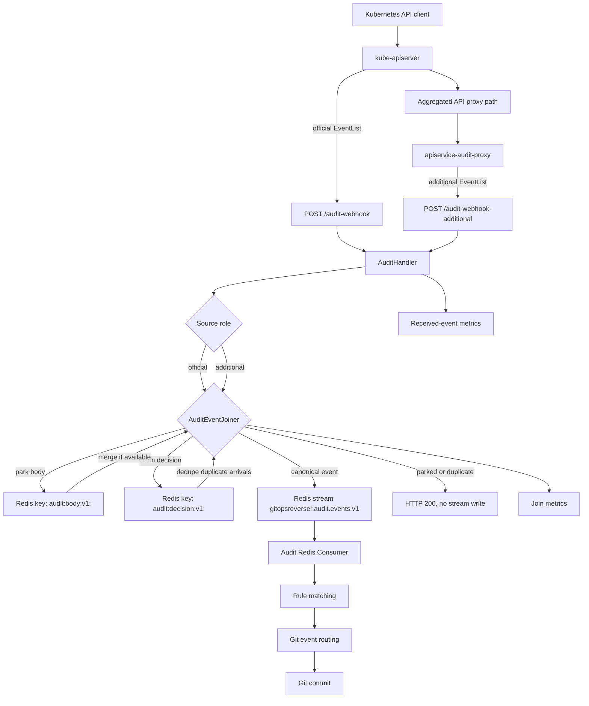

# Audit event body parking implementation

> Status: implemented design note
> Related proposal: [future audit event body parking](../future/design-audit-event-body-parking.md)

## Summary

GitOps Reverser now accepts Kubernetes audit webhook payloads from two source roles:

- `/audit-webhook` for the official kube-apiserver audit stream
- `/audit-webhook-additional` for supplementary audit sources such as `apiservice-audit-proxy`

Both endpoints receive normal `audit.k8s.io/v1 EventList` payloads. The difference is how the
handler treats them before writing to the canonical Redis stream.

The implemented joiner parks body-rich supplementary events by `auditID`, merges them with the
matching official event when possible, and emits at most one canonical stream entry per `auditID`
within the decision-key TTL window. This recovers request/response bodies for aggregated API
requests without making the proxy speak a custom enrichment protocol.

## Ingestion Pipeline



## Source Contract

The URL contract is intentionally simple:

| Source | Endpoint | Role |
| --- | --- | --- |
| kube-apiserver audit webhook | `/audit-webhook` | Canonical audit source for identity, status, timestamps, and ordering |
| supplementary body source | `/audit-webhook-additional` | Optional body contribution source for the same `auditID` |

Cluster ID path segments were removed. Requests to `/audit-webhook/<anything>` and
`/audit-webhook-additional/<anything>` are rejected instead of being treated as cluster-specific
streams.

The Redis stream schema no longer includes `cluster_id`, and audit metrics now use a `source`
label instead.

## Join Behavior

The joiner uses two Redis/Valkey key families:

| Key | Purpose | Default TTL |
| --- | --- | --- |
| `audit:body:v1:<auditID>` | Temporary parked body or shallow official event | `5m` |
| `audit:decision:v1:<auditID>` | Small decision/dedupe marker | `1h` |

The decision key is claimed before enqueueing the canonical event. If enqueue succeeds, the decision
is committed as emitted. If enqueue fails, the handler releases the claim so another arrival can
try again.

### `wait-official`

This is the default mode. It optimizes for the official kube-apiserver stream being the canonical
trigger.

Typical additional-first flow:

1. Additional event arrives on `/audit-webhook-additional`.
2. If its API group is allowlisted and it has a request or response body, the body is parked under
   `audit:body:v1:<auditID>`.
3. No canonical stream event is emitted yet.
4. Official event arrives on `/audit-webhook`.
5. The joiner claims `audit:decision:v1:<auditID>`.
6. If a parked body exists, the official event is merged with that body and emitted.
7. The handler commits the decision after the stream write succeeds.

The implementation also handles the official-first race for aggregated API events. If an official
event for an allowlisted API group is shallow and lacks a usable object name, the joiner parks that
official event briefly instead of emitting a malformed canonical event. When the additional event
arrives, the joiner merges the additional body into the parked official event and emits once.

### `first`

This mode optimizes for lower latency. The first usable event for an `auditID` claims the decision
key and is emitted. Later siblings with the same `auditID` are dropped while the decision key lives.

### Additional-only

When `--audit-additional-only=true` is set, `/audit-webhook-additional` is treated as canonical.
This is useful when kube-apiserver is not configured to send official audit events to
GitOps Reverser.

## Merge Rules

The merged event keeps the official audit event as the authority for audit identity and timing.
The parked contribution can fill in:

- `requestObject`
- `responseObject`
- selected `objectRef` fields such as `name`, `namespace`, `uid`, and `resourceVersion`
- proxy truncation annotations

Delete and deletecollection events do not merge parked request/response bodies. The proxy-side body
for deletes can be `DeleteOptions`, not the deleted object, so the consumer would otherwise try to
commit or unmarshal the wrong shape. Object reference fields can still be filled in.

## Settings

### Manager flags

| Flag | Default | Meaning |
| --- | --- | --- |
| `--audit-event-join-mode` | `wait-official` | Join mode. Supported values are `wait-official` and `first`. |
| `--audit-event-body-ttl` | `5m` | TTL for `audit:body:v1:<auditID>` entries. |
| `--audit-event-decision-ttl` | `1h` | TTL for `audit:decision:v1:<auditID>` entries. This bounds duplicate suppression. |
| `--audit-event-body-parking-api-groups` | empty | Comma-separated API groups eligible for body parking, for example `wardle.example.com`. |
| `--audit-additional-only` | `false` | Treat `/audit-webhook-additional` as canonical because no official stream is expected. |

### Helm values

| Value | Default | Meaning |
| --- | --- | --- |
| `auditEventJoin.mode` | `wait-official` | Renders `--audit-event-join-mode`. |
| `auditEventJoin.bodyTTL` | `5m` | Renders `--audit-event-body-ttl`. |
| `auditEventJoin.decisionTTL` | `1h` | Renders `--audit-event-decision-ttl`. |
| `auditEventJoin.bodyParkingAPIGroups` | `[]` | Renders `--audit-event-body-parking-api-groups` when non-empty. |
| `auditEventJoin.additionalOnly` | `false` | Renders `--audit-additional-only` when true. |

Example:

```yaml
auditEventJoin:
  mode: wait-official
  bodyTTL: 5m
  decisionTTL: 1h
  bodyParkingAPIGroups:
    - wardle.example.com
  additionalOnly: false
```

## Metrics

The implementation adds join-specific metrics alongside the existing audit receive metric:

| Metric | Meaning |
| --- | --- |
| `gitopsreverser_audit_join_parked_total` | Count of events parked for later joining. |
| `gitopsreverser_audit_join_emitted_total` | Count of emitted canonical events after join decisions. Labels include source, mode, and result. |
| `gitopsreverser_audit_join_duplicate_dropped_total` | Count of duplicate sibling events dropped by decision-key dedupe. |
| `gitopsreverser_audit_join_body_miss_total` | Count of allowlisted official events that emitted without a parked body. |
| `gitopsreverser_audit_join_body_unexpected_total` | Count of additional events for API groups not in the parking allowlist. |

The existing `gitopsreverser_audit_events_received_total` metric now labels events by `source`
instead of `cluster_id`.

## Operational Notes

- Add every proxied aggregated API group to `auditEventJoin.bodyParkingAPIGroups`.
- A non-zero `gitopsreverser_audit_join_body_unexpected_total` usually means the proxy is sending
  body-rich events for a group the joiner is configured to ignore.
- A rising `gitopsreverser_audit_join_body_miss_total` means official events are arriving without a
  matching body contribution. That may be normal for official-only mode, but it is a useful signal
  in official-plus-additional deployments.
- The duplicate suppression guarantee is TTL-bounded by `auditEventJoin.decisionTTL`.
- Redis/Valkey is part of the ingestion path. In `wait-official` mode, Redis failures while joining
  should fail the request so kube-apiserver can retry official audit delivery.

## Remaining Improvements

These are the main follow-ups visible when comparing the implementation to the original future
design:

1. Add an orphan-body metric.
   The proposal included `gitopsreverser_audit_join_body_orphan_total` for parked bodies that expire
   without an official twin. The current implementation relies on TTL cleanup but does not count
   those expirations. A Redis keyspace-notification listener or periodic sweeper could provide this.

2. Harden the decision transition with Redis Lua.
   The current two-phase flow uses `SET NX`, commit, and release. That is simple and understandable,
   but a Lua transition could make claim-to-emit state changes more explicit under fault injection.

3. Add source-priority merge semantics.
   Today the body key is effectively last writer wins. That is fine while
   `apiservice-audit-proxy` is the only additional writer, but future in-process writers such as a
   CommitContext path may need deterministic priority.

4. Add group/resource-level allowlisting.
   The implemented allowlist is API-group based. If one aggregated API group later contains both
   proxied and unproxied resources, resource granularity would reduce noisy unexpected/miss metrics.

5. Reintroduce multi-cluster identity as a real model.
   The removed `{clusterID}` path segment was not enough. Future multi-cluster support should define
   source registration, metrics cardinality, rule matching, and file path semantics together.

6. Add deeper failure-injection coverage.
   The unit and e2e tests cover normal ordering, official-first ordering, duplicate suppression,
   additional-only behavior, and delete body handling. More fault tests around Redis unavailability,
   process death after claim, and body TTL expiry would make the operational story sharper.

7. Document standard alert rules.
   The metrics exist, but the chart does not yet ship opinionated alerting for allowlist drift,
   body misses in official-plus-additional mode, or unexpected duplicate drops.
