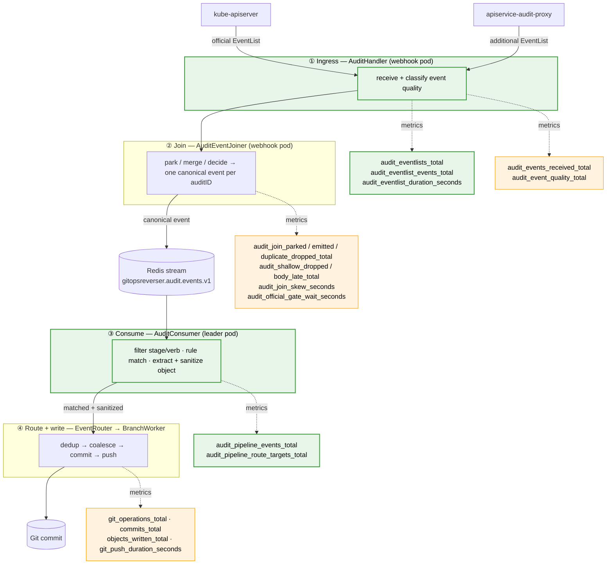

# Implementation Plan: Audit Ingestion Metrics Overhaul

> Status: proposed — not yet implemented
> Scope: audit ingestion pipeline observability, plus API resource catalog
> (watch path) observability — see the dedicated section near the end

## Goal

Make the **audit ingestion pipeline** observable enough to operate without
turning every internal branch into a metric. Today the webhook has event-level
metrics after decoding, but it has no request-level view of the inbound
`EventList` boundary. The consumer — the component that turns a Redis stream
entry into a Git write — emits no metrics at all. An operator cannot answer the
basic question "am I seeing a lot of pod create events flow through?"

While we are in here, delete dead and misleading metrics and fix label
cardinality. The project is not yet used publicly, so metric names and labels
are free to change without a compatibility shim.

## Operator questions

This first cut should answer these questions without growing into a dashboard
for every controller:

| Question | First-cut signal |
| --- | --- |
| Do official and additional audit payloads reach the webhook? | Request-level `audit_eventlists_total`, `audit_eventlist_events_total`, and `audit_eventlist_duration_seconds`, split only by source and bounded outcome. |
| Which canonical resource events reach the consumer often but do not become Git work? | `audit_pipeline_events_total` by GVR labels, `verb`, and non-`routed` outcome (`unmatched`, `dropped_no_body`, `route_failed`). |
| Did an event disappear inside this pipeline? | Compare the EventList ingress, join emissions/drops, and consumer outcomes at their stage boundaries. A receiver metric cannot prove that kube-apiserver never emitted or delivered an event before it reached this webhook. |
| Are my configured rules valid, and are they producing work? | `Ready` status on `WatchRule`, `ClusterWatchRule`, and `GitTarget` remains the configuration-health contract. Add a small GitTarget-grouped route metric for runtime traffic. |

The boundary matters. Metrics should show whether events arrive, join, match,
and route. They should not replace CR status conditions for invalid references,
Git provider readiness, or GitTarget lifecycle failures.

## Pipeline and metric map

The audit ingestion pipeline has four stages. Metrics are emitted at the edge
of each stage; this diagram maps every audit-pipeline metric to where it is
recorded. It also makes the gaps visible — the raw EventList boundary and stage
③ have no metrics today.



The green metrics are **new** (changes 1-3). Stage ① needs the raw EventList
boundary; stage ③ needs consumer outcomes and a small GitTarget traffic signal.

Note on the deleted metrics: `events_received_total` and
`events_processed_total` are **not** on this diagram on purpose. Their names
suggest they belong to this pipeline, but neither is recorded on any audit
stage — that mismatch is exactly why changes 7 and 8 remove them.

## Current state

Metrics are declared and registered in
[internal/telemetry/exporter.go](../../internal/telemetry/exporter.go).

| Metric | Where recorded | Verdict |
| --- | --- | --- |
| EventList requests / decoded event items / request duration | — | **Missing — add** |
| `audit_events_received_total` | [audit_handler.go:367](../../internal/webhook/audit_handler.go#L367) | Keep, fix labels |
| `audit_event_quality_total` | [audit_joiner.go:730](../../internal/webhook/audit_joiner.go#L730) | Keep, fix labels |
| `audit_join_*` (parked/emitted/duplicate/shallow/body_late) | [audit_joiner.go](../../internal/webhook/audit_joiner.go) | Keep |
| `audit_join_skew_seconds`, `audit_official_gate_wait_seconds` | [audit_joiner.go](../../internal/webhook/audit_joiner.go) | Keep |
| `events_received_total` | nowhere (only tests) | **Delete — dead** |
| `events_processed_total` | informers.go:109 | **Delete — misleading** |
| consumer pipeline output | — | **Missing — add** |

`events_processed_total` is misleading on two counts: the name implies the
ingestion pipeline but it is only touched by the watch/informer path, and that
path increments it even when `AuditLiveEventsEnabled` skips routing entirely
(informers.go:108-122) — so it
counts events that were never processed.

## Changes

### 1. Add the EventList ingress boundary

Add request-level metrics around
[`AuditHandler.ServeHTTP`](../../internal/webhook/audit_handler.go#L146) for
recognized official/additional audit endpoints:

```
gitopsreverser_audit_eventlists_total{source, outcome}
gitopsreverser_audit_eventlist_events_total{source, outcome}
gitopsreverser_audit_eventlist_duration_seconds{source, outcome}
```

`source` stays `official` or `additional`. Keep `outcome` bounded:

| `outcome` | Meaning |
| --- | --- |
| `processed` | A non-empty decoded EventList finished successfully |
| `empty` | A decoded EventList contained zero events |
| `decode_error` | The request body could not become an `audit.k8s.io/v1 EventList` |
| `process_error` | Event processing failed after decode |

`audit_eventlists_total` and the duration histogram count request attempts at
the webhook boundary. `audit_eventlist_events_total` increments by
`len(eventList.Items)` only after decode, so `decode_error` has no event-item
sample. It answers "how many audit event items really arrived in EventLists?"
without abusing per-event GVR labels on a mixed batch.

Do **not** add arbitrary paths, remote addresses, status-code labels, or GVR
labels here. If rejected methods or invalid paths need HTTP observability later,
instrument the audit server/mux boundary separately with another bounded HTTP
contract; this change is for EventLists delivered to the two audit sources.

Example queries:

```promql
# Are both audit sources delivering EventLists?
sum by (source, outcome) (
  rate(gitopsreverser_audit_eventlists_total[5m]))

# How many audit event items arrive per second from each source?
sum by (source) (
  rate(gitopsreverser_audit_eventlist_events_total[5m]))

# How long does the webhook take to answer, including join wait work?
histogram_quantile(0.95,
  sum by (source, le) (
    rate(gitopsreverser_audit_eventlist_duration_seconds_bucket[5m])))
```

### 2. Add the consumer pipeline-output metric

New counter declared in [exporter.go](../../internal/telemetry/exporter.go):

```
gitopsreverser_audit_pipeline_events_total{group, version, resource, verb, outcome}
```

Recorded once per audit event in
[`routeAuditEvent`](../../internal/queue/redis_audit_consumer.go#L358) in
[internal/queue/redis_audit_consumer.go](../../internal/queue/redis_audit_consumer.go),
which currently has **no `telemetry.` calls**. `outcome` values:

| `outcome` | Recorded at | Meaning |
| --- | --- | --- |
| `unmatched` | the `len(wrRules)==0 && len(cwrRules)==0` early return ([line 382](../../internal/queue/redis_audit_consumer.go#L382)) | No rule matched the event |
| `dropped_no_body` | the `errAuditEventObjectMissing` branch ([line 393](../../internal/queue/redis_audit_consumer.go#L393)) | Event matched a rule but had no usable body |
| `routed` | after `routeToMatchedRules` when `routed > 0` ([line 430](../../internal/queue/redis_audit_consumer.go#L430)) | Routed to at least one BranchWorker |
| `route_failed` | after `routeToMatchedRules` when rules matched but `routed == 0` | Every matched target route failed |

Pre-`objectRef` filtering in
[`processMessage`](../../internal/queue/redis_audit_consumer.go#L311) (wrong
stage, non-mutating verb, nil `objectRef`) is intentionally **not** counted
here — those events have no reliable GVR and are already accounted for by the
ingress `audit_events_received_total`.

The `group`/`version`/`resource` labels come from
`auditutil.ObjectRefGroupVersion(ref)` and `ref.Resource`, which
`routeAuditEvent` already extracts. `verb` is `auditEvent.Verb`.

This single metric answers the target question:

```promql
# "Am I seeing a lot of pod create events?"
sum by (resource) (
  increase(gitopsreverser_audit_pipeline_events_total{verb="create",outcome="routed"}[1h]))

# pipeline output grouped by GV only (lower cardinality view)
sum by (group, version) (
  rate(gitopsreverser_audit_pipeline_events_total{outcome="routed"}[5m]))

# Which frequent canonical events reach the consumer but do not become Git work?
topk(10,
  sum by (group, version, resource, verb, outcome) (
    rate(gitopsreverser_audit_pipeline_events_total{outcome!="routed"}[5m])))
```

### 3. Add a GitTarget-grouped route signal

Add a target-level counter in
[`routeToMatchedRules`](../../internal/queue/redis_audit_consumer.go#L450):

```
gitopsreverser_audit_pipeline_route_targets_total{
  git_target_namespace, git_target, rule_kind, outcome
}
```

Record one sample per matched target route attempt. `rule_kind` has only
`watchrule` or `clusterwatchrule`; `outcome` has `routed` or `route_failed`.
This lets an operator ask whether runtime audit traffic is actually reaching a
GitTarget and whether routing into that target is failing:

```promql
sum by (git_target_namespace, git_target, outcome) (
  rate(gitopsreverser_audit_pipeline_route_targets_total[5m]))
```

Do not add per-rule names in this first cut. The CRs already expose config
validity through status conditions, and a rule-name metric multiplies runtime
series by rule count. If target-grouped traffic plus consumer `unmatched`
outcomes still leave operators blind, revisit either a per-rule hit counter or
a status field such as "last matched at" in a follow-up design.

### 4. Split the opaque `gvr` label into `group` / `version` / `resource`

Four metrics carry a single opaque `gvr` string label (e.g.
`"apps/v1/deployments"`), built by
[`extractGVR`](../../internal/webhook/audit_handler.go#L505) and
[`auditEventGVR`](../../internal/webhook/audit_joiner.go#L709): a single opaque
string cannot be aggregated to GV in PromQL without `label_replace`.

Replace the `gvr` label with three labels `group`, `version`, `resource` on
**all** metrics that carry it — `audit_events_received_total`,
`audit_event_quality_total`, `audit_shallow_dropped_total`
([audit_joiner.go:771](../../internal/webhook/audit_joiner.go#L771)), and
`audit_join_body_late_total`
([audit_joiner.go:780](../../internal/webhook/audit_joiner.go#L780)).
Cardinality is unchanged; the new metric in change 2 uses the
same three-label shape so the whole pipeline reads consistently. The
`extractGVR` / `auditEventGVR` string helpers can stay for **log** fields, or
be reduced to a small shared splitter — implementer's choice.

Also rename the event-action label from `action` to `verb` on those audit
metrics. That value already comes from the Kubernetes audit `Verb` field, and
the new consumer metric uses the same name. There is no public metric
compatibility burden yet, so do the vocabulary cleanup now.

### 5. Drop the `user` label from `audit_events_received_total`

The `user` label ([audit_handler.go:371](../../internal/webhook/audit_handler.go#L371))
is a cardinality bomb: every distinct user/ServiceAccount becomes a series,
multiplied by resource identity × verb × source. The username is already in the
structured logs (`recordReceivedMetric` logs it). Remove the label; keep the
log.

### 6. Delete the `cluster` label

`gitops-reverser` once accepted events from more than one cluster and carried a
`cluster` (cluster-ID) label as a metric dimension. Multi-cluster was removed
(see [architecture.md → Known gaps](../architecture.md), "the removed
`{clusterID}` path segment was a half-measure"). The label is a leftover and
must be deleted wherever it still appears.

> Verification note: a grep of `internal/` and `cmd/` for a `cluster` metric
> attribute came back empty — the label may already be gone from the Go code.
> The implementer must still confirm and, if present, remove it from: metric
> `attribute.String("cluster", …)` calls, any Helm `ServiceMonitor` /
> relabeling config under `charts/`, and any bundled Grafana dashboard JSON.
> If nothing is found anywhere, record that explicitly so the task is closed
> rather than silently skipped.

### 7. Delete `events_received_total`

Remove the `EventsReceivedTotal` instrument and its `counters` registration
entry from [exporter.go](../../internal/telemetry/exporter.go). It is never
incremented in production code — only `exporter_test.go` references it. Delete
those test references too.

### 8. Delete misleading watcher-path queue metrics

Remove the `EventsProcessedTotal` instrument and its registration. Delete its
use in informers.go:108-111.
`ObjectsScannedTotal` on the adjacent line already covers "objects seen by the
informer path"; the audit pipeline is now covered by change 2.

Delete `GitCommitQueueSize` too. Its current production increment is the same
watcher-path line in informers.go:110:
it increments before the `AuditLiveEventsEnabled` skip, and it is not paired
with a real queue-boundary decrement. A queue-depth gauge is useful only when
owned by the queue it describes; reintroduce one at that boundary in separate
Git write-path work if the remaining worker metrics do not cover it.

### 9. Drop the `parked_kind` label from `audit_join_parked_total`

`parked_kind` has exactly one possible value (`additional_body`) — see
[audit_joiner.go:748](../../internal/webhook/audit_joiner.go#L748) and the note
in [architecture.md](../architecture.md). A label with one value is noise.
Remove it.

## API resource catalog observability (watch path)

> Scope note: this is the **watch/informer path**, not the audit ingestion
> pipeline of changes 1-9. It is bundled into this doc because it is the same
> `telemetry` exporter work and the same "a metric without an interpretation
> is noise" bar. The two halves are otherwise independent.

The `APIResourceCatalog`
([internal/watch/api_resource_catalog.go](../../internal/watch/api_resource_catalog.go))
is GitOps Reverser's single trusted in-memory view of the cluster's served API
surface. It is refreshed from Kubernetes discovery by
[`Manager.RefreshAPIResourceCatalog`](../../internal/watch/manager_catalog.go#L68),
which runs:

- once per `ReconcileForRuleChange` — i.e. on the **30 s periodic ticker**, on
  every CRD/APIService trigger-informer event, and on every rule change;
- again inside `getClusterState`, once per GitTarget being snapshotted.

Today it emits **no metrics**. An operator cannot see how large the catalog
is, how many resources the default watch policy excludes, whether discovery is
degraded, or how often the 30 s sweep actually changes anything.

### Is the 30 s refresh heavy?

No — but it is worth being able to prove that. One refresh is:

1. One `ServerGroupsAndResources()` discovery call. On Kubernetes ≥ 1.27 with
   aggregated discovery this is **two cached GETs** (`/api`, `/apis`) that the
   apiserver serves from memory. Without aggregated discovery it falls back to
   one GET per group/version — 100+ requests on a CRD-heavy cluster.
2. An in-memory diff (`catalogEntriesEqual`) and, only when something changed,
   an index rebuild — both O(total resources), microseconds.

So the cost is dominated by discovery **latency**, not CPU, and the apiserver
side is cheap. The two things actually worth watching are therefore (a) the
refresh **duration** — to catch a slow or non-aggregated apiserver — and (b)
the **changed/unchanged ratio**. A catalog that reports `changed` on every
sweep means something is flapping (e.g. an aggregated APIService going in and
out of `Available`), and *that* is the real cost — each change re-runs informer
reconciliation. A steady stream of `unchanged` is the healthy baseline and
confirms the 30 s cadence is doing nothing expensive.

One inefficiency the metrics will expose: `getClusterState` calls
`RefreshAPIResourceCatalog` again per GitTarget, so one reconcile pass can
issue several discovery sweeps. The refresh counter against the generation
gauge makes that redundancy visible; collapsing it to one refresh per pass is
a cheap follow-up, not part of this change.

### Proposed metrics

All labels are bounded and tiny — no per-GVR cardinality here.

```
gitopsreverser_api_catalog_resources{state}            gauge
gitopsreverser_api_catalog_group_versions{state}       gauge
gitopsreverser_api_catalog_refresh_total{outcome}      counter
gitopsreverser_api_catalog_refresh_duration_seconds    histogram
gitopsreverser_api_catalog_generation                  gauge
```

| Metric | Labels | Meaning |
| --- | --- | --- |
| `api_catalog_resources` | `state` = `allowed` \| `excluded` | Count of served top-level resources in the catalog, split by `APIResourceEntry.Allowed`. `excluded` is the default-watch-policy set (pods, events, leases, jobs, …) from [resource_policy.go](../../internal/watch/resource_policy.go). Subresources are not counted. |
| `api_catalog_group_versions` | `state` = `trusted` \| `degraded` | Group/versions discovery served cleanly vs. ones it reported as failed (`catalogGroupVersionState.degraded`). A non-zero `degraded` is the signal that a broken aggregated APIService is hiding part of the surface. |
| `api_catalog_refresh_total` | `outcome` = `changed` \| `unchanged` \| `error` | One sample per `RefreshAPIResourceCatalog` call. `changed`/`unchanged` is `Refresh`'s returned bool; `error` covers discovery failure. |
| `api_catalog_refresh_duration_seconds` | — | Wall time of one refresh, including the discovery call. |
| `api_catalog_generation` | — | Current `APIResourceCatalog.Generation()`. `changes(...[1h])` shows churn at a glance. |

Recording points:

- `refresh_total` and `refresh_duration_seconds`: wrap `catalog.Refresh(disco)`
  in [`RefreshAPIResourceCatalog`](../../internal/watch/manager_catalog.go#L74)
  — it already has the `changed` bool and the error in scope.
- `resources`, `group_versions`, `generation`: set after a successful refresh
  from a new small `APIResourceCatalog.Stats()` accessor (counts computed under
  the existing `RLock`). Gauges are idempotent, so resetting them on every
  refresh is correct.

Example queries:

```promql
# Is the 30 s sweep doing real work, or just confirming a stable surface?
sum by (outcome) (rate(gitopsreverser_api_catalog_refresh_total[15m]))

# How many resources is GitOps Reverser actually willing to watch?
gitopsreverser_api_catalog_resources{state="allowed"}

# Is part of the API surface hidden behind a broken APIService?
gitopsreverser_api_catalog_group_versions{state="degraded"} > 0

# Discovery latency — catches a non-aggregated or slow apiserver
histogram_quantile(0.95,
  rate(gitopsreverser_api_catalog_refresh_duration_seconds_bucket[5m]))
```

Out of scope for this addition: per-GVR catalog series (a cardinality bomb —
the `Allowed`/`PolicyReason` detail belongs in logs and CR status, not
metrics), and a discovery-call counter separate from the refresh counter.

## Out of scope (noted, not done here)

- **Redis stream depth / consumer-lag metric** (`XLEN` / `XPENDING`). This is
  the natural "is the pipeline keeping up?" signal and is currently missing.
  It is a worthwhile follow-up but is a separate change with its own polling
  concerns — not bundled into this overhaul.
- **Sender-side proof for events that never reach this receiver.** EventList
  ingress tells us what entered the webhook. It cannot prove whether
  kube-apiserver or a supplementary sender dropped an event before delivery.
- **Configuration-object health metrics.** `WatchRule`, `ClusterWatchRule`,
  `GitTarget`, and `GitProvider` already publish status conditions for config
  health. Keep that contract first; add metrics only for runtime flow here.
- **Per-rule hit metrics.** GitTarget-grouped route attempts and consumer
  `unmatched` outcomes are the initial operator surface. Add rule-name series
  only if real operation shows this is not enough.

## Documentation updates

- [docs/interpreting-metrics.md](../interpreting-metrics.md): add rows and
  example queries for EventList ingress, `audit_pipeline_events_total`, and the
  GitTarget route metric (the doc's own bar — "a metric without an
  interpretation is noise"). Remove rows for deleted metrics. Update label
  names where `gvr` became three labels and `action` became `verb`.
  **Also embed the stage/metric mermaid diagram from this plan** at the top of
  the "Audit join pipeline" section — it gives picture-thinkers a map of where
  each metric lives before they read the per-metric rows.
- [docs/architecture.md](../architecture.md): update the **Metrics** table in
  the Audit Ingestion Pipeline section (lines ~732-741) to the new label set
  and the new metrics.
- [docs/interpreting-metrics.md](../interpreting-metrics.md): add a short
  "API resource catalog" subsection for the five `api_catalog_*` metrics with
  the changed/unchanged-ratio and `degraded` interpretations from above.

## Validation

Per [AGENTS.md](../../AGENTS.md), because this change touches Go code the full
sequence is mandatory:

`task fmt` → `task generate` → `task manifests` → `task vet` → `task lint` →
`task test` → `task test-e2e` (e2e needs Docker; run e2e commands
sequentially).

Specific checks:

- `exporter_test.go` updated for the removed/added instruments.
- Handler tests asserting EventList request count, decoded event-item count,
  and duration outcomes cover official, additional, empty, decode-error, and
  processing-error requests.
- A consumer test asserting `audit_pipeline_events_total` is incremented with
  the expected `outcome` for: a matched+routed event, an unmatched event, a
  body-missing event, and a matched event whose target routes all fail.
- A route test asserting `audit_pipeline_route_targets_total` is grouped by
  GitTarget and records routed/failed target attempts.
- Scrape `/metrics` in an e2e run and confirm official and additional EventList
  ingress series appear, and no `cluster`, `gvr`, or `action` label remains on
  any audit series.
- A catalog test asserting `api_catalog_refresh_total` records `changed` on a
  first refresh and `unchanged` on an immediate second refresh of identical
  discovery data, and that `api_catalog_resources{state="excluded"}` reflects
  the default-watch-policy set.

## Resulting audit-pipeline metric inventory

| Metric | Labels | Stage |
| --- | --- | --- |
| `audit_eventlists_total` | `source`, `outcome` | ingress request boundary **(new)** |
| `audit_eventlist_events_total` | `source`, `outcome` | ingress request boundary **(new)** |
| `audit_eventlist_duration_seconds` | `source`, `outcome` | ingress request boundary **(new)** |
| `audit_events_received_total` | `source`, `group`, `version`, `resource`, `verb` | ingress |
| `audit_event_quality_total` | `source`, `quality`, `group`, `version`, `resource`, `verb` | ingress |
| `audit_join_parked_total` | — | ingress (join) |
| `audit_join_emitted_total` | `source`, `result` | ingress (join) |
| `audit_join_duplicate_dropped_total` | `reason` | ingress (join) |
| `audit_shallow_dropped_total` | `group`, `version`, `resource`, `verb` | ingress (join) |
| `audit_join_body_late_total` | `group`, `version`, `resource`, `verb` | ingress (join) |
| `audit_join_skew_seconds` | `arrival`, `outcome` | ingress (join) |
| `audit_official_gate_wait_seconds` | — | ingress (join) |
| `audit_pipeline_events_total` | `group`, `version`, `resource`, `verb`, `outcome` | **consumer (new)** |
| `audit_pipeline_route_targets_total` | `git_target_namespace`, `git_target`, `rule_kind`, `outcome` | **consumer route (new)** |

Net: **+5 metrics**, **−3 metrics** (`events_received_total`,
`events_processed_total`, `git_commit_queue_size`), **−2 labels** (`user`,
`cluster`), **−1 label** (`parked_kind`), and event labels read consistently as
`group`/`version`/`resource`/`verb` across the pipeline.
