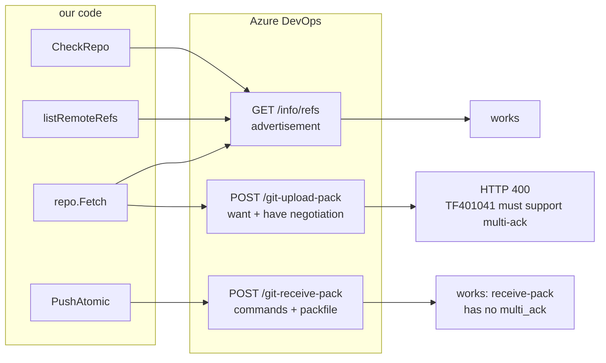
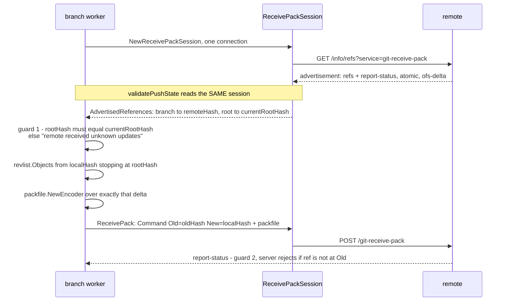

# Azure DevOps and `multi_ack`: why it fails, and what to do about it

> **design** — **decided and built: Option A, go-git v6.** Index: [`../INDEX.md`](../INDEX.md)
>
> Written against PR [#292](https://github.com/ConfigButler/gitops-reverser/pull/292)
> (issue [#288](https://github.com/ConfigButler/gitops-reverser/issues/288)), which proposes shelling
> out to a bundled `git` binary for Azure DevOps remotes. This page records what was **measured** on
> that branch and in the go-git history, separates it from what was **inferred**, and prices four
> options.
>
> **Outcome:** the migration to `go-git/v6@v6.0.0-alpha.5` is implemented. The
> [red-first ADO test](#what-the-migration-actually-cost) reproduces the failure locally with no
> Azure DevOps tenant, failed on v5 with ADO's exact HTTP 400, and passes on v6. `task lint` and
> `task test` pass. The e2e suite found a **fourth, production-breaking v6 behaviour change that no
> unit test could see** — v6 reads on-disk `known_hosts` even when a host key callback is supplied, so
> every SSH remote would have failed in the distroless image. It is fixed and pinned by a regression
> test. What the migration cost, and all four findings, are in the last section.

## The short version

- **go-git v6 already fixes this.** `multi_ack` is implemented (PR
  [#1204](https://github.com/go-git/go-git/pull/1204)) and present in every v6 tag. Upstream then
  deleted their Azure DevOps workaround example, saying ADO "works out of the box, no longer
  requiring code changes".
- **v6 is not the moving target it looks like.** In the fourteen packages we import, the
  breaking churn per alpha runs 96 → 39 → **1** → **9**. One breaking wave, settled in May.
- **Flux does not solve this with a git binary. It solves it by never fetching.** Its go-git client
  has zero `Fetch` calls — every sync is a fresh clone. That is the whole trick, and it explains why
  a four-line change is enough for Flux and would not be enough for us unchanged.
- **PR #292 as written costs 723 MB and blinds the CVE gate.** Measured: the image goes from 217 MB
  to 940 MB, and Trivy reports **zero** findings on both, because the bundled git/OpenSSH/OpenSSL
  arrive as loose files with no package database.
- **We can test all of this without an Azure DevOps tenant.** Canonical `git upload-pack` advertises
  `multi_ack`, so the Gitea already in the e2e lab is a genuine multi_ack server. Front it with a
  proxy that rejects requests omitting the capability and you have a faithful ADO simulator.

## The mechanism

`multi_ack` and `multi_ack_detailed` are protocol-v0 `upload-pack` capabilities. They change how the
server acknowledges the client's `have` lines during negotiation: instead of one `ACK`/`NAK`, the
server may stream `ACK <oid> continue` lines.

go-git v5 declares both capabilities unsupported. In `plumbing/transport/common.go`:

```text
var UnsupportedCapabilities = []capability.Capability{
    capability.MultiACK,
    capability.MultiACKDetailed,
    capability.ThinPack,
}
```

`FilterUnsupportedCapabilities` **deletes** them from the server's advertisement as the client parses
it. `ulreq.go` then builds the client's `want` line from what survived, so the request goes out
without `multi_ack`. Azure DevOps rejects any such `upload-pack` request with HTTP 400 and
`TF401041: Clients must support multi-ack.`

This is six years old ([go-git#64](https://github.com/go-git/go-git/issues/64),
[source-controller#104](https://github.com/fluxcd/source-controller/issues/104)) and it is ADO's
fault, not go-git's: the capability is optional in the protocol and ADO treats it as mandatory.

### The half that is not obvious

The capability filter cuts both ways, and the two halves fail independently:

- **The request half.** Advertising `multi_ack` is what ADO demands. Trimming
  `UnsupportedCapabilities` fixes this, and nothing else is required.
- **The response half.** Once the client advertises `multi_ack`, the server is entitled to reply with
  a multi-ACK stream, and v5 cannot parse it. `plumbing/protocol/packp/srvresp.go` in v5.19.1 (the
  version we pin) still carries `TODO: Implement support for multi_ack or multi_ack_detailed
  responses` and wraps the resulting scanner error as `multi_ack and multi_ack_detailed are not
  supported`.

The response half only triggers when the client sends `have` lines. **A fresh clone sends none** —
there is nothing local to negotiate against — so the server answers `NAK` and v5 copes. An
incremental fetch into a populated object store does send them, and v5 breaks.

Upstream states exactly this in the v5 example `_examples/azure_devops/main.go`:

```text
The initial clone operations require a full download of the repository, and therefore those
unsupported capabilities are not as crucial, so by removing them from that list allows for the
first clone to work successfully.

Additional fetches will yield issues, therefore work always from a clean clone until those
capabilities are fully supported.

New commits and pushes against a remote worked without any issues.
```

Note the last line. `receive-pack` does not use `multi_ack` at all, so **push is unaffected**.

> **Inferred, not measured.** The clone-works/fetch-breaks split above is read off upstream's code
> and comments plus Flux's usage, not from a request against a real ADO endpoint. Everything in the
> next section about Flux *is* measured from its source. See
> [Testing without a tenant](#testing-without-an-azure-devops-tenant) for how to close the gap.

## What our git paths actually need

This section exists because the answer to "does the fix break our push?" is **no, and it cannot** —
but the reason is only obvious once you see which wire endpoint each of our operations touches.

### The capability matrix

Three operations reach the network. Everything in the table below is measured: the advertisements
from a local git server with protocol v0 forced, the request capabilities from go-git v5.19.1's
`packp.NewUploadPackRequestFromCapabilities` and `remote.newUploadPackRequest`.

| Our operation | Service | Wire step | Capabilities we end up asking for | ADO risk |
|---|---|---|---|---|
| [`CheckRepo`](../../internal/git/git.go) — `remote.List()` | `upload-pack` | advertisement only (`GET /info/refs`) | none; we only read the advertisement | **none** |
| [`listRemoteRefs`](../../internal/git/git_smart_fetch.go) — `remote.List()` | `upload-pack` | advertisement only (`GET /info/refs`) | none | **none** |
| [`SmartFetch`](../../internal/git/git_smart_fetch.go) — `repo.Fetch()` | `upload-pack` | **negotiation** (`POST /git-upload-pack`) | `side-band-64k`, `ofs-delta`, `agent`, `no-progress`, `shallow` (because `Depth: 1`) — and `multi_ack_detailed`/`multi_ack` **only if advertised and not filtered** | **this is the failure** |
| [`PushAtomic`](../../internal/git/git_atomic_push.go) | `receive-pack` | advertisement + `POST /git-receive-pack` | `report-status` (we set exactly this one) | **none** |

The decisive measurement is the `receive-pack` advertisement from canonical git:

```text
<oid> refs/heads/main\0report-status report-status-v2 delete-refs side-band-64k quiet atomic
  ofs-delta object-format=sha1 agent=git/2.39.5
```

**`multi_ack` is not there, and it never is.** It is an `upload-pack` capability that does not exist
in the `receive-pack` protocol at all. `FilterUnsupportedCapabilities` runs against the receive-pack
advertisement too, but deleting a capability the server never offered is a no-op.

So the blast radius of this whole problem is **one call**: `repo.Fetch`. Not the connectivity check,
not the ref listing, and **not the push**.



### How the multi_ack request is actually built

The filter does not reject the request. It makes the request incomplete, by hiding the capability
from the code that decides what to ask for. In v5's `ulreq.go`:

```go
func NewUploadRequestFromCapabilities(adv *capability.List) *UploadRequest {
    r := NewUploadRequest()
    if adv.Supports(capability.MultiACKDetailed) {
        r.Capabilities.Set(capability.MultiACKDetailed)
    } else if adv.Supports(capability.MultiACK) {
        r.Capabilities.Set(capability.MultiACK)
    }
    // ... side-band, thin-pack, ofs-delta, agent
}
```

`adv` has already been through `FilterUnsupportedCapabilities`, so both `Supports` checks are false
even though ADO advertised the capability. The `want` line goes out without it, and ADO 400s. Trimming
`UnsupportedCapabilities` restores the advertisement, both checks pass, and the capability is
requested. That is the entire request-half fix.

### The special push, and why it is safe

Your recollection is right. There is one `ReceivePackSession`, and the remote state is read **on that
same session** before pushing to it:



Two things carry the safety, and it is worth separating them because only one is about the session:

- **Guard 1, client-side** — `rootHash != currentRootHash` is a freshness check against the
  advertisement. Reading it on the same session is what makes the value trustworthy: there is no
  second connection during which the remote could move.
- **Guard 2, server-side** — `packp.Command{Old: oldHash, New: localHash}` is a
  **compare-and-swap**. The server refuses the update unless the ref is exactly at `Old`. This is
  what makes the push genuinely atomic rather than merely well-timed, and it is enforced by the
  remote, not by us.

Neither guard involves `upload-pack`, so **neither is touched by `multi_ack`, by trimming
`UnsupportedCapabilities`, or by changing how we read.** The push path is out of scope for every
option on this page.

### The one real interaction: shallow object stores

The push does depend on the shape of the local object store, via
`revlist.Objects(repo.Storer, []{localHash}, []{rootHash})` — walk from our new commit, stop at the
commit we based it on, pack exactly that delta.

This is where a clone-versus-fetch change could in principle bite, and the answer is that **it already
does not**, because we already push from a shallow repository today: `SmartFetch` on `main` fetches
with `Depth: 1`, so the local store never holds more than the tip plus what we wrote. `rootHash` is
that tip, it is present, and its tree is complete, so the walk terminates and the delta is correct.

Any option that keeps `rootHash` present as the tip and leaves `HEAD` on the working branch leaves the
push byte-identical. That is a constraint on the *plumbing around* the read, not on the push.

> Worth noting in passing: `newUploadPackRequest` sets `no-progress` only when `o.Progress == nil`.
> PR #292's `Progress: io.Discard` therefore stops us asking for `no-progress`, so the server starts
> streaming sideband progress data that we then throw away. A second small cost of that
> out-of-scope change, on top of losing `Depth: 1`.

## How Flux resolves this

This is the most useful precedent available, because Flux supports Azure DevOps in production on
**go-git v5** with no git binary in the image.

**Step one: it trims the capability list.** In `pkg/git/gogit/client.go` (upstream `fluxcd/pkg`, and
the local read-only checkout under `external-sources/flux/`), in a package `init()`:

```go
func init() {
    // Git servers that exclusively use the v2 wire protocol, such as Azure
    // Devops and AWS CodeCommit require the capabilities multi_ack
    // and multi_ack_detailed, which are not fully implemented by go-git.
    // Hence, by default they are included in transport.UnsupportedCapabilities.
    transport.UnsupportedCapabilities = []capability.Capability{
        capability.ThinPack,
    }
}
```

Four lines, applied globally to every provider. We do not do this anywhere.

**Step two — and this is the part that actually makes it work: Flux never fetches.** Its go-git
client contains **zero** `Fetch` calls. Every operation that touches a remote is
`extgogit.CloneContext`, in four variants (by branch, by tag, by commit, by semver range), all in
`pkg/git/gogit/clone.go`. Clones are shallow (`Depth: 1`) when `ShallowClone` is set. Pushes go
through the high-level `PushContext` with refspecs, not a hand-rolled receive-pack session.

So Flux only ever exercises the case upstream says works. It never enters the negotiation path v5
cannot parse. Its comment even repeats the constraint verbatim — *"work always from a clean clone"*.

**What this means for us.** Our design is the opposite: [`git.go`](../../internal/git/git.go) does
`PlainInit(repoPath, false)` into a persistent non-bare working clone, and
[`git_smart_fetch.go`](../../internal/git/git_smart_fetch.go) does incremental
`repo.Fetch` with computed refspecs against it. That is deliberate and it is the efficient design.
It is also precisely the case v5 cannot serve against ADO. The four-line trim alone will not save
us — but it is not therefore useless, see Option B.

**One caveat on the precedent.** Flux's ADO coverage is an integration test against a real tenant
(`TF_VAR_azuredevops_org` / `TF_VAR_azuredevops_pat`, `pkg/tests/integration/azure_test.go`), run
manually and explicitly excluded from their normal test targets. Nobody has this in CI.

## Is go-git v6 stable enough?

### `multi_ack` is done there

- Implementation `14eabbda`, merged as `858d421c` (PR #1204). Present in **every** v6 tag,
  alpha.1 through alpha.5.
- Upstream commit `2ef805c2` then **removed** their ADO example:
  *"Since the multi_ack implementation (#1204), Azure DevOps works out of the box, no longer
  requiring code changes."*
- v6 negotiation reads and sets both capabilities (`plumbing/transport/negotiate.go`,
  `upload_pack.go`), and its transport test suite asserts the advertisement.

### The churn, measured

Alpha cadence: alpha.1 2026-04-01, alpha.2 04-16, alpha.3 05-06, alpha.4 05-18, alpha.5 2026-07-29.

Exported declarations removed-or-changed versus added, counted **only in the fourteen packages this
repository imports**:

| Transition | Removed / changed | Added |
|---|---|---|
| alpha.1 → alpha.2 | 96 | 64 |
| alpha.2 → alpha.3 | 39 | 32 |
| alpha.3 → alpha.4 | **1** | 27 |
| alpha.4 → alpha.5 | **9** | 69 |

That is not a project that breaks its API often. It is one large breaking wave — the transport
rewrite, landed before alpha.1 and settled by alpha.2 — followed by three months of essentially
additive change. The concern in PR #292 that adapting to v6 means "keeping up with the changes until
a stable version is released" is a fair prior, but the data does not support it.

`v5` is also still maintained in lockstep: `v5.19.2` was tagged the **same day** as alpha.5. There is
no rollback cliff.

### What the migration actually costs us

Measured by compiling this repository against the v6 checkout. Four removals matter:

| Gone in v6 | Replacement | Where it hurts |
|---|---|---|
| `plumbing/transport/client` (whole package) | transport loader / `client.Option` | [`git_atomic_push.go`](../../internal/git/git_atomic_push.go) |
| `transport.AuthMethod` | functional options: `client.WithSSHAuth`, `client.WithHTTPAuth`, passed via `ClientOptions` | 21 references across 8 files |
| `transport.NewEndpoint`, `NewReceivePackSession`, `transport.ReceivePackSession` | `transport.ParseURL`, `transport.PushRequest`, `transport.ReceivePack(...)` | our hand-rolled atomic push |
| `plumbing/protocol/packp/capability` | moved to `plumbing/protocol/capability`; `NewList` removed | import sweep |

`transport.AuthMethod` is the painful one: it is our central credential abstraction, returned by
`AuthFromSecretData` and threaded from the GitProvider controller through every git operation. v6
replaces the `Options.Auth` field with `ClientOptions []client.Option`.

Realistically: two files genuinely rewritten (`git_atomic_push.go`, and the auth plumbing in
[`internal/ssh/auth.go`](../../internal/ssh/auth.go) plus
[`credentials.go`](../../internal/git/credentials.go)), then a mechanical import and typing sweep.
Not a small PR. Bounded, and the existing suite is what makes it affordable.

## What merging PR #292 as written would cost

All figures below are from building both images locally for `linux/amd64` and scanning them.

### Image size: 217 MB → 940 MB

```text
rev:main    217MB
rev:pr292   940MB
```

**+723 MB, 4.3×.** This is a Dockerfile bug, not the inherent cost of bundling git.
`cp -rL /usr/libexec/git-core` dereferences 165 entries that are all links to the same git binary:

```text
/usr/libexec/git-core in the alpine stage       3.2M
the same directory after cp -rL              437.5M
```

`cp -a` instead of `cp -rL`, or copying only `git-remote-http` and `git-remote-https`, brings a
correct bundle to roughly 15–20 MB. Worth saying on the PR: it is a one-character fix and it removes
most of the size argument.

### arm64: still works

- `alpine:3.24@sha256:28bd…` is an OCI image index that includes `linux/arm64`.
- The `git-bundle` stage carries no `--platform`, so it resolves to `TARGETPLATFORM` and an arm64
  build gets arm64 binaries.
- The `ld-musl*.so*` glob is architecture-agnostic.
- `build-release-arm64` runs on a native `ubuntu-24.04-arm` runner
  ([`ci.yml`](../../.github/workflows/ci.yml)), so no QEMU emulation is involved.

Functionally fine. The 30-minute job timeout now has to push 940 MB per architecture.

TLS from the bundled git also works: `git ls-remote https://github.com/go-git/go-git.git` succeeds
inside the built image, so distroless' CA bundle is found.

### Security: worse in a way the gate cannot see

Trivy against both images, `CRITICAL,HIGH,MEDIUM`:

```text
rev:main   (debian 13.6)   0 vulnerabilities
rev:pr292  (debian 13.6)   0 vulnerabilities
```

The PR image contains **git 2.54.0, OpenSSH 10.3p1, OpenSSL 3.5.7**, libcurl, libssl, libcrypto,
zlib, pcre2, nghttp2, brotli, c-ares and libidn2. Trivy detects **none** of it. The image identifies
as distroless/Debian while those libraries arrive as loose Alpine files with no apk database for the
scanner to read.

The CI gate — `severity: CRITICAL`, `ignore-unfixed`, `exit-code: 1` in
[`ci.yml`](../../.github/workflows/ci.yml) — is therefore structurally blind to every future CVE in
git, OpenSSH and OpenSSL. So is Dependabot. **That is the real security cost: not more
vulnerabilities, but unscannable and unschedulable ones.**

Not a new problem: a shell was already present at `/busybox/sh` in the current image, so `/bin/sh` is
a convenience path rather than added attack surface. But git plus ssh plus a shell is a materially
better post-exploit toolkit than one static Go binary.

### An out-of-scope regression on every provider

[`git_smart_fetch.go`](../../internal/git/git_smart_fetch.go) drops `Depth: 1` and adds
`Progress: io.Discard` on the **non-ADO** path. Every provider changes from a shallow fetch to a
full-history one. This is not mentioned in the PR description, and it undoes deliberate efficiency
work.

### Smaller items

- **Coverage is 10%.** 223 of 243 new lines in `ado_system_git.go` are untested, and there is no ADO
  e2e (there cannot be — no ADO in the lab). The fallback ships essentially unexercised; only URL
  parsing and environment construction are covered.
- **Environment is stripped.** `cmd.Env` is set to only `GIT_TERMINAL_PROMPT`,
  `GIT_CONFIG_NOSYSTEM`, `PATH` and the auth variables. Pod-level `HTTPS_PROXY`, `NO_PROXY` and
  `SSL_CERT_FILE` are dropped. No regression today — `GitProvider` has no proxy or CA-bundle field —
  but the two code paths now behave differently, and Flux's clone options carry `CABundle` and
  `ProxyOptions` precisely because users need them.
- **New unencrypted key material on disk.** The SSH path decrypts the private key and writes a
  plaintext PEM to a `0600` temp file. It is cleaned up, but go-git never persisted key material.
  This also changes `internal/ssh` for **all** providers, not just ADO: `GetAuthMethod` now always
  re-serialises, and a key type `MarshalPrivateKey` cannot handle silently yields a nil
  `PrivateKeyPEM`.
- **The Go code itself is careful.** Host-parsed detection rather than substring matching, a scheme
  allowlist that rejects `ext::`, `extraHeader` scoped per origin, no credentials in argv, stderr
  redaction. The craft is good; the objection is to the packaging and the premise, not the
  implementation.

## Testing without an Azure DevOps tenant

Not having a tenant is the thing blocking every option here, including deciding whether the
diagnosis is even complete. Two ways out, and the second is the interesting one.

### A free tenant

Azure DevOps has a free tier — unlimited private Git repositories for small teams — that needs only a
Microsoft account, with no Azure subscription. Worth ten minutes, and it is what Flux's own
integration test requires. This is the only way to validate against the real server.

### A faithful local simulator

**Canonical `git upload-pack` advertises `multi_ack` and `multi_ack_detailed`.** Verified on a local
bare repository with protocol v0 forced:

```text
packet: ls-remote< <oid> refs/heads/main\0multi_ack thin-pack side-band side-band-64k ofs-delta
  shallow deepen-since deepen-not deepen-relative no-progress include-tag multi_ack_detailed
  object-format=sha1 agent=git/2.39.5
```

That is the load-bearing fact. It means a plain git server is a **genuine** multi_ack server, so both
failure halves reproduce locally:

- **The request half** — add a small reverse proxy in front of the git HTTP endpoint that returns
  HTTP 400 with a `TF401041` body when a `POST` to `*/git-upload-pack` does not contain `multi_ack`.
  That is ADO's rejection, exactly.
- **The response half** — comes for free. Once the client advertises the capability, real
  `upload-pack` will actually emit multi-ACK streams on a fetch with `have` lines, which is the thing
  v5 cannot parse.

The e2e lab already runs Gitea (see [`e2e-git-server-choice.md`](e2e-git-server-choice.md)), whose
backend is canonical git, so no new server is needed — only the proxy and a `GitProvider` pointed at
it. This is cheap, it is deterministic, it runs in CI, and it would let us:

1. Confirm the diagnosis in #288 end to end.
2. Prove or kill Option B below without a tenant.
3. Regression-test whichever fix we take, forever — which is impossible today for any option,
   including the one PR #292 proposes.

## The options

### Option A — migrate to go-git v6

The real fix. Upstream says ADO works out of the box; the churn data says the API has been stable
since May; v5 stays maintained so backing out is possible. Cost: two files rewritten plus an import
sweep, validated by the existing suite. No Dockerfile change, no image growth, no scanner blindness,
and it deletes the problem instead of routing around it.

Wins if the v6 spike comes back green.

### Option B — trim `UnsupportedCapabilities`, and clone instead of fetch on ADO

The option neither participant in #292 raised, and it is Flux's actual architecture. Four lines to
advertise the capability, plus an ADO-specific path that re-clones rather than fetching into the
persistent clone. Stays on v5, stays pure Go, no git binary, no image growth.

Cost: a full or shallow clone per sync for ADO users, which is the efficiency the current design
exists to avoid — but it is scoped to ADO, and it is provably enough for Flux's entire user base.

**It does not touch the atomic push.** Per
[the capability matrix](#the-capability-matrix), `PushAtomic` speaks `receive-pack`, which has no
`multi_ack`, and the two guards that make it atomic live in the advertisement of that session and in
the server-side compare-and-swap. A clone-fresh read path changes what fills the object store, not
how we write. The only obligations it inherits are the ones
[the shallow-store section](#the-one-real-interaction-shallow-object-stores) names: leave `rootHash`
present as the tip, and leave `HEAD` on the working branch — which is what the post-fetch branch
setup does today anyway, since a fresh clone lands `HEAD` on the remote default branch.

Wins if the v6 spike is worse than expected and we want a pure-Go stopgap.

### Option C — PR #292, repaired

Take the system-git fallback, but not as written. Minimum changes:

- `cp -a` rather than `cp -rL` (940 MB → roughly 20 MB).
- Revert the `Depth: 1` and `Progress` change on the non-ADO path.
- Restore CVE visibility for the bundled git, OpenSSH and OpenSSL — otherwise the image-scan gate is
  decorative for a third of the runtime.
- Pass through proxy and TLS environment.

Wins only if both A and B fail. Note that the PR's own documentation says the fallback is temporary
and should be deleted when v6 lands, so this option is by construction the one that has to be paid
for twice.

### Option D — do nothing yet

Defensible while the diagnosis is unverified by us. Costs an ADO user, who has already turned up.

## What has to be true, and what to do next

Ordered by what unblocks the most:

1. **Build the local simulator.** It is independent of which option wins, it is the only piece that
   makes any of them testable in CI, and it does not need a tenant. Everything else is a guess until
   this exists.
2. **Spike v6 on a branch** and run `task test`. Four known removals, two files. This is the
   cheapest way to find out whether Option A is a week or an afternoon.
3. **Ask the contributor to try the four-line trim** against their real tenant. They have what we do
   not. The result tells us whether the diagnosis is complete: if `CheckRepo` and push start working
   and only fetch fails, Option B is confirmed and the fix is small.
4. **Decide between A and B on the spike result**, and treat #292 as the fallback rather than the
   proposal.

## What the migration actually cost

Built on `feat/go-git-v6` against `go-git/v6@v6.0.0-alpha.5` (the latest tag, and identical to
upstream `main` at the time). `task lint` and `task test` pass.

### The red-first test

[`internal/git/ado_multiack_test.go`](../../internal/git/ado_multiack_test.go) implements the
simulator this page proposed: canonical git's `git-http-backend` behind a proxy that returns HTTP 400
with `TF401041` when an `upload-pack` POST omits `multi_ack`, and strips the `Git-Protocol` header so
a v2-capable client cannot sidestep the capability under test. Four tests, and the v5 baseline
confirmed the capability matrix exactly:

| Test | on v5 | on v6 | What it pins |
|---|---|---|---|
| `TestADOSimulator_IsFaithful` | pass | pass | the harness rejects like ADO, and real git clones through it |
| `TestADO_CheckRepo_NeedsNoNegotiation` | pass | pass | advertisement-only, asserts **zero** `upload-pack` POSTs |
| `TestADO_PushAtomic_NeedsNoMultiAck` | pass | pass | `receive-pack` is unaffected; the push is out of scope |
| `TestADO_SmartFetch_RequiresMultiAck` | **fail, HTTP 400** | **pass** | the fix |

The middle two passing on v5 is the point: they prove PR #292 routes `CheckRepo` through system git
for no reason, and that the atomic push never needed touching.

### The API changes, as built

All four predicted removals were real, and the predicted shape held:

- `transport.AuthMethod` → `[]gitclient.Option`. A nil slice means anonymous, which is cleaner than
  v5's nil interface.
- `transport.NewEndpoint` + `client.NewClient` + `NewReceivePackSession` →
  `transport.ParseURL` + `gitclient.New(opts...).Handshake`.
- `session.AdvertisedReferences()` → `session.GetRemoteRefs(ctx, nil)`, returning a
  `[]*plumbing.Reference` rather than a map, so `advertisedHashes` builds the lookup.
- `session.ReceivePack(ctx, req)` → `session.Push(ctx, storer, *transport.PushRequest)`.

**The compare-and-swap survived verbatim**, as predicted: `PushRequest.Commands` takes the same
`[]*packp.Command`, so `Old`/`New` is unchanged. Two things got better — v6 negotiates
`report-status` itself and returns a rejected command as the error from `Push` (so our separate
status-struct inspection collapsed into one error check), and `Atomic` is now a first-class field.

One thing the analysis got wrong in emphasis: because v6's options are **opaque closures**, callers
can no longer inspect what kind of credential they hold, which broke a genuinely valuable test matrix
(which Secret key maps to which auth field). The fix is a `git.Credential` struct that carries the
concrete value, with `Options()` rendering it — a better abstraction than the bare slice, and the
place to hang v6's new `WithCABundle` / `WithProxyEnvironment` when we want them.

### Four findings the analysis did not predict

**0. The one that would have shipped a broken release: v6 reads on-disk `known_hosts` even when you
supply a host key callback.** Its SSH transport derives `HostKeyAlgorithms` by loading
`~/.ssh/known_hosts` and `/etc/ssh/ssh_known_hosts` whenever `ClientConfig` returns with that field
empty — *including when a `HostKeyCallback` was already set* (`plumbing/transport/ssh/ssh.go`, the
`else if len(config.HostKeyAlgorithms) == 0` branch) — and fails the connection with
`unable to find any valid known_hosts file, set SSH_KNOWN_HOSTS env variable` when neither file
exists. The controller image is distroless with no home directory and no system `known_hosts`, so
**every SSH remote would have failed in production**, whether or not the credential pinned a host
key. v5 derived no algorithms and so never looked.

Fixed by `ssh.KeyAuth`, which wraps go-git's `PublicKeys` and guarantees `HostKeyAlgorithms` is
populated: from the pinned `known_hosts` when there is one (matching git's own behaviour — offering an
algorithm the pin does not cover just makes the server present a key the callback then rejects), and
from a modern default set when host key verification is disabled.

Worth dwelling on *how* this was found, because it is the whole argument for the e2e gate. Unit tests
could not catch it: the fallback lives in the transport's `connect`, not in `ClientConfig`, so a test
that builds a credential and inspects it passes cleanly — mine did. It took a real SSH server, and it
presented as one failing spec out of 71 whose error text pointed at host keys rather than at the
migration. The regression test that now pins it asserts the property that actually matters — the
algorithm list is never empty — rather than re-asserting the credential shape.

And the other three.

**1. v6 honours `commit.gpgSign`, and fails closed.** `worktree_commit.go` consults the setting
merged across system, global and local scope whenever `CommitOptions.Signer` is nil, and refuses with
`cannot auto-sign commit` when it is true with no signer registered. v5 ignored it entirely. Any
environment whose gitconfig sets it — a developer machine, a mounted config, a future base image —
would break every commit we make. Handled by `PinExplicitSigningPolicy`, which writes
`commit.gpgSign = false` into the repository's own config at init: our signing policy comes from the
GitProvider, not from ambient config.

**2. `file://` is no longer a faithful server, and that silently weakened a test.** v5's file
transport spawned the real `git-receive-pack` binary; v6 runs go-git's own in-process
`transport.ReceivePack`, whose `updateReferences` checks only that a reference *exists* and then
calls `SetReference(cmd.New)` — **it never compares `cmd.Old`**. So over `file://` every push wins.
`TestBranchWorker_ConcurrentOperations` caught it: three racing pushes all "succeeded", last write
won, and the repository ended with 2 commits instead of 4. This is not a v6 regression in the server
(v5's built-in server had identical code) — it is that `file://` stopped using real git. The test now
runs against `startRealGitServer`, where real git rejects with
`cannot lock ref 'refs/heads/main': is at X but expected Y` and our retry serialises the writers.
**Any future test of the compare-and-swap must use a real server, not `file://`.**

**3. `Progress` controls `no-progress`.** `newUploadPackRequest` sets `no-progress` only when
`Progress == nil`, which is a second cost of PR #292's out-of-scope change to the non-ADO path.

Also mechanical: `PlainClone` lost its `isBare` positional argument (it moved into `CloneOptions`),
`Worktree.Filesystem` became a method, `Signer.Sign` takes a context, `Commit.PGPSignature` became
`Commit.Signature`, and `plumbing/transport/client` moved to `plumbing/client`.

### Upstream opportunity

go-git's built-in `receive-pack` accepting an update whose `Old` does not match the current
reference makes it non-conformant as a server and, worse, makes it a test double that silently passes
things a real server rejects. That looks like a reportable upstream bug with a small fix.

## Open questions

- Does the four-line trim actually let `CheckRepo` and `PushAtomic` succeed against ADO? Inferred
  yes from upstream's *"new commits and pushes worked without any issues"*, unverified here.
- Does `remote.List()` — our connectivity check — even hit the 400? Code-read says no: `remote.list`
  calls only `AdvertisedReferencesContext`, never a `POST`, and ADO's `TF401041` is documented on the
  `upload-pack` `POST`. So `CheckRepo` and `listRemoteRefs` should already work today and PR #292
  routes them through system git unnecessarily. The simulator confirms or refutes this.
- **Answered: v6 preserves the single-session push.** Its `Session` interface is
  `Handshake` → `Capabilities` / `GetRemoteRefs` / `Fetch` / `Push` / `Close`, which maps 1:1 onto our
  `NewReceivePackSession` → `AdvertisedReferences` → `ReceivePack`, and `PushRequest.Commands` is the
  **same `[]*packp.Command`** type we build today, so the `Old`/`New` compare-and-swap survives
  verbatim. `Atomic` becomes a first-class field, and `GetRemoteRefsOptions.RefPrefixes` maps to
  protocol-v2 `ls-refs`, so v6 would let us stop pulling a full advertisement. This is an argument
  **for** Option A, not a risk against it.
- Should the ADO clone-fresh strategy in Option B be shallow? Probably yes, matching both Flux and
  our current `Depth: 1`. It does not disturb the push path's `revlist` walk — see
  [shallow object stores](#the-one-real-interaction-shallow-object-stores) — but it does need
  `capability.Shallow`, which ADO advertises.
