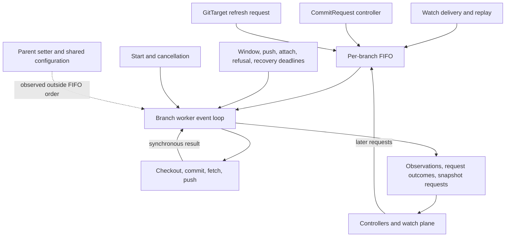

# Branch worker events and recovery

This review maps everything that can influence a branch worker: queued requests, timer deadlines,
lifecycle signals, operation results, and configuration read outside the queue. It brings the
`GitTarget` design records together around one question: how can the worker remain driven by
events while preserving order and making progress when Git cannot accept a push?

The recommended direction is to keep one owner of the checkout and make its inputs and recovery
obligations explicit. A failed push must preserve pending work. Whether it should block new work,
how much work can accumulate, and what event retries publication are separate decisions.

Status: review and proposals, based on the code following #407 and the
`fix/branch-worker-write-gates` changes. The write-gate section identifies that branch's behavior
separately. This document adds no implementation. Its findings come from reading source and design
records; no tests or validation commands were run for this review.

## The ownership rule

One worker serves `(GitProvider namespace, GitProvider name, write branch)`. Several `GitTarget`s
can share it. The provider's UID and URL identify the repository incarnation; replacing that
identity replaces the worker and its checkout.

The event loop owns the open window, pending writes, deferred snapshots, request attachment, and
parent recovery. Git operations run synchronously on that loop in the active controller paths.
Publication order therefore follows the same owner that created and retained the commits.

The proposed rule for further work is:

> Every change to the worker's execution state has an identifiable input event or is the result of
> an operation started while handling one. The worker alone applies that change to its checkout,
> retained work, and publication state.

Here, an event includes a command, a deadline becoming due, and shutdown. It is broader than the
`git.Event` struct, which carries a mirrored resource change. Results of synchronous Git calls are
currently handled within the initiating event; they have no separate completion message.

This rule describes the intended ownership boundary. The current implementation also reads shared
state and accepts direct setters. Those inputs are listed below so that an event-only design does
not quietly depend on an undocumented exception.

The implementation map starts at [BranchWorker](../../internal/git/branch_worker.go),
[WorkItem and request types](../../internal/git/types.go), and
[WorkerManager](../../internal/git/worker_manager.go). The broader ownership contract is in
[the architecture](../architecture.md#git-write-architecture).

## Inputs on the FIFO

`WorkItem` has five alternatives: `Request`, `Attach`, `Withdraw`, `Resync`, and `Refresh`.
`Request` has two commit modes, giving the six rows below. These are the alternatives the
dispatcher recognizes; the struct itself does not enforce that exactly one field is set.

| Input | Producer or entry point | Loop handler |
|---|---|---|
| Live resource write | Watch stream through `Enqueue`; `CommitModePerEvent` | `handleLiveEvents` |
| Atomic resource batch | `EnqueueRequest`; `CommitModeAtomic` | `handleAtomicRequest` |
| Attach a save | `CommitRequest` controller through the event router | `handleAttachCommitRequest` |
| Withdraw a save | `CommitRequest` controller through the event router | `handleWithdrawCommitRequest` |
| Complete scoped snapshot | Watch replay through `EnqueueResync` | `handleResyncRequest` |
| Observe remote and folder | `GitTarget` reconcile through `EnqueueRefresh` | `handleRefreshRequest` |

### Resource writes

The active live producer is
[GitTargetEventStream](../../internal/reconcile/git_target_event_stream.go). It forwards sanitized
objects, identity-only deletes, and field patches such as a translated scale update. Attribution
travels with the event. Audit facts supply identity; they do not independently supply mirrored
object state to the worker.

Watch bookmarks, watch errors, and reconnect decisions stay in the watch plane. They can change
which writes or replay snapshots arrive, but they are not additional branch-worker message kinds.
Likewise, an admission request does not directly ask this worker to mirror its object.

A live event joins the one window for its author and target. An identity change closes the previous
window before opening another. Repeated writes to one path coalesce inside that window. New windows
are offered to waiting saves before a zero-duration deadline or buffer threshold can close them.

Atomic requests close the current window, drain deferred heals at that boundary, and create a
separate retained write. They bypass window collection but use the same publication lifecycle.
The API and handler remain in the tree; this review found no non-test caller of `EnqueueRequest`.
Treat atomic requests as a supported worker path, not evidence of a second active ingestion source.

### Snapshots

The current producer in [target_watch.go](../../internal/watch/target_watch.go) supplies a complete
snapshot from watch initialization or replay. Watch recovery and forced target rechecks can produce
another replay. The worker receives the resulting snapshot; it does not independently list cluster
objects or interpret the original reconcile trigger.

`ResyncRequest` carries the desired objects, their collection resource version, target, scope, and
reply channel. Scope includes the collection identity used for coalescing; the served API version
is data. The deletion boundary must match the population gathered. An empty desired set can
authorize a sweep inside that boundary.

The worker also supports whole-target snapshots and `Heal=true`. A heal waits while any live window
is open, including a sibling target's window, and runs at an idle boundary. The inspected production
replay call passes `Heal=false`; do not infer an active periodic heal producer from older comments
or tests of this supported path.

[Resync handling](../../internal/git/resync_flush.go) refreshes the base before judging a snapshot.
A no-op snapshot may never push, so it needs its own remote evidence. Retained writes are replayed
when that refresh resets the checkout. `RefreshRemote` marks a forced recheck and avoids paying
for a second refresh in the same preparation step.

Snapshots also establish render fidelity. They must be able to evaluate the target while its gate
holds ordinary live writes back. A suspended target still scans its folder and suppresses the write.
A common guard at the top of the dispatcher would therefore need to distinguish observation and
recovery from permission to create a new content commit.

The reply describes local application. A changed snapshot joins pending writes for publication;
its successful reply alone does not prove a push. A no-op snapshot retains no write of its own.
The handler may attempt an immediate push before replying, but callers cannot treat the reply as
a publication acknowledgment.

### Saves and withdrawal

[The event router](../../internal/watch/event_router.go) registers saves on the FIFO and polls the
worker's outcome. It routes an already-owned request back to its owner even when that worker has
been removed from the manager's active map.

An attach carries request identity, target, author information, message, attach mode, and deadlines.
`CurrentOrNext` can claim a matching window. `Next` closes an eligible existing window before waiting
for a later one. Registration is idempotent; another controller poll does not restart the deadlines.
Only resource writes open a live window. Competing saves attach in registration order. An expired
wait cannot claim a newly opened window, and processing a due timer does not preempt a Git call.

At expiry, a request can resolve without a commit or create an empty record when `CommitEmpty`
allows it. A foreign-window mismatch does not create that record. An attached request follows its
retained write through replay and resolves against remote publication, including a remote-confirmed
no-op. The details belong to [the commit-window contract](commit-timing-surface.md) and
[the attach loop](../../internal/git/commit_request_attach_loop.go).

A withdrawal cancels only a request the worker has not acted on. A request collecting a window or
waiting for a push remains held. The controller cannot independently fail it while the worker can
still publish it. An exited worker can answer withdrawal directly because its loop can no longer
act; that is a lifecycle exception to FIFO handling.

### Refresh

[Refresh handling](../../internal/git/refresh.go) observes the branch and scans the named target's
folder. It creates no new mirrored content. Fresh observations can avoid a connection; an idle
checkout that has moved may be fetched and reset. Targets sharing a branch share the remote
observation, while each target's folder scan still has its own meaning.

An ordinary refresh skips a branch with an open window, retained writes, a dirty worktree, or an
unfinished replay. It cannot reset such a checkout as if it were idle. During active parent
recovery, however, a refresh can service a due recovery probe, and that handler may publish already
retained work. Calling every refresh path strictly read-only would miss that distinction.

The controller supplies these requests through its existing reconcile schedule.
`--git-refresh-interval=0` disables that periodic refresh input. It does not disable window timers,
push cooldowns, or parent recovery.

## Ordering and admission

The FIFO orders accepted queue items. It does not establish a global order between independent
watches, controller delivery, and timer channels. The loop selects among ready inputs; a deadline
is eligible to run after it expires, but cannot interrupt an in-progress handler.

Snapshot coalescing preserves a more specific rule. A newer snapshot can replace a queued snapshot
for the same target and scope while no relevant work has crossed its queue position. Live writes,
overlapping snapshots, and attaches can fence that replacement. The replacement keeps the marker's
position and preserves a requested remote refresh. The old caller receives `ErrResyncSuperseded`.
It must not interpret that reply as its own snapshot having been applied.

Deferred heals have a separate coalescing list after dequeue. They wait for an idle window boundary,
and a newer heal for the same target and scope replaces the older one. This is another reason to
describe ordering in terms of the request contract, rather than assuming every item executes fully
at its original FIFO position.

Queue admission is nonblocking and bounded by item count, with a default of 1,000 items per worker.

| Input refused by a full or stopping queue | Caller behavior |
|---|---|
| Live event | `Enqueue` returns false; the watch path keeps its cursor and reconnects for redelivery |
| Atomic request | Drop is logged and counted; `EnqueueRequest` exposes no acceptance result |
| Snapshot | False return and an error reply; the producer must not claim successful admission |
| Attach or withdrawal | Controller polling sends it again; an exited worker can settle withdrawal |
| Refresh | Dropped; a later reconcile can request another |

Successful admission means an item entered in-memory processing. It is not a durable receipt or a
promise that the event will become a commit. Handler refusal, process loss, and shutdown still
matter. The durable queue and cursor-acknowledgment work in [the backlog](../TODO.md) remains open.

## Deadlines and lifecycle events

Five timer sources wake the loop. Identity switches and memory thresholds are additional decisions
inside a write handler, not independently queued inputs.

| Deadline | What makes it due | Effect |
|---|---|---|
| Commit window | Earlier of idle timeout and maximum duration | Close the window and schedule publication |
| Push cooldown | Remainder of 5 seconds since the last successful push | Attempt publication of retained writes |
| Attach timeout | Earliest waiting save's deadline | Service waiting saves, including an allowed empty record |
| Refusal action | Earliest deferred refusal action | Recheck consent and create an eligible empty commit |
| Parent recovery | Recovery deadline, with backoff | Probe, retry retained work, or request owed snapshots |

Window settings are captured when the window opens; an attached save supplies its own timing.
Editing target settings does not move an already-running window's deadlines. After ordinary loop
wakes, the worker services saves, drains eligible deferred heals, and updates retained-work
visibility. A queue item can therefore cause follow-on work beyond its primary handler.

Start creates the loop after checking that its provider can be read. Startup failure exits and
settles known requests. Stop closes admission under the enqueue lock, cancels the worker context,
and waits for exit. The shutdown handler attempts to finalize the open window, apply deferred heals,
and publish pending work. It then fails requests still awaiting publication and discards unhandled
queue items. This is best effort; cancellation and remote failure can prevent publication.

The manager retires workers on repository replacement or when no target needs them. Its periodic
orphan sweep is a lifecycle producer outside the branch loop. An already-held request remains bound
to its original worker during retirement.

## State that currently enters outside the FIFO

These inputs prevent a literal claim that the queue payloads completely determine worker behavior.

| Input | Current boundary | Consequence for an event-only design |
|---|---|---|
| Parent configuration | `SetParentBranch` stores an atomic name and generation | Preserve the push admission rule when choosing where a change becomes effective |
| Render fidelity | Watch plane updates a shared `RenderFidelityGate` | Specify which gate revision each write decision observes |
| Target write policy | Handlers resolve target metadata from the Kubernetes client | Specify when suspension, placement, messages, encryption, and prune policy are captured |
| Provider and Secrets | Read for credentials, signing, and connection policy | Credential changes can affect a later attempt without a distinct queue item |
| Type resolution | Injected mapper and source-cluster resolver | Planning observes discovery state outside the request payload |
| Lifecycle | Manager start, stop, replacement, and cleanup | Admission and cancellation already act outside FIFO order |
| Bootstrap helper | Exported `EnsurePathBootstrapped` locks and stages the checkout directly | No production caller found; review this escape hatch before declaring exclusive loop access |

`SetParentBranch` is especially important. A target's `parentBranch` is immutable, but replacing the
targets on a still-live shared worker can change its parent. A configuration update before push
admission invalidates a plan based on the old generation. An admitted push is not recalled.
The setter itself does not enqueue a wake; handlers and recovery checks observe the new generation.

Putting that setter behind the same FIFO would change its timing. An update arriving while a
handler performs Git work could wait until after that handler's push. A refactor must either retain
the current admission check or explicitly decide a different configuration-activation contract.
A renamed message alone does not preserve the existing race guarantees.

The same question applies to suspension and render fidelity. The current write-gate branch checks
them at commit decisions, and allows a commit already made locally to reach the remote. It gives
no promise to recall that commit when a gate closes later. Replay also has its own policy reads,
including tightening retained prune permissions; configuration is not frozen uniformly across the
entire pipeline.

Recommended review boundary: retain existing behavior while naming each observation and its
effective point. Consider versioned configuration or gate-change events only after the ordering
contract is explicit. Avoid copying Secrets or adding public configuration revisions merely to
make every input look like a self-contained queue message.

## Internal results and outputs

Several important transitions are produced by handlers rather than received as `WorkItem`s.

| Result | Worker action |
|---|---|
| Local commit succeeds | Retain the write and its commit identity until publication |
| Partial write or replay fails | Mark the checkout dirty or replay incomplete; recover before another commit |
| Advertisement or rejected upload reveals a moved remote | Fetch, reset, and replay retained writes within the bounded push cycle |
| Push proves publication or a no-op | Settle carried requests and clear the published batch |
| Missing or unresolved parent prevents work | Retain a recovery obligation and remember affected dropped scopes |
| Write plan is refused | Report the refusal; optionally schedule an authorized refusal action |

The checkout's `baseTrusted`, `worktreeDirty`, and `replayRequired` flags answer different questions.
A clean checkout at the remote tip can still have lost the local commits behind retained writes.
It must not settle those writes merely because pushing that tip reports success.

The [write-gate branch](../../internal/git/write_gate.go) addresses a separate question:
whether a target may receive a new write. It makes a refused save fail instead of reporting a
successful empty save that was never made. That work is not a replacement for checkout recovery.

[Refusal actions](../../internal/git/refusal_touch.go) are also distinct from `CommitEmpty` saves.
`onRefusal: PushEmptyCommit` authorizes an empty commit for an eligible write-boundary refusal to
prompt the GitOps reconciler to reapply. Consent and suspension are checked again when a delayed
action runs. The interval is one minute per target, and pending observations are tracked per target
and collection. A successful resync clears only the refusal scopes it covers.

Outputs leave through request outcomes, snapshot replies, remote observations, and reporting hooks
for placement, path acceptance, and render fidelity. The watch plane and controllers own their
status projections. A branch observation says where the remote was proved; it does not prove that
every target folder was scanned or published.

Parent recovery also publishes a per-target snapshot-request sequence. The controller observes a
new sequence and forces a watch recheck, whose replay sends a snapshot back through the FIFO.
The worker never substitutes a cached dropped event for a fresh cluster snapshot.

## What happens when Git cannot accept a push

There are three different failure modes behind the impression that the worker chokes.

### A Git operation has not returned

Network and repository operations occupy the loop synchronously. While one runs, that branch cannot
handle queued saves, snapshots, deadlines, or subsequent live writes. Producers continue admitting
items until the FIFO fills. Every target on that branch shares the delay; other branch loops have
their own execution, although manager lifecycle operations can still serialize replacement.

This follows from the chosen owner model. Before adding concurrency, review operation deadlines
and cancellation end to end. For example, `advertiseRemoteBranch` reaches `listRemoteRefs`, which
calls `remote.List` without the worker context. This review does not establish a universal maximum
duration for all transports. A timer on the loop cannot interrupt a call that has not returned.

### The push returned a failure

The loop can resume handling inputs, but the retained batch remains unpublished. Ordinary push or
replay failure stops the push timer without arming a general retry. If the branch then becomes
quiet, work can wait indefinitely. Normal refresh deliberately skips retained work, so enabling
periodic refresh does not repair this case.

Continued writes can cause the opposite problem. Since only success advances `lastPushAt`, an
expired cooldown does not space failed attempts. Later commits may repeatedly retry the same
unavailable remote. This gap is recorded in
[the push-cooldown design](push-cooldown.md#7-options), and is independent of whether the success
cooldown remains useful.

These two outcomes are scheduling policy. Neither is required by serialization. A due retry is a
valid event for the same loop and can make progress without a new cluster edit.

### Publication stays unavailable while new work arrives

The FIFO has a count limit. The default 8 MiB branch buffer threshold closes a live window early,
but moving those events into `pendingWrites` does not free the data needed for replay. Failed pushes
retain that data. The threshold is therefore not a hard bound on memory during a sustained outage;
queued payloads and deferred snapshots also consume memory outside that counter.

The available choices have different product costs:

| Choice | Benefit | Cost or unresolved contract |
|---|---|---|
| Keep current admission and retention | Preserves retained write detail within the process | Memory can grow during a prolonged outage |
| Refuse more writes at a retained-work limit | Bounds worker retention | Requires reliable redelivery and a separate path for control and recovery |
| Collapse blocked work into a fresh snapshot | Bounds retained history | Loses intermediate attribution, messages, and save boundaries |
| Persist an ordered journal | Allows bounded memory and restart recovery | Needs durable acknowledgment, quotas, replay, and ownership design |
| Run publication separately | Could improve control responsiveness | Requires immutable publication batches and explicit completion ordering |

A newer snapshot cannot silently replace a save-bearing batch: final state equality does not retain
the same history or prove that the requested commit was published. Durable queuing and HA are
already related backlog items. Raising queue limits does not settle either contract.

## Parent recovery is the existing model for an obligation

[Parent recovery](../../internal/git/parent_recovery.go) already provides a useful example of
event-driven progress. A missing configured parent or an unresolved default branch can prevent a
write branch from being created. The worker remembers both retained writes and dropped scopes that
still need a snapshot.

The recovery deadline starts at 10 seconds and doubles up to 5 minutes. Targets sharing the worker
share one probe budget. Before a due probe, ordinary arrivals cannot repeatedly fetch the missing
parent. Once the branch can be based, recovery retries retained work and asks for snapshots still
owed. It keeps scheduling while the obligation remains.

Seeing the parent again does not complete recovery. A changed snapshot must be published, or a
fresh no-op snapshot must settle its scope. A second outage invalidates publication credit from a
snapshot that predates newly dropped work. Otherwise publishing the older snapshot could falsely
clear the newer obligation.

This establishes a useful requirement for general publication recovery: pending work needs an
identified next opportunity to run, even when no external event arrives. Reusing the concept does
not require merging every kind of recovery into one flag. A missing parent, a failed push, and a
scope awaiting a fresh snapshot have different completion conditions.

## Decisions carried from the GitTarget records

The records below remain the detailed sources. This section carries their constraints into the
event review and distinguishes implemented behavior from open work.

### Parent branch contract and hardening

[The parent-branch contract](gittarget-parent-branch.md) and
[the completed hardening record](gittarget-parent-hardening.md) establish:

- An existing write branch receives subsequent commits on its own history. Its parent is followed
  only while the write branch is absent.
- Standby and ordinary no-op writes create no remote branch. An explicitly requested empty commit
  is a separate authorized write.
- First publication checks the selected parent's tip using the push advertisement. The server's
  compare-and-swap protects creation or update of the write branch. The parent can still move after
  the advertisement; no parent lock is promised.
- A trusted checkout gets no unconditional fetch before publication. Contention and invalid state
  trigger bounded fetch, reset, and replay.
- Omitted parent means the remote default branch as last discovered. A push advertisement cannot
  rediscover a default-branch switch; discovery, refresh, or a probe does that.
- An explicit missing parent blocks creation, even when it equals the write branch. An omitted
  parent permits a root commit only when the remote is empty. Tags count as refs; a nonempty remote
  with an unresolved default branch must not be treated as empty.
- Targets sharing a worker must agree on the configured parent. Omitted and explicitly named
  parents are distinct configuration values even when they currently resolve to the same branch.
- Recovery must survive another transient failure after the parent returns and another outage
  while an older snapshot awaits publication. Retained replay must respect the probe budget too.

Open work includes showing the parent in each `GitProvider.status.branches` entry. Resetting,
deleting, or force-pushing a surviving write branch after a PR merge remains a separate policy
decision. A parent observation cannot authorize any of those mutations.

### Parent observations

[The observation proposal](gittarget-parent-observation.md) is deferred. Its first step keeps parent
availability and its own timestamp visible after the write branch exists. It reuses existing
advertisements, adds no connections, and changes neither readiness nor publication permission.

Ancestry is a later step, dependent on measuring the pinned go-git shallow-object behavior. Compare
advertised remote tips; unpublished local `HEAD` is not an alternative input. Equal tips and proved
ancestry can yield `SameTip`, `WriteAhead`, or `ParentAhead`; incomplete evidence yields `Unknown`.
Negative ancestry claims require stronger evidence. No extra history fetch or deepening is budgeted.

Exact fields, unresolved-default representation, and local work limits remain open. Any cached
comparison must belong to the repository identity and exact observed tips. A successful write push
cannot advance the parent's timestamp without evidence about that parent.

### Empty repositories

[The empty-repository record](gittarget-parent-empty-repository.md) separates protocol evidence
from bootstrap policy. It records an experiment against go-git `v6.0.0-alpha.5` in which unborn
`HEAD` information was discarded, plus a proposed upstream fix. That recorded dependency finding
was not reverified against upstream during this review.

Recovering the advertised default name is the first proposed step. Choosing what the first commit
may create is a later compatibility decision: keep today's write-branch bootstrap, refuse until
the advertised default exists, or explicitly authorize bootstrapping it. Guessing `main` is rejected.
Protocol and host behavior still needing verification must stay unknown in status.

### Status and configuration freshness

[The red-status plan](gittarget-red-status-plan.md) keeps the writer responsible for proving a
refusal and the controllers responsible for publishing it. Message changes and scoped recovery
already matter; a sibling scope's success cannot clear another scope's failure. Notifications are
best effort, with periodic reconcile as the fallback.

The remaining work is a complete reason/status contract and the decision about retaining refusals
across restart. Shared queue saturation and background failures need attributable evidence before
being projected onto one target. A healthy target can coexist with a broken selecting rule.
Suspension is an intentional stop to new writes while observation remains useful.

[Configuration freshness](gittarget-configuration-freshness.md) remains deferred. A watch plan being
applied is distinct from a branch's pending writes being published. Any future plan marker belongs
to the watch owner and must describe only inputs that owner applied. Provider credentials do not
belong in that marker merely because a worker reads them.

Open decisions include the input set, observed-input revisions, one marker versus two, the meaning
of pending during normal coalescing, readiness effects, and compatibility across canonicalization
changes. Revisit when operator incidents or multi-rule waits show a concrete need; a new branch
event model does not itself justify new public freshness fields.

### Earlier API work and adjacent backlog

[The API-wave record](gittarget-api-wave.md) preserves the separation between target policy and
provider connection settings, plus suspension and explicit recheck semantics. Its opening status
is older than its step 8, which closes the remaining riders. Do not turn that historical checklist
into new worker requirements. Asserted save authorship and resolution-change Events were declined.

The backlog still records save details: expiry order for simultaneous empty records, full author
identity, and record-message templates. It also records worker observability, cross-provider writes
to the same repository, and a durable queue for restart recovery and HA.

[Push notifications and reconcile triggers](push-notification-and-reconcile-trigger.md) contain
additional unchosen inbound and outbound designs. There is no branch-worker Git webhook input in
the inventory above. A future remote-change notification should request observation through the
owner; it must not become another writer of the checkout. The older options are not approval to
hold pushes for an external reconciler or to infer that a remote commit has reached the cluster.

## Decisions to make before another implementation branch

The first decision is how strictly to apply the event rule to configuration. The current owner
model is clear for the checkout, but a fully queued configuration model would need explicit
activation and admission semantics. Keep the parent-generation race contract visible while
reviewing that choice.

For failed publication, the smallest proposed change is a bounded retry deadline owned by this
same loop, while preserving the successful-push cooldown. It should run only while work is owed,
space attempts under continued arrivals, and stop when that obligation is settled. Its interaction
with the existing parent deadline needs one scheduling decision so two timers cannot multiply the
remote probe budget. Delay values, reset rules, and failure classification are still design work.

Keep synchronous checkout ownership for now. Before considering asynchronous publication, establish
where a slow call blocks and which cancellation or timeout guarantee is missing. If a separate
publisher later becomes necessary, it needs an immutable batch and a completion event carrying
worker incarnation, attempt identity, and published evidence. Letting it share a mutable checkout
would remove the ordering guarantee this design depends on.

Treat sustained-outage storage as its own decision. Define whether the product preserves every
accepted attributed change, final state only, or explicit save boundaries before choosing a hard
admission limit, snapshot compaction, or a journal. Recovery and lifecycle inputs must still have a
way to run when data admission is constrained.

For each proposed event, review five things: who produces it, what ordering it needs, which state
it may change, what constitutes completion, and who supplies the next event after failure. Apply
that review to remote failure followed by silence, failure under continuous arrivals, parent loss
and recovery, gate changes during a window, replacement with a held save, and saturated admission.
These are future review and validation cases, not work executed by this document.
