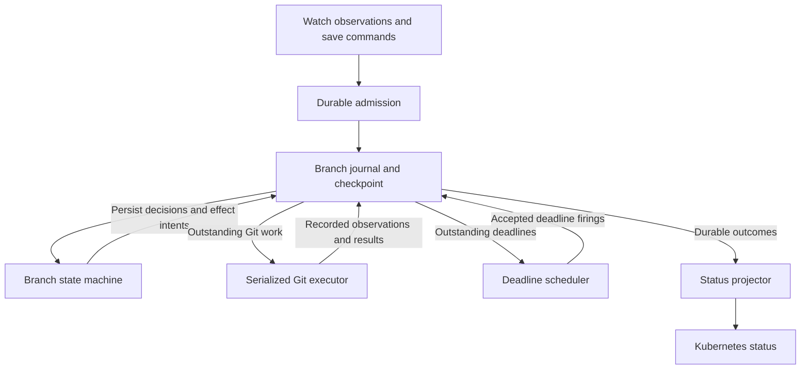

# Branch worker events, durable execution, and recovery

A single failed push on a quiet branch used to leave a `CommitRequest` in `WaitingForPush`
indefinitely, even after Git recovered. #412 repairs the retry half of that liveness gap. Bounding
Git operations is the next step, with the branch worker still the owner of its checkout.

The longer-term direction is recoverable execution of accepted writes, save commands, window
decisions, deadlines, and publication outcomes. This document owns the worker's event semantics,
current failure analysis, and immediate implementation scope. The
[HA and durable delivery plan](../future/ha-gittarget-distribution-plan.md) is the sole owner of
journal storage, acknowledgments, publication recovery, retention, and the persistence/HA rollout.
The broader ownership contract is in [the architecture](../architecture.md#git-write-architecture).

Status: design proposal against the code after #407, #411 and #412 (publication retry, built).
Current-behavior sections describe that implementation. Event names and the transition boundary
are proposals. This document changes no runtime behavior and does not establish an outage or
exactly-once guarantee.

## Next implementation: restore publication progress

The remaining items (2 to 4) and the rebuild gap below are planned as one write-path refactor in
[`gittarget-branch-worker-log.md`](gittarget-branch-worker-log.md): a log of decided writes, one
materializer for the checkout, and one retry deadline.

Complete retry scheduling and add Git operation deadlines before the journal work. Neither fix
depends on choosing a storage backend, changing the save contract, or implementing HA.

1. **Built in #412.** Retained publication work has a bounded failure backoff (10s, doubling to
   5m) on the push timer, in [publication_retry.go](../../internal/git/publication_retry.go).
   Commits before the deadline do not push; a success resets it. While parent recovery is open
   its probe deadline is the retry, and new commits wait for it too, including after the parent
   returns. A stopped worker's timers are stopped with it.
2. Carry cancellation through ref listing and fetch, and impose operation deadlines across the
   push cycle. Bound the cycle's total occupancy as well as its individual calls. Repeated
   contention retries must not repeatedly reset the whole budget. Keep timed-out work pending;
   a lost push response can mean the remote already accepted it.
3. Preserve held-save semantics. The worker must resolve publication or establish that the save
   cannot publish before it reports a terminal failure. A controller timeout alone cannot prove
   that. Keep `WaitingForPush` while a recoverable publication obligation remains.
4. Use an injectable clock and scheduler to test silence, continuous arrivals, cancellation, and
   stale firings. Keep one owner of the checkout while testing the transport cancellation path.
   Returning from a timeout wrapper while a goroutine still mutates the checkout is unsafe.

The completion test is a save whose first push fails, followed by silence and remote recovery:
without another resource edit, its commit reaches Git and the same request reaches its terminal
status with the published SHA.
`TestPublicationRetry_AHeldCommitRequestIsCommittedWithoutAnotherWrite` covers that on the event
loop. Still to prove that a request can safely outlive the controller's safety window while
retries continue, and that a stalled remote call returns control within the operation budget.
Use a controllable remote for those failures and a fake clock for retry timing.

This change improves progress within a running worker. Restart durability follows the separate
journal plan. An indefinitely unavailable remote can still leave a save pending; the immediate
fix promises an active recovery schedule, not a time by which an unavailable server must accept it.

## Why the branch worker remains the right owner

One worker currently serves `(GitProvider namespace, GitProvider name, write branch)`. Several
`GitTarget`s can share it. The provider's UID and URL identify the repository incarnation;
replacing that identity replaces the worker and its checkout.

The event loop owns the open window, pending writes, deferred snapshots, request attachment, and
parent recovery. One owner can decide whether a write joins a window, whether a save attaches,
and which commits a push publishes. Sequential file edits also protect resources that share a
YAML file. Splitting those decisions among controllers would require coordinating the same state
across more places.

This is a single-writer event loop, close to the
[Singular Update Queue pattern](https://martinfowler.com/articles/patterns-of-distributed-systems/singular-update-queue.html).
It has an actor-like ownership boundary, with exceptions for shared configuration and setters
described below. Serialization is useful independently of persistence.

The proposed ownership rule is:

> The worker decides each transition from explicit inputs and recorded observations. Its state
> and outstanding obligations are recoverable before the corresponding external work starts.

Git operations can initially remain synchronous on this owner. Separating decision logic from
effects does not require another goroutine or a workflow service. A later asynchronous executor
would need immutable work, attempt identities, and completion messages. It must never mutate the
same checkout concurrently with the worker.

The implementation starts at [BranchWorker](../../internal/git/branch_worker.go),
[work and event types](../../internal/git/types.go), and
[WorkerManager](../../internal/git/worker_manager.go).

## Inputs on the FIFO

`WorkItem` has five alternatives: `Request`, `Attach`, `Withdraw`, `Resync`, and `Refresh`.
`Request` has two commit modes, producing the six dispatcher paths below. The struct itself does
not enforce that exactly one alternative is set.

| Input | Producer or entry point | Loop handler |
|---|---|---|
| Live resource write | Watch stream through `Enqueue`; `CommitModePerEvent` | `handleLiveEvents` |
| Atomic resource batch | `EnqueueRequest`; `CommitModeAtomic` | `handleAtomicRequest` |
| Attach a save | `CommitRequest` controller through the event router | `handleAttachCommitRequest` |
| Withdraw a save | `CommitRequest` controller through the event router | `handleWithdrawCommitRequest` |
| Complete scoped snapshot | Watch replay through `EnqueueResync` | `handleResyncRequest` |
| Observe remote and folder | `GitTarget` reconcile through `EnqueueRefresh` | `handleRefreshRequest` |

This inventory is the starting point for extracting explicit transitions. The atomic handler is
supported, but this review found no non-test producer. `Refresh` normally observes an idle branch;
during parent recovery its handler can service a due probe and publish retained work.

Timer channels, shutdown, synchronous Git results, and shared configuration are additional inputs
outside this FIFO. A refactor must account for them as well as these six paths. Snapshot replies
currently describe local application, so they are not remote-publication receipts.

## Architectural names and replay guarantees

The proposed direction is an **event-sourced state machine per branch, with durable execution of
external operations**. These terms describe separate properties:

| Term | Property |
|---|---|
| Single-writer event loop | One owner orders state changes |
| Durable queue | Accepted messages survive the stated storage failures |
| Event sourcing | An ordered history of facts reconstructs execution state |
| Durable execution | Pending operations and deadlines resume after failure |
| Status projection | Recorded outcomes produce the Kubernetes status view |

[Event sourcing](https://learn.microsoft.com/en-us/azure/architecture/patterns/event-sourcing)
requires an authoritative history of transitions. Saving today's `WorkItem` queue only preserves
requests to execute. It leaves decisions and results to be derived again. A queue that discards
acknowledged messages also needs a durable checkpoint and retained history to reconstruct state.

[Durable workflow execution](https://docs.temporal.io/workflow-execution) is the relevant model for
resuming outstanding work, including timers and external calls. The recommendation here concerns
those semantics; adopting Temporal or another workflow engine is a separate infrastructure choice.

The word replay currently covers several different operations:

| Replay goal | Current guarantee |
|---|---|
| Reapply retained writes after the remote branch moves | Supported while that work survives in memory |
| Recover current Kubernetes state after a watch gap | Snapshots can converge state; intermediate history can disappear |
| Restart with the same save attachments, deadlines, and outcomes | Incomplete; execution state is volatile |
| Reproduce identical Git commits and SHAs | Unsupported; parents and commit timestamps can change |

Historical replay reconstructs decisions using recorded observations and results. Resuming an
unfinished push contacts Git again and records a new result. Replaying a historical success must
not send another push or recreate an empty commit.

An unconditional promise to replay everything forever would also require unlimited history,
compatible readers, and retained dependencies. Define a recovery boundary: a durable checkpoint
plus its journal tail, with a stated retention and failure policy. Kubernetes watch history is
not an archive of every mutation.

## Problems in the current implementation

These gaps are visible in the current code. Making the queue durable addresses only some of them.

### A failed push stranded a save in `WaitingForPush` (fixed in #412)

Before #412, `pushPending` retained failed writes but stopped the push timer without arming a
retry. If no more writes arrived, a quiet branch stayed unpublished indefinitely, and ordinary
refresh skips a branch with retained work, so periodic `GitTarget` reconciliation did not repair it.
The failure now schedules its own retry. The rest of this section records why the fix had to be
on the worker.

For an attached save that committed locally, this left `WaitingForPush` with no time limit.
After its safety window, `withdrawCommitRequest` in the
[controller](../../internal/controller/commitrequest_controller.go) sends withdrawal and continues
polling when the worker still holds the request. `handleWithdrawCommitRequest` in the
[attach loop](../../internal/git/commit_request_attach_loop.go) leaves attached or committed
requests unchanged. Neither path retries the push. The API showed `Ready=False`,
`Reconciling=True`, `Stalled=False`, and `Pushed=Unknown`, with reason `WaitingForPush`.

That withdrawal rule protects against reporting failure and then publishing the save later.
`TestCommitRequestReconcile_AHeldRequestOutlivesTheBound` explicitly preserves it. The defect is
that the live worker retained responsibility without scheduling progress. The fix restores
retries rather than adding a controller-only timeout that could give a false terminal result.

Continued writes caused the opposite problem: only successful pushes advance `lastPushAt`, so
once the cooldown had elapsed every later commit attempted the same unavailable remote. The retry
deadline now governs those commits ([push-cooldown design](push-cooldown.md#7-options),
option C).

The retry follows [parent recovery](../../internal/git/parent_recovery.go), which already kept an
obligation open and scheduled its next attempt (10 seconds, backing off to five minutes, shared
across targets on the worker). While the parent is missing, that schedule suppresses early
attempts. After the parent returns, the recovery obligation stays open until the work publishes,
but its missing-parent hold is removed. A publication that fails while the obligation is open
therefore defers to recovery's next probe deadline: new commits wait for it, and recovery's timer
makes the attempt. Review of #412 found the handoff gap (each new commit retried at once);
`TestPublicationRetry_AFailureAfterTheParentReturnsWaitsForRecovery` pins the fix.

The backoff schedules publication attempts, not every Git connection. A new window used to fetch
to rebuild retained writes before reaching `maybeSchedulePush`, and a failed rebuild dropped the
window and failed its save. A closed window is now a decided write in the log
([`gittarget-branch-worker-log.md`](gittarget-branch-worker-log.md), step 2): an unreachable remote
leaves it for the publication retry with its save held, and while that retry is pending a new
decision spends no connection. Only a failure of the write itself, or a missing parent, drops it.

There is no worker publication-failure condition or retry deadline in `GitTarget` status. A
push-specific refusal, such as branch protection with working read access, can leave a save in
`WaitingForPush` without explaining the cause. Push-cycle failures appear in logs and
`gitopsreverser_git_pushes_total{outcome="failed"}`. A rebuild that fails before entering the push
cycle is not counted by that metric. Provider connectivity or credential failures can separately
surface through `GitProviderReady`, and parent recovery already has status.

### Slow Git operations stop the whole branch loop

Git calls run synchronously. While one is running, the branch cannot handle queued saves,
withdrawals, snapshots, deadlines, or later writes. Every target on that worker shares the delay.
Producers continue admitting work until the FIFO fills.

The gap covers both remote observation and fetch. In
[smart fetch](../../internal/git/git_smart_fetch.go), `listRemoteRefs` calls `remote.List` and
`SmartFetchFrom` calls `repo.Fetch` without passing the worker context to either network call.
The `ctx` parameter on `SmartFetchFrom` does not make those operations cancelable by the worker.
The separate connection check in [git.go](../../internal/git/git.go) also uses `remote.List`.

The [atomic push](../../internal/git/git_atomic_push.go) does pass context through handshake,
advertisement, and upload, but `internal/git` sets no operation deadline. Worker shutdown
cancellation is not an elapsed-time budget. These code findings do not establish that every
transport lacks its own timeout; they establish that the worker has no end-to-end bound.
A timer on the event loop cannot interrupt a call that has not returned.

### Admission is volatile, and retained memory has no outage bound

Successful enqueue means an item entered process memory. The watch path can advance its resume
cursor before the write reaches Git. A crash between those steps can make a replacement resume
past work that existed only in RAM. The local checkout is disposable.

The FIFO defaults to 1,000 items. The default 8 MiB branch buffer threshold closes a window early,
but closing moves its data into `pendingWrites`. Failed pushes retain that data. Queued payloads
and deferred snapshots also consume memory, so neither setting bounds total outage retention.

Queue-full handling differs by input. Live writes return a refusal to the watch producer, which
keeps its cursor and reconnects. Attaches and withdrawals can be resent. Refreshes can be retried
by a later reconcile. The supported atomic enqueue API logs a dropped request without returning
an acceptance result. A durable admission contract needs explicit receipts for every supported
producer. See the [durable queue backlog](../TODO.md).

### Saves lose execution identity across a restart

The worker remembers registration order, attachment, calculated deadlines, and outcomes in memory.
Repeated delivery is idempotent within that lifetime. An attached request follows its retained
write through conflict replay, including the refreshed commit SHA. Those are useful foundations.

The gap is a push that succeeds before its result reaches Kubernetes status. A crash loses the
worker's receipt, and a resent request can create another empty commit. This is explicitly
documented in [the commit-window contract](commit-timing-surface.md). The outcome cache can also
collect entries older than 15 minutes when no attach is queued. Collection is not tied to a
durable receipt proving that status was written.

Authorship has a separate lifetime. The
[admission author store](../../internal/queue/command_author_store.go) retains records for an hour;
the `CommitRequest` object cannot reconstruct the authenticated submitter by itself. Recovering a
previously accepted save must preserve its resolved attribution, including an unresolved result.
Re-running the lookup later can produce a different decision.

### Queue payloads do not determine every decision

The loop selects among FIFO items and timer channels. It also calls `time.Now`, reads live target
and provider configuration, consults a shared fidelity gate, and observes remote Git responses.
Replaying the same resource messages tomorrow can therefore produce different windows or saves.

Some replay inputs are already retained: `PendingWrite` includes events, commit configuration,
resolved target planning data, and the attached request identity. However, its signer interface,
process pointers, and the reply channels in request types are implementation objects. Persisting
these Go structs directly would not define a portable journal format.

### Arrival order does not establish a save barrier

One FIFO orders the inputs accepted by that worker. Independent watches and the `CommitRequest`
controller have no global source ordering. A user's save can arrive before an earlier resource
mutation reaches the worker. Overlapping watches can also deliver duplicate observations.

Journaling arrival order makes it reproducible. It does not prove that a save includes everything
the user changed before submitting it. Keep the existing attachment contract unless a separate
barrier or per-stream watermark design can establish that stronger claim. A timestamp or a
`resourceVersion` from one collection does not supply a universal barrier.

## Proposed recovery contract

Make durable acceptance the point at which the system owes a recoverable answer:

> Once work is durably accepted, a restart preserves its ordering and save obligations.
> Publication resumes when Git becomes available, within configured storage limits and subject
> to the recorded write-policy decisions. Status can be rebuilt from durable outcomes.

An accepted item may still be refused by policy or resolve without a commit. Record that outcome
instead of silently losing the item. A transient publication failure keeps the obligation open.
Define explicit behavior for target deletion, repository replacement, and administrator
cancellation; never reroute accepted work to a new object merely because its name matches.

This contract preserves the product's existing coalescing. It does not require one commit per
Kubernetes mutation. Preserve the chosen window boundaries, messages, and request membership;
replanning unpublished work onto a moved remote may still change its SHA or find no remaining diff.

The first implementation can scope recovery to pending work and retained terminal receipts.
Rebuilding arbitrary old execution states requires a longer archive and compatible code. Keep
that historical audit requirement separate from the ability to survive a controller restart.

## Commands, facts, and effects

Represent intent, decisions, and external work separately so recovery knows what remains to do.

| Category | Example | Meaning |
|---|---|---|
| Command | `SaveRequested` | A caller asks to attach a save |
| Fact | `SaveAttached` | The worker bound that request to a particular window |
| Effect intent | `PublishBatch` | A recorded obligation to attempt a push |
| Effect result | `PublicationConfirmed` | Evidence that a particular attempt published its work |
| Projection obligation | `ProjectSaveOutcome` | Kubernetes status still needs the recorded result |

These names are illustrative. Use a versioned journal schema when choosing the implementation.
Facts describe decisions already made; a duplicate command must find its previous decision.



The diagram describes ownership and persistence boundaries. Components may share a process and
goroutine. The state machine applies recorded facts without reading the clock, calling Kubernetes,
or contacting Git. Decision handling can request those observations as effects, then continue
when their results have been recorded.

A transition must leave its next obligation recoverable. The HA plan defines the
[atomic processing and acknowledgment boundary](../future/ha-gittarget-distribution-plan.md#atomic-handoff-and-acknowledgment)
that preserves this across a crash. Redelivery must find the prior decision or resume unfinished
work. Recording a push intent alone does not prove remote success.

### Inputs that the durable boundary must preserve

The worker needs resource observations with attribution, save identity and timing policy, chosen
window membership, policy decisions, and operation results. The HA plan owns the concrete
[journal records](../future/ha-gittarget-distribution-plan.md#journal-record) that retain these.
Live interfaces, process pointers, and reply channels remain adapters outside that format.

Snapshot replacement has execution semantics of its own. Live writes, overlapping snapshots,
and save attachments can fence replacement of an earlier queue position. Deferred heals wait
behind an open window. Preserve those decisions when persisting the
[snapshot protocol](../future/ha-gittarget-distribution-plan.md#snapshot-and-replay-delivery).
[Resync handling](../../internal/git/resync_flush.go) still reports local application separately
from publication.

## CommitRequest is a workflow with a status projection

A `CommitRequest` changes window selection, timing, commit messages, and possibly whether an empty
commit exists. Its lifecycle belongs in the same branch history as resource work.

The current attach loop and controller already preserve several rules:

- Only resource writes open live windows. Saves attach to an eligible author and target.
- Competing saves attach in registration order; repeated delivery does not restart their wait.
- `Next` closes an eligible current window before waiting for a later one.
- A save waiting for publication remains held. Controller timeout initiates withdrawal, and the
  worker decides whether withdrawal is still possible.
- A request's published SHA belongs to its own retained write, which may be below the branch tip.

Retain those rules in a durable lifecycle. One illustrative successful path is:

```text
SaveRequested(request UID, target UID, attribution, message, timing policy)
SaveRegistered(request UID, sequence, registration time, attach deadline)
SaveAttached(request UID, window ID)
WindowClosed(window ID, included inputs, reason)
PublicationPlanned(batch ID, window ID, request UID)
PublicationConfirmed(batch ID, attempt ID, per-write commit mapping)
SaveResolved(request UID, outcome, branch, commit)
```

Refusal, withdrawal, and no-window expiry have their own terminal facts. `CommitEmpty` is a
publication obligation even though its tree matches the parent. A foreign-window mismatch keeps
its existing no-commit meaning. A remote-confirmed no-op and a local plan with no diff remain
different observations.

Write terminal facts before projecting status. If a status update fails, retry the same projection
by request UID. Do not attach the request again or calculate a new outcome. The status writer must
reject a replacement object with the same name and must not overwrite a later outcome with an
older phase update.

Keep the durable receipt until projection and the supported redelivery period are accounted for.
Deleting the API object must not erase the only deduplication evidence while old commands can
still return. Whether longer receipt retention is needed is a storage-policy decision.

Notifications can replace routine outcome polling once this receipt exists. Periodic reconcile
can still repair a missed notification by reading the same durable result. Status is a view of
the workflow; an inability to update it must not restart the Git operation.

## Deadlines are recoverable events

Keep timers as wakeup mechanisms and persist the deadlines that give those wakeups meaning.
Recording every periodic tick would add history without explaining a decision. Record meaningful
scheduling, cancellation, and accepted firings instead.

The current worker has five timer sources:

| Deadline | Existing purpose |
|---|---|
| Commit window | Close on idle timeout or maximum duration |
| Push timer | Space successful publication cycles, or retry a failed one on its backoff |
| Attach timeout | Settle a save still waiting for an eligible window |
| Refusal action | Recheck consent before an eligible empty commit |
| Parent recovery | Probe and service retained work or owed snapshots |

The publication retry (#412) shares the push timer with the success cooldown and keeps its own
backoff. Parent recovery has a separate timer, and owns the retry while its obligation is open.
A durable design must persist both deadlines and that ownership rule. This scheduling does not
limit the fetches other handlers can initiate.

An illustrative deadline protocol is:

```text
DeadlineScheduled(timer ID, purpose, owner ID, generation, dueAt)
DeadlineCanceled(timer ID, generation)
DeadlineFired(timer ID, generation, acceptedAt)
```

The generation makes an old firing harmless after an idle deadline moves or a window closes.
Persist first registration and window times so restart cannot grant a fresh full timeout.
Record whichever firing or input the sequencer accepts first; wall-clock timestamps alone do not
establish that ordering.

Recovery first reconstructs recorded decisions without applying today's clock to historical
inputs. It then makes outstanding overdue deadlines eligible. Define how those deadlines compete
with admitted but unprocessed messages: processing-time window semantics and original source-time
semantics can choose different contents. Preserve the existing processing-time contract initially
and test the restart boundary explicitly.

A durable scheduler must recover a scheduled deadline even if no in-memory timer was created
before the crash. Conversely, a delivered firing must be harmless when the corresponding
transition was already committed. Missed retries during downtime should produce one eligible
attempt, followed by the normal backoff, rather than a burst of historical retry attempts.

Not every input advances a phase. Duplicates and stale firings can be no-ops; a failed push records
an obligation and a next opportunity. The liveness rule is that every unresolved obligation has
an identified event that can service it, including when the branch receives no more writes.

## Configuration and observations need explicit effective points

Record the inputs that explain decisions without freezing every dependency forever. The current
worker already mixes captured planning policy with checks made at later boundaries.

| Input | Current behavior | Required design decision |
|---|---|---|
| Parent configuration | Atomic name and generation outside the FIFO | Preserve the push-admission cutover |
| Target planning policy | Much of it retained in `ResolvedTargetMetadata` | Capture a stable policy snapshot or resolvable version |
| Prune permission | Replay can tighten retained permissions | Record that tightening before the new attempt |
| Render fidelity | Shared gate read at write decisions | Identify the observed gate state and scope |
| Credentials and signing | Provider and Secret reads | Separate current access from retained authoring intent |
| Type resolution | Shared mapper and source-cluster registry | Record planning inputs needed for recovery |
| Remote Git | Advertisements, fetches, push results | Tie observations to repository and attempt |

A configuration version reference works only while its contents remain recoverable. Kubernetes
`resourceVersion` alone does not retain the corresponding historical object. Keep the necessary
non-secret policy data or provide a versioned store with an explicit retention contract.

`SetParentBranch` currently changes the generation before push admission. Moving the setter onto
the FIFO could postpone its effect until after a synchronous handler pushes. An event refactor
must retain that admission check or explicitly change the activation contract. Naming a new
message does not preserve the race guarantee by itself.

The [write gates](../../internal/git/write_gate.go) apply suspension and render fidelity when a
commit is decided. A commit already created locally can still publish after a gate closes.
Delayed [refusal actions](../../internal/git/refusal_touch.go) recheck consent and suspension.
Preserve those distinct effective points and record their decisions. Applying current gates
while reconstructing a previously completed decision would rewrite its history.

Fresh execution may use rotated credentials or discover that a permission has been revoked.
Record the result of that new attempt. Historical replay consumes the old result without
reconnecting or trying to recover the old credential. Exact Git bytes additionally depend on
parents, timestamps, encryption output, and signatures; the proposed workflow guarantee does not
require regenerating identical bytes from resource messages alone.

## Prepare the transition boundary for later durability

After the immediate liveness fix, extract explicit commands, observations, facts, and effect
intents around the FIFO inventory and the inputs outside it. Keep the Git executor synchronous
initially. Capture first registration, window membership, policy decisions, and operation results.
Make reply channels and live clients adapters outside the serializable state.

Test a transition from recorded state and input, then replay its facts without network calls.
Duplicate commands and stale deadline generations should reproduce the existing answer or be
no-ops. Compare behavior with the existing attach, gate, parent, resync, and conflict tests.
The exit criterion is that the same retained history reconstructs the same workflow state and
outstanding effects without reading mutable dependencies.

The HA plan owns the next steps: persist that boundary in single-active mode, prove
[publication recovery](../future/ha-gittarget-distribution-plan.md#publication-recovery), validate
[hours of outage](../future/ha-gittarget-distribution-plan.md#surviving-hours-without-git), and then
add failover. The proposed stronger save contract remains a decision for that plan. Agree on
retained outcomes and ambiguous-publication behavior before claiming restart durability.

## Validation scenarios

These are worker implementation acceptance cases, not tests executed by this documentation change.
Journal crashes, retention, encryption, and HA failure tests belong to the
[durable-delivery acceptance suite](../future/ha-gittarget-distribution-plan.md#ha-4-fault-injection-acceptance-suite).

| Scenario | Required observation |
|---|---|
| Save's first push fails, then the branch goes quiet | Retry publishes and resolves the same request without another edit |
| Held save outlives the controller's safety window | Withdrawal cannot falsely fail it; recovery remains scheduled |
| Push fails under continuous arrivals | Arrivals cannot bypass the retry budget |
| Parent returns, but publication still fails | New commits respect the recovery deadline while the obligation remains open |
| Retained-write rebuild fails before a new window commits | Recovery accounts for the dropped window and its attached save |
| Ref listing, fetch, or push stalls | Operation and cycle deadlines return control to the worker |
| Worker is canceled during a failed attempt | No retry is rearmed and no abandoned task retains checkout access |
| Timer moves or fires twice | Stale and duplicate firings do not close another window |
| Recorded decisions are replayed | Identical state returns without external effects |
| Fresh snapshot follows an accepted save | Coalescing preserves the save's membership and obligation |
| Parent disappears again during recovery | Earlier snapshot publication cannot clear newly owed work |
| Policy changes during a window or push | Its specified effective point remains unchanged |
| Resource update and save arrive on independent paths | Only the documented attachment ordering is claimed |

Use fake clocks and recorded effects for transition tests, and a controllable remote for Git
operation deadlines. Full implementation validation follows [`AGENTS.md`](../../AGENTS.md).

## Existing contracts to preserve

The live producer is
[GitTargetEventStream](../../internal/reconcile/git_target_event_stream.go); audit supplies
attribution and never independently supplies mirrored object state.

The [event router](../../internal/watch/event_router.go) binds an already-held request to its
original worker during retirement. Today shutdown is best effort: it tries to finalize and push,
then fails unresolved requests and discards unhandled work. Durable worker retirement needs an
explicit transfer or terminal decision before that responsibility can be released.

Snapshots establish render fidelity even while ordinary live writes are refused. Suspension
suppresses writes while allowing observation. A single dispatcher-level write gate would block
the recovery that can reopen a target. `Heal=true` snapshots defer behind any open window; the
inspected production replay producer uses `Heal=false`.

[Refresh handling](../../internal/git/refresh.go) normally skips a busy checkout. During parent
recovery it can service a due probe and publish retained work. Disabling periodic refresh does
not disable commit windows or worker recovery. Keep `baseTrusted` and `checkoutApplied` separate:
a clean checkout can still have lost the commits behind retained work.

The detailed design records continue to own adjacent policy:

- [Parent contract](gittarget-parent-branch.md) and [hardening](gittarget-parent-hardening.md):
  parent advertisement checks, empty-repository boundaries, bounded replay, and recovery
  obligations remain intact. Git compare-and-swap protects the write branch and does not lock
  the parent after its advertisement.
- [Parent observation](gittarget-parent-observation.md): deferred status work that adds no remote
  connections or publication permission. Incomplete ancestry evidence remains `Unknown`.
- [Empty repositories](gittarget-parent-empty-repository.md): default-branch protocol discovery
  and authorization to bootstrap it remain separate decisions.
- [Target status](gittarget-red-status-plan.md): the writer proves refusals and controllers
  project them. A sibling scope's success cannot clear another scope's refusal.
- [Configuration freshness](gittarget-configuration-freshness.md): watch-plan application and
  publication are separate observations. This design does not require new public freshness fields.
- [API boundaries](gittarget-api-wave.md) and
  [push notifications](push-notification-and-reconcile-trigger.md): a remote-change notification
  requests work through the owner. It does not become another checkout writer or prove that Git
  changes reached the source cluster.
