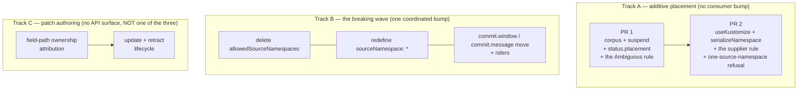

# Build order: three PRs, and what actually blocks what

> **design**: a sequencing summary, not a plan of record. Nothing here binds until scheduled.
> Date: 2026-08-31. Index: [`../INDEX.md`](../INDEX.md)
>
> **This page holds only the order.** Every item below is specified somewhere else, and the
> specification is the authority on *what* is built — this page is the authority on *when*, and on
> which releases the items have to share. If a detail appears both here and in a linked document,
> the linked document wins and the copy here is the bug.

Five changes are in flight at once and they are spread across five documents, none of which can see
the other four. This page is the missing top: what ships together, what can ship alone, and the two
couplings that are real.

## What is in flight

**The whole API surface in flight is three pull requests.** Track A is two of them and track B is
the third; track C is real work that is deliberately not one of the three, for the reason below. The
tracks are the *independence* argument — why the order is free — and the PR cut is the plan.

## The plan, as three PRs

| PR | Contains | Breaking | Done when |
|---|---|---|---|
| **1 — see it before it writes** | the corpus wired up, `spec.suspend` + the reconcile-request annotation, `status.placement` + `LayoutResolved`, and the post-scan pass's **`Ambiguous` rule** | no | a suspended target reports what it resolved, and every corpus scenario either passes or is skipped naming PR 2 |
| **2 — the two booleans** | `spec.serializeNamespace`, `placement.useKustomize`, the post-scan pass's **supplier rule**, the one-source-namespace refusal, creating a `kustomization.yaml` | no | the last skip is gone |
| **3 — the breaking wave** | delete `allowedSourceNamespaces`, redefine `sourceNamespace: "*"`, the `commit.window` / `commit.message` moves and their riders | **yes**, one bump | the wave's own migration note is satisfied |

PRs 1 and 2 are specified in
[`../layout/model.md` § How it gets built](../layout/model.md#how-it-gets-built); PR 3 in
[`source-scope-simplification.md` § Migration](source-scope-simplification.md#migration), sequenced
with its co-members in [`gittarget-api-wave.md`](gittarget-api-wave.md); track C in
[`support-boundary/patch-authoring.md` § Delivery sequence](support-boundary/patch-authoring.md#delivery-sequence).
Those pages are the authority on *what*; this one only on *when*.

**PR 1 is one feature with four parts, not four features.** `suspend` with no status shows you
nothing; `status.placement` with no `suspend` arrives after the first write, which is too late to act
on; and the corpus is what proves either of them behaves as written. Their real common property is
what makes them one review: **nothing in PR 1 changes what the operator writes.** That is the
reviewability the old four-way split was buying, and merging them keeps it at PR granularity rather
than spending three PRs to get it.

**The post-scan pass splits by rule, and that is a new seam this cut introduces.** Its two rules do
not have the same inputs: *a folder covering two render roots is `Ambiguous`* reads only the scan and
ships in PR 1, while *`serializeNamespace: false` needs a supplier* reads a field that does not exist
until PR 2. So the pass is not "done" in PR 1 — it exists, with one rule in it. Worth stating,
because the old plan had the pass landing whole.

**Order between them is free, and the numbering is a recommendation.** PR 3 does not block PR 1 or 2
and neither blocks it — see [the couplings that do not
exist](#three-couplings-people-expect-and-that-do-not-exist). It is last because it is the only one
that costs consumers a coordinated bump, and the additive value is worth having before that is spent.
PR 1 before PR 2 is not free: PR 2's review is the one the corpus exists to make possible.

**What the merge costs, given that every PR here is squashed.** A squash merge collapses a PR into
one commit on `main`, so the internal commits exist for the *review* and nowhere afterwards. Ordering
work inside a PR still shapes what a reviewer reads commit by commit — keep **creating a
`kustomization.yaml` as the last commit of PR 2, on its own**, since it is the one thing that writes
a file nobody asked for by name, and keep **the write-plan precondition ahead of the admission
check**, because the precondition is the correctness layer and admission is only feedback. But be
honest about what that does not buy:

- **Bisect and revert granularity is the PR.** Merging the old PRs 1–3 means a regression in
  `suspend`, in `status.placement`, or in the corpus is one commit on `main`, and reverting any of
  them reverts all three. The mitigation is that PR 1 changes no write behavior and nothing depends
  on it yet, so a revert is cheap — not that the granularity survives.
- **The changelog entry is the PR title.** release-please reads the squashed commit, so PR 1's title
  has to cover four things honestly rather than name the most interesting one.
- **One property is untouched by the merge:** scenarios for unbuilt behavior are written in PR 1 and
  skipped, naming PR 2 in the skip message, so PR 2 is still finished when the last skip is gone.
  That is enforced by the test suite rather than by history, which is why squashing cannot erode it.

**Track C is not one of the three, on purpose.** It is one and a half to two weeks of engineering
that blocks nothing; folding it into any of the three would make that PR unreviewable and would tie a
field rename to a fortnight of patch machinery. Schedule it whenever
there is appetite. If it truly must be inside a count of three, the only honest way is to merge PRs 2
and 3 — both change the `GitTarget`/`WatchRule` API — and that is worth refusing: it makes the
additive placement work breaking by association, which is exactly what the layout reversal was
engineered to avoid.

## The two couplings that are real

Everything else is independent. These two are not, and both live inside a single track:

- **Track B is one wave, not two items.** `sourceNamespace: "*"` is *defined* in terms of
  `allowedSourceNamespaces`, so deleting the field without deciding `*` leaves a value with no
  meaning. They ship in the same release or neither does. The
  [definition of record](source-scope-simplification.md#sourcenamespace--needs-its-own-decision)
  carries both readings.
- **Inside track A, `useKustomize` depends on the one-source-namespace rule.** A created
  `kustomization.yaml` carries `namespace:` only when the folder is single-namespace, and the rule
  is what guarantees that for an explicit `serializeNamespace: false`. Both are in PR 2; build the
  rule first.

## Three couplings people expect and that do not exist

Worth stating, because each one has been assumed at least once:

- **The one-source-namespace rule does not depend on `allowedSourceNamespaces`.** It computes
  `{the target's own namespace} ∪ {the explicit rules[].sourceNamespace names of the WatchRules
  pointing at it}` by reading `WatchRule` objects, not the policy field track B deletes. And a `*`
  item is refused under *both* readings of `*`, since neither is provably one namespace from the
  spec alone. So PR 2 needs no rewrite after the wave, and does not have to wait for it.
- **Track A is not part of the breaking wave.** The layout model reversed: the path template stayed
  and gained two optional fields, so nothing in track A changes an existing field's meaning. A Tier
  2 entry belongs to the wave only if it changes a `GitTarget` field in a breaking way.
- **Track C touches no API.** No CRD field, no migration, no persisted state; backing it out returns
  to today's refusal, and patch files already committed stay valid kustomize. Its only real cost is
  a durable one and it is not technical — it moves the boundary from *we invert what kustomize
  declares* to *we author patches*.

## What is left in each track

**Track A.** All of it is unbuilt. PR 2's two halves are smaller than they look: registration into an
existing root shipped in [#319](https://github.com/ConfigButler/gitops-reverser/pull/319), and
inference is what `namespaceIsInheritedFromContext` already does. What is genuinely new is writing a
`kustomization.yaml` that does not exist — build that last and on its own, since it is the only
thing that writes a file nobody asked for by name.

**Track B.** Unbuilt, and it is mostly a deletion: 4,569 lines in files that exist for nothing else.
The one thing to *build* is the `SelfSubjectAccessReview` pass, which is additive — so it is
explicitly **not** in PR 3, and follows whenever, rather than widening the one PR that costs a bump.

**Track C.** Steps 2 and 3 of its delivery sequence already shipped for another reason — the
`$patch: delete` work built the patch-file author, and the render oracle built the verification. What
remains is step 1 (ownership of a field path) plus the update/retract lifecycle the original sequence
omitted. Ballpark: a spike over env vars is a couple of days; a slice worth shipping is one and a
half to two weeks.

## The corpus is the test, and it is not wired up yet

The corpus is the one item every other item benefits from, and it is why PR 1 leads rather than
merely happening to be first. The eighteen fixture folders under
[`../layout/shapes/`](../layout/shapes/README.md) and
[`../layout/specific-examples/`](../layout/specific-examples/README.md)
are read today by **nothing but a human**: no Go file references either directory. Wiring them up
converts every later review from *"does this prose hold together"* into *"does the diff match the
patch"*.

**The seam already exists, at both levels, and neither needs inventing:**

| What | Where | Does |
|---|---|---|
| Golden-directory runner | [`contextual_namespace_corpus_test.go`](../../internal/manifestanalyzer/contextual_namespace_corpus_test.go) | walks `testdata/` folders, asserts a per-document outcome — the exact shape the corpus needs |
| Write-path driver | `newWorktreeForTest` + `flushEventsToWorktree` ([`inplace_edit_test.go`](../../internal/git/inplace_edit_test.go)) | seeds a worktree, folds events through the real plan-then-flush path |
| Precedent for a refusal fixture | [`namespace_context_refusal_test.go`](../../internal/git/namespace_context_refusal_test.go) | pins the two folder shapes where the store's view and kustomize's disagree |

So PR 1 is assembly, not construction: seed a worktree from `repository/`, build the event from
`input/`, derive the policy from `config/gittarget.yaml`, flush, and compare a normalized diff with
`expected-*.patch`. A `-update` flag that rewrites the patches keeps the corpus cheap to extend.

**Three rules for the corpus, each of which has already been learned the hard way here:**

- **Scenarios for unbuilt behavior are written now and skipped**, with the PR that unskips them named
  in the skip message. PR 2 is finished when the last skip is gone.
- **`config/gittarget.yaml` parses into a harness-local struct** until PR 2 deletes that mapping —
  which is itself a check that the API the examples describe is the API that got built.
- **Refusals are fixtures too.** Every scenario that only ever succeeds is advertising rather than
  specification. The set needs at least: `serializeNamespace: false` with no supplier, a second
  source namespace against an explicit `false`, a folder covering two render roots, and a
  base-owned field edit — each asserting an `expected-status.yaml` rather than a patch. Only the
  two-roots one asserts a rule PR 1 ships; the rest are written in PR 1 and skipped until PR 2.

### The behavior reference this leaves missing

A passing corpus tells a maintainer what happens. It does not tell a **user** what happens, and
there is no page that does: the behavior is currently spread across
[`support-contract.md`](support-boundary/support-contract.md) (what we will and will not touch),
[`status-conditions-guide.md`](../spec/status-conditions-guide.md) (condition shapes), and
[`configuration.md`](../configuration.md) (fields). None of them answers "I changed X in the
cluster — what lands in Git, and what do I see if it refuses?"

That page should be **generated from the corpus rather than written beside it**, so it cannot drift:
one row per scenario, naming the situation, the Git outcome, and the condition a user would read.
Not scheduled, and deliberately not started before PR 1 — it has no source to generate from until
the fixtures execute.

## What this page deliberately does not do

It does not rank the tracks. [`open-asks-priority.md`](open-asks-priority.md) is the priority
argument and still holds its Tier 0–3 ordering for everything *inside* a track; what it could not
carry is the cross-track picture, because it predates the layout reversal. Read that page for what
matters most, and this one for what can move without waiting.
