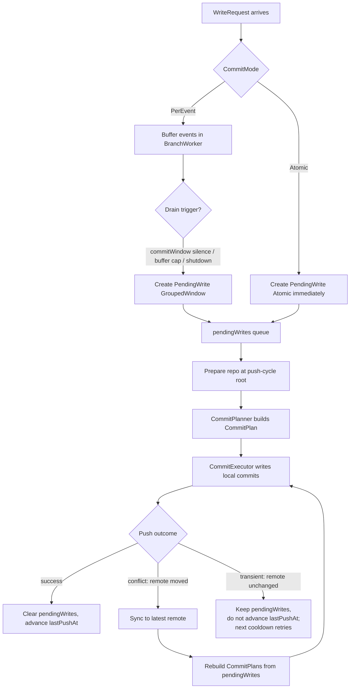

# Commit Window Refactor

> Status: implemented through phase 3
> Date: 2026-04-30
> Related:
> - [commit-window-batching-design.md](./commit-window-batching-design.md)
> - [commit-planning-refactor-analysis.md](./commit-planning-refactor-analysis.md)

## Implementation Status

### Landed slices: Phase 1, Phase 2, and Phase 3

As of 2026-04-30, the required implementation slices from this document
through Phase 3 have landed.

Implemented:

- internal `PendingWrite`, `PendingWriteKind`, `CommitPlan`, and `CommitUnit`
  types
- a shared planner/executor path for grouped-window and atomic writes
- `BranchWorker` retention of `pendingWrites` instead of raw
  `unpushedEvents`
- replay from retained pending writes instead of replay from raw events
- atomic writes routed through the same retained-work lifecycle as grouped
  writes
- atomic requests use the normal cooldown-driven push path after enqueue
  instead of forcing an immediate push
- reconcile-facing queue names now describe `WriteRequest` directly
  (`WriteRequestEmitter`, `EmitWriteRequest`) instead of the removed batch
  alias vocabulary
- `commit_plan.go` has been split into the required
  `commit_planner.go` and `commit_executor.go` files so the code layout
  matches the design boundaries
- the old `git.go` request-writing compatibility path has been removed and
  the remaining direct write entry points now execute through the shared
  commit-unit flow
- transitional worker helpers that exposed the old fused shape
  (`commitAndPushAtomic`, `commitAndPushRequest`,
  `newPendingWriteFromRequest`) have been removed
- conflict vs transient push handling in the unified push path
- the atomic bug where failed pushes advanced `lastPushAt` and lost work

Remaining follow-up:

- optional final naming cleanup on grouped-planner internals if a clearer
  general `CommitUnitBuilder` shape emerges later
- background/history docs may still mention removed internals intentionally;
  this document is the source of truth for the active refactor state

## Summary

The current commit-window implementation works, but its responsibilities are
spread across too many layers. The main issue is not the grouped-commit idea
itself. The main issue is that commit planning, local commit execution, and
push/replay ownership are split across different code paths, and that the
durability unit retained until push succeeds is `[]Event` — too low-level to
carry the planning context that makes replay safe.

This refactor makes the boundaries explicit:

- `WriteRequest` is the only external input contract.
- `BranchWorker` owns buffering, cooldowns, and retry scheduling.
- `PendingWrite` is the unit retained until push succeeds, and it carries
  already-resolved target/path/encryption metadata so replay is independent of
  GitTarget mutations that may happen between commit-time and push-time.
- `CommitPlanner` turns retained work into commit units.
- `CommitExecutor` applies commit units and creates local commits.
- A write is only complete after a successful push to origin.

This refactor also removes alias-based interfaces. They currently hide the real
model instead of clarifying it.

## Current State

Today there are effectively two orchestration paths for branch writes.

### 1. Grouped/windowed path

This path lives primarily in `BranchWorker`:

- events are buffered in the commit window
- buffered events are passed to `commitGroups`
- local commits are created without pushing
- raw events are retained in `unpushedEvents`
- `pushPendingCommits` later pushes them
- on push failure, the same code path is used regardless of cause: fetch +
  reset + rebuild from retained raw events + retry

This path is closest to the intended design rule: local work is not considered
finished until the push succeeds.

It also does meaningful work twice:

- **Grouping happens twice on the same buffer.** `applyGroupedCommits` calls
  `groupCommits` and then for each group dispatches a sub-`WriteRequest` with
  `CommitMode = CommitModeGrouped` to `generateGroupedCommits`, which calls
  `groupCommits` again on what is already a single-group input. It works (a
  single group re-groups to itself) but it's wasted work and obscures the
  shape.
- **Encryption is resolved twice.** `preparePerEventWriteRequest` calls
  `resolveEventEncryption` for every event (one Get GitTarget per event) only
  to set `BootstrapOptions`. Then `applyGroupedCommits` calls
  `resolveGroupEncryption` per group (Get GitTarget again) to actually
  configure the writer.

Both collapse naturally when planning becomes a single explicit pass.

### 2. Atomic fused path

Atomic reconcile-style writes currently bypass that retained-work lifecycle:

- the event loop drains buffered work first
- `commitAndPushAtomic` performs preparation, commit, and push as one path
- failure handling is local to that path instead of using the same retained
  pending-work model as grouped writes
- it has its own retry-with-fetch-and-reset loop in
  `WriteRequestWithContentWriter` (`tryResolve` + `tryWriteRequestAttempt`),
  which is a second, parallel implementation of the
  fetch+reset+rebuild+retry loop that grouped writes implement as
  `PushPendingWithReplay`

This makes the implementation harder to reason about because atomic and grouped
writes are not just two commit shapes. They are two different orchestration
models, with two parallel implementations of the same conflict-recovery idea.

### Alias-based input naming

`ReconcileBatch` is currently only an alias for `WriteRequest`.

That means it does not represent a real interface boundary. It is just an
extra name around the same structure. The result is more vocabulary without
more clarity.

## Problems

### Split ownership

The current grouped flow crosses too many boundaries:

- `BranchWorker` prepares and schedules grouped work
- `branch_worker.go` re-resolves target-specific behavior during grouped replay
- `git.go` still owns commit-mode execution details
- grouped logic is therefore expressed partly as planning and partly as
  execution

The result is that the same behavior is rebuilt in multiple places.

### Durability boundary is unclear

The design rule is strong:

> a write is only done after a successful push to origin

The current grouped path mostly reflects this. The atomic path does not reflect
it with the same explicit lifecycle.

That makes it hard to answer a simple question consistently:

> what exact unit remains pending when push has not succeeded yet?

Right now the answer is different depending on the path.

### Retained state is too low-level — and replay re-resolves the world

The grouped path retains `[]Event` as `unpushedEvents`.

That is sufficient to replay the final tree state under perfect conditions,
but it has a real correctness consequence: replay re-runs
`prepareWriteRequest`, which re-fetches each GitTarget at replay time. If a
GitTarget was deleted, renamed, or had its encryption secret rotated between
commit-time and replay-time, the replay either fails outright or — worse —
silently encrypts under whatever the *new* recipients are.

Resolving target/path/encryption *once* into a `PendingWrite` and using those
resolved values on replay closes that race. **This is the strongest correctness
argument for the refactor**, not just an internal cleanup.

Retaining only raw events also forces replay to be expressed as "rebuild
everything from scratch from one flat list", even though the worker already
knew more structure than that the first time around.

### Aliases hide the model

`ReconcileBatch` should not survive this refactor.

It suggests a separate concept, but there is no separate behavior or contract.
That makes the interface surface look larger than it really is.

## Concrete Current Bug

A small, real bug shows exactly why the orchestration boundary needs to change.

### Bug

`commitAndPushAtomic` returns no error
([branch_worker.go:938](../../internal/git/branch_worker.go#L938)) and the
event-loop site that calls it sets `lastPushAt = time.Now()` unconditionally
right after
([branch_worker.go:541-542](../../internal/git/branch_worker.go#L541-L542)).

So when an atomic push fails:

- the work *is* lost (no `pendingWrites` retention exists for atomic)
- the cooldown advances anyway, as if the push had succeeded
- nothing replays

This is not a possible bug — it is the current shape. It exists because the
atomic path doesn't share the retained-pending-work lifecycle that the grouped
path uses. Phase 1 of this refactor fixes it as a direct consequence of
unifying the two paths through `PendingWrite`.

## Proposed State

The refactor should separate the system into four clear layers.

### 1. Input contract: `WriteRequest`

`WriteRequest` remains the only external input contract for git writes.

It should be the only thing callers enqueue. Remove `ReconcileBatch` entirely.

Caller-facing commit modes stay minimal:

- `CommitModePerEvent`
- `CommitModeAtomic`

Grouped commit behavior should no longer be a caller-facing mode. It is an
internal planning concern of the branch worker. `CommitModeGrouped` becomes a
planner-internal value or disappears entirely (the planner can dispatch on
input shape, not on a mode tag).

### 2. Retained durability contract: `PendingWrite`

Introduce an internal `PendingWrite` type.

A `PendingWrite` is the exact unit retained until a push succeeds. This is the
most important boundary in the refactor.

It should be explicit about what kind of pending work it represents:

- `PendingWriteGroupedWindow`
- `PendingWriteAtomic`

The branch worker should retain `[]PendingWrite`, not `[]Event`.

#### Resolved planning metadata

A `PendingWrite` does **not** just carry events. It carries *resolved*
planning metadata that was true when the work entered the pending lifecycle:

- destination path
- GitTarget identity (name + namespace, for diagnostics and metrics)
- resolved bootstrap options
- resolved encryption config (recipients, mode)

Replay uses this metadata directly. Replay does **not** re-fetch the GitTarget
or re-resolve encryption. This makes replay race-free against GitTarget edits
and Secret rotations that happen between commit-time and push-time.

That has a corollary: if a user changes a GitTarget's encryption recipients,
the change takes effect on the *next* burst, not retroactively on
already-pending work. That is the right semantics — already-pending work was
authored under the old configuration and should land under the old
configuration. Retro-applying new encryption to in-flight work would either
fail (recipients no longer have access) or silently re-encrypt under
recipients the human didn't intend at the time the change was authored.

### 3. Planning contract: `CommitPlanner`

Introduce an internal `CommitPlanner`.

The planner owns:

- grouping rules
- target resolution (one Get per unique GitTarget per planning pass —
  replacing the per-event + per-group double resolution today)
- path resolution
- bootstrap resolution
- encryption resolution
- commit-unit message and authorship shape

The planner produces a `CommitPlan`, which contains one or more `CommitUnit`s.

This is where grouped behavior lives. The planner decides commit boundaries.
The executor does not.

### 4. Execution contract: `CommitExecutor`

Introduce an internal `CommitExecutor`.

The executor owns:

- applying commit units to the worktree
- no-op detection
- commit message rendering (single-event grouped units still render through
  the per-event template — that is a property of the message kind, not a
  separate code path)
- author/committer metadata
- creating local git commits

The executor should not decide boundaries. It should only execute a plan.

#### Executor-side encryption application

The planner *resolves* encryption per `CommitUnit`. The executor *applies* it.
Concretely the `CommitUnit` carries the resolved encryption config and the
executor reconfigures the content writer once per unit before staging that
unit's events. There is no shared mutable encryption state across units, and
no per-unit Get GitTarget at execute time.

## Push Failure Taxonomy

A push fails for one of two distinct reasons, and the new model treats them
differently. This is a key area where today's implementation collapses two
cases into one.

### Conflict (remote moved)

The remote tip is not the `rootHash` we pushed against — somebody else
committed to this branch. Our local commit objects parent on a stale tip and
must be discarded.

Action:
1. Sync to the new remote tip (fetch + hard reset).
2. Rebuild commits from `pendingWrites` (using their resolved metadata) on
   top of the new tip. The planner runs again over the retained
   `PendingWrite`s in arrival order.
3. Retry push. Up to `maxRetries` attempts in one `pushPending` call.
4. Do **not** advance `lastPushAt` until a retry succeeds.

### Transient (network, auth, 5xx, etc.)

The remote has *not* moved. The push failed because of something between us
and the server: a connection drop, a timeout, an auth refresh, a 502 from
the Git host. Our local commit objects are still valid and still parent on
the right tip.

Action:
1. Leave `pendingWrites` and the local commit objects in place.
2. Do **not** rebuild.
3. Do **not** advance `lastPushAt`.
4. The next cooldown-driven retry will push the same commit series.

### How we tell them apart

After any push failure, fetch the remote tip:

- If the remote tip equals the recorded `rootHash` → transient. Stop, wait
  for the next retry trigger.
- If the remote tip differs → conflict. Reset, rebuild, retry inside the
  same call.
- If the fetch itself fails → treat as transient (same logic: leave state,
  next retry).

### Today vs. the refactor

Today's `PushPendingWithReplay` does not distinguish these cases. Every push
failure goes through fetch + reset + rebuild, which is correct but does
redundant work in the transient case. Worse, when the network glitch that
caused the push failure also fails the post-failure fetch, the whole
`pushPendingCommits` call returns an error and the next retry restarts the
loop from scratch.

The refactor's distinction is a small correctness and efficiency
improvement, not a behavioral change in the user-visible final outcome
(both produce a successful push, eventually).

## Replay Semantics

Replay should stay simple and consistent with the current design goal.

On conflict (per the taxonomy above):

1. sync to the latest remote tip
2. rebuild commit plans from retained `PendingWrite`s in original arrival order
3. re-apply those plans to the fresh worktree
4. push again

Important consequences:

- replay correctness is defined by final tree correctness plus successful push
- replay does not need to preserve pre-push local commit count
- replay may drop commits that become no-ops because the remote already contains
  the desired final file state — this is already what `applyEventToWorktree`
  does today (it short-circuits when file content already matches)
- this is acceptable because the failed local commits were never published

This keeps the "done only after successful push" rule strong while avoiding
artificial effort to preserve unpublished history.

## Proposed Flow

## Design decisions to make explicit

These are not bugs, but they are choices currently made by accident. The
refactor is the right time to make them deliberate.

### Atomic interleaving with pending grouped work

Today an atomic request drains the buffer and pushes pending grouped work
*bypassing the cooldown* before doing the atomic commit
([branch_worker.go:537-544](../../internal/git/branch_worker.go#L537-L544)).
Under the new model, an atomic request appears as a `PendingWriteAtomic`
appended to the queue. Two options:

1. **Arrival order governs naturally.** The next cooldown-driven push covers
   everything in `pendingWrites`. Simpler model, but adds latency to the
   atomic write under an active cooldown.
2. **Atomic forces an immediate push.** Preserve today's bypass behavior:
   on atomic enqueue, push everything pending immediately, ignoring the
   cooldown. Reconcile snapshots land fast, matches existing semantics.

Pick option 1. It keeps atomic writes inside the same local-commit then
cooldown-driven push lifecycle as every other retained write, which makes the
model simpler and avoids a second special-case scheduling rule.

### `commitWindow=0` granularity

The current claim is that `commitWindow=0` produces honest per-event
commits. In practice the queue path always wraps a single event per
request, so it works — but the loop appends *all* events of a request to
the buffer, then commits, and `commitGroups` collapses same-author events.
A hypothetical multi-event PerEvent request with `commitWindow=0` would
collapse to one grouped commit, contradicting the docs.

Pick one rule and document it:

1. **PerEvent requests must contain exactly one event.** Enforce in
   `EnqueueRequest`. Today's code happens to comply.
2. **`commitWindow=0` commits per event arrival, not per request drain.**
   Slightly more code; matches the documented promise even under
   multi-event requests.

Recommend (1) — it's already true today, and `commitWindow=0` is an opt-in
for advanced users who can also be told "one event per request".

## File Refactor Plan

### `internal/git/types.go`

Make the type surface explicit and smaller.

- remove `ReconcileBatch`
- remove `CommitModeGrouped` from the caller-facing surface
- add `PendingWrite`
- add `PendingWriteKind`
- add `CommitPlan`
- add `CommitUnit`

### `internal/git/commit_planner.go`

Create a dedicated planning layer.

- split the current planning responsibilities out of `commit_plan.go`
- move grouping rules here (consume `commit_groups.go` or keep it as the
  internal builder this file dispatches to)
- move grouped commit planning here
- make target/bootstrap/encryption resolution part of planning, not partly
  planning and partly execution

### `internal/git/commit_executor.go`

Create one shared execution layer.

- split the current execution responsibilities out of `commit_plan.go`
- execute `CommitUnit`s
- apply files to the worktree
- skip no-op units
- render commit messages (per-event fallback for single-event grouped units
  is an executor responsibility, not a planner one)
- write commits

This replaces the duplicated multi-event execution skeletons currently split
between atomic and grouped paths.

### `internal/git/branch_worker.go`

Simplify the worker to orchestration only.

- keep buffer management
- keep commit-window timing
- keep push cooldown timing
- replace `unpushedEvents` with retained `pendingWrites`
- make atomic writes enter the same retained/replay lifecycle as grouped writes
- clear retained pending writes only after a successful push
- only advance `lastPushAt` after a successful push (fixes the current
  cooldown-on-failure bug for atomic)

### `internal/git/git.go`

Reduce `git.go` to low-level repository operations:

- prepare/sync repository
- push (single-attempt; no replay closure)
- reset/switch branches

The replay loop lives in the branch worker / executor, not in git.go.
`PushAtomic` keeps its single-session, atomic-CAS-on-`rootHash` semantics; it
is the building block, not the loop.

### Dead code to delete

The following are unused outside of tests once the refactor lands. Delete
them — half-done refactors are how dead surface accumulates:

- `WriteEvents` ([git.go:183](../../internal/git/git.go#L183))
- `WriteEventsWithContentWriter` ([git.go:194](../../internal/git/git.go#L194))
- `WriteRequestWithContentWriter` ([git.go:209](../../internal/git/git.go#L209))
- `WriteBatchWithContentWriter` ([git.go:848](../../internal/git/git.go#L848))
- `CommitWriteRequestNoPush` ([git.go:291](../../internal/git/git.go#L291))
- `generateCommitsFromRequest`, `generatePerEventCommits`,
  `generateAtomicCommit`, `generateGroupedCommits`
  ([git.go:867-1082](../../internal/git/git.go))
- `PushPendingWithReplay` ([git.go:344](../../internal/git/git.go#L344))
  — its replay-loop responsibility moves into the branch worker; the inner
  push call is `PushAtomic` directly
- `tryResolve` / `tryWriteRequestAttempt` retry loop in `git.go` (replaced
  by the executor + push-failure taxonomy described above)
- `commitAndPushAtomic` (folded into the unified pendingWrites flow)
- `commitAndPushRequest` test alias
  ([branch_worker.go:1004-1006](../../internal/git/branch_worker.go#L1004-L1006))

`WriteEventsResult` and friends survive only if a public API still needs
them; otherwise they go too.

## Telemetry

The current telemetry (commit drains, push triggers, replay attempts, push
conflict counters — see
[commit-window-batching-design.md → Observability](./commit-window-batching-design.md))
is framed around the current state machine. Most of it survives the refactor
unchanged in name and meaning:

- `branchworker_commit_drain_total{trigger=...}` → re-pointed at "moment a
  `PendingWrite` is created from the buffer". `trigger` labels stay the
  same (`window`, `maxbytes`, `window_zero`, `shutdown`).
- `branchworker_push_total{trigger=...}` → unchanged.
- `branchworker_commits_per_push` → unchanged.
- `branchworker_push_conflict_total` → emitted only on the conflict branch
  of the push-failure taxonomy.
- `branchworker_push_transient_total` → new counter, emitted on the
  transient branch. Useful for distinguishing remote-moved from network
  flakiness in dashboards.
- `branchworker_replay_attempts` → unchanged; only conflicts trigger
  replay.

Migration is "rename the emit site to the new boundary" — not a user-facing
telemetry change.

## Test Plan

Add or update tests around the new boundaries.

### Planner tests

- `TestPlanner_GroupedWindow_GroupsByAuthorTargetAndCollisionRule`
- `TestPlanner_AtomicRequest_ProducesSingleAtomicPlan`
- `TestPlanner_GroupedWindow_PreservesArrivalOrderAcrossPendingWrites`
- `TestPlanner_ResolvesEncryptionOncePerUniqueTarget` — proves the
  per-event/per-group double resolution today is gone.

### Executor tests

- `TestExecutor_GroupedSingleEvent_UsesPerEventMessageFallback`
- `TestExecutor_GroupedMultiEvent_UsesGroupTemplate`
- `TestExecutor_AtomicUnit_UsesBatchMessage`
- `TestExecutor_NoOpUnit_SkipsCommit`
- `TestExecutor_AppliesEncryptionFromCommitUnit_NotFromWorker` — proves the
  executor does not read mutable worker state to find encryption config.

### Branch worker tests

- `TestBranchWorker_PushSuccess_ClearsPendingWritesOnlyAfterPush`
- `TestBranchWorker_AtomicPushFailure_DoesNotAdvanceCooldownOrLosePendingWrite`
  — the bug from "Concrete Current Bug".
- `TestBranchWorker_Replay_RebuildsPendingWritesInOriginalOrder`
- `TestBranchWorker_Replay_DropsUnitsThatBecomeNoOpAgainstNewRemoteTree`
- `TestBranchWorker_CommitWindowZero_CreatesPendingWriteImmediatelyButDefersPushByCooldown`
- `TestBranchWorker_TransientPushFailure_RetriesSameLocalCommits` — proves
  the transient path does not rebuild and does not advance `lastPushAt`.
- `TestBranchWorker_ConflictPushFailure_RebuildsAgainstNewRemoteTip` — the
  inverse of the above.
- `TestBranchWorker_PushFollowedByFetchFailure_TreatsAsTransient` — proves
  fetch failure post-push-failure does not collapse into infinite retry.
- `TestBranchWorker_Replay_UsesResolvedMetadata_GitTargetDeletedMidBurst`
  — the headline correctness test for resolved metadata: a GitTarget is
  deleted between commit-time and replay-time, the pending writes still
  push successfully under the originally-resolved encryption config.
- `TestBranchWorker_AtomicAndGroupedInterleaved_PreservesArrivalOrder` —
  if both kinds of pending write coexist, push order matches arrival order.

### Existing test updates

Update current grouped replay tests so they assert against `pendingWrites`
behavior instead of `unpushedEvents`.

Keep e2e changes minimal unless the refactor changes externally visible
behavior. Most coverage should come from unit and split-worker tests.

## Phased Plan

### Phase 1: shape change with bug fix

1. Introduce `CommitPlan` / `CommitUnit` / `PendingWrite`.
2. Make grouped mode build a plan, then execute it.
3. Make atomic mode build a one-unit plan, route it through the same
   `pendingWrites` lifecycle, and execute it.
4. Add the push-failure taxonomy (transient vs conflict).
5. Fix the `lastPushAt`-on-failure bug as a direct consequence of (3) +
   (4) — it's a behavior change, but a bug fix, and the tests in this
   phase prove the new behavior.

This is not strictly "no semantic changes" — the
atomic-failure-loses-work bug was wrong before and is fixed here. The
semantic *contract* is preserved (pushed commits are durable, unpushed
work is retried); only the broken atomic implementation aligns with it.

### Phase 2: queue API cleanup

Status: implemented on 2026-04-30.

1. Remove remaining batch-shaped naming from the reconcile path now that
   `ReconcileBatch` and `EnqueueBatch` are gone.
2. Rename reconcile-facing interfaces and methods so they describe
   `WriteRequest` directly rather than "batch" semantics.
3. Update architecture/docs references that still describe the removed alias
   and wrapper surface.

### Phase 3: required structural cleanup

Status: implemented on 2026-04-30.

1. Split `commit_plan.go` into `commit_planner.go` and
   `commit_executor.go`. This is not optional; the code layout should match
   the design boundaries in this document.
2. Delete the old `git.go` request-writing helpers and grouped/atomic
   compatibility surface that the new planner/executor flow has replaced.
3. Remove transitional worker test helpers once tests are updated to target
   the new boundaries directly.

### Phase 4: optional naming cleanup

1. Consider whether `commitGroup` should remain a grouped-planner helper
   or be replaced by a more general `CommitUnitBuilder`.

## Assumptions

- no CRD or user-facing API change is part of this refactor
- `commitWindow` remains the only user-facing commit-shaping control
- the existing design docs remain for background and history
- this document becomes the active refactor plan
- replay re-derives from retained `PendingWrite`s (resolved metadata + raw
  events) against the latest remote tree
- unpublished local commit count is not part of the correctness contract
