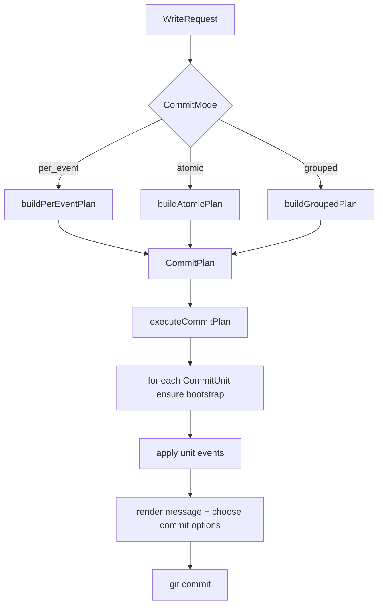

# Commit Planning Refactor Analysis

> Status: analysis / refactor proposal
> Date: 2026-04-30
> Related:
> - [commit-window-batching-design.md](./commit-window-batching-design.md)
> - [internal/git/git.go](../../internal/git/git.go)
> - [internal/git/commit_groups.go](../../internal/git/commit_groups.go)
> - [internal/git/types.go](../../internal/git/types.go)
> - [internal/git/branch_worker.go](../../internal/git/branch_worker.go)

## Question

Two overlap questions came up while reviewing the grouped-commit work:

1. Is there a real difference between `generateAtomicCommit` and
   `generateGroupedCommits` in
   [`internal/git/git.go`](../../internal/git/git.go)?
2. Is there a real difference between a `commitGroup` and a
   `ReconcileBatch` / `EnqueueBatch`?

The short answer is:

- **Yes, there is a real semantic difference in both cases.**
- **There is also obvious execution-path overlap that is worth
  refactoring.**

So the right move is probably **not** "merge the concepts", but
instead **separate planning from execution** and share the execution
machinery.

## Executive Summary

Today the codebase has two different kinds of overlap:

1. **Execution overlap**
   - Atomic and grouped commits both:
     - open the worktree
     - apply multiple events
     - skip no-op writes
     - render one commit message
     - create a git commit
   - This is real duplication and is a good refactor target.

2. **Abstraction overlap**
   - `ReconcileBatch` and `commitGroup` both describe "multiple events
     that may land in one commit".
   - But they live at different layers and carry different invariants.
   - This is only a partial overlap and should not be flattened
     blindly.

The likely end state is:

- keep `WriteRequest` as the queued input contract
- stop treating `ReconcileBatch` as a distinct concept in the git
  layer
- introduce an internal `CommitPlan` / `CommitUnit` abstraction
- make atomic, grouped, and per-event modes produce plan units
- run all commit modes through one shared executor

## Current Shape

### Input layer: queued work

The queued unit of work is
[`WriteRequest`](../../internal/git/types.go), with:

- `Events`
- `CommitMode`
- `GitTargetName` / `GitTargetNamespace`
- `BootstrapOptions`
- `CommitConfig`
- `Signer`

`ReconcileBatch` is currently just an alias:

```go
type ReconcileBatch = WriteRequest
```

That means `EnqueueBatch` is not introducing a different data model.
It is mainly a **semantic wrapper** meaning:

> "enqueue this request as one reconcile-owned atomic write"

In practice, `EnqueueBatch` just defaults `CommitMode` to
`CommitModeAtomic` and then forwards to `enqueueRequest`.

### Planning layer: derived commit boundaries

`commitGroup` is different. It is not queued by callers. It is
derived internally by `groupCommits(events)` during the grouped path.

It carries grouped-commit-specific invariants:

- single `Author`
- single `GitTarget`
- single `GitTargetNamespace`
- last-write-wins map by git path
- first-seen path order for deterministic rendering

This is not a generic write request. It is an **internal commit-plan
fragment**.

### Execution layer: writing commits

There are currently three commit-generation modes in
[`generateCommitsFromRequest`](../../internal/git/git.go):

- `CommitModePerEvent`
- `CommitModeAtomic`
- `CommitModeGrouped`

The interesting overlap is between:

- `generateAtomicCommit`
- `generateGroupedCommits`

Both are multi-event commit writers. The difference is that atomic
always emits at most one commit, while grouped emits zero to many
commits based on an internal grouping pass.

## `generateAtomicCommit` vs `generateGroupedCommits`

### What is truly the same

At a mechanical level, these functions are very similar.

They both:

1. obtain a worktree
2. apply a set of events to the worktree
3. track whether anything changed
4. render one commit message
5. choose commit metadata
6. call `worktree.Commit(...)`
7. return `(commitsCreated, lastHash, error)`

This is strong evidence that the execution path wants a shared helper.

### What is truly different

The differences are not cosmetic. They represent different commit
semantics.

| Dimension | Atomic | Grouped |
|---|---|---|
| commit count | at most 1 per request | 0..N per request |
| boundary source | caller-defined | derived by `groupCommits` |
| authorship | operator-authored | per-group author |
| message template | `BatchTemplate` | `GroupTemplate` or per-event fallback for single-event groups |
| target scope | one request-level target | one target per derived group |
| encryption/bootstrap assumption | configured once for the request | re-resolved per group in `BranchWorker.applyGroupedCommits` |
| dedup/collapse | no explicit grouping map | same-path same-author edits collapse to latest state |

### Why atomic is not just "grouped with one group"

It is tempting to say that atomic is merely a degenerate grouped
commit. That is only partially true.

If we say "one request becomes one `CommitUnit`", then yes, atomic
and grouped can share the same executor.

But atomic still differs in three important ways:

1. **Boundary ownership**
   - Atomic trusts the caller's batch boundary.
   - Grouped computes its own boundaries from the event stream.

2. **Authorship model**
   - Atomic is deliberately operator-authored because it represents a
     reconcile snapshot, not an end-user action.
   - Grouped is deliberately user-authored because it represents
     burst-collapsed audit events.

3. **Target/configuration model**
   - Atomic assumes a request-wide target and request-wide encryption
     context.
   - Grouped may need to split one flush across multiple targets and
     therefore cannot reuse the atomic request-scoped encryption model
     directly.

So atomic and grouped should probably share an **executor**, not a
single undifferentiated implementation with mode-specific `if`s
sprinkled everywhere.

## `commitGroup` vs `ReconcileBatch`

### Similarity

The similarity is real:

- both can contain multiple events
- both may eventually produce one git commit
- both represent a "batch-like" concept

This is why the overlap feels uncomfortable during review.

### Difference in meaning

The meanings are still materially different.

| Dimension | `ReconcileBatch` | `commitGroup` |
|---|---|---|
| layer | queue/input API | internal commit planning |
| origin | caller-created | derived by git writer |
| lifecycle | survives enqueue/dequeue | ephemeral inside grouped execution |
| cardinality | one queued work item | one planned commit unit |
| target semantics | request-scoped | guaranteed single-group target |
| author semantics | none required | exactly one author |
| event collapse | none implied | same-path last-write-wins |
| extra request metadata | commit mode, signer, config, bootstrap | none of that |

This is the main reason a direct merge would be misleading.

`ReconcileBatch` answers:

> "What should the worker process as one request?"

`commitGroup` answers:

> "What should this grouped write emit as one commit?"

Those are related questions, but they are not the same question.

### Important extra nuance: `ReconcileBatch` is already not really a type

Because `ReconcileBatch` is an alias to `WriteRequest`, the current
code already hints that it may be more naming than substance.

That suggests a better cleanup target:

- avoid growing `ReconcileBatch` as a separate concept
- keep it as a compatibility/readability alias or remove it later
- move semantic richness into an internal planning abstraction instead

## Where the real duplication is

The deepest duplication is not in batch naming. It is in the commit
execution skeleton.

Today we have:

- per-event mode: one event -> one commit
- atomic mode: one request -> one commit
- grouped mode: one request -> many derived commits

All three eventually do some version of:

1. determine commit boundaries
2. apply a unit's events to the worktree
3. skip if no-op
4. render a message
5. compute commit metadata
6. create the commit

That strongly suggests the pipeline wants this split:

- **planner**: decides commit units
- **executor**: applies units and writes commits

## Proposed Refactor Direction

### 1. Introduce `CommitPlan` and `CommitUnit`

Add an internal abstraction that captures "a sequence of commits to
write from this request".

Sketch:

```go
type CommitPlan struct {
    Units []CommitUnit
}

type CommitUnit struct {
    Events             []Event
    GitTargetName      string
    GitTargetNamespace string
    BootstrapOptions   pathBootstrapOptions

    MessageKind CommitMessageKind
    AuthorKind  CommitAuthorKind

    // Optional grouped metadata if the planner already computed it.
    Group *commitGroup
}
```

Possible enums:

```go
type CommitMessageKind string

const (
    CommitMessagePerEvent CommitMessageKind = "per_event"
    CommitMessageBatch    CommitMessageKind = "batch"
    CommitMessageGroup    CommitMessageKind = "group"
)

type CommitAuthorKind string

const (
    CommitAuthorEventUser CommitAuthorKind = "event_user"
    CommitAuthorGroupUser CommitAuthorKind = "group_user"
    CommitAuthorOperator  CommitAuthorKind = "operator"
)
```

The important point is not the exact fields. The important point is to
make the commit unit explicit.

### 2. Build plans per mode

Instead of separate top-level writers duplicating commit logic:

- `buildPerEventPlan(request)`
- `buildAtomicPlan(request)`
- `buildGroupedPlan(request)`

These planners answer only:

> "What commit units should exist?"

For grouped mode, `commitGroup` can either:

- remain the internal builder structure that produces `CommitUnit`s, or
- be replaced entirely by `CommitUnit` if the latter grows the needed
  grouping metadata.

The lower-risk option is:

- keep `commitGroup` private to grouped planning for now
- convert it to `CommitUnit` before execution

### 3. Add one shared executor

Then introduce a single executor:

```go
func executeCommitPlan(
    ctx context.Context,
    writer eventContentWriter,
    repo *git.Repository,
    request *WriteRequest,
    plan CommitPlan,
) (int, plumbing.Hash, error)
```

For each unit, the executor would:

1. ensure bootstrap for that unit's scope
2. apply all unit events
3. skip no-op units
4. render the message based on `MessageKind`
5. choose commit options based on `AuthorKind`
6. commit

This is where atomic and grouped genuinely overlap.

### 4. Keep request preparation outside the executor

Request preparation and encryption resolution should remain above the
executor.

That matters because:

- atomic preparation is request-scoped
- grouped preparation may become per-group/per-unit
- future modes may need different target-resolution rules

So the executor should not decide how a `WriteRequest` becomes
prepared. It should only execute already-planned commit units.

### 5. Treat grouped execution in `BranchWorker` as "plan fan-out", not as a special write mode forever

Today the grouped path has extra handling in
[`BranchWorker.applyGroupedCommits`](../../internal/git/branch_worker.go)
because grouped units may cross targets and therefore need per-group
encryption configuration.

That suggests a future shape where `BranchWorker` does:

1. prepare incoming request/events
2. build a commit plan
3. configure encryption per plan unit if needed
4. execute the plan

This is cleaner than making `git.go` know about request-wide atomic
assumptions and grouped per-target exceptions at the same time.

## Proposed Mermaid



## Why not directly merge `commitGroup` into `WriteRequest`

That would likely make the model worse.

Problems:

1. `WriteRequest` is a caller-facing envelope.
   - It needs signer/config/mode/request-scoped data.
   - It does not need grouped path maps or per-group author invariants.

2. `commitGroup` is a planner artifact.
   - It needs deduplicated path state and first-seen order.
   - It does not need to be queueable or externally meaningful.

3. Merging them would blur "input request" and "planned commit unit".
   - That usually makes refactors harder, not easier.

If anything, the correct architectural move is the opposite:

- make the distinction sharper
- reduce ad-hoc branching
- connect the two through an explicit planner/executor boundary

## What to do with `EnqueueBatch`

`EnqueueBatch` is a smaller design question.

Because `ReconcileBatch` is an alias to `WriteRequest`, the method does
not buy much mechanically. Its value is mostly readability at the call
site: reconciliation is intentionally asking for atomic semantics.

There are three reasonable options:

1. **Keep it**
   - pro: readable reconcile intent
   - con: preserves a pseudo-abstraction that is not really a type

2. **Deprecate it in favor of `EnqueueRequest` + explicit
   `CommitModeAtomic`**
   - pro: simpler API surface
   - con: call sites become a bit less intention-revealing

3. **Replace it with a constructor/helper**
   - example: `NewAtomicWriteRequest(events, targetName, targetNamespace)`
   - pro: keeps intent while reducing queue API variants
   - con: one more helper type/function to maintain

My bias is option 3 or option 2. I would not invest in making
`ReconcileBatch` a richer long-term git-layer abstraction.

## Recommended Refactor Plan

### Phase 1: no semantic changes

1. Introduce `CommitPlan` / `CommitUnit`.
2. Make grouped mode build a plan, then execute it.
3. Make atomic mode build a one-unit plan, then execute it.
4. Keep existing request preparation and encryption behavior intact.

This should reduce duplication without changing behavior.

### Phase 2: queue API cleanup

1. Decide whether `EnqueueBatch` still earns its keep.
2. Either:
   - deprecate it and use `EnqueueRequest`, or
   - keep it as a thin readability wrapper with explicit docs.

### Phase 3: optional deeper cleanup

1. Consider whether `commitGroup` should remain a grouped-planner
   helper or be replaced by a more general `CommitUnitBuilder`.
2. Consider renaming `ReconcileBatch` away if it keeps confusing
   readers into thinking it is a richer type than it is.

## Recommendation

Do **not** directly merge:

- `generateAtomicCommit` and `generateGroupedCommits` into one
  mode-heavy function
- `commitGroup` and `ReconcileBatch` into one shared struct

Do refactor toward:

- one **planner** per commit mode
- one shared **executor**
- less emphasis on `ReconcileBatch` as a distinct type

The core idea is:

> atomic and grouped are different ways to produce commit units, but
> they do not need different machinery to execute those units.

That keeps the semantic boundaries clear while removing the real
duplication.
