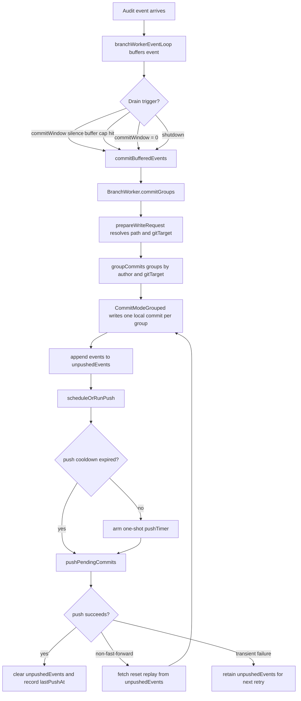

# Commit window batching: design

> Status: implemented (2026-04-30)
> Supersedes the sketch in [docs/future/idea-burst-commit-batching.md](../future/idea-burst-commit-batching.md)
>
> This design is implemented in the current codebase.
> The document now keeps the design rationale and records the landed
> implementation shape, rather than tracking rollout stages.

## Goal

Collapse events that arrive in a short rolling window into one
commit per `(author, gitTarget)`, with a summary message, instead of
producing one commit per resource change. Operations like `kubectl
apply -k`, `helm upgrade`, or an ArgoCD sync wave should read in the
Git history as one logical action, not as five to ten back-to-back
single-resource commits. (For the typical single-target apply this
is one commit; the `gitTarget` axis only matters when one operation
crosses targets — see
[Per-target boundary: encryption and bootstrap](#per-target-boundary-encryption-and-bootstrap).)

In the implemented design, the CRD's commit-shaping surface is
`commitWindow` only.
[`PushStrategy`](../../api/v1alpha1/shared_types.go) carries
`commitWindow` and nothing else — no `interval`, no `maxCommits`.
The byte cap that bounds buffered events is an operator startup
argument (`--branch-buffer-max-bytes`), not a CRD field. Reasoning
is in [Settings reduction](#settings-reduction).

## Implementation Snapshot

The current implementation follows this design closely and lives
primarily in:

- [`internal/git/branch_worker.go`](../../internal/git/branch_worker.go)
  for the two-stage event loop, buffering, commit drains, and push
  scheduling
- [`internal/git/commit_groups.go`](../../internal/git/commit_groups.go)
  for grouping and grouped-commit message data
- [`internal/git/git.go`](../../internal/git/git.go) for
  `CommitModeGrouped` and grouped commit creation
- [`internal/git/commit.go`](../../internal/git/commit.go) for
  grouped author attribution and message rendering
- [`api/v1alpha1/gitprovider_types.go`](../../api/v1alpha1/gitprovider_types.go)
  for `commit.message.groupTemplate`

Two implementation details are worth calling out explicitly:

- A grouped flush with exactly one event still renders the normal
  per-event commit message. Multi-event groups use
  `commit.message.groupTemplate`.
- Replay-on-conflict rebuilds commits from `unpushedEvents` using the
  same grouped path as the first attempt, so replay stays semantically
  aligned with the happy path.



## Non-goals

- No change to ordering guarantees on a branch. The
  [BranchWorker](../../internal/git/branch_worker.go) is still the single
  serial writer per `(GitProvider, Branch)`.
- No reordering of events across authors. Arrival order on the wire is the
  order in the Git history.

## API surface

One new field on
[`GitProviderSpec.Push`](../../api/v1alpha1/gitprovider_types.go):

```yaml
spec:
  push:
    commitWindow: "5s"    # rolling silence window for coalescing events
```

- **Type**: `*string`, parsed at runtime with `time.ParseDuration`.
  Negative values are treated as `0` and logged at warn level.
  OpenAPI schema validation is a string-shape check only — the
  `>= 0` constraint is enforced in code, not by the CRD.
- **Default**: `5s`. Enabled by default. Setting `commitWindow: "0s"`
  opts into per-event commits *in the steady-state, no-conflict
  path*; see
  [Caveat: replay can change commit boundaries](#caveat-replay-can-change-commit-boundaries)
  for what happens during conflict-replay.
- **Tuning guidance** lives in
  [docs/configuration.md](../configuration.md). `5s` covers `kubectl
  apply -k` and `helm upgrade`; `15s–30s` is more appropriate for
  chatty operators (ArgoCD sync waves with hooks).

The byte cap that bounds `buffer + unpushedEvents` is the operator
startup flag `--branch-buffer-max-bytes` (env var
`BRANCH_BUFFER_MAX_BYTES`), default `8Mi`. It is a memory ceiling
that protects the pod from runaway producers, which is a property of
the pod's resource limits — not of the user's `GitProvider`
configuration. Tying it to startup config rather than the CRD makes
the "this is operational, not user-facing" framing explicit.

`PushStrategy` lives on `GitProvider`, not on `GitTarget` or on some
per-group sub-object, intentionally. Commit shaping is a property of
the branch writer that owns the `(GitProvider, Branch)` remote ref:
the buffer, flush timing, conflict replay, and push cooldown all live
there. That also matches the user-facing mental model. The question is
"how should writes to this provider/branch be shaped in Git?", not
"how should this individual resource queue itself?".

### Caveat: replay can change commit boundaries

Setting `commitWindow: "0s"` produces per-event commits *in the
steady state*. If a push hits a non-fast-forward conflict and
[replay-on-conflict](#durability-and-replay-on-conflict) kicks in,
all events still in `unpushedEvents` are regrouped through
`groupCommits` from scratch. Same-author events that
arrived as fifteen separate per-event commits collapse into one
commit on replay (the GUI-toggle rule). So:

- **No conflict happened**: 15 events → 15 commits. As advertised.
- **Conflict happened mid-burst**: 15 events → fewer commits after
  replay, with the same final tree state.

The user-visible Git history stays self-consistent (the API is the
source of truth, the tree on the branch matches the API), but
commit *count* is not strictly preserved across conflict replays.
This is an accepted limitation. The local commits before replay
never reached anyone, and the project's
[architecture](../architecture.md) explicitly treats Git as a
derived artifact: re-derivation produces a *valid* artifact, not
necessarily the *exact same* one that almost-existed.

Preserving per-event commit count under conflict would require
either skipping regrouping during replay (replay each former commit
individually) or committing on every event without batching.
Neither is in scope; both have their own awkward interactions with
grouping.

Commit message rendering uses a separate path from the existing
[`commit.message.batchTemplate`](../../api/v1alpha1/gitprovider_types.go).
The grouped-commit path needs a wider data context than
[`BatchCommitMessageData`](../../internal/git/types.go) (`Count` and
a single `GitTarget`) and a different author identity than
[`commitOptionsForBatch`](../../internal/git/commit.go) (operator).
See
[Commit metadata: per-(author, target) authorship](#commit-metadata-per-author-target-authorship).

### Settings reduction

In the implemented design, the CRD has one commit-shaping knob
(`commitWindow`) and the operator startup has one
memory-shaping knob (`--branch-buffer-max-bytes`). There will be no
separate "push interval" or "max commits per buffer" knobs.
Reasoning:

- **No `push.interval`.** Push happens after every commit-stage drain.
  The 5s push cooldown described in [Algorithm](#algorithm) handles
  the only legitimate role a push interval would play (don't spam
  the remote). A separate user-configurable interval would either
  duplicate the cooldown or fight it.
- **No `maxCommits`.** A count-based cap on buffered events is a poor
  proxy for memory pressure (20 ConfigMaps vs. 20 Secrets are very
  different) and a poor granularity knob (operators wanting finer
  commits should shorten `commitWindow`, not cap an event count).
- **Byte cap at the operator level, not the CRD.** Memory ceilings
  are sized against the pod's resource limits, which is the
  operator's concern, not the user's per-`GitProvider` concern.
  Surfacing it on the CRD invites cargo-cult tuning of a number
  that should rarely need adjusting.

The deliberate consequence is that a never-quiet stream of changes
("one change per second for five minutes") produces **one commit per
author**, pushed when the burst finally ends, as long as the buffer
fits under `--branch-buffer-max-bytes`. That is the right answer for
the dominant real-world version of this scenario — a controller
doing a progressive rollout, a helm upgrade with hooks, an ArgoCD
sync wave — where the events are one logical operation. The
fragmented-edits-that-just-happen-to-be-fast case degrades
gracefully: a reader can use `git log -p` on a fat commit; they
cannot un-fragment fifteen tiny ones.

A `maxCommitAge` staleness ceiling is intentionally absent. If a
specific user need surfaces, it can be added; this design does not
include it.

## Where this lives

In the **owning pod for the branch**, end of pipeline. Specifically,
inside the
[`branchWorkerEventLoop`](../../internal/git/branch_worker.go) /
[`BranchWorker.commitGroups`](../../internal/git/branch_worker.go)
path. Nothing changes upstream of the BranchWorker — neither the
audit consumer, the EventRouter, nor the queue knows about commit
windows.

This locality is deliberate:

- BranchWorker is already the single serial writer for the branch. Grouping
  decisions made here cannot race with a parallel writer because, by
  construction, there isn't one.
- Author identity (`event.UserInfo.Username`) is already on every `Event`
  reaching this point.
- The buffer, the `maxBytes` cap, and the local working tree are all here.
  Adding the window here keeps all commit-shaping logic in one place.
- The push-stage state (`lastPushAt`, `pushTimer`, `unpushedEvents`) is
  per-branch as well. Two branches sharing the same remote each get
  their own 5s cooldown, which is the right granularity — we are not
  trying to globally rate-limit the operator's outbound traffic, just
  to avoid one branch push-flooding its remote during a fast-commit
  episode. The replay-on-conflict logic is local to a single branch's
  worker, since each branch is the only writer to its own remote ref.

## Grouping key

Within a single flush, events are grouped by
`(author, gitTarget, contiguous-arrival-run)`.

- **author** = `event.UserInfo.Username` after impersonation resolution
  (see [redis_audit_consumer](../../internal/queue/redis_audit_consumer.go) —
  impersonated user already wins over the audit-time username, so the
  attribution that lands in the commit matches the human or service account
  that actually drove the change).
- Author strings are used **verbatim**. `system:serviceaccount:ns:foo`,
  `foo`, and `system:apiserver` are three different authors and produce
  three separate groups even when their changes overlap in time.
  Service-account principals are not mapped back to human users.
- **gitTarget** = `event.GitTargetName`. Each `GitTarget` has its own
  scope (path subtree, SOPS recipients, bootstrap config), so a commit
  is the unit of work for one (author, target) pair. Mixing targets in
  one commit would either require fanning out per-target encryption
  inside a single write request (which the current pipeline does not
  support — see
  [Per-target boundary: encryption and bootstrap](#per-target-boundary-encryption-and-bootstrap))
  or silently apply one target's encryption config to another target's
  events, which would be a data-handling bug. Splitting on `gitTarget`
  is also semantically clean: each target is a distinct destination,
  and one commit per destination matches that boundary.
- A new group starts whenever (a) the author changes, (b) the
  `gitTarget` changes, or (c) the *file path* of the incoming event
  collides with a path already committed by a prior **different-author**
  group in this flush.
- Same-author, same-target re-edits of the same path **stay in the
  same group**. The group keeps the most recent state of each path;
  a single commit represents the net effect of one author's burst on
  one target, even when that burst contains many writes to the same
  file. See [GUI-toggle rationale](#gui-toggle-rationale).
- Empty / system author (`""`, `system:apiserver`, etc.) groups
  normally; filtering those out is a separate concern handled
  upstream.

### Per-target boundary: encryption and bootstrap

`gitTarget` belongs in the grouping key because of two concrete
implementation realities:

- **Encryption is captured per request, from one target.** In
  [branch_worker.go](../../internal/git/branch_worker.go) the per-event
  write request derives its `ResolvedEncryptionConfig` from the first
  event (`preparePerEventWriteRequest`), and
  [`configureSecretEncryptionWriter`](../../internal/git/branch_worker.go)
  installs that config once per request. If a request mixed events
  from two `GitTarget`s with different SOPS recipients, the second
  target's events would silently be encrypted under the first target's
  recipients. That is a correctness bug we do not want.
- **Bootstrap is per-target.** Each `GitTarget` carries its own
  bootstrap path/template and encryption setup. A grouped commit that
  spans two targets has no single "bootstrap scope" to attach.

Both problems disappear if every grouped commit covers exactly one
`GitTarget`. The existing per-request encryption and bootstrap
plumbing keeps working without modification.

### GUI-toggle rationale

The motivating example is a user clicking around in a GUI — toggling a
boolean field on a CRD fifteen times in ten seconds before settling on a
final value. Each click produces a distinct audit event and (under a
strict "same-author re-touch splits" rule) would produce fifteen commits
for what is, from the user's point of view, a single decision.

Coalescing same-author re-edits collapses that to one commit holding the
final state. The intermediate states are lost from Git, but they were
never meaningful — they were the user thinking, not the user committing.
The audit log retains the full sequence if anyone needs to reconstruct
*how* the final state was reached.

This rule only applies *within one author's run*. Cross-author shared
files still split (see
[Two authors, shared file](#two-authors-shared-file)), because there
"last writer wins" between two distinct intents is the correct,
non-lossy outcome.

## Algorithm

Two stages run independently per branch: **commit** and **push**. The
commit stage drains the event buffer into local Git commits; the push
stage publishes whatever local commits are pending to the remote,
rate-limited to at most one push every `pushCooldown = 5s` (fixed —
see [Why a fixed 5s push cooldown](#why-a-fixed-5s-push-cooldown)).

This split matters because *commit cadence and push cadence are
different concerns*. Commit shape is a user-visible property (what
shows up in `git log`); push cadence is a politeness property toward
the remote (don't spam `git push`). Conflating them, as the original
design did, meant a fast-commit configuration also meant a fast-push
configuration, which is rarely what anyone actually wants.

### Commit stage

| Trigger | Source | Effect |
|---|---|---|
| `commitTimer` | reset on each event arrival; fires after `commitWindow` of silence | drain buffer into local commits |
| `maxBytes` cap | tripped on event arrival | drain buffer into local commits immediately |
| `commitWindow = 0` | every event arrival | drain immediately; the buffer holds one event so grouping is degenerate and produces one commit per event |
| shutdown | context cancellation | drain buffer into local commits |

### Push stage

After every commit-stage drain, the worker either pushes immediately
(if the 5s cooldown has elapsed since the last push) or schedules a
one-shot `pushTimer` to fire when the cooldown expires. While the
cooldown is active, additional commits accumulate locally; when the
timer fires, all pending commits go to the remote in a single `git
push`. This is free — Git push uploads any number of commits in one
operation.

| Trigger | Source | Effect |
|---|---|---|
| post-commit hook | called after every commit-stage drain | push if cooldown expired, else (re)schedule `pushTimer` |
| `pushTimer` fire | one-shot, set when post-commit found cooldown active | push all pending commits |
| shutdown | context cancellation | push pending commits, **bypass** cooldown |

### Combined flow

The flow has two retained event collections: `buffer` (events not yet
committed locally) and `unpushedEvents` (events committed locally but
not yet successfully pushed). The second one is what makes
[Durability and replay-on-conflict](#durability-and-replay-on-conflict)
work — see that section for the why.

```
state:
    buffer          := []      # not yet committed locally
    unpushedEvents  := []      # committed locally, not yet pushed
    lastPushAt      := -∞      # for cooldown calculation
    pushTimer       := nil     # at most one outstanding

on event arrival:
    append to buffer
    if commitWindow == 0:
        commit()               # fast path: per-event commits
        maybeSchedulePush()
    else:
        reset commitTimer to commitWindow
        if (buffer + unpushedEvents) bytes >= maxBytes:
            commit()
            maybeSchedulePush()

on commitTimer fire:
    commit()
    maybeSchedulePush()

on pushTimer fire:
    doPush()

on shutdown:
    if buffer not empty:
        commit()
    if pending commits exist:
        doPush()               # bypass cooldown

commit():
    groups := groupCommits(buffer)
    for g in groups (in arrival order):
        commitOne(g)           # one local commit per group
    unpushedEvents += buffer   # retain for replay
    buffer := nil

maybeSchedulePush():
    if no pending commits:
        return
    elapsed := now - lastPushAt
    if elapsed >= pushCooldown:
        doPush()
    else if pushTimer is nil:
        pushTimer := schedule doPush() in (pushCooldown - elapsed)

doPush():
    err := git push
    if err is non-fast-forward / remote-moved:
        replayAndRetry()       # see Durability and replay-on-conflict
        return
    if err is transient:
        leave unpushedEvents in place; pushTimer or next commit will retry
        return
    unpushedEvents := []       # only on success
    lastPushAt    := now
    pushTimer     := nil
```

### Why a fixed 5s push cooldown

The cooldown could be a CRD field, a startup argument, or a constant.
For now it is a hardcoded constant.

Reasoning:

- **5s is a defensible answer for almost everyone.** Below ~1s any
  cooldown materially slows down legitimate cluster→git latency. Above
  ~10s and tooling watching the branch starts to feel sluggish. 5s is
  comfortably in the "no one notices either way" zone.
- **No real-world signal yet says one user needs different behaviour.**
  Adding a knob now is speculative; we can promote it to startup config
  later if pain materialises, the same way `maxBytes` is plumbed.
- **Keeping it fixed keeps the model honest.** Commit cadence is a
  user concern (`commitWindow` on the CRD); push cadence is an
  implementation/politeness concern (constant in code). The boundary
  is meaningful and worth preserving as the simplest possible
  default.

If a future user has a hard requirement (e.g. a remote with strict
rate limits, or wanting near-zero push latency), promote `pushCooldown`
to an operator startup flag alongside `--branch-buffer-max-bytes`.
The implementation already centralises the value; this is a one-line
config plumbing change.

### Latency in practice

For an **isolated change on a quiet branch** with the defaults
(`commitWindow = 5s`, `pushCooldown = 5s`):

- t = 0: event arrives.
- t = 5s: `commitTimer` fires → `commit()` runs → `maybeSchedulePush`
  runs.
- The previous push (if any) is far in the past, so the cooldown is
  satisfied → `doPush()` runs immediately.
- t ≈ 5s + push RTT: change is visible on the remote.

The cooldown does not bind in this case. By the time the window
expires, the cooldown has expired too — they are the same length, so
any window that just opened has by definition been preceded by at
least 5 seconds of relevant silence.

For a **change arriving immediately after a previous push** (within
the cooldown):

- The window still runs for `commitWindow` seconds.
- After it expires, the cooldown is checked. With both values at 5s,
  the cooldown is also expired by then.
- Total latency: still ≈ `commitWindow` + push RTT.

The only configuration where the cooldown materially adds latency is
`commitWindow` set well below 5s (or `0s`). That is the deliberate
opt-in: "I want commits to land in `git log` immediately, but I'm
fine with the operator batching pushes to once per 5s." Even there,
the worst case is a single 5s wait between bursts of pushes.

So: **a single change is fast** (≈ commitWindow), **the push itself
is immediate** in the steady state, and the cooldown is a guardrail
that almost never bites users running default settings.

The grouping function is a single linear pass:

```
groupCommits(events):
    groups := []
    current := nil
    seenPaths := {}                     # paths already committed in earlier groups

    for e in events:
        needNew :=
            current == nil ||
            e.author    != current.author    ||  # author switch
            e.gitTarget != current.gitTarget ||  # target switch (per-target encryption/bootstrap)
            e.path      in seenPaths             # earlier different-(author,target) group wrote this path

        if needNew:
            if current != nil:
                groups.append(current)
                seenPaths |= current.paths
            current := newGroup(e.author, e.gitTarget)

        current.add(e)                  # same (author, target) re-edits accumulate
                                        # in the active group; commit logic
                                        # writes the latest state per path

    if current != nil:
        groups.append(current)
    return groups
```

`current.add(e)` keeps a path → latest-event map, not an append-only
list. Commit time, the working tree is updated from that map: one
write per path with the final state from this group's events. Earlier
events for the same path inside the group are subsumed.

This is O(N) in the buffer size with a small set lookup per event.
The buffer is bounded by `--branch-buffer-max-bytes` (default `8Mi`),
so there is no runaway cost.

### Why on-the-fly grouping, not one queue per group

The other design option is to maintain a queue per `(author)` and flush each
queue when its own `commitWindow` expires.

That approach is simpler to describe, and it is often the first idea
people reach for, but it optimizes the wrong thing. The dominant
constraint in this project is preserving branch arrival order. We are
turning cluster activity into configuration history, and that history
should stay boring and predictable. If Alice and Bob both touch
ConfigMap `X`, their per-author queues can flush in either order
depending on which window expires first, which is not the order events
arrived in. That breaks the *last-writer-wins on a shared file*
property below.

To preserve ordering, the per-queue model would need a cross-queue
serialisation lock, plus a rule for which queue is allowed to flush
next. At that point the "many queues" design has reintroduced a single
global ordering point and most of the complexity of the single buffer,
without its clarity.

Just as importantly, we do not expect these cross-author races to be
the steady-state hot path. This project exists for configuration
management, where the normal case is that one logical rollout, apply,
or sync wave produces a short burst of related writes. Concurrent
interleavings from multiple actors touching the same files do happen,
and the design must be correct when they do, but they are not common
enough to justify a more elaborate queue topology that weakens the
ordering story.

Single buffer + linear grouping at flush time costs us almost nothing
(the buffer was already there) and gives us arrival-order correctness for
free.

## Commit metadata: per-(author, target) authorship

The "one commit per (author, target)" promise relies on a
grouped-commit path distinct from the existing per-event and
atomic-batch paths. Relevant facts about the existing paths:

- [`commitOptionsForEvent`](../../internal/git/commit.go) sets
  `Author = event.UserInfo.Username` (with a `ConstructSafeEmail`
  synthesis) and `Committer = operator`. It produces honest
  `git log` author attribution for single-event commits.
- [`commitOptionsForBatch`](../../internal/git/commit.go) sets
  `Author = Committer = operator`. The atomic-batch path
  (`CommitModeAtomic`) is for snapshot reconciles where there
  is no single human author.
- [`BatchCommitMessageData`](../../internal/git/types.go) exposes
  only `{Count, GitTarget}`.

The grouped-commit path:

### Author per group

A grouped commit uses `Author = group.author`, with the same
`ConstructSafeEmail` synthesis the per-event path applies.
`Committer` is the operator identity (the operator physically creates
the commit, and the signing key — when present — is the operator's).
Without this, `git log` would show every grouped commit as authored
by `gitops-reverser` and the author dimension of the grouping key
would have no visible effect.

It is a third call site, not a tweak to either existing one:
`commitOptionsForGroup` and a `createCommitForGroup` worktree helper
that take the group's author and event slice and apply the same
author/committer split as the event path.

### Template data

Each grouped commit covers exactly one `(author, gitTarget)` tuple
(see [Grouping key](#grouping-key)), so the template data has a
single `GitTarget` and no need for slice-flattening helpers:

```go
type GroupedCommitMessageData struct {
    Author     string         // group author, verbatim from event.UserInfo.Username
    GitTarget  string         // single target — see Grouping key
    Count      int            // distinct resources in this commit
    Operations map[string]int // CREATE/UPDATE/DELETE counts
    Resources  []ResourceRef  // {Group, Version, Resource, Namespace, Name}
}
```

A new `commit.message.groupTemplate` field on the GitProvider spec
is the user-facing customisation point. The default template only
uses fields and `range`/`index` from stock `text/template`:

```
{{.Author}} on {{.GitTarget}}: {{.Count}} resource(s)
```

The renderer in
[commit.go](../../internal/git/commit.go) does not register a
`FuncMap` — `{{...}}` expressions can dereference fields, but
helpers like `join` are not available. Templates that want richer
formatting use `range` over `Resources` and `Operations`, or
pre-format strings in Go before passing to the template. Adding a
`FuncMap` (e.g. with `join`, `lower`, `printf`) is a future
enhancement; this design does not require it.

`batchTemplate` keeps its narrow data shape and remains the template
for `CommitModeAtomic` (snapshot reconciles), which has no per-event
author. The two templates describe different commit kinds and are
not unified.

The grouped-commit path is the single largest code path added by this
design. [`generateCommitsFromRequest`](../../internal/git/git.go) now
dispatches `CommitModePerEvent`, `CommitModeAtomic`, and
`CommitModeGrouped` explicitly.

## Durability and replay-on-conflict

The Kubernetes API is the source of truth (see
[architecture.md](../architecture.md)). The contract this design must
preserve is:

> An event is only considered written when the push that carries it
> has succeeded. If the remote moved between our last push and our
> next push, we hard-reset the local branch to the new remote tip and
> replay all events that have not yet been published.

[`internal/git/git.go`](../../internal/git/git.go) implements this:
`tryResolve` performs a `Reset HardReset` to the remote tip, and
`tryWriteRequestAttempt` re-applies the events on top of it inside a
`maxRetries = 3` loop. With the two-stage model in this design, "the
events that have not yet been published" are exactly the contents of
`unpushedEvents`.

### What we retain, and why

Local commits are bookkeeping for the working tree. They are not
durable; the push is. Therefore:

- **`buffer`** — events not yet committed locally. They have not
  reached anyone. On crash they are lost.
- **`unpushedEvents`** — events committed locally but whose commit
  has not yet reached the remote. These are the ones that must be
  replayable. They live in memory alongside the local commits that
  represent them.

A successful `git push` is the *only* operation that drops events
from `unpushedEvents`. Local-commit creation, push deferral, push
timer scheduling — none of those are durability boundaries.

### What `replayAndRetry` does

```
replayAndRetry():
    git fetch <branch>
    git reset --hard origin/<branch>     # discard local commits
    groups := groupCommits(unpushedEvents)
    for g in groups:
        commitOne(g)                     # rebuild commits on new tip
    err := git push
    if err is non-fast-forward (still!):
        if retry < maxRetries:
            replayAndRetry() with backoff
        else:
            give up this attempt; pushTimer or next commit retries
        return
    if err: handle as transient
    unpushedEvents := []
    lastPushAt    := now
```

A few properties worth being explicit about:

- **The commits produced by replay are not the same commit objects
  that existed before the reset.** They have different parent SHAs
  (the new remote tip) and may even have different commit boundaries
  if the grouping rules collapse differently when the entire pile of
  unpushed events is regrouped at once. That is fine — the local
  commits never reached anyone, and the project's philosophy
  ([architecture.md](../architecture.md)) is that the API is the
  source of truth and Git is the derived artifact. Re-derivation
  produces a *valid* artifact, not necessarily the *exact same*
  artifact that almost-existed.
- **`replayAndRetry` runs immediately**, not subject to the 5s
  cooldown. The cooldown exists to avoid spamming the remote on
  successful pushes; a conflict response means our previous push did
  not land, so the next attempt is the same logical operation, not a
  new one. `lastPushAt` only advances on a successful push.
- **`maxRetries` bounds how many times we re-attempt** in one
  `doPush` invocation. After the cap, we leave `unpushedEvents` in
  place and let the next normal push trigger (the next commit's
  post-commit hook, or the deferred `pushTimer`) try again, with the
  cooldown re-engaged. This avoids both an infinite loop on a
  pathologically conflicting remote and silently dropping events.

### Memory ceiling and the stuck-push pathology

`--branch-buffer-max-bytes` bounds **`buffer + unpushedEvents`
together**, not just the pre-commit buffer. A remote refusing pushes
(network partition, auth glitch, GitHub outage) would otherwise let
`unpushedEvents` grow unbounded while the buffer keeps cycling through
commit-and-retain. The combined cap protects the pod from that
pathology.

The cap *bounds* the pathology; it does not *resolve* it. The
"immediate flush at the cap" path moves events from `buffer` into
`unpushedEvents` and queues a push. If the push is the failing
operation, the flush does not free memory. Once `unpushedEvents`
alone fills the cap, the worker is stuck: new events from the audit
consumer have nowhere to go that frees memory.

This design **does not solve the stuck-push pathology**. It exposes
the visibility to detect it before the pod OOMs:
[`branchworker_push_conflict_total`](#observability),
[`branchworker_replay_attempts`](#observability), and the trigger
labels on the push counter.

Two possible follow-ups would close the gap. Neither is in scope:

1. **Consumer-side backpressure.** The audit consumer stops XACKing
   the Redis stream once the downstream branch worker reports buffer
   pressure. Events accumulate in the Redis pending entries list
   instead of in the worker's memory. Architecturally clean; requires
   the consumer to know which BranchWorker an event will route to
   *before* deciding to XACK, which is non-trivial.
2. **Bounded loss with explicit metric.** Drop the oldest
   `unpushedEvents` when the cap is hit and increment a
   `branchworker_events_dropped_total` counter. Simpler but lossy,
   and lossy without an audit trail is hostile to a project whose
   premise is "Git is the audit log".

Operational guidance:

- Set `--branch-buffer-max-bytes` generously enough that ordinary
  bursts do not approach it.
- Alert on sustained `branchworker_push_conflict_total` rate or
  `branchworker_replay_attempts` near `maxRetries`.
- Treat OOM-with-non-empty-`unpushedEvents` as a known failure mode
  that loses recent events, equivalent to a hard crash.

### Hard-crash semantics

A pod hard-crashing with non-empty `buffer` or `unpushedEvents`
loses those events. The
[architecture](../architecture.md) treats audit-stream events as
durable in Valkey only until the consumer acknowledges them.
Strengthening this — only XACKing the audit stream after a successful
push — is a separate, larger change and is out of scope.

## Concurrent and adversarial scenarios

This is the chapter that justifies the design rather than just describes it.
None of these are common, but the algorithm has to do something defensible
in each one.

### Two authors, disjoint file sets, overlapping in time

Alice does `kubectl apply -f a.yaml` (touches `A`, `B`, `C`). Bob does
`kubectl apply -f b.yaml` (touches `D`, `E`) two seconds later, both inside
one `commitWindow`.

- Buffer at flush time: `A_alice, B_alice, C_alice, D_bob, E_bob`.
- Linear grouping splits at the author boundary. Two groups:
  Alice's `{A, B, C}`, Bob's `{D, E}`.
- Result: **two commits**, in arrival order, one push.

This is the user-visible deal: same author == one commit; author change
== new commit, even if the files don't overlap. We deliberately do not
collapse cross-author groups even when it would be safe in isolation, so
that author attribution in `git log` is always honest.

### Two authors, shared file

Alice writes `F`. Bob writes `F`. Same window.

- Buffer: `F_alice, F_bob`.
- Linear pass: Alice's group = `{F}`. Bob's event hits the
  `e.path in current.paths` rule → close Alice's group, open Bob's.
- Result: **two commits**: Alice's commit has `F` with Alice's content,
  Bob's commit has `F` with Bob's content. **Last writer wins** in the
  tree, which is exactly Git's normal semantics for two sequential commits
  to the same path.

The non-obvious part: this only works because the BranchWorker holds
`repoMu` for the whole flush — see
[branch_worker.go:504](../../internal/git/branch_worker.go). No third party
can interleave a write of `F` between Alice's and Bob's commits. If we
ever introduce per-author parallel committing, this rule has to be
reconsidered.

### Same author writes the same file twice (or fifteen times)

Alice does `kubectl apply` then `kubectl apply` again, modifying `F` both
times, inside one window. Or — the motivating case — Alice toggles a
boolean field through the ArgoCD GUI fifteen times in ten seconds.

- Buffer: `F_alice_v1, F_alice_v2, ... F_alice_vN`, all same author.
- Linear pass: no `needNew` trigger fires; all events go into one group.
- Group's path map ends up with `F → v_N` (latest event wins).
- Result: **one commit** authored by Alice, holding `F` at its final
  state.

This is a deliberate trade and the central reason same-author coalescing
is permitted across re-edits. See
[GUI-toggle rationale](#gui-toggle-rationale) — the intermediate states
are user-thinking-out-loud, not distinct commits-worth of intent. The
audit log preserves the full sequence for anyone who needs it.

The contrast with the cross-author shared-file case is intentional:
two authors writing the same file *do* split, because there each
write is a separate authored decision and "last writer wins" needs to
be visible in the history.

### Author A, then B, then A again

`A_a, B_b, A_c` — Alice writes `a`, Bob writes `b`, Alice writes `c`,
no path overlap.

- Linear pass produces three groups (`{a}`, `{b}`, `{c}`).
- Result: **three commits**.

We do not reorder to combine Alice's two groups into one. Reordering would
move Alice's `c` commit ahead of Bob's `b` commit, which silently rewrites
arrival order. If the price for never reordering is one occasionally
unnecessary extra commit during interleaved bursts, that is the right
trade.

### One author, two `GitTarget`s

Alice does a single `kubectl apply -k` that lands resources matched
by two `WatchRule`s pointing at different `GitTarget`s on the same
branch — `targetX` (path subtree `team-a/`) and `targetY` (path
subtree `team-b/`). Both targets belong to the same `GitProvider`
and the same branch; they differ in path scope and may differ in
SOPS recipients or bootstrap config.

- Buffer: `[X1_alice@targetX, X2_alice@targetX, Y1_alice@targetY, Y2_alice@targetY]`.
- Linear pass: events 1–2 form one `(alice, targetX)` group; the
  switch at event 3 trips `e.gitTarget != current.gitTarget` and
  starts a `(alice, targetY)` group.
- Result: **two commits**, both authored by Alice, one per target.
  Each commit goes through its own target's encryption and bootstrap
  configuration.

This is one fewer-than-perfect outcome from a "logical operation"
point of view (one apply produced two commits). It is the correct
outcome from an implementation point of view: the existing
write-request pipeline captures encryption and bootstrap once per
request, and stretching that to mixed targets would mean either
silently applying one target's encryption to another's events or
fanning out to per-target sub-requests that re-introduce the
single-writer guarantees we already have at the BranchWorker level.

### Never-quiet stream

A long-running operation produces a steady event every ~1s for five
minutes — a controller doing a progressive rollout, an ArgoCD sync wave
with many hooks, a `helm upgrade` against a chart with dozens of
resources.

- `commitTimer` is reset on every event and never fires while traffic is
  steady.
- The buffer keeps growing. As long as it stays under `maxBytes`, no
  flush happens.
- When traffic finally goes quiet, the window expires, `flush()` runs
  once, and the entire five minutes of activity becomes **one commit
  per `(author, gitTarget)`** — pushed in one go.

This is a deliberate choice, not a side effect. The dominant version of
this scenario (rollout, helm, sync wave) is *one logical operation* and
its cleanest representation in the Git history is one commit. The
fragmented-edits-that-just-happen-to-be-1/sec version produces a fat
commit, but `git log -p` is still a usable read; nothing is lost.

If staleness during the burst hurts a particular setup, that is the
signal to add a `maxCommitAge` knob later. We are not adding it
preemptively.

### Buffer hits `maxBytes`

A pathological flood — for example, a CRD migration emits hundreds of
large Secret events in seconds.

- The byte counter trips the operator's startup-configured `maxBytes`
  cap mid-burst.
- `flush()` runs immediately, regardless of the window state.
- Linear grouping yields one or more groups (depending on how many
  authors were in flight), commits each, pushes.
- The buffer empties; arrival continues; window resets; the next chunk
  accumulates.

`--branch-buffer-max-bytes` is sized so that under normal traffic
it never fires. It exists to bound worst-case memory in the pod,
not to shape commits. A single value applies across all
`GitProvider`s served by the pod, matching its role as a
memory-limit-shadowed safety rail.

### Many small commits in rapid succession (push throttle exercise)

Five different authors each kick off a small `kubectl apply` over a
ten-second span. With `commitWindow = 1s` (or even `0s` in a noisy
environment), each apply produces its own local commit almost
immediately — but the push cooldown bounds the actual pushes.

- Commit at t=0 → cooldown idle → push immediately. `lastPushAt = 0`.
- Commit at t=1.2 → cooldown active → schedule `pushTimer` for t=5.
- Commits at t=2.4, t=3.7, t=4.5 → cooldown still active, `pushTimer`
  already pending → just accumulate as local commits.
- `pushTimer` fires at t=5 → one `git push` carrying all four
  accumulated commits. `lastPushAt = 5`.
- Commit at t=8 → cooldown active (8 - 5 = 3s, < 5s) → schedule
  `pushTimer` for t=10.
- `pushTimer` fires at t=10 → one push.

End result: ten seconds of activity produces five clean commits
(matching the five distinct apply operations) and exactly two pushes.
The commit history is honest; the remote isn't getting hammered.

### Same author, `commitWindow = 0`, fast burst

A user explicitly opts into per-event commits by setting
`commitWindow: "0s"`. They then make 20 changes in two seconds.

- Each event triggers `commit()` directly via the fast path. 20 local
  commits accrue.
- The first commit's `maybeSchedulePush` runs at t=0 → cooldown idle
  → push immediately. `lastPushAt = 0`.
- Commits 2 through ~5 hit `maybeSchedulePush` while cooldown is
  active. The first one schedules `pushTimer` for t=5; subsequent ones
  see the timer is already pending and just leave it.
- `pushTimer` fires at t=5 → one push carrying commits 2 through ~20.

Per-event commits are visible in `git log`, but the remote sees one
or two pushes, not twenty. This is the case the cooldown was
designed for.

### Push conflict mid-burst

Alice and Bob's apply land in the same window; we make two local
commits. We push. The remote has moved (a different operator instance
or an unrelated push to the same branch) — `git push` returns
non-fast-forward.

- `replayAndRetry` runs: `git fetch`, `git reset --hard origin/<branch>`
  (the two local commits are gone from the local branch),
  `groupCommits(unpushedEvents)` rebuilds the same logical
  commit pair on top of the new remote tip, push.
- If push succeeds → `unpushedEvents` clears, `lastPushAt = now`.
- If push fails again with conflict → loop, up to `maxRetries`. Past
  the cap, give up this attempt and let the next post-commit hook or
  `pushTimer` retry, with the cooldown back in effect.

The user-visible commit history on the remote is "Alice's commit, then
Bob's commit, parented on whatever the contending push left behind".
We do not attempt to merge or rebase the contending commits into our
local series.

### Pod restart with non-empty buffer or unpushedEvents

On graceful shutdown, `handleShutdown`
([branch_worker.go:573](../../internal/git/branch_worker.go)) commits
whatever is in `buffer`, then pushes all `unpushedEvents` with the
cooldown bypassed. Neither collection is persisted on disk, so a
hard crash loses unflushed and unpushed events alike.

### Multi-pod write to the same branch

Out of scope. The
[architecture](../architecture.md) states that a branch has one writer
at a time. Commit windowing is a per-pod, per-branch concern and
assumes that invariant. The
[same-repository write collisions](../TODO.md) item is the orthogonal
work that hardens it.

## Defaults

`commitWindow` defaults to `5s` and is enabled. Rationale:

- The output is cleaner for the dominant use cases (`kubectl apply
  -k`, helm, ArgoCD): one logical operation collapses to one commit
  per `(author, gitTarget)`, which for the typical single-target
  apply is a single commit.
- The five-second floor caps the latency between a cluster change
  and its appearance in the local git tree at five seconds in the
  quiet-branch case. Longer waits only happen during a sustained
  burst, where one coalesced commit at the end is the intended
  outcome.

### Test surface

E2E tests assert on resource state in the tree, not on commit count
— resource state is the honest assertion. Where commit count *is*
the assertion (e.g. "one apply produces one commit"), the model
delivers it directly.

## Observability

[internal/telemetry/exporter.go](../../internal/telemetry/exporter.go)
exposes the following counters and histograms:

- `branchworker_commit_drain_total{trigger="window|maxbytes|window_zero|shutdown"}` — commit-stage drains
- `branchworker_commit_groups_per_drain` (histogram)
- `branchworker_events_per_commit` (histogram)
- `branchworker_push_total{trigger="immediate|deferred|shutdown"}` — push-stage events
- `branchworker_commits_per_push` (histogram) — exposes the push throttle's coalescing effect
- `branchworker_push_deferred_seconds` (histogram) — wall time between commit and push when cooldown was active
- `branchworker_push_conflict_total` — non-fast-forward responses; replays triggered
- `branchworker_replay_attempts` (histogram) — how many `replayAndRetry` rounds before success or giving up; stuck-near-`maxRetries` is the alert signal

These let us actually verify the feature is doing what we expect in real
clusters, and surface pathological cases (e.g. groups-per-flush stuck at
1.0 means windowing is not coalescing anything).

## Implementation Notes

The implementation that landed maps to the design like this:

1. **API and CRD**
   - `PushStrategy` exposes `commitWindow` as the user-facing
     commit-shaping field.
   - `CommitMessageSpec` includes `groupTemplate` for grouped commit
     messages.
   - The CRD and generated manifests were updated to reflect both
     fields.
2. **Branch worker event loop**
   - The branch worker runs a two-stage state machine: commit drains
     first, push scheduling second.
   - The byte cap is enforced against `buffer + unpushedEvents`, not
     just the pre-commit buffer.
   - `commitWindow=0` is an honest fast path for per-event local
     commits; only the push remains throttled.
3. **Grouped commit path**
   - `groupCommits` performs the linear grouping pass and
     last-write-wins collapse for same-author same-path bursts.
   - `CommitModeGrouped` writes one local commit per
     `(author, gitTarget)` group.
   - Grouped commits use per-group author attribution and grouped
     template data; atomic batch commits remain operator-authored.
4. **Push and replay**
   - `unpushedEvents` is retained until a push succeeds.
   - On non-fast-forward push failure, the worker fetches, resets,
     rebuilds grouped commits from `unpushedEvents`, and retries.
   - Replay bypasses the normal push cooldown because it is still part
     of the same logical push attempt.
5. **Validation and tests**
   - Unit coverage includes grouped message rendering, grouping edge
     cases, conflict replay, no-push local commit behavior, and
     `commitWindow=0`.
   - E2E coverage asserts the phase-3 behavior: a burst can land as a
     single grouped commit on the remote.
   - At the time this document was updated, `task lint`, `task test`,
     and `task test-e2e` all passed for the implemented branch.
