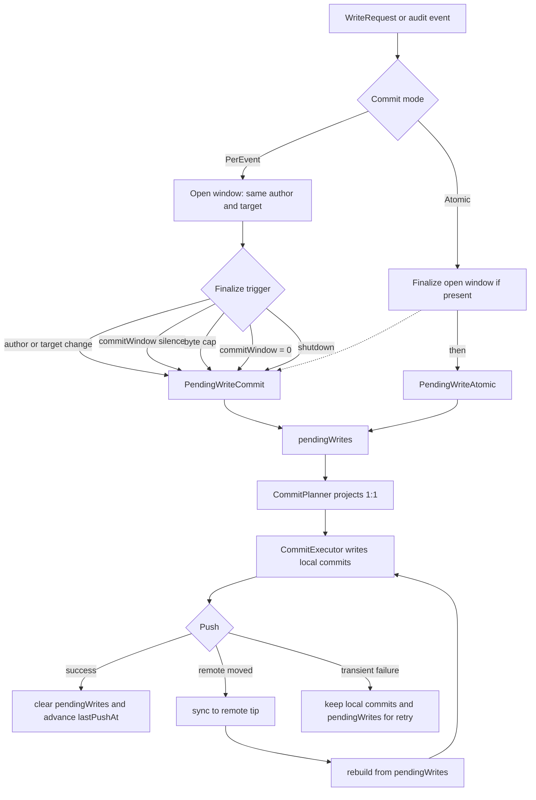

# Commit Window And Commit Planning

> Status: implemented
> Date: 2026-05-01

This document is the source of truth for the current commit-window and commit
planning implementation. It replaces the earlier batching design, planning
analysis, and follow-up cleanup notes. Those documents were useful while the
refactor was in flight; the implementation has now landed.

## Goals

The git writer turns Kubernetes audit events and reconcile snapshots into Git
commits. The design has three main goals:

- Keep Git history readable during bursty operations such as `kubectl apply -k`,
  `helm upgrade`, ArgoCD sync waves, or GUI-driven edits.
- Treat a write as complete only after the push to the remote succeeds.
- Keep replay stable even if a `GitTarget` or its encryption Secret changes
  while work is locally committed but not yet pushed.

The user-facing commit-shaping control is `GitProvider.spec.push.commitWindow`.
The default is `5s`; setting it to `0s` gives per-event local commits in the
normal no-conflict path. Push cadence is intentionally separate and uses a fixed
5 second cooldown in the branch worker.

## Use Cases

### Burst collapse

A short burst from one logical operation should usually become one commit per
author and target, not one commit per Kubernetes object. For example, one
`kubectl apply -k` that creates four ConfigMaps for the same `GitTarget` and
same user becomes one grouped commit after the commit window goes quiet.

### Honest authorship

Grouped audit commits are authored by the event user. The operator remains the
committer because it physically writes the Git commit. Atomic reconcile writes
are authored by the operator because they represent a controller snapshot, not a
single human action.

### Target isolation

A grouped commit covers exactly one `GitTarget`. That keeps path selection,
bootstrap files, and SOPS encryption recipients unambiguous. Events for
different targets split into different commit units even when they arrive in the
same burst.

### Safe replay

If the remote branch moves before our push lands, unpublished local commits are
discarded and rebuilt on top of the new remote tip. Replay uses the metadata
resolved when the work entered the pending lifecycle, so a deleted or changed
`GitTarget` does not change how already-pending work is written.

## Current Flow

`BranchWorker` owns the live open window, timers, repository preparation, push
cooldowns, and retry scheduling. It retains `[]PendingWrite` until a push
succeeds. Local commit creation does not clear pending work.

Per-event writes are processed as a stream. The branch worker keeps one open
window at a time, and that window contains only one author and one target. The
window finalizes immediately on author change, target change, `commitWindow=0`,
the byte cap, shutdown, or commit-window silence. Repeated writes to the same
Git path inside the open window are last-write-wins while preserving first-seen
path order.

Atomic writes are different: they bypass the live-event window, but they do not
jump ahead of already-windowed live events. If an atomic write arrives while the
branch worker has an open event window, the worker finalizes that window into a
commit pending write first, then appends the atomic pending write. This
preserves arrival order while keeping atomic writes as one caller-defined batch.

## Core Types

`WriteRequest` is the external input contract for Git writes. Callers choose
between:

- `CommitModePerEvent`, used for live audit events that may be windowed. With
  `commitWindow=0`, each event finalizes immediately.
- `CommitModeAtomic`, used for reconcile snapshots that must land as one commit.

`PendingWrite` is the durability unit retained until push succeeds:

- `PendingWriteCommit` represents one finalized commit-shaped event window.
- `PendingWriteAtomic` represents one caller-defined atomic write.

Pending writes carry resolved target metadata: target identity, destination
path, bootstrap options, and encryption configuration. That metadata is the
replay contract.

`CommitPlan` is the planner output. It contains ordered `CommitUnit`s. Each
`PendingWrite` maps to exactly one `CommitUnit`, and each unit maps to at most
one local Git commit.

`CommitExecutor` executes commit units. It applies files, stages bootstrap
templates, configures encryption from the unit, skips no-op units, renders the
message, chooses commit metadata, and creates the local commit.

## Window Rules

The branch worker is the only owner of commit grouping for live audit events.
It appends to or finalizes the open window on event arrival.

Rules:

- A new window starts when there is no open window.
- The current window finalizes when the author changes.
- The current window finalizes when the `GitTarget` changes.
- Same-author, same-target edits of the same path stay in the same window.
- Within a window, the latest event for a path wins.
- First-seen path order is preserved for commit message resource ordering.

This keeps GUI-style repeated edits compact while making commit boundaries
visible at the same point where events enter the pending lifecycle. There is no
planner-time regrouping pass.

## Messages And Authorship

There are three message kinds:

- Per-event: one event, event author, `commit.message.template`.
- Grouped: multiple events from one grouped author/target, grouped author,
  `commit.message.groupTemplate`.
- Batch: atomic reconcile write, operator author, `commit.message.batchTemplate`.

A grouped unit with one event intentionally falls back to the per-event message
kind. This keeps `commitWindow=0` and one-event finalized windows readable.

The grouped template receives `GroupedCommitMessageData`:

- `Author`
- `GitTarget`
- `Count`
- `Operations`
- `Resources`

`Resources` is deduplicated by Git path and rendered in first-seen order.

## Push And Replay

The branch worker records the remote root hash for the current push cycle before
creating local commits. `PushAtomic` uses that root hash to detect whether the
remote moved.

Push outcomes:

- Success: clear `pendingWrites`, clear the push-cycle root hash, and advance
  `lastPushAt`.
- Transient failure: if the remote tip still matches the recorded root hash,
  leave local commits and pending writes untouched. The next cooldown-driven
  push retries the same commits.
- Push error plus failed remote-state fetch: treat it like transient. Preserve
  state and surface the original push error.
- Conflict: if the remote tip differs, sync to the latest remote tip, rebuild
  commits from retained pending writes, and retry in the same call.

Replay correctness is defined by final tree correctness and a successful push,
not by preserving unpublished local commit objects. If replay finds that the new
remote tree already contains the desired content, the no-op unit is skipped and
no replacement commit is created.

## Operational Controls

`commitWindow` lives on `GitProvider.spec.push` because commit shaping belongs
to the branch writer for a provider/branch. The byte cap is an operator startup
setting, `--branch-buffer-max-bytes`, because it protects pod memory rather than
describing user-facing Git history.

The push cooldown is fixed at 5 seconds. It keeps fast local commits from
spamming the remote while still keeping ordinary single-change latency close to
`commitWindow + push RTT`.

## Tests

The implementation is covered at three useful levels:

- Planner tests assert 1:1 projection, atomic plan shape, arrival order, and
  one-resolution-per-target encryption lookup.
- Executor tests assert message-kind routing, no-op skipping, and encryption
  coming from `CommitUnit` metadata.
- Branch-worker tests assert open-window finalize triggers, retained pending
  writes, transient vs conflict push handling, replay with deleted target
  metadata, atomic/commit interleave order, and no-op replay behavior.

The e2e smoke test for commit-window batching covers the full pipeline from
Kubernetes event to Git commit. The deeper replay and failure-classification
cases stay in unit/split-worker tests where they can be made deterministic.

## Short History

The original implementation had separate grouped and atomic write paths, plus
test-facing compatibility helpers in `git.go`. That made push failure handling,
replay, and encryption resolution harder to reason about. The refactor moved
both grouped and atomic writes through retained `PendingWrite`s, a shared
planner, and a shared executor. It also removed the old request-writing
compatibility path and the transitional test helpers.

No CRD shape changed as part of the refactor beyond the already-landed
commit-window and grouped-message fields.
