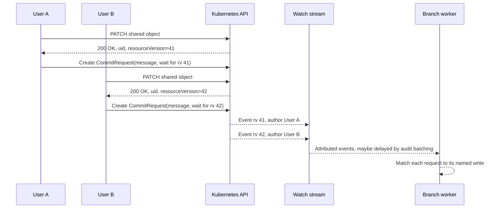

# What a save should wait for

> **design, decided**: a plan to execute, not an open question. Index: [`../INDEX.md`](../INDEX.md)
>
> The short version: `spec.closeDelay` is a timer standing in for a happens-before the API
> never expresses. A request names a `GitTarget` and has no way to name the write it means to
> capture, so the integrator is asked to guess a duration that covers a latency belonging to the
> cluster's audit configuration. Its default, `0`, is shorter than the minimum possible
> window-open latency, so the primary use case cannot work unmodified.
>
> The decision: repair the default, then give a request a way to **name the write it is waiting
> for**, using the `(uid, resourceVersion)` identity the attribution join already keys on. Five
> phases, each shippable alone. The one invariant none of them may weaken: a `CommitRequest`
> finalizes its own submitter's work and nobody else's.

## The report this comes from

An integrator ran 0.46.0 against a live cluster and wired the product's "save now" path: a
participant edits a custom resource, the backend creates a `CommitRequest` so the edit reaches Git
while the operator is standing in front of it. It had never worked, and nothing reported a failure.
Every request resolved `Ready=True` with reason `NoWindowInGrace`, whose message reads "no matching
open commit window was collected within the grace; nothing was pending to save".

Something was pending. It had not arrived yet. The controller log for one save, in order:

```text
10:47:32  admission.validate-operator-types  recorded command author at admission
10:47:32  worker-manager.branch-worker  CommitRequest registered with worker  closeDelaySeconds=0
10:47:32  worker-manager.branch-worker  CommitRequest resolved  outcome=NoOpenWindow  sha=""
10:47:32  CommitRequestReconciler  CommitRequest finalized  reason=NoWindowInGrace  age=153ms
10:47:32  worker-manager.branch-worker  Opening commit window        <-- after
10:47:37  worker-manager.branch-worker  Finalizing open commit window  reason=timer  attachedCR=false
10:47:40  git commit created  message="chore(demo2): 1 change from demo:CgZzaW1vbjQSCXJvb20tcGFzcw"
```

The request was created, attributed, evaluated, and finalized before the write it exists to publish
reached the worker. The edit still committed, five seconds later on the window's own timer, under
the target's `liveTemplate` instead of the sentence the participant typed. From the cluster's point
of view nothing failed. From the operator's, the save button did nothing.

The reporting integrator has since set a two-second close delay client-side, which moves the failure
from "always" to "whenever the cluster is slower than two seconds". That is a workaround at one
call site, not a fix: the operator still ships a default that cannot work.

## The shared-object save shape

The reported case is not only a single-user latency problem. A public interactive editor can put
many distinct people in front of one shared resource. Each person edits the same object, the form is
fed by a watch, and stale forms are handled in the application before the save is accepted. The
operator can rely on three facts:

- every participant has a distinct Kubernetes identity, name, and email address;
- every accepted write returns the object's current `uid` and `resourceVersion`;
- the caller cannot know where that write will land in the watch stream relative to other accepted
  writes.

That shape is general. It is any collaborative editor that writes one API object and wants the Git
history to remain legible: "Sanne changed this value because ..." rather than "some later window
closed with the wrong message".



The unique identities keep one participant's request from claiming another's open window. They are
not a causal token by themselves: "the next activity from this author" is safe across people but
still approximate for one person who submits twice, retries after a network hiccup, or has an
earlier same-author window already open. The `resourceVersion` from the accepted write is the
smallest token the UI already has that can name the save it wants Git to show.

## What happens today

Four mechanisms decide the outcome, and the failure is structural rather than a tuning miss.

**The deadline is stamped from receipt.** `handleAttachCommitRequest` in
[`commit_request_attach_loop.go`](../../internal/git/commit_request_attach_loop.go) sets
`finalizeAt = time.Now().Add(closeDelay)` on first registration, and idempotent re-sends keep
that first value. With the field omitted the deadline is the present instant, so the request is due
on the next pass of the worker's event loop.

**The request is evaluated on the fast path.** Authorship comes from the validating admission
webhook, resolved synchronously and present-or-never: the record is written before the object is
visible, so `CommitRequestReconciler` attaches the instant it first sees the object.

**The write travels the slow path.** A watch event is held head-of-line inside the watch goroutine
by [`author_resolver.go`](../../internal/watch/author_resolver.go) until a matching audit fact
arrives or `--author-attribution-grace` (3s) expires. On the reporting cluster the API server posts
audit in batches bounded by `--audit-webhook-batch-max-wait=1s`, so the floor on window-open latency
is bounded below by that batch plus the join.

**Attach is author-bound.** `matchesWindow` in
[`commit_request_attach.go`](../../internal/git/commit_request_attach.go) admits a window only when
the author strings are equal, the two sides agree on whether an actor is named, and the `GitTarget`
identity matches.

So the request is evaluated against a window that is still in flight, and the two paths are
asymmetric by design. A `0` deadline is not tight. It is shorter than the smallest latency the
architecture can produce.

## The invariant, and why it is the first test

**A `CommitRequest` finalizes the work of the actor that submitted it, and never anyone else's.**
There are no exceptions, and no phase below may introduce one. It has two halves, both enforced by
`matchesWindow` today:

- a request with a named submitter claims only that actor's named window;
- a request with no named submitter claims only a window that names no actor.

The second half is what keeps an unattributed request from picking up a named person's edits when
admission capture is off or missed. The comparison stays on `AttributionOutcome.NamesActor()` rather
than on enum equality, because the window's outcome and the request's are produced by two
independently configured subsystems, and the code comment on `matchesWindow` records what breaks in
both deployments when that is got wrong.

**A satisfied wait does not imply an attach.** This is the consequence that matters most, and the
one easiest to state wrongly. A wait asks "has the write I named been observed"; attach asks "may I
claim this window". They are different questions with different keys, and both must be answered. A
request can wait successfully and still land on `WindowMismatch` — see situation 7.

## Requirements

**R1. The committer binding is absolute.** No phase may widen what a request may **attach to**.
A wait may be keyed on anything; attachment stays keyed on `matchesWindow` and nothing weaker.

**R2. A save must not be able to expire before the write it exists to publish can arrive.** The
configuration that produces this must be impossible to reach by omission. A default that cannot work
is a defect regardless of what the reference text says about it.

**R3. The bound belongs to the cluster.** The latency being covered is the API server's audit
batching plus the attribution join. An integrator cannot read either from where they stand, so
asking them for a number in seconds asks for a number they cannot derive.

**R4. No silent nothing-happened.** "You asked before your write arrived", "nothing was pending",
and "your write was already committed under a generated message" are three different events. Today
they are one `Ready=True` with one reason and one message. Every terminal state must be
discriminating enough for a first-time integrator to tell which one they are in.

**R4a. Shared-object saves keep per-actor intent legible.** When several distinct actors edit the
same resource, their messages must not become a race against watch delivery. A request with enough
information to name the accepted write should be able to wait for that write, and a weaker request
must say what approximation it is making.

**R5. No transactional promise.** A request does not reserve a window, cannot rename a finalized
commit, and must not suspend the `GitTarget`'s own flush triggers. A causal wait edges toward that
line, so each phase says where the line still is.

**R6. Compatible by construction, except the broken default.** `CommitRequest.spec` is immutable, so
capability arrives as new optional fields. Apart from an explicit default repair for
`closeDelay`, a request that sets none of the new fields behaves exactly as it does today.

**R7. Do not tune against the attribution grace.** Sizing a delay against the 3s grace is the
obvious mistake and the wrong bound. When the grace expires with no fact, the event still ships, as
an unresolved window that names no actor, and a named submitter can never claim it (R1). The honest
outcome there is `WindowMismatch`, and no amount of waiting changes it. The delay only ever needs to
cover audit-fact arrival.

**R8. Bounded cost on the worker.** Waits are serviced on the branch worker's single event-loop
goroutine, which also does the Git work. Per-wake cost must stay proportional to the small number of
pending requests, with a cap on anything a caller can put in a list.

**R9. Legible while it waits.** What a request is waiting for has to be readable from the object
while it is still waiting. Reconstructing it afterwards from controller logs is too late to help.

## The situations

`W` is the write the requester wants published. Today's column is 0.46.0.

| # | Situation | Today | After the plan | Phase |
|---|---|---|---|---|
| 1 | `W` is already in a claimable open window when the request registers | attaches, then waits out the whole delay | satisfied at once from the open window, then the collect delay | 2 |
| 2 | `W` arrives during the delay | works: this is what `closeDelay: "2s"` buys | unchanged | — |
| 3 | `W` arrives after the delay | `NoWindowInGrace`, `Ready=True`; `W` commits later under `liveTemplate` | wait for `W`, then finalize | 2 |
| 4 | `W` arrived and its window closed before the request registered | `NoWindowInGrace`, indistinguishable from row 5 | **when a usable attribution fact exists**, the index says whether the cluster ever saw `W`, which splits 4 from 5; otherwise unchanged until the ledger. Naming the commit always needs the ledger | 2 (partial) / later |
| 5 | Nothing was pending | `NoWindowInGrace`, correct | unchanged | — |
| 6 | `W` is suppressed by live-content dedup (sanitized content did not change) | nothing opens; `NoWindowInGrace` | `AlreadyPresent`, for the right reason | 3 |
| 7 | Attribution missed, so the window names no actor and the request names one | `WindowMismatch` | unchanged (R7). The wait **is** satisfied and the attach still fails — the terminal message must say both | 2 |
| 8 | Another committer holds the window | `WindowMismatch`, their window untouched | unchanged, permanently (R1) | — |
| 9 | Several distinct actors edit one resource and each sends a save message | safe from cross-author attach, but delay-shaped and unable to prove which object version a message means | each request binds to the accepted write it names | 2 |
| 10 | Render fidelity is not established for the target | live events dropped at `normalWritesAllowed`; `NoWindowInGrace` | the drop happens **inside** the worker, so it can mark a wait naming `W` terminally unsatisfiable, with its own reason | 2, needs the hook named below |
| 11 | The worker queue was saturated (`ErrFinalizeQueueFull`) | the event is dropped; `NoWindowInGrace` | **not fixed by phase 2.** The drop happens upstream in the watch path and never reaches the worker, so the wait times out saying only that `W` was not observed | see the cost below |
| 12 | One actor saves twice against the same object inside one window | the second write subsumes the first at the same path; the window carries one message, so the second request gets no window and its message is lost | both waits satisfy, but one window carries one message: the second needs its own outcome | 2, open |

Rows 3 and 4 are the reported defect. Row 1 is a latency win from the same change. Rows 7 and 8 are
correct today and constrain every phase. Rows 10 to 12 are the ones the first draft of this page
missed; 12 is still an open question.

## Why the attribution fact index is not the answer

The obvious shortcut is to satisfy a wait from the attribution fact index, which is already keyed on
exactly the identity a named write would use — `FactQuery{AuditRoute, GroupResource, UID,
ResourceVersion}` in [`fact_index.go`](../../internal/queue/fact_index.go) — and already has a
register-then-check waiter registry in [`fact_waiters.go`](../../internal/queue/fact_waiters.go).

It cannot be the satisfaction signal, for three reasons.

**It is early, not late.** A fact says the API server audited a write. The watch event *blocks
waiting for that fact*. Fact arrival is strictly upstream of the write reaching the worker, so a
fact-keyed wait fires before the window opens — the reported defect, relocated one layer up. In the
trace above the fact must have landed at or before `10:47:32`, which is when the request had
already resolved.

**It is blind to everything between audit and Git.** It cannot see live-content dedup (row 6 gets
*worse*: the write is audited, so the wait satisfies, then finds no window), the render-fidelity
gate (row 10), queue saturation (row 11), whether this `GitTarget` watches the type, or which
`GitTarget` a write routed to — the index is deliberately one per process, not one per target.

**It is empty in two supported deployments.** With `--author-attribution=false` there are no facts
at all, and the wire contract refuses a fact that names nobody
([`author_fact.go`](../../internal/queue/author_fact.go)), so a write the audit policy skips is
indistinguishable from one that never happened.

**What to take from it anyway.** Three things, and they remove most of the "new vocabulary" cost:

1. `ExactCapable` and `AttributionExact` have already settled this repo's `resourceVersion` policy —
   exact `uid`+`resourceVersion` is the match, and a removal's `resourceVersion` is *not* the one the
   write produced. The wait must cite that rule, not invent a second one.
2. `factWaiterRegistry`'s register-then-check discipline is the same race the worker-side wait has
   (register before scanning the open window, or a write landing in the gap is lost). Mirror it.
3. The **default** fact TTL is 10 minutes (`DefaultAttributionFactTTL`, tunable per install via
   `--author-attribution-ttl`), comfortably longer than any wait timeout at its default, so the index
   can serve as a retrospective oracle for one question: did the cluster ever see the write you
   named? That splits row 4 from row 5 for the cost of a lookup, with no new structure.

   It is **best-effort by construction**, and the plan must not promise more. The lookup answers only
   when attribution is on, the audit policy covers the type, and the fact has not aged out — and an
   aged-out fact is indistinguishable from one that never arrived, because the index keeps no
   tombstone. An operator who lowers the TTL below `waitFor.timeoutSeconds` silently narrows the
   window in which the split works. Validation should refuse a `timeoutSeconds` above the configured
   TTL rather than let the two drift apart unnoticed; where the lookup cannot answer, row 4 stays
   folded into row 5 until the ledger exists.

## The timer model

Give each field one job, rather than reinterpreting `closeDelay` as a ceiling (R6):

- `waitFor.timeoutSeconds` is the give-up bound, anchored at receipt. This is where audit-fact
  latency is covered, and it is the number a cluster's installer can reason about.
- `closeDelay` keeps its meaning and is measured from **satisfaction**: once the awaited
  arrival lands, collect the rest of its burst for this long, then finalize.
- With no `waitFor`, `finalizeAt = receipt + closeDelay`, exactly as today.

Idempotent re-sends keep the first receipt anchor, and once satisfied, the first satisfaction time.

Note what this does and does not buy. Rows 2 and 3 get faster and more reliable, because the window
closes a short collect after the write lands rather than after a delay sized for the worst case.
Row 1 is unchanged in wall-clock terms: satisfaction is immediate, so it still finalizes at
receipt + `closeDelay`. The win in row 1 is correctness of the *reason*, not latency.

## What a save needs today

Only phase 0 has shipped. Until the rest does, a `CommitRequest` save can be made to work
reliably, but only by satisfying outside the operator what the API cannot yet express.
These are the preconditions, in the order they bite. The first is a blocker; the rest are races you
can widen your way out of.

**1. The audit policy must cover the type being saved.** If audit emits nothing for the object's
group and resource, or `--author-attribution` is off, the window names no actor while the request
names one, and `matchesWindow` refuses it: `WindowMismatch`, every time, permanently. No value of
`closeDelay` changes this, because nothing is ever going to arrive that the request could
claim (R7). Verify this against the cluster the save actually runs on before tuning anything else.

**2. Set `closeDelay` generously, and do not size it against the 3s grace.** Phase 0 moved
the default from `"0s"` to `"2s"`, so an omitted field is no longer the broken case; the sizing below is
what a cluster slower than the reference configuration still needs. The number has
to cover audit-fact arrival: the API server's `--audit-webhook-batch-max-wait` plus the attribution
join. At the reference configuration of `1s` that is roughly 1 to 1.5 seconds in practice, so
`"2s"` leaves under a second of headroom and `"4s"` to `"5s"` leaves a margin that survives a
loaded or distant
cluster. The cost of overshooting is that the commit lands a few seconds later; the cost of
undershooting is a silent no-op. They are not symmetric.

**3. Let the target reach render fidelity before the first save.** Live events are dropped while
render fidelity is not established (situation 10), so the first save after an operator restart is
the one most likely to vanish. Give the target time to settle, or spend one throwaway save on it.

**4. Do not let one actor save twice against the same object in quick succession.** A window carries
at most one `CommitRequest`, and a second write to the same path subsumes the first inside the open
window, so the second message is lost while its change still commits under the first request's
message — or under `liveTemplate`. This is situation 12, and it is the failure a save button with no
debounce produces on the first double-click. Disable the control for the length of the collect
window.

**5. Know what else writes the object.** A `/status`-only update is safe: it sanitizes to identical
content and is dropped by live-content dedup before it reaches the worker, which is why that dedup
exists. A controller that adds a finalizer, or stamps a label that survives sanitize, is not safe —
it arrives under a different author and forces an identity-change finalize that splits the collect
window out from under the request.

**6. Assert on the commit, not on the condition.** Every failure above resolves `Ready=True`. An
integration that checks the `CommitRequest` went green is checking the one thing that is true in
both the working and the broken case; check that the commit message is the one that was typed.

Requirement R2 exists because points 2 and 3 are load-bearing and undiscoverable, and R4 exists
because point 6 is currently necessary advice. A build that still needs this chapter has not
finished the plan.

## The plan

Five phases. Each is shippable alone and leaves the system correct.

### Phase 0 — repair the default — **shipped**

Make `CommitRequest.spec.closeDelay` a `*metav1.Duration` with `+kubebuilder:default="2s"`.
(Shipped first as `closeDelaySeconds`, an int; renamed when every duration in the API became a Go
duration string behind the same pattern.)

A pointer rather than a bare value, decided: a schema default on a bare field means a typed Go
client can no longer express "finalize immediately", because its zero value is not serialized. More
importantly, the cluster-level default flag below is **blocked** on the pointer — once stored, an
omitted field and an explicit `0` are the same value, so nothing downstream can tell them apart.
The type is `v1alpha3` with one known consumer; this is the cheapest it will ever be.

- `api/v1alpha3/commitrequest_types.go`, then `task generate` and `task manifests`
- nil handling at the controller seam (`commitrequest_controller.go`, where the field is copied onto
  `AttachCommitRequest`)
- docs: `configuration.md`, `architecture.md`, `spec/commitrequest-design.md`, an `UPGRADING.md` note

**Half a day.** Fixes R2. Leaves rows 1, 4, 6 untouched, and moves row 3 from "always" to "when the
cluster is slower than two seconds" — an improvement in reliability, not a change in kind.

### Phase 1 — carry write identity on the event

[`sanitize`](../../internal/sanitize/sanitize.go) deletes `uid` and `resourceVersion` before the
event is built in [`target_watch.go`](../../internal/watch/target_watch.go), so an event carries no
version identity downstream. Add them to `git.Event` as watch-observed fields, populated on the
live path only, stamped in `targetWatchGitEvent` where both values are in hand — the author resolver
already reads both at exactly that point.

No behaviour change; nothing reads the fields yet.

**Half a day to a day.** Unlocks phases 2 and 3.

### Phase 2 — the named-write wait

Add `spec.waitFor`: one named resource, and a timeout.

```yaml
spec:
  gitTargetRef: {name: demo2}
  waitFor:
    timeoutSeconds: 10
    resources:
      - apiVersion: examples.configbutler.ai/v1
        kind: CoffeeConfig
        name: demo-coffee
        uid: 3f0a...                  # optional
        resourceVersion: "2577872"    # optional
  closeDelay: "2s"
```

The caller already holds these values: they are in the response to the `PATCH` it makes one line
earlier. The list is capped at one resource for now and stays a list because the same shape later
serves multi-object form saves.

**Satisfaction** is: the named write observed by this worker, either already present in the open
window at registration (row 1) or arriving afterwards (rows 2, 3). Match on `uid` when supplied —
a mismatch is unsatisfiable immediately, since the object was recreated — then on exact
`resourceVersion`, per `AttributionExact`. Register the wait before scanning the open window.

**Where the row-10 hook lives.** The render-fidelity gate drops a live event *inside* the worker
loop, in `handleQueueItem` before any window code, so the worker does see the write. The hook goes in
that drop branch: it must mark any pending wait naming `W` **terminally unsatisfiable** with its own
reason, not satisfy it. Satisfying before the gate would be the worse bug — the request would arm its
finalize for a write that is never going to be committed, and then report a timeout for the wrong
reason. This is the one place where "observed" and "will reach Git" come apart on purpose.

**Attach is unchanged.** Satisfaction arms the finalize; `matchesWindow` still decides what may be
claimed (R1). A satisfied wait that cannot attach reports `WindowMismatch` with a message saying the
write was observed but the window named a different actor — row 7.

**Validation stays in the schema.** The commands webhook captures the submitter and always allows,
so the list is bounded by CRD schema and CEL: a cap on length (R8), kind and name required, namespace
defaulting to the request's own. No admission check that the `GitTarget` watches the named type —
rules change independently of requests, so an inability to satisfy belongs in the timeout message
rather than in a rejection.

**Where R5 still holds.** The request waits for its write to be observed. It does not reserve the
window, cannot rename a commit that already exists, and does not delay the target's own flush. The
promise is bounded to "I will not give up before my write arrives".

Also in this phase: the terminal-state work R4 asks for. New reasons and bounded
`gitopsreverser_commit_requests_total{outcome}` values for an unsatisfied wait, separating "the
cluster never saw the write you named" (fact-index lookup, row 4 vs 5), "the target was not
accepting writes" (row 10), and "nothing was pending" (row 5).

- `api/v1alpha3`, CRD, CEL cap
- `commitrequest_controller.go` plumb; `commitrequest_finalize.go` reasons and messages
- `pendingCommitRequest` satisfaction state and the two-timer model in `commit_request_attach_loop.go`
- `status.waitingFor` on the object while it waits (R9)
- docs: `spec/commitrequest-design.md`, `spec/status-conditions-guide.md`, `interpreting-metrics.md`,
  `configuration.md`, `architecture.md`
- unit tests plus a timing-sensitive e2e in `test/e2e/commit_request_e2e_test.go`

**Three to four days.** Fixes rows 1, 2, 3, 7, 9 outright, and row 10 via the hook above. Splits
row 4 from row 5 only where a usable fact exists. Does **not** fix row 11.

**Row 11 is a named cost, not an oversight.** A saturated queue is rejected in the watch path —
`RouteToGitTargetEventStream` returns an error and the event is counted as
`watchOutcomeRouteFailed` in [`target_watch.go`](../../internal/watch/target_watch.go) — so the write
never reaches the worker and no worker-side wait can distinguish it from a write that never
happened. Reporting it honestly needs a route-failure signal plumbed from the watch layer into the
`CommitRequest` outcome machinery, which is its own piece of work across a seam nothing else
crosses. The decision for phase 2 is to **accept the gap and say so in the timeout message** — "`W`
was not observed" is true — and to file the plumbing separately rather than let the plan imply a
diagnosis it cannot make. The drop is already counted at the metric, so an operator investigating a
run of unsatisfied waits has the signal; the individual request does not.

### Phase 3 — observed-write work item

`skipUnchangedLiveUpdate` drops a write whose sanitized content is unchanged before it reaches the
worker, so a named wait on such a write runs to timeout on a write that was observed and correctly
decided to be a no-op (row 6).

**Do not route this as an event.** An observation-only `git.Event` carries no `Object`, and — because
the dedup check runs *before* `attachAuthor` — no author either. It would either open a commit window
with an empty author or trip `canAppend` and force an identity-change finalize of the live window,
cutting the very window the request is waiting for. It would also be dropped outright by the
`normalWritesAllowed` fidelity gate.

Add a fourth arm to `WorkItem` instead — `Observed *ObservedWrite`, beside `Attach` and `Resync` in
[`types.go`](../../internal/git/types.go) — dispatched at the top of `handleQueueItem` before any
window code. Same FIFO, same ordering guarantee, no contact with the write path.

**One day.** Fixes row 6: `AlreadyPresent` for the right reason.

### Phase 4 — say when a request asked too early

The worker knows the difference between "you asked too early" and "nothing was pending": in the
reported trace it opened a matching window microseconds after resolving `NoOpenWindow`. Keep a
short-lived record of recently expired requests, and when a window opens that would have matched one,
say so.

The terminal status is already written by then, so the reason cannot change retroactively. What is
available is a log line, a counter, and one further reconcile that emits an Event on the object. The
first two are cheap and certain; the third needs the reconciler's terminal short-circuit
(`stampFirstSightConditions` returns early once `Ready` exists) to be re-enterable without
re-running a finalize.

This is *not* a mirror of `sawForeignWindow`, which is sticky-on-every-pass and deliberately skips
already-due requests. This record fires after expiry and needs its own retention keyed by what the
request would have matched.

**One day.** Diagnostics only; it is not a substitute for phase 2, because a late Event does not put
the participant's message on the commit.

### Not scheduled

- **An observation ledger on the worker**, so a request whose named write was collected and flushed
  before it registered can say the write reached Git under a generated message (row 4, fully). Most
  of a phase on its own; the fact-index lookup in phase 2 covers the diagnostic half.
- **Multiple named resources** in one `waitFor`, for multi-object form saves. Wait for a consumer.
- **`waitFor.mode: CommitterActivity`** — wait for the first sign of activity from the committer,
  received after registration. Lower friction for callers that cannot name a write, and safe by R1
  however coarse it is, because the binding bounds the blast radius to the requester's own work.
  Deferred because the shared-object case no longer needs it, and because by its own "arrival, not
  existence" rule it cannot satisfy row 1 — where the write has already arrived — so it would
  *regress* the case phase 2 fixes outright.
- **`--commit-request-default-close-delay`**, a cluster-level default set by whoever installed the
  operator and does know how their API server is configured. Deriving it inside the operator is not
  possible: half the input is the API server's `--audit-webhook-batch-max-wait`, which we cannot
  read, and the half we do hold is the wrong bound by R7. Unblocked by phase 0's pointer.

## Open questions

- **Situation 12.** One actor, two saves, one window: both waits satisfy, the second write subsumes
  the first at the same path, and a window carries one message. Does the second request get a
  distinct outcome ("your write is in a commit carrying another request's message"), or does it
  defer to the next window and risk a timeout? Needs a decision before phase 2 is built.
- **Terminal grading for an unsatisfied wait.** A request whose named write never arrived asserted a
  precondition that did not hold. Grading it `Ready=True` keeps "a save with nothing pending is a
  success" intact but hides a real failure; grading it `Ready=False` requires `Stalled=True` as well,
  because automation is documented to stop on `Ready=True` or `Stalled=True` and a bare
  `Ready=False` would hang it forever.
- **Whether the fact-index lookup in phase 2 is worth its coupling.** It is the only thing that
  splits row 4 from row 5 before the ledger exists, but it makes the `git` package read a `queue`
  structure it does not otherwise touch, and it answers only best-effort (attribution on, type
  audited, fact still inside TTL). A reasonable alternative is to skip it entirely in phase 2 and
  let the ledger answer row 4 properly later, rather than ship a split that works on some installs.
- **Whether row 11's route-failure plumbing is worth doing at all**, or whether the metric is the
  right place to leave it. It is the only situation in the table that phase 2 knowingly does not
  improve.

## Related

- [`../spec/commitrequest-design.md`](../spec/commitrequest-design.md), the current contract. The
  code depends on it, so each phase changes that page in the same commit.
- [`../spec/commitrequest-admission-authorship.md`](../spec/commitrequest-admission-authorship.md),
  where the submitter comes from and why the lookup is present-or-never.
- [`../facts/watch-event-ordering-and-attribution-grace.md`](../facts/watch-event-ordering-and-attribution-grace.md),
  the head-of-line wait this page proposes to wait behind rather than shorten.
- [`attribution-removal-wait-options.md`](attribution-removal-wait-options.md), the same shape of
  question on the attribution side: what evidence is worth waiting for, and for how long.
