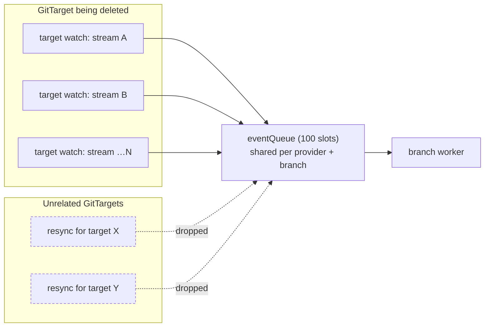
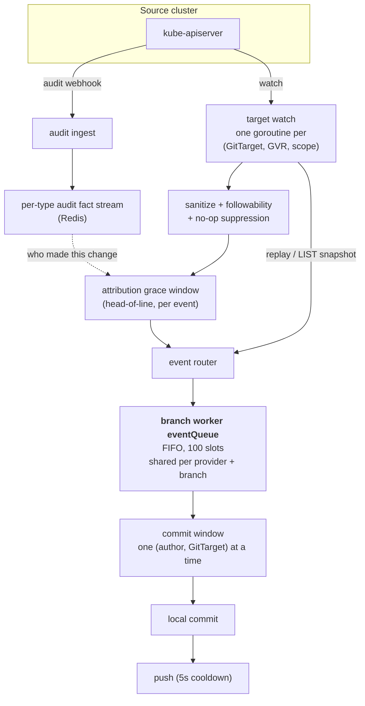
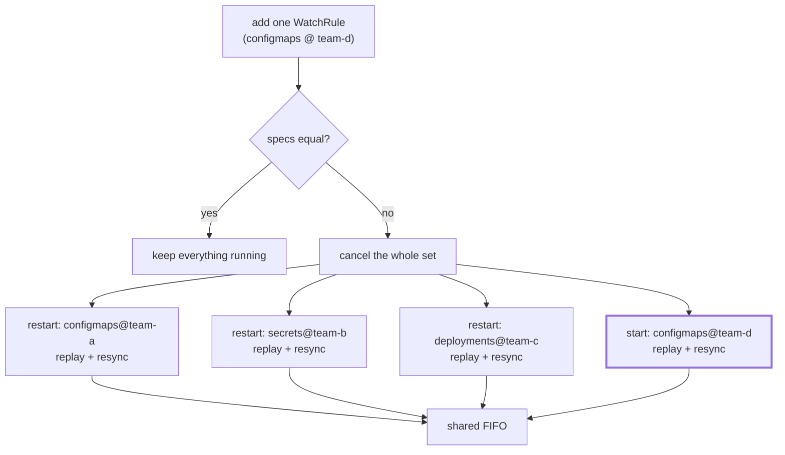
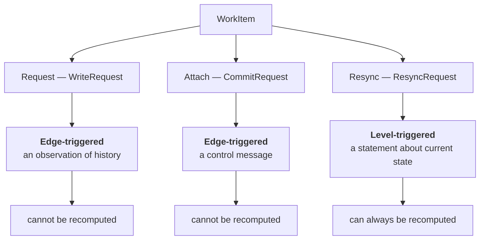
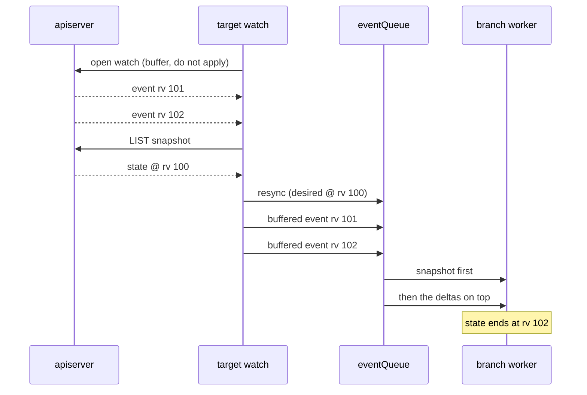

# Data-plane triggering: why one config change replays everything

> **design**: background, open. Index: [`../INDEX.md`](../INDEX.md)

**The short version.** Adding a single WatchRule tears down and replays every
watch stream a GitTarget has. Under load that floods a queue which is shared with
other tenants. The fix is to reconcile only the cells that changed, and it lives
in [TargetWatchPlan](target-watch-plan.md). This page is the background: what
went wrong, how the pipeline works, and the one ordering rule any fix has to
respect.

Read [Watch and catalog architecture](watch-and-catalog-architecture.md) for the
model, [TargetWatchPlan](target-watch-plan.md) for what is being built, and this
page for why it is worth building. Where this page disagrees with either of
those, they win.

[`reconcile-triggering.md`](./reconcile-triggering.md) asks how the **control
plane** wakes up. This asks the same question one layer down, about the **data
plane**.

## 1. What happened

CI run 32848418546 dropped **595 resync requests in 16 seconds**, all for a
single GitTarget whose namespace was being deleted.

A branch worker's `eventQueue` is a 100-slot FIFO shared by **every GitTarget on
one provider and branch**. One target saturated it, so unrelated GitTargets on
the same branch waited on resyncs that never entered the queue, and their
WatchRules never reached `Ready`. Five e2e specs failed this way, which is why it
read as flakiness rather than as one bug.

Each stream of the deleted target looped `replay → enqueue resync → fail →
reconnect → replay`, minting a new payload every two seconds, for a target that
could never come back.

[#312](https://github.com/ConfigButler/gitops-reverser/pull/312) fixed it twice
over: a deleted GitTarget is now terminal for its watches, so the loop stops; and
queued resyncs coalesce by `(GitTarget, scope)`, so queue depth is bounded by the
number of distinct scopes rather than by the request rate.

That stopped the bleeding. It did not address the shape underneath, which the
next section is about.

## 2. How the pipeline works today

Two independent inputs converge on one FIFO.

Three properties carry the rest of this page:

- **Object state comes from watch, never from polling.** A watch that is lost and
  re-established replays with `sendInitialEvents=true` and runs a
  **mark-and-sweep**: everything replayed is marked, and at the
  `initial-events-end` bookmark any managed Git file left unmarked is deleted,
  because its object is gone. That sweep is the only thing that reconciles a
  delete which happened while no watch was running.
- **Attribution comes from somewhere else.** The audit webhook feeds a fact
  stream, and the grace window waits on it to name the author. An event therefore
  cannot be recomputed: the author of a past change exists only there.
- **Everything funnels through one FIFO per branch**, so same-object order is
  strictly preserved and the commit window groups by `(author, GitTarget)`.

[`../architecture.md`](../architecture.md) has the full treatment, under "State
ingestion and not losing deletes", "Watch event ordering", and "Mark and sweep
resync".

### 2.1 The stream set is declarative already; only the diff is missing

This is the finding that reframes everything else. `targetWatchSpecs(table)`
already computes the desired stream set as a map from one cell to that stream's
operation filter. What is missing is a **per-key** diff. Today the comparison is
whole-set equality, so a declaration is either untouched or replaced wholesale:

Only the bold stream is new work. The other three re-replay state that never
changed, which is the storm shape from §1 reached by ordinary configuration
change instead of by deletion.

The cause is structural: the render-fidelity **epoch is per-target**. One epoch
covers every scope, so a scope that resumed from its cursor instead of replaying
would stay pending in the new epoch forever. Making readiness per cell is what
unlocks the diff.

One subtlety worth carrying forward: when a rule **moves**, both scopes are
invalidated. Editing a rule's `sourceNamespace` from `team-b` to `team-c`
produces a `stop` for the old cell and a `start` for the new one. What happens to
the departing cell's documents is decided by the cause table in
[TargetWatchPlan](target-watch-plan.md), "What a cell leaving means".

## 3. The queue is doing two unrelated jobs

`WorkItem` carries three shapes, and they do not share a nature.

**A write is an observation of something that happened.** "alice deleted this
ConfigMap" cannot be recomputed from cluster state: the object is gone, and the
author exists only in the attribution fact stream. Order and attribution both
matter, and both are destroyed by collapsing a write to "something changed". This
half stays a log.

**A resync is a statement about current state**, gathered by listing the live
cluster. Throwing one away loses nothing, because the next gather reconstructs it
fresher. The cluster is the source of truth.

## 4. Why a resync carries both a snapshot and a position

This is the part that is easy to get wrong, and the reason the design looks
heavier than it first seems.

A resync is not applied into a vacuum. Live events for the same scope arrive
while it is in flight, and the snapshot it carries was gathered at some revision.
FIFO position is what reconciles the two. The LIST fallback makes the ordering
explicit: buffer the watch without applying it, LIST a snapshot, enqueue the
resync, record the cursor, and only then release the buffered events.

Invert those and the snapshot lands after edits it does not contain, and
mark-and-sweep reverts them. The events are not merely redundant. They are
unapplyable out of order, because an event may already be included in the
snapshot, so its value is defined only relative to the snapshot boundary.

**So a FIFO position is not an implementation detail that can be discarded for
free.** It is the boundary that makes "snapshot, then deltas" well defined, and
any redesign has to solve that again. It is why
[TargetWatchPlan](target-watch-plan.md) keeps a coalescing fence, and why a
proposal to replace the resync payload with a bare dirty set was dropped.

## 5. Where we are

The plan lives in [TargetWatchPlan](target-watch-plan.md), which is the single
place to read it from. In outline: diff the plan by cell and log it, then apply
the diff so unrelated replays stop. The semantics of removal come after,
deliberately.

That plan applies its decisions by starting and canceling streams, and nothing
filters the queue. A branch worker serves one GitProvider and branch rather than
one GitTarget, so its queue is shared across tenants and must not hold per-tenant
configuration. A short tail of writes from a cell that has been deselected is
therefore accepted: it is bounded by the queue, and the files it touches are
retained anyway.

Shipped so far: the storm source is fixed and resyncs coalesce
([#312](https://github.com/ConfigButler/gitops-reverser/pull/312)); the ordering
hazard that coalescing introduced is fenced; and cell identity is settled, with
one stream per cell and the producing cell stamped on queued work. The diff
itself is unbuilt.

The writes stay a log throughout. Only the resync half of the queue is in
question, and the answer is to make the stream set incremental rather than to
replace the queue.

## 6. Related work

**The layer above.** [Reconcile triggering](reconcile-triggering.md) asks the
same question for the control plane.

**How ingestion works.** [Architecture](../architecture.md) is the reference.
[Watch-first ingestion](../finished/watch-first-ingestion-architecture.md) is how
the model was arrived at, and
[Reconcile via WatchList and mark-and-sweep](../spec/reconcile-via-watchlist-mark-and-sweep.md)
is the mechanism §4 depends on.
[Watch event ordering under the attribution grace window](../facts/watch-event-ordering-and-attribution-grace.md)
has the worked examples.

**Scopes and streams.** A sweep is bounded by the exact slice its snapshot was
gathered over, and a cluster-wide scope is a **peer** of a named namespace rather
than a replacement for it: collapsing the two widened the named rule's stream to
every namespace its credential could read and discarded its operation filter.

**Deletion and retention.** `spec.prune.mode`
([`../configuration.md`](../configuration.md), deletion policy) already draws the
line: an observed DELETE is evidence, a mark-and-sweep drop is an inference, and
only the second is gated. `status.retention` makes a suppressed sweep visible.

**Types and identity.**
[Type lifecycle events and wobble settling](../spec/type-lifecycle-events-and-wobble-settling.md)
gives `RemovalGrace`, which the plan consumes rather than re-decides.
[Typeset owns discovery grace](../spec/typeset-owns-discovery-grace.md) is where
that grace lives, [Type followability](../spec/type-followability.md) defines
what may be mirrored at all, and
[the GVK/GVR mapping layer](../spec/gvk-gvr-mapping-layer.md) is the identity
resolution the plan's cell turns on.
[Unsupported folder refusal](../spec/unsupported-folder-refusal-plan.md) decides
what a folder may contain before any of this runs.
