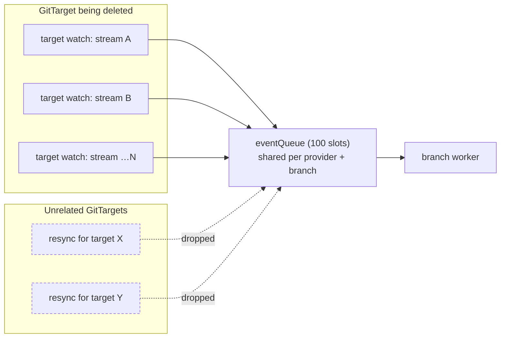
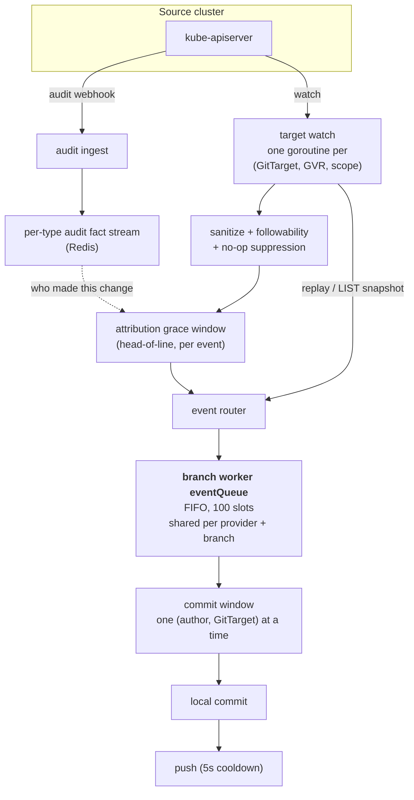
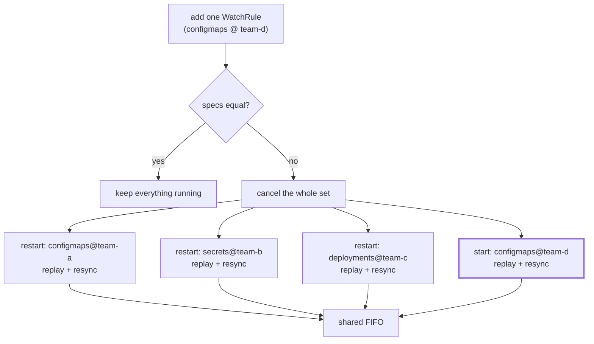
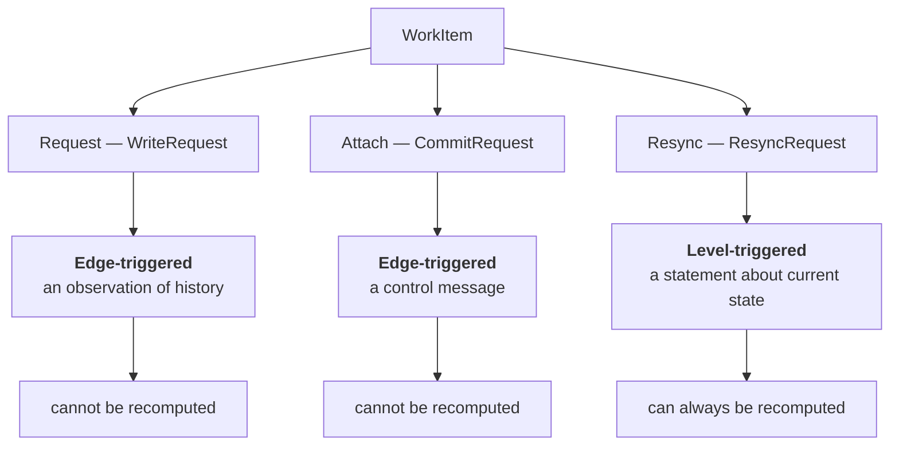
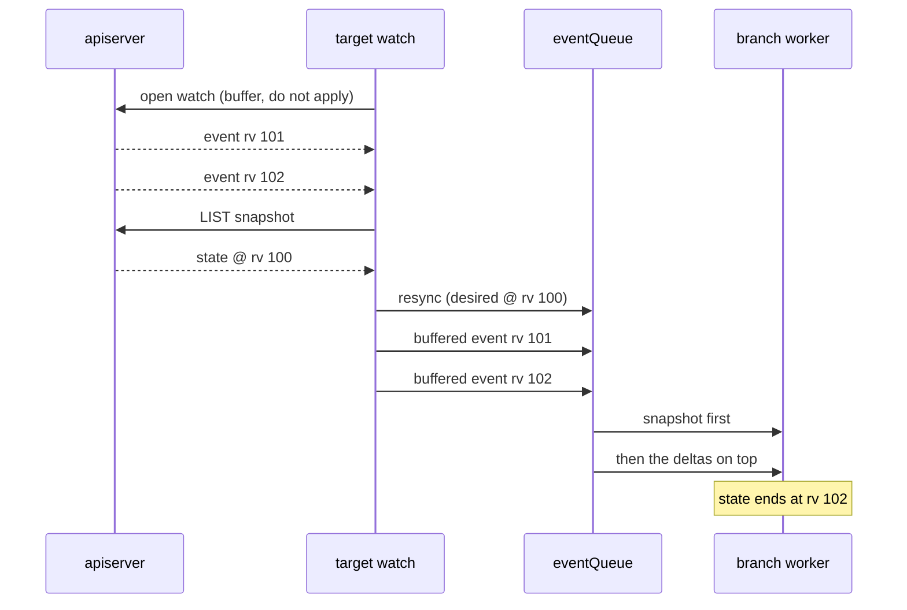
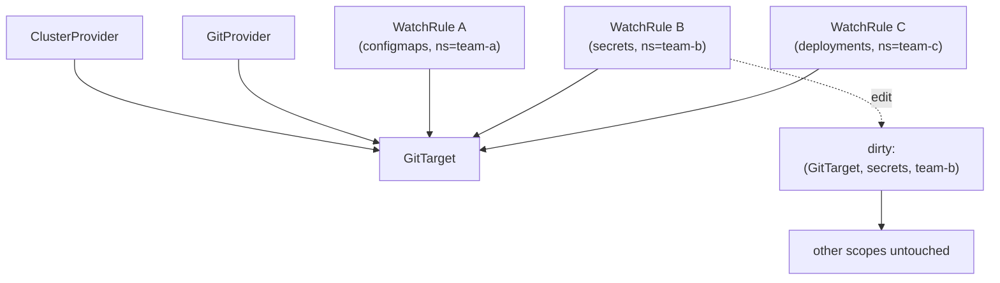

# Data-plane triggering: from an event pipe to a dirty set

> **design** — open, not yet built. Index: [`../INDEX.md`](../INDEX.md)
>
> **Not a specification.** This document is incident analysis, rationale, and
> ordering research. The implementable plan for this refactor is
> [TargetWatchPlan](target-watch-plan.md); policy semantics live in its parent,
> [Watch and catalog architecture](watch-and-catalog-architecture.md). Where this
> page and either of those disagree, they win. Sections 5 to 8 record proposals
> that were superseded during review and are kept only as the reasoning that led
> to the plan.

The reading order for this refactor:

1. [Watch and catalog architecture](watch-and-catalog-architecture.md), the
   parent architecture and policy semantics.
2. [TargetWatchPlan](target-watch-plan.md), the canonical implementable plan.
3. This document, for why any of it is necessary.

[`reconcile-triggering.md`](./reconcile-triggering.md) asks how the **control
plane** wakes up. This asks the same question one layer down, about the **data
plane**: the branch worker's event queue, what travels on it, and which of those
things should not be travelling on a queue at all.

It starts from a concrete production failure, walks the pipeline as it works
today, separates the two jobs the queue is doing, and records why the current
shape is not accidental: the snapshot and its FIFO position together solve a real
double-apply problem, and any replacement has to solve it again.

---

## 1. What happened

CI run 32848418546 dropped **595 resync requests in 16 seconds**, and all 595
were for a *single* GitTarget whose namespace was being deleted:

```text
total dropped resyncs: 595
distinct GitTargets   : 1
    595  …test-manager-unsupported-folder/unsupported-folder-dest
```

A branch worker's `eventQueue` is a 100-slot FIFO shared by **every GitTarget on
one provider and branch**. One target saturated it; unrelated GitTargets on the
same branch then waited on resyncs that never entered the queue, and their
WatchRules never reached `Ready`. Five different e2e specs failed this way across
three attempts, which is why it read as flakiness rather than as one bug.



The mechanism was edge-triggered pathology. Each stream of the deleted target
looped `replay → enqueue resync → fail → reconnect → replay`, minting a **new
payload every 2 s backoff**, for a target that could never come back.

Two fixes shipped in [#312](https://github.com/ConfigButler/gitops-reverser/pull/312):

1. A deleted GitTarget is now **terminal** for its target watches (`errGitTargetGone`),
   so the loop stops instead of reconnecting. This removed the storm at source.
2. Queued resyncs **coalesce** by `(GitTarget, scope)`, so queue depth is bounded
   by the number of distinct scopes rather than by the request rate.

Fix 2 is the interesting one, because of what it implies.

---

## 2. How the pipeline works today

Two independent inputs converge on one FIFO. Understanding why they converge is
what makes the rest of this document decidable.



The parts that matter here:

- **Object state comes from watch, not from polling.** There is no periodic object
  LIST and no hourly drift sweep. A watch that is lost and re-established replays
  with `sendInitialEvents=true` and runs a **mark-and-sweep**: everything replayed
  is marked, and at the `initial-events-end` bookmark any managed Git file that
  was not marked is deleted, because the object is gone. That sweep is the only
  thing that reconciles a delete which happened while no watch was running.
- **Attribution comes from a different source.** The audit webhook feeds a
  per-type fact stream; the grace window waits on it to name the author. This is
  why an event is not recomputable: the author of a past change exists only in
  that stream.
- **Everything funnels through one FIFO per branch.** `GitTargetEventStream →
  BranchWorker` is a synchronous FIFO, so same-object and same-type order is
  strictly preserved, and the commit window groups by `(author, GitTarget)`.

See [`../architecture.md`](../architecture.md) sections "State ingestion and not
losing deletes", "Watch event ordering", and "Mark and sweep resync" for the full
treatment.

---

### 2.1 The stream set is already declarative, but the diff is all or nothing

This is the finding that reframes the rest of this document.

`targetWatchSpecs(table)` already computes the desired stream set as a map from
`(GVR, namespace)` to that stream's operation filter. The model is there. What is
missing is a **per-key** diff:

```go
func (m *Manager) prepareTargetWatchSetReplacementLocked(...) bool {
    prior := m.targetWatches[key]
    if prior == nil { return false }
    if !force && equalTargetWatchSpecs(prior.specs, specs) {
        return true          // identical set: leave everything running
    }
    prior.cancel()           // ANY difference: cancel EVERY stream for this GitTarget
    return false
}
```

`equalTargetWatchSpecs` is whole-set equality. So a declaration is either
untouched or replaced wholesale: adding one WatchRule cancels every stream the
GitTarget has and restarts all of them, and each restarted stream replays and
enqueues its own resync.

That is the storm shape from §1, reached by ordinary configuration change rather
than by deletion.

The reason is structural, and the code says so: the render-fidelity **epoch is
per-target**, not per-stream. `beginTargetRenderFidelityEpochLocked(target, keys)`
opens one epoch covering every scope, so a scope that resumed from its cursor
instead of replaying "would otherwise leave that scope pending in the new epoch
forever."



Only the bold one is new work. The other three are a full re-replay of state that
never changed.

---

## 3. The queue is doing two unrelated jobs

`WorkItem` carries three shapes. They do not have the same nature.



### 3.1 A write is edge-triggered and irreducible

```go
type Event struct {
    Operation     string // CREATE / UPDATE / DELETE
    AuditStreamID string // "<rv>-<seq>" on the per-type audit stream
    …
}
```

An `Event` is an *observation of something that happened*. "alice deleted this
ConfigMap at stream position X" cannot be recomputed from cluster state: the
object is gone, and the author exists only in the audit fact stream. Commit
windows are keyed per `(author, GitTarget)`, and the coverage watermark `Hc`
decides historical-versus-live suppression by stream position.

Order matters, attribution matters, and both are destroyed by collapsing this to
"something changed." **This half must stay a log.**

### 3.2 A resync is level-triggered and recomputable

```go
type ResyncRequest struct {
    Desired  []manifestanalyzer.DesiredResource // gathered from the live cluster
    Scope    *ResyncScope
    …
}
```

`Desired` is a *statement about current state*, gathered by listing the live
cluster. Throwing one away loses nothing: the next gather reconstructs it, and
reconstructs it fresher. The cluster is the source of truth.

**This half does not need a queue.**

---

## 4. Why a resync carries both a snapshot and a position

This is the part that is easy to get wrong, and it is the reason the current
design looks heavier than it needs to.

A resync is not applied into a vacuum. Live events for the same scope are
arriving while it is in flight, and the snapshot it carries was gathered at some
revision. Both facts have to be reconciled, and FIFO position is how.

The clearest case is the LIST fallback, where the ordering is explicit in the
code. When `sendInitialEvents` is unsupported, `targetWatchListAndStream`:

1. opens the watch and **buffers** its events without applying them;
2. LISTs a snapshot;
3. enqueues the resync for that snapshot;
4. records the cursor;
5. only then releases the buffered live events downstream.



Invert those and the snapshot lands **after** the edits it does not contain, and
mark-and-sweep reverts them. The events are not merely redundant, they are
unapplyable out of order: an event may already be included in the snapshot, so
its value is only defined relative to the snapshot boundary.

A second gate exists for the same hazard on the attribution side. The per-target
coverage head `Hc` records how far a target's reconcile covered, so an
audit-log entry at or below `Hc` is **historical** for that target (already
folded into the reconcile) and one above it is **live** (apply as its own commit).
Without that gate, entries get applied twice: once by the reconcile, once by the
tail. The full account is in
[the snapshot tail replay investigation](../finished/signing-snapshot-tail-replay-failure-investigation.md).

So the FIFO position is not an implementation detail a dirty set can discard for
free. It is the boundary that makes "snapshot, then deltas" well defined.

---

## 5. What was proposed here, and where it went

Three proposals were drafted in this document and are **not** reproduced, because
[TargetWatchPlan](target-watch-plan.md) carries their successors in implementable
form. They are recorded here only so the path is legible:

| Drafted here | Outcome |
|---|---|
| A dirty set replacing the resync payload | Superseded. It moved the ordering problem of §4 rather than avoiding it |
| Diffing the stream set into `start` / `stop` / `keep` | Adopted, and **corrected**: it omitted `restart`, the case where a key survives and its operation filter changes. See [TargetWatchPlan](target-watch-plan.md) §2 |
| A folder-wide coverage sweep of anything no live stream covers | Superseded. It collapsed three different removal causes into one action, and one of them (an incomplete or degraded view) must never delete. See [TargetWatchPlan](target-watch-plan.md) §3 |

Two findings from this document survive intact and are load-bearing for the plan:

- **§4's ordering constraint.** A snapshot cannot be separated from the events
  behind it, which is why the plan needs an explicit fence rather than an
  assumption. That section also surfaced a live regression in the shipped
  coalescing, specified in [TargetWatchPlan](target-watch-plan.md) §4.1.
- **§2's finding** that the stream set is already declarative and only the diff
  is missing, which is what made an incremental plan a small change rather than
  a rewrite.

---

## 6. One level up: invalidation granularity

The same argument applies to the config surface. A small change to one WatchRule
among many should not imply a full resync of its GitTarget.



An event pipe quietly encourages "resync everything, it is easier." A dirty set
keyed by `(target, GVR, namespace)` makes precise invalidation the natural thing
to express instead.

The relationship graph needed for this already half-exists in the control plane:
`gitTargetToWatchRules`, `gitProviderToWatchRules`, `clusterProviderToWatchRules`
mappers, and level-triggered status marks (`MarkTargetGitPathRefused` /
`MarkTargetGitPathAccepted`, render-fidelity scope clean/diverged). The control
plane already thinks in relationships and levels; the data plane still thinks in
events for both of its jobs.

---

## 7. Related work

Everything below already exists. This note sits on top of it rather than beside
it.

**The layer above.** [Reconcile triggering](reconcile-triggering.md) asks the same
question for the control plane: how controllers wake up, why a periodic requeue is
a safety net rather than a mechanism, and which dependency edges are missing. This
document is its data-plane counterpart.

**How ingestion works.**
[Architecture](../architecture.md) is the reference, in particular "State
ingestion and not losing deletes", "Watch event ordering", and "Mark and sweep
resync". [Watch-first ingestion](../finished/watch-first-ingestion-architecture.md)
is how the watch-first model was arrived at, and
[Reconcile via WatchList and mark-and-sweep](../spec/reconcile-via-watchlist-mark-and-sweep.md)
is the mechanism this note's §4 depends on.
[Watch event ordering under the attribution grace window](../facts/watch-event-ordering-and-attribution-grace.md)
has the worked examples behind the ordering claims.

**Scopes and streams.**
[Namespace-scoped resync](watchrule-source-namespace/pr1-namespace-scoped-resync.md)
and [stream scope collapse](watchrule-source-namespace/pr2-stream-scope-collapse.md)
established the per-scope stream model and why a cluster-wide scope is a peer of a
named one rather than a replacement. That is the overlap
[TargetWatchPlan](target-watch-plan.md) §3 has to handle.

**Deletion and retention.**
[GitTarget deletion safety](watchrule-source-namespace/pr5-gittarget-deletion-safety.md)
draws the line between observed evidence and inferred deletion, which is the line
a scope close has to be placed against.
[Retention visibility](watchrule-source-namespace/pr5-retention-visibility.md)
makes a suppressed sweep observable.

**Types and identity.**
[Type lifecycle events and wobble settling](../spec/type-lifecycle-events-and-wobble-settling.md)
gives `RemovalGrace`, which the plan consumes rather than re-deciding.
[Typeset owns discovery grace](../spec/typeset-owns-discovery-grace.md) is where
that grace lives. [Type followability](../spec/type-followability.md) defines what
may be mirrored at all, and
[the GVK/GVR mapping layer](../spec/gvk-gvr-mapping-layer.md) is the identity
resolution the plan's cell identity question turns on
([TargetWatchPlan](target-watch-plan.md) §1.1).
[Unsupported folder refusal](../spec/unsupported-folder-refusal-plan.md) is the
acceptance gate that decides what a folder may contain before any of this runs.

**The longer-range picture.**
[Watch and catalog architecture](watch-and-catalog-architecture.md) is the target
model for how rules become concrete watched types.

---

## 8. Where we are

The build order for this refactor lives in
[TargetWatchPlan](target-watch-plan.md) §7, which is the single place it should
be read from. In outline: fence the coalescing regression, add provenance to
queued items, settle the cell identity question, then diff the plan so unrelated
replays stop. The semantics of removal come after, deliberately.

One thing shipped already, in
[#312](https://github.com/ConfigButler/gitops-reverser/pull/312): resyncs are
keyed and coalesced, and the storm source is fixed. That was a backstop rather
than a cure, and it introduced the ordering hazard the plan's first step now
fences.

The writes stay a log throughout. Only the resync half of the queue is in
question, and the answer is to make the stream set incremental rather than to
replace the queue.
