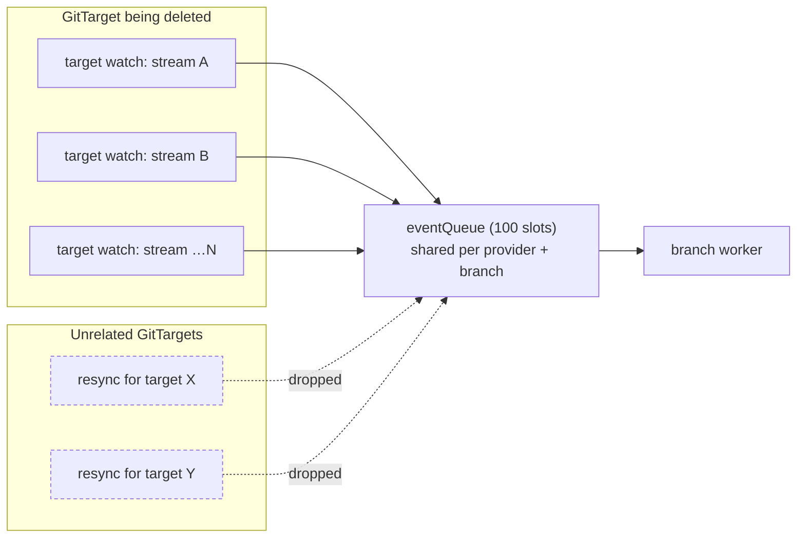
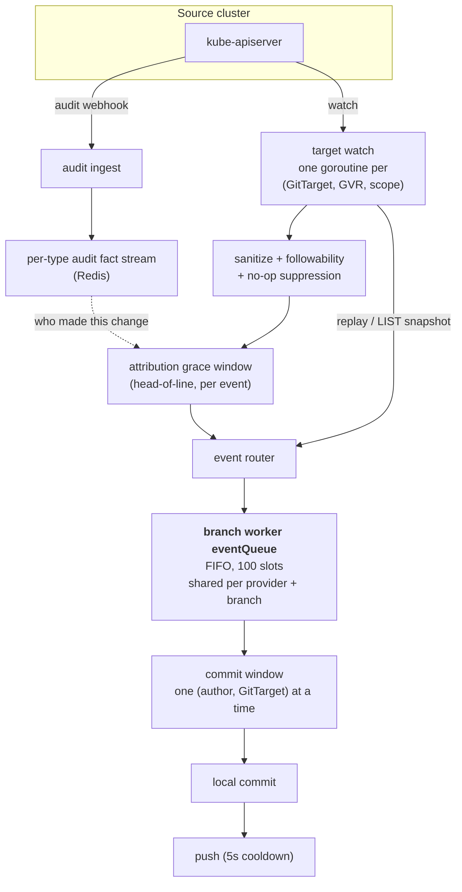
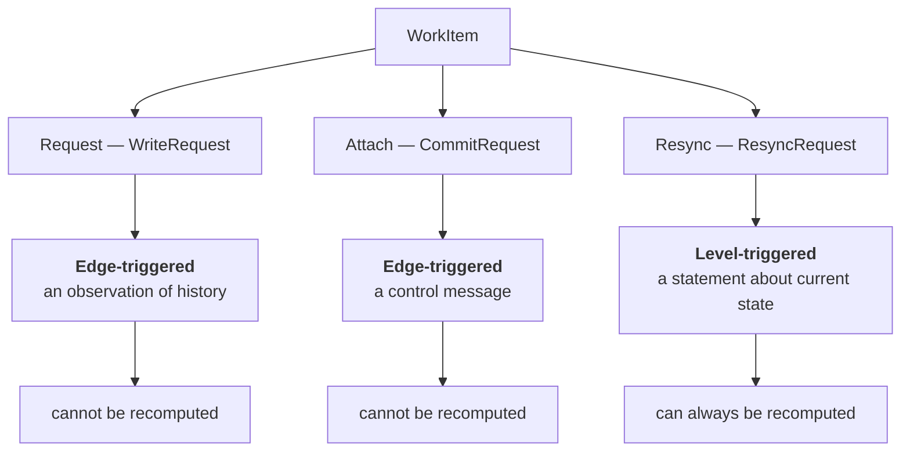
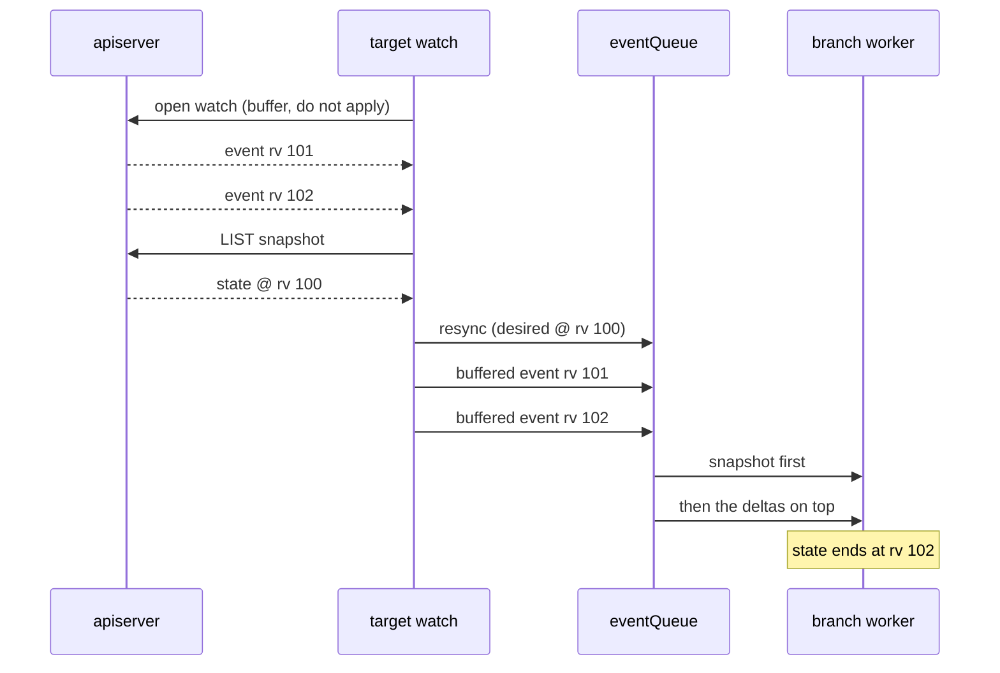
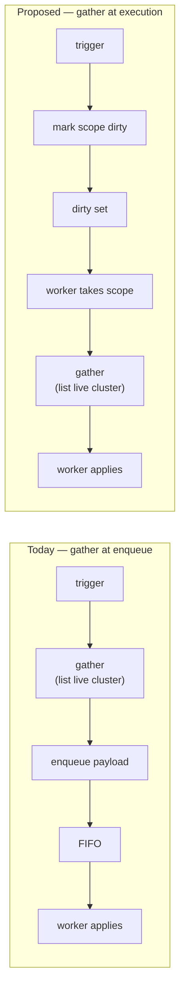
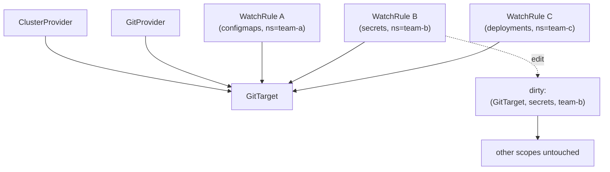
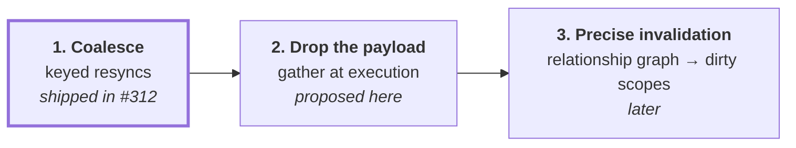

# Data-plane triggering: from an event pipe to a dirty set

> **design** — open, not yet built. Index: [`../INDEX.md`](../INDEX.md)

[`reconcile-triggering.md`](./reconcile-triggering.md) asks how the **control
plane** wakes up. This document asks the same question one layer down, about the
**data plane**: the branch worker's event queue, what travels on it, and which of
those things should not be travelling on a queue at all.

It starts from a concrete production failure, walks the pipeline as it works
today, separates the two jobs the queue is doing, and proposes moving one of them
to a level-triggered dirty set while leaving the other exactly where it is. It
also records why the current shape is not accidental: the snapshot and its FIFO
position together solve a real double-apply problem, and any replacement has to
solve it again.

---

## 1. What happened

CI run 32848418546 dropped **595 resync requests in 16 seconds**, and all 595
were for a *single* GitTarget whose namespace was being deleted:

```text
total dropped resyncs: 595
distinct GitTargets   : 1
    595  …test-manager-unsupported-folder/unsupported-folder-dest
```

A branch worker's `eventQueue` is a 100-slot FIFO shared by **every GitTarget on
one provider and branch**. One target saturated it; unrelated GitTargets on the
same branch then waited on resyncs that never entered the queue, and their
WatchRules never reached `Ready`. Five different e2e specs failed this way across
three attempts, which is why it read as flakiness rather than as one bug.



The mechanism was edge-triggered pathology. Each stream of the deleted target
looped `replay → enqueue resync → fail → reconnect → replay`, minting a **new
payload every 2 s backoff**, for a target that could never come back.

Two fixes shipped in [#312](https://github.com/ConfigButler/gitops-reverser/pull/312):

1. A deleted GitTarget is now **terminal** for its target watches (`errGitTargetGone`),
   so the loop stops instead of reconnecting. This removed the storm at source.
2. Queued resyncs **coalesce** by `(GitTarget, scope)`, so queue depth is bounded
   by the number of distinct scopes rather than by the request rate.

Fix 2 is the interesting one, because of what it implies.

---

## 2. How the pipeline works today

Two independent inputs converge on one FIFO. Understanding why they converge is
what makes the rest of this document decidable.



The parts that matter here:

- **Object state comes from watch, not from polling.** There is no periodic object
  LIST and no hourly drift sweep. A watch that is lost and re-established replays
  with `sendInitialEvents=true` and runs a **mark-and-sweep**: everything replayed
  is marked, and at the `initial-events-end` bookmark any managed Git file that
  was not marked is deleted, because the object is gone. That sweep is the only
  thing that reconciles a delete which happened while no watch was running.
- **Attribution comes from a different source.** The audit webhook feeds a
  per-type fact stream; the grace window waits on it to name the author. This is
  why an event is not recomputable: the author of a past change exists only in
  that stream.
- **Everything funnels through one FIFO per branch.** `GitTargetEventStream →
  BranchWorker` is a synchronous FIFO, so same-object and same-type order is
  strictly preserved, and the commit window groups by `(author, GitTarget)`.

See [`../architecture.md`](../architecture.md) sections "State ingestion and not
losing deletes", "Watch event ordering", and "Mark and sweep resync" for the full
treatment.

---

## 3. The queue is doing two unrelated jobs

`WorkItem` carries three shapes. They do not have the same nature.



### 3.1 A write is edge-triggered and irreducible

```go
type Event struct {
    Operation     string // CREATE / UPDATE / DELETE
    AuditStreamID string // "<rv>-<seq>" on the per-type audit stream
    …
}
```

An `Event` is an *observation of something that happened*. "alice deleted this
ConfigMap at stream position X" cannot be recomputed from cluster state: the
object is gone, and the author exists only in the audit fact stream. Commit
windows are keyed per `(author, GitTarget)`, and the coverage watermark `Hc`
decides historical-versus-live suppression by stream position.

Order matters, attribution matters, and both are destroyed by collapsing this to
"something changed." **This half must stay a log.**

### 3.2 A resync is level-triggered and recomputable

```go
type ResyncRequest struct {
    Desired  []manifestanalyzer.DesiredResource // gathered from the live cluster
    Scope    *ResyncScope
    …
}
```

`Desired` is a *statement about current state*, gathered by listing the live
cluster. Throwing one away loses nothing: the next gather reconstructs it, and
reconstructs it fresher. The cluster is the source of truth.

**This half does not need a queue.**

---

## 4. Why a resync carries both a snapshot and a position

This is the part that is easy to get wrong, and it is the reason the current
design looks heavier than it needs to.

A resync is not applied into a vacuum. Live events for the same scope are
arriving while it is in flight, and the snapshot it carries was gathered at some
revision. Both facts have to be reconciled, and FIFO position is how.

The clearest case is the LIST fallback, where the ordering is explicit in the
code. When `sendInitialEvents` is unsupported, `targetWatchListAndStream`:

1. opens the watch and **buffers** its events without applying them;
2. LISTs a snapshot;
3. enqueues the resync for that snapshot;
4. records the cursor;
5. only then releases the buffered live events downstream.



Invert those and the snapshot lands **after** the edits it does not contain, and
mark-and-sweep reverts them. The events are not merely redundant, they are
unapplyable out of order: an event may already be included in the snapshot, so
its value is only defined relative to the snapshot boundary.

A second gate exists for the same hazard on the attribution side. The per-target
coverage head `Hc` records how far a target's reconcile covered, so an
audit-log entry at or below `Hc` is **historical** for that target (already
folded into the reconcile) and one above it is **live** (apply as its own commit).
Without that gate, entries get applied twice: once by the reconcile, once by the
tail.

So the FIFO position is not an implementation detail a dirty set can discard for
free. It is the boundary that makes "snapshot, then deltas" well defined.

---

## 5. The coalescing map is already a dirty set

This is the tell. What #312 added is:

```go
pendingResyncs map[resyncKey]*ResyncRequest   // key: (GitTarget, GVR, namespace)
```

That is a dirty set, with a pre-gathered payload still bolted to each entry.
Depth is bounded by *state cardinality* (how many distinct scopes exist) rather
than by *event rate*, which is exactly the property a dirty set has and a queue
does not.

Having reached a dirty set with a payload, the question is whether the payload
earns its place.

---

## 6. Proposal: drop the payload, gather at execution

Mark `(GitTarget, scope)` dirty. Gather when the worker acts, not when the
trigger fires.



What this buys:

| | Today | Proposed |
|---|---|---|
| Memory per pending item | a full snapshot (can be MBs) | one key |
| Duplicate triggers | coalesced, with supersede bookkeeping | free: setting a bit twice is setting a bit |
| Data freshness | as of enqueue time | as of apply time |
| Storm behavior | 595 payloads, queue saturated | 595 sets of one bit |
| Code | coalescing map, ownership marker, `ErrResyncSuperseded`, supersede replies | mostly deleted |

The last row matters: this proposal **removes** most of what #312 added. That is
the good kind of change: the coalescing machinery exists to make an event pipe
behave like a dirty set, so a dirty set makes it redundant.

It is also the standard controller-runtime pattern, one layer down: dedup by key,
read state at reconcile time. The control plane already works this way. The data
plane does not.

**What it does not do is remove the problem in §4.** Gathering later shrinks the
window between snapshot and apply, but it cannot close it: events keep arriving
during the gather. So a dirty-set design still has to define the "snapshot, then
deltas" boundary, only in a different place. The honest summary is that
this proposal simplifies **bookkeeping** (no payloads, no supersede protocol) and
leaves **ordering** as hard as it is today.

---

## 7. What has to be answered first

Three things, in descending order of risk.

### 7.1 Ordering against live events (the real design work)

[§4](#4-why-a-resync-carries-both-a-snapshot-and-a-position) is the constraint. A
dirty bit has no position in the FIFO, so a design that replaces the payload must
answer, explicitly:

1. **What is the boundary?** At the moment a scope's dirty bit is consumed, which
   in-flight events for that scope are already reflected in the gather, and which
   must be applied on top of it.
2. **Who holds the deltas meanwhile?** Today the watch layer buffers them and
   releases them behind the resync. Something has to keep doing that, or the
   apiserver's ordering guarantee stops being usable.
3. **How does the gather's revision relate to `Hc`?** The coverage head decides
   historical versus live for the audit tail. A gather at a different moment
   yields a different revision, and that value has to remain the one `Hc` is set
   from, or entries get applied twice.

**This is where a wrong answer loses managed documents rather than merely wasting
work.** A snapshot applied after the edits it does not contain does not merely look
stale: mark-and-sweep deletes those edits from Git.

Settle it in writing, with tests that fail on inversion, before any code moves.

### 7.2 Where the gather lives

The watch layer holds the informers; the branch worker holds the git checkout.
Gather-at-execution either moves cluster reads into the worker, or keeps the pipe
and moves only the **trigger** to a dirty set, with the watch layer gathering on
demand. The second is much smaller and is the recommended first step.

### 7.3 The scope invariant

`ResyncScope` carries the invariant that the sweep scope must be exactly the
scope the desired set was gathered over: a narrower desired set than its sweep
scope **deletes managed documents**. Today that is enforced by gathering and
sweeping together.

Gathering at execution keeps them together, so the invariant is preserved and
arguably harder to violate: there is no window in which a stale `Desired` can be
paired with a fresh scope.

---

## 8. One level up: invalidation granularity

The same argument applies to the config surface. A small change to one WatchRule
among many should not imply a full resync of its GitTarget.



An event pipe quietly encourages "resync everything, it is easier." A dirty set
keyed by `(target, GVR, namespace)` makes precise invalidation the natural thing
to express instead.

The relationship graph needed for this already half-exists in the control plane:
`gitTargetToWatchRules`, `gitProviderToWatchRules`, `clusterProviderToWatchRules`
mappers, and level-triggered status marks (`MarkTargetGitPathRefused` /
`MarkTargetGitPathAccepted`, render-fidelity scope clean/diverged). The control
plane already thinks in relationships and levels; the data plane still thinks in
events for both of its jobs.

---

## 9. Where we are



1. **Shipped.** Resyncs are keyed and coalesced; the storm source is fixed. The
   dirty set exists, carrying payloads.
2. **Proposed.** Drop the payload. Contained, and deletes more than it adds.
   Blocked on §7.1 being written down.
3. **Later.** Express invalidation as the relationship graph so a rule change
   dirties exactly the scopes it affects.

The writes stay a log throughout. Only the resync half moves.
